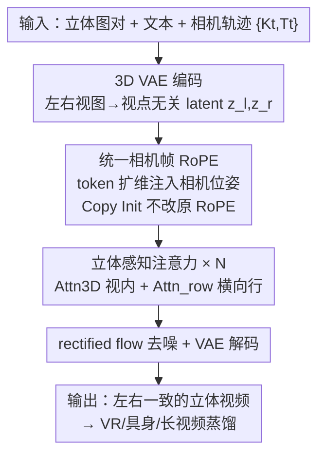

# Stereo World Model: Camera-Guided Stereo Video Generation

**会议**: CVPR 2026  
**论文**: [CVF Open Access](https://openaccess.thecvf.com/content/CVPR2026/html/Sun_Stereo_World_Model_Camera-Guided_Stereo_Video_Generation_CVPR_2026_paper.html)  
**代码**: 无（项目页 https://sunyangtian.github.io/StereoWorld-web/）  
**领域**: 视频生成 / 世界模型 / 立体视觉  
**关键词**: 立体世界模型、相机条件、相机帧 RoPE、极线注意力、双目视频生成

## 一句话总结
StereoWorld 把预训练的单目视频扩散模型改造成「相机条件的双目世界模型」，靠一个不动原 RoPE、只在 token 上扩维注入相机位姿的「统一相机帧 RoPE」，加一个利用极线先验把 4D 注意力拆成「视内 3D 注意力 + 横向行注意力」的高效立体注意力，端到端直接生成左右视图一致的立体视频，比「单目生成再后处理转立体」的强 baseline 快 3 倍、视点一致性再涨约 5%。

## 研究背景与动机

**领域现状**：当下的生成式世界模型（给定动作/相机轨迹预测未来观测）几乎都建立在**单目视频**表示上，靠大规模视频扩散先验，在可控视频合成上已经很强。也有一支 RGB-D 世界模型给视频额外配一个深度通道来引入几何。

**现有痛点**：单目观测有根本的几何缺陷——深度是隐式的、尺度是模糊的、几何一致性只能「推断」而不能「观测」，长时相机轨迹下 3D 误差会累积，导致它在需要精确几何的场景（具身智能、导航）里不可靠。RGB-D 这条路看似补了深度，但预测的深度是场景相关的、仍然尺度模糊，要靠各种 ad-hoc 归一化，跨域不稳定，而且预测深度本身就带噪。

**核心矛盾**：世界模型既想要视频扩散先验带来的高保真外观，又想要**可靠且带尺度的几何**；但单目缺几何、RGB-D 的几何（显式深度）又脏又不稳。问题根子在于：几何信号不该靠「事后再估深度」拼出来，而应该从观测里**直接拿到**。

**本文目标**：造一个把几何「锚」在双目观测里、而不是从单目运动里推深度的世界模型，要求生成的立体视频（i）时序平滑且严格跟随给定相机运动，（ii）每一帧左右视图一致；同时还得兼容各种内参、外参和基线（baseline）。

**切入角度**：立体视觉是很多生物系统的主导感知机制，双目本身就提供了对 3D 结构直接、鲁棒的几何线索。作者据此主张：让模型在 RGB 模态内同时学外观和双目几何，几何由视差（disparity）天然地 ground 住，既不用产出/稳定显式深度图（避开 RGB-D 的麻烦），又能保留视频扩散的强先验。

**核心 idea**：用「在 token 上扩维注入相机 RoPE（不改原 RoPE）+ 用极线先验把立体注意力降维」这两招，把单目视频扩散模型微调成端到端的相机条件立体世界模型。

## 方法详解

### 整体框架
给定一对校正过的立体图像 $(I_\text{left}, I_\text{right})$、基线 $b$、场景文本提示 $c$，以及一条相机轨迹动作 $\{cam_t\}=\{(K_t, T_t)\}$（内参 $K$、外参 $T$，$t=1\dots N$），StereoWorld 要生成一段跟随该相机运动、且逐帧左右一致的立体视频。

它建立在一个预训练的潜空间视频扩散模型上（3D VAE + DiT，rectified flow 去噪）——这是脚手架，提供时空先验和视觉保真。在它之上 StereoWorld 加了两块真正的贡献：（a）**统一相机帧 RoPE**，把骨干的潜 token 空间扩维，并注入相机感知的旋转位置编码，让模型能在「时间 × 左右视图」上联合推理，同时最小化对预训练先验的扰动；（b）**立体感知注意力**，把跨视图融合拆成「视内 3D 注意力 + 横向行注意力」，在算力和极线对齐精度之间取得平衡。左右视图用同一个 VAE 以「视点无关」的方式编码成 $\{z_\text{left}, z_\text{right}\}$，整条 DiT 在这两个 latent 上以立体注意力块（重复 $N$ 次）去噪，最后 VAE 解码回像素得到立体视频。

### 关键设计

**1. 统一相机帧 RoPE：在 token 上扩维注入相机，而不是去改原来的 RoPE**

痛点很具体：要把相机条件（含不同基线的立体相机、动态相机运动）灌进预训练 DiT，但又不能砸坏它的先验。老办法把 Plücker 射线图拼到输入通道上，编的是**绝对坐标**，对参考帧选择敏感、把视点和场景布局纠缠在一起，跨基线/位姿泛化差；后来的 GTA/PRoPE 改用相对相机位姿（把式 (3) 里的相对旋转 $R_{\Delta t,\Delta x,\Delta y}$ 换成相机相对旋转 $R^{\Delta cam}_{\Delta t,\Delta x,\Delta y}$，其中 $R^{cam_j}=\mathrm{diag}(I_{d/8}\otimes P_j,\ R_{t,x,y})$，$P_j=\mathrm{diag}(K_j,1)T_j$），泛化更好。但问题是：直接照 PRoPE 那样**重参数化原 RoPE**，会严重扰乱预训练模型——因为 DiT 的注意力权重、归一化统计、token 基底都是和原 RoPE 频率、轴划分**协同适配**好的，一动就崩。

作者的做法是**不动原编码、只扩 token 维度**。把自注意力的特征维从 $d$ 扩到 $d+d_c$，新增的 $d_c$ 维专门承载相机 RoPE：$\tilde q_{(t,x,y)}=[q_{(t,x,y)};\,q^{cam}_{(t,x,y)}]\in\mathbb{R}^{d+d_c}$，对应的旋转矩阵也扩成块对角 $\tilde R^{cam_t}_{t,x,y}(d+d_c)=\mathrm{diag}\big(R_{\Delta t,\Delta x,\Delta y}(d),\ I_{d_c/4}\otimes P_t\big)$，最终统一相机帧 RoPE 为 $\tilde R^{\Delta cam}_{\Delta t,\Delta x,\Delta y}=\tilde R^{cam_1}(\tilde R^{cam_2})^\top$。关键在于：前 $d\times d$ 块和式 (3) 一模一样，**完全对齐预训练先验**，新增的 $d_c\times d_c$ 块是一条「正交、相机条件」的旁路通道。新通道的初始化作者比了两种——Zero Init（新权重置零，初始输出等同原模型，但相机信号难激活、训练慢、相机精度低）和 **Copy Init**（用**时序注意力权重**初始化新子空间，因为相机和时序嵌入都作用在帧级别，给了个好起点又几乎不动原行为）。这个「扩维而非重参数化」正是它和 PRoPE 的本质区别，实测训练更稳、收敛更快。

**2. 立体感知注意力：用极线先验把 4D 注意力拆成「视内 3D + 横向行」**

痛点是算力。有了统一相机帧表示后，最朴素的立体生成器会把左右 token 沿序列维拼起来做**全 4D 联合注意力**（$f^{in}\in\mathbb{R}^{b\times 2f\times h\times w\times c}$），同时耦合空间、时间、视点；但注意力开销随 token 数平方增长，对视频合成来说算不动。

作者的观察是：**在校正过的立体对里，极线是水平对齐的**——也就是左右视图的对应点一定落在同一条扫描线（同一行）上。于是把 4D 注意力分解成两支：（a）**视内 3D 注意力** $\text{Attn}_{3D}$，每个视图各自做空间-时间注意力；（b）**横向行注意力** $\text{Attn}_{row}$，跨视图只在「同一时刻、同一水平行」上的 token 之间算注意力。最终输出把两支相加：$f^{out}=\text{Attn}_{3D}(f^{in})+\text{Attn}_{row}(f^{in})$。这样整体复杂度从 $O((2fhw)^2)$ 降到 $O(2(fhw)^2)+fh(2w)^2)$。之所以有效：立体匹配在几何上本就只发生在水平极线上，全 4D 注意力里绝大多数跨视图 token 对是冗余的；只保留同行的跨视图交互，既抓住了视差对齐的对应关系，又把跨视图那一项的开销从「整张图 × 整张图」砍到「单行 × 单行」。消融里它把 FLOPs/FPS 改善约 50%，视觉质量几乎不掉、视点一致性甚至略升。

### 损失函数 / 训练策略
基于视频生成模型 **Wan2.2-TI2V-5B** 实现，在表 1 的混合数据集上训练。每个视频片段 49 帧，裁剪缩放到 $480\times640$。用 AdamW 训练 20k 步，batch size 24，24 张 NVIDIA H20 GPU，学习率 1e-4。去噪遵循 rectified flow 形式。值得强调的是：**全程不用任何深度监督**，几何信号完全来自双目图像本身。

## 实验关键数据

评测集由 435 张立体图构成，采样自 FoundationStereo、UnrealStereo4K、TartanAir 测试集（合成）和 Middlebury（真实），覆盖室内外、多种纹理和基线。指标涵盖视觉质量（FID/FVD/CLIP-T/CLIP-F）、相机精度（RotErr/TransErr）、左右视图同步（Mat. Pix. 匹配像素、FVD-V、CLIP-V）和速度（FPS）。

### 主实验
所有 baseline 都是「SOTA 相机可控视频生成 + 事后转立体」：RGB-D 模型直接用预测深度 warp 出另一视图，RGB 模型先用 DepthCrafter 估深度再 warp（都靠 StereoCrafter 做 warp-inpainting）。

| 方法 | 模态 | FID↘ | FVD↘ | RotErr↘ | TransErr↘ | Mat.Pix.(K)↗ | CLIP-V↗ | FPS↗ |
|--------|------|------|------|---------|-----------|--------------|---------|------|
| Voyager | RGBD | 226.97 | 170.37 | 1.34 | 0.25 | 4.26 | 91.41 | 0.03 |
| DeepVerse | RGBD | 191.32 | 176.72 | 1.51 | 0.16 | 4.48 | 93.86 | 0.35 |
| Aether | RGBD | 185.72 | 152.97 | 1.50 | 0.13 | 4.35 | 93.71 | 0.11 |
| SEVA | RGB | 195.70 | 170.92 | 1.09 | 0.51 | 4.49 | 94.73 | 0.10 |
| ViewCrafter | RGB | 211.89 | 185.76 | 1.24 | 0.20 | 4.49 | 93.51 | 0.13 |
| Ours Monocular | RGB | 126.83 | 96.87 | 1.36 | 0.14 | — | — | — |
| **Ours Stereo** | RGB | **111.36** | **83.04** | **1.01** | **0.11** | **4.56** | **97.50** | **0.49** |

本文在视觉质量（FID 111 vs 次优 126，FVD 83 vs 97）、相机精度、视图同步（CLIP-V 97.50 vs 94.73）上全面领先，FPS 0.49 也明显高于绝大多数多阶段 baseline（论文称相对 SOTA 转立体方案约 3× 加速、视点一致性约 +5%）。VBench 上同样最优（Aesthetic 44.27、Imaging 66.51）。

### 消融实验

相机注入策略（表 4，TartanAir）：

| 配置 | FID↘ | FVD↘ | RotErr↘ | TransErr↘ | 说明 |
|------|------|------|---------|-----------|------|
| Plücker Ray | 142.46 | 130.39 | 1.52 | 0.21 | 绝对坐标，泛化差 |
| PRoPE | 144.45 | 128.32 | 1.33 | 0.18 | 重参数化原 RoPE |
| Ours Zero Init | 131.07 | 96.62 | 1.81 | 0.24 | 保先验但相机难激活 |
| **Ours Copy Init** | **122.41** | **93.17** | **1.16** | **0.15** | 用时序权重初始化 |

注意力方案（表 5）：

| 配置 | CLIP-T↗ | CLIP-V↗ | FLOPs(×10¹⁰)↘ | FPS↗ | 说明 |
|------|---------|---------|---------------|------|------|
| 4D Attn | 25.74 | 97.55 | 3.11 | 0.34 | 全联合注意力 |
| **Stereo Attn** | 25.43 | 97.05 / 96.63 | **1.56** | **0.49** | 极线分解 |

> ⚠️ 表 5 原文 CLIP-V 列同时出现 97.05 与 96.63 两个数值（排版含两栏），以原文为准。

### 关键发现
- **Copy Init 是相机注入的关键**：相比 Zero Init，用时序注意力权重初始化新相机子空间，相机精度（RotErr 1.16 vs 1.81）和视觉质量同时变好——因为相机条件和时序条件都作用在帧级，时序权重是天然的好起点。
- **极线分解几乎零代价提速**：Stereo Attn 把 FLOPs 从 3.11 砍到 1.56、FPS 从 0.34 提到 0.49（约 50% 提升），而视觉质量只微降、视图一致性基本持平——印证了「跨视图交互本就集中在水平极线上」的几何先验是对的。
- **端到端避免了误差累积**：转立体 baseline 依赖深度估计+warp+inpaint，在细节区（如铁丝网）易错且色调不一致；本文先生成立体对再估视差，视差图明显更干净、且不会把 RGB 纹理串进深度。
- **无深度监督也能拿到尺度几何**：模型只用双目信号训练，却能从生成结果里直接恢复 metric-scale 深度。

## 亮点与洞察
- **「扩维 vs 重参数化」是注入条件的通用思路**：要给预训练大模型加新条件又不想砸坏先验，与其改原编码，不如开一条正交旁路通道、把原通道原封不动留给先验——这个 trick 可迁移到任何「微调时怕破坏 RoPE/位置编码」的场景。
- **把领域几何先验直接写进注意力稀疏模式**：极线水平对齐这条立体几何硬约束，被翻译成「跨视图只在同一行算注意力」，是用结构先验换算力的范例，比让模型自己从全 4D 里学出来高效得多。
- **绕开显式深度，用 RGB+视差闭环拿几何**：不产出脏的深度图、只生成立体对再估视差，把「世界模型该不该显式建几何」这个问题给了一个优雅答案——几何可以隐含在双目一致性里。

## 局限与展望
- **依赖校正过的立体输入**：横向行注意力的高效性建立在「极线水平对齐」上，未校正/任意位姿的双目输入需要先校正，否则该先验失效。
- **几何由双目隐式 ground，未直接监督**：好处是省深度标注，但代价是几何精度上限取决于生成的左右一致性，论文未给出生成视差与真值深度的量化误差对比，metric 深度的绝对精度还需进一步验证。
- **代码未开源**（仅项目页），部分关键细节（长视频蒸馏、FLOPs 计算）放在补充材料，复现门槛较高。
- 长时交互合成靠蒸馏成 4 步因果模型 + KV cache 把 0.49 FPS 提到 5.6 FPS、生成 10 秒立体视频，但这是单独的蒸馏环节，质量-速度权衡未在正文充分展开。

## 相关工作与启发
- **vs 单目转立体（StereoCrafter / StereoDiffusion / SVG）**: 它们先估深度再 warp+inpaint，是非端到端的多阶段管线，依赖深度质量、易在细节处误差累积；本文端到端直接生成立体对，左右一致性和速度都更好。
- **vs RGB-D 世界模型（Voyager / DeepVerse / Aether）**: 它们显式产出深度通道，但深度尺度模糊、跨域不稳、纹理易串进深度；本文不产显式深度，用双目视差 ground 几何，拿到的是更干净、带尺度的几何。
- **vs 相对相机位姿编码（PRoPE / GTA）**: 同样追求相对、可泛化的相机条件，但 PRoPE 重参数化原 RoPE 会破坏预训练先验；本文改成 token 扩维注入，前 $d$ 维完全保留先验，训练更稳、收敛更快（表 4 印证）。

## 评分
- 新颖性: ⭐⭐⭐⭐⭐ 首个端到端相机条件立体世界模型，「扩维注入 RoPE + 极线分解注意力」两招都很有针对性
- 实验充分度: ⭐⭐⭐⭐ 主结果+两组消融+三类应用齐全，但缺生成视差对真值深度的量化精度，且无 metric 深度误差表
- 写作质量: ⭐⭐⭐⭐ 动机链条清晰、公式完整；个别表格排版有歧义（表 5 CLIP-V 双值）
- 价值: ⭐⭐⭐⭐⭐ 直接打通 VR/AR 双目渲染与具身 metric 几何，无需深度估计与 inpaint 管线，落地价值高

<!-- RELATED:START -->

## 相关论文

- [\[CVPR 2026\] StereoWorld: Geometry-Aware Monocular-to-Stereo Video Generation](stereoworld_geometry-aware_monocular-to-stereo_video_generation.md)
- [\[CVPR 2026\] Yume1.5: A Text-Controlled Interactive World Generation Model](yume15_a_text-controlled_interactive_world_generation_model.md)
- [\[CVPR 2026\] Physical Object Understanding with a Physically Controllable World Model](physical_object_understanding_with_a_physically_controllable_world_model.md)
- [\[CVPR 2026\] VerseCrafter: Dynamic Realistic Video World Model with 4D Geometric Control](versecrafter_dynamic_realistic_video_world_model_with_4d_geometric_control.md)
- [\[CVPR 2026\] Unified Camera Positional Encoding for Controlled Video Generation](unified_camera_positional_encoding_for_controlled_video_generation.md)

<!-- RELATED:END -->
