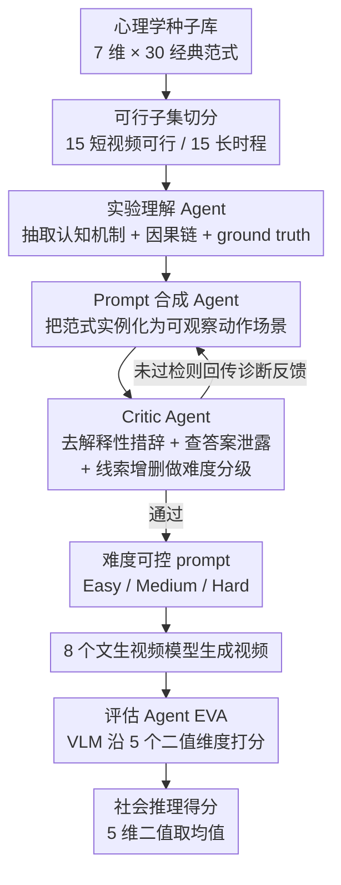

# SVBench: Evaluation of Video Generation Models on Social Reasoning

**会议**: CVPR 2026  
**论文**: [CVF Open Access](https://openaccess.thecvf.com/content/CVPR2026/html/Peng_SVBench_Evaluation_of_Video_Generation_Models_on_Social_Reasoning_CVPR_2026_paper.html)  
**代码**: https://github.com/Gloria2tt/SVBench-Evaluation  
**领域**: 视频生成 / Benchmark / 社会推理评测  
**关键词**: 文本生成视频、社会推理、心智理论、智能体 pipeline、VLM 评判

## 一句话总结
SVBench 是首个针对「视频生成模型社会推理能力」的评测基准：作者把发展与社会心理学里 30 个经典实验范式抽成 7 个社会认知维度，用一条全程免训练的四智能体流水线把抽象范式自动转成难度可控、不泄露答案的视频 prompt，再用高能力 VLM 沿 5 个二值维度打分，对 8 个主流文生视频模型做了首次系统评测，发现它们「画面看着对、社会逻辑普遍不对」。

## 研究背景与动机

**领域现状**：文生视频（text-to-video）模型在视觉真实度、运动保真度、文本-视频对齐上进步飞快，扩散/Transformer 架构已能合成光影细腻、多智能体交互的动态场景。配套的评测基准（VBench、EvalCrafter、T2V-CompBench、Morpheus、PhyCoBench 等）也从单纯画质指标，走向了按维度拆解的细粒度诊断，甚至开始测物理合理性。

**现有痛点**：这些基准几乎清一色盯着**感知层/物理层**——运动平滑度、视觉质量、物理守恒、动作一致性。它们能回答「画面看上去合不合理」，却回答不了一个更深的问题：当 prompt **没有明说**目标结果时，模型生成的行为是否在**社会与因果意义上**站得住脚。论文给了两个例子：公园长椅上哭泣的女孩旁边掉了冰淇淋、旁边坐着一位女士——人类瞬间会推断因果链并预期女士去安慰;一个成年人掉了夹子捡不起来、看着旁边幼儿并指向夹子——人类立刻读出这是「求助」、预期孩子会去帮忙(发展心理学显示 14–18 个月的婴儿就懂这种未完成意图)。模型会不会生成「安慰/因果关联/帮忙」这些社会推理行为，还是只渲染一个字面场景？

**核心矛盾**：**物理推理决定事件在视觉上怎么发生，社会推理决定智能体的行为是否社会与因果恰当**。当前系统擅长前者，在后者上受限。而且视频领域过去只把社会智能当成「分析/判别」问题（Social-IQ、R3-VQA 都是对已有视频做 QA），从没人评测过模型能不能**从零生成**社会连贯的多智能体交互。

**本文目标**：建一个理论扎实、可解释、可规模化的基准，专门测视频生成模型的社会推理;同时要解决两个工程难题——(1) 怎么把抽象心理学范式自动变成「不泄露答案、难度可控」的视频 prompt;(2) 社会行为没有唯一正确答案，怎么自动评分。

**切入角度**：把基准**锚定在发展与社会心理学**的成熟结论上——这些学科收敛出 7 个社会认知核心成分，而它们天然映射到视频「随时间因果展开」的本质。

**核心 idea**：用「心理学范式种子库 + 免训练四智能体流水线 + 五维二值 VLM 评判」三件套，把社会认知实验**自动化地**搬进视频生成评测，无需人工标注即可大规模评估。

## 方法详解

### 整体框架
SVBench 的输入是 30 个经典心理学实验范式（种子库），输出是 8 个文生视频模型在社会推理上的细粒度得分。中间是一条**两阶段、全程免训练**的智能体流水线：**生成侧**用 3 个智能体把抽象范式逐步变成具体、中性、难度分级的视频 prompt;**评估侧**用 1 个 VLM 智能体（EVA）把生成的视频沿 5 个二值维度打分。整条链路不需要训练任何模型、也不需要逐条人工标注，因此可规模化。

由于当前视频模型只能产 5–10 秒、含 1–2 个显著动作的短片，作者先把 30 个范式切成两组：15 个**短视频可行**（单场景、少量智能体、靠注视/手势/姿态/空间布局等可视线索就能表达）作为本文主基准;另 15 个**长时程**范式（如延迟满足、多步欺骗、多阶段联合规划）因为推理结构要跨多事件展开，放进附录留给未来长视频模型。

### 关键设计

**1. 七维社会认知种子库：把心理学范式翻译成视频可评测的任务**

基准的灵魂在于「评什么」要有理论根基，而不是作者拍脑袋编的场景。作者从发展与社会心理学里收敛出 7 个社会认知核心维度——心智状态推理（Mental State Reasoning）、目标导向动作（Goal-Directed Action）、联合注意与视角（Joint Attention and Perspective）、社会协调（Social Coordination）、情绪与亲社会行为（Emotion and Prosocial Behavior）、社会规范与空间（Social Norms and Spacing）、多智能体社会策略（Multi-Agent Social Strategy）——每个维度都对应有据可查的经典实验范式（如 Sally-Anne 心智理论测试、绕道取物、注视跟随、指向理解、工具性帮助、个人空间 proxemics 等），共选 30 个范式作为种子，保证了**强理论锚定 + 可解释性**。关键的工程判断是「可行子集切分」：考虑到短视频只能表达单场景少动作，把 30 个范式按「能否在 5–10 秒单镜头内充分表达核心社会线索」二分，15 个进主基准、15 个长时程范式（要跨多事件展开）进附录。这一步让基准既理论完整、又契合当下模型的真实能力边界。

**2. 三智能体生成流水线：从抽象范式到「不泄露答案、难度可控」的视频 prompt**

直接把心理学实验描述丢给视频模型行不通——描述里往往带着「她意识到…于是决定帮忙」这类把答案写在脸上的解释性语言，会变成「教模型应试」，评测就失真了。作者用三个串行智能体逐步净化:**实验理解 Agent** 先为每个种子生成结构化理解，含四要素——formal description（形式化描述被测心理现象）、key concepts（相关认知机制）、test point（具体被评的推理能力）、ground truth（预期行为结果），强制模型「先想清实验设计再生成场景」，减少概念漂移、给出可解释的中间表示;**Prompt 合成 Agent** 按四条原则把抽象概念落成可观察动作序列——动作导向（只描述可见行为、排除内心状态与预期结果）、时间可行（适配 5–10 秒）、具体实例化（用具体年龄/性别/物种而非抽象占位符）、评估就绪（动作描述与预期结果分离）;**Critic Agent** 做三件事:① 删除「realizes/feels sad/decides to help」这类解释性措辞，把「女人意识到男人够不到书并决定帮忙」改写成「男人伸手够高架上的书但够不着;女人注意到并走向书架」，只留行为线索;② 比对 test point 检测 ground-truth 泄露，若答案被明说就**返回结构化纠错指令**给合成 Agent;③ 通过增删心理线索（注视、表情）、动作线索（伸手、指向）、情境线索（物体摆放、affordance）做难度分级——easy 含冗余线索、medium 只留推理最低必需、hard 移除或遮蔽核心线索逼出更微妙的推理。最妙的是 Critic 不是简单拒绝，而是**返回诊断反馈（违规类型 + 修改建议）让合成 Agent 重生成，迭代直到同时满足中性、不泄露、难度三项要求**，产出一池经校验的难度可控 prompt。

**3. EVA 五维二值评估：用 VLM 当结构化裁判，把「没有唯一正确答案」的社会行为变成可判定的事实问句**

社会交互不像确定性任务有唯一 ground truth——一个「帮忙」场景可由无数合理行为实现，所以评估必须从「跟某段参考视频比保真度」转向「实验范式的预期社会逻辑有没有正确涌现」。作者刻意**不用连续分数**:VLM 在多样 prompt 间难以校准细粒度数值尺度，连续分噪声大、不稳定。取而代之用 5 个**二值**维度，把评估框成一连串无歧义的事实问句（如「智能体是不是基于它能看到的东西做出反应？」），更贴近人类的类别化判断、显著降低 VLM 评分的轮间方差。五维是:D1 核心范式复现（核心心理现象是否被正确实例化）、D2 Prompt 忠实度（是否遵守指定的智能体/物体/场景，防语义绕过）、D3 社会连贯性（行为是否因果与社会合理）、D4 社会线索有效性（注视、手势等关键感知线索的呈现）、D5 视频合理性（视觉稳定性基线，把生成失败和推理错误隔离开）。每维 $D_k \in \{0,1\}$，总分取均值:

$$S_{overall} = \frac{1}{5}\sum_{k=1}^{5} D_k$$

这套二值设计带来三个好处:能**解耦失败模式**（区分「生成失败」还是「推理失败」——比如某视频画面稳定 D5=1 但核心实验没做、prompt 没遵守、注视线索缺失，其余四维给 0）、靠降低 VLM 校准噪声保证**鲁棒性**、并对未来更复杂场景有**可扩展性**。评估前 EVA 先重建实验的预期逻辑，再判断视频是否展现了恰当的因果结构、社会线索与行为合理性。

### 损失函数 / 训练策略
本文是评测基准，全程**免训练**——三个生成侧智能体与一个评估侧 EVA 都基于现成大模型（评估用 Gemini 2.5 Pro 作 VLM 裁判），不更新任何参数，因此无损失函数与训练流程。

## 实验关键数据

主实验聚焦 15 个短视频可行任务，每个任务设 3 个难度 × 每难度 3 条 prompt = **135 条评测 prompt**;长时程任务结果放补充材料。被评模型共 8 个：闭源 4 个（Sora2pro、Kling2.5-turbo、Veo-3.1、Hailuo02-S）、开源 3 个（HunyuanVideo、LTX-1.0、Longcat-Video），表 2 中还含 Wan2.2，合计 8 列。⚠️ 摘要里写「seven state-of-the-art」、正文与表却是「eight」，模型计数原文自相矛盾，**以原文为准**。

### 主实验：8 模型在 15 个社会推理任务上的总体表现（表 2，单位 %，越高越好）

| 模型 | 类型 | Overall | 代表强项 / 弱项 |
|------|------|---------|------|
| Sora2pro | 闭源 | **79.6** | Empathic Concern 100、Turn Taking 94.3，全面领先 |
| Veo-3.1 | 闭源 | 72.4 | Empathic Concern 100、Pointing 82.5，紧随其后 |
| Hailuo02-S | 闭源 | 56.4 | Dominance/Empathic 80，多智能体协调偏弱 |
| Kling2.5-turbo | 闭源 | 52.2 | 依赖显式线索，抽象社会推断弱 |
| Wan2.2 | 开源 | 48.3 | Emotion Contagion 88.9，但整体波动大 |
| Longcat-Video | 开源 | 39.2 | 开源里相对最强但仍受限 |
| HunyuanVideo | 开源 | 30.8 | 因果/信念推理任务普遍失败 |
| LTX-1.0 | 开源 | 27.6 | 垫底，复杂社会推理几乎不能 |

关键结论：Sora2-Pro 与 Veo-3.1 在几乎所有类别明显领先，在目标理解、联合注意、亲社会行为上多数子任务 >80%，说明顶级闭源系统**即便没有显式线索工程，也已具备人类动作因果、注视方向、意图驱动交互的强隐式先验**;Hailuo02-S/Kling2.5-Turbo 在需要多智能体协调（Leader-Follower）或抽象社会推断（基于视觉视角的帮助）的任务上失败率 >50%，但在 Pointing Comprehension 这类有显式线索时明显回升，**更依赖表层视觉信号**;开源模型则在几乎所有维度都处于显著更低水平，凸显闭源与开源生态在复杂社会推理上的鸿沟。

### 分析一：生成流水线分阶段消融（表 3，人工判定 prompt 合格率 %）

| 维度 | No Understanding | +Synthesis | Full（含 Critic） |
|------|------|------|------|
| Goal Directed Action | 68.1 | 76.5 | 87.5 |
| Joint Attention & Perspective | 66.5 | 75.2 | 86.3 |
| Social Coordination | 67.2 | 74.5 | 86.5 |
| Emotion & Prosocial | 68.3 | 78.3 | 88.2 |
| Social Norms & Spacing | 66.4 | 77.2 | 87.2 |
| Multi-Agent Strategy | 65.6 | 73.5 | 85.6 |
| Mental State Reasoning | 65.8 | 76.1 | 87.2 |
| **Average** | **66.8** | **75.9** | **86.9** |

合格率从「无概念理解」的 66.8% → 加入实验理解+合成后 75.9% → 再加 Critic 精修后 86.9%，证明**推理感知的生成阶段与 critic 驱动的纠错都不可或缺**。

### 分析二：难度分级有效性（表 4，4 个闭源模型在 Easy/Mid/Hard 的平均合格率 %）

| 模型 | Easy | Mid | Hard |
|------|------|------|------|
| Sora2pro | 73.8 | **84.8** | 79.4 |
| Veo3.1 | 66.6 | 74.4 | **75.8** |
| Hailuo02-S | 62.6 | 56.8 | 49.8 |
| Kling2.5turbo | 58.0 | 54.0 | 44.6 |

弱模型（Hailuo02-S、Kling2.5-Turbo）呈现清晰的 Easy>Medium>Hard 单调下降，证明**更丰富的社会线索确实能帮推理能力弱的模型**;而 Sora2-Pro/Veo3.1 出现反转——在 medium/hard（线索更少）反而峰值。作者归因为它们内在社会推理强，能在最小信息下推断社会意图，额外线索反而带来冗余/冲突信号、在 5–10 秒内无法完美呈现，导致 Prompt Faithfulness 等其他维度被扣分。这说明 cue-based 难度设计既控制了推理复杂度，又揭示出**不同模型的推理 regime**（高水平系统对线索稀疏鲁棒，低水平模型重度依赖外部线索补足）。

### 关键发现
- **画面合理 ≠ 社会合理**：所有模型都存在「surface-level plausibility 与 deeper social reasoning 之间的明显落差」，即便最强模型也在基于信念的推断、微妙线索整合、多智能体协调上系统性失败。
- **EVA 与人类高度对齐但阈值有别**：分层抽样 8 模型 × 20 = 160 视频、10 名标注者复评，VLM 裁判与人类在各维度相对趋势高度一致;但人类在感知维度（D2/D4/D5）更宽容（合格率接近天花板）、在推理密集维度（D1/D3）更严格——「能容忍表层瑕疵，但不容忍逻辑错误」。
- **典型失败案例**：注视跟随实验里，视频生成了「画质合理但社会逻辑错误」的对话场景（互相对视而非女方注视引导男方看向抽屉），EVA 正确给 D5=1、其余四维=0，精准定位「核心实验未执行」。

## 亮点与洞察
- **把心理学实验当成「自动化 prompt 工厂的种子」**：用结构化四要素（description/key concepts/test point/ground truth）把范式蒸馏成可机器消费的中间表示，是「理论锚定」落地为「可规模化数据」的关键一跳，思路可迁移到任何「抽象概念 → 评测样本」的基准构建。
- **Critic Agent 的「去答案泄露」很硬核**：把「她意识到…决定帮忙」改写成纯行为描述，本质是在防止评测被 prompt 本身污染——这是判别式基准里常被忽视、生成式基准里却致命的问题。
- **二值维度替代连续分**：用「一系列无歧义事实问句」对冲 VLM 的尺度校准噪声，并能解耦「生成失败 vs 推理失败」，是用 VLM 做裁判时一个很实用的稳健化 trick。
- **难度反转现象有诊断价值**：强模型在 hard 条件反而更好，揭示了「线索冗余对强模型是干扰」这一反直觉规律，给后续 prompt 设计提了醒。

## 局限与展望
- **主基准只覆盖 15 个短视频可行范式**：另 15 个长时程范式（延迟满足、多步欺骗、多阶段规划）因当前模型只能产 5–10 秒短片被排除，社会推理里最难的「跨时间信念追踪」其实没被主基准触及。
- **评测重度依赖单一 VLM 裁判（Gemini 2.5 Pro）**：虽与人类趋势对齐，但 VLM 自身的社会推理偏见会直接传导进评分;且人工验证只在 160 个 clip 的分层子集上做，规模有限。
- **模型计数原文不一致**：摘要「seven」、正文/表「eight」，⚠️ 以原文为准;Wan2.2 在表 2 出现但 setup 段落未明确列入开源三选，存在表述出入。
- **二值打分牺牲了细粒度**：把每维压成 0/1 换来了稳健性，但也丢失了「部分正确」的信息，对接近阈值的边界 case 可能偏粗。
- **改进方向**：随长视频生成成熟把 15 个长时程范式纳入主基准、引入多 VLM 集成或人机混合裁判降低单模型偏见、把二值与置信度结合做更细的失败归因。

## 相关工作与启发
- **vs VBench / EvalCrafter / VBench-2.0**：它们做感知与物理层评测（画质、运动平滑、物理合理、commonsense），SVBench 做社会与因果层——回答「目标未明说时行为是否社会恰当」，是正交补充而非替代。
- **vs Morpheus / PhyCoBench**：那两者用真实物理实验/守恒律探针测物理推理，SVBench 用心理学实验范式测社会推理，同样是「把某学科的经典实验搬进视频评测」的范式，但目标从物理转向心智。
- **vs Social-IQ / R3-VQA**：它们在**已有**人造视频上做社会推理 QA（判别式），SVBench 评测模型能否**从零生成**社会连贯交互（生成式）——这是论文反复强调的核心 gap。
- **vs LLM 的 ToM 基准**：LLM 社会推理基准（ToM/多智能体信念追踪）证明模型在简单一阶信念尚可、高阶/反事实不可靠;SVBench 把这条诊断线从文本搬到了视频生成，发现类似的「表层会、深层不会」规律。

## 评分
- 新颖性: ⭐⭐⭐⭐⭐ 首个视频生成社会推理基准，把心理学范式自动化搬进生成式评测，方向开创。
- 实验充分度: ⭐⭐⭐⭐ 8 模型 × 135 prompt + 分阶段/难度消融 + 人工对齐验证，扎实;但主基准只覆盖短视频、人工验证子集偏小。
- 写作质量: ⭐⭐⭐⭐ 动机讲得极清楚、pipeline 可复述;模型计数等小处自相矛盾扣分。
- 价值: ⭐⭐⭐⭐⭐ 给「视频模型懂不懂社会」提供了可解释、可规模化的标尺，对评测与模型改进都有牵引力。

<!-- RELATED:START -->

## 相关论文

- [\[CVPR 2026\] TiViBench: Benchmarking Think-in-Video Reasoning for Video Generation](tivibench_benchmarking_think-in-video_reasoning_for_video_generation.md)
- [\[CVPR 2026\] Ref4D-VideoBench: Four-Dimensional Reference-Based Evaluation of Text-to-Video Generative Models](ref4d-videobench_four-dimensional_reference-based_evaluation_of_text-to-video_ge.md)
- [\[CVPR 2026\] Thinking with Video: Video Generation as a Promising Multimodal Reasoning Paradigm](thinking_with_video_video_generation_as_a_promising_multimodal_reasoning_paradig.md)
- [\[CVPR 2026\] EffectMaker: Unifying Reasoning and Generation for Customized Visual Effect Creation](effectmaker_unifying_reasoning_and_generation_for_customized_visual_effect_creat.md)
- [\[CVPR 2026\] SLVMEval: Synthetic Meta Evaluation Benchmark for Text-to-Long Video Generation](slvmeval_synthetic_meta_evaluation_benchmark_for_text-to-long_video_generation.md)

<!-- RELATED:END -->
