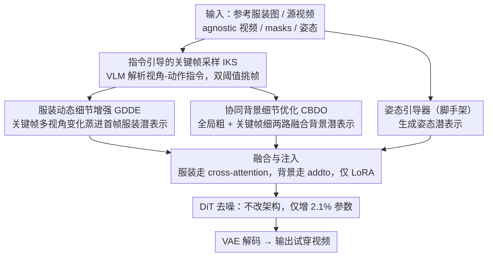

# The Devil is in the Details: Enhancing Video Virtual Try-On via Keyframe-Driven Details Injection

**会议**: CVPR2026  
**arXiv**: [2512.20340](https://arxiv.org/abs/2512.20340)  
**代码**: [ViT-HD Dataset](https://huggingface.co/datasets/zijiyingcai/ViT-HD)  
**领域**: 视频生成  
**关键词**: video virtual try-on, diffusion transformer, keyframe injection, garment fidelity, background integrity

## 一句话总结

提出 KeyTailor 框架，通过关键帧驱动的细节注入策略（服装动态增强 + 协同背景优化）在不修改 DiT 架构的前提下，大幅提升视频虚拟试穿的服装保真度与背景一致性，同时发布 15K 高清数据集 ViT-HD。

## 背景与动机

1. **视频虚拟试穿（VVT）需求旺盛**：电商和短视频平台对高保真服装替换视频有强烈需求，要求跨帧运动一致性和视觉真实感。
2. **DiT 替代 U-Net 趋势**：基于 U-Net 的方法在复杂纹理和人体运动下表现力不足，近期研究转向大规模视频 DiT（如 Wan2.1-14B），联合建模时空模式。
3. **服装动态细节不足**：现有 DiT 方法虽引入额外编码组件学习服装外观，但仍无法捕捉连续帧间的细粒度动态（背面纹理、运动引起的褶皱、光照变化），导致结果过度平滑。
4. **背景区域不一致**：现有方法仅依赖 garment-agnostic video 提供背景条件，容易造成细节丢失（纹理模糊）、时序不一致（帧间伪影）和环境结构偏移。
5. **模型复杂度高**：为增强生成条件，现有方法在 DiT 内部插入额外交互模块，导致参数量和计算开销急剧增加（如 MagicTryOn 引入 15.11% 额外参数）。
6. **数据集规模和质量受限**：公开数据集 VVT（791 样本，192×256）和 ViViD（9700 样本，632×824）分辨率低、场景单一、规模不足，制约 DiT 的泛化。

## 方法详解

### 整体框架

KeyTailor 基于 Wan2.1-I2V-14B 预训练权重，核心思想是**关键帧驱动的细节注入**：与其在 DiT 内部塞额外交互模块（那样既加参数又加算力），不如利用关键帧天然带的多视角服装动态和背景细节去增强生成。输入有参考服装图 $I_{ref}$、源视频 $V_{in}$、agnostic 视频 $V_{agn}$、agnostic masks $M_{agn}$ 和姿态 $P$；流水线先用 IKS 选关键帧，再由 GDDE 和 CBDO 两路分别把服装细节和背景细节蒸进潜表示，最后经融合与注入把各路潜表示喂回 DiT、只用 LoRA 微调注意力、不动架构地完成去噪。

### 关键设计

**1. 指令引导的关键帧采样（IKS）：选出既覆盖多视角又时序均匀的帧**

服装的背面纹理、抬手褶皱这些动态细节只藏在特定帧里，随机采样选不准。IKS 先用大视觉语言模型（QWen）解析预定义的视角-动作指令，提取目标视角 $\mathcal{V}_{tar}$ 和动作 $\mathcal{A}_{tar}$，再经 HumanParsing 生成标准化多锚点姿态帧 $F_{anc}$。对每帧算运动差异分 $S_m(f)$ 和服装面积比分 $S_r(f)$，综合得分 $S_f(f) = 1 - S_m(f) + \lambda \cdot S_r(f)$，并用双阈值（约束分数差异 + 时序间隔）挑帧，既避免冗余又保证时间上铺得开。

**2. 服装动态细节增强模块（GDDE）：把关键帧的服装变化蒸进首帧潜表示**

单图试穿只给一个视角，连续帧的细粒度动态会被生成过度平滑掉。GDDE 先用预训练单图试穿模型 + LoRA 把服装贴到 agnostic 首帧，VAE 编码出服装潜表示 $L_g$；再从关键帧服装区域提取多视角特征 $L_{key}^{gar}$（背面纹理、抬臂褶皱等），用一个轻量蒸馏组件 $\mathcal{D}$（两层 1×1 卷积 + LayerNorm）把这些变化注入 $L_g$：$\bar{L}_g = \mathcal{D}(\text{Concat}(L_g, \frac{1}{|F_{key}|}\sum L_k))$。消融里去掉 $\mathcal{D}$ 时 VFID 从 7.53 飙到 22.52，可见这步是保真度的命门。

**3. 协同背景细节优化模块（CBDO）：粗全局 + 细关键帧两路补回背景**

只靠 agnostic video 当背景条件，容易糊纹理、出帧间伪影、漂移结构。CBDO 走两路：粗粒度全局分支用 Mask Guider $\mathcal{E}_{BG}$（四层 3D 卷积，通道 32→96→192→256，线性层零初始化）把 $V_{agn}$ 编成全局背景潜表示 $L_{bg}$；细粒度关键帧分支用反向人体 mask 裁出关键帧背景、VAE 编码为 $L_{key}^{bg}$，挑背景最完整的帧补细节。两路融合为 $\bar{L}_{bg} = \alpha \cdot L_{bg} + (1-\alpha) L_{key}^{max}$，$\alpha=0.3$。

**4. 融合与注入：服装走 cross-attention、背景走 addto，全程只动 LoRA**

最后把上面两路细节喂回 DiT：姿态潜表示 $L_p$ 和 mask $L_m$ 拼接 patchify 后与 $\bar{L}_g$ 经投影层融成 $L$，再与 patchified 噪声 $\epsilon$ 拼成 $\bar{L}$；背景 $\bar{L}_{bg}$ 通过 "addto" 注入引导去噪，而 $\bar{L}_g$ 在 cross-attention 里替代文本 token、把服装细节锁住。整个过程只对 self-/cross-attention 加 LoRA 微调，**不改 DiT 架构**，因而仅增 2.1% 参数。

### 损失函数 / 训练策略

标准扩散训练损失（去噪目标），对 DiT backbone 的 self-attention 和 cross-attention 施加 LoRA，学习率 1e-4，AdamW 优化器，14500 iterations，batch size = 1，81 帧/样本。

## 实验关键数据

### 视频虚拟试穿 — ViT-HD 数据集

| 方法 | VFID_I^p ↓ | VFID_R^p ↓ | SSIM ↑ | LPIPS ↓ | VFID_I^u ↓ | VFID_R^u ↓ |
|------|-----------|-----------|--------|---------|-----------|-----------|
| MagicTryOn | 14.06 | 0.246 | 0.862 | 0.083 | 19.23 | 0.559 |
| CatV2TON | 15.87 | 0.290 | 0.855 | 0.098 | 20.02 | 0.576 |
| **KeyTailor** | **7.53** | **0.163** | **0.907** | **0.040** | **13.66** | **0.352** |

### 视频虚拟试穿 — VVT 数据集

| 方法 | VFID_I^p ↓ | SSIM ↑ | LPIPS ↓ |
|------|-----------|--------|---------|
| MagicTryOn | 1.991 | 0.958 | 0.024 |
| CatV2TON | 1.778 | 0.900 | 0.039 |
| **KeyTailor** | **1.226** | **0.968** | **0.016** |

### 图像虚拟试穿 — VITON-HD

| 方法 | FID_p ↓ | SSIM ↑ | LPIPS ↓ |
|------|---------|--------|---------|
| CatVTON | 6.139 | 0.869 | 0.097 |
| MagicTryOn | 8.036 | 0.894 | 0.048 |
| **KeyTailor** | **5.293** | **0.920** | **0.057** |

### 计算效率对比

| 方法 | 训练参数 (B) | FLOPs (G) | 推理时间 (s) |
|------|-------------|-----------|-------------|
| MagicTryOn | 16.446 | 206,935 | 345.27 |
| **KeyTailor** | **0.206** | **194,607** | **281.65** |

仅增加 2.10% 参数（vs backbone），远低于 MagicTryOn 的 15.11%。

### 消融实验

| 变体 | VFID_I^p ↓ | SSIM ↑ | LPIPS ↓ |
|------|-----------|--------|---------|
| w/o GDDE | 19.90 | 0.843 | 0.114 |
| w/o CBDO | 17.21 | 0.852 | 0.098 |
| w/o 蒸馏 $\mathcal{D}$ | 22.52 | 0.766 | 0.211 |
| w/o IKS | 16.26 | 0.804 | 0.102 |
| $F_{key}=1$ | 16.39 | 0.817 | 0.099 |
| **KeyTailor (full)** | **7.53** | **0.907** | **0.040** |

去除蒸馏组件 $\mathcal{D}$ 影响最大（VFID 从 7.53 → 22.52），验证了关键帧服装变化蒸馏的核心作用。

## 亮点

- **不改 DiT 架构**：仅通过外部细节注入 + LoRA 微调实现高质量视频试穿，训练参数仅 0.2B，极具工程实用性
- **关键帧驱动思路新颖**：IKS 结合视觉语言模型解析视角/动作指令选取关键帧，兼顾多视角服装动态和背景一致性
- **GDDE + CBDO 双模块设计**：分别针对服装细节和背景完整性优化，消融实验证明缺一不可
- **大规模高清数据集 ViT-HD**：15,070 样本 810×1080，覆盖上/下/全身，显著优于现有公开数据集
- **全面实验**：覆盖 3 个视频数据集 + 2 个图像数据集 + 用户研究 + 充分消融

## 局限与展望

- 关键帧采样依赖 QWen 等大语言模型推理，增加部署复杂性和延迟
- 背景优化仅选择单帧最高完整度关键帧，对复杂动态背景（如运动摄像机）可能不够
- 推理仍需 281.65s（25 步去噪，81 帧），距实时应用有差距
- 数据集来自电商平台，场景以室内展示为主，in-the-wild 场景泛化性有待验证
- 首帧依赖单图试穿模型 FiTDiT 的质量，首帧错误会传播到后续帧

## 相关工作对比

| 方法 | 骨干 | 额外参数比 | 特点 |
|------|------|-----------|------|
| ViViD | SD1.5 | +157% | 参考分支 + 时序注意力，复杂度高 |
| CatV2TON | SD1.5 改 | - | 移除文本注意力层，拼接条件 |
| MagicTryOn | Wan2.1 | +15.1% | DiT 内部加交互模块，参数量大 |
| DreamVVT | DiT | - | 自带数据集微调，ViViD 上提升有限 |
| **KeyTailor** | Wan2.1 | **+2.1%** | 外部注入 + LoRA，轻量高效 |

## 评分

- 新颖性: ⭐⭐⭐⭐ — 关键帧驱动注入策略与"不改DiT架构"的设计理念新颖，GDDE/CBDO 模块简洁有效
- 实验充分度: ⭐⭐⭐⭐⭐ — 5个数据集 + 用户研究 + 9组消融 + 效率分析，非常全面
- 写作质量: ⭐⭐⭐⭐ — 问题阐述清晰，图表丰富，但部分公式符号可更统一
- 价值: ⭐⭐⭐⭐ — ViT-HD 数据集对社区有较大价值，轻量方案对工业落地友好

<!-- RELATED:START -->

## 相关论文

- [\[CVPR 2026\] Vanast: Virtual Try-On with Human Image Animation via Synthetic Triplet Supervision](vanast_virtual_try-on_with_human_image_animation_via_synthetic_triplet_supervisi.md)
- [\[ICML 2026\] iTryOn: Mastering Interactive Video Virtual Try-On with Spatial-Semantic Guidance](../../ICML2026/video_generation/itryon_mastering_interactive_video_virtual_try-on_with_spatial-semantic_guidance.md)
- [\[CVPR 2026\] UnityVideo: Unified Multi-Modal Multi-Task Learning for Enhancing World-Aware Video Generation](unityvideo_unified_multi-modal_multi-task_learning_for_enhancing_world-aware_vid.md)
- [\[CVPR 2026\] GenHOI: Towards Object-Consistent Hand-Object Interaction with Temporally Balanced and Spatially Selective Object Injection](genhoi_towards_object-consistent_hand-object_interaction_with_temporally_balance.md)
- [\[ICML 2026\] Enhancing Train-Free Infinite-Frame Generation for Consistent Long Videos](../../ICML2026/video_generation/enhancing_train-free_infinite-frame_generation_for_consistent_long_videos.md)

<!-- RELATED:END -->
