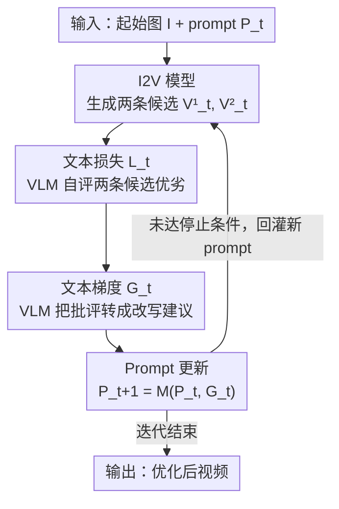

# TiViBench: Benchmarking Think-in-Video Reasoning for Video Generation

**会议**: CVPR 2026  
**论文**: [CVF Open Access](https://openaccess.thecvf.com/content/CVPR2026/html/Chen_TiViBench_Benchmarking_Think-in-Video_Reasoning_for_Video_Generation_CVPR_2026_paper.html)  
**代码**: 无（论文给出项目主页 TiViBench，未明确开源仓库 ⚠️ 以原文为准）  
**领域**: 视频生成 / Benchmark / 视觉推理  
**关键词**: 图生视频, 视觉推理评测, 测试时优化, 偏好优化, chain-of-frames

## 一句话总结
TiViBench 把"图生视频（I2V）模型到底会不会推理"做成一个分四维度、24 个任务、3 个难度、595 个样本的分层基准，发现商用模型（Sora 2、Veo 3.1）明显比开源模型强、但所有模型在需要规则/符号推理的任务上都崩；并配套提出一个**不训练**的测试时方法 VideoTPO，用 VLM 自我比较两条候选视频来迭代改写 prompt，把 Wan2.1 的整体准确率从 8.40% 拉到 18.15%。

## 研究背景与动机
**领域现状**：视频生成模型这两年的关注点正在从"画得像不像"转向"合不合物理、逻辑通不通"。Veo 3 抛出"chain-of-frames（帧链）推理"概念后，一个自然的问题浮上来：视频生成模型能不能像 LLM 那样一步步推理，成为通用视觉基础模型、迎来自己的"GPT 时刻"？

**现有痛点**：现有 I2V 评测（VBench++、各类 FVD/UCF101 基准）几乎全在量视觉保真度、时间平滑度、物理合理度和 prompt 服从度——这些都重要，但**完全没有衡量高阶推理能力**。同期工作 MME-CoF 虽然引入了 12 个推理维度，却把"旋转推理"这种简单任务和"长程因果推理"这种难任务一视同仁，**缺少难度分层**，没法揭示模型能力的细粒度边界。

**核心矛盾**：要评推理，光看一帧静态结果不够——推理是一个随时间展开的过程（初始态→中间态→目标态），需要既能验证过程、又能验证终态的可核验指标；而旧基准大多只保留初始推理图，丢掉了过程信息。

**本文目标**：(1) 造一个专门评 I2V 推理潜力、带难度分层、覆盖多类推理的基准；(2) 用它系统体检当前最强的商用/开源视频模型，定位推理失败的根因；(3) 在不额外训练的前提下，找一个能即插即用提升推理表现的方法。

**切入角度**：作者观察到视觉推理任务天然比一般生成任务更"可核验"——有明确的真值（初态/中间态/目标态），所以可以设计自动化验证指标；同时既然推理潜力可能被 prompt 偏好压制，那么"测试时改 prompt"就有希望在不动权重的情况下把潜力释放出来。

**核心 idea**：用一个分层基准 TiViBench 把视频推理能力量化出来，再用"测试时偏好优化"VideoTPO 在推理阶段免训练地提升表现。

## 方法详解

### 整体框架
这篇工作有两个相对独立又互补的产物：**评测侧 TiViBench**（怎么造基准、怎么打分）和**方法侧 VideoTPO**（怎么免训练提分）。TiViBench 沿着"定义推理维度 → 构造视觉化 prompt → 设计可核验指标"三步把一个模糊的"会不会推理"问题落成 595 个能自动评分的样本；VideoTPO 则是在拿到一个模型后，针对单个测试样本反复"生成两条候选→VLM 自评→改 prompt→再生成"地迭代，把模型本来就藏着的推理能力榨出来。

VideoTPO 是一个清晰的测试时迭代环路，配框架图如下：

### 关键设计

**1. TiViBench 的四维分层推理体系：把"会不会推理"拆成可测的 24 个任务**

旧基准的根本问题是把"推理"当成一个笼统的整体，难度也不分层，看不出模型在哪一类推理上崩。TiViBench 在 Veo 3 的图遍历/迷宫等测试任务基础上扩展，明确切成四个维度：**❶结构推理与搜索**（图遍历、迷宫、数字排序、时序排列、规则外推、棋类走子），**❷空间与视觉模式推理**（形状拼合、连色、模式识别、找不同、计数、视觉类比），**❸符号与逻辑推理**（简易数独、算术、符号推理、视觉演绎、传递推理、游戏规则推理），**❹动作规划与任务执行**（工具使用、机器人导航、目标导向规划、多步操作、视觉指令跟随、博弈策略）。每个维度约 150 个样本、6 个任务，再按 easy/medium/hard 三个难度分层，总计 24 个任务场景、595 个图-prompt 样本。这种"维度 × 任务 × 难度"的分层结构，正是它相对 MME-CoF 的关键改进——能看出模型是在"视觉演绎"这类弱依赖规则的任务上还行、却在"迷宫/数独"这类强规则任务上彻底失败。

**2. 叙事式视觉 prompt 套件：用"留白 + 约束"逼模型自己补推理步骤**

视觉推理 prompt 不能像 LLM 那样直白下指令（"找 A 到 B 的最优路径"），否则就退化成翻译题。作者主张 prompt 要**主观、叙事化**（"蓝球沿白色路径平滑滑动，停在红点"），既给足视觉细节引导推理、又留白让模型自己推断中间步骤，并用隐含约束施压（"蓝球绝不越过黑色区域"）。具体用 Gemini-2.5-Pro 作为助手、结合初态和目标态图像生成视觉锚定的 prompt，并针对四个维度定制原则（如结构推理强调"目标清晰但不给解法路径 + 隐含规则 + 时序连贯"，符号推理强调"隐式规则发现 + 符号-视觉融合"）。每条 prompt 经三位标注者人工复核，只要有一人觉得不清晰就重写、三人都通过才采用，保证基准本身不会因 prompt 含糊而误判模型。

**3. 双类可核验指标：让视频推理像做题一样能自动判对错**

视觉推理任务天然有明确真值，所以能设计自动化验证而非只靠人眼。作者把指标分两类，都聚焦"对不对"：**过程-终态一致性（Process-and-Goal Consistency）**同时验证推理过程和最终结果，比如迷宫导航用跟踪工具追踪主体逐帧轨迹、核对是否合规到达终点；**终态验证（Final-State Validation）**只看是否到达正确目标态、不管中间过程，比如数独完成用 OpenCV 对比生成网格与真值、序列补全用 DINO 特征对比。具体验证方法还会随任务格式变（数学填空题核对等号后答案、选择题核对选项）。这套指标和人工判断高度一致（Figure 7 左），提供了可靠的免人工评测替代。

**4. VideoTPO：把 LLM 的测试时偏好优化搬到视频生成，免训练免奖励模型**

诊断出失败根因后（规则建模不足 + 细粒度视觉特征丢失），作者要在不训练的前提下提分。已有 prompt 改写分两类：**前置改写**（pre-inference，靠 LLM 幻想细节丰富 prompt，但可能偏离用户意图）和**后置改写**（post-inference，根据生成结果改 prompt）——但它们都是单条候选单遍优化，粒度太粗。VideoTPO 借鉴 LLM 的测试时偏好优化（TPO），但做了关键简化：原版 TPO 要生成多条（如 4 条）样本、还依赖外部奖励模型排序，VideoTPO **每轮只生成两条候选 $V^1_t, V^2_t$**，让一个 VLM（GPT-4o）做自我分析、直接产出"文本损失/文本梯度"，**彻底免掉外部奖励模型**。三步迭代：

- 文本损失：$L_t = M(V^1_t, V^2_t, P_t)$，VLM 比较两条候选优劣，给出偏好视频的优点和非偏好视频的缺点——是定性批评而非数值分数，因此更可解释；
- 文本梯度：$G_t = M(P_t, L_t)$，VLM 把批评转成可执行的改写建议，指明该怎么改 prompt 才能让生成更贴合期望推理；
- prompt 更新：$P_{t+1} = M(P_t, G_t)$，迭代刷新 prompt 再喂回 I2V 模型。

这一环路把 LLM 里"loss→gradient→update"的优化范式整体类比到了 prompt 空间，"梯度"是文本而非数值，所以全程不动模型权重、不需新数据。一个值得注意的发现：用 HunyuanVideo 优化出的 prompt 直接喂给 Wan2.1（"w/ HYV Prompt"）几乎没提升甚至掉点，说明不同模型对 prompt 的偏好不同、VideoTPO 的逐模型在线优化是必要的。

## 实验关键数据

### 主实验
评测 7 个先进 I2V 模型（开源：Wan2.2/Wan2.1/HunyuanVideo/CogVideoX1.5；商用：Veo 3.1-fast/Sora 2/Kling 2.1），开源模型多随机种子下报 Pass@1 与 Pass@5，商用模型仅报 Pass@1。

| 模型 | 类型 | 结构搜索 | 空间模式 | 符号逻辑 | 规划执行 | 总体 Pass@1 |
|------|------|---------|---------|---------|---------|------------|
| CogVideoX1.5 | 开源 | 1.42 | 1.34 | 0.67 | 4.46 | 2.02 |
| HunyuanVideo | 开源 | 1.42 | 1.34 | 2.00 | 10.83 | 4.03 |
| Wan2.1 | 开源 | 5.76 | 2.68 | 4.00 | 20.38 | 8.40 |
| Wan2.2 | 开源 | 7.19 | 2.68 | 6.00 | 21.02 | 9.41 |
| Kling 2.1 | 商用 | 5.04 | 5.37 | 8.00 | 26.75 | 11.60 |
| Veo 3.1 | 商用 | 10.07 | 22.15 | 18.00 | 51.59 | 26.05 |
| **Sora 2** | 商用 | 18.71 | 31.76 | 22.00 | 38.22 | **27.90** |

可以看到：(1) 商用模型全面碾压开源，Sora 2 总体最高 27.9%、且难度上升时仍较稳；(2) 但即便最强模型，绝对准确率也很低（< 30%），说明视频推理远未解决；(3) 所有模型在"规划执行"维度普遍较高、在"结构搜索/符号逻辑"维度都很低。Pass@5 上开源模型（Wan2.2 从 9.41→16.47，Wan2.1 从 8.40→15.29）明显提升，说明它们**有潜在推理能力但极不稳定**，瓶颈在训练规模与数据多样性。

### VideoTPO 提升（Table 3）
把 VideoTPO 应用到两个无内置改写器的开源模型，并与前置/后置改写基线对比：

| 模型配置 | 结构搜索 | 空间模式 | 符号逻辑 | 规划执行 | 总体 |
|----------|---------|---------|---------|---------|------|
| HunyuanVideo | 1.42 | 1.34 | 2.00 | 10.83 | 4.03 |
| + Pre-Rewriter | 2.16 | 2.01 | 3.33 | 10.83 | 4.71 |
| + Post-Rewriter | 4.32 | 4.03 | 4.67 | 12.74 | 6.55 |
| **+ VideoTPO** | **7.91** | **5.37** | **6.67** | **22.93** | **10.25** |
| Wan2.1 | 5.76 | 2.68 | 4.00 | 20.38 | 8.40 |
| + Pre-Rewriter | 7.19 | 5.37 | 4.00 | 25.48 | 10.76 |
| + Post-Rewriter | 9.35 | 7.38 | 4.67 | 26.11 | 12.10 |
| **+ VideoTPO** | **19.42** | **10.07** | **8.67** | **33.76** | **18.15** |

VideoTPO 在所有维度和难度上都稳定超过基模型和两类改写基线：HunyuanVideo 总体 4.03%→10.25%、Wan2.1 总体 8.40%→18.15%（翻倍多），且增益明显大于前置/后置改写，验证测试时缩放能有效释放视频生成的推理能力。

### 关键发现
- **推理潜力随规模涌现，而非生成模型的固有缺陷**：商用模型的优势主要来自更大更多样的数据 + 更高参数量 + 更优架构（Takeaway ❶）；开源模型 Pass@5 远超 Pass@1，证明能生成对的解、只是不稳（Takeaway ❷）。
- **失败根因有二**（Takeaway ❸）：(i) 模型读不懂高层规则——迷宫任务里 prompt 明确禁止越界、模型仍频繁违规；(ii) 符号推理需要精确视觉特征，但 VAE 等编码器过度压缩特征、丢掉了推理所需的关键细节。最差的四个任务是迷宫求解、时序排列、找不同、数独完成。
- **prompt 偏好是模型相关的**：跨模型迁移优化后的 prompt 几乎无效甚至掉点，逐模型在线优化才有效（Figure 7 右）。

## 亮点与洞察
- **把"视频推理"从口号做成可核验的题库**：抓住"视觉推理天然有真值（初/中/末态）"这一点设计自动化指标，让数独、迷宫这类任务能像做题一样自动判对错，避免了视频评测最头疼的人工主观打分——这是基准能 scale 的关键。
- **难度分层是相对同期工作最实在的改进**：easy/medium/hard 三档让人看清模型能力的边界在哪、在什么难度上断崖，比"一刀切"的推理维度信息量大得多。
- **VideoTPO 把 LLM 的 loss→gradient→update 优雅类比到 prompt 空间**：用"两条候选 + VLM 自评"替掉"多候选 + 外部奖励模型"，免训练、免奖励、免新数据，是个可直接迁移到任何黑盒 I2V 模型的实用 trick。
- **失败归因指向具体架构瓶颈**："VAE 过度压缩丢失推理所需细节"这一观察，给后续做"推理友好的视频表征/编码器"指了明确方向。

## 局限与展望
- **绝对性能极低**：最强模型也只有 ~28%，VideoTPO 提升后开源模型也才 ~18%，说明这条路离"视频生成会推理"还很远，基准当前更像"诊断工具"而非"竞赛榜"。
- **VideoTPO 依赖强 VLM 评判**：用 GPT-4o 做自评和改写，评判质量直接决定优化效果；VLM 看视频本身的推理能力也有限，可能成为新的瓶颈，且每个样本多轮生成的推理成本不低。
- **每轮仅两候选**：作者为"尽量简单"选了两候选自评，但这可能限制偏好信号的丰富度；候选数、迭代轮数与收益的权衡论文未充分展开。
- **评测仍部分依赖任务专用验证器**（轨迹跟踪、OpenCV、DINO 等），不同任务验证方式不统一，扩展到新任务时需要为每类任务定制核验逻辑，迁移成本存在。
- **改进方向**：作者建议显式任务规则编码、过程级强化学习优化、以及更细粒度的视觉特征表征与结构化处理。

## 相关工作与启发
- **vs VBench++ / 传统 I2V 基准**: 它们评的是视觉保真、时间平滑、物理合理等"一般生成能力"，TiViBench 专评高阶视觉推理，且引入难度分层和过程/终态双类可核验指标，是互补而非替代。
- **vs MME-CoF（同期）**: 同样做视频推理评测、有 12 个细粒度维度，但 MME-CoF 不分难度、把简单任务和复杂任务等同处理；TiViBench 用"维度×任务×难度"分层揭示更细的模型行为差异。
- **vs Pre-Rewriter / Post-Rewriter**: 二者都是单条候选单遍 prompt 改写；VideoTPO 用多遍生成 + 偏好对齐做更细粒度优化，实验中增益显著更大。
- **vs LLM 的 TPO（测试时偏好优化）**: VideoTPO 移植了 TPO 的"测试时用文本梯度优化"思想，但把多候选 + 外部奖励模型简化成两候选 + VLM 自评，更轻更实用。

## 评分
- 新颖性: ⭐⭐⭐⭐ 首个分层、可核验的 I2V 视觉推理基准，VideoTPO 的免奖励测试时偏好优化也算新颖落地。
- 实验充分度: ⭐⭐⭐⭐ 覆盖 7 个最强商用/开源模型、Pass@1/Pass@5、失败案例分析、指标-人类一致性、prompt 迁移分析，较全面。
- 写作质量: ⭐⭐⭐⭐ 结构清晰、RQ 驱动、takeaway 明确，但部分指标细节散落附录。
- 价值: ⭐⭐⭐⭐ 给"视频生成会不会推理"提供了可量化的标尺和一个即插即用的提分方法，对后续研究有锚定作用。

<!-- RELATED:START -->

## 相关论文

- [\[CVPR 2026\] SVBench: Evaluation of Video Generation Models on Social Reasoning](svbench_evaluation_of_video_generation_models_on_social_reasoning.md)
- [\[CVPR 2026\] Thinking with Video: Video Generation as a Promising Multimodal Reasoning Paradigm](thinking_with_video_video_generation_as_a_promising_multimodal_reasoning_paradig.md)
- [\[CVPR 2026\] EffectMaker: Unifying Reasoning and Generation for Customized Visual Effect Creation](effectmaker_unifying_reasoning_and_generation_for_customized_visual_effect_creat.md)
- [\[CVPR 2026\] Reasoning Diffusion for Unpaired Test Time Out-of-distribution Text-Image to Video Generation](reasoning_diffusion_for_unpaired_test_time_out-of-distribution_text-image_to_vid.md)
- [\[ACL 2026\] OSCBench: Benchmarking Object State Change in Text-to-Video Generation](../../ACL2026/video_generation/oscbench_benchmarking_object_state_change_in_text-to-video_generation.md)

<!-- RELATED:END -->
