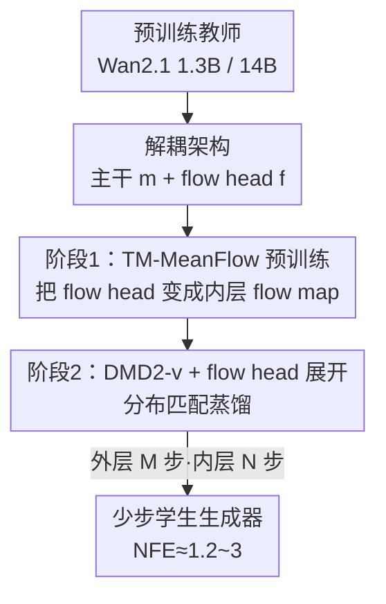

# Transition Matching Distillation for Fast Video Generation

**会议**: CVPR 2026  
**论文**: [CVF Open Access](https://openaccess.thecvf.com/content/CVPR2026/html/Nie_Transition_Matching_Distillation_for_Fast_Video_Generation_CVPR_2026_paper.html)  
**代码**: 无  
**领域**: 视频生成 / 扩散模型蒸馏  
**关键词**: 视频扩散蒸馏, 少步生成, Transition Matching, MeanFlow, 分布匹配蒸馏

## 一句话总结
TMD 把视频扩散教师模型拆成「主干（提语义）+ 轻量 flow head（迭代精修细节）」的解耦学生，再用「TM-MeanFlow 预训练 flow head + 带 flow head 展开的 DMD2-v 分布匹配蒸馏」两阶段训练，把 Wan2.1 1.3B/14B 蒸成 1~4 步生成器，在可比推理成本下视觉保真度和文本对齐都超过现有蒸馏方法。

## 研究背景与动机
**领域现状**：大规模视频扩散/流模型（HunyuanVideo、Wan、Cosmos 以及 Sora/Veo/Kling 等）已能从文本生成连贯逼真的视频，但它们靠多步去噪采样——往往要几十上百步迭代——才能把噪声逐渐变成清晰视频。

**现有痛点**：这种迭代采样导致推理延迟高、算力消耗大，使大扩散模型在实时交互场景（实时视频生成、内容编辑、agent 训练用的世界模型）里基本不可用。为加速，已有大量「扩散蒸馏」工作把长去噪轨迹压成几步，分两大家族：轨迹蒸馏（知识蒸馏、一致性模型，直接回归教师轨迹）和分布蒸馏（对抗式、变分得分蒸馏，对齐学生与教师分布）。在图像域它们已能压到 1~2 步。

**核心矛盾**：把这些方法搬到视频上很难。视频有高时空维度和复杂的帧间依赖，蒸馏时既要保住全局运动连贯、又要保住细粒度空间细节。更关键的是，**多数现有方法把扩散网络当成一个不可分的整体映射**，忽视了大视频扩散主干内部「先抽语义、再补细节」的层级结构和语义递进。

**本文目标**：在不牺牲视觉质量的前提下，把视频扩散模型蒸成极少步（如 <4 步）生成器，并提供一个**可在速度和质量间灵活权衡**的旋钮。

**切入角度**：作者从 Transition Matching（TM）出发——TM 把多步去噪近似成一个紧凑的「少步概率转移过程」，每一步转移跨越相隔很远的两个噪声水平，让学生能迈大步且匹配教师分布。再结合一个观察：扩散主干本就有层级结构，可以拆成「负责语义的前面大半层」和「负责细节精修的最后几层」。

**核心 idea**：把教师解耦成「主干 + flow head」，让 flow head 在每个大转移步内做几次轻量「内层流」精修，从而用「外层少步转移 + 内层轻量精修」的双层结构，在少步预算下兼顾语义演化与细节保真。

## 方法详解

### 整体框架
TMD 要解决的是「把多步视频扩散教师蒸成 1~4 步学生，同时保住质量」。它的核心转法分两层：**外层**用少数几个大转移步（M 步）从噪声跳到数据，每一步要预测一个辅助变量 $y=x_1-x$（噪声减数据，DTM 形式），由它可确定性地得到下一状态 $x_{t_{i-1}}=x_{t_i}-(t_i-t_{i-1})y$；**内层**则把「预测 $y$」这件事本身再用一个 N 步的轻量流来逼近。

为此学生被设计成**解耦架构**：从预训练教师里切出（1）主干 $m_\theta$——前面大多数层，吃噪声样本 $x_t$、时间步 $t$、文本条件 $c$，输出语义特征 $m_t$；（2）flow head $f_\theta$——最后几层，条件于 $m_t$ 反复做 N 次内层流更新，把更噪的 $y_s$ 精修到更干净的 $y_r$。训练分两阶段：阶段一用 TM-MeanFlow 把 flow head 变成一个能少步精修的「flow map」；阶段二用改进版分布匹配蒸馏 DMD2-v，并在每个转移步**展开 flow head** 来对齐学生转移分布与教师去噪分布。

### 关键设计

**1. 解耦架构：把教师切成「语义主干 + 轻量 flow head」，让一次转移步内能多次精修细节**

现有蒸馏把扩散网络当成单一映射，无法在「迈大步省算力」和「保细节」之间灵活调节。TMD 把预训练教师拆成主干 $m_\theta$（特征提取器，占大多数层）和 flow head $f_\theta$（最后几层，做迭代精修），在每个外层转移步 $t_i$ 上，flow head 以主干特征为条件迭代预测 $y$：

$$y_{s_{j-1}} \leftarrow f_\theta\big(y_{s_j}, s_j, s_{j-1}; m_\theta(x_{t_i}, t_i)\big)$$

其中 $0=s_0<s_1<\cdots<s_N=1$ 是内层流的时间离散。这样主干算一次语义、flow head 复用它做几步轻量精修，就提供了一个「调 N（内层步数）和 H（flow head 层数）就能换速度/质量」的旋钮。设计上有两点讲究：flow head 的目标取 DTM 形式 $y=x_1-x$（实测优于直接预测样本 $y=x$）；主特征 $m_{t_i}$ 与带噪的 $y_{s_j}$ 用一个**时间条件门控（gating）融合层**拼起来，保证学生的初始前向与教师一致，最小化对预训练模型的扰动。

**2. Transition Matching MeanFlow（TM-MF）预训练：用 MeanFlow 把 flow head 变成「几步就够」的内层 flow map**

直接用 flow matching 训 flow head 去逼近内层速度，理论上仍需很多内层步才能逼出 $y$，违背少步初衷。TMD 借 MeanFlow——它学的是平均速度而非瞬时速度的 flow map $f(y_s,s,r)=y_s+(s-r)u(y_s,s,r)$，靠下面这个恒等式把「积分」变成可训练目标：

$$u(y_s,s,r)+(s-r)\frac{d}{ds}u(y_s,s,r)=v(y_s,s)$$

训练目标是 $\mathcal{L}(\theta)=\mathbb{E}\big[\lVert u_\theta(y_s,s,r)-\hat u\rVert^2\big]$，其中 $\hat u$ 用停梯度把目标速度减去总导数项构造。但作者发现**让 flow head 直接预测平均速度 $u_\theta$ 效果很差**，假设是 flow head 输出应贴近预训练教师的输出，而教师预测的是外层流速度。于是把平均速度重参数化为 $u_\theta(y_s,s,r;m):=y_1-\mathrm{head}_\theta(y_s,s,r;m)$——这样 $\mathrm{head}_\theta$ 的输出在 $r\to s$ 极限下就逼近教师的速度预测，flow head 从教师权重初始化后只需微调。工程上还做了三点稳定化：一部分 batch 退化成普通 TM（flow matching）、用 CFG 并按概率丢文本条件、自适应损失归一化；由于 JVP 在 flash attention / FSDP / context parallelism 下难实现，改用**有限差分近似 JVP**，让算法不依赖具体架构和训练技巧。消融显示 TM-MF 给第二阶段提供的初始化优于纯 TM（TM 可看作 $r=s$ 时 MeanFlow 的特例）。

**3. DMD2-v + flow head 展开蒸馏：为视频改进 DMD2，并让梯度穿过整条内层流以消除训练-推理失配**

第二阶段用分布匹配蒸馏对齐学生与教师分布。原始 DMD2 是为图像设计的，作者识别出三处对视频更优的改动，合称 **DMD2-v**：（1）**GAN 判别器用 Conv3D**——联合处理时空特征比 Conv1D-2D 分离卷积或 attention head 都好，说明局部时空特征对 GAN 损失很重要；（2）**KD warm-up 只在一步蒸馏用**——它在一步生成里有帮助，但在多步生成里会引入 DMD2 难以修掉的粗粒度伪影；（3）**时间步 shifting**——对外层转移步采样或在 VSD 损失里加噪时，用 $t=\frac{\sigma t'}{(\sigma-1)t'+1}$（$\sigma\ge1$）对均匀采样的 $t'$ 做偏移，能提升性能并防止 mode collapse（不 shift 会导致 VBench 都测不出的严重崩塌）。

在此之上做 **flow head 展开（rollout）**：蒸馏时把内层流展开，整体当成每个转移步的样本生成器 $g_\theta(x_{t_i},t_i;y_1):=x_1-\mathrm{INNERFLOW}(m_\theta(x_{t_i},t_i))$，把 DMD2-v 的 VSD 损失作用在这个展开输出上，梯度**自然回传穿过全部 N 个内层流步且不 detach**。因为 flow head 很轻（如从 30 个 DiT block 里取最后 5 个、展开 2 步，只增加 <17% 的学生参数更新算力），这仍然高效。这一步直接消除了「训练时不展开、推理时要展开」的失配，消融（图 7）显示加了 rollout 收敛更快、性能更好。

### 损失函数 / 训练策略
- **阶段一（TM-MF 预训练）**：MeanFlow 目标 $\mathcal{L}(\theta)=\mathbb{E}_{s,r,y_s}\lVert u_\theta-\hat u\rVert^2$，平均速度按 $u_\theta=y_1-\mathrm{head}_\theta$ 重参数化，flow head 从教师初始化；瞬时速度用条件速度 $v(y_s,s)=y_1-y$ 近似，总导数用有限差分近似。
- **阶段二（DMD2-v 蒸馏）**：变分得分蒸馏（VSD/反向 KL）对齐分布 + Conv3D GAN 损失；fake score 用教师权重初始化并在学生数据上持续训练，判别器是作用于 fake score/教师中间特征的轻量 head；VSD 梯度穿过展开的内层流。
- **数据/教师**：教师为 Wan2.1 1.3B / 14B T2V-480p；用 50 万文本-视频对（文本采自 VidProM 并由 Qwen-2.5 扩写，视频由 Wan2.1 14B 生成），潜空间分辨率 $[T,H,W]=[21,60,104]$，解码为 81 帧 480×832。

## 实验关键数据

**自定义指标——有效 NFE（Effective NFE）**：为公平比较算力，作者把 NFE 定义为生成时用到的 DiT block 总数除以教师层数 $L$。对基线就是步数 $M$，对 TMD 则为

$$\text{Effective NFE}:=M\Big(1+\frac{(N-1)H}{L}\Big)$$

其中 $N$ 是内层步数、$H$ 是 flow head 的 block 数（Wan2.1 1.3B 的 $L=30$、14B 的 $L=40$）。这让 TMD 能取**分数 NFE**，从而比整数步基线更细粒度地控质量-效率权衡。命名 N2H5 = 2 内层步 + 5 个 flow head block。

### 主实验

蒸馏 Wan2.1 1.3B（VBench Overall score）：

| 方法 | NFE | Overall | Quality | Semantic |
|------|-----|---------|---------|----------|
| rCM（最强基线） | 4 | 84.43 | 85.38 | 80.63 |
| DMD2-v | 4 | 84.60 | 86.03 | 79.87 |
| rCM | 2 | 84.09 | 84.90 | 80.86 |
| DMD2-v | 2 | 84.39 | 85.65 | 79.32 |
| **TMD-N2H5** | **2.33** | **84.68** | 85.71 | 80.55 |
| rCM | 1 | 82.65 | 83.60 | 78.82 |
| DMD2-v | 1 | 83.24 | 84.28 | 79.10 |
| **TMD-N2H5** | **1.17** | **83.80** | 85.07 | 78.69 |

NFE=2.33 的 TMD 就超过 NFE=4 的最强基线 rCM；近一步（NFE=1.17）也胜过所有一步蒸馏方法。

蒸馏 Wan2.1 14B：

| 方法 | NFE | Overall | Quality | Semantic |
|------|-----|---------|---------|----------|
| Wan2.1 14B（教师） | 50×2 | 86.22 | 86.67 | 84.44 |
| rCM | 1 | 83.02 | 83.57 | 80.81 |
| DMD2-v | 1 | 83.69 | 84.46 | 80.61 |
| **TMD-N4H5** | **1.38** | **84.24** | 84.89 | 81.65 |

一步设置下 TMD-N4H5（NFE=1.38）比一步 rCM 高 +1.22，且无需 DMD2-v 那种昂贵的 KD warm-up。**用户偏好研究**（vs DMD2-v，14B）：两步设置下视觉质量胜率 63.3%、文本对齐 71.9%；一步设置下视觉质量 51.8%、文本对齐 63.2%——文本对齐优势尤其明显，印证内层 flow head 精修对 prompt 遵循的作用。（注：14B 的两步设置 TMD-N4H5 未能超过两步基线，仅胜过 4 步 DMD2-v，作者如实承认。）

### 消融实验

| 配置 | Overall | 说明 |
|------|---------|------|
| Conv3D 判别器 | 83.24 | 默认，最优 |
| Conv1D-2D 判别器 | 82.32 | 时空分离卷积，掉 0.92 |
| Attention 判别器 | 82.36 | 展平成 token 自注意力 |
| w/o GAN | 81.63 | 去掉 GAN 损失掉 1.61 |
| 两步 w/ KD warm-up | 83.79 | 多步反而更差 |
| 两步 w/o KD warm-up | 84.39 | 故多步不用 KD |
| 两步 w/ timestep shift | 84.39 | 默认 |
| 两步 w/o timestep shift | 83.44 | 掉 0.95，且会 mode collapse |
| N4H5 预训练 TM-MF | 84.67 | 优于纯 TM |
| N4H5 预训练 TM | 84.29 | 掉 0.38 |

### 关键发现
- **GAN 损失与 Conv3D 判别器贡献明显**：去掉 GAN 掉 1.61，换非 Conv3D head 掉约 0.9，说明局部时空特征对视频对抗损失关键。
- **KD warm-up 是「一步友好、多步有害」**：一步下有帮助，多步下引入难修的粗粒度伪影，故只在一步用——这是把图像 DMD2 搬到视频时容易踩的坑。
- **timestep shifting 不可省**：不 shift 会触发 VBench 都测不出的严重 mode collapse。
- **flow head rollout 让蒸馏收敛更快、性能更高**：消除训练-推理失配的回报很直接。
- **质量随 NFE 单调改善**：调 N 和 H 增大有效 NFE，VBench overall 总体上升，验证了 TMD 提供的细粒度速度/质量旋钮。

## 亮点与洞察
- **把「网络结构层级」直接用作蒸馏的设计自由度**：主干算语义、flow head 补细节，这个解耦让「外层迈大步 + 内层轻量精修」的双层采样成为可能，而不是把网络当黑箱压步数——这是相对现有蒸馏最本质的差异。
- **分数 NFE 是个聪明的工程抽象**：因为 flow head 只占少数层，展开几步只增加零头算力，于是 NFE 可以取 1.17、1.38、2.33 这种分数，质量-效率曲线被填得很密，比只能取整数步的基线更可控。
- **flow head 展开 + 不 detach 梯度**：训练时就模拟推理时的内层流并让梯度全程回传，干净地消除训练-推理失配，思路可迁移到其他「内外两层迭代」的蒸馏/采样器。
- **MeanFlow 的重参数化技巧**：让 head 预测教师式速度（$u_\theta=y_1-\mathrm{head}_\theta$）而非直接预测平均速度，使从教师初始化的 head 在极限下天然对齐教师——这种「让新模块退化成已知好模块」的初始化对齐很值得借鉴。

## 局限与展望
- **14B 两步设置未超基线**：TMD-N4H5（NFE=2.75）在 14B 两步下没能胜过两步 rCM/DMD2-v，只在一步设置显著领先，说明优势区间偏向极少步。
- **依赖大量合成数据与强教师**：训练用 50 万对、视频由 Wan2.1 14B 生成，蒸馏质量上限受教师约束，未探究教师本身瑕疵会否被继承。
- **未直接用教师速度表示内层速度**：作者用条件速度 $y_1-y$ 近似内层速度，并指出对特定 $y$ 可由教师速度推导出内层速度表示，留作未来工作——这可能进一步提升预训练质量。
- **超参（N、H、shift 的 $\sigma$）需按模型规模调**：1.3B 用 N2H5、14B 用 N4H5，迁移到新教师时这套旋钮的最优点需重新搜索。

## 相关工作与启发
- **vs 轨迹蒸馏（Consistency Models / MeanFlow / rCM）**: 它们直接学 ODE 轨迹上点对点的映射，在视频这种高维、轨迹曲率大的设定下难扩展、易训练不稳；TMD 只在 flow head 内层用 MeanFlow 做轻量精修，外层交给分布匹配，避开了对整条视频轨迹做 flow map 的困难。
- **vs DMD2（分布蒸馏，图像）**: TMD 的第二阶段就是 DMD2 的视频强化版（DMD2-v：Conv3D 判别器 + 一步专用 KD + timestep shifting），并加入 flow head 展开；相比直接套用图像 DMD2，它针对视频时空特性与 mode collapse 做了系统改造。
- **vs Transition Matching（TM）**: TMD 继承 TM「用少步概率转移近似多步去噪」的思想，但把目标从「从头训生成模型」改成「蒸馏预训练教师」，并用解耦架构 + MeanFlow 把 TM 原本约 30 步的转移压到 <4 步。

## 评分
- 新颖性: ⭐⭐⭐⭐ 把网络层级解耦、TM、MeanFlow、DMD2 缝成一套自洽的双层少步视频蒸馏框架，组合创新扎实
- 实验充分度: ⭐⭐⭐⭐ 1.3B/14B 双规模 + VBench + 用户研究 + 三组 DMD2-v 消融 + 预训练/rollout 消融，且诚实报告 14B 两步未达标
- 写作质量: ⭐⭐⭐⭐ 双层结构与两阶段训练讲得清楚，公式与命名（N×H×、有效 NFE）规范
- 价值: ⭐⭐⭐⭐ 把大视频扩散压到 1~2 步且质量可比，对实时视频生成/世界模型很实用，分数 NFE 旋钮工程价值高

<!-- RELATED:START -->

## 相关论文

- [\[CVPR 2026\] Reward Forcing: Efficient Streaming Video Generation with Rewarded Distribution Matching Distillation](reward_forcing_efficient_streaming_video_generation_with_rewarded_distribution_m.md)
- [\[CVPR 2026\] SURF: Signature-Retained Fast Video Generation](surf_signature-retained_fast_video_generation.md)
- [\[CVPR 2026\] Flowception: Temporally Expansive Flow Matching for Video Generation](flowception_temporally_expansive_flow_matching_for_video_generation.md)
- [\[ICML 2026\] SGMD: Score Gradient Matching Distillation for Few-Step Video Diffusion](../../ICML2026/video_generation/sgmd_score_gradient_matching_distillation_for_few-step_video_diffusion_distillat.md)
- [\[CVPR 2026\] FastLightGen: Fast and Light Video Generation with Fewer Steps and Parameters](fastlightgen_fast_and_light_video_generation_with_fewer_steps_and_parameters.md)

<!-- RELATED:END -->
