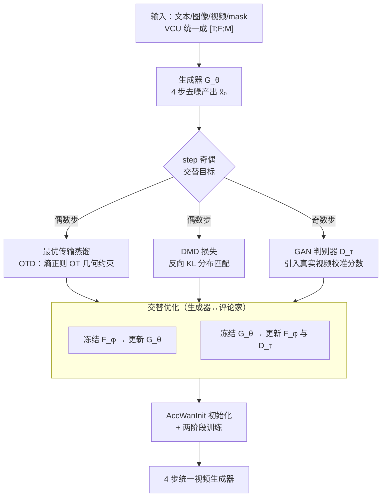

# VDOT: Efficient Unified Video Creation via Optimal Transport Distillation

**会议**: CVPR 2026  
**论文**: [CVF Open Access](https://openaccess.thecvf.com/content/CVPR2026/html/Wang_VDOT_Efficient_Unified_Video_Creation_via_Optimal_Transport_Distillation_CVPR_2026_paper.html)  
**代码**: https://vdot-page.github.io （项目页）  
**领域**: 视频生成 / 扩散模型蒸馏  
**关键词**: 统一视频创作, 分布匹配蒸馏(DMD), 最优传输, 少步生成, 对抗判别器

## 一句话总结
VDOT 把一个 14B 的统一视频创作大模型（VACE-Wan2.1）蒸馏成只需 4 步去噪的少步生成器，关键是在分布匹配蒸馏（DMD）里**首次引入熵正则最优传输（OT）距离**作为几何约束，缓解 KL 蒸馏在少步场景下的 zero-forcing / 梯度坍塌问题，再配一个对抗判别器引入真实视频，最终 4 步效果追平甚至超过教师 50 步。

## 研究背景与动机

**领域现状**：统一视频创作（unified video creation）想用一个模型支持各种条件——文本、参考图、深度/姿态/光流、mask 编辑等。代表工作 VACE 把所有条件统一成「帧 + mask」表示，UNIC 把所有输入编码成三类 token，都达到了不错的视觉保真度。

**现有痛点**：这些统一模型为了同时吃下多种条件，架构复杂、参数量巨大（VACE 基于 Wan-14B），推理时要跑 50~100 步去噪，单条视频生成动辄几十秒到几分钟，**根本没法在真实应用里部署**。

**核心矛盾**：能不能既保留统一模型的多任务能力，又把推理步数压到个位数？现成的扩散蒸馏方案在视频上水土不服——Self-Forcing 把 DMD 范式搬到视频，但在 4 步这种极少步场景下，**只靠反向 KL 散度**做分布匹配会出问题：反向 KL 是 mode-seeking 的，初期真假分布差距巨大、又没有方向引导，训练很容易 zero-forcing（学生分布不去覆盖教师有概率但自己概率趋零的区域）或梯度坍塌（学生有概率而教师概率趋零的区域梯度炸到 $+\infty$），导致训练不稳、多样性丢失。

**本文目标**：(1) 给少步蒸馏一个比 KL 更稳的分布匹配目标；(2) 引入真实视频数据修正纯蒸馏带来的分数估计误差和教师的坏习惯；(3) 补上统一视频创作缺失的大规模训练数据与评测基准。

**切入角度**：反向 KL 的毛病在于它**没有几何结构**——它只看逐点的概率比值，不管"把质量从哪搬到哪"。最优传输（OT）天生带几何约束：它显式地为两个分布之间建立一条传输计划，告诉你每个样本该往哪个目标对齐，这正好能给少步蒸馏初期那种"乱跑"的优化提供方向。

**核心 idea**：在 DMD 的分布匹配里，用熵正则 OT 距离（Sinkhorn 可解）替代/补充反向 KL，再叠加一个对抗判别器引入真实视频，三个损失（OTD + DMD + GAN）交替优化，把 14B 教师蒸成 4 步学生。

## 方法详解

### 整体框架

VDOT 接受文本、图像、视频、mask 四类输入，输出一段符合任务要求的视频，整个推理只需 4 步去噪。它以预训练的 **VACE-Wan2.1-14B** 为教师与生成器骨架：VACE 用一个 **Video Condition Unit（VCU）** $V=[T;F;M]$ 把异构条件统一成「文本 + 上下文帧 $F$ + 对齐 mask $M$」三元组，通过调整帧与 mask 的取值就能表达 T2V / R2V / V2V / MV2V 等所有任务（如 T2V 时帧全 0、mask 全 1）。

训练沿用 DMD 范式，但用了三个分数/判别网络协同：一个**冻结的真实分数网络 $F_\psi$**（教师，估计真实分布的分数）、一个**可学习的假分数网络 $F_\phi$**（学生，估计当前生成分布的分数）、一个**判别器 $D_\tau$**。生成器 $G_\theta$ 的训练目标由三部分构成——OTD 损失（OT 几何约束）、DMD 损失（原始 KL 分布匹配）、GAN 损失（对抗引入真实数据）。优化采用**交替策略**：每一步内部先冻结 $F_\phi$ 训 $G_\theta$、再冻结 $G_\theta$ 训 $F_\phi$ 和 $D_\tau$；而**步与步之间**则在「分布匹配目标」与「对抗目标」之间交替（step 为偶数走 OTD+DMD / denoising，为奇数走 GAN）。

### 关键设计

**1. 最优传输蒸馏（OTD）：给分布匹配装上几何约束**

这是全文最核心的创新，专治少步蒸馏里反向 KL 的 zero-forcing / 梯度坍塌。反向 KL $D_{KL}(p_{fake}\|p_{real})$ 是逐点比较概率密度比值的，没有"质量从哪搬到哪"的方向信息：在 $p_{fake}\to0, p_{real}>0$ 的区域积分趋 0，学生干脆不去更新这些区域（zero-forcing，覆盖不全）；在 $p_{fake}>0, p_{real}\to0$ 的区域积分趋 $+\infty$，梯度炸掉（训练不稳）。OTD 的做法是把两个分数分布看成两堆样本 $p_{fake}=[a_i]\in\mathbb{R}^{I\times D}$、$p_{real}=[b_j]\in\mathbb{R}^{J\times D}$（$I,J$ 是展平的空间维度，即 latent 高×宽），求它们之间的**熵正则最优传输（EOT）距离**：

$$W_2^{\epsilon}(p_{fake},p_{real})=\min_{T\in\Pi(u,\mu)}\langle D,T\rangle+\epsilon\langle T,\log T\rangle$$

其中 $D$ 是样本间的平方欧氏距离矩阵，第二项是熵正则（$\epsilon$ 控强度），让问题可以用 **Sinkhorn 算法**以 $O(IJ)$ 复杂度高效求解。最优传输计划 $T^*$ 充当了一个 "frame"-级的空间对齐。根据包络定理，目标对距离矩阵的导数就是 $T^*$ 本身，于是对样本 $a_i$ 的梯度为 $\nabla_{a_i}W_2^\epsilon=\sum_j T^*_{ij}(a_i-b_j)$，再经链式法则得到对噪声样本 $x_t$ 的梯度 $\nabla_{OT}(x_t,t)$（实现上直接用 `torch.autograd`）。最后 OTD 损失和 DMD 损失同构：

$$L_{OTD}(\theta)=\mathbb{E}_{z,t,x_t}\left[\|\hat{x}_0-\text{sg}(\hat{x}_0-\nabla_{OT}(x_t,t))\|_2^2\right]$$

为什么有效：OT 计划 $T^*$ 显式规定了"每个假样本该被搬向哪个真样本"，给优化方向上了一道几何护栏，避免学生分布乱跑或只往局部高概率区扎堆。相比 ADP 那种"先用对抗预训练缓解 mode-seeking"的方案（要离线收集大量教师 ODE 对、再插值生成噪声样本，又贵又费人力），OTD 是直接在分布匹配目标里加约束，更轻量。作者称这是 **OT 首次用于 DMD**。

**2. 对抗判别器：引入真实视频修正分数误差**

VDOT 沿用 Self-Forcing 而非 Teacher-Forcing——它不拿真实视频帧当去噪条件，而是用前面已去噪的帧来去噪当前帧，从而保持训练/测试一致。但代价是训练时**完全看不到真实数据**：纯分布匹配会让真实分数网络 $F_\psi$ 的近似误差表现为视频纹理/细节上的伪影，而且生成质量被教师模型天花板锁死，还会继承教师的一些坏习惯。为此 VDOT 加了一个判别器 $D_\tau$ 把真实视频引进来：从假分数网络 $F_\phi$ 的去噪块里选 **第 23、31、39 块**，引入三个可学习的 registration token 通过 cross-attention 与这些块交互，输出沿通道维拼接后过一个线性分类器给出真假 logits。给定与输入 prompt 对应的真实视频，先用预训练 VAE 编码进同一 latent 空间得 $x_{real}$，再按调度器随机时间步给 $x_{real}$ 和 $\hat{x}_0$ 加噪得 $x_t^{real}, x_t^{fake}$，用 relative GAN loss 校准分数：

$$L_{GAN}(\theta)=\mathbb{E}_{z,t}\left[-(D_\tau(x_t^{fake},t)-D_\tau(x_t^{real},t))\right]$$

判别器侧目标 $L_{GAN}(\tau)$ 方向相反。这一支让生成器有机会"看见"真实视频统计量，突破教师天花板、压掉伪影。

**3. AccWanInit + 两阶段训练：给少步生成器一个强初始化**

少步生成器若从零或从教师权重直接起训，收敛慢、效率低。VDOT 用两阶段训练并提出 **AccWanInit** 初始化：阶段一用 Self-Forcing 管线把 Wan2.1-T2V-14B 蒸成少步生成器（1500 步，Artgrid 字幕）；阶段二把生成器从 VACE-Wan2.1-14B **结合阶段一权重**初始化（即用一个已蒸好的少步 Wan 去初始化 VACE 里的 Wan 块，这个过程就叫 AccWanInit），再在多任务数据（8 单条件 + 10 复合任务）上训 1200 步。消融显示 AccWanInit 提供了更强的初始化、显著加快训练效率（图 5 的 quality-vs-steps 曲线）。

### 损失函数 / 训练策略

生成器目标在偶数步为 $L_\theta=L_{OTD}(\theta)+\lambda L_{DMD}(\theta)$、奇数步为 $L_{GAN}(\theta)$；评论家侧偶数步训假模型的扩散去噪损失 $L_{Denoising}(\phi)$、奇数步训判别器 $L_{GAN}(\tau)$。真实分数 $F_\psi$ 全程冻结。实现上基于 Wan2.1-VACE-14B，Adam 优化器，critic 学习率 $4\times10^{-7}$、TTUR 比 5；阶段一生成器学习率 $2\times10^{-6}$、阶段二 $1\times10^{-6}$；4 卡 H200、每卡 batch 1、gradient checkpointing（size 4）省显存。

## 实验关键数据

评测用自建的 **UVCBench**（18 任务：8 单条件 + 10 复合，每任务 20 条视频），用 VBench 的六维指标（美学质量、背景一致性、动态程度、成像质量、运动平滑度、主体一致性）算 Normalized Average，外加 20 人 user study（Prompt Following / Temporal Consistency / Video Quality，1–5 Likert）。

### 主实验

下表节选几个任务的 Normalized Average 与 NFE（去噪步数），对比教师 VACE-Wan-14B（100 步）：

| 任务 | 方法 | 步数 NFE | 客观 Norm. Avg | User Study Avg |
|------|------|---------|---------------|----------------|
| Depth | VACE (Wan-14B) | 100 | 77.34% | 4.46 |
| Depth | **VDOT** | **4** | **78.50%** | 4.46 |
| Pose | VACE (Wan-14B) | 100 | 79.56% | 4.43 |
| Pose | **VDOT** | **4** | **80.54%** | **4.47** |
| Flow | VACE (Wan-14B) | 100 | 80.35% | 4.45 |
| Flow | **VDOT** | **4** | 80.18% | **4.51** |
| Extension | VACE (Wan-14B) | 100 | 77.10% | 4.52 |
| Extension | **VDOT** | **4** | **80.53%** | 4.36 |
| R2V | VACE (Wan-14B) | 100 | 82.54% | 4.66 |
| R2V | **VDOT** | **4** | 81.32% | 4.64 |

核心结论：VDOT **用 4 步**就在多数任务上追平或超过教师 **100 步**的客观指标，成像质量（Imaging Quality）几乎都拿到最佳或次佳；user study 平均偏好与教师持平甚至更高。相比 SD-1.5 系的任务专用方法（Control-A-Video、ControlVideo、Follow-Your-Pose 等，多为 50~100 步且分数明显更低），优势显著。R2V 上不及在线商业系统 Keling-1.6（83.50%），但已优于 Vidu-2.0。

### 消融实验

下表为 Normalized Average（部分任务），基座 VACE-Wan2.1-14B，除 row(1) 外都训 1200 步：

| 配置 | DMD | OTD | GAN | AccWanInit | Depth | Pose | R2V |
|------|-----|-----|-----|-----------|-------|------|-----|
| (2) Self-Forcing（仅 DMD） | ✓ | | | | 76.89% | 78.34% | 76.45% |
| (3) 去掉 GAN | ✓ | ✓ | | ✓ | 78.24% | 80.14% | 77.66% |
| (4) 去掉 OTD | ✓ | | ✓ | ✓ | 78.05% | 80.79% | 78.40% |
| (5) 去掉 AccWanInit | ✓ | ✓ | ✓ | | 77.15% | 79.83% | 77.00% |
| **VDOT（全量）** | ✓ | ✓ | ✓ | ✓ | **78.50%** | **80.54%** | **81.32%** |

### 关键发现
- **只用 DMD（row 2，等价 Self-Forcing）是所有配置里最差的**，验证了"少步场景纯 KL 蒸馏不够稳"的动机；加上 OTD/GAN/AccWanInit 后各任务普遍回升。
- **去掉 OTD（row 4）或去掉 GAN（row 3）都会一致掉点**，说明几何约束和真实数据校准各自不可替代；OTD 对 R2V 这类语义/结构要求高的任务增益尤其明显（77.66%→81.32%）。
- **AccWanInit（row 5 → 全量）主要贡献训练效率**：它给少步生成器更强初始化，图 5 的 quality-vs-training-steps 曲线显示带 OTD+AccWanInit 收敛更快。

## 亮点与洞察
- **把 OT 引入 DMD 是个干净的"换度量"创新**：不改 DMD 的损失形式（$L_{OTD}$ 和 $L_{DMD}$ 同构），只把"逐点 KL 梯度"换成"OT 传输计划梯度"，几乎零侵入地给少步蒸馏装上几何护栏，思路可迁移到任何用 DMD 的图像/视频蒸馏。
- **熵正则 + Sinkhorn 让 OT 在高维 latent 上变得可算**（$O(IJ)$），把原本"理论上更好但算不动"的 Wasserstein 约束落地，是工程上的关键一步。
- **判别器挂在假分数网络的中间块上**（23/31/39 块 + registration token + cross-attention），复用了已有特征而非另起一个独立大判别器，省参数又能引真实数据，是个可复用的轻量判别器接法。
- **数据/评测一起补**：全自动数据管线（25 万 4K 视频 + InternVL/Qwen3 字幕与任务感知过滤）+ UVCBench（18 任务含 10 复合任务）填了统一视频创作评测的空白，对后续工作有基础设施价值。

## 局限与展望
- **R2V 等高难任务仍落后商业系统**（Keling-1.6 83.50% vs VDOT 81.32%），少步蒸馏在最难的语义保持上还有差距。
- **强依赖教师 VACE-Wan-14B**：方法是"把这个特定教师蒸小"，GAN 虽能部分突破教师天花板，但整体能力上限仍受教师约束；换教师需重训。
- **复合任务结果主要放在附录**，正文主表以单条件任务为主，复合任务（10 个里占多数）的稳健性披露不够充分。
- **$\lambda$、$\epsilon$（熵正则强度）等关键超参的敏感性分析缺失**，OTD 与 DMD 的配比对结果影响多大正文没给。

## 相关工作与启发
- **vs Self-Forcing（DMD 视频蒸馏）**：Self-Forcing 仅用 DMD + denoising loss 蒸少步视频生成器；VDOT 指出其在少步下的 zero-forcing/坍塌问题，用 OTD 几何约束 + GAN 真实数据补强，消融里 Self-Forcing（row 2）正是最差配置。
- **vs VACE / UNIC（统一视频创作）**：它们追求多任务统一与高保真但架构臃肿、需几十上百步；VDOT 不重造统一架构，而是直接把 VACE 蒸成 4 步，复用其 VCU 统一表示。
- **vs ADP（对抗缓解 mode-seeking）**：ADP 靠对抗预训练 + 离线收集教师 ODE 对来缓解 KL 的 mode-seeking，代价高；VDOT 用 OT 几何约束在线解决，无需离线 ODE 对。
- **vs WGAN / Wasserstein Autoencoder（OT 在生成里的经典用法）**：前者把 OT 用在数据↔模型分布的对齐；VDOT 把 OT 创新地用在**师生分数分布**的匹配上（DMD 框架内），定位不同。

## 评分
- 新颖性: ⭐⭐⭐⭐ 首次把熵正则 OT 引入 DMD 分布匹配，动机清晰、切口干净，但属于"在成熟范式上换度量 + 拼判别器"的组合式创新。
- 实验充分度: ⭐⭐⭐⭐ 18 任务大基准 + 客观/主观双评 + 完整消融，少步对教师的对比有说服力；但 R2V 落后商业系统、复合任务披露偏附录、关键超参敏感性缺失。
- 写作质量: ⭐⭐⭐⭐ OT/DMD 推导完整、算法伪代码清楚，框架与损失交替策略讲得明白。
- 价值: ⭐⭐⭐⭐ 把 14B 统一视频模型压到 4 步且质量不掉，实用价值高；附带的全自动数据管线与 UVCBench 对社区有基础设施意义。

<!-- RELATED:START -->

## 相关论文

- [\[CVPR 2026\] Reward Forcing: Efficient Streaming Video Generation with Rewarded Distribution Matching Distillation](reward_forcing_efficient_streaming_video_generation_with_rewarded_distribution_m.md)
- [\[CVPR 2026\] Transition Matching Distillation for Fast Video Generation](transition_matching_distillation_for_fast_video_generation.md)
- [\[CVPR 2026\] EffectMaker: Unifying Reasoning and Generation for Customized Visual Effect Creation](effectmaker_unifying_reasoning_and_generation_for_customized_visual_effect_creat.md)
- [\[ICCV 2025\] V.I.P.: Iterative Online Preference Distillation for Efficient Video Diffusion Models](../../ICCV2025/video_generation/vip_iterative_online_preference_distillation_for_efficient_video_diffusion_model.md)
- [\[CVPR 2026\] DreamStyle: A Unified Framework for Video Stylization](dreamstyle_a_unified_framework_for_video_stylization.md)

<!-- RELATED:END -->
