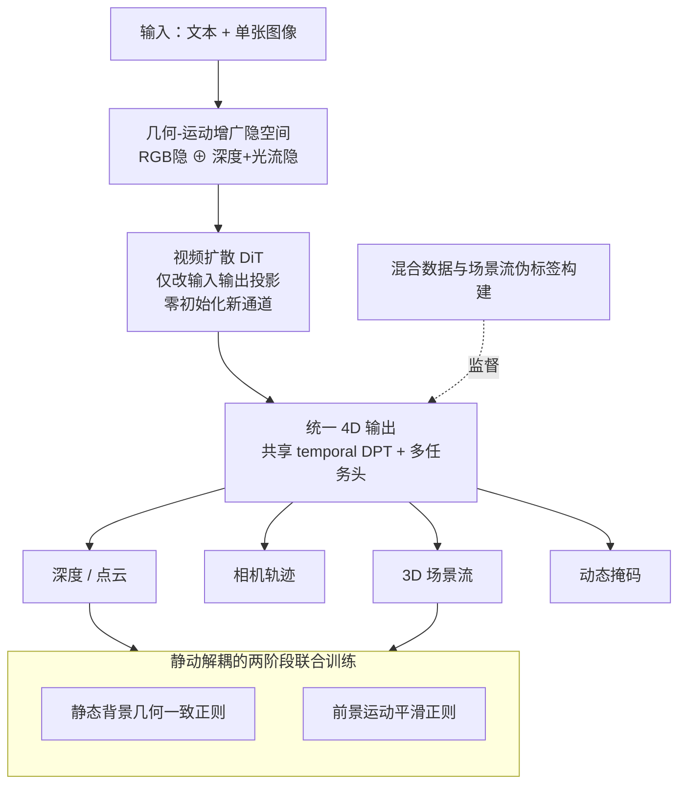

# WorldReel: 4D Video Generation with Consistent Geometry and Motion Modeling

**会议**: CVPR 2026  
**论文**: [CVF Open Access](https://openaccess.thecvf.com/content/CVPR2026/html/Fang_WorldReel_4D_Video_Generation_with_Consistent_Geometry_and_Motion_Modeling_CVPR_2026_paper.html)  
**代码**: 无（仅有项目页 https://bshfang.github.io/worldreel/ ）  
**领域**: 视频生成 / 4D 生成 / 世界模型  
**关键词**: 4D 视频生成, 几何-运动隐空间, 场景流, 视频扩散, DPT 多任务

## 一句话总结
WorldReel 把视频扩散模型的隐空间用「深度+光流」增广，并让模型在生成 RGB 的同时直接吐出逐帧点云、相机轨迹、3D 场景流和动态掩码，用合成数据的精确 4D 标签加正则项把静态几何和动态运动解耦监督，从而生成在大幅相机/非刚性运动下仍然 3D 一致的视频，深度误差从 0.353 降到 0.287。

## 研究背景与动机
**领域现状**：当前主流视频生成器（CogVideoX、Sora 类 DiT）画质和时间平滑性都很惊艳，能在多样 prompt 下生成逼真视频。

**现有痛点**：这些模型并不维护一个「随时间演化的单一稳定 3D 场景」。表现出来就是视角漂移（view-time drift）、几何闪烁（geometric flicker）、相机运动和物体运动纠缠在一起；一旦需要外推视角或编辑内容（世界模型场景），这些问题就被放大。

**核心矛盾**：要做 4D 生成，已有两条路都不通——① 优化式（SDS 蒸馏显式 4D 表示）计算极重、通常只能处理单个动态物体；② 后处理式（先生成可控 2D 视频，再事后 lift 成 3D）从根上继承了 2D 视频先验的几何不一致，且难以泛化到 in-the-wild 动态。**没有任何方法把真正的 4D 结构原生地嵌进生成先验里**。

**核心矛盾的另一面是数据**：精确的 4D 标签（深度/相机/场景流）几乎只能从合成数据拿到，但合成数据规模小、外观分布和真实世界差距大；真实视频有多样性却没有干净标签。如何既吃到合成数据的精确监督、又不丢真实感，是个 trade-off。

**本文目标**：训练一个原生时空一致的 4D 视频生成器，在生成视频的同时输出一套完整的显式 4D 场景表示（点云、相机轨迹、稠密流），用这个显式表示强制「一个贯穿时间和视角的底层场景」。

**切入角度**：作者的关键观察是——深度图和光流和 RGB 帧天然对齐、是稠密的 image-like 模态，可以直接复用预训练 3D VAE 编码；而且它们「3D-focused、过滤掉外观纹理」，让合成/真实数据的分布差距变小。于是可以把它们当作隐空间的额外通道，注入 4D 归纳偏置。

**核心 idea**：用一个「外观无关的几何-运动增广隐空间」喂给视频 DiT，再用共享的 temporal DPT 解码头把这个隐空间映射成统一的 4D 输出并显式监督，让几何/运动梯度反传回隐空间，逼模型学出一个 3D 一致的内部场景。

## 方法详解

### 整体框架
WorldReel 建立在预训练的视频隐扩散模型（CogVideoX-5B-I2V）之上，整条管线分两侧：**输入侧**把 RGB 隐变量和「深度+光流」编码出的几何-运动隐变量在通道维拼接，得到增广隐空间送进 DiT；**输出侧**用一个共享的 temporal DPT 解码器从隐变量里预测统一的 4D 表示（逐帧点云/深度、标定相机、3D 场景流、动态掩码），并对这些输出加显式监督和正则。训练用「合成（精确标签）+真实（伪标签）」混合数据，分两阶段：先各自训 DiT 和 DPT 头，再端到端联合训练并加上解耦静/动的正则项。推理时只需文本 prompt + 单张图，不需要额外输入。

### 关键设计

**1. 几何-运动增广隐空间：把 4D 先验塞进视频隐空间的入口**

视频 DiT 原本只在 RGB 隐空间里建模，缺乏 3D 几何和运动的归纳偏置，所以生成的视频在 3D 上漂移。WorldReel 的做法是：取逐帧深度 $D_i \in \mathbb{R}^{H\times W\times 1}$ 和前向 2D 光流 $F^{2d}_i \in \mathbb{R}^{H\times W\times 2}$，先归一化到和 RGB 同样的值域 $\tilde D_i = 2\cdot\frac{D_i - d_{\min}}{d_{\max}-d_{\min}} - 1$、$\tilde F^{2d}_i = \frac{F^{2d}_i}{|F^{2d}|_{\max}}$，再用**预训练的 3D VAE** 把它们编码成几何-运动隐变量 $z^{gm}_0 = E([\tilde D; \tilde F^{2d}])$，最后和原始视频隐变量在通道维拼接 $z_0 = [z^{rgb}_0; z^{gm}_0]$ 喂给 DiT。

选深度+光流而不是别的表示，是因为它们和 RGB 一样是稠密 image-like、能直接被现成 3D VAE 编解码、能从基础模型大规模拿到，而且「3D-focused」地把外观纹理过滤掉，缩小了合成与真实的分布 gap——这正是后面能放心用合成数据精确标签的前提。

**2. 用最小改动适配预训练 DiT + 零初始化：保住生成能力不崩**

隐空间通道翻倍后，如果大改架构会丢掉预训练权重。作者只改 DiT 的**输入/输出投影层**以适配双倍通道，中间所有 block 原封不动；并对输入投影层用**零初始化**：对应原始视频隐 $z^{rgb}$ 的权重从预训练模型加载，新扩展出来、对应几何-运动隐 $z^{gm}$ 的参数初始化为 0。这样训练一开始模型行为和原视频扩散模型完全一致，几何-运动信号是「逐渐长出来」的，避免训练初期被新通道带崩，显著提升稳定性。

**3. 统一 4D 表示输出 + 共享 DPT 多任务头：让几何梯度反传回隐空间**

光靠输入侧的深度/光流（2.5D）不足以恢复 3D 结构，尤其相机运动和物体运动在 2.5D 下纠缠、无法解耦。所以 WorldReel 在输出侧直接预测细粒度 4D 表示 $(D_i, P_i, C_i, F^{3d}_i, M_i)$：相机内外参 $C_i\in\mathbb{R}^9$、点云 $P_i$、3D 场景流 $F^{3d}_i$、动态掩码 $M_i$，其中相机/点云/场景流都表示在**第一帧规范坐标系**里，保证跨帧描述同一个场景。

实现上用一个**定制的 temporal DPT 解码器**：从隐变量抽多尺度稠密特征，经带时间 transformer 的 DPT 融合骨干聚合，**只有最后一层**才分出多个轻量任务头分别预测各任务。共享骨干一方面省参数，另一方面起到强正则作用——逼模型为所有任务学一个统一、几何一致的表示。对这些 4D 输出的显式监督会把几何相关梯度反传回隐空间，从而帮助解耦相机运动和物体运动，把 3D 动态压进更好的隐空间里。其中场景流 $F^{3d}$ 直接编码 3D 动态，比 2D 光流/关键点追踪更干净地把相机运动和物体运动分开，并工作在物理意义明确的演化 3D 坐标系里。

**4. 静动解耦的两阶段联合训练与正则：分别守住静态几何一致和动态运动平滑**

训练分两阶段。**第一阶段**单独训：先 finetune 几何-运动增广 DiT（标准扩散损失 $\mathcal{L}_{diff} = \mathcal{L}^{rgb}_{diff} + \mathcal{L}^{gm}_{diff}$），再从头训 temporal DPT 头，用多任务损失

$$\mathcal{L}_{dpt} = \mathcal{L}_{depth} + \mathcal{L}_{pc} + \mathcal{L}_{cam} + \mathcal{L}_{mask} + \lambda_{flow}\mathcal{L}_{flow}$$

（深度/点云用带 valid 掩码的 L1、相机用 Huber、掩码用 BCE，flow 按动态掩码逐像素重加权聚焦前景运动）。**第二阶段**端到端联合训练，并加入按背景/前景掩码区分的正则：对**静态背景**用深度一致正则 $\mathcal{L}^{depth}_{reg} = \sum_i\sum_j \|\hat M^{bg}_i \odot (D_j - \text{Proj}(D_i, T_{i\to j}))\|_2$（把第 $i$ 帧深度按相机相对位姿 $T_{i\to j}$ 投到第 $j$ 帧，要求和 $D_j$ 一致），对**动态前景**用场景流空间梯度平滑正则 $\mathcal{L}^{flow}_{reg} = \sum_i (\|\hat M^{fg}_i \odot \nabla_x F^{3d}_i\|_2 + \|\hat M^{fg}_i \odot \nabla_y F^{3d}_i\|_2)$。联合目标为 $\mathcal{L} = \mathcal{L}_{diff} + \lambda_{dpt}\mathcal{L}_{dpt} + \lambda_{reg}\mathcal{L}_{reg}$。

这套「静态守几何一致、动态守运动平滑」的分而治之是关键：实验显示对比 GeoVideo 那种只盯静态几何的正则，会逼模型偏好静态内容来维持一致性、牺牲动态；WorldReel 通过显式分别监督静/动两部分，绕开了这个 trade-off。

**5. 混合数据与场景流伪标签构建：用真实数据补多样性，自造 3D 场景流标签**

精确 4D 标签几乎只有合成数据有（PointOdyssey、BEDLAM、Dynamic Replica、Omniworld-Game），但合成数据规模和复杂度不够。作者补充从 Panda-70M 经 SpatialVid 筛出的高质量真实视频，用 SOTA 基础模型重标注：深度用 GeometryCrafter 拿时间平滑序列，相机/深度/前景掩码用 ViPE，点云由深度反投影得到（统一到第一帧规范坐标）。

最难的是场景流——真值几乎拿不到。作者借鉴 zero-MSF，从光流+几何标签自造稠密 3D 场景流伪标签：用 SEA-RAFT 算前/后向光流及逐像素不确定度，对帧 $i$ 中像素 $\mathbf{u}$ 定义前向映射 $\mathbf{q}(\mathbf{u}) = \mathbf{u} + F^{2d}_{i\to i+1}(\mathbf{u})$，则

$$\hat F^{3d}_i(\mathbf{u}) = \begin{cases} P_{i+1}(\mathbf{q}(\mathbf{u})) - P_i(\mathbf{u}), & \text{if } \hat M_i(\mathbf{u}) = 1 \\ \mathbf{0}, & \text{otherwise} \end{cases}$$

即在相邻点云间按光流找对应、做差得 3D 位移。这类标签噪声大，于是再叠一个有效性掩码 $M^{flow}_i$，只保留通过前景/实例、不确定度、前后向一致性检查的像素，训练 $\mathcal{L}_{flow}$ 和 $\mathcal{L}^{flow}_{reg}$ 时才计入。

### 损失函数 / 训练策略
基模型 CogVideoX-5B-I2V，生成 480×720、49 帧视频，4D 表示在同分辨率下降采样到 13 帧。两阶段：先 finetune 几何-运动增广 DiT 20K 步、单独训 DPT 头 100K 步；再端到端联合训 10K 步。8×H200，batch 8，AdamW，学习率 2e-5；$\lambda_{flow}=5.0$、$\lambda_{dpt}=0.1$、$\lambda_{reg}=0.5$。

## 实验关键数据

### 主实验
评测基于 SpatialVid 验证集构建两个 benchmark：general motion（500 随机视频）和 complex motion（500 个 3D 运动幅度最大的视频）。指标用 VBench 的 5 项（动态度 d.d.、运动平滑 m.s.、i2v-subject/background、subject consistency）+ FVD/FID。

| 数据集 | 指标 | WorldReel | GeoVideo | 4DNeX | 说明 |
|--------|------|-----------|----------|-------|------|
| General | d.d. ↑ | **0.73** | 0.54 | 0.03 | 动态度远超基线 |
| General | FVD ↓ | **336.1** | 371.3 | 712.5 | 比同数据训练的 GeoVideo -9.5% |
| General | FID ↓ | **36.58** | 46.78 | 44.97 | 画质最好 |
| Complex | d.d. ↑ | **1.00** | 0.79 | 0.19 | complex 集满分动态度 |
| Complex | FVD ↓ | **394.2** | 409.9 | 632.8 | -3.8% |

4DNeX 虽然 subject consistency 高（0.983），但动态度仅 0.03、FVD 712.5，说明它塌缩成近乎静态视频——一致性是靠「不动」换来的。

4D 场景几何质量（Table 2，用 ViPE 伪真值，深度报 log-RMSE/δ，相机报 ATE/RTE/RRE）：

| 指标 | WorldReel | GeoVideo | 4DNeX |
|------|-----------|----------|-------|
| 深度 log-rmse ↓ | **0.287** | 0.353 | 0.479 |
| 深度 δ1.25 ↑ | **71.1** | 63.4 | 39.9 |
| ATE ↓ | **0.005** | 0.011 | 0.006 |
| RTE ↓ | **0.007** | 0.012 | 0.017 |
| RRE ↓ | **0.317** | 0.443 | 0.378 |

WorldReel 深度和相机位姿全面最优；4DNeX 虽 ATE 低，但轨迹长度/旋转近零，说明相机几乎没动。

### 消融实验

| 配置 | General FVD ↓ | Complex FVD ↓ | Complex d.d. ↑ | 说明 |
|------|--------------|---------------|----------------|------|
| base finetuned | 383.4 | 437.0 | 0.98 | 仅 finetune 基模型 |
| w/o g.m. | 359.2 | 452.8 | 0.93 | 去几何-运动隐，complex FVD 反升（452.8 比 base 还差） |
| w/o joint | 354.5 | 411.8 | 0.96 | 去联合训练/正则 |
| freeze dpt | 336.0 | 382.3 | 0.98 | 冻 DPT 头，FVD 最低 |
| **full** | 336.1 | 394.2 | **1.00** | FID 最低、complex 动态度满分 |

几何模块的消融（Table 2）：w/o geomotion 深度 δ 升到 67.2 但 RRE/轨迹变差；w/o joint 深度 log-rmse 退到 0.399、相机 RRE 升到 0.410，证实联合训练对 4D 一致性关键。

### 关键发现
- **几何-运动隐对复杂动态最关键**：在 RGB-only 模型上直接加联合训练+正则（w/o g.m.），complex 集 FVD（452.8）甚至比简单 finetune（437.0）还差——说明正则必须建立在几何-运动隐之上才有意义。
- **静态几何正则会反噬动态**：GeoVideo 只盯静态几何一致，逼模型偏好静态内容；WorldReel 显式分别监督静/动两部分，把动态度从 0.54 拉到 0.73（general）、0.79→1.0（complex）。
- **freeze dpt 拿到最低 FVD 但 full 拿到最低 FID + 满分动态度**：作者选 full 作为主模型，体现 FVD 与动态度/画质间的取舍。

## 亮点与洞察
- **「输入注入 + 输出监督」双管齐下**：输入侧加 2.5D 先验（深度+光流）给归纳偏置，输出侧预测完整 4D 并把几何梯度反传回隐空间。单靠输入是 2.5D、解不开相机/物体运动，单靠输出监督又缺先验，两者合起来才把 4D 压进隐空间。
- **零初始化扩通道**：复用预训练 DiT 时把新通道权重置零，让模型从「等价于原模型」平滑过渡，是适配预训练大模型加新模态的可复用 trick。
- **场景流伪标签自造**：用「相邻点云按光流找对应做差」造稠密 3D 场景流标签，再用多重一致性检查滤噪，绕开了 3D 场景流真值几乎不可得的瓶颈，可迁移到任何需要动态 3D 监督的任务。
- **共享 DPT 骨干当正则**：让所有 4D 任务共享一个解码骨干、只在最后分头，既省参数又逼模型学统一几何表示——多任务密集预测的好范式。

## 局限与展望
- 训练需要额外 4D 监督（相机/几何/场景流），目前主要来自合成数据；尽管有缓解 domain gap 的策略，gap 仍限制对罕见运动/动态的泛化。
- 时间窗口有限，在剧烈拓扑变化、严重遮挡、快速运动下会失败。
- 自己看：4D 标签依赖一串现成基础模型（GeometryCrafter/ViPE/SEA-RAFT），伪标签质量上限受这些模型限制；评测的几何「真值」也来自 ViPE，是自洽但非绝对真值，跨方法比较需注意 caveat。
- 作者展望：用弱/自监督的 4D 信号减少监督依赖、用流式/因果扩散扩展时间上下文维持持久世界状态、加可控场景分解做长时程交互式 4D 生成。

## 相关工作与启发
- **vs GeoVideo [3]**：GeoVideo 加显式几何正则提升静态 3D 一致，但只盯静态几何，会惩罚动态内容生成；WorldReel 同时显式建模几何和运动、分别监督静/动，避开 trade-off，动态度和画质双赢。
- **vs 4DNeX [10]**：4DNeX 联合建模视频和点云几何，但不显式建模场景动态、相机几乎不动、易塌缩成静态；WorldReel 显式输出场景流和相机轨迹，动态度远高。
- **vs DimensionX [52] 等 lift 式 4D**：它们靠可控视频生成 + 额外重建阶段造 4D，继承 2D 先验的几何不一致；WorldReel 把 4D 原生集成进生成先验，推理时无需额外重建。
- **vs 优化式 4D（SDS 蒸馏）[2,38,43]**：那类计算重、通常只能单物体；WorldReel 是前馈的、面向复杂动态场景。

## 评分
- 新颖性: ⭐⭐⭐⭐⭐ 首个把完整 4D 结构（点云+相机+场景流）原生嵌进视频生成先验、且静动解耦监督的前馈框架
- 实验充分度: ⭐⭐⭐⭐ 两个 motion 难度集 + 视频质量/几何质量双维度评测 + 完整消融，但缺真实 4D 真值、依赖伪真值
- 写作质量: ⭐⭐⭐⭐ 动机和方法链条清晰，公式和数据流图配合好
- 价值: ⭐⭐⭐⭐⭐ 把视频生成推向「可渲染、可编辑、agent-ready」的 4D 一致世界模型，方向价值高

<!-- RELATED:START -->

## 相关论文

- [\[CVPR 2026\] Geometry-as-context: Modulating Explicit 3D in Scene-consistent Video Generation to Geometry Context](geometry-as-context_modulating_explicit_3d_in_scene-consistent_video_generation_.md)
- [\[CVPR 2026\] StereoWorld: Geometry-Aware Monocular-to-Stereo Video Generation](stereoworld_geometry-aware_monocular-to-stereo_video_generation.md)
- [\[ICLR 2026\] Geometry-aware 4D Video Generation for Robot Manipulation](../../ICLR2026/video_generation/geometry-aware_4d_video_generation_for_robot_manipulation.md)
- [\[CVPR 2026\] MotionV2V: Editing Motion in a Video](motionv2v_editing_motion_in_a_video.md)
- [\[CVPR 2026\] LaVR: Scene Latent Conditioned Generative Video Trajectory Re-Rendering using Large 4D Reconstruction Models](lavr_scene_latent_conditioned_generative_video_trajectory_re-rendering_using_lar.md)

<!-- RELATED:END -->
