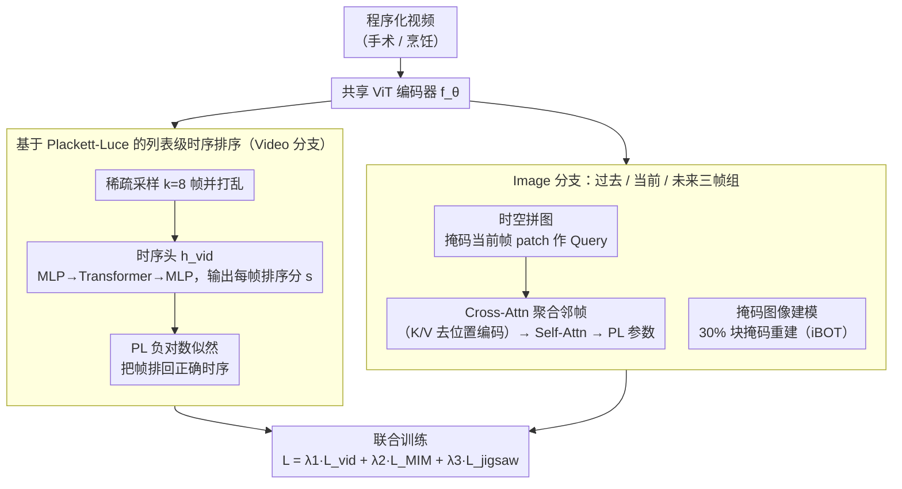

# A Stitch in Time: Learning Procedural Workflow via Self-Supervised Plackett-Luce Ranking

**会议**: CVPR 2026  
**arXiv**: [2511.17805](https://arxiv.org/abs/2511.17805)  
**代码**: [https://github.com/visurg-ai/PL-Stitch](https://github.com/visurg-ai/PL-Stitch)  
**领域**: 视频理解 / 自监督学习  
**关键词**: 程序化活动理解, 时序排序, Plackett-Luce模型, 自监督学习, 手术视频

## 一句话总结

提出 PL-Stitch 自监督框架，利用 Plackett-Luce 概率排序模型将视频帧的时序排序作为预训练信号，学习具有"程序感知"能力的视频表示，在手术阶段识别和烹饪动作分割上全面超越现有自监督方法。

## 研究背景与动机

程序化活动（如烹饪、手术）由一系列严格按时序执行的步骤组成，理解这种时序结构对于机器人辅助手术、动作预测等下游任务至关重要。当前主流自监督方法（如 DINO、MAE、VideoMAE）主要通过实例判别或掩码重建学习特征，但它们本质上是"程序无感知"的——只学习"帧中有什么"，不学习"帧在何时出现"。

作者设计了一个关键的验证实验：分别用正序和倒序视频预训练 SSL 模型，发现它们对同一帧产生的特征几乎相同（余弦距离极低）。这直接证明了现有方法对时序方向完全不敏感，即使把整个手术流程倒过来播放，模型也无法区分。

现有尝试利用时序信息的方法也存在缺陷：(1) 成对比较（pairwise）方法需要 $\mathcal{O}(k^2)$ 次比较，信号碎片化且效率低；(2) 排列分类（permutation classification）将相对排序问题误铸为绝对分类，一个几乎正确的排序（如只交换了两帧）和完全错误的排序受到同样的惩罚。

核心洞察：**时序排序本质上是一个列表级排序（listwise ranking）问题，应该用概率排序模型来建模，使得惩罚与错误程度成比例。** Plackett-Luce 模型天然满足这一需求——它为所有可能的排列定义概率分布，对接近正确的排序给予更高概率。

## 方法详解

### 整体框架

PL-Stitch 想解决的核心问题是：让自监督预训练学到"程序感知"——既知道帧里有什么，也知道帧该在什么时候出现。整体由一个共享的 ViT 骨干编码器 $f_\theta$ 和两条互补分支组成。Video 分支负责全局：从一段视频里稀疏采样 k=8 帧打乱，让模型把它们重新排回正确的时间顺序，从而学到工作流的整体进展。Image 分支负责局部：在「过去/当前/未来」三帧组上同时做掩码图像建模（MIM）和时空拼图（jigsaw），学习细粒度的帧级语义和跨帧对应关系。三个目标共享同一个编码器，最后联合训练，全局排序信号和局部重建信号互相补足。

### 关键设计

**1. 基于 Plackett-Luce 的列表级时序排序：把"排顺序"建模成概率排名而非硬分类**

这是论文针对"SSL 对时序方向不敏感"这个痛点的核心解法。具体做法是从视频均匀采样 k=8 帧组成片段 $C_v$，每帧过编码器取 [CLS] 特征，再送进一个 `MLP→Transformer Encoder→MLP` 的时序头 $h_{vid}$，输出每帧一个标量排序分 $s_{clip}=(s_1,\dots,s_k)$，越早的帧分数越高。训练用 Plackett-Luce 模型的负对数似然作为损失：

$$\mathcal{L}_{vid} = -\log P(r^*\mid s),\qquad P(r\mid s)=\prod_{i=1}^{K}\frac{\exp(s_{r(i)})}{\sum_{j=i}^{K}\exp(s_{r(j)})}$$

PL 把排序看成"依次按分数概率地抽取下一个元素"，因此为所有可能的排列定义了一个完整的概率分布——和真实顺序越接近的排列概率越高。这正是它优于另两类做法的地方：成对比较（pairwise）只看局部两帧关系、信号碎片化（在 PL-Stitch 上落后 +1.3pp linear / +3.5pp kNN），而排列分类（permutation CE）把"相对排序"硬铸成"绝对类别"，只交换两帧的近正确排序和完全打乱的排序受同样惩罚（落后 +2.6pp linear / +8.8pp kNN）。PL 让惩罚与错误程度成比例，给"几乎对"的排序温和的梯度，因而更鲁棒。

**2. 时空拼图：借相邻帧的运动线索，逼模型用视觉内容而非位置捷径还原空间排列**

标准 jigsaw 只用单帧，模型往往靠纹理边缘的位置捷径拼回去，学不到跨帧的物体对应。这里改成跨帧版本：取三帧组，把中间帧打掩码，用它的 patch 特征当 Query，前后两帧的 patch 特征当 Key/Value，先 Cross-Attention 从时间邻域聚合上下文，再 Self-Attention 建模空间关系，最后输出 PL 参数去预测中间帧 patch 的原始空间排列 $r^*_{jigsaw}=(1,2,\dots,N)$。关键的一笔是给 Key/Value **去掉位置编码**，断掉"按位置对齐"的捷径，强迫模型靠"同一器械在相邻帧里挪了多少"这种视觉运动线索来推理被掩码 patch 的位置。消融里加上 jigsaw 后 kNN 从 78.9% 升到 80.2%，说明这条跨帧对应信号是有效的局部补充。

**3. 掩码图像建模：提供帧级密集语义，是另外两个目标的地基**

时序排序和拼图都建立在"每帧本身有好特征"之上，所以保留一个标准的 MIM 目标——沿用 iBOT 的做法，对当前帧做 30% 块掩码并重建。它负责像素/语义级的密集特征学习，和前两个偏结构的目标互补。消融显示 MIM 是不可或缺的地基：去掉它后整体性能大幅下降，光有排序和拼图撑不起来。

### 损失函数 / 训练策略

总损失 $\mathcal{L}_{total} = \lambda_1 \mathcal{L}_{vid} + \lambda_2 \mathcal{L}_{MIM} + \lambda_3 \mathcal{L}_{jigsaw}$，其中 $\lambda_1=1, \lambda_2=1, \lambda_3=0.4$。使用 ViT-B/16 骨干，AdamW 优化器，基础学习率 $4 \times 10^{-4}$。手术数据在 LEMON 数据集上预训练 30 epoch，烹饪数据在各自训练集上预训练 100 epoch。4 张 A100 GPU。

## 实验关键数据

### 主实验

**手术阶段识别（Linear Probing / kNN）**

| 数据集 | 方法 | Linear Acc | kNN Acc | 最佳基线 | 提升 |
|--------|------|-----------|---------|---------|------|
| Cholec80 | PL-Stitch | **80.4** | **81.7** | 74.6 / 70.3 (iBOT) | +5.8 / +11.4 |
| AutoLaparo | PL-Stitch | **79.9** | **82.5** | 76.3 / 75.3 (iBOT) | +3.6 / +7.2 |
| M2CAI16 | PL-Stitch | **76.4** | **77.1** | 71.0 / 68.0 (iBOT) | +5.4 / +9.1 |

**烹饪动作分割（Linear Probing Acc / kNN Acc）**

| 数据集 | PL-Stitch | 最佳基线 | 提升 |
|--------|-----------|---------|------|
| GTEA | **54.1** / **62.4** | 52.2 / 60.0 (DINO) | +1.9 / +2.4 |
| Breakfast | **21.6** / **10.9** | 15.9 / 7.5 (DINO/iBOT) | +5.7 / +3.4 |

### 消融实验

| 配置 | Linear Acc | kNN Acc | 说明 |
|------|-----------|---------|------|
| 仅 $\mathcal{L}_{MIM}$ | 73.4 | 69.4 | iBOT 基线 |
| $\mathcal{L}_{MIM}$ + $\mathcal{L}_{vid}$ | 77.1 | 78.9 | +9.5pp kNN，时序排序贡献最大 |
| $\mathcal{L}_{MIM}$ + $\mathcal{L}_{jigsaw}$ | 75.3 | 71.4 | 拼图有辅助作用 |
| **Full PL-Stitch** | **77.8** | **80.2** | 三者互补 |

**时序目标对比（配合 MIM）**

| 目标形式 | Linear | kNN | 说明 |
|---------|--------|-----|------|
| Pairwise | 75.8 | 75.4 | $\mathcal{O}(k^2)$ 局部信号 |
| Permutation CE | 74.5 | 70.1 | 硬分类不适合排序 |
| **PL Ranking** | **77.1** | **78.9** | 概率列表级排序最优 |

### 关键发现

- 时序排序目标 $\mathcal{L}_{vid}$ 是性能提升的主力（+9.5pp kNN），远超拼图目标的 +2.0pp
- PL 排序比成对和排列分类均显著更优，验证了概率列表级排序的理论优势
- k=8 帧是计算效率和性能的最佳平衡点（k=16 仅提升 0.1pp 但计算量 4 倍）
- t-SNE 可视化显示 PL-Stitch 的特征空间有明确的阶段分离（ARI 0.35 vs 基线最高 0.10）
- 注意力图显示 PL-Stitch 能稳定追踪手术器械，而基线的注意力分散且不稳定

## 亮点与洞察

- **"正/反序不变性"实验设计精妙**：用一个简单而有力的实验直接揭示了现有 SSL 方法的盲点，比单纯下游性能对比更有说服力
- **PL 模型用于 SSL 前置任务**：将信息检索领域的 listwise learning-to-rank 方法引入视觉自监督，打开了一类新的前置任务设计空间。PL 的概率性质使得"接近正确"的排序得到温和惩罚，避免了分类损失的过于严苛
- **时空拼图的 Cross-Attention 设计**：去掉位置编码强制模型通过视觉内容（而非位置捷径）推理空间位置，结合时间邻域帧提供运动线索，是对传统拼图任务的精巧改进

## 局限与展望

- 仅使用帧级编码器（ViT-B/16），未利用视频专用架构的时空注意力
- 预训练依赖大规模域内数据（手术用 LEMON），在缺少大规模域内数据的领域迁移性待验证
- 仅评估了表示质量（linear probe/kNN），未测试全微调或下游生成任务（如动作预测）
- PL 模型假设项目间独立选择（Luce 公理），可能不完全适用于存在强因果依赖的动作序列

## 相关工作与启发

- **vs iBOT**: 同为自蒸馏+MIM 框架，但 iBOT 无时序信号，PL-Stitch 在 Cholec80 kNN 上 +11.4pp
- **vs T-CoRe**: 也利用时间邻域帧做跨帧重建，但缺乏全局时序结构学习，性能弱于单独的 MIM 基线
- **vs VideoMAEv2**: 时空掩码重建对空间和时间的对称处理导致时序盲目，是表现最差的基线之一

## 评分

- 新颖性: ⭐⭐⭐⭐⭐ 首次将 PL 排序模型引入视觉 SSL，动机实验设计令人信服
- 实验充分度: ⭐⭐⭐⭐⭐ 5 个基准、两种评估协议、多项消融、定性分析（t-SNE/注意力图/预测可视化）
- 写作质量: ⭐⭐⭐⭐⭐ 故事线流畅，从动机实验→问题定义→方法→实验的逻辑链非常清晰
- 价值: ⭐⭐⭐⭐ 为程序化视频理解提供了新的自监督范式，但适用范围限于强时序结构的领域

<!-- RELATED:START -->

## 相关论文

- [\[CVPR 2026\] Boosting Self-Supervised Tracking with Contextual Prompts and Noise Learning](boosting_self-supervised_tracking_with_contextual_prompts_and_noise_learning.md)
- [\[CVPR 2026\] TimeBridge: Self-Supervised Video Representation Learning via Start-End Joint Embedding and In-Between Frame Prediction](timebridge_self-supervised_video_representation_learning_via_start-end_joint_emb.md)
- [\[CVPR 2026\] Exploring Adaptive Masked Reconstruction for Self-Supervised Skeleton-Based Action Recognition](exploring_adaptive_masked_reconstruction_for_self-supervised_skeleton-based_acti.md)
- [\[CVPR 2026\] Hierarchical Action Learning for Weakly-Supervised Action Segmentation](hierarchical_action_learning_for_weakly-supervised_action_segmentation.md)
- [\[CVPR 2026\] Stitch-a-Demo: Creating Video Demonstrations from Multistep Descriptions](stitch-a-demo_creating_video_demonstrations_from_multistep_descriptions.md)

<!-- RELATED:END -->
