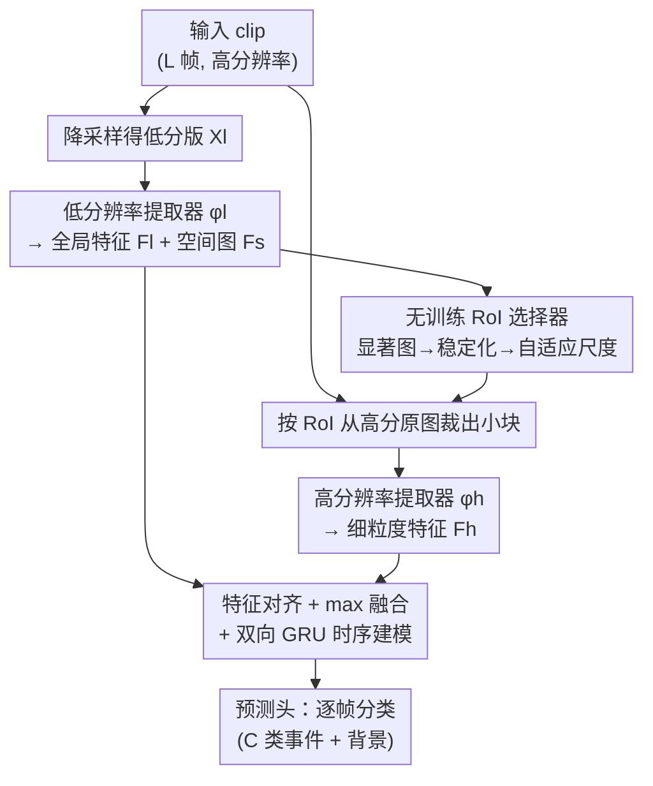

# AdaSpot: Spend Resolution Where It Matters for Precise Event Spotting

**会议**: CVPR 2026  
**论文**: [CVF Open Access](https://openaccess.thecvf.com/content/CVPR2026/html/Xarles_AdaSpot_Spend_Resolution_Where_It_Matters_for_Precise_Event_Spotting_CVPR_2026_paper.html)  
**代码**: https://github.com/arturxe2/AdaSpot  
**领域**: 视频理解 / 精确事件检测  
**关键词**: 精确事件检测(PES)、空间冗余、自适应分辨率、显著图 RoI、无监督裁剪  

## 一句话总结
AdaSpot 用低分辨率整帧抓全局语义、再借显著图无训练地圈出每帧最关键的一小块区域送进高分辨率分支补细节，从而在精确事件检测（PES）中只把算力花在"刀刃"上，在 Tennis、FineDiving 等最严格的 mAP@0 帧指标上拿到 SOTA（+3.98 / +2.26 mAP），而几乎不增加计算量。

## 研究背景与动机
**领域现状**：精确事件检测（Precise Event Spotting, PES）要在未裁剪视频里把"快动作/事件发生在哪一帧"定位到接近帧级精度——比如网球击球、跳水入水的那一瞬。主流方法（E2E-Spot、T-DEED 等）把精力放在时序建模上：用轻量 2D backbone + 多尺度时序模块去抓长短程依赖。

**现有痛点**：这些方法对**所有帧、整帧均匀处理**，完全忽略了视频里巨大的时空冗余。后果是两难：(a) 在高分辨率输入上跑，大量算力浪费在与任务无关的背景上，开销高到不可行；(b) 为了能跑，几乎都把输入**空间下采样**到低分辨率——但 PES 恰恰高度依赖只有高分辨率才看得见的细粒度线索（网球触地那一下、远景里只占画面一小块的动作），下采样一糊，精确定帧就崩了。

**核心矛盾**：精度需要高分辨率细节，效率需要低分辨率——而整帧均匀处理逼着你二选一。真正的信息只集中在每帧一小块区域，却被均匀对待。

**本文目标**：在不增加多少算力的前提下，保住细粒度视觉线索——也就是只在"该花高分辨率的地方"花高分辨率。

**切入角度**：动作识别领域早有"动态计算/输入级减冗余"的思路：先用轻量模块找到信息区域，再对它高分辨率/大模型处理。但这些方法几乎都靠**可学习的裁剪机制**（强化学习或可微裁剪）来选区域，本身在标准动作识别里就训练不稳；搬到 PES 上，因为事件高度局部化、监督信号更弱，裁剪会更加抖动、跨帧选出的框前后不一致。

**核心 idea**：与其学一个不稳定的裁剪器，不如**无训练**地从低分辨率特征自带的显著图里直接读出该看哪——用 saliency 选一个 RoI，再单独用一条高分辨率分支精修这一小块，最后和全局特征融合。把"学裁剪"换成"读显著图"，既稳又省。

## 方法详解

### 整体框架
AdaSpot 处理被切成定长 $L$ 帧的视频片段（clip）。每帧同时存在高分辨率原图和由它降采样得到的低分辨率版本。整条流水线是一个**双分辨率双分支**结构：低分辨率分支负责"看全局、定位置"，高分辨率分支负责"补细节"，最后在时序模块里融合再逐帧分类。

具体五个部件串起来：① **低分辨率特征提取器** $\phi_l$ 吃整帧低分版 $X_l$，输出每帧全局上下文特征 $F_l$，同时保留最后一层带空间结构的特征图 $F_s$；② **RoI 选择器**（本文核心、无训练）从 $F_s$ 生成显著图，给每帧圈出**一个**最关键区域 RoI，并保证跨帧时空一致；③ 这些 RoI 从高分辨率原图 $X_h$ 上裁出、缩放成统一尺寸，喂进 **高分辨率特征提取器** $\phi_h$ 得到细粒度特征 $F_h$；④ **时序建模器** 把 $F_l$（全局）和 $F_h$（局部细节）对齐、融合，再用双向 GRU 抓长程时序依赖；⑤ **预测头** 逐帧输出"事件类别 / 背景"。

### 关键设计

**1. 双分辨率双分支：全局抓语义、局部补细节**

直接对整帧上高分辨率太贵、下采样又丢细节，AdaSpot 把这对矛盾拆成两条互补的路。低分辨率分支 $\phi_l$ 在整帧 $X_l \in \mathbb{R}^{L\times W_l\times H_l\times 3}$ 上跑，用高效的 RegNetY（嵌入 GSF 模块抓局部时序）输出全局特征 $F_l \in \mathbb{R}^{L\times d}$，便宜地拿到"画面整体在发生什么"。高分辨率分支 $\phi_h$ **架构相同但参数独立**，只处理被裁出来的一小块 RoI（统一缩到 $112\times 112$），输出细粒度特征 $F_h \in \mathbb{R}^{L\times d}$。关键在于：高分辨率算力只花在每帧一小块上，所以相比"纯低分辨率 baseline"只多约 +6 GFLOPs，却比"整帧高分辨率均匀处理"省得多。消融里单独加上高分辨率分支就能让 Tennis mAP@0 涨 +2.12、SN-BAS 涨 +5.04，证明细节确实是 PES 的命门。

**2. 无训练显著图 RoI 选择：用低分特征自带的激活找该看哪**

这是全文最关键的创新，目的是绕开可学习裁剪在 PES 上的训练不稳定。作者利用一个已知现象（Zhou et al.）：深层卷积的激活图天然在任务相关区域响应更强。于是直接对 $F_s \in \mathbb{R}^{L\times W_s\times H_s\times d}$ 沿通道维求平均，得到显著图 $S \in \mathbb{R}^{L\times W_s\times H_s}$，每帧再做 min-max 归一化。因为 $F_s$ 来自深层、空间分辨率很粗，直接在粗格子上选 RoI 会让框只能落在少数离散位置（错一格在原图就是一大跳，导致 RoI 抖动），所以先把 $S_l$ 空间上采样 $k$ 倍——不增加信息，但给了更密的采样网格，定位更精、跨帧轨迹更平滑。这条路彻底不需要为"选框"引入任何可学习参数和监督，从根上消除了裁剪器的训练不稳定。

**3. 显著图三重稳定化：去中心偏置、去噪、尺度自适应**

裸的显著图直接选框有三个坑，作者逐个对症下药。(1) **中心偏置**：卷积的 zero-padding 会削弱边缘激活，把框往画面中间拽；解决办法是把低分 backbone $\phi_l$ 的 zero-padding 换成 **replicate（复制）padding**，消除这种人为的中心倾向。(2) **噪声激活**：显著图逐帧抖动会让 RoI 前后不一致；作者对 $S$ 施加**时空高斯平滑**得到 $\tilde S$，让 RoI 在时空上连贯——消融显示时间平滑贡献最大，去掉平滑 Tennis 掉 -1.63、SN-BAS 掉 -3.03。(3) **可变尺度**：不同数据集/动作/机位需要的框大小不同，固定尺寸 hold 不住；作者把每帧 $\tilde S_l$ 归一化成和为 1 的空间重要性概率，然后把 RoI $R_l$ 定义为**满足"框内累积重要性 $\sum_{(x,y)\in R_l}\tilde S_l(x,y)\ge\tau$、且不小于最小尺寸 $(W_r,H_r)$"的最小固定长宽比矩形**。阈值 $\tau$ 控制框的松紧：$\tau=0$ 退化成固定最小框、$\tau$ 增大则按显著度铺开变大，一个超参就把"固定/自适应"两种行为统一了（Tennis 上自适应更好 +0.49，远景的 SN-BAS 上固定框反而最优，靠 $\tau$ 自动切换）。

**4. 双分支特征融合 + 辅助监督稳训练**

两条分支的特征要合并：先各自过一个两层 MLP（中间 ReLU）做分布对齐得 $F'_l, F'_h$，再用 **max-pooling 融合** $F_f=\max(F'_l,F'_h)$——简单高效，作者验证更复杂的融合并不带来明显收益。融合后过双向 GRU 抓长程时序、再逐帧分类。但只用主损失训练会不稳：早期 RoI 不可靠会把训练带偏、模型干脆放弃高分辨率分支退化成低分 baseline。所以作者给低/高分两条分支各**挂一套独立的 GRU+线性头做辅助监督**，强制低分支学出稳定可靠的特征（保证 RoI 选得准）、高分支学出互补的细节，从而一阶段端到端稳定训练（推理时辅助头丢弃）。消融里同时去掉两个辅助损失，Tennis mAP@0 从 73.30 掉到 70.49。

### 损失函数 / 训练策略
PES 被建模成帧级分类。主损失是加权交叉熵 $L_f=\frac{1}{L}\sum_{l=0}^{L-1}\mathrm{CE}_w(y_l,\hat y_l)$，$w$ 平衡前景/背景类别。加上两个分支的辅助交叉熵 $L_l, L_h$，总损失 $L=\lambda_f L_f+\lambda_l L_l+\lambda_h L_h$。推理时 clip 之间 50% 重叠，并用 Soft-NMS 压候选事件。

## 实验关键数据

### 主实验
四个 PES 数据集（Tennis / FineDiving / FineGym / F3Set，严格 mAP@{0,1,2} 帧）+ SN-BAS（ES 设定，mAP@{0.5,1.0}s）。两个变体：AdaSpot$_s$（RegNetY-200MF）、AdaSpot$_b$（RegNetY-400MF）。下面聚焦最严格的 mAP@0f：

| 数据集 (mAP@0f) | 本文(AdaSpot$_b$) | 之前最好 | 提升 |
|--------|------|----------|------|
| Tennis | 74.02 | 70.04 (E2E-Spot800MF) | +3.98 |
| FineDiving | 27.07 / 27.26($_s$) | 25.00 (E2E-Spot200MF) | +2.26 |
| FineGym | 18.21 | 18.35 (T-DEED800MF) | 持平，但 6× 更少参数、1.5× 更少 FLOPs |
| F3Set | 55.38 | — (超过 F3ED) | SOTA |
| SN-BAS@0.5s | 56.24 | 54.49 (E2E-Spot800MF) | +1.75，且 1.66× 更少 FLOPs |

最严格指标上提升最大，正说明 AdaSpot 抓住了精确定帧所需的细粒度线索；同时在效率上保持甚至领先，体现更优的精度-效率折中。

### 消融实验（Tennis / SN-BAS，AdaSpot$_s$）

| 配置 | Tennis@0f | SN-BAS@0.5s | 说明 |
|------|-----------|-------------|------|
| Full AdaSpot | 73.30 | 53.02 | 完整模型 |
| 仅低分支 | 71.18 | 47.98 | 去高分辨率，掉细节 |
| 仅高分支 | 71.91 | 52.13 | 已超低分 baseline，但不如双分支 |
| zero-padding（vs replicate） | 72.15 | 51.01 | 中心偏置拉低显著图质量 |
| w/o 时空平滑 | 71.67 | 49.99 | RoI 抖动、跨帧不一致 |
| 固定 RoI 尺度（τ=0） | 72.81 | **53.02** | 远景 SN-BAS 上固定反而最优 |
| 自适应尺度 | **73.30** | 51.71 | 近景 Tennis 上自适应更好 |
| w/o $L_l$ & $L_h$ | 70.49 | 49.22 | 退化到近低分 baseline |

### 关键发现
- **细节是 PES 的命门**：只要加上高分辨率分支就能在严格指标上明显涨点（Tennis +2.12 / SN-BAS +5.04），证明"丢失的高分辨率细节"正是精确定帧的瓶颈。
- **时间平滑最重要**：三重稳定化里，时间平滑对去抖动贡献最大——PES 看重的是跨帧时序连贯的 RoI，而非单帧最优。
- **$\tau$ 一个超参统一固定/自适应**：近景事件（Tennis）需要随显著度变大的框，远景事件（SN-BAS）最小框就够，阈值机制让模型按数据集特性自动在两种行为间切换。
- **辅助监督防退化**：没有高分支辅助损失，早期不靠谱的 RoI 会误导训练，让模型干脆忽略高分辨率信息、退回低分 baseline。
- **吊打可学习裁剪**：把 AdaFocus-v2、Uni-AdaFocus 等可学习裁剪搬到 PES 上表现很差，选出的 RoI 经常盖不住任务区域、反而给训练引入噪声——印证了作者"PES 监督弱、学裁剪更不稳"的判断。

## 亮点与洞察
- **"读显著图"替代"学裁剪"**：最巧的一招是认清了 PES 监督太弱、学不动稳定的裁剪器，转而白嫖低分特征已经自带的激活分布——无训练、零额外参数、天然时空可平滑，把别人最头疼的不稳定问题直接绕掉。这个思路可迁移到任何"需要选关键区域但监督稀疏"的任务。
- **累积重要性阈值 $\tau$ 的优雅**：用"框内显著度累积过阈值的最小矩形"定义 RoI，一个标量就把固定框和自适应框统一了，还能随数据集自动切换，比硬编码多套裁剪策略干净得多。
- **算力分配的具象诠释**：标题"Spend Resolution Where It Matters"是真落到实处——高分辨率只跑每帧 $112\times112$ 一小块，+6 GFLOPs 换来严格指标 +3.93，远超"把整帧均匀提分辨率"在同等算力下能拿到的收益。

## 局限与展望
- **作者承认**：目前只在体育类 PES 数据集验证，能否泛化到体育之外的高时序精度场景仍待评估。
- **单 RoI 假设**：每帧只选一个 RoI（基于"相关区域通常集中在单点"的观察），对于一帧内**多个区域同时相关 / 同时发生多个动作**的场景适配性存疑，需要扩展到多 RoI。
- **依赖显著图质量**：整套机制建立在"深层激活落在任务区域"这一前提上；在没有清晰动作线索的帧（如论文 Fig.4(d) 第 2-3 帧）会出现 RoI 漂移，靠后续帧恢复——若长时间没有明确线索可能持续选错。
- **可改进**：把单 RoI 推广为依据 $\tau$ 自适应数量的多 RoI；或探索两分支共享 backbone 以进一步省参数（论文 Supp.C 已初步讨论）。

## 相关工作与启发
- **vs E2E-Spot / T-DEED（主流 PES）**：他们专注时序建模、整帧均匀处理且在下采样输入上训练；AdaSpot 转而从**空间冗余**入手，只对关键区域上高分辨率，因此在最严格指标上反超，且 FineGym 上用 6× 更少参数追平 T-DEED800MF。
- **vs UGLF**：UGLF 也想减空间冗余，但靠 vision-language 模型聚焦"球员/球"等概念，需要手工的数据集专属词表、不利用高分辨率、且 VLM 开销大；AdaSpot 直接在输入空间无词表选区域，更省更通用。
- **vs AdaFocus 家族 / CoViFocus（可学习裁剪）**：它们在像素或特征空间学裁剪位置，监督弱时训练不稳；AdaSpot 用无训练显著图选框，从根上避开不稳定，实测在 PES 上显著更优。
- **vs 显著图引导的 frame-warping**：warping 扩大判别区域但会引入几何畸变、破坏时空建模；AdaSpot 用裁剪+独立高分支保留几何结构，折中更好。

## 评分
- 新颖性: ⭐⭐⭐⭐ 把"无训练显著图选 RoI"系统化引入 PES，并配三重稳定化解决落地坑，角度新颖且对症。
- 实验充分度: ⭐⭐⭐⭐⭐ 五个数据集、双变体、多分辨率折中曲线、与多类减冗余方法横向比较、组件逐项消融，非常扎实。
- 写作质量: ⭐⭐⭐⭐ 动机—痛点—方法逻辑清晰，图文对照到位。
- 价值: ⭐⭐⭐⭐ 简单有效、几乎零额外开销就提精度，对实际体育分析/低延迟系统有直接应用价值。

<!-- RELATED:START -->

## 相关论文

- [\[CVPR 2026\] Building a Precise Video Language with Human-AI Oversight](building_a_precise_video_language_with_human-ai_oversight.md)
- [\[CVPR 2026\] Hear What Matters! Text-conditioned Selective Video-to-Audio Generation](hear_what_matters_text-conditioned_selective_video-to-audio_generation.md)
- [\[CVPR 2026\] SAM2Text: Towards Prompt-Free and Multi-Resolution Video Scene Text Segmentation](sam2text_towards_prompt-free_and_multi-resolution_video_scene_text_segmentation.md)
- [\[CVPR 2026\] Color When It Counts: Grayscale-Guided Online Triggering for Always-On Streaming Video Sensing](color_when_it_counts_grayscale-guided_online_triggering_for_always-on_streaming_.md)
- [\[CVPR 2026\] Memory Matters: Boosting Training-Free Zero-Shot Temporal Action Localization with a Learnable Lookup Table](memory_matters_boosting_training-free_zero-shot_temporal_action_localization_wit.md)

<!-- RELATED:END -->
