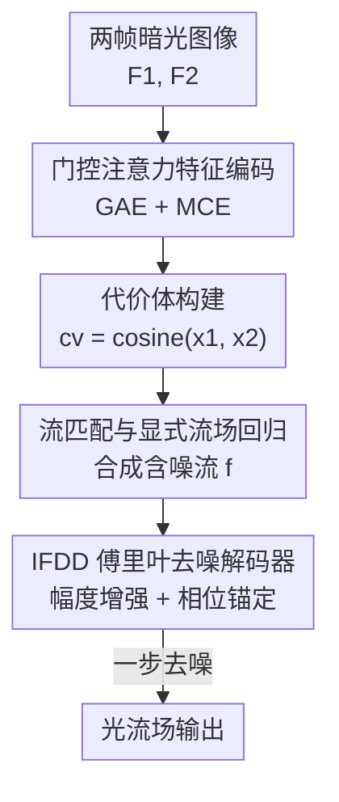

# FlowFM: Advancing Dark Optical Flow Estimation with Flow Matching

**会议**: CVPR 2026  
**论文**: [CVF Open Access](https://openaccess.thecvf.com/content/CVPR2026/html/Zuo_FlowFM_Advancing_Dark_Optical_Flow_Estimation_with_Flow_Matching_CVPR_2026_paper.html)  
**代码**: 待确认  
**领域**: 视频理解 / 光流估计  
**关键词**: 暗光光流估计, 流匹配, 傅里叶去噪, 一步去噪, 噪声鲁棒性

## 一句话总结
FlowFM 把"流匹配（flow matching）"第一次引入暗光光流估计（DOFE），用显式流场回归把"噪声→光流"建模成一条可一步走完的传输路径，再配上一个在频域增强幅度、锚定相位的傅里叶去噪解码器 IFDD，在 FCDN / VBOF 两个暗光基准上把 EPE 大幅刷低（VBOF 比次优方法降 35%），且推理只需一步、速度反而最快。

## 研究背景与动机

**领域现状**：暗光光流估计（Dark Optical Flow Estimation, DOFE）要在连续两帧低照度图像之间逐像素建立对应、输出一个 $2\times H\times W$ 的运动向量场。主流做法是判别式模型——给标准光流网络（RAFT 一系）配上暗光专用的特征增强（如轮廓增强、特征相似度度量强化），靠"放大有用特征"来对抗噪声。

**现有痛点**：判别式增强是"单边"的——只放大某类特征会破坏底层表示分布，而且这些模型缺乏对噪声本身的显式建模，抓不住"噪声→数据"的生成通路，对暗光下被噪声淹没的弱运动模式力不从心。另一条路是把扩散模型（DM）引入光流（FlowDiffuser），它擅长学条件高斯分布下的联合概率、噪声鲁棒，但**递归式去噪范式会打断流场连续性，结果出现"裂纹"**；暗光场景又常有亮度闪烁带来的运动不连续，和递归范式叠加后误差被进一步放大，而且扩散模型推理慢。

**核心矛盾**：判别式方法没有显式噪声建模、扩散式方法用递归去噪牺牲了连续性和效率——既要噪声鲁棒、又要流场连续、还要算得快，现有两条路线都顾此失彼。

**切入角度**：流匹配（Flow Matching, FM）是新兴生成范式，它直接回归一个诱导 ODE 的向量场、把噪声分布连续传输到目标分布，比扩散模型更简单、数值更稳。但 FM 在条件生成、尤其暗光光流这种重噪场景几乎没人探索。作者的观察是：光流受物理约束（物体、几何、遮挡），本身有平滑、一致的结构先验，但 FM 原始的目标向量场 $u_t$ 高度多变、不携带这种完整先验，直接回归它在 DOFE 上很难收敛。

**核心 idea**：用"显式流场回归"代替"向量场回归"——不学多变的 $u_t$，而是让网络从含噪流直接预测真值光流 $f_{gt}$，再证明这种直接监督在期望意义下满足 FM 的边际条件，从而合法地把整条"噪声→数据"路径压成**一步去噪**，并用傅里叶解码器在频域恢复被暗光破坏的运动幅度。

## 方法详解

### 整体框架
FlowFM 沿用 RAFT 式骨架但重构了解码范式。输入是两帧暗光图像 $F_1, F_2$：先用双分支编码器抽出基础特征 $(x_1, x_2)$ 和上下文特征 $C$，再由 $x_1, x_2$ 点积构造 4D 代价体 $cv$；接着进入流匹配模块——训练时把高斯噪声 $\varepsilon$ 与真值 $f_{gt}$ 线性混合、再叠加到初始流 $f_0$ 上合成含噪流 $f$，推理时直接把噪声注入 $f_0$ 得到 $f$；最后由隐式傅里叶去噪解码器（IFDD）在 $xt, cv, C$ 条件下**一步**把含噪流去噪成光流场，不再像传统方法那样递归更新残差流。整条流水线的三个贡献组件——特征编码、流匹配显式回归、IFDD——自上而下串成下图。

### 关键设计

**1. 流匹配与显式流场回归：把"噪声→光流"压成一步可学的传输路径**

针对判别式模型缺噪声建模、扩散模型递归去噪慢且断裂的痛点，FlowFM 把 DOFE 重定义为一个流匹配生成过程。流匹配在任意时刻 $t\in[0,1]$ 用真值光流 $f_{gt}$ 与高斯噪声 $\varepsilon\sim\mathcal{N}(0,I)$ 的线性组合定义一条概率路径：

$$x_t = (1-t)\cdot\varepsilon + t\cdot f_{gt},\qquad u_t = f_{gt}-\varepsilon$$

常规做法是让网络 $v_\Theta(x_t, cv, C, t)$ 回归目标向量场 $u_t$（损失 $L_v$）。但作者指出在 DOFE 里直接学 $u_t$ 有问题：噪声 $\varepsilon$ 叠加到本就退化的特征与不可靠的运动相似度上会引入域偏移，让学到的传输路径偏离理想轨迹；而且 $u_t$ 本身不携带光流应有的平滑/锐边结构先验，早期训练尤其难收敛（论文 Fig.2 显示 $L_v$ 收敛慢、EPE 更高）。FlowFM 的解法是**直接监督**：让网络从含噪流直接预测真值光流，损失换成

$$L_1 := \mathbb{E}_{x_t, f_{gt}, t}\big[\,\lVert v_\Theta(x_t, cv, C, t) - f_{gt}\rVert_1\,\big]$$

作者还给出理论依据：网络定义一个 ODE $\frac{dx}{dt}=v_\Theta$，从 $t{=}0$ 积到 $1$ 得 $\varepsilon + \int_0^1 v_\Theta\,dt = f_{gt}$；两边取期望，因 $\mathbb{E}[\varepsilon]=0$ 且 $\mathbb{E}[u_t]=\mathbb{E}[f_{gt}]$，可得 $\int_0^1 \mathbb{E}[v_\Theta]\,dt = \mathbb{E}[u_t]$。也就是说，最小化 $L_1$ 在期望意义下就让 $v_\Theta$ 满足了流匹配的边际条件——于是 $t$ 只用来采样含噪流、**不进入解码**，模型能从任意噪声直接还原数据，整条噪声-数据通路被一步走完，既保留 FM 的理论一致性又获得强正则化效果（⚠️ 推导细节以原文 Sec.3.2 为准）。这就是"一步去噪"的核心。

**2. IFDD 隐式傅里叶去噪解码器：在频域增强幅度、用相位锚住运动位置**

光有一步去噪还不够——暗光把弱运动信号埋进重噪里，需要专门的解码器把它捞回来。作者的关键观察是：把光流场做傅里叶变换后，**幅度（amplitude）刻画运动的有无与强度，相位（phase）编码运动的空间位置**；而暗光（本质是随机强度干扰）对幅度的破坏远大于对相位的破坏——Fig.4 显示暗光下幅度谱剧变、直方图整体平移，相位谱却几乎不变、差分图平滑。因此 FreEnc 的策略是**增强幅度、保留原相位**：把输入经 FFT 变到频域取出幅度与相位，幅度过一个 $1\times1$ 卷积 + LeakyReLU 做增强，再用增强后的幅度与原始相位经极坐标变换重建频谱的实部虚部，IFFT 变回空间域——相位当作锚点保证相邻帧同一目标的空间位置一致，幅度增强则恢复退化/无纹理区域被噪声打乱的运动强度。

IFDD 把这个傅里叶重建（FMR, Fourier Motion Refactor）嵌进 GRU 单元来推断隐状态。FMR 由空间注意力模块 SAM 与频域增强器 FreEnc 串成：$x_{sam}=\mathrm{SAM}(\mathrm{LN}([f_{head}, C]))$，$x_{fre}=\mathrm{FreEnc}(\mathrm{LN}(x_{sam}))$，其中 SAM 用倒残差块 + 简化空间注意力、以门控代替激活来抽取有意义的空间信息供频域增强。整个 GRU 更新写成 $z, r=\sigma(\mathrm{FMR}(\cdot))$、$q=\tanh(\mathrm{FMR}(\cdot))$、$h_i=(1-z)\ast h_{i-1}+z\ast q$，最后 $v_f=\mathrm{conv}(C[h_i, f_0])\uparrow$ 上采样得到光流；首次计算令上下文特征 $C=h_0$，迭代 $i{=}2$（实验证明 $i{=}2$ 最优，更大易过拟合、更小抗干扰不足）。它是首个把频域思路用于暗光光流的解码器，超越了纯空间域方法。

**3. 门控注意力特征编码：在暗光退化下抽到干净的底层表示**

低信噪比帧上常规编码器会被"注意力沉没"（attention sink）和局部退化拖累。FlowFM 在 RAFT 骨架上设计了门控注意力编码器 GAE 与 MLP 上下文编码器 MCE：$x_1, x_2=\mathrm{GAE}(F_1, F_2)$，$C=\mathrm{MCE}(F_1)$。GAE 以门控块为核心，先在查询 $Q$ 和键 $K$ 中抓关键信息，再引入多个 top-k 算子和掩码矩阵滤掉 $Q$ 与 $K^\top$ 之间易受干扰的无关相似度，从而动态聚焦有意义的特征交互、避免暗光退化导致的注意力沉没；MCE 由 LayerNorm、两个 MLP、深度卷积和可选的随机深度层组成，靠通道维 MLP 变换与空间维深度卷积的交互做跨维上下文抽取与动态增强。两者抽出的特征再经余弦相似度 $cv=\mathrm{cosine}(x_1, x_2)$ 构成代价体，喂给后续流匹配与 IFDD。消融显示去掉 GAE/MCE 后 EPE 明显回退，说明这套编码对暗光下的鲁棒表示是必要的。

### 损失函数 / 训练策略
最终只用一个直接约束的 L1 损失 $L_1=\gamma\cdot\lVert v_f-f_{gt}\rVert_1$，权重 $\gamma=0.8$，让模型探索一条灵活有效的"噪声→真值"传输路径。训练用 AdamW + 梯度裁剪 $[-1,1]$、one-cycle 学习率、随机初始化，输入 $368\times496$；在完整 FCDN（35 万次迭代）和完整 Mix（40 万次）上训练，batch size 4，学习率 $2.5\mathrm{e}{-4}$。

## 实验关键数据

### 主实验（在 FCDN 上训练，EPE↓）

| 方法 | 出处 | FCDN | VBOF（泛化） |
|------|------|------|------|
| RAFT | ECCV-20 | 1.23 | 21.84 |
| FlowDiffuser | CVPR-24 | 1.09 | 20.77 |
| CEDFlow | AAAI-24 | 1.08 | 20.89 |
| CEDFlow++ | IJCV-25 | 1.01 | 20.56 |
| **FlowFM (Ours)** | - | **0.87** | **13.28** |

FlowFM 在 FCDN 上 EPE=0.87，比 CEDFlow 降 19.4%（1.08→0.87）、比 CEDFlow++ 降 13.9%（1.01→0.87）；在未训练的 VBOF 上 EPE=13.28，比次优的 CEDFlow++ 大幅降 35.4%（20.56→13.28），泛化优势尤为显著。换到更复杂的 Mix 数据集训练时，FlowFM 在 FCDN 仍取 1.06（次优 CEDFlow++ 1.14）、VBOF 取 5.24（次优 6.25），各子集均为最佳。

### 消融实验（在 FCDN 上训练，EPE↓）

| 配置 | 参数(M) | FCDN | VBOF | 说明 |
|------|---------|------|------|------|
| Baseline | 5.26 | 1.23 | 21.84 | 裸骨架 |
| w/o GAE & MCE | 7.84 | 1.02 | 15.37 | 去掉门控/上下文编码 |
| w/o IFDD | 9.46 | 1.09 | 16.32 | 去掉傅里叶解码器 |
| w/o FMR | 10.83 | 1.02 | 15.09 | 去掉傅里叶重建核心 |
| w/o FM | 12.22 | 1.23 | 20.47 | 去掉流匹配 |
| w/o Eq.11（用 $L_v$） | 12.22 | 1.07 | 16.77 | 隐式约束替显式 |
| $i=1$ | 10.98 | 0.93 | 13.70 | IFDD 迭代不足 |
| **FlowFM ($i=2$)** | 12.22 | **0.87** | **13.28** | 完整模型 |
| $i=3$ | 13.38 | 0.89 | 13.25 | 迭代过多易过拟合 |

### 计算开销（$736\times480$ 输入）

| 方法 | 参数(M) | 时间(ms) | 显存(GB) | FLOPs(G) |
|------|---------|----------|----------|----------|
| FlowDiffuser | 16.32 | 133 | 5.1 | 87.1 |
| CEDFlow++ | 6.78 | 57 | 1.9 | 26.3 |
| **FlowFM** | 12.22 | **28** | **1.3** | **19.6** |

### 关键发现
- **流匹配 + 显式约束是命门**：去掉流匹配（w/o FM）EPE 直接退回 baseline 水平（1.23 / 20.47）；把显式约束换成隐式 $L_v$（w/o Eq.11）也明显变差（1.07 / 16.77），证明"显式流场回归"才是噪声鲁棒与灵活传输路径的来源。
- **傅里叶增强对暗光至关重要**：去掉 FMR 后 FCDN 0.87→1.02、VBOF 13.28→15.09，频域幅度增强确实在缓解运动强度退化；消融还显示 FreEnc 比 SAM 更关键，用注意力/MLP 替换 $1\times1$ 卷积反而增加冗余计算且效果不佳。
- **一步去噪带来效率红利**：FlowFM 推理只需 1 步（其余方法多需 12 次迭代），尽管参数比 CEDFlow 多约 4M，但时间 28ms、显存 1.3GB、FLOPs 19.6G 全面最优，"少即是多"。
- **IFDD 迭代数甜点在 $i=2$**：$i=1$ 抗干扰不足、$i=3$ 易过拟合，$i=2$ 在精度与稳健间最平衡。

## 亮点与洞察
- **把"判别 vs 生成"的两难转成一条线性传输路径**：用流匹配替代扩散的递归去噪，既保住生成范式的噪声鲁棒，又靠显式回归 + 边际条件证明把推理压成一步，连续性和效率一起拿——这是最"啊哈"的设计。
- **频域分工的物理直觉很扎实**："暗光主要毁幅度、几乎不动相位"这一观察有可视化（幅度谱剧变 / 相位谱稳定）支撑，于是"增幅度、锚相位"成了针对暗光的精准手术，而非泛泛的特征增强。
- **可迁移的思路**：①"显式预测目标而非向量场 + 期望意义满足边际条件"的技巧可推广到其它需要快速一步生成的回归任务（深度、立体匹配）；②"频域幅度增强 + 相位锚定"可直接搬到低照度去噪、去模糊等 low-level 视觉。

## 局限与展望
- 作者展望把 FlowFM 推广到其它视觉任务并进一步优化效率与精度，暗示当前仍专注 DOFE 单任务。
- 评测主要在合成暗光数据集（FCDN / Mix）上做定量，真实场景（FLIR ADAS / SDSD / GOF）缺真值只能定性，真实暗光下的定量泛化仍待验证。
- 一步去噪虽快，但把整条噪声-数据路径压成单步对解码器容量要求高；IFDD 迭代 $i$ 略增即过拟合，说明对训练配置较敏感，换数据规模时是否仍是 $i=2$ 需重调（⚠️ 以原文为准）。
- GAE/MCE 的具体结构放在补充材料，正文对"为何门控能避免 attention sink"只给了定性解释。

## 相关工作与启发
- **vs FlowDiffuser（CVPR-24，扩散式光流）**：两者都把光流当条件生成，但 FlowDiffuser 用递归去噪导致流场断裂、推理慢（133ms / 12 步）；FlowFM 改用流匹配 + 显式回归一步出结果（28ms / 1 步），EPE 全面更优。
- **vs CEDFlow / CEDFlow++（AAAI-24 / IJCV-25，判别式暗光增强）**：它们靠改图像编码器、放大轮廓等特定特征提升判别力，但忽视重噪抑制、缺显式噪声建模；FlowFM 用生成式范式显式建模噪声-数据通路，VBOF 上比 CEDFlow++ 降 35%。
- **vs RAFT（ECCV-20，光流基线）**：FlowFM 沿用其双分支骨架与代价体，但把递归残差流更新替换成流匹配一步去噪解码，是范式层面的改造而非增量。

## 评分
- 新颖性: ⭐⭐⭐⭐⭐ 首个把流匹配引入暗光光流，显式流场回归 + 频域去噪解码器都是有理论/物理支撑的原创设计
- 实验充分度: ⭐⭐⭐⭐ 双训练集 + 多相机子集 + 真实场景 + 细致消融 + 计算开销齐全，但真实暗光缺定量真值
- 写作质量: ⭐⭐⭐⭐ 动机推导清晰、有理论证明与可视化支撑，部分模块（GAE/MCE）细节下放补充材料
- 价值: ⭐⭐⭐⭐⭐ 在精度与效率上同时刷新 DOFE，且"一步生成 + 频域增强"思路可迁移到更广的暗光 low-level 视觉

<!-- RELATED:START -->

## 相关论文

- [\[CVPR 2026\] From Contrast to Consistency: Rethinking Event-based Continuous-Time Optical Flow Estimation](from_contrast_to_consistency_rethinking_event-based_continuous-time_optical_flow.md)
- [\[CVPR 2026\] Efficient All-Pairs Correlation Volume Sampling for Optical Flow Estimation](efficient_all-pairs_correlation_volume_sampling_for_optical_flow_estimation.md)
- [\[CVPR 2026\] U2Flow: Uncertainty-Aware Unsupervised Optical Flow Estimation](u2flow_uncertainty_aware_unsupervised_optical_flow_estimation.md)
- [\[CVPR 2026\] LAOF: Robust Latent Action Learning with Optical Flow Constraints](laof_robust_latent_action_learning_with_optical_flow_constraints.md)
- [\[CVPR 2025\] DPFlow: Adaptive Optical Flow Estimation with a Dual-Pyramid Framework](../../CVPR2025/video_understanding/dpflow_adaptive_optical_flow_estimation_with_a_dual-pyramid_framework.md)

<!-- RELATED:END -->
