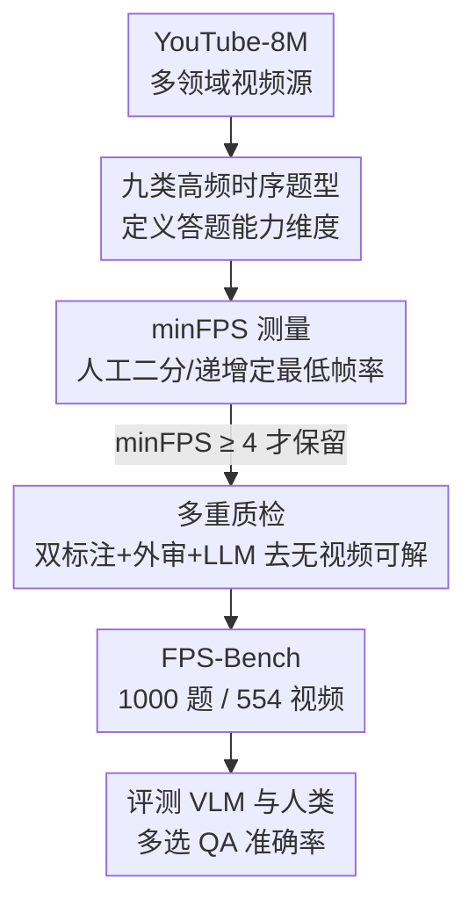

# FPS-Bench: A Benchmark for High Frame-Rate Video Understanding

**会议**: CVPR 2026  
**论文**: [CVF Open Access](https://openaccess.thecvf.com/content/CVPR2026/html/Choudhury_FPS-Bench_A_Benchmark_for_High_Frame-Rate_Video_Understanding_CVPR_2026_paper.html)  
**代码**: 无（论文称将发布数据与代码，地址以官方为准）  
**领域**: 视频理解  
**关键词**: 高帧率视频理解, 视频问答基准, minFPS, 时序推理, VLM 评测  

## 一句话总结
针对当下视频大模型几乎都把视频降采样到 <1 FPS 这一盲点，作者构建了 FPS-Bench——一个全部由"必须看高帧率才能答对"的问题组成的视频问答基准（1000 题 / 554 段视频），并提出 minFPS 指标量化每道题的最低帧率需求；结果显示 SOTA VLM 准确率仅约 30%（随机 25%），而人类超过 70%，暴露出模型在快速时序事件感知上的根本缺陷。

## 研究背景与动机
**领域现状**：现代视频-语言模型（VLM）出于显存和 token 成本考虑，普遍把输入视频从原生 30 FPS 暴力降采样到 1 FPS 甚至更低（Gemini 降到 1 FPS，GPT-4o 等干脆固定取 8–16 帧）。背后有个被广泛接受的假设——视频时序冗余高，"多看几帧并不带来更多信息"。

**现有痛点**：这个假设让几乎所有主流评测基准都"自证其说"。Kinetics、ActivityNet、MSR-VTT 这类早期基准随机抽几帧就能解；连 MVBench、Video-MME 这种新基准，很多题在单帧里就能找到答案，甚至 0.1 FPS 就够；号称聚焦细粒度运动的 MotionBench、长视频的 EgoSchema 也都能用很低帧率解出来。于是"低帧率够用"成了循环论证：模型只在低帧率上训练和评测，从没人系统检验过**降采样到底丢失了什么能力**。

**核心矛盾**：真正需要高帧率的视觉任务（目标跟踪、视频分割、机器人感知）通常交给专用模型，并不在通用 VLM 的评测视野里。而那些"通用 VLM 在低帧率下注定答不对"的问题——比如"视频里相机闪光过吗？"，在 2 FPS、4 FPS 下根本看不到闪光，只有到 14 FPS 才能捕捉——既没有基准覆盖，又恰恰是当前评测体系的系统性盲区。

**本文目标**：造一个**完全由高帧率问题构成**的通用 VLM 基准，并提供一个能客观刻画"这道题到底需要多高帧率"的量化标准，从而把"降采样损失的能力"摆到台面上量化。

**切入角度**：与其用"看多长视频"（EgoSchema 的 temporal certificate）来衡量难度，不如直接问"需要多高的采样帧率"——因为一段 10 分钟视频按 1 FPS 和按 30 FPS 取，certificate 时长一样，但前者会把瞬时高频事件完全抹平。

**核心 idea**：定义 **minFPS（最低必要帧率）**作为每道题的时序难度标尺，严格筛选所有题 minFPS ≥ 4，构建一个"非高帧率不可解"的问答基准来逼出 VLM 的真实短板。

## 方法详解

### 整体框架
这是一篇**基准/数据集论文**，"方法"即数据构建与评测协议两条主线。第一条主线围绕新指标 minFPS：先给出它的定义，再用一套人工二分/递增的流程为每道题测出 minFPS，并以 minFPS ≥ 4 作硬门槛筛题；第二条主线是九类高频时序题型的设计、纯人工标注与多重质检，确保题目"人易、机难、且必须看视频"。最终产出 1000 题 / 554 视频的基准，再在其上系统评测开源/闭源/图像类 VLM 与人类。

下面这张图概括数据采集到评测的流水线：

### 关键设计

**1. minFPS：用"最低必要帧率"量化一道题的时序难度**

痛点在于过去衡量视频题难度的指标（如 EgoSchema 的 temporal certificate，即人需要看多长时长才能验证答案）只刻画"时间跨度"，却对"采样密度"无感——同一个 certificate 时长，1 FPS 采样和 30 FPS 采样含的帧数差几十倍，前者会让快速事件直接消失。作者把 minFPS 定义为：对一个视频-问题对，人类标注者能稳定得到正确答案的**最低整数帧率**；且关键约束是——任何低于该阈值的采样率都必须使得正确答案无法被验证。这等于把"必须看到的那一帧"精确卡死在某个帧率门槛上。两个指标可乘起来互补：总输入帧数 ≈ minFPS × temporal certificate，minFPS 管"密度"，certificate 管"时长"。

**2. minFPS 的人工测量流程与 ≥4 硬门槛：保证每题都"非高帧率不可解"**

光有定义还不够，得能稳定测出来。标注者从 1 FPS 开始看视频+问题+答案：若 1 FPS 答不出，就每次 +1 FPS 递增直到答案变得明确无歧义；若 1 FPS 已能答出，则按 2 的因子不断**减半**帧率直到答不出为止，由此逼近门槛。测量时的降采样统一用"丢帧"模拟现代 VLM 的真实采样行为。所有入库题强制 minFPS ≥ 4（该阈值来自对其它基准的实测——它们大多不超过 1–2），最终全库平均 minFPS 达 6.67、中位数 6.0，远高于 Video-MME 的 0.5。这条流程把"高帧率必要性"从主观判断变成可复现的操作定义。

**3. 九类高频时序题型：覆盖"快、细、瞬时"的能力维度而不沦为窄任务**

为了让基准既需高帧率又保持通用性（不像 DIVE 那种只考字幕召回的玩具任务），作者定义九类题型，每类约 110 题：重复运动计数（Repetitive Motion，数高速周期动作的次数）、速度识别（Speed Recognition）、细粒度运动（Fine-Grained Motion，辨别动作形态的细微差异）、动作顺序（Action Order，几乎同时发生的事件谁先谁后）、事件时状态（State at Event，瞬时交互那一刻物体的状态）、一闪而过（Blink and Miss，只出现一两帧的极短事件如闪光）、因果检测（Causality Detection）、同步性评估（Synchronization Assessment）、实例计数（Instance Count，统计快速离散事件发生次数）。这些题对人简单、对模型却难，且都内在地要求较高输入 FPS，从而把"快速运动感知"这一能力从通用问答里单独拎出来考。

**4. 纯人工标注 + 多重质检：确保"人能答、机难答、且必须看视频"**

由于目标任务超出 VLM 能力，作者放弃了 MVBench/EgoSchema 常用的"LLM 从字幕自动生成 QA"，改为招募具备 VLM 经验的标注员**全程人工**从 YouTube-8M 找视频、配题、写 4 个似真选项外加一个"以上皆非"。质检按 Video-MME/MVBench 的严格协议层层把关：每题至少两名其他标注员复核；minFPS 由原标注者和另一标注者各测一次、取两者最小值（更保守）；单独标注员检查题面清晰、选项不过于显然、答案正确；三名外部评审在不看答案的情况下答题，被一致答错的题会被标记复查；最后还用 LLM 查拼写语法，并照搬 Video-MME 协议——去掉"以上皆非"后让 Gemini-1.5 Pro 在**不给视频**的条件下随机打乱选项答 4 次，若 4 次里答对超过 3 次就标记审查，以剔除能脱离视频靠先验解出的题。

### 一个完整示例
以图 1 的相机闪光题"视频里相机闪过光吗？"走一遍：标注者从 1 FPS 看起——看不到闪光，无法验证"闪过"这个正确答案；逐步 +1 FPS，到 2 FPS、4 FPS 仍然看不到那一两帧的闪光；一直加到 **14 FPS** 才首次稳定看到闪光、能确认答案。于是这道题的 minFPS = 14。这意味着任何把视频采到 14 FPS 以下的模型，从信息层面就**永远不可能**答对——它根本没见过那一帧。这正是 FPS-Bench 想逼出的失败：模型的错不是推理错，而是关键证据在降采样里被丢掉了。

## 实验关键数据

### 主实验
基准规模：1000 题、554 视频、五大视觉领域（媒体娱乐 / 爱好游戏 / 体育健身 / 车辆 / 其它）；平均视频约 10 秒，平均 temporal certificate 仅 2.1 秒——即"短而信息密集"。minFPS 对比上，FPS-Bench 平均近 7 FPS，比 Video-MME（0.5）高一个量级，比号称高速理解的 AirLetters、MotionBench（约 2）也高出 2.5× 以上，却仍保持题目领域的多样与通用。

主评测（多选 QA 准确率，随机基线 25%）：

| 模型 | Overall | Instance Count | Action Order | 备注 |
|------|---------|----------------|--------------|------|
| GPT-4o | 31.8% | 32.1% | 35.8% | 最佳闭源 |
| Oryx (omni) | 31.3% | 11.6% | 48.6% | 开源最佳，超过 Gemini |
| Qwen-3-VL-32B | 30.7% | 18.8% | 39.4% | — |
| Gemini 2.5 Pro | 28.9% | 22.3% | 32.7% | 闭源 |
| InternVL-3.5-8B | 28.7% | 15.2% | 34.9% | — |
| DeepSeek-VL2-Base | 24.0% | 7.1% | 32.1% | 接近随机 |
| **Human** | **72.2%** | **66.5%** | **73.1%** | 人机差 >2× |

关键观察：所有 SOTA VLM 都只比随机略好、远逊人类；**实例计数（Instance Count）是模型最差的题型**（多在 7%–18%，因为它既要极高帧率又要在整段长 certificate 里持续计数）；最容易的是动作顺序与因果检测，二者平均 minFPS 也最低（约 5.3）。还出现反常规模律：InternVL-14B 反而不如 8B，而 Qwen-32B 强于 8B；开源 Oryx 超过 Gemini，说明开闭源差距在收窄。

### 消融实验
作者用两种"放水"实验拆解差距来源：

| 配置 | 含义 | 代表结果（Gemini-2.5-Pro / GPT-4o） | 结论 |
|------|------|--------------------------------------|------|
| Default | 原始 10 秒片段 | 28.9% / 31.8% | 基线 |
| Temp. Cert. | 只喂 certificate 片段（去掉检索难度） | 29.7% / 32.2% | 几乎无提升 |
| Temp. Cert. + minFPS（放慢视频） | 把视频放慢到模型能看到关键帧 | 33.7% / 32.1% | 略升但远不及人类 |

变化帧数/FPS 的扫描（表 3）：Qwen-3-VL 随 FPS 1→30 单调上升（27.6%→34.1%），但多数模型如 InternVL、LLaVA-NeXT 在帧数/FPS 增大后**反而掉点**（如 InternVL-3.5-8B 从 16 帧 33.1% 降到 512 帧 26.5%），暴露长上下文处理缺陷。

### 关键发现
- **失败不在 token 限制，而在能力**：把视频放慢到保证模型"看得到"关键帧后，准确率只小幅回升、远不及人类，说明即便给足相关上下文，模型也无法稳定地对快速事件做推理。
- **不是检索问题**：只喂 temporal certificate 片段（移除"大海捞针"难度）并没让题变简单，否定了"模型只是没找到那一帧"的猜想。
- **更多帧 ≠ 更好**：多数模型在更高 FPS/更多帧下性能不升反降，作者推测高 FPS 下相邻帧差异极小、上下文却爆炸增长，而 VLM 几乎没在这种数据上训练过。
- **定性失败模式**（图 5）：即便放慢后给齐所有帧，Gemini 仍会漏掉"快速踢球""球弹到门柱"这类一闪而过的细节，或把动作顺序数错——错在细粒度感知而非语言推理。

## 亮点与洞察
- **minFPS 是一个简洁却补位的指标**：它精准抓住了 temporal certificate 没覆盖的"采样密度"维度，且"低于该帧率必不可解"的定义让难度可操作、可复现；两指标可乘（帧数 ≈ minFPS × certificate）形成正交的难度坐标系。
- **"循环论证"诊断很犀利**：论文指出现有低帧率基准其实是"用低帧率评测又佐证低帧率够用"的自证陷阱，这种反思本身就有方法论价值。
- **保守取最小值的质检巧思**：minFPS 由两人各测取 min、外审一致答错即复查、Gemini 无视频四答三对则剔除——多道闸门叠加，把"靠先验/靠选项偏置解题"的捷径堵死，可迁移到任何需要"必须看模态"的基准构建。
- **反常规模律的暴露**：基准的价值之一是把"参数更大未必更强""更多帧未必更好"这类被平均指标掩盖的现象直接量化出来，为后续高帧率训练指明问题。

## 局限与展望
- 作者承认：题型与视觉域偏向"高速短时事件"，未必覆盖多数 VLM 用户的真实用例（这些其它基准已覆盖）；且相比主流视频基准，FPS-Bench 规模偏小（1000 题）。
- 自己发现的局限：纯人工标注虽保证质量但难规模化，YouTube-8M 来源也带来领域偏置；minFPS 由人工逐题测量，主观性虽经多人取 min 缓解，但"能稳定答对"的判定仍依赖标注者；评测里各模型送帧方式不一（有的收原始 mp4、有的最多 64 帧、有的 512 帧），公平性需谨慎解读。
- 改进方向：论文提出标注流水线可扩展、计划随模型采用而扩库；可进一步把 minFPS 用作训练时的难度课程或采样策略信号，而不仅是评测标尺。

## 相关工作与启发
- **vs Video-MME / MVBench**: 它们也用严格人审协议，但题目可被稀疏采样（甚至 0.1 FPS）解出，本质仍是低帧率基准；FPS-Bench 沿用其质检框架却把 minFPS 门槛拉到 ≥4，专攻它们的盲区。
- **vs MotionBench / AirLetters**: 同样关注快速运动，但前者仍能低帧率解、后者任务过窄（认字母）；FPS-Bench minFPS 高出它们 2.5×，且保持跨领域通用性。
- **vs EgoSchema（temporal certificate）**: certificate 度量"看多久"，minFPS 度量"采多密"，本文指出二者正交并给出乘积关系，是对该指标体系的直接补全。
- **vs DIVE**: DIVE 也需高帧率但只考字幕召回这种玩具任务，FPS-Bench 用九类通用时序题型避免了窄化。

## 评分
- 新颖性: ⭐⭐⭐⭐ minFPS 指标 + "非高帧率不可解"的基准定位切中真实盲区，思路清晰但属"补位"型而非范式创新
- 实验充分度: ⭐⭐⭐⭐ 覆盖开源/闭源/图像类十余个 VLM，配 certificate/放慢/帧数扫描三组拆解实验，仅库规模偏小
- 写作质量: ⭐⭐⭐⭐ 动机推导扎实、循环论证诊断有洞见，缓存文本有个别笔误（如 "Figure Z"）但不影响理解
- 价值: ⭐⭐⭐⭐ 暴露 VLM 高频时序感知的系统性短板，为高帧率视频理解的训练与评测提供了可复现标尺

<!-- RELATED:START -->

## 相关论文

- [\[CVPR 2026\] CoCoVideo: The High-Quality Commercial-Model-Based Contrastive Benchmark for AI-Generated Video Detection](cocovideo_the_high-quality_commercial-model-based_contrastive_benchmark_for_ai-g.md)
- [\[CVPR 2026\] MA-Bench: Towards Fine-grained Micro-Action Understanding](ma-bench_towards_fine-grained_micro-action_understanding.md)
- [\[CVPR 2025\] Q-Bench-Video: Benchmark the Video Quality Understanding of LMMs](../../CVPR2025/video_understanding/q-bench-video_benchmark_the_video_quality_understanding_of_lmms.md)
- [\[CVPR 2026\] HERBench: A Benchmark for Multi-Evidence Integration in Video Question Answering](herbench_a_benchmark_for_multi-evidence_integration_in_video_question_answering.md)
- [\[CVPR 2026\] Efficient Frame Selection for Long Video Understanding via Reinforcement Learning](efficient_frame_selection_for_long_video_understanding_via_reinforcement_learnin.md)

<!-- RELATED:END -->
