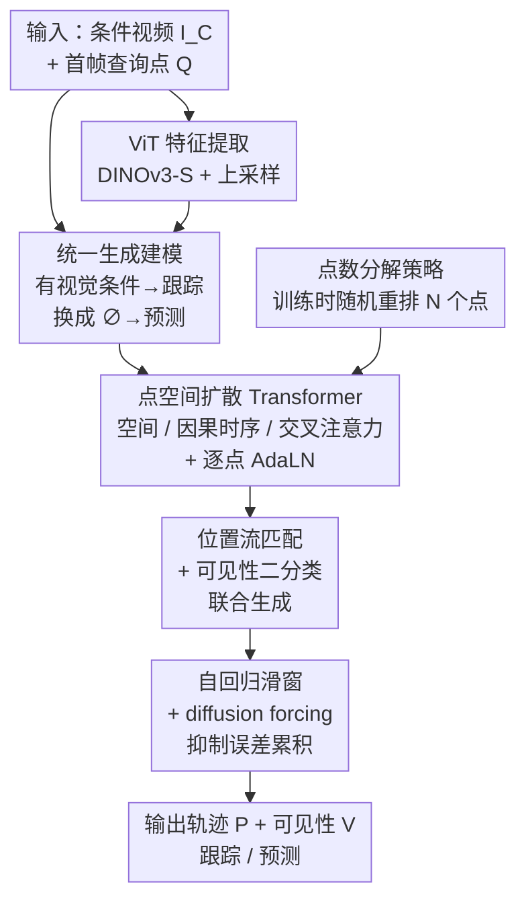

# Generative Point Tracking and Forecasting

**会议**: CVPR 2026  
**论文**: [CVF Open Access](https://openaccess.thecvf.com/content/CVPR2026/html/Lu_Generative_Point_Tracking_and_Forecasting_CVPR_2026_paper.html)  
**代码**: 无  
**领域**: 视频理解  
**关键词**: 点跟踪, 轨迹预测, 流匹配, 扩散 Transformer, 统一建模

## 一句话总结
把"点跟踪"（预测点现在在哪）和"轨迹预测"（预测点将来去哪）统一成同一个**视频条件下的点生成**问题——训练一个因果的、用视频特征做条件的流匹配扩散 Transformer，有视觉条件时做跟踪、撤掉视觉条件时自然切换成预测，在点预测基准上超过所有先前方法，跟踪精度也逼近高度调优的回归式 SOTA。

## 研究背景与动机
**领域现状**：估计点随时间如何运动，是运动跟踪（present）和运动预测（future）共同的核心。但历史上这两个任务一直被分头处理：当代点跟踪方法（CoTracker、TAPIR、Track-On 等）几乎都是**回归式**的——专门设计的网络架构、迭代细化、cost volume、鲁棒损失函数；而轨迹预测则常用生成式潜空间扩散来建模未来的多模态分布。

**现有痛点**：回归式跟踪器把"点现在在哪"当成确定性问题来解，因此**学不到运动先验**——它不知道一个球被遮挡后大概会往哪飞、一个物体落地后会怎么弹。这恰恰是预测任务最需要的能力。反过来，预测专用模型（如 Boduljak 等人的潜空间扩散）依赖 grid-based 的 VAE 编码，假设输入是规则网格，**没法直接拿去做任意查询点的跟踪**。两边架构互不兼容，一个模型干不了两件事。

**核心矛盾**：跟踪要"对齐视觉证据"（确定性、高精度），预测要"采样合理未来"（不确定性、多模态先验）。看似冲突，但本文观察到：**两者只差一个"有没有视觉条件"**。有当前帧的视觉特征，就该贴着证据走（跟踪）；没有未来帧的视觉特征，就该从学到的运动先验里采样（预测）。

**本文目标**：用**单一**生成模型同时解决两个任务，不为任一任务做专门的架构改动；并且要满足跟踪的现实约束——在线运行、点之间能互相交互、定位精度高。

**核心 idea**：把两个任务都写成同一个条件概率分布 $p_\theta(P, V \mid I_C, Q)$，用一个**视频条件流匹配 DiT** 去生成点轨迹；跟踪 = 有视觉条件的条件生成，预测 = 把视觉条件换成空 embedding $\varnothing$ 的无条件生成。任务切换只靠改视觉信号，不动一行架构。

## 方法详解

### 整体框架
模型要学的是给定条件视频 $I_C \in \mathbb{R}^{T_C \times H \times W \times 3}$ 和首帧给定的 $N$ 个查询点 $Q \in \mathbb{R}^{N \times 2}$，生成完整轨迹 $P \in \mathbb{R}^{T \times N \times 2}$ 和对应可见性 $V \in [0,1]^{T \times N}$（目标时长 $T \ge T_C$）。关键在于**逐帧地由"有没有视觉条件"决定行为**：对 $t \le T_C$ 的帧，喂入该帧的 ViT 特征，模型贴着视觉走（跟踪）；对 $t > T_C$ 的帧，视觉条件被替换成可学习的 null embedding $\varnothing$，模型转而从内部运动先验采样（预测）。于是 $T_C = T$ 是纯跟踪、$T_C = 1$ 是纯预测、$1 < T_C < T$ 则是"先跟踪一段再外推未来"。

整个 pipeline：视频帧过预训练 ViT 抽特征 → 把每个查询点在每帧建成一个 token（共 $T \times N$ 个）、初始化为带噪点坐标 → 送进点空间 DiT，三类注意力分别建模"同帧点间交互 / 单点时序历史 / 点与图像特征对齐" → 用流匹配把噪声去成位置、用 BCE 预测可见性 → 因果滑窗自回归地生成长序列，配合 diffusion forcing 抑制误差累积 → 输出轨迹（有条件即跟踪、无条件即预测）。

### 关键设计

**1. 统一生成建模：把跟踪和预测压成同一个"视频条件下的点生成"**

痛点是跟踪和预测历史上各用一套架构，根本原因在于一个被当成确定性回归、一个被当成生成式采样。本文的切口是发现两者本质都是"在点空间生成轨迹"，唯一差别是**条件信号的有无**。形式化为学习 $p_\theta(P, V \mid I_C, Q)$：去噪函数 $F_\theta(x_k, k, C)$ 的条件 $C = (Q, I_C)$ 里，视觉部分 $I_t$ 在跟踪帧提供、在预测帧替换为 null embedding $\varnothing$。于是同一组权重，喂视觉特征就贴着证据做条件生成（跟踪），撤掉视觉特征就从学到的运动先验做无条件采样（预测），中间还能"先跟踪 $T_C$ 帧、再外推"。这比"训两个模型"或"给预测模型硬改架构去做跟踪"都干净——任务切换是推理时改输入，不是改网络。

**2. 点空间扩散 Transformer：三类注意力 + 逐点 AdaLN，直接在点坐标上去噪**

预测专用方法依赖 grid-based VAE 把图像 patch 编码成潜码，假设输入是规则网格，对"任意散落的查询点"水土不服。本文改成 **point-space DiT**：把整条轨迹（位置 $P$ + 可见性 $V$）表示成 $T \times N$ 个 token，学一个从高斯分布到数据分布 $x=(P,V)$ 的映射，**直接在点坐标空间去噪**，省掉复杂的网格 VAE 编解码器，也不用 cost volume 这类跟踪专用结构。每个 DiT block 含三种注意力各司其职：**空间注意力**让同一帧内所有点 token 互相 attend（建模点间联合运动）、**因果时序注意力**让每个点只 attend 自己的过去 $\{x_k^{(t',n)} \mid t' < t\}$（在线、建单点运动史）、**交叉注意力**让点 token attend 对应帧的视觉特征 $C_t$（注入定位与语义，也正是这里"给 $C_t$ 还是给 $\varnothing$"实现了跟踪/预测的切换）。条件注入上没有照搬 DiT 的"全局向量统一调制所有 token"，而是**逐点 AdaLN**：在查询位置 $Q_n$ 双线性采样视觉特征、拼上 $Q_n$ 的位置编码和全局时间步 $k$ 的 embedding，给每条轨迹一个**专属的起始上下文**再去调制 transformer，让模型知道每个 token 对应哪个查询点、当前噪声多大。

**3. 位置用流匹配、可见性用二分类，联合生成一条带遮挡标记的轨迹**

位置是连续量、可见性是离散标签，得分头处理。位置用条件流匹配（CFM）：定义概率路径 $p_k(x)=\mathcal{N}(x \mid (1-k)x_0 + kx_1, \sigma^2)$，让网络预测流向量 $v_k(x)=x_1 - x_0$，最小化

$$\mathcal{L}_{\text{position}} = \mathbb{E}_{k, p_k(x|x_1), c}\big[\,\|F_\theta(x_k, k, c) - (x_1 - x_0)\|_2^2\,\big]$$

其中 $x_1$ 是真值轨迹、$x_0 \sim \mathcal{N}(0,I)$ 是噪声。作者强调一个易被忽视的细节：**训练时噪声水平 $k$ 的采样分布很关键**（同 pixel-space 高分辨率扩散的发现），他们把轨迹归一化到零均值单位方差，用 logits-normal 分布（loc=-1, scale=1.5）采 $k$ 并搜索最优 location/scale。可见性则当成**二分类**：网络在每个扩散步直接预测干净真值 $V_1$，用 BCE 监督

$$\mathcal{L}_{\text{visibility}} = \mathbb{E}_{k, x_k, c, V_1}\big[\,\text{BCE}(\hat{V}_1, V_1)\,\big]$$

取最后一个采样步的预测作为最终可见性。把位置和可见性**联合生成**（而非独立预测）是有收益的——论文发现这会提升跟踪表现，因为可见性预测能借到位置轨迹的上下文。

**4. 自回归滑窗 + diffusion forcing：让长序列预测不被自身误差带偏**

长轨迹 $T$ 塞不进显存，于是**时序自回归**地生成：推理时先出第一个 $W$ 帧窗口，再以步长 $S$ 向前滑，上一窗口最后 $W-S$ 帧（含已预测的位置和可见性）作为因果前缀条件喂给下 $S$ 帧，总共 $\frac{T-W}{S}+1$ 个窗口覆盖全程。但连续数据的自回归生成出了名地容易**误差累积**（exposure bias）——模型在自己产生的、可能有偏的历史上继续外推，越滚越歪。常见解法（训练时回灌预测、蒸馏）会让训练变复杂或难并行。本文用 **diffusion forcing**：训练时给每帧分配**独立的噪声水平 $k$**，打破"必须依赖一段完美真值历史"的假设，逼模型学会从任意噪声程度的上下文去噪；推理时滑窗前进，把上一窗口的 $W-S$ 前缀**重新注入一点小噪声**（跟踪 0.15、预测 0.02），防止模型过度信赖自己的过往预测。

**5. 点数分解策略：让模型对"测试时点数远少于训练"免疫**

跟踪应用得支持用户指定任意数量的点，但扩散模型对 token 数敏感——当推理时查询点数 $N$ 小于训练用的点数时去噪质量会掉。本文给出一个简单到出奇有效的**分解（factorization）**：给定训练样本共 $N_{\text{train}}$ 个点，找出所有因子对 $(a,b)$ 使 $a \times b = N_{\text{train}}$，每个训练步随机抽一对，把 $N_{\text{train}}$ 个点 reshape 成 $a$ 个样本、每个含 $b$ 个点——等价于教模型在一次前向里"分别给 $a$ 组、每组 $b$ 个点"去噪，从而适应多变的点数。它还顺带让并行训练里各 GPU 的计算量更均衡。消融显示这一招贡献巨大（见下）。

### 损失函数 / 训练策略
总损失 = 位置流匹配 $\mathcal{L}_{\text{position}}$ + 可见性 BCE $\mathcal{L}_{\text{visibility}}$。视觉骨干用预训练 DINOv3-S，输入短边 resize 到 768 像素并 2× 上采样特征图（作者发现高分辨率视觉特征同时利好跟踪和预测）。DiT 主实验 6 个 block、隐藏维 384；时序注意力用 RoPE、空间注意力用按查询位置索引的 axial RoPE，配 RMSNorm 和 QK-norm。优化用 AdamW + 梯度累积 + 梯度裁剪 + EMA，主实验训 200k 步。三种变体训练方式不同：纯跟踪始终给视觉条件；纯预测只给查询帧视觉；统一模型随机选一个帧索引、把其后所有视觉输入 mask 掉。统一建模时按 50/50 混合目标预测数据集与 MOVi-E 跟踪数据集。

## 实验关键数据

### 主实验

**Kubric 运动预测**（遵循 Boduljak 等人协议，三个指标越低越好；FVMD 测生成与真值轨迹分布的 Fréchet 距离、Best of K 测 K 条预测中最低 MSE、LRTL 测物理合理性/刚性）：

| 方法 | FVMD (Scene) ↓ | Best of K ↓ | LRTL ↓ |
|------|------|------|------|
| WAN 1.3B†（视频生成基线）| 20010 | 162.8 | 26.6 |
| Track2Act（轨迹生成）| 22509 | 250.8 | 15.8 |
| Boduljak et al.（前 SOTA）| 17838 | 127.0 | 14.1 |
| **Ours (Forecasting Only)** | **17786** | **95.6** | 14.6 |
| **Ours (Unified)** | 18091 | 98.6 | **13.9** |

Best of K 从 127.0 直接降到 95.6（−25%），说明生成的轨迹更贴真实运动分布；O.O.D. 子集上同样全面领先（Best of K 127.2 → 82.3）。

**Physics101 真实物理预测**（MSE，越低越好）：Overall 从 WAN 30.08 / Boduljak 28.62 降到 **21.41**，尤其 Spring 类从 65~70 骤降到 25.76，显示对复杂非线性动力学的预测能力。

**TAP-Vid 跟踪**（AJ / δ_avg / OA，越高越好）：

| 方法 | DAVIS AJ↑ | DAVIS δ↑ | DAVIS OA↑ |
|------|------|------|------|
| CoTracker3（SOTA, 跟踪专用）| 64.5 | 76.7 | 89.7 |
| Track-On | 65.0 | 78.0 | 90.8 |
| **Ours (Tracking Only)** | 61.7 | 75.6 | 90.6 |
| **Ours (Unified)** | 59.9 | 73.8 | 89.7 |

虽未刷新跟踪 SOTA，但一个**不含任何跟踪专用设计**的通用生成模型，能逼近高度调优的回归式专用跟踪器（OA 甚至持平/领先），本身就是核心论点的证据。

### 消融实验

| 配置 | AJ | δ_avg | OA | 说明 |
|------|------|------|------|------|
| L2 Regression | 30.2 | 42.5 | 85.5 | 换确定性回归损失 |
| L1 Regression | 43.3 | 58.2 | 86.7 | 同上，L1 |
| **Diffusion（本文）** | **53.7** | **67.3** | **89.3** | 流匹配/扩散目标 |
| w/o factorization | 36.6 | 46.4 | 72.3 | 去掉点数分解 |
| w/o noise schedule | 51.6 | 65.7 | 89.3 | 去掉 logits-normal 噪声调度 |

### 关键发现
- **扩散损失对跟踪也有效**：在固定架构下，仅把训练目标从回归换成扩散，AJ 从 L2 的 30.2 / L1 的 43.3 跃到 53.7——证明性能增益来自生成式目标本身，而非架构。这反直觉，因为跟踪通常被当确定性问题。
- **点数分解是性能担当**：去掉后 AJ 从 53.7 暴跌到 36.6（−17.1）、OA 从 89.3 掉到 72.3，是单项贡献最大的设计。
- **跟踪上下文越长，预测越准**：context 帧从 1 增到 8，Kubric 误差 1059→174、Physics101 18.99→11.42，说明统一模型能把跟踪阶段攒下的运动模式喂给预测阶段——这是纯跟踪器或纯预测器都做不到的"运动 prompt"能力。
- **运动先验帮跟踪扛遮挡**：在中心放 25% 黑方块的遮挡设置下，当运动先验 in-domain 时，统一模型的遮挡点精度 δ_occ 在 Physics101 上 +13.4、DriveTrack 上 +14.3——模型能"脑补"遮挡背后的合理轨迹；但 out-of-domain 先验（Kubric 训→DAVIS 评）反而 −1.8，先验得对路才有用。

## 亮点与洞察
- **"有没有视觉条件"这一个开关统一两个任务**：把跟踪/预测的差别归结为条件信号的有无，而非两套架构，是极简又有力的视角——任务切换从"改网络"降级成"改输入"，可直接迁移到任何"现在 vs 未来"成对的估计问题（如动作识别 vs 动作预判）。
- **point-space 直接去噪**：跳过 grid VAE，把点当 token 在坐标空间生成，让模型天然支持任意散落、任意数量的查询点，摆脱了预测专用方法对规则网格的依赖。
- **三类注意力的清晰分工**：空间（点间）/ 因果时序（单点史）/ 交叉（点-图像）正交解耦，交叉注意力恰好成为跟踪/预测切换的物理位置，结构优雅。
- **点数分解这个 trick 很可复用**：用因子重排解决"扩散模型对 token 数敏感"，几乎零成本却带来最大单项增益，可迁移到其他需要变长 token 集合的扩散任务。

## 局限与展望
- **跟踪精度未达 SOTA**：在 DAVIS/Kinetics 上 AJ 仍落后 CoTracker3、Track-On 几个点，尤其 Kinetics 子集偏弱；统一模型相比纯跟踪还会再掉一点（模型容量约束下的取舍）。
- **运动先验依赖分布匹配**：遮挡鲁棒性的红利只在 in-domain 先验时出现，O.O.D. 时反而掉点——这意味着统一训练的好处对训练分布很敏感，泛化到任意真实场景仍存疑。
- **预测固有歧义难评估**：轨迹预测本身多模态、无唯一真值，作者只能用 FVMD/Best of K/LRTL 等分布级代理指标；甚至指出沿用的 Best of K 实现有 bug（高估距离，但不改方法间排序）——评测体系本身不够稳。
- **真实视频多靠定性**：Kinetics/DAVIS 上的预测主要给定性可视化，且需先喂 8 帧条件来稳住相机运动、防止生成静止，定量真实世界预测证据有限。
- 改进方向：补跟踪专用归纳偏置（在不破坏统一性的前提下）、扩大模型容量缩小与专用跟踪器的差距、设计更稳的多模态预测评测。

## 相关工作与启发
- **vs Boduljak et al.（前预测 SOTA）**：他们训一个近似 image-based 潜空间扩散的模型，用 VAE 给图像 patch 内的点分配潜码、假设输入是网格；本文把点当 token、不假设网格结构，且一个模型靠改视觉条件同时干跟踪+预测——这是他们的架构不大改就做不到的。各项预测指标本文全面更优。
- **vs Zholus et al.（TAPNext，生成式跟踪）**：同样用生成式建模做跟踪，但他们用**自回归 next-token** 而非流匹配，且对所有点做并行解码（给定图像和历史位置后各点条件独立），**没建模点间联合分布**，因此无法直接拿去做预测（只能跟踪）。本文用流匹配 + 空间注意力显式建模点间联合运动，跟踪预测通吃。
- **vs CoTracker / TAPIR / Track-On（回归式跟踪 SOTA）**：他们靠 cost volume、迭代细化、鲁棒损失等**跟踪专用设计**把精度推到极致，但学不到运动先验、做不了预测；本文不含任何跟踪专用结构仍逼近其精度，并额外获得预测能力和遮挡鲁棒性。
- **启发**：把一对"对称任务"（present/future、当前/未来、识别/预判）统一成"条件有无切换的同一生成问题"，是一个可推广的建模范式；point-space 去噪 + 三类正交注意力 + diffusion forcing 抑误差累积的组合，可作为视频时序生成的通用骨架。

## 评分
- 新颖性: ⭐⭐⭐⭐⭐ 用"视觉条件有无"统一跟踪与预测，视角简洁有力，point-space 生成式跟踪也是少见路线。
- 实验充分度: ⭐⭐⭐⭐ 预测/跟踪双任务、合成+真实多基准、消融到位；但跟踪未达 SOTA、真实预测多靠定性。
- 写作质量: ⭐⭐⭐⭐⭐ 动机清晰、方法层层递进、消融问题导向，公式与设计对应明确。
- 价值: ⭐⭐⭐⭐ 给"运动估计统一建模"提供了干净范式，多个 trick（点数分解、diffusion forcing）可复用，跟踪精度尚有差距限制即时落地。

<!-- RELATED:START -->

## 相关论文

- [\[CVPR 2026\] TGTrack: Temporal Generative Learning for Unified Single Object Tracking](tgtrack_temporal_generative_learning_for_unified_single_object_tracking.md)
- [\[CVPR 2026\] TAPFormer: Robust Arbitrary Point Tracking via Transient Asynchronous Fusion of Frames and Events](ttapformer_robust_arbitrary_point_tracking_via_transient_asynchronous_fusion_of_.md)
- [\[CVPR 2026\] MV-TAP: Tracking Any Point in Multi-View Videos](mv-tap_tracking_any_point_in_multi-view_videos.md)
- [\[CVPR 2026\] Real-World Point Tracking with Verifier-Guided Pseudo-Labeling](realworld_point_tracking_with_verifierguided_pseud.md)
- [\[CVPR 2026\] Matching Every Pair to Track Every Point: PairFormer for All-Pairs Tracking and Video Trajectory Fields](matching_every_pair_to_track_every_point_pairformer_for_all-pairs_tracking_and_v.md)

<!-- RELATED:END -->
