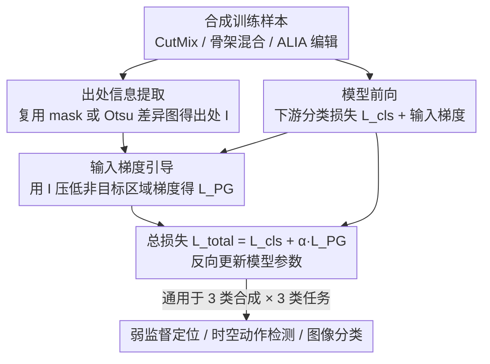

# Learning from Synthetic Data via Provenance-Based Input Gradient Guidance

**会议**: CVPR 2026  
**arXiv**: [2604.02946](https://arxiv.org/abs/2604.02946)  
**代码**: 无  
**领域**: 深度学习方法  
**关键词**: 合成数据学习, 输入梯度引导, 虚假相关性抑制, 数据增强, 出处信息

## 一句话总结

本文提出利用合成数据生成过程中自动获得的"出处信息"（provenance）作为辅助监督信号，通过输入梯度引导（抑制非目标区域的输入梯度）直接促进模型学习聚焦于目标区域的判别性表示，在弱监督定位、时空动作检测和图像分类等多任务多模态上验证了有效性。

## 研究背景与动机

深度学习模型训练中，合成数据（数据增强、生成模型编辑等）已成为提升模型鲁棒性的重要手段。现有合成学习方法（如 CutMix、mixup、基于扩散模型的图像编辑等）通过多样化训练样本分布来间接提高鲁棒性，但存在根本性缺陷：

1. **缺乏显式引导**：模型只拿到监督标签，需要自行判断输入空间中哪些区域真正对分类有贡献，容易学到虚假相关性（如背景、共现物体）
2. **合成偏差问题**：数据增强和生成模型引入的伪影和偏差本身也可能被模型错误学到，导致精度无法随数据量线性增长
3. **鲁棒性只是"副产品"**：现有方法的鲁棒性提升只是训练样本增多的间接效果，而非直接学习到目标物体的判别特征

核心洞察：合成过程中其实天然记录了"哪些像素来自哪个目标"的出处信息（例如 CutMix 的合成 mask、图像编辑前后的差异），但之前从没有人利用这些免费信息来显式约束模型的学习行为。

## 方法详解

### 整体框架

本文想解决的是合成数据学习里"模型不知道该看哪里"的问题：现有方法只给标签，模型得自己猜哪些像素真正对分类有贡献，结果常常学到背景这类虚假相关性。作者的切入点是——合成数据生成时其实天然记录了"哪块像素来自哪个目标"的出处信息（provenance），把它捞出来当辅助监督就能直接告诉模型该关注哪里。

整条流水线在常规训练上加了一层引导：先合成训练样本并顺手提取出处信息 $\mathbf{I}$，然后照常算下游任务的分类损失 $L_{cls}$，同时把出处信息转成一个作用在输入梯度上的正则项 $L_{PG}$，约束模型预测不要依赖非目标区域。两者合成总损失 $L_{total} = L_{cls} + \alpha L_{PG}$，$\alpha$ 控制引导强度。整个方案不碰网络结构，对任何能标出"目标/非目标"的合成方式都即插即用。

### 关键设计

**1. 出处信息提取：把合成时的"副产品"捞出来当监督**

模型学到虚假相关性的根源是没人告诉它哪些区域才是目标，而合成过程其实早就知道答案——只是以前没人去用。作者对三类主流合成方式分别给出零成本的提取办法：图像混合（CutMix、ResizeMix 等）直接复用合成时的 mask $M$，来自图 A 的区域记为 $\mathbf{I}_A = M$、来自图 B 的记为 $\mathbf{I}_B = 1-M$；骨架序列混合用一个时空二值 mask $M \in \{0,1\}^{P \times F \times E}$ 标记每个骨架特征的来源；生成模型图像编辑（如 ALIA）则比较原图与编辑图的逐像素差异图 $D(u,v)$，用 Otsu 自动阈值二值化，$\mathbf{I}(u,v)=1$ 即标记未被改动的目标区域。这些标注全是合成时自然产生的，不需要任何额外人工标注，却能精确圈出目标与非目标。

**2. 输入梯度引导：用梯度告诉模型"别看那块"**

有了出处信息还得让它真正改变模型的学习行为，作者的抓手是输入梯度——模型输出 logit 对输入的梯度 $\nabla_{\tilde{x}} f_y(\tilde{x})$ 直接反映预测对每个输入元素的敏感度，敏感度高的地方就是模型"在看"的地方。出处损失要做的就是把非目标区域的这部分敏感度压下去。对软标签场景（图像混合两张图各占一定标签权重），损失写成

$$L_{PG} = \big\| (1-M) \odot \nabla_{\tilde{x}} f_A(\tilde{x}) + M \odot \nabla_{\tilde{x}} f_B(\tilde{x}) \big\|_2^2,$$

含义是类 A 的预测不该依赖来自图 B 的区域、反之亦然；对硬标签场景（生成模型编辑只有单一标签 $y$），则约束 $L_{PG} = \| (1-M) \odot \nabla_{\tilde{x}} f_y(\tilde{x}) \|_2^2$，即类别 $y$ 的 logit 不该依赖被编辑过的区域。和以往靠"多喂样本、丰富分布"间接换鲁棒性的做法不同，这里是直接在梯度层面把模型按到目标区域上判别，虚假相关性被显式掐掉而不是寄希望于数据量稀释。

**3. 跨模态跨任务的通用性：只要能标出非目标区域就能用**

因为整套机制只依赖"出处信息 + 输入梯度"这两个与具体合成方法、网络架构都解耦的要素，它天然不挑场景。论文据此在三种合成方式（图像混合 CutMix/ResizeMix/PuzzleMix、骨架序列混合 BatchMix、生成模型编辑 ALIA）与三种任务（弱监督目标定位、弱监督时空动作检测、图像分类）上交叉验证，全都只需在原有训练流程里加一个出处损失即可，无需为每个场景定制。

### 损失函数 / 训练策略

总损失为 $L_{total} = L_{cls} + \alpha L_{PG}$，实验显示 $\alpha$ 取 $[0.01, 0.09]$ 都能稳定提升性能、对该超参不敏感。需要注意 $L_{PG}$ 涉及二阶微分（对输入梯度再求梯度），实现上用 PyTorch autograd 配合 AMP 加速，并在损失计算部分保留 FP32 以避免混合精度下的数值不稳定。

## 实验关键数据

### 主实验

| 任务/数据集 | 指标 | 基线 | + 合成方法 | + 本文方法 | 提升 |
|------------|------|------|-----------|-----------|------|
| 弱监督定位/CUB (VGG16) | MaxBoxAccV2 Mean | - | 62.3 (CutMix) | **65.1** | +2.8 |
| 弱监督定位/CUB (VGG16) | MaxBoxAccV2 Mean | - | 57.6 (ResizeMix) | **62.2** | +4.6 |
| 弱监督定位/CUB (SAT) | MaxBoxAccV2 Mean | 91.4 | 91.5 (CutMix) | **92.1** | +0.6 |
| 时空动作检测/UCF101-24 | AP@0.5 | 37.4 (SKP) | 38.0 (BatchMix) | **39.7** | +1.7 |
| 图像分类/Waterbirds | Top-1 Acc | 62.2 | 71.4 (ALIA) | **80.7** | +9.3 |
| 图像分类/iWildCam | Top-1 Acc | 75.0 | 83.5 (ALIA) | **84.4** | +0.9 |
| 图像分类/CUB | Top-1 Acc | 70.8 | 71.7 (ALIA) | **72.0** | +0.3 |

### 消融实验

| 配置 | CUB 定位 Acc (%) | 说明 |
|------|-------------------|------|
| Random mask | 60.5 | 随机 mask 作伪出处信息 |
| Unmasked (全区域) | 61.1 | 不区分目标/非目标 |
| Ours (真实出处) | **65.1** | 使用合成过程的真实出处 |

出处信息质量消融（图像分类）：对前景 mask 做膨胀/腐蚀 ±10%/±30%，性能下降有限（CUB: 72.1→71.5），说明方法对出处信息的精度鲁棒。

### 关键发现

- **Waterbirds 上提升最大（+9.3pp）**：Waterbirds 专门设计为背景和类别强相关的虚假相关数据集，出处引导直接抑制了背景依赖，效果最为显著
- 在 VGG16 上 CutMix → +Ours 提升 $\delta=0.5$ 时 IoU 从 67.3% 到 74.6%，但 $\delta=0.7$ 时从 28.6% 降到 23.1%——说明更严格的定位阈值下模型倾向于产生更大的检测框
- 训练效率方面，虽然二阶微分增加单 epoch 耗时（140s→150s），但收敛更快（50 epochs→15 epochs），总训练时间反而从 1.9h 降到 0.6h
- 随机 mask 和无 mask 的消融实验对比清楚证明：出处信息的准确性而非梯度正则化本身是提升的关键

## 亮点与洞察

- **"免费午餐"式的监督信号**是本文最大的亮点。合成过程天然产生出处信息但一直被忽略，本文首次系统地将其作为辅助监督信号。这个思路简单但影响深远——任何使用数据增强的训练流水线都可以零成本引入
- **从间接到直接**的范式转变令人信服：之前的合成学习方法通过丰富样本分布来间接提升鲁棒性，本文通过梯度正则化直接告诉模型"该看哪里"，效果自然更好
- 方法的通用性非常强——跨模态（图像、骨架序列）、跨任务（定位、检测、分类）、跨合成方法（混合、生成模型）都有效
- 收敛加速效果意外——理论上二阶微分应该增加计算，但收敛速度的提升反而使总训练时间下降

## 局限与展望

- 出处信息的粒度受限于合成方法——CutMix 只提供矩形 mask，生成模型编辑依赖差异图的 Otsu 二值化，精度可能不够
- 对于生成模型编辑的出处提取依赖于原图和编辑图的逐像素比较，当生成模型修改目标物体本身的外观时会产生误判
- 实验中使用的模型和数据集规模适中（VGG16、ResNet-50），在大规模预训练模型上的效果未验证
- 可探索将出处信息与注意力机制结合，或扩展到自监督学习中利用增强前后的对应关系

## 相关工作与启发

- **vs CutMix/ResizeMix/PuzzleMix**: 这些方法只做数据层面的混合增强，本文在此基础上增加了梯度层面的显式引导，是"增强+引导"的两阶段提升
- **vs Right for the Right Reasons (Ross et al.)**: 该工作也操控输入梯度但需要人工标注的注视区域，本文利用合成过程自动获取出处信息无需额外标注
- **vs ALIA**: ALIA 用扩散模型编辑训练图像增加多样性，本文在其基础上引入出处损失，Waterbirds 上提升 +9.3pp
- 出处引导的思路可以启发对比学习中正负样本构建的改进

## 评分

- 新颖性: ⭐⭐⭐⭐ 将合成过程的出处信息作为免费监督信号的思路新颖且实用，但技术手段（输入梯度正则化）相对成熟
- 实验充分度: ⭐⭐⭐⭐⭐ 三种合成方法×三种任务×多个数据集的全面验证，消融研究详尽（出处质量、超参敏感性、训练效率等）
- 写作质量: ⭐⭐⭐⭐ 问题定义清晰，方法推导严谨，公式形式统一
- 价值: ⭐⭐⭐⭐ 通用性强、实现简单、零额外标注成本，有望广泛应用于各种数据增强训练流水线

<!-- RELATED:START -->

## 相关论文

- [\[CVPR 2026\] SAIL: Similarity-Aware Guidance and Inter-Caption Augmentation-based Learning for Weakly-Supervised Dense Video Captioning](sail_similarity-aware_guidance_and_inter-caption_augmentation-based_learning_for.md)
- [\[CVPR 2026\] FlashMotion: Few-Step Controllable Video Generation with Trajectory Guidance](flashmotion_fewstep_controllable_video_generation.md)
- [\[CVPR 2026\] MDS-VQA: Model-Informed Data Selection for Video Quality Assessment](mds-vqa_model-informed_data_selection_for_video_quality_assessment.md)
- [\[CVPR 2026\] Image Guides Images: Consistent Video Amodal Completion with Rectified In-Context Exemplar Guidance](image_guides_images_consistent_video_amodal_completion_with_rectified_in-context.md)
- [\[ECCV 2024\] Data Collection-Free Masked Video Modeling](../../ECCV2024/video_understanding/data_collection-free_masked_video_modeling.md)

<!-- RELATED:END -->
