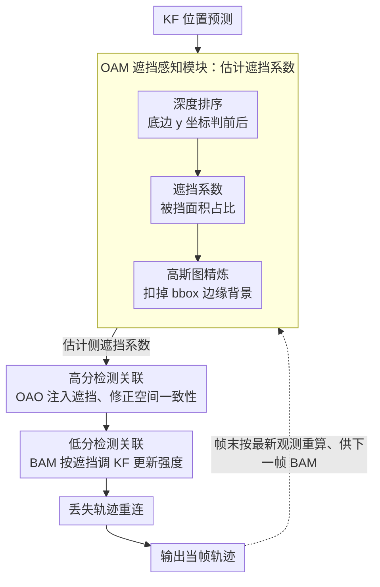

# Occlusion-Aware SORT: Observing Occlusion for Robust Multi-Object Tracking

**会议**: CVPR 2026  
**arXiv**: [2603.06034](https://arxiv.org/abs/2603.06034)  
**代码**: 无  
**领域**: 视频理解  
**关键词**: 多目标跟踪, 遮挡感知, Kalman Filter, 数据关联, 即插即用

## 一句话总结

提出遮挡感知跟踪框架 OA-SORT，通过显式建模目标遮挡状态来缓解位置代价混淆和 Kalman Filter 估计不稳定问题，在 DanceTrack/SportsMOT/MOT17 上均取得 SOTA 级提升，且组件可即插即用地集成到多种跟踪器中。

## 研究背景与动机

**2D MOT 中遮挡带来位置代价混淆**：当同类别目标发生部分遮挡时，检测器难以区分前景与背景，导致不准确检测，进而使 IoU 代价矩阵产生歧义，引发身份交换（ID switch）。

**Kalman Filter 对不准确检测敏感**：离散线性 KF 在频繁接收遮挡导致的不准确检测后会累积误差，估计不稳定，尤其在非线性姿态变化场景более加严重。

**现有附加线索对遮挡仍脆弱**：外观特征在遮挡下可靠性下降（被前方目标特征污染）；运动方向虽帮助减少匹配失败但代价混淆仍在；检测置信度也对遮挡敏感。

**缺乏对遮挡状态的显式建模**：现有方法要么间接建模遮挡（如用活动/非活动状态），要么使用运动补偿恢复丢失目标，但都没有直接估计遮挡严重程度并利用它来修正关联代价。

**深度信息利用不充分**：虽有方法（PD-SORT, SparseTrack）利用伪深度设计关联策略，但仍受到遮挡引起的代价混淆影响。

**需要一个通用、无需训练的遮挡感知框架**：目标是设计 plug-and-play、training-free 的组件，可以轻松集成到各种跟踪器架构中提升鲁棒性。

## 方法详解

### 整体框架

OA-SORT 要解决的核心问题是：当同类目标互相遮挡时，检测框会变得不准，导致 IoU 关联代价混淆、Kalman Filter（KF）估计发散，进而引发身份交换。它以 Hybrid-SORT 的三阶段关联（高分检测关联→低分检测关联→丢失轨迹重连）为骨架，额外挂上三个「遮挡感知」组件——OAM（Occlusion-Aware Module，遮挡感知模块）算出每个目标被遮挡的程度，OAO（Occlusion-Aware Offset）把这个程度注入关联代价，BAM（Bias-Aware Momentum）把它注入 KF 更新——整个框架 plug-and-play、无需训练。其中 OAM 又由「深度排序→遮挡系数→高斯图精炼」三个子步组成（对应下面关键设计的前三点），OAO、BAM 则各是一个独立组件。

一帧的流转是这样的：KF 先给出位置预测，OAM 据此计算遮挡系数；高分检测关联时 OAO 用 KF 估计侧的遮挡系数修正空间一致性度量；与低分检测关联上的轨迹再经 BAM 调整 KF 的运动参数；帧末 OAM 基于最新观测重算遮挡系数，留给下一帧的 BAM 使用。

### 关键设计

**1. 深度排序：判断谁挡住了谁**

要算遮挡，先得知道两个重叠目标谁在前、谁在后。OA-SORT 利用俯视相机的成像规律——目标离相机越近，其 bounding box 底边的 y 坐标越小——以此推断前后关系。为减少抖动带来的误判，设置 5 像素阈值，底边差异在此之内时不判定遮挡。

**2. 遮挡系数：把遮挡严重程度量化成一个比值**

有了前后关系，被遮挡目标 $i$ 的遮挡程度定义为被挡区域面积占自身面积的比例 $Oc_i = A(\mathcal{O}_i) / A(\mathcal{D}_i)$，其中 $\mathcal{O}_i$ 是它被前方目标覆盖的区域、$\mathcal{D}_i$ 是它自身的检测框；多个目标同时遮挡时取并集面积。这个标量后续会直接喂给关联和 KF 更新两个环节，是全框架的中枢量。

**3. 高斯图精炼：扣掉 bbox 边缘的背景，别把遮挡算虚高**

直接用面积比会高估遮挡，因为 bounding box 的边缘往往包含大片背景像素，这些背景被前方目标盖住并不代表目标真正被遮挡。为此引入 2D 高斯权重图 $GM$，让靠近目标中心的像素权重大、边缘像素权重小，精炼后的系数为 $\hat{Oc}_i = \sum_{(x,y) \in \mathcal{O}_i} GM_{x,y} / A(\mathcal{D}_i)$。高斯的 $\sigma^x, \sigma^y$ 按数据集运动模式调（见训练策略），这一步是消融里单项增益最大的设计。

**4. OAO：把遮挡系数加进关联代价，且加在估计上而非检测上**

遮挡导致检测不可靠，所以 OAO 选择把遮挡系数施加在 KF 估计 $X$（而非抖动的检测）上，与 IoU 代价加权组合成空间一致性评分 $S = \tau \cdot (1 - \hat{Oc}^X) + (1-\tau) \cdot C_{IoU}(\mathcal{D}, X)$。$\tau$ 控制遮挡项的权重（DanceTrack 0.15 / SportsMOT 0.2 / MOT17 0.1），且只在第一阶段高分检测关联时触发——这一阶段最容易因遮挡而错配身份。

**5. BAM：遮挡越重，KF 更新就越信预测、越不信观测**

对低分检测，OA-SORT 用一个自适应动量来调 KF 的更新强度：$BAM = C_{IoU}(X_{t|t-1}, Z_t) \cdot (1 - \hat{Oc}^{Z_{t-1}})$，再以它加权当前观测 $\hat{Z}_t = BAM \cdot Z_t + (1-BAM) \cdot H_t X_{t|t-1}$。直觉很直接：当观测被严重遮挡（$\hat{Oc}$ 大）或与预测偏差大（IoU 小）时，$BAM$ 变小，更新就更依赖 KF 自身的预测，从而避免不准的遮挡检测把滤波器带偏。

### 损失函数 / 训练策略

本方法是 **training-free** 框架，无需额外训练或微调，所有超参经验设定：GM 的 $\sigma^x, \sigma^y$ 按数据集运动模式调整（DanceTrack: $w/3\sqrt{2}, h/3$；SportsMOT: $w/4, h/3$；MOT17: $w/2, h/2$），OAO 的平衡系数 $\tau$ 在 0.1–0.2 之间（DanceTrack 0.15 / SportsMOT 0.2 / MOT17 0.1），BAM 统一用 HMIoU 作为空间一致性度量。

## 实验关键数据

### 主实验

**DanceTrack test set（非线性运动+频繁遮挡）**

| 方法 | HOTA | AssA | MOTA | IDF1 |
|------|------|------|------|------|
| Hybrid-SORT | 62.2 | 47.4 | 91.6 | 63.0 |
| **OA-SORT** | **63.1** | **48.5** | **91.7** | **64.2** |
| OA-Byte (ByteTrack+OA) | 49.0 | 33.7 | 89.6 | 55.9 |
| OA-OC (OC-SORT+OA) | 56.5 | 39.6 | 91.2 | 57.6 |
| OA-Sparse (SparseTrack+OA) | 57.8 | 41.8 | 91.5 | 60.2 |
| OA-PD (PD-SORT+OA) | 60.4 | 44.9 | 91.4 | 60.8 |

**SportsMOT test set（变速运动+相机运动）**

| 方法 | HOTA | AssA | MOTA | IDF1 |
|------|------|------|------|------|
| Hybrid-SORT | 73.0 | 61.6 | 94.3 | 73.3 |
| **OA-SORT** | **73.4** | **62.3** | **94.4** | **74.1** |
| Hybrid-SORT* | 74.8 | 63.2 | 96.2 | 75.1 |
| **OA-SORT*** | **75.2** | **63.8** | **96.3** | **75.8** |

**MOT17 test set（线性运动+长期遮挡）**

| 方法 | HOTA | AssA | MOTA | IDF1 |
|------|------|------|------|------|
| Hybrid-SORT | 63.6 | 63.2 | 80.6 | 78.4 |
| **OA-SORT** | **64.2** | **64.0** | 79.6 | **79.1** |
| Hybrid-SORT-REID | 64.0 | 63.5 | 79.9 | 78.7 |

### 消融实验

**组件消融（DanceTrack-val）**

| OAO | BAM | GM | HOTA | AssA | IDF1 | 耗时增量 |
|-----|-----|----|------|------|------|----------|
| - | - | - | 59.4 | 44.9 | 60.7 | 9.57ms |
| ✓ | - | - | 59.9 | 45.6 | 60.9 | +1.96ms |
| - | ✓ | - | 60.5 | 46.5 | 62.2 | +3.81ms |
| ✓ | ✓ | - | 60.6 | 46.7 | 62.0 | +9.25ms |
| ✓ | ✓ | ✓ | **61.5** | **48.0** | **63.7** | +14.99ms |

**跨跟踪器泛化（DanceTrack-val，均加 OAO+BAM+GM）**

| 跟踪器 | 原 HOTA→新 HOTA | 原 IDF1→新 IDF1 |
|--------|-------------------|-------------------|
| SORT | 48.4→50.4 (+2.0) | 49.6→53.3 (+3.7) |
| ByteTrack | 47.1→49.3 (+2.2) | 52.7→55.7 (+3.0) |
| OC-SORT | 52.3→53.8 (+1.5) | 52.0→53.9 (+1.9) |
| TrackTrack | 59.3→59.9 (+0.6) | 61.1→62.0 (+0.9) |

### 关键发现

- GM 是最关键的组件，单独引入带来 +2.1 HOTA 提升，因为它有效抑制了 bbox 边缘背景像素对遮挡估计的干扰
- BAM 单独使用比 OAO 单独使用效果更好（+1.1 vs +0.5 HOTA），说明优化 KF 估计比修正关联代价更重要
- $\tau$ 超过约 0.2 后性能下降，过大的遮挡偏移会破坏空间一致性表达
- OA-SORT 无 ReID 甚至超过 Hybrid-SORT-REID（+0.5 AssA, +0.3 IDF1），说明遮挡感知可部分替代外观特征
- 遮挡越严重的视频序列获得的提升越大（见 Fig.1）

## 亮点与洞察

- **直接建模遮挡严重程度**：区别于间接遮挡处理方法，OAM 显式计算遮挡系数并将其注入关联和 KF 更新两个关键环节
- **Gaussian Map 精炼遮挡估计**：创新性地用 2D 高斯权重降低 bbox 边缘背景像素影响，是全文最大增益来源
- **完全即插即用、无需训练**：三个模块均可独立使用，已验证对 SORT/ByteTrack/OC-SORT/SparseTrack/PD-SORT/TrackTrack/BOT-SORT 七种跟踪器有效
- **思路清晰的问题分析**：Sec.3 从检测误差和估计误差累积的角度严格分析了遮挡如何引起代价混淆，为方法设计提供了坚实理论基础

## 局限性

- **底边深度排序假设受限**：当目标下半部被遮挡或目标腾空（如跳跃）时，底边位置无法准确反映深度关系，框架性能下降
- **缺乏长时遮挡建模**：遮挡状态及其时间变化是连续过程，当前方法仅利用瞬时遮挡信息，未建模遮挡的长期时序演变
- **GM 计算开销**：引入 GM 后每帧平均跟踪时间增加约 15ms，虽仍满足实时需求但在超大规模场景可能成为瓶颈
- **超参数需按数据集调整**：$\sigma^x, \sigma^y, \tau$ 需针对不同场景经验调参，泛化到全新场景需额外调试

## 相关工作

- **Position-Association 系列**：SORT → OC-SORT → Hybrid-SORT → PD-SORT/SparseTrack（利用伪深度），OA-SORT 在此链条上进一步引入显式遮挡建模
- **Feature-Association 系列**：StrongSORT++/BOT-SORT-REID 等利用外观特征增强关联，但遮挡下特征可靠性同样受损，OA-SORT 证明遮挡感知可部分替代 ReID
- **遮挡处理方法**：Stadler (活动/非活动状态间接建模)、Hibo (运动补偿恢复丢失目标)、DiffMOT (扩散模型预测)，均未直接估计遮挡程度

## 评分

- 新颖性: ⭐⭐⭐⭐ — 显式遮挡系数+高斯图精炼+双路注入思路新颖
- 实验充分度: ⭐⭐⭐⭐⭐ — 三数据集+七跟踪器集成+详细消融+参数分析
- 写作质量: ⭐⭐⭐⭐ — 问题分析到位，公式推导清晰，图表规范
- 价值: ⭐⭐⭐⭐ — plug-and-play 设计实用性强，提升幅度合理且一致

<!-- RELATED:START -->

## 相关论文

- [\[CVPR 2026\] Rethinking Occlusion Modeling for UAV Tracking](rethinking_occlusion_modeling_for_uav_tracking.md)
- [\[CVPR 2026\] Tracking through Severe Occlusion via Event-Derived Transient Cues](tracking_through_severe_occlusion_via_event-derived_transient_cues.md)
- [\[CVPR 2026\] Hypergraph-State Collaborative Reasoning for Multi-Object Tracking](hypergraph-state_collaborative_reasoning_for_multi-object_tracking.md)
- [\[CVPR 2026\] ProgTrack: A Multi-Object Tracking Algorithm with Progressive Matching Strategy](progtrack_a_multi-object_tracking_algorithm_with_progressive_matching_strategy.md)
- [\[CVPR 2026\] Dual-level Adaptation for Multi-Object Tracking: Building Test-Time Calibration from Experience and Intuition](tcei_test_time_calibration_experience_intuition_mot.md)

<!-- RELATED:END -->
