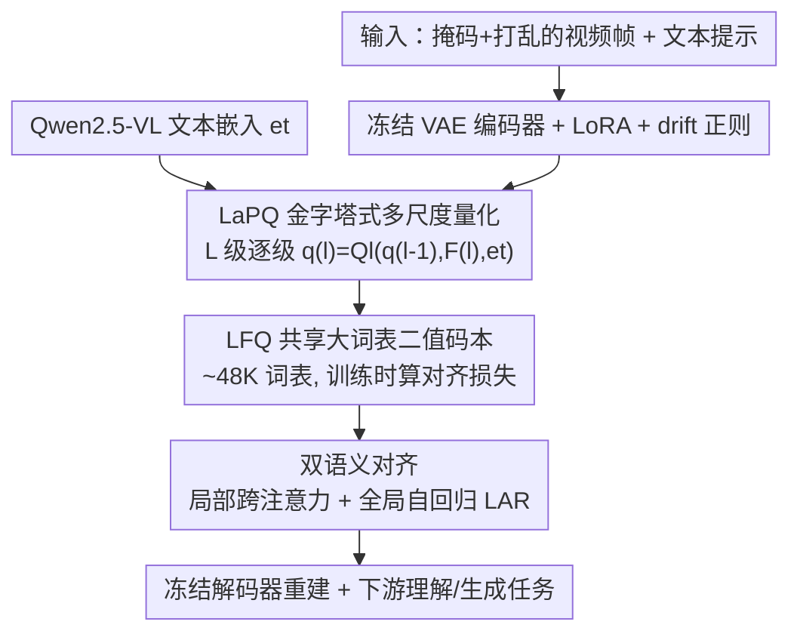

# PyraTok: Language-Aligned Pyramidal Tokenizer for Video Understanding and Generation

**会议**: CVPR 2026  
**论文**: [CVF Open Access](https://openaccess.thecvf.com/content/CVPR2026/html/Susladkar_PyraTok_Language-Aligned_Pyramidal_Tokenizer_for_Video_Understanding_and_Generation_CVPR_2026_paper.html)  
**代码**: 待确认（项目页 https://plan-lab.github.io/pyratok ）  
**领域**: 视频理解 / 视频生成 / 离散视频 VAE  
**关键词**: 视频分词器, 金字塔量化, 语言对齐, 离散 VAE, 零样本视频理解

## 一句话总结
PyraTok 是一个语言对齐的金字塔式视频分词器：在冻结视频 VAE 的多个编码器深度上做逐级量化（LaPQ），配合一个共享的大词表二值码本和"局部跨注意力 + 全局自回归"双语义对齐，既把重建质量做到 SOTA，又让同一套离散 token 在零样本视频分割、时序动作定位、视频理解/分类上全面刷新纪录。

## 研究背景与动机

**领域现状**：现代文生视频（T2V）和视频理解系统大多建立在离散 VAE 之上——VQ-VAE 系把视频编码进一个可学习码本，量化成离散 token，再交给扩散或自回归模型做生成。离散 token 既压缩高效，又天然适配序列建模，因此成了 VideoGPT、CogVideoX、MAGVITv2 这类系统的基础设施。

**现有痛点**：作者指出现有视频分词器有三个具体毛病。其一，**单尺度量化**：码本几乎都只在编码器最后一层（拿到 latent 之后）学习语义，没有利用 VAE "浅层管局部细节、深层管高层语义"的层级结构，导致文-视频对齐粒度粗。其二，**码本太小**：常见词表只有 4K–8K，对基本视觉模式够用，但限制了视觉和文本两边的表达能力，跨模态对齐和文本条件生成都被卡住。其三，**浅层单点的文本对齐导致语义漂移**：现有方法要么只在序列级用对比损失注入全局语言信号，要么只在 token 级做码本蒸馏，而且只在码本学习阶段做一次，结果局部视觉 token 跟全局文本意图对不齐，跨尺度、跨时间都会漂移。

**核心矛盾**：想要更强的跨模态对齐就要更大的码本和更细的语义注入，但大码本带来高维查表的显存/算力爆炸，而单点对齐又压不住多尺度、长时序上的语义漂移——表达力、效率、对齐一致性三者互相牵制。

**本文目标**：在离散潜空间里同时做到（1）多尺度、由粗到细的语义结构，（2）可负担地用上大词表，（3）局部 token 与全局文本意图在所有尺度和时间上保持一致。

**切入角度**：作者的观察是——视频本身就有跨空间、跨时间的多层级结构，那量化也应该顺着编码器的多个深度"逐级"做，而不是只在末端做一次；同时语言信号要在每一级都注入（局部），再用一个全局自回归目标把整条 token 序列收束到文本意图上（全局）。

**核心 idea**：用"在多个编码器深度上逐级量化 + 每级都注入文本 + 全局自回归收束 + 共享大词表二值码本"替代"单尺度小码本单点对齐"，让一套离散 token 同时服务生成和零样本理解。

## 方法详解

### 整体框架
给定视频 $X \in \mathbb{R}^{C \times T \times H \times W}$ 和文本提示，PyraTok 的目标是学到一组既保真又跟文本语义对应的紧凑离散 latent。输入视频先被**掩码、打乱**后送进一个**冻结的预训练视频 VAE 编码器**（插了 LoRA 做轻量适配），编码器的 $L$ 个层级产出多尺度时空特征 $F^{(l)}$。这些特征不是只在末端量化一次，而是在**每个深度上逐级量化**（LaPQ）：第 $l$ 级的量化块 $Q_l$ 同时接收当前特征 $F^{(l)}$、上一级量化结果 $q^{(l-1)}$、以及来自 Qwen2.5-VL 的文本嵌入 $e_t$，输出语义对齐的量化表示 $q^{(l)}$。量化用的是一个**所有级共享的大词表二值码本**（LFQ）。每一级内部用跨注意力把文本注入视觉（局部对齐），整条 token 序列再被一个**全局自回归目标**收束到文本上（全局对齐）。最后冻结解码器从量化 token 重建视频，同一套 token 直接喂给下游的生成与零样本理解任务。

### 关键设计

**1. LaPQ 金字塔式多尺度量化：让量化顺着编码器深度由粗到细做**

针对"单尺度量化只在末端做一次、丢掉了 VAE 的层级结构"这个痛点，LaPQ 不再只量化最后的 latent，而是在编码器的多个深度通过**横向连接（lateral connections）**接出特征分别量化：浅层抓局部细节、深层抓全局语义。形式上编码器逐级算 $F^{(l)} = En(F^{(l-1)})$（$F^{(0)} = \tilde{X}$），每一级配一个量化块

$$q^{(l)} = Q_l(q^{(l-1)}, F^{(l)}, e_t)$$

注意 $Q_l$ 把上一级的量化结果 $q^{(l-1)}$ 也作为输入，所以是"逐级递归精化"而非各级独立——深层的量化在浅层基础上继续细化语义结构（论文 Figure 4 的 PCA 投影显示越深的级，道路车道、车辆、背景的语义分离越清晰）。这样不必把码本做到很高维，就能同时拿到粗、细两端的时空信息，绕开了"大码本=高内存"的死结。消融里去掉 LaPQ 是所有配置里掉点最猛的（PSNR 从 35.72 掉到 31.41），说明这是整个方法的地基。

**2. LFQ 共享大词表二值码本：用二值码字把词表撑到 ~48K 还不爆显存**

针对"想用大码本提表达力、但高维查表算力爆炸"的矛盾，PyraTok 用 Lookup-Free Quantization（LFQ）把传统的可学习码本 $C \in \mathbb{R}^{K \times d}$ 换成紧凑的二值码字 $C_v \in \{-1, 1\}^{\log_2 K}$。这样省掉了高维 embedding 查表，把词表高效扩到约 48K（码本利用率高达 95%）。关键的工程取舍是：这个二值码本**在所有 $Q_l$ 量化块之间共享**——既保证了金字塔各级之间的一致性，又把参数增长压到最低；而且码本**只在训练时**用来算对齐损失、引导结构，**推理时量化无需查表**，保留了 LFQ 的高效。消融显示码本规模增大持续提升重建与感知质量，但超过约 80K 词表后收益饱和，提示容量与效率之间存在权衡。

**3. 双语义对齐：局部每级注入文本 + 全局自回归收束，压住语义漂移**

针对"浅层单点对齐导致跨尺度/跨时间语义漂移"的痛点，PyraTok 同时做两层对齐。**局部（每级内）**：在每个量化块 $Q_l$ 里，先用横向连接保住空间/时间局部性，再用多头注意力让视觉特征去"注意"预训练 VLM 抽出的文本嵌入 $e_t$（文本作 key/value），实现语言引导的视觉调制，融合后再量化——保证每个离散 token 都携带对应的语言语义。**全局（整条序列）**：把各级量化 token 用分隔符 `<Q-SEP>` 拼接、前面加 `<SOI>` 起始符，接在文本之后送进 VLM 解码器，自回归地从文本前缀逐个预测视觉 token：

$$L_{AR} = -\sum_{l=1}^{L} \log p(q^{(l)} \mid q^{(<l)}, e_t)$$

让"视觉 token 可由文本前缀预测出来"这件事，强迫共享码本去编码全局一致、语言对齐的语义，从而把局部 token 锚定到全局文本意图上。分隔符在保留层级结构的同时支持统一序列建模。消融里去掉 $L_{AR}$（PSNR 掉到 ~34.0）、再叠加去掉 $L_{drift}$（掉到 32.17）都验证了全局对齐对语义连贯的作用。

**4. 冻结 VAE + LoRA + drift 正则：不动预训练权重也能稳住语义适配**

为了保住预训练 VAE 的高保真重建、把学习精力集中在语义对齐上，PyraTok 把编码器 $En$ 和解码器 $De$ 都**冻结**，只往编码器块里插 LoRA 做轻量特征调制。但文本条件监督可能把 latent 拉离预训练的视觉流形（latent drift），所以作者加了一个 **drift 正则项**，用 KL 把适配后的特征锚回一个冻结的大规模参考编码器 $\overline{En}$：$L_{drift} = D_{KL}(En(\tilde{X}) \,\|\, \overline{En}(\tilde{X}))$（⚠️ 原文该式两侧记号略有排版噪声，含义以原文为准）。这样既允许语义引导的更新，又不让 LoRA 跑偏破坏原始视觉先验。消融中单独去掉 $L_{drift}$ 重建质量明显下降，和 $L_{AR}$ 一起去掉时掉得最多。

### 损失函数 / 训练策略
总损失是重建、语义对齐、量化一致性三者的加权组合：

$$L = \lambda_{recon} L_{recon} + \lambda_{codebook} L_{codebook} + \lambda_{AR} L_{AR} + \lambda_{drift} L_{drift}$$

其中重建损失结合像素级与感知项 $L_{recon} = L_{SSIM} + L_{L1} + L_{LPIPS}$。核心的**层级语义码本损失** $L_{codebook}$（论文式 2）在每一级 $l$ 上叠加五项：①视觉承诺项 $\|q^{(l)} - sg(C_v)\|^2$（把量化结果拉向二值码字）；②熵正则（把分配推向近 one-hot）；③层级一致性 $D_{KL}(q^{(l)} \| q^{(l-1)})$（相邻级保持连贯）；④文本条件对齐 $D_{KL}(q_i \| sg(e_t))$；⑤文本-码本对齐 $D_{KL}(c \| sg(e_t))$（把码本本身拉向文本嵌入）。$sg(\cdot)$ 为停梯度算子。训练数据用 Droplet-10M 的 HD 子集，外加 OpenVid-1M 和带重建字幕的 4K/8K UltraVideo 超高清样本。默认 VLM 用 Qwen2.5-VL，默认预训练 VAE 骨干为 Wan 2.2。

## 实验关键数据

跨 10 个真实基准评测，覆盖帧重建、零样本分割、时序动作定位、通用视频理解/分类、文生视频生成。相比最强的先前 VAE 基线，PyraTok 在时序动作定位上 +5.75 mAP、videoQA +2.82、视频分类最高 +9.16。

### 主实验：帧重建（Table 1，WebVid-10M / COCO-Val）

| 方法 | 参数量 | 延迟(ms) | PSNR↑ (W/C) | SSIM↑ (W/C) | LPIPS↓ (W/C) |
|------|--------|---------|-------------|-------------|--------------|
| LARP | 183M | 689 | 33.03 / 34.26 | 0.851 / 0.853 | 0.091 / 0.089 |
| 3D-MBQ-VAE | 317M | 650 | 33.00 / 32.11 | 0.848 / 0.858 | 0.092 / 0.108 |
| TokLIP（语义） | 207M | 604 | 31.28 / 33.42 | 0.837 / 0.849 | 0.152 / 0.105 |
| SweetTok（语义） | 128M | 432 | 32.32 / 32.78 | 0.842 / 0.847 | 0.137 / 0.123 |
| **PyraTok（本文）** | 192M | 492 | **35.72 / 36.05** | **0.879 / 0.885** | **0.066 / 0.071** |

相比同样做语义对齐的 SweetTok 和 TokLIP，PyraTok 的 PSNR 分别高 10.51% 和 14.19%、LPIPS 分别低 51.62% 和 56.57%；同时也超过 3D-MBQ-VAE、CogVideoX、LARP 等非语义 SOTA。延迟 492ms 在 25 帧 256×256 单 V100 上属中等，没有为质量牺牲过多速度。

### 下游零样本任务（Table 3/4/5）

| 任务 / 基准 | 指标 | 之前最好 | PyraTok | 提升 |
|------------|------|---------|---------|------|
| 视频分割 YouTube-VIS 2021 | mAP | OmniTok 14.54 | **24.54** | +68.8% 相对 |
| 视频分割 OVIS | mAP | OmniTok 2.8 | **8.9** | +217.9% 相对 |
| 动作定位 THUMOS14 | mAP | LARP 27.42 | **33.17** | +5.75 |
| 动作定位 ActivityNet v1.3 | mAP | LARP 25.53 | **29.11** | +3.58 |
| 视频理解 MVBench | 准确率 | LARP 83.21 | **86.03** | +2.82 |
| 分类 Kinetics-400 | 准确率 | LARP 69.27 | **78.43** | +9.16 |

PyraTok 是已知第一个用语言对齐离散 VAE 做到零样本视频语义分割的工作，OVIS 上相对提升超过 2 倍；在 MVBench 上甚至超过 InternVL3-78B、Qwen2.5-VL(7B) 等大型非 VAE 基础模型。文生视频方面（Table 2，WebVid-10M），把 MotionAura、Open-MAGVITv2、OmniGenV2 的原生 VAE 换成 PyraTok 后，FVD 下降 9–22 点、时序一致性 TC 提升 20–27 点。

### 消融实验（Table 6，PSNR on COCO-Val / WebVid-10M）

| 配置 | PSNR (C / W) | 说明 |
|------|--------------|------|
| 完整模型（4 Blocks, Qwen2.5-VL） | 35.72 / 36.05 | 默认 |
| w/o LaPQ | 31.41 / 31.47 | 去掉层级量化，掉点最猛（地基） |
| w/o Text Guidance | 33.43 / 36.02 | 去文本引导，语义落地变弱 |
| w/o Pyramidal-Q | 34.02 / 34.02 | 去多尺度结构 |
| 2 Blocks → 3 → 4 | 33.21 / 34.78 / 35.72 | 量化级数越多越好，4 级最佳 |
| w/o $L_{drift}$ | 33.48 / 34.52 | 去漂移正则 |
| w/o $L_{AR}$ | 33.42 / 34.01 | 去全局自回归对齐 |
| w/o $L_{drift}$ & $L_{AR}$ | 32.17 / 32.32 | 两个一起去，第二大降幅 |
| w/o 视觉承诺项 | 32.88 / 33.45 | 码本损失项，分配不稳 |
| w/o 文本-码本对齐 | 34.11 / 34.78 | 全局语义结构受损 |

### 关键发现
- **LaPQ 是最大贡献**：去掉它从 35.72 掉到 31.41，远超去掉任何单一损失项的影响，说明"多尺度逐级量化"是性能来源，而不仅是文本对齐这个噱头。
- **量化级数单调有效**：2→3→4 块持续涨点，印证了"更深的量化层级同时抓住粗细视觉细节"的假设。
- **码本规模有饱和点**：词表/维度增大持续提升质量，但超过约 80K 后收益饱和，是容量-效率的权衡边界。
- **VLM/VAE 骨干可替换**：换 LLaMA-3 8B、Gemma-3 4B 仍有竞争力（Qwen2.5-VL 最好）；换 3D-MBQ-VAE、CogVideoX、Mochi-VAE 也都保持改进（Wan 2.2 默认最佳），说明设计是即插即用的。

## 亮点与洞察
- **把"量化"从一次性末端操作改成沿编码器深度的递归过程**：$q^{(l)} = Q_l(q^{(l-1)}, F^{(l)}, e_t)$ 这个递归式很巧——它让后级在前级基础上继续精化，天然契合 VAE 由浅到深的语义梯度，是单尺度方法拿不到的。
- **LFQ 二值码本 + 跨级共享 + 仅训练时使用**：用 $\{-1,1\}^{\log_2 K}$ 码字把词表撑到 48K 还不爆显存，推理时无需查表——这套"大词表的好处留下、查表的代价砍掉"的组合可直接迁移到图像分词器。
- **一套 token 同时做生成和零样本理解**：最让人"啊哈"的是同一个离散表示既能换进 T2V 模型提质量，又能零样本刷新分割/定位/分类——证明语言对齐的离散 latent 是真正可迁移的通用表示，而非各任务各练一套。
- **drift 正则化的思路可复用**：冻结大骨干 + LoRA 适配时，用 KL 把适配特征锚回冻结参考编码器来防漂移，这招对任何"在预训练流形上做语义微调"的场景都适用。

## 局限与展望
- **依赖强预训练骨干**：方法建立在冻结的预训练视频 VAE + 大 VLM（Qwen2.5-VL）之上，重建上限和语义质量都受这些外部组件制约，从零训练的可行性未讨论。
- **训练开销不透明**：五项码本损失 + 自回归 + drift + 重建的多目标加权，权重 $\lambda$ 的取值、训练成本与收敛稳定性正文未给细节（留在补充材料），复现门槛偏高。
- **横向比较需谨慎**：零样本分割的相对提升（OVIS +217.9%）基数很小（2.8→8.9 mAP），绝对值仍远低于有监督方法，"零样本 SOTA"更多是同类无监督/零样本里的领先，不宜直接和有监督数字比大小。
- **作者展望**：把 PyraTok 扩到长时序、多主体、因果这类复杂视频推理任务，并系统评估对齐失败与"谄媚"（sycophancy）问题。

## 相关工作与启发
- **vs SweetTok**：两者都做语义对齐，但 SweetTok 解耦空间/时间 token 后**独立处理**，破坏了全局语义一致性；PyraTok 用每级文本引导量化 + 全局自回归先验同时管住细粒度与时序连贯，重建 PSNR 高 10.51%、LPIPS 低 51.62%。
- **vs TokLIP**：TokLIP 用 CLIP 级语义丰富视觉 token，但**缺时序建模**；PyraTok 的全局 AR 目标显式约束时间一致性。
- **vs LARP**：LARP 引入自回归友好的 latent 先验但**没有显式文本条件监督**；PyraTok 在每个量化级都注入文本，动作定位上 +5.75 mAP。
- **vs MAGVITv2 / LFQ**：PyraTok 沿用 LFQ 的无查表二值码本拿到大词表，但把它从单尺度量化扩展成跨编码器深度的金字塔共享码本，并叠加语言对齐。
- **vs VideoVAE+**：后者用冻结 BERT 嵌入在量化阶段注入字幕做单分辨率对齐；PyraTok 强调的正是它忽略的"多尺度、由粗到细"结构。

## 评分
- 新颖性: ⭐⭐⭐⭐⭐ "金字塔逐级量化 + 局部/全局双对齐 + 大词表二值共享码本"的组合在视频分词器里是新的，且第一个做到零样本视频分割。
- 实验充分度: ⭐⭐⭐⭐⭐ 10 个基准、生成+理解全覆盖，消融逐项拆解（组件/级数/损失/码本/骨干）很扎实。
- 写作质量: ⭐⭐⭐⭐ 方法与动机讲得清楚，但多项损失的权重与训练细节下放补充材料，正文略欠工程透明度。
- 价值: ⭐⭐⭐⭐⭐ 一套离散 token 同时服务生成与零样本理解，作为分词器基础设施的可迁移性强。

<!-- RELATED:START -->

## 相关论文

- [\[CVPR 2026\] DeRVOS: Decoupling Consistent Trajectory Generation and Multimodal Understanding for Referring Video Object Segmentation](dervos_decoupling_consistent_trajectory_generation_and_multimodal_understanding_.md)
- [\[CVPR 2026\] RAGTrack: Language-aware RGBT Tracking with Retrieval-Augmented Generation](ragtrack_language-aware_rgbt_tracking_with_retrieval-augmented_generation.md)
- [\[CVPR 2026\] Gloria: Consistent Character Video Generation via Content Anchors](gloria_consistent_character_video_generation_via_content_anchors.md)
- [\[AAAI 2026\] FineVAU: A Novel Human-Aligned Benchmark for Fine-Grained Video Anomaly Understanding](../../AAAI2026/video_understanding/finevau_a_novel_human-aligned_benchmark_for_fine-grained_video_anomaly_understan.md)
- [\[CVPR 2026\] Affordance-First Decomposition for Continual Learning in Video–Language Understanding](affordance-first_decomposition_for_continual_learning_in_video-language_understa.md)

<!-- RELATED:END -->
