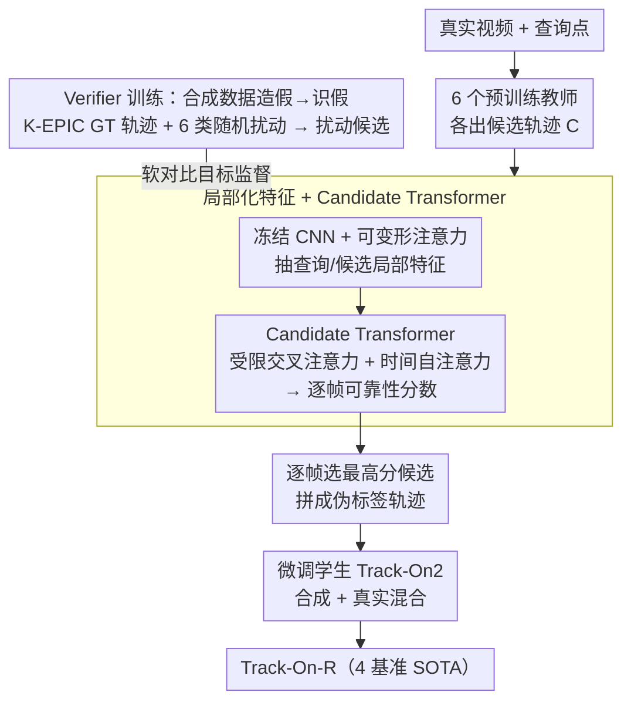

# Real-World Point Tracking with Verifier-Guided Pseudo-Labeling

**会议**: CVPR 2026  
**arXiv**: [2603.12217](https://arxiv.org/abs/2603.12217)  
**代码**: [kuis-ai.github.io/track_on_r](https://kuis-ai.github.io/track_on_r)  
**领域**: 视频理解 / 点跟踪  
**关键词**: point tracking, pseudo-labeling, verifier, multi-teacher ensemble, sim-to-real adaptation

## 一句话总结

提出一个可学习的Verifier元模型，在合成数据上训练"判断tracker预测可靠性"的能力并迁移到真实世界，通过逐帧评估6个预训练tracker的预测来选取最可靠的作为伪标签，仅用~5K真实视频即微调出在4个真实世界基准上全面SOTA的Track-On-R模型。

## 研究背景与动机

**领域现状**：长程点跟踪模型（CoTracker、TAPIR、Track-On等）通常在合成数据（TAP-Vid Kubric）上训练。近年提出自训练方法（BootsTAPIR、CoTracker3）在真实视频上用伪标签微调以弥合sim-to-real gap。

**现有痛点**：

1. 单个tracker在不同帧/场景下可靠性差异巨大——快速运动、低纹理、遮挡、身份切换等不同挑战下各有擅长
2. 朴素自训练（随机选一个教师生成伪标签）或固定融合策略无法应对这种异质性，会传播系统性误差
3. BootsTAPIR等方法需要百万级真实视频做大规模蒸馏，数据效率低

**核心矛盾**：Oracle实验表明，若每帧都能选到最佳tracker，性能可大幅提升（与实际方法gap很大），但没有自动化方法能实现这种逐帧自适应选择。

**本文目标** 学会自动判断多个tracker在每一帧的可靠程度，选取最准确的预测作为伪标签。

**切入角度**：训练一个"Verifier"元模型——不做跟踪本身，而是学习"谁跟得好"。在合成数据上通过"造假→识假"（对GT轨迹施加随机扰动模拟tracker错误）学习可靠性判断。

**核心 idea**：Verifier不跟踪点，而是给tracker的预测打分，把多模型互补性转化为高质量伪标签。

## 方法详解

### 整体框架

这篇要解决的是点跟踪的 sim-to-real 鸿沟：跟踪模型大多在合成数据（TAP-Vid Kubric）上训，搬到真实视频就掉点，而已有自训练方法要么随机挑一个教师生成伪标签、传播系统误差，要么像 BootsTAPIR 那样需要百万级真实视频。本文的巧思是训一个不做跟踪、只做「裁判」的 Verifier 元模型。

流程是：给定视频和查询点，6 个预训练教师 tracker 各生成一条候选轨迹 $\mathbf{C} \in \mathbb{R}^{L \times M \times 2}$；Verifier 在每一帧给这 $M$ 个候选打可靠性分数 $\hat{\mathbf{s}}_t \in \mathbb{R}^M$，逐帧选最高分的候选，拼成完整的伪标签轨迹；再用这条伪标签微调学生模型 Track-On2。推理时 Verifier 还能当即插即用的集成模块直接用。Verifier 本身（局部化特征 + Candidate Transformer）则提前在合成数据上「造假→识假」训好。

### 关键设计

**1. Verifier 训练：在合成数据上「造假→识假」，零真实标注学会判断可靠性**

Verifier 要学的是「谁跟得准」，而真实数据没有 GT、没法直接监督。本文的办法是在 K-EPIC 合成数据集（11K 视频、24 帧/视频）上自造训练信号：对 GT 轨迹施加 6 类随机扰动（漂移、跳变、遮挡、身份切换等，位移 1~128 像素）模拟真实 tracker 的各种失败，生成候选轨迹 $\mathbf{C}$；监督目标是「离 GT 越近的候选得分越高」，用软对比目标分布 $\mathbf{s}_t = \text{Softmax}(-\|\mathbf{C}_t - \mathbf{p}_t\| / \tau_s)$（$\tau_s = 0.1$），损失为遮挡帧 mask 掉的交叉熵 $\mathcal{L} = \sum_t v_t \cdot \text{CE}(\hat{\mathbf{s}}_t, \mathbf{s}_t)$。因为学的是「可靠性判断」这种与具体场景无关的能力，它能从合成域迁移到真实域。

**2. 局部化特征 + Candidate Transformer：只看候选点周围，跨帧传播上下文再打分**

Verifier 不需要、也不应该对整帧做全局推理——它只关心每个候选位置靠不靠谱。于是用 CoTracker3 的冻结 CNN 编码器提帧级密集特征 $\mathbf{F}_t \in \mathbb{R}^{H' \times W' \times D}$，在查询点和每个候选位置用可变形注意力（deformable attention）抽局部特征；位置编码用正弦编码候选相对查询点的位移 $\boldsymbol{\Delta}_t = \mathbf{C}_t - \mathbf{q}_{t_0}$，再加可学习身份编码区分查询和候选。核心的 Candidate Transformer 用受限交叉注意力（每帧 query 只 attend 当前帧的 $M$ 个候选）配合时间维自注意力（跨帧传播上下文），输出每帧对 $M$ 个候选的温度缩放 softmax 分布 $\hat{\mathbf{s}}_t = \text{Softmax}(\mathbf{f}_t^q \cdot \mathbf{f}_t / \tau)$（$\tau = 0.1$）。

**3. Verifier 引导的真实世界微调：用伪标签把学生模型拉到真实域，且数据极省**

有了 Verifier，就能把多教师的互补性转成高质量伪标签。6 个教师是 Track-On2、BootsTAPIR、BootsTAPNext、Anthro-LocoTrack、AllTracker、CoTracker3（window）；真实视频取自 TAO + OVIS + VSPW 中 >48 帧的片段，共 4864 段、无需任何标注；查询点 2/3 来自 SIFT 检测、1/3 来自运动显著区域，可见性由教师多数投票估计。训练采用合成数据（有 GT）与真实数据（Verifier 伪标签）混合、逐渐增大真实数据权重的策略。最终仅用约 5K 真实视频就超过用百万级数据的 BootsTAPIR，数据效率提升 100 倍以上。

### 损失函数 / 训练策略

Verifier 训练用软可靠性目标上的交叉熵、遮挡帧 mask；学生模型微调用标准点跟踪损失（位置 L1 + 可见性 BCE），合成与真实数据混合、真实数据的 loss 权重逐步增大。学生基线是预训练于 TAP-Vid Kubric 的 Track-On2。

## 实验关键数据

### 主实验

真实世界点跟踪基准对比：

| 模型 | EgoPoints δ_avg | RoboTAP AJ | Kinetics AJ | DAVIS AJ | 类型 |
|------|-----------------|------------|-------------|----------|------|
| Track-On2 | 61.7 | 68.1 | 55.3 | 67.0 | 合成预训练 |
| BootsTAPIR | 55.7 | 64.9 | 54.6 | 61.4 | 真实微调(百万级) |
| BootsTAPNext-B | 33.6 | 64.0 | 57.3 | 65.2 | 真实微调(百万级) |
| CoTracker3 | 54.0 | 66.4 | 55.8 | 63.8 | 真实微调 |
| AllTracker† | 62.0 | 68.8 | 56.8 | 63.7 | 额外光流数据 |
| **Track-On-R (本文)** | **67.3** | **70.9** | **57.8** | **68.1** | 真实微调(~5K) |

### 消融实验

**Verifier集成 vs 各教师（δ_avg / AJ on DAVIS & RoboTAP）**：

| 方法 | DAVIS δ_avg | RoboTAP δ_avg |
|------|-------------|---------------|
| 随机选教师 | 79.5 | 77.4 |
| 最佳单教师 | ~79-80 | ~80 |
| **Verifier选择** | **80.6** | **81.8** |

**教师数量影响**：增加教师数量单调提升Verifier性能——即使加入弱教师也不会降低Verifier（但会降低随机选择baseline）。

**数据效率**：仅用~3K视频（TAO子集）即可获得大部分适应收益，远少于BootsTAPIR的百万级需求。

**Verifier vs 非学习集成策略**：Verifier超越几何中位数、一致性投票、Kalman滤波等所有非学习baseline。

### 关键发现

- Track-On-R在4个基准上全面SOTA，EgoPoints上δ_avg 67.3超越AllTracker 5.3个点
- 仅~5K真实视频即超越使用百万级数据的BootsTAPIR/BootsTAPNext，数据效率提升>100×
- 真实世界微调不损害合成基准性能，甚至在PointOdyssey上δ_avg提升+8.3
- 不同教师在不同数据集上排名差异大（BootsTAPNext在RoboTAP最差但DAVIS第二），验证了自适应选择的必要性

## 亮点与洞察

- Verifier作为"元模型"的设计非常巧妙——不做跟踪本身，而是学习"谁跟得好"，将多tracker互补性转化为高质量伪标签
- Oracle gap分析（Fig.2）极有说服力地展示了自适应选择的巨大潜力
- 训练时的轨迹扰动（6类扰动模式）设计精巧，覆盖真实tracker的各种失败模式，且完全在合成数据上完成
- 数据效率极高（~3K视频接近最佳，百倍少于BootsTAPIR）是关键实用优势
- Verifier推理时也可直接作为即插即用集成模块，无需微调即有增益

## 局限与展望

- Verifier的上界受限于教师tracker集合——所有教师在某帧都失败则Verifier也无能为力
- 推理时使用6个教师tracker的计算开销较大（6倍推理成本）
- 当前仅验证点跟踪任务，Verifier思路是否能推广到光流、VOS等任务需进一步探索
- 微调效果依赖真实视频数据的质量和多样性，极端域外场景（如水下、热成像）的适用性未知
- Verifier本身的泛化性——在K-EPIC合成数据上训练，在风格差异更大的真实场景中能否保持有效

## 相关工作与启发

- **vs CoTracker3**：同为教师伪标签策略，但CoTracker3随机选教师，Kinetics AJ 55.8 vs 本文57.8；核心差距在于伪标签质量
- **vs BootsTAPIR/BootsTAPNext**：大规模学生-教师蒸馏需百万级视频，本文仅~5K即超越，数据效率差距巨大
- **vs AllTracker**：利用额外真实光流标注数据，EgoPoints 62.0 vs 本文67.3，说明Verifier伪标签甚至优于真实光流标注的监督
- 启发：Verifier思路可迁移到任何需要多模型融合/伪标签选择的场景——目标检测、语义分割的多教师蒸馏中，逐样本选择最可信教师

## 评分

- 新颖性: ⭐⭐⭐⭐⭐ Verifier元模型的设计将可靠性估计从启发式提升到可学习范式，思路新颖优雅
- 实验充分度: ⭐⭐⭐⭐⭐ 4个真实世界+2个合成基准，教师组合/数据量/非学习baseline/Oracle对比全面
- 写作质量: ⭐⭐⭐⭐⭐ Oracle gap分析极有说服力，方法描述清晰，Fig.1/2/3示意图优秀
- 价值: ⭐⭐⭐⭐⭐ Verifier思路通用性强，数据效率高，对点跟踪和更广泛的自训练/伪标签领域有重要启示

<!-- RELATED:START -->

## 相关论文

- [\[CVPR 2026\] Generative Point Tracking and Forecasting](generative_point_tracking_and_forecasting.md)
- [\[CVPR 2026\] OmniGround: A Comprehensive Spatio-Temporal Grounding Benchmark for Real-World Complex Scenarios](omniground_a_comprehensive_spatio-temporal_grounding_benchmark_for_real-world_co.md)
- [\[CVPR 2026\] MV-TAP: Tracking Any Point in Multi-View Videos](mv-tap_tracking_any_point_in_multi-view_videos.md)
- [\[NeurIPS 2025\] Lattice Boltzmann Model for Learning Real-World Pixel Dynamicity](../../NeurIPS2025/video_understanding/lattice_boltzmann_model_for_learning_real-world_pixel_dynamicity.md)
- [\[CVPR 2026\] TAPFormer: Robust Arbitrary Point Tracking via Transient Asynchronous Fusion of Frames and Events](ttapformer_robust_arbitrary_point_tracking_via_transient_asynchronous_fusion_of_.md)

<!-- RELATED:END -->
