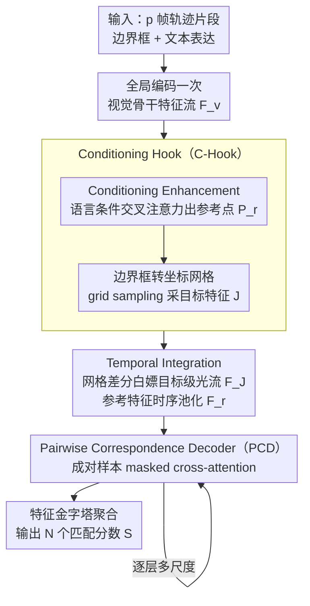

# FlexHook: Rethinking Two-Stage Referring-by-Tracking in RMOT

**会议**: CVPR 2026  
**arXiv**: [2503.07516](https://arxiv.org/abs/2503.07516)  
**代码**: [GitHub](https://github.com/buptLwz/FlexHook)  
**领域**: 视频理解  
**关键词**: 指代多目标跟踪, 两阶段RBT, 采样式特征构建, 成对对应解码, 语言条件增强

## 一句话总结
提出 FlexHook，一种新颖的两阶段 Referring-by-Tracking 框架，通过基于采样的 Conditioning Hook（C-Hook）重新定义特征构建，并用 Pairwise Correspondence Decoder（PCD）替换 CLIP 余弦相似度匹配，首次使两阶段方法全面超越当前 SOTA 的一阶段方法。

## 研究背景与动机
Referring Multi-Object Tracking（RMOT）旨在根据自然语言表达在视频中跟踪多个目标。现有方法分为三种范式：

**Tracking-by-Referring（TBR）**：用 GroundingDINO 定位检测框再关联轨迹，依赖大规模 VLM

**一阶段 RBT**：基于 MOTR 解码轨迹查询并计算匹配分数，需端到端联合优化

**两阶段 RBT**：由 iKUN 提出，完全解耦跟踪与指代过程，训练成本低、支持增量部署

**核心矛盾**：两阶段 RBT 虽然在训练效率和增量部署方面有不可替代的优势，但性能远落后于一阶段方法（iKUN 在 Refer-KITTI-v2 上仅 10.32 HOTA）。作者识别出两个根本限制：

- **过度启发式的特征构建**：现有方法用共享编码器对完整图像和裁剪 patch 做双重编码，忽略了现代视觉骨干已具备的空间梯度流和上下文聚合能力；且特征构建与语言无关，无法根据不同语义（位置、方向等）自适应聚焦
- **脆弱的对应建模**：依赖 CLIP 预训练对齐空间中的余弦相似度，一旦引入额外模块或替换骨干，对齐就会崩溃，相当于对性能设了上限

## 方法详解

### 整体框架
FlexHook 像编程中的 hook 函数一样，在原有视觉骨干的前向流程中"挂钩"提取特征，不增加额外编码阶段。对于 $p$ 帧轨迹片段 $\mathcal{B}^i_{t:t+p}$，只需全局编码一次图像，然后在骨干各层重复执行 C-Hook 采样 → 时序整合 → PCD 解码的工作流，通过特征金字塔聚合多尺度结果，最终输出 $\hat{N}$ 个匹配分数。

### 关键设计

**1. Conditioning Hook（C-Hook）：让目标特征直接从骨干特征流里"采"出来，而不是另起炉灶重编码**

针对的痛点是 iKUN 那套做法——把完整图像和裁剪 patch 各编码一遍，既重复又把骨干本身已有的空间梯度流和上下文聚合能力丢掉了，而且整个特征构建和语言无关。C-Hook 借编程里 hook 的思路在骨干前向流程中"挂钩"取特征：把边界框 $B^i_t = \langle x_0, y_0, w_b, h_b \rangle$ 转成坐标网格 $P^i_t \in \mathbb{R}^{h \times w \times 2}$，再用可微的 grid sampling（双线性插值）从特征图 $F_v$ 上直接采出目标特征 $J$。全图只编码一次，目标特征是"采"来的而非"重编"来的，骨干预训练的梯度流被原封不动保留。

为了让训练（用 GT 轨迹）和推理（用 tracker 输出）的分布对得上，采样网格上叠了三种增强：随机截断轨迹模拟目标丢失、注入高斯噪声模拟定位不准、批内重组网格序列模拟 ID 切换——把 GT 与 tracker 之间的分布鸿沟在训练阶段就抹平。

另一半是 Conditioning Enhancement，让采样能"听懂"表达说的是什么。用可学习查询 $Q_{LR} \in \mathbb{R}^{\hat{N} \times M \times C}$ 与文本特征 $F_l$ 做交叉注意力，经 MLP + sigmoid 得到归一化的二维参考点 $P_r$，沿时间维重复后和坐标网格一起参与采样。于是"红衣服的人"和"左边的人"会自适应地聚焦到不同区域，而不是对所有表达共用一套与语言无关的特征。

**2. Temporal Integration：用坐标网格自身的差分白嫖出目标级光流**

既然 C-Hook 已经为每帧算好了坐标网格，帧间运动信息其实唾手可得，不必再单训一个光流网络。把相邻帧的网格位移 $\Delta Grid = \text{Cat}(\{P^i_{t+k} - P^i_{t+k-1}\}_{k=1}^p)$ 与多帧目标特征 $J$ 沿通道维拼接，过一个 MLP 压缩，就得到带运动信息的轨迹特征 $F_J \in \mathbb{R}^{h \times w \times C}$；参考特征 $F_r$ 因为本身不含运动，直接时序池化即可。相比额外引入运动估计模块，这一步几乎零成本，纯靠复用已有网格拿到目标级光流。

**3. Pairwise Correspondence Decoder（PCD）：把"算余弦相似度"换成"学一个对应解码器"，挣脱 CLIP 对齐空间的天花板**

老两阶段方法靠 CLIP 预训练对齐空间里的余弦相似度做匹配，一旦换骨干或加模块对齐就崩，等于给性能设了硬上限。PCD 把被动的相似度比较改成主动的对应建模：把 $\hat{N}$ 个采样表达与共享的轨迹片段配成 $\hat{N}$ 个样本对，用可学习查询 $Q \in \mathbb{R}^{\hat{N} \times C}$ 去逐对"问"匹不匹配。做法是把展平的轨迹特征 $F_J$、参考特征 $F_r$、语言特征 $F_l$ 沿第一维拼成 Key/Value，$Q$ 作 Query 做 masked cross-attention；注意力掩码 $A$ 让所有查询共享同一份轨迹特征、但各自只能访问自己那一对的语言和参考特征，于是一次前向就并行输出所有对的结果，还隐式带上了跨对对比。解码后经 FFN 分两路：一路 MLP 出匹配分数 $S \in \mathbb{R}^{\hat{N} \times 2}$，另一路喂给下层 PCD 做多尺度解码。因为匹配是"学"出来的，它不再绑定任何特定的预训练对齐空间——消融里它在 CLIP 对齐空间也照样超过余弦相似度。

### 损失函数 / 训练策略
- **Focal Loss**：对所有层平均输出 $\bar{S}$ 监督，增强多尺度能力并缓解样本不平衡
- **参考点边界惩罚 $\mathcal{L}_r$**：防止学习到的参考点坐标坍缩到归一化空间 $[-1,1]^2$ 的边界。定义最小边界距离 $d_{uv} = \min(1-|u|, 1-|v|)$，用 softplus 惩罚：$\mathcal{L}_r = \frac{1}{|P_r|}\sum_{u,v}\text{softplus}(\alpha(\delta - d_{uv}))$
- 最终损失：$\mathcal{L} = \mathcal{L}_{\text{Focal}}(\bar{S}, S_{\text{gt}}) + \lambda \mathcal{L}_r$
- 训练设置：输入分辨率 $224 \times 672$（远小于 iKUN 的双编码），AdamW 优化器 lr=3e-5，20 epochs，2×RTX 4090

## 实验关键数据

### 主实验

| 数据集 | 指标 | FlexHook-best | 之前SOTA | 提升 |
|--------|------|---------------|----------|------|
| Refer-KITTI | HOTA | 53.83 | 52.41 (HFF-Tracker) | +1.42 |
| Refer-KITTI-V2 | HOTA | 42.53 | 36.18 (HFF-Tracker) | +6.35 |
| Refer-Dance | HOTA | 32.17 | 29.06 (iKUN) | +3.11 |
| LaMOT | HOTA | 56.77 | 48.45 (LaMOTer) | +8.32 |

FlexHook 是首个两阶段方法在所有基准上全面超越一阶段 SOTA。

### 消融实验

| 配置 | HOTA | DetA | AssA | 说明 |
|------|------|------|------|------|
| iKUN 原始 | 10.32 | 2.17 | 49.77 | 两阶段基线 |
| +C-Hook | 34.49 | 22.51 | 52.97 | 采样特征构建大幅提升 |
| +C-Hook+PCD | 38.62 | 27.92 | 53.58 | 成对解码替代余弦相似度 |
| +C-Hook+PCD+TI | 39.19 | 28.47 | 54.11 | 光流时序整合 |

### 关键发现
- C-Hook 带来最大提升（HOTA +24.17），说明采样式特征构建是关键创新
- PCD 不仅在非对齐空间有效，在 CLIP 对齐空间也能超越余弦相似度
- Conditioning Enhancement 的参考点数量 $M=10$ 为经验最优，各骨干下一致有效
- 冻结编码器仅导致轻微性能下降（40.86 vs 42.53），可换取训练效率
- 整体推理速度最快（51.47 min），得益于去除冗余编码和 PCD 并行处理

## 亮点与洞察
1. **"Hook"哲学**：不修改骨干，只在前向流程中"挂钩"采样，保留预训练能力，任何视觉/文本编码器可即插即用
2. **打破 CLIP 依赖**：PCD 将被动相似度比较转为主动对应建模，使框架不再受限于特定预训练对齐空间
3. **Neighboring Grid Sampling 的训练-推理一致性设计**：通过噪声注入模拟 tracker 输出不确定性，优雅地弥合 GT/tracker 分布差异
4. **两阶段范式的复兴**：以极低训练成本（1.91h）超越需 51.68h 的一阶段方法

## 局限与展望
- 依赖外部检测器-跟踪器的质量，弱检测器会影响上限
- 当前在自动驾驶场景（Refer-KITTI）的表达类型有限（主要是 car/pedestrian），更复杂的表达场景（如室内、复杂运动描述）尚需验证
- 参考点坍缩问题需要额外正则化，暗示学习过程中的优化不稳定性

## 相关工作与启发
- 与 iKUN（CVPR'24）同为两阶段 RBT，但彻底重新设计特征构建和对应建模
- C-Hook 的 grid sampling 思路与可变形注意力（Deformable DETR）有异曲同工之妙
- PCD 的 masked cross-attention 设计与 DETR 系列的 query-based 解码一脉相承
- 对需要轻量增量部署场景（如车端已有成熟 tracker）非常实用

## 评分
- 新颖性: ⭐⭐⭐⭐ 两个核心模块设计独特，hook 哲学优雅
- 实验充分度: ⭐⭐⭐⭐ 4个数据集、多种编码器组合、详尽消融
- 写作质量: ⭐⭐⭐⭐ 问题分析清晰，图示丰富易懂
- 价值: ⭐⭐⭐⭐ 复兴两阶段范式，对工业部署有实际意义
- 价值: 待评

<!-- RELATED:START -->

## 相关论文

- [\[CVPR 2026\] Rethinking Occlusion Modeling for UAV Tracking](rethinking_occlusion_modeling_for_uav_tracking.md)
- [\[CVPR 2026\] Towards Streaming Referring Video Segmentation via Large Language Model](towards_streaming_referring_video_segmentation_via_large_language_model.md)
- [\[CVPR 2026\] InterRVOS: Interaction-Aware Referring Video Object Segmentation](interrvos_interaction-aware_referring_video_object_segmentation.md)
- [\[CVPR 2026\] Asynchronous Temporal Modeling with Two-Agent Framework for Streaming Dense Video Captioning](asynchronous_temporal_modeling_with_two-agent_framework_for_streaming_dense_vide.md)
- [\[CVPR 2026\] From Contrast to Consistency: Rethinking Event-based Continuous-Time Optical Flow Estimation](from_contrast_to_consistency_rethinking_event-based_continuous-time_optical_flow.md)

<!-- RELATED:END -->
