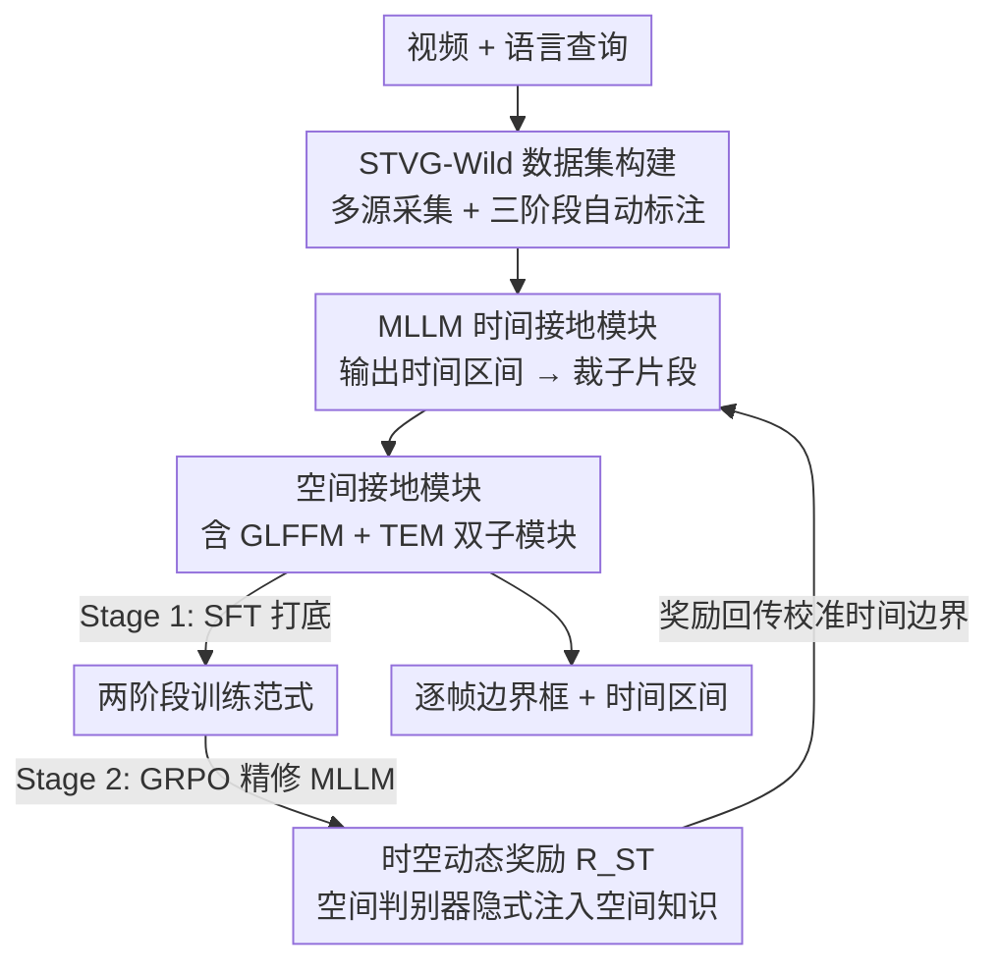

# SARL-STG: A Spatially Aware Reinforcement Learning Framework for Refining MLLMs in Spatio-Temporal Video Grounding

**会议**: CVPR 2026  
**论文**: [CVF Open Access](https://openaccess.thecvf.com/content/CVPR2026/html/Gao_SARL-STG_A_Spatially_Aware_Reinforcement_Learning_Framework_for_Refining_MLLMs_CVPR_2026_paper.html)  
**代码**: 待确认  
**领域**: 视频理解 / 时空视频接地 / 多模态VLM / 强化学习  
**关键词**: 时空视频接地, MLLM, 可验证奖励强化学习(RLVR), GRPO, 空间判别器

## 一句话总结
SARL-STG 把一个预训练 MLLM（管时间定位）和一个开集检测器（管空间定位）串成统一框架，再用「先 SFT 打底、后 GRPO 精修」两阶段训练，并设计了一个让空间接地质量反过来当奖励信号去校准时间边界的动态时空奖励，从而第一次把强化学习引入时空视频接地（STVG）并在 HCSTVG、VidSTG、Charades 等多个基准上刷到 SOTA。

## 研究背景与动机

**领域现状**：时空视频接地（Spatio-Temporal Video Grounding, STVG）要求模型根据一句自然语言查询，同时定位目标物体的**时间区间**（哪几帧出现）和**空间区域**（每帧的边界框）。现有做法分两类：单阶段模型联合预测时空管（tube），但严重依赖数据集特化微调、泛化差；两阶段模型把时间和空间解耦，但在多阶段推理中会**误差累积**。近期有人用 MLLM 捕捉复杂语义关联，可一旦做大规模监督微调（SFT），又会损伤大模型本身的语义理解和开放世界泛化，精度反而不如小而专的任务模型。

**现有痛点**：STVG 的查询比传统视频时间接地（VTG）的查询语义复杂得多——它不只描述「交互行为」，还含目标属性、环境上下文、空间关系等丰富的细粒度空间语义（论文 Fig.1 对比）。而空间接地又**强依赖**准确的时间接地：时间边界一旦偏一点，错误就不可逆地传播到空间预测上，导致精度崩盘。

**核心矛盾**：现有方法缺少时间预测与空间预测之间的**迭代相互修正**。时间模块按 VTG 范式训练，根本没学会捕捉 STVG 所需的空间线索；而把两阶段简单拼起来又只能单向传递误差，没有让「空间定位好不好」反过来去纠正「时间定位准不准」的回路。

**本文目标**：(1) 设计一个统一架构，让擅长语义推理的 MLLM 和擅长细粒度定位的检测器各司其职；(2) 找到一种训练范式，既能提升 STVG 精度又不牺牲大模型的泛化；(3) 解决时间-空间耦合优化里「奖励怎么设计」这个空白。

**切入角度**：受可验证奖励强化学习（RLVR）在推理/接地任务上成功的启发，作者把空间接地模块当成一个对时空错位敏感的「判别器」——如果给它的子片段在时间上偏了，目标的动作/空间状态就和查询对不上，它的检测精度会明显掉。于是空间接地的好坏天然就是一个能反映时间对齐质量的信号。

**核心 idea**：用「空间接地质量」当隐式奖励去强化学习地精修 MLLM 的时间预测——即把细粒度空间线索注入时间推理，并用一个随时间精度动态调权的奖励，引导优化从「粗时间」平滑过渡到「细时空」。

## 方法详解

### 整体框架
SARL-STG 围绕三块展开：大规模数据集构建（STVG-Wild）、多模块联合接地框架、时空知识引导的两阶段训练范式。

推理时是一条渐进式串行管线：完整视频片段 + 查询，经一个 prompt 模板送入 **MLLM 时间接地模块**，由 MLLM 解码器基于全局上下文语义输出时间区间；用这个区间把原视频裁成子片段，送入 **开集空间接地模块**（GroundingDINO），它结合「查询文本特征 + 子片段视觉特征 + 来自 MLLM 的全局视频特征」为子片段每一帧预测 $N$ 个候选（每个含二分类概率 + 边界框），训练时用匈牙利匹配选匹配代价最低的序列为正样本、其余为负，推理时取平均分类分最高的序列为输出。

为强化空间模块的全局语义感知和跨帧一致性，框架在空间模块里嵌了两个子模块：**全局-局部特征融合模块（GLFFM）** 和 **时间增强模块（TEM）**。训练上则是两阶段：Stage 1 用任务对齐损失做大规模 SFT 给所有模块打底；Stage 2 用 GRPO 在高质量子集上，由**时空动态奖励**驱动只精修 MLLM 里的 LLM 部分。整条链路的关键创新点按数据流自上而下排成下图。

### 关键设计

**1. MLLM × 开集检测器的统一时空接地框架：让语义推理和细粒度定位各管一段**

针对「单/两阶段模型泛化差、纯 MLLM 做 SFT 又掉精度」的痛点，作者不让一个模型硬扛全部，而是把任务拆给两个互补的预训练专家：用 Qwen2.5-VL-7B 当**时间接地模块**，靠它的开放世界语义理解从全局上下文里读出「事件发生在哪段时间」；用 GroundingDINO 当**空间接地模块**，靠它的细粒度定位能力在裁出的子片段里逐帧框出目标。两者通过专门的时空交互串接：MLLM 先出时间区间裁片段，空间模块再在片段上定位，且空间模块同时吃 MLLM 的全局视频特征（Vision Embedding），使局部框预测能对齐全局语义。这样既保住了大模型的泛化、又拿到了检测器的定位精度，避免了「一个模型既要又要」的折中。

为加强空间模块的全局感知与跨帧一致性，模块内部再嵌两个子模块。**GLFFM（全局-局部特征融合）** 用交叉注意力让子片段特征作为 query 去 attend MLLM 经 vision projector 压缩后的全局视频嵌入 $E_v$，让局部信息学到相对全局上下文的判别力；同时引入 FPN 在金字塔每一层做跨层交互，拿到多尺度的位置感知特征。**TEM（时间增强）** 用双重自注意力建模时序依赖：先把空间解码器输出的多维特征 $[B,T,N,L]$ reshape 成 $[B\times N, T, L]$，沿时间维 $T$ 做自注意力，让每个 query 聚合整段序列信息、保证跨帧轨迹连贯；再 reshape 后沿 query 维 $N$ 做第二次自注意力，学习同一时刻不同 query 之间的交互与竞争，强化空间协同和目标 query 的判别力。

**2. 两阶段训练范式：先 SFT 建底座，再 GRPO 精修而不毁泛化**

针对「MLLM 一旦大规模 SFT 就损伤语义/泛化」的矛盾，作者把训练拆成职责清晰的两段。**Stage 1（基础能力构建）** 在全量 STVG-Wild 上做监督微调，用联合目标 $L=\lambda_{ce}L_{ce}+\lambda_{box}(L_{L1}+L_{GIoU})+\lambda_{cls}L_{cls}$（$L_{ce}$ 交叉熵监督 MLLM 文本输出即时间，$L_{box}$ 用 L1+GIoU 提升正样本框精度，$L_{cls}$ 用 Focal Loss 监督前/背景分类）；为保住预训练泛化，对预训练模块用 LoRA 高效微调、对新引入模块全量微调；此阶段空间模块输入用「带扰动偏移的 GT 帧」以提升稳定性。**Stage 2（时空知识注入）** 只用 10K 高质量子集，冻结除 MLLM 内 LLM 之外的所有模块，用 GRPO 在新奖励下做策略梯度更新。

之所以这么切，是因为底座能力（时空对齐）适合用大数据 SFT 一次性灌进去，而最后那点「细粒度时空语义对齐」靠监督信号很难抠出来——它需要的是「试错 + 反馈」的强化范式。Stage 2 因此专注于把空间线索注入时间推理这个 STVG 的真正瓶颈，并在精修时刻意只动 LLM、冻住其它部分，从而在提升精度的同时守住 SFT 阶段学到的泛化。消融显示，相比 Stage 1 联合 SFT，完整两阶段模型在 m tIoU 上最多提升 5.6。

**3. 空间知识注入的隐式奖励：把空间接地模块当「空间判别器」反过来校准时间**

这是全文最核心的创新。常规 RL 方案只盯时间接地、用不上时空联合反馈，作者反其道而行：把 Stage 1 训好的**空间接地模块直接当成一个空间判别器**。关键观察是——这个判别器对输入子片段的时空一致性高度敏感：一旦时间模块给的片段偏离 GT，目标的动作/空间状态就和查询语义对不上，它的框精度会急剧下降（消融 Tab.6：随机偏移 20%/40% 时 sIoU 从 72.1 一路掉到 70.3、66.4）。于是「空间定位准不准」就成了「时间对齐好不好」的隐式信号。

RL 阶段不用人显式标注奖励，而是让判别器评估预测子片段里是否包含正确的空间目标，产出与每帧边界框精度、空间清晰度成正比的时空奖励 $R_{TS}$，再隐式回传给 MLLM——模型由此一边精修时间预测、一边学会感知细粒度空间线索。总奖励为 $R_{Total}=\lambda_{ST}R_{ST}+\lambda_F R_F+\lambda_{Th}R_{Th}$，其中 $R_{ST}$ 是核心时空动态奖励，$R_F$（格式奖励）强制输出结构、$R_{Th}$（思考奖励）鼓励结构化推理以提升可解释性。这把 STVG 里一直缺位的「时空一致性 RL 反馈机制」补上了。

**4. 时空动态加权奖励：用时间精度当调制因子，从粗时间平滑过渡到细时空**

针对「时间和空间该先优化谁、怎么平滑切换」的耦合难题，作者设计了动态加权的时空联合奖励：

$$R_{st}=R_{tIoU}+(tIoU)^{\alpha}\cdot R_{sIoU}$$

$R_{tIoU}$ 直接来自预测与 GT 时间区间的时间交并比（tIoU），$R_{sIoU}$ 是预测与 GT 边界框在「时间重叠区域内」的平均空间交并比（sIoU），而 tIoU 本身又被拿来当**动态调制因子**。其妙处在于自适应引导：当时间接地很差（tIoU 低）时，$(tIoU)^{\alpha}$ 很小，奖励被 $R_{tIoU}$ 主导，逼 RL agent 先把粗时间边界收敛；当 tIoU 上来后，$(tIoU)^{\alpha}$ 显著放大，优化重心转向 $R_{sIoU}$，鼓励模型在时间已基本对齐后再去抠每帧空间细节的语义对齐。超参 $\alpha$（实验取 2）控制过渡陡峭程度。这样一条曲线就把「先时间后空间」的课程式优化内生地编码进奖励里，而不是靠硬切换阶段，消融中它相比固定权重的时空奖励仍带来稳定增益（HCSTVG 上 63.8 → 64.2）。

### 损失函数 / 训练策略
- **Stage 1（SFT）**：联合损失 $L=\lambda_{ce}L_{ce}+\lambda_{box}(L_{L1}+L_{GIoU})+\lambda_{cls}L_{cls}$，权重 $(\lambda_{ce},\lambda_{box},\lambda_{cls})=(5,2,1)$；LoRA rank $r=32$，batch 32，AdamW lr=1e-4，8×H800 训 11 小时；空间模块用 GroundingDINO 风格的匈牙利匹配选正样本。
- **Stage 2（GRPO）**：总奖励权重 $(\lambda_{ST},\lambda_F,\lambda_{Th})=(2,0.6,0.4)$，动态系数 $\alpha=2$；batch 8，AdamW lr=1e-6，cosine 调度（warm-up 0.05）；每样本采 8 个 response 做组内优势估计，8×H800 训 72 小时；空间模块最大输出子片段帧数 64，视频 2 FPS 采样。

## 实验关键数据

主干模型 Qwen2.5VL-7B + GroundingDINO-B（Swin-B 视觉 / BERT 文本），所有结果均**不做数据集特化微调**，用 m_tIoU、m_sIoU、m_vIoU 三个标准指标评测。

### 主实验

STVG 主基准对比（%），baseline 为直接拼接的 Qwen2.5VL+GD：

| 数据集 | 指标 | 本文 | 之前SOTA(TA-STVG) | baseline(Qwen+GD) |
|--------|------|------|----------|------|
| HCSTVG V2 | m_tIoU | **64.2** | 60.4 | 46.7 |
| HCSTVG V2 | m_vIoU | **42.5** | 40.2 | 18.0 |
| HCSTVG V2 | vIoU@0.5 | **42.1** | 36.7 | 8.1 |
| VidSTG 陈述句 | m_tIoU | **52.3** | 51.7 | 35.5 |
| VidSTG 陈述句 | m_vIoU | **35.5** | 34.4 | 15.9 |
| VidSTG 疑问句 | m_tIoU | **50.4** | 50.2 | 28.5 |
| VidSTG 疑问句 | m_vIoU | **29.9** | 29.5 | 6.6 |

在 HCSTVG 上比前 SOTA TA-STVG 高出 m_tIoU 3.8、m_vIoU 2.3，且全面超过任务专用模型与其它 MLLM 方法。零样本泛化（ST-Align 基准）：SARL-STG 取 m_tIoU 49.5 / m_sIoU 40.4 / m_vIoU 26.6，显著高于 LLaVA-ST（43.8 / 22.8 / 13.5）和零样本的 CG-STVG、TA-STVG。子任务上：Charades-STA（域内）m_tIoU 61.3 / R@0.5 73.6 刷新 SOTA，ActivityNet（零样本）m_tIoU 36.0 与 SOTA 持平；REC 任务（静态图，OOD 零样本）在 RefCOCO/+/g 上超过 GroundingDINO 并逼近 SOTA。

### 消融实验

两阶段训练范式逐步加码（m_tIoU）：

| 配置 | VidSTG | HCSTVG | Charades |
|------|--------|--------|---------|
| Stage1 SFT（仅时间） | 47.7 | 62.5 | 59.1 |
| Stage1 SFT（时空联合） | 50.5 | 58.6 | 60.8 |
| Stage2 仅时间奖励 | 51.3 | 62.3 | 60.6 |
| Stage2 时空奖励 | 51.5 | 63.8 | 61.1 |
| Stage2 时空**动态**奖励(Full) | **52.3** | **64.2** | **61.3** |

空间模块组件 + 判别器敏感性（HCSTVG, m_sIoU）：

| 配置 | GLFFM | TEM | m_sIoU |
|------|-------|-----|--------|
| GroundingDINO + GT 输入 | × | × | 65.6 |
| GroundingDINO + GT 输入 | ✓ | × | 68.9 |
| GroundingDINO + GT 输入 | × | ✓ | 71.0 |
| GroundingDINO + GT 输入 | ✓ | ✓ | 72.1 |
| GroundingDINO + 随机偏移 20% | ✓ | ✓ | 70.3 |
| GroundingDINO + 随机偏移 40% | ✓ | ✓ | 66.4 |

### 关键发现
- **两阶段范式贡献最大**：相比 Stage 1 时空联合 SFT，完整模型在 m_tIoU 上最多 +5.6；时空奖励优于纯时间奖励，动态加权又比固定权重更好（HCSTVG 63.8→64.2），印证「先时间后空间」的课程式调权有效。
- **空间判别器确实对时空错位敏感**：把输入片段随机偏移 20%/40% 后，m_sIoU 从 72.1 一路掉到 70.3、66.4——这正是把它当 RL 奖励判别器的合理性来源（偏得越多越罚得越狠）。
- **两个子模块各有贡献**：单加 TEM 把 m_sIoU 从 65.6 提到 71.0（时序一致性收益更大），再加 GLFFM 到 72.1，组合后相比 baseline 提升约 6.5。
- **数据多样性带 OOD 泛化**：训练数据从「仅 STVG」扩到「STVG+TVG」再到全量 STVG-Wild，ActivityNet/ST-Align 等 OOD 数据集上 m_tIoU 最多 +7.5。

## 亮点与洞察
- **「让裁判反过来当教练」的隐式奖励设计**：把训练好的空间接地模块当成对时空错位敏感的判别器，用它的检测精度反推时间对齐质量——不需要为时间边界单独设计可验证奖励，巧妙绕开了「STVG 时间敏感奖励难设计」这个老大难。这个「下游模块质量当上游优化信号」的思路可迁移到任何「A 的好坏依赖 B 是否准」的级联任务（如检索-重排、定位-识别）。
- **tIoU 自调制的课程式奖励**：用一个量自己的当前精度去给另一个量的奖励调权，天然实现「先把粗的做对、再抠细的」，比手工切换训练阶段更平滑，是处理多目标耦合优化的一个轻量可复用 trick。
- **架构层面拒绝「一个大模型硬扛」**：明确把语义推理（MLLM）和细粒度定位（开集检测器）解耦给两个预训练专家，再用全局特征融合把两边粘起来——既吃到泛化又吃到精度，这种「专家分工 + 全局对齐」的范式对很多多模态定位任务有借鉴意义。

## 局限与展望
- **推理链路串行、误差仍可能单向传播**：虽然 RL 阶段让空间反馈去校准时间，但**推理时**仍是「MLLM 出时间 → 裁片段 → 检测器出空间」的串行结构，一旦时间区间在推理期偏差较大，空间模块依旧吃偏后的片段（消融已显示偏移 40% 时 sIoU 掉到 66.4），缺少推理期的闭环纠错。
- **训练成本高**：Stage 2 GRPO 每样本采 8 response、8×H800 跑 72 小时，复现门槛不低。
- **依赖大模型与外部标注工具链**：STVG-Wild 的构建重度依赖 Gemini2.5、Wan2.1、ChatRex、DAM4SAM 等多个外部模型做自动标注，标注质量与可复现性受这些工具影响（⚠️ 数据集细节以原文为准）。
- **改进方向**：可探索推理期的时间-空间迭代回环（而非只在训练期），或让空间判别器的奖励更显式地反映「错在时间还是错在空间」以提升信用分配精度。

## 相关工作与启发
- **vs TubeDETR / CG-STVG / TA-STVG（任务专用单/两阶段模型）**：它们靠特化标注与上下文线索做接地，精度高但泛化弱、需逐数据集微调；SARL-STG 用同一套模型不做特化微调就全面超过它们（HCSTVG m_tIoU +3.8），优势在开放世界泛化与免微调，代价是训练更重。
- **vs RealVG（training-free MLLM 框架）**：RealVG 完全免训练、靠时空解耦 + token 过滤换鲁棒性，但牺牲精度；SARL-STG 选择「轻量 RL 精修」路线，用 10K 数据的 GRPO 把精度补回来，是 training-free 与 full-SFT 之间的折中。
- **vs VideoChat-R1 / Time-R1（MLLM + RL 做接地）**：它们用 RL 提升时空感知/时间接地，但奖励主要盯时间维；SARL-STG 的核心差异是把**空间接地质量注入奖励**，并用 tIoU 动态调权实现时空协同优化——消融里「仅时间奖励 < 时空奖励 < 时空动态奖励」直接量化了这一差异的价值。
- **vs SpaceVLLM / LLaVA-ST（SFT 范式的时空 MLLM）**：它们靠空间解码器或细粒度数据集 + 渐进训练做联合建模，但纯 SFT 会削弱大模型语义；SARL-STG 用 LoRA + 两阶段（SFT 打底、RL 只动 LLM）刻意守住泛化。

## 评分
- 新颖性: ⭐⭐⭐⭐⭐ 首个 STVG 的 RL 框架，「空间模块当判别器隐式给奖励 + tIoU 动态调权」的设计确实新且自洽。
- 实验充分度: ⭐⭐⭐⭐⭐ 覆盖 STVG/VTG/REC 三类任务、含域内与多个 OOD 零样本，消融把每个组件和数据贡献都拆清楚了。
- 写作质量: ⭐⭐⭐⭐ 逻辑链清晰、动机推导扎实，部分子模块（GLFFM/TEM）细节略密但可读。
- 价值: ⭐⭐⭐⭐⭐ 给「级联式时空接地」提供了可复用的 RL 信用分配范式，并开源级别地构建了 220K 的 STVG-Wild 数据集。

<!-- RELATED:START -->

## 相关论文

- [\[CVPR 2026\] Learning to Refuse: Refusal-Aware Reinforcement Fine-Tuning for Hard-Irrelevant Queries in Video Temporal Grounding](learning_to_refuse_refusal-aware_reinforcement_fine-tuning_for_hard-irrelevant_q.md)
- [\[CVPR 2026\] Efficient Frame Selection for Long Video Understanding via Reinforcement Learning](efficient_frame_selection_for_long_video_understanding_via_reinforcement_learnin.md)
- [\[CVPR 2026\] VideoChat-M1: Collaborative Policy Planning for Video Understanding via Multi-Agent Reinforcement Learning](videochatm1_collaborative_policy_planning_for_vide.md)
- [\[CVPR 2026\] CVA: Context-aware Video-text Alignment for Video Temporal Grounding](cva_context-aware_video-text_alignment_for_video_temporal_grounding.md)
- [\[CVPR 2026\] OmniGround: A Comprehensive Spatio-Temporal Grounding Benchmark for Real-World Complex Scenarios](omniground_a_comprehensive_spatio-temporal_grounding_benchmark_for_real-world_co.md)

<!-- RELATED:END -->
