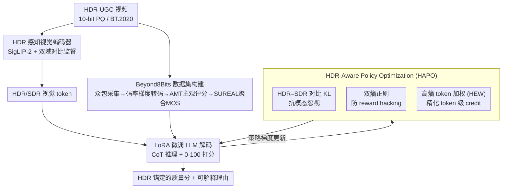

# Seeing Beyond 8bits: Subjective and Objective Quality Assessment of HDR-UGC Videos

**会议**: CVPR 2026  
**论文**: [CVF Open Access](https://openaccess.thecvf.com/content/CVPR2026/html/Saini_Seeing_Beyond_8bits_Subjective_and_Objective_Quality_Assessment_of_HDR-UGC_CVPR_2026_paper.html)  
**代码**: [项目页](https://shreshthsaini.github.io/Beynod8Bits)（仅项目页，未见代码仓）  
**领域**: 视频理解 / 视频质量评估  
**关键词**: HDR-UGC、视频质量评估(VQA)、多模态大模型、强化学习微调、GRPO

## 一句话总结
为快速增长但被现有 SDR 质量评估模型忽视的 HDR 用户生成视频（HDR-UGC），作者构建了迄今最大的众包主观质量数据集 Beyond8Bits（约 4.4 万段视频、150 万+人工评分），并提出首个面向 HDR-UGC 的多模态大模型质量评估器 HDR-Q——靠一个"HDR 感知视觉编码器"和一套强化学习微调框架 HAPO（在 GRPO 上加 HDR–SDR 对比 KL、双熵正则与高熵 token 加权），把推理牢牢锚在 HDR 线索上，在三个数据集上把 PLCC/SRCC 推到 0.91/0.92 的 SOTA。

## 研究背景与动机
**领域现状**：HDR 视频凭借更高位深、更宽色域和更大亮度范围正在 YouTube/TikTok/Instagram 等平台普及，但绝大多数感知视频质量评估（VQA）系统仍是为 SDR（标准动态范围）设计的。

**现有痛点**：HDR 的高位深会暴露出 SDR 下不明显的失真——近黑压缩（near-black crushing）、高光裁剪（highlight clipping）、色带（banding）、曝光闪烁（exposure flicker），叠加 UGC 本身的拍摄/压缩瑕疵后更加严重。在专业 HDR 数据或 SDR-UGC 上训练的模型，迁移到真实世界异构拍摄条件的 HDR-UGC 时纷纷失效；而现有 HDR 主观数据集规模小、偏合成失真或专业内容（如 LIVE-HDR 仅 310 段、SFV+HDR 仅 300 段有评分），缺乏大规模真实标注。

**核心矛盾**：一方面没有足够大、足够真实的 HDR-UGC 主观数据来训练对齐人眼的模型；另一方面，即便想用近期强大的多模态大模型（MLLM）来做可解释的质量评估，也有三道坎：① 标准视觉编码器都在 SDR 上预训练，抓不到 HDR 特有线索；② 下一 token 预测范式下很难输出精细校准的连续 MOS（离散打分/回归头都不够细）；③ 缺乏显式激励时，策略会忽视 HDR 视觉输入、只靠文本先验作答——即"模态忽视（modality neglect）"。

**本文目标**：先补上数据（建一个真实大规模 HDR-UGC 主观库），再造一个能真正"看 HDR"的 MLLM 质量评估器。

**切入角度**：把 HDR 感知能力拆成两件事——表征层让编码器对亮度极值和色域保真度敏感；推理层用强化学习强行让策略依赖 HDR token 而非文本捷径。

**核心 idea**：用"HDR 感知视觉编码器 + HDR 锚定的 RL 微调（HAPO）"代替"通用 SDR 编码器 + 朴素 GRPO"，从表征和优化两端同时逼模型把质量判断建立在 HDR 证据上。

## 方法详解

### 整体框架
HDR-Q 是建在 Ovis2.5 上的多模态大模型质量评估器，整条链路分两条互补路径：**感知路径**用一个经 HDR 适配的视觉编码器，把 10-bit PQ 的 HDR 帧（以及确定性色调映射得到的 SDR 对照帧）编码成 HDR 敏感的视觉 token；**推理路径**用 LoRA 微调的语言解码器，基于这些 token 生成一段链式思考并吐出 0–100 的质量分。训练的灵魂是 HAPO（HDR-Aware Policy Optimization）——在 GRPO 强化学习框架上加三个 HDR 专属机制，逼模型"必须看 HDR 才答得对"，再配高斯回归奖励做细粒度 MOS 校准。整个数据基座则是 Beyond8Bits 主观库。注意：SDR 路径只在训练时多走一次前向用于对比，推理时只解码 HDR 单路，不增加部署开销。

### 关键设计

**1. Beyond8Bits：首个大规模真实 HDR-UGC 众包主观库**

现有 HDR 数据要么太小、要么是合成失真/专业内容，模型学不到真实 UGC 的异构退化。作者从两路凑齐 6,861 段独特 HDR 源视频：一路是用户用 iPhone/Pixel/Galaxy 等消费设备在知情同意下拍的 2,253 段，一路是 Vimeo 上 CC 协议的 4,608 段，覆盖人物、自然、夜景等场景与跨设备差异。每段都校验 HDR 元数据（PQ 传函、10-bit HEVC、BT.2020 色域），裁到最长 10 秒，并按模拟真实流媒体的码率梯度（1080p–360p、0.2–5 Mbps）转码，全程保留 HDR 信令，最终得到约 44,276 段视频。主观研究在 Amazon Mechanical Turk 上做，**只允许通过 HDR 显示能力验证的设备/浏览器参与**，按 ITU-R BT.500-14 用 0–100 连续 likert 量表打分，靠隐藏的重复视频和"金标准"视频做一致性筛查，最终回收超 150 万有效评分、每段平均约 35 个独立评分。聚合 MOS 用 SUREAL 方法，它对单个评分者 $S_{ij}=\psi_j+\Delta_i+\nu_i X,\; X\sim\mathcal{N}(0,1)$ 建模、显式分离评分者偏置 $\Delta_i$ 与不一致性 $\nu_i$，再用极大似然估出真值 $\psi_j$，得到的 MOS 评分者间中位 SRCC 达 0.90，证明研究可靠。这套数据是后续模型能学到真实 HDR 感知现象的前提。

**2. HDR 感知视觉编码器：用双域对比监督避免 HDR/SDR 表征塌缩**

通用视觉编码器都在 SDR 上预训练，喂进 HDR 帧时根本分不出亮度极值和色域差异。作者以 SigLIP-2 为底座 $\mathcal{E}_\psi$，**全精度保留 10-bit HDR 信号、不做色调压缩**，从而保住近黑结构、高光动态与宽色域关系；同时用确定性色调映射算子 $TM(\cdot)$（PQ→γ 映射、量化、收缩到 BT.709）生成 SDR 对照帧 $v_{SDR}$，并用 Qwen2.5-VL-72B 给 HDR 帧生成 caption 做对齐监督。关键难点是：同一句通用 caption 对 HDR 帧和 SDR 帧"都成立"，直接对齐会让两者嵌入塌到一起。为此引入**双域对比监督**——强制 HDR 嵌入比 SDR 嵌入更靠近自己的 caption：

$$\mathcal{L}_{\text{contrast}}=\max\!\Big(0,\;\delta-D\big(\mathcal{E}_\psi(x_t),\mathcal{E}_\psi(c_t)\big)+D\big(\mathcal{E}_\psi(x^{SDR}_t),\mathcal{E}_\psi(c_t)\big)\Big)$$

其中 $D$ 是余弦距离、$\delta$ 是 margin。总编码器损失 $\mathcal{L}_{\text{enc}}=\mathcal{L}_{\text{Sigmoid}}(x_t,c_t)+\lambda_{\text{ctr}}\mathcal{L}_{\text{contrast}}$ 同时维持语义对齐和 HDR 判别力，让嵌入既忠实于内容、又对 HDR 对比与亮度线索敏感。

**3. HDR–SDR 对比 KL：用信息论手段堵死"模态忽视"**

朴素 GRPO 只保证训练稳定，却不保证策略真去看视觉输入——在 HDR-UGC VQA 这种重感知任务里，策略很容易只靠文本先验把话说得很顺却无视 HDR 证据。HAPO 的第一招是对比两条 rollout：一条喂全输入（文本 + SDR + HDR token，记 $\pi_\theta^{HDR}$），一条剥掉 HDR token（文本 + SDR，记 $\pi_\theta^{SDR}$），并**最大化二者的 KL 散度**：

$$\mathcal{K}_{\text{HDR}}(\theta)=D_{\text{KL}}\big(\pi_\theta^{HDR}\,\|\,\pi_\theta^{SDR}\big)$$

直觉是：如果去掉 HDR token 会显著扰动解码分布，说明模型确实在用 HDR 信息而非塌回 SDR 推理。作者还从变分互信息上界证明 $\mathbb{E}[\mathcal{K}_{\text{HDR}}]$ 下界了条件互信息 $I_\theta(o;v,v_{SDR}\mid v_{SDR})$（减去一个失配项 $\kappa_\theta$），因此最大化该项可证明地提升输出对 HDR 输入的依赖。

**4. 双熵正则 + 高熵 token 加权（HEW）：防 reward hacking 并把梯度集中到关键推理步**

单纯最大化对比 KL 有个已知陷阱——"熵膨胀"：策略可以靠输出一堆高度不确定的乱答轻松满足目标。为此 HAPO 对 HDR、SDR 两条路径都加 token 级熵正则 $\mathcal{H}_{\text{dual}}=\mathbb{E}\frac{1}{K}\sum_{i,t}[\eta_1\mathcal{H}(\pi_\theta^{HDR})+\eta_2\mathcal{H}(\pi_\theta^{SDR})]$，在防止塌缩的同时保持尖锐、HDR 锚定的分布。另一方面，GRPO 给一条回答的所有 token 赋同一个归一化优势 $\hat{A}_i$，忽视了 token 间的信息量差异；而在 HDR VQA 里，**高熵 token 往往正是模型要识别/校准 HDR 失真（色带、高光裁剪、近黑压缩）的关键步**。HEW 据此把组归一优势重标定为 token 专属优势：

$$w_{i,t}=\mathrm{clip}\!\Big(1+\lambda_{\text{HEW}}\frac{H_{i,t}}{\frac{1}{|o_i|}\sum_{t'}H_{i,t'}},w_{\min},w_{\max}\Big),\quad \tilde{A}_{i,t}=w_{i,t}\cdot\hat{A}_i$$

其中 $H_{i,t}$ 是每 token 熵。这样把学习信号放大到最有信息量的推理步，换来更强的 HDR 锚定和更准的 MOS。

### 损失函数 / 训练策略
完整 HAPO 目标在 GRPO 的裁剪代理目标上把优势换成 token 加权的 $\tilde{A}_{i,t}$，再叠加三项：减去参考策略 KL $\beta D_{\text{KL}}(\pi_\theta^{HDR}\|\pi_{\text{ref}})$ 保稳定、加上对比 KL $\gamma\mathcal{K}_{\text{HDR}}(\theta)$ 强制 HDR 锚定、减去双熵正则 $\mathcal{H}_{\text{dual}}(\theta)$ 防膨胀。奖励是三路加权 $\mathcal{R}_i=w_{\text{fmt}}R_{\text{fmt}}+w_{\text{sc}}R_{\text{sc}}+w_{\text{self}}R_{\text{self}}$：格式奖励、**高斯加权回归奖励**（$\sigma=3,\alpha=1$，做细粒度 MOS 校准）、组内自一致奖励。训练分两阶段：Stage 1（模态对齐）用短 HAPO 跑对齐 HDR token 与投影层；Stage 2（Full-RFT）在 HDR-UGC 全量语料上跑完整 HAPO。实现上：Ovis2.5 + rank-4 LoRA，每段均匀采 $T=8$ 帧，原生 10-bit PQ 输入不做线性下采，组大小 $K=8$、$\epsilon=0.1$、$\beta=0.02$、$\gamma=0.5$、$\eta_1/\eta_2=0.01/0.05$、$\lambda_{\text{HEW}}=0.3$（$w_{\min}/w_{\max}=0.5/2.0$），AdamW、lr $1\times10^{-5}$、4×H200。

## 实验关键数据

### 主实验
Beyond8Bits 测试集上 HDR-Q 全面超越 SDR/HDR/MLLM 三类基线，RMSE 降幅尤其明显（蓝色加粗为最优）：

| 数据集 | 指标 | HDR-Q(full) | 此前最强基线 | 提升 |
|--------|------|------|----------|------|
| Beyond8Bits | SRCC ↑ | **0.9206** | HIDRO-VQA 0.8508 | +0.070 |
| Beyond8Bits | PLCC ↑ | **0.9118** | HIDRO-VQA 0.8784 | +0.033 |
| Beyond8Bits | RMSE ↓ | **5.1594** | HIDRO-VQA 6.0875 | -0.93 |
| Beyond8Bits | KRCC ↑ | **0.7218** | HIDRO-VQA 0.6694 | +0.052 |

跨数据集零样本迁移（不重训）同样保持高相关、低误差，说明 HDR 感知编码 + HAPO 锚定学到的表征能跨 UGC/PGC HDR 域泛化：

| 数据集 | 指标 | HDR-Q(full) | 此前最强基线 |
|--------|------|------|----------|
| LIVE-HDR | SROCC ↑ | **0.9081** | HIDRO-VQA 0.8793 |
| LIVE-HDR | RMSE ↓ | **7.6031** | HDR-ChipQA 9.8038 |
| SFV+HDR | SROCC ↑ | **0.7251** | FastVQA 0.7130 |
| SFV+HDR | PLCC ↑ | **0.7502** | HIDRO-VQA 0.7320 |

值得注意：纯 base MLLM（Qwen2.5-VL、Ovis2.5 等）SRCC 仅 0.26–0.35，几乎不可用；HDR-Q(SDR)（去掉 HDR 路径的同框架）SRCC 已达 0.8914，加上 HDR 后再涨到 0.9206——印证 HDR 线索的增量价值。

### 消融实验（Beyond8Bits）

| 配置 | PLCC | SRCC | RMSE | CoT 长度 | Token 熵 | 说明 |
|------|------|------|------|---------|---------|------|
| GRPO baseline | 0.79 | 0.81 | 10.73 | 168 | 0.20 | 啥都不加 |
| + HDR-Enc. | 0.81 | 0.83 | 8.96 | 161 | 0.24 | 只加 HDR 编码器 |
| HAPO w/o HDR–SDR KL | 0.84 | 0.86 | 7.10 | 142 | 0.29 | 去对比 KL→模态忽视回潮 |
| HAPO w/o Dual Ent. | 0.89 | 0.91 | 5.82 | 148 | 0.26 | 去双熵→推理冗长不稳 |
| HAPO w/o HEW | 0.87 | 0.88 | 6.11 | 155 | 0.27 | 去 HEW→credit 分配变差 |
| HAPO w/o Self-Reward | 0.90 | 0.92 | 5.22 | 140 | 0.31 | 去自奖励→噪声样本稳定性降 |
| **HDR-Q (Full)** | **0.91** | **0.92** | **5.15** | **137** | **0.33** | 完整模型 |

### 关键发现
- **HDR 编码器和对比 KL 是两大支柱**：去掉 HDR 微调 SRCC 明显下滑（10-bit 线索不可或缺）；去掉 HDR–SDR KL 让 RMSE 从 5.15 反弹到 7.10，证实"模态忽视"会卷土重来。
- **HAPO 让推理更短更准**：随训练推进 CoT 长度从 168 降到 137、token 熵反而升到 0.33，说明模型学会用视觉证据高效作答，而非堆砌套话理由。
- **效率友好**：HAPO 只在训练时多一次 SDR 前向，推理就是单条 HDR 路径解码，吞吐与普通 MLLM 持平。

## 亮点与洞察
- **把"模态忽视"从定性问题变成可优化的目标**：用 HDR–SDR 对比 KL 显式逼模型依赖 HDR token，并给出变分互信息下界把它和"输出对 HDR 输入的依赖"挂钩——这套"对比剥离一路模态 + 信息论证明"的思路可迁移到任何怕模型走文本捷径的多模态 RL 任务。
- **HEW 抓住了感知任务的本质**：识别 HDR 失真的关键决策恰好发生在高熵 token，把梯度按 token 熵加权放大，等于让 RL 把算力花在"真正要动脑"的步骤上，这个观察对其它需要细粒度感知判断的 RLHF 场景都有借鉴意义。
- **全精度保 HDR + SDR 对照**的双域设计很务实：既不丢 10-bit 信息又用 SDR 当负样本制造判别压力，解决了"通用 caption 让 HDR/SDR 嵌入塌缩"这个隐蔽但致命的问题。
- 数据工程同样扎实：只放 HDR 显示设备的工人参与、金标准+重复视频做一致性筛查，把众包噪声压到中位 SRCC 0.90。

## 局限与展望
- **依赖确定性色调映射构造 SDR 对照**：对比监督和对比 KL 都建立在某个固定 $TM(\cdot)$ 上，若色调映射算子选得不好，SDR 对照本身的偏差可能传染到 HDR 锚定信号；论文未充分讨论对 $TM$ 选择的敏感性。
- **每段仅采 8 帧**：曝光闪烁等时域失真本是 HDR-UGC 的痛点之一，但稀疏采帧可能限制对快速时域瑕疵的捕捉，长视频或强运动场景下的鲁棒性有待验证。
- **代码与权重未见公开**（仅项目页），HAPO 多项超参（$\gamma,\eta,\lambda_{\text{HEW}}$）需在验证集上调，复现门槛不低。
- 论文不对 SOTA 数值打分式夸大，但跨数据集（LIVE-HDR/SFV+HDR）任务难度不同，SFV+HDR 上各方法整体相关都偏低，绝对值不宜直接横比。

## 相关工作与启发
- **vs HIDRO-VQA / HDR-ChipQA**（盲式 HDR-VQA）：它们靠非线性亮度映射或大规模无标注 HDR 数据扩展 ChipQA/CONTRIQUE，是纯回归式打分；本文用 MLLM 既给分又给 HDR 锚定的可解释理由，且在 Beyond8Bits 上 SRCC 高出约 0.07。
- **vs Q-Align / DeQA / Visual-Quality-R1**（MLLM 质量评估）：这些方法面向 SDR、靠离散级或回归头打分，迁到 HDR-UGC 上 SRCC 普遍掉到 0.4 上下；本文的差异在 HDR 感知编码（保 10-bit）+ HAPO 强制 HDR 锚定，针对性解决了通用 MLLM 在 HDR 上的失效。
- **vs 朴素 GRPO**：GRPO 只管稳定、对所有 token 一视同仁且不保证用视觉证据；HAPO 用对比 KL（防模态忽视）+ 双熵（防 reward hacking）+ HEW（token 级 credit）三件套把它改造成适配感知推理的版本。

## 评分
- 新颖性: ⭐⭐⭐⭐⭐ 首个 HDR-UGC MLLM 质量评估器 + 首个大规模真实 HDR-UGC 主观库，HAPO 的对比 KL/HEW 设计有原创性
- 实验充分度: ⭐⭐⭐⭐⭐ 三数据集主结果 + 跨域零样本 + 逐组件消融 + 推理动态分析，覆盖完整
- 写作质量: ⭐⭐⭐⭐ 动机—机制—证明链条清晰，但公式排版密集、部分超参细节散落各处
- 价值: ⭐⭐⭐⭐⭐ 数据集 + 模型 + 优化范式三重贡献，HDR-UGC 评估这个空白领域的奠基性工作

<!-- RELATED:START -->

## 相关论文

- [\[CVPR 2026\] MDS-VQA: Model-Informed Data Selection for Video Quality Assessment](mds-vqa_model-informed_data_selection_for_video_quality_assessment.md)
- [\[CVPR 2026\] Seeing Motion Through Polarity for Event-based Action Recognition](seeing_motion_through_polarity_for_event-based_action_recognition.md)
- [\[CVPR 2026\] SkillSight: Efficient First-Person Skill Assessment with Gaze](skillsight_efficient_first-person_skill_assessment_with_gaze.md)
- [\[NeurIPS 2025\] Seeing Beyond the Scene: Analyzing and Mitigating Background Bias in Action Recognition](../../NeurIPS2025/video_understanding/seeing_beyond_the_scene_analyzing_and_mitigating_background_bias_in_action_recog.md)
- [\[CVPR 2026\] Seeing Conversations: Communication Context Identification in Egocentric Video](seeing_conversations_communication_context_identification_in_egocentric_video.md)

<!-- RELATED:END -->
