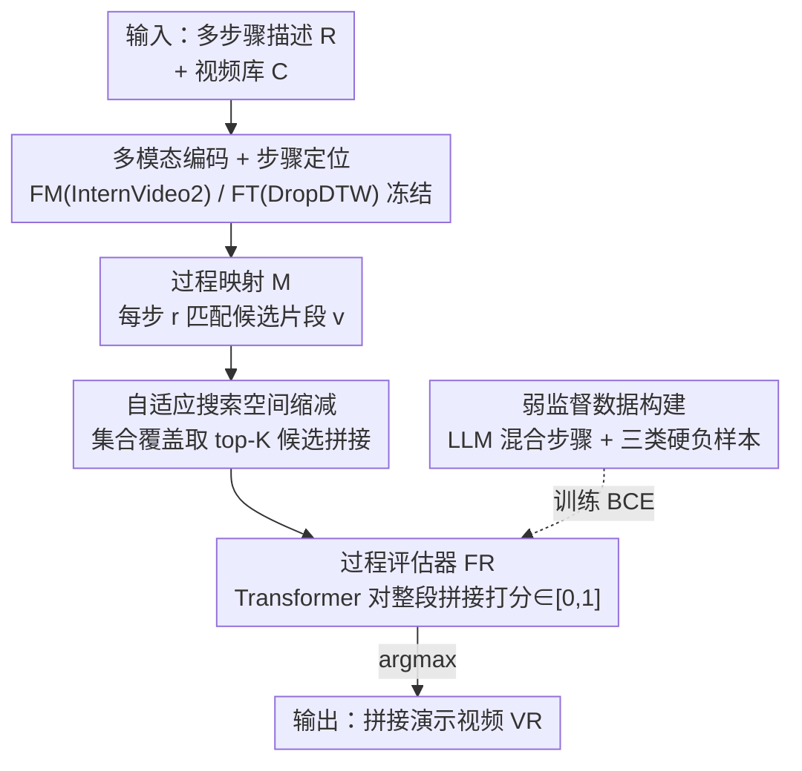

# Stitch-a-Demo: Creating Video Demonstrations from Multistep Descriptions

**会议**: CVPR 2026  
**论文**: [CVF Open Access](https://openaccess.thecvf.com/content/CVPR2026/html/Wu_Stitch-a-Demo_Creating_Video_Demonstrations_from_Multistep_Descriptions_CVPR_2026_paper.html)  
**代码**: [项目主页](https://vision.cs.utexas.edu/projects/stitch-a-demo/)（UT Austin，未明确开源代码）  
**领域**: 视频理解 / 指令视频检索  
**关键词**: 多步骤描述, 视频演示, 跨视频拼接, 过程评估器, 对比学习硬负样本

## 一句话总结
给定一份多步骤文字流程（如一份菜谱），Stitch-a-Demo 用一个学习得到的「过程评估器」从成千上万条教学视频里检索并**跨视频拼接**出片段，组成一段既每步都对、又视觉连贯的演示视频，比纯检索/生成的 SOTA 召回最高提升 29%，人类偏好压倒性领先。

## 研究背景与动机
**领域现状**：从文字得到视觉示意，目前主流是两条路——文本到视频检索（text-to-video retrieval）和图像/视频生成。检索擅长在已有候选里找语义最匹配的片段，生成擅长造出数据集里没有的画面。

**现有痛点**：这两条路都只处理**单条上下文**——一个 caption 或一个动作描述，检索/生成出一段匹配画面。但真实的指令场景（菜谱、园艺手册、木工流程）是**多步骤序列**。如果把每一步孤立处理、各自检索一段最像的片段再拼起来，得到的演示是**不连贯**的：第三步突然换了厨房、换了食材状态，甚至画面里的洋葱在「切碎」之后又变回整颗。生成方法则受限于只能产出短片段（指令内容通常 5–30 分钟），多数退化成「每步生成一张示意图」，动作信息缺失，还容易幻觉出不真实的画面。

**核心矛盾**：好的演示需要同时满足两个目标——**正确性**（correctness，每个片段确实演示了对应那一步）和**连贯性**（coherence，相邻片段在视觉、环境、物体状态上连续）。而现有方法只优化了「逐步的瞬时视频-文本对齐」，对跨步骤的连贯性束手无策；同时，互联网上虽有海量教学视频，但任意一份**指定步骤序列**（哪怕只是用户临时想象的）几乎不可能被某一条视频完整覆盖——步骤的组合是爆炸性的。

**本文目标**：学一个函数 $F(R, C) = V_R$，输入多步骤描述 $R=(r_1,\dots,r_n)$ 和视频库 $C$，输出片段序列 $V_R=(v_1,\dots,v_n)$，其中每个 $v_i$ 可以来自库里**任意一条**视频，使得每步都对、整体连贯。

**切入角度**：与其用启发式规则去判断「哪些拼接是好的」，作者的核心观察是——可以**自动**造出大规模弱监督数据，并在其中精心注入**硬负样本**，让模型自己从对比中学会「正确 + 连贯」这两个约束。

**核心 idea**：用一个**学习得到的过程评估器**（procedure evaluator）替代逐步相似度打分，配合三类违反不同约束的硬负样本做对比训练——让模型直接对「整段拼接序列」的合理性打分，而不是对单步打分后硬拼。

## 方法详解

### 整体框架
整个系统是一条「定位 → 建映射 → 评估打分 → 检索拼接」的检索式管线。给定查询流程 $R$ 和视频库 $C$：先用一个冻结的多模态编码器 $F_M$（InternVideo2）把每步描述 $r_i$ 和每段视频片段 $v_i$ 编成 768 维特征；再用一个冻结的时序定位器 $F_T$（DropDTW）把库里每条视频按它自带的旁白步骤切成 (步骤文字, 片段) 元组池 $P$，并据此为查询 $R$ 的每一步匹配出候选片段，构成**过程映射** $M$；核心模块是一个 Transformer 结构的**过程评估器** $F_R$，它吃进整段拼接候选 $(v_1,\dots,v_n)$ 的视频+文字特征，输出这段拼接「是不是一个正确且连贯的演示」的概率 $\in[0,1]$；推理时在候选里取概率最大的那条作为输出 $V_R$。训练 $F_R$ 的关键不在网络结构，而在**数据**：用 LLM 混合不同视频的步骤造出大规模弱监督正样本 $D_w$，再针对正样本做三类有针对性的破坏得到硬负样本，用二分类交叉熵训练。最后用一个**集合覆盖（set cover）**算法把指数级的候选空间压到可枚举的规模，让方法在真实大库上可跑。

### 关键设计

**1. 过程评估器 FR：对「整段拼接」打分，而不是对单步**

现有检索方法只会逐步算「片段-步骤」相似度然后硬拼，因此抓不到跨步骤的连贯性——这正是 InternVideo 等强基线掉点的根因（它们用了相同的 $F_M$、$F_T$，唯独缺这个评估器）。Stitch-a-Demo 把它换成一个学习模块：$F_R$ 是一个 4 层、8 头的 Transformer encoder，输入是按步骤拼接的特征序列，每个位置塞入该步的文字特征 $F_M(r_i)$ 和视频特征 $F_M(v_i)$；取 CLS token 的输出过一层线性层得到概率

$$F_R\big((v_1, v_2, \dots, v_n)\mid v_i\sim r_i,\ (r_i,v_i)\in M\big)\to[0,1]$$

其中 $v\sim r$ 表示片段 $v$ 演示了步骤 $r$。因为它一次性看到**整条序列**，自注意力能在步骤之间建立关联，从而判断「第三步的厨房和第二步对不对得上」「洋葱状态有没有倒退」这类跨步骤信息——这是逐步相似度做不到的。推理就是在候选拼接里取最大概率：$V_R = \arg\max_{(v_1,\dots,v_n)} F_R(\cdot)$。

**2. 三类硬负样本：把「正确 + 连贯」拆成可对比的违例**

评估器要学会判好坏，就得见过「坏」长什么样。作者不靠人工标注，而是对正样本做**有针对性的破坏**，每种破坏违反一条具体约束，构成硬负样本：

- **步骤/目标正确性**：把序列里某个片段 $v\sim r$ 换成一个不演示该步的 $v'\not\sim r$；为了让负样本更硬，特意从**同一批源视频**里挑替换片段（同源但语义错），逼模型分辨「画面像但步骤不对」。
- **视觉连贯性**：作者希望尽量少切换源视频。若一段演示里有连续三步同源（$v_k,v_{k+1},v_{k+2}\in V^{(j)}$），就把中间那步换成**另一条源视频**里语义正确的片段——制造一个「无谓的视频跳切」负样本，教模型偏好连续。
- **物体状态连贯性**：物体不该在经历不可逆变化后倒退，例如「切碎洋葱」之后不该再出现整颗洋葱、「打磨木头」之后不该再出现未打磨的木头。构造方式是取同源两片段 $v$（演示 $r_x$）、$v'$（演示 $r_y$），在原视频里 $v$ 先于 $v'$ 出现，但让它们在负样本里**违反原时序**（$x>y$），制造状态回退。

这三类约束直接对应任务的两大目标（正确 + 连贯），且都能从正样本**自动派生**，不需要额外人标。

**3. LLM 混合步骤造弱监督数据：让模型学会「跨视频拼」**

模型要会跨视频拼接，训练里就得有「步骤来自不同视频」的正样本，但真实视频天然是单一来源。作者用 LLM 自动造：先把教学视频库（HowTo100M、COIN、CrossTask、HT-Step）的 ASR 旁白加标点、切句，用 Llama-3.1 70B 转成带时间戳的步骤级摘要；再用 MPNet 句向量算相似度，挑出相似度 $>0.8$ 的成对/三元/四元流程；最后让 LLM 按提示「优先用同一流程的步骤，只有当前流程不足时才从别的流程取步骤」把它们**混合成一条新流程**（见 Fig.3 右：把两份菜谱的步骤拼成一份「素牛肉塔可」）。摘要自带每步起止时间，因此新流程直接复用对应片段的时间区间。这样得到弱监督正样本集 $D_w$（共 44.6 万训练样本）。作者承认 LLM 会引入噪声，但人工抽检发现 **75% 标签高质量**，认为「解锁大规模数据」的收益盖过噪声风险；硬负样本（设计 2）正是从 $D_w$ 采样得到。

**4. 自适应搜索空间缩减：用集合覆盖把指数候选压到可枚举**

允许每步从不同视频取片段后，$M$ 步、每条视频平均 $K$ 段时，候选拼接规模是 $O((KN)^M)$——直接枚举不可能。作者把它转成**集合覆盖问题**：为每条视频 $V^{(i)}$ 定义集合

$$S_i := \{(x, v)\mid x\in\mathbb{Z},\ v\in V^{(i)},\ v\sim r_x\}$$

即「这条视频能覆盖查询里的哪些步骤」。目标是选最少数量的 $S_i$ 覆盖 $R$ 的所有步骤（等价于最少切换源视频），用经典贪心解取 top-K 套覆盖方案作为候选送进 $F_R$。这一步同时服务两个用途：推理时缩小候选集、评测时构造干扰项集合。实验（Fig.5）显示即使 K 很小也能高概率把真值收进候选，使方法在真实大库上可行。

### 损失函数 / 训练策略
正确的拼接序列标签为 1、否则为 0，用标准二分类交叉熵（BCE）训练 $F_R$，与「概率输出 + 二值标签」天然一致。编码器 $F_M$ 与定位器 $F_T$ 全程冻结，只训 $F_R$。由于三个领域（烹饪/木工/园艺）差异大，**每个领域单独训一个 $F_R$**。优化器 Adam，学习率 $3\times10^{-4}$，batch size 24，10 个 epoch，8 卡 Quadro RTX 6000；$F_M$ 输出、$F_R$ 输入与隐层维度均为 768。

## 实验关键数据

任务设置：每个测试样例配 499 个干扰项（含违反约束的硬负样本 + 集合覆盖缩减空间里的候选），从 500 个里检索正确拼接。指标：召回 R@50（越高越好）、中位排名 MR（越低越好）。在烹饪、木工、园艺三个领域、多个测试集上评测。

### 主实验（视频演示检索，节选烹饪域）

| 方法 | SaD-MC MR↓ | SaD-MC R@50 | SaD-VD MR↓ | SaD-VD R@50 | HT-Step MR↓ | HT-Step R@50 |
|------|-----------|-------------|-----------|-------------|-------------|--------------|
| CoVR | 193 | 0.04 | 132 | 0.04 | 161 | 0.12 |
| VidDetours | 124 | 0.21 | 80 | 0.31 | 125 | 0.22 |
| Text-only | 108 | 0.32 | 76 | 0.36 | 123 | 0.26 |
| Recipe2Video | 125 | 0.21 | 50 | 0.50 | 93 | 0.29 |
| InternVideo（次优） | 36 | 0.55 | 8 | 0.71 | 68 | 0.42 |
| **Ours** | **3** | **0.84** | **3.5** | **0.91** | **40** | **0.56** |

在三个领域、所有测试集、两个指标上全面领先：相比次优的 InternVideo，召回最高提升 **29%**、MR 最多领先 **33 名**。关键对照是 InternVideo 用了和本文**完全相同**的 $F_M$、$F_T$，唯独缺过程评估器 $F_R$——差距直接归因于这一核心创新。另外对比层次化检索 HiREST，本文在 SaD-VD / HT-Step 上召回分别高 0.42 / 0.32。

### 人类偏好研究（烹饪域，每对最多 60 样本、每样本 3 人标）

| Ours vs | Step | Goal | Quality | Total |
|---------|------|------|---------|-------|
| Recipe2Video | 0.77 | 0.74 | 0.74 | 0.77 |
| InternVideo | 0.75 | 0.72 | 0.78 | 0.75 |
| ShowHowTo（生成式） | 0.94 | 0.94 | 0.85 | **0.98** |

四个维度（步骤忠实度/目标忠实度/视觉质量/整体偏好）全部胜出。对生成式 SOTA ShowHowTo 的整体偏好高达 0.98。更耐人寻味的是：人类以 **83:17** 偏好本文拼接结果**胜过原始单条真实视频演示**——说明真实视频的「自然感」抵不过它无法精确匹配目标多步骤流程的硬伤。

### 关键发现
- **过程评估器是命门**：去掉 $F_R$（退化为 InternVideo 逐步相似度）后，召回从 0.84 掉到 0.55——这是全文最大的掉点来源，证明「对整段拼接打分」比「逐步打分硬拼」本质更强。
- **物体状态连贯负样本有用**：作者在正文与补充材料中专门验证了「违反物体状态时序」这类负样本对训练的增益，呼应了「切碎后不该变回整颗」这类感知上的硬约束。
- **跨视频拼接 + 恢复单视频两头都强**：在需要跨多源拼接的 SaD-MC/SaD-VD，和只需从步骤恢复同源视频的 HT-Step/COIN/CrossTask 上都领先，说明硬负样本训练同时提升了正确性与连贯性。
- **集合覆盖让方法落地**：即使每次检索数 K 很小，贪心集合覆盖也能高概率把真值收进候选，优于随机选片段和 edited-NN，逼近线性扫描的覆盖率却大幅省算力。

## 亮点与洞察
- **把「连贯性」变成可学习的判别问题**：不靠手工连贯性度量（Recipe2Video 那套就被它打败），而是让一个 Transformer 看整条序列直接打分——是什么让拼接好/坏，交给数据和对比学习去定义。这个「整段评估器」范式可迁移到任何「序列拼接质量」问题（如多镜头剪辑、流程图像故事板）。
- **负样本即标注**：三类硬负样本把抽象的「正确 + 连贯」翻译成可程序化生成的违例（换错片段、无谓跳切、状态回退），完全绕开人工标注。这种「用约束的违反来造监督信号」的思路非常省力且可复用。
- **LLM 当数据增强引擎**：用 LLM 混合不同视频的步骤造出「跨视频流程」这一训练里天然稀缺的正样本，直击「单条视频盖不全任意流程」的核心困难，且 75% 高质量足以盖过噪声。
- **把检索可行性归约成经典组合优化**：指数候选空间 → 集合覆盖 → 贪心 top-K，一步把不可枚举变可枚举，是「让漂亮模型能在真实大库上跑」的关键工程洞察。

## 局限与展望
- **依赖冻结的现成组件**：定位器 DropDTW 和编码器 InternVideo2 全程冻结，定位错误会直接污染过程映射 $M$（失败案例里就有漏掉牙签等小物体的情况），评估器无从纠正上游错误。
- **每个领域单独训模型**：烹饪/木工/园艺各训一个 $F_R$，缺乏跨域泛化的统一模型，扩展到新领域需重训。
- **弱监督噪声**：训练正样本由 LLM 混合生成，约 25% 含噪；测试集里大规模的 SaD-MC 同样带噪，所以才需额外配人工核验的 SaD-VD 与 $D_v$ 互补——纯自动指标需谨慎解读。
- **本质受限于「检索」**：答案必须存在于候选库里；库里没有的步骤/画面无法凭空产生。作者也把「检索 + 受控生成的混合」列为未来方向，并设想注入演示速度、语言风格等用户偏好。

## 相关工作与启发
- **vs InternVideo / Text-only**：它们逐步算「片段-步骤」相似度再硬拼，缺跨步骤建模；本文加一个看整段的过程评估器 $F_R$，在相同编码器下召回从 0.55 提到 0.84，区别就在「整段 vs 逐步」。
- **vs Recipe2Video**：它用人工设计的连贯/覆盖/跨模态检索度量做幻灯片式拼接，度量僵硬、难保正确与状态一致；本文把连贯性变成学习目标，正确性、连贯性、物体状态都由对比学习习得，全面胜出。
- **vs CoVR / VidDetours**：都是检索模型但非为本任务设计——CoVR 做组合视频检索（参考视频+修改文本），VidDetours 找两条烹饪视频间的「绕路」；本文把它们改造来逐步检索后表现都远逊，凸显「多步骤拼接」是个独立的新问题。
- **vs ShowHowTo（生成式）**：生成只能每步出一张示意图、动作信息缺失且易幻觉；本文检索真实片段，人类整体偏好 0.98 压倒它，说明在「答案存在于库中」的指令演示场景，检索 + 拼接比生成更靠谱。

## 评分
- 新颖性: ⭐⭐⭐⭐ 提出「多步骤描述→跨视频拼接演示」新任务，并用学习式过程评估器 + 三类硬负样本给出干净解法。
- 实验充分度: ⭐⭐⭐⭐ 三领域、多测试集、强基线、人类偏好研究 + 搜索空间分析齐全；细致消融多在补充材料。
- 写作质量: ⭐⭐⭐⭐ 任务定义清晰、约束与负样本一一对应、图示直观。
- 价值: ⭐⭐⭐⭐ 对教学视频检索、机器人模仿学习的视频示范构建有直接用处，思路（约束违反造监督、集合覆盖缩候选）可迁移。

<!-- RELATED:START -->

## 相关论文

- [\[CVPR 2026\] A Stitch in Time: Learning Procedural Workflow via Self-Supervised Plackett-Luce Ranking](a_stitch_in_time_learning_procedural_workflow_via_self_supervised_plackett_luce_r.md)
- [\[CVPR 2025\] Unbiasing through Textual Descriptions: Mitigating Representation Bias in Video Benchmarks](../../CVPR2025/video_understanding/unbiasing_through_textual_descriptions_mitigating_representation_bias_in_video_b.md)
- [\[CVPR 2026\] Video Panels for Long Video Understanding](video_panels_for_long_video_understanding.md)
- [\[CVPR 2026\] An Empirical Study on How Video-LLMs Answer Video Questions](an_empirical_study_on_how_video-llms_answer_video_questions.md)
- [\[CVPR 2026\] CVA: Context-aware Video-text Alignment for Video Temporal Grounding](cva_context-aware_video-text_alignment_for_video_temporal_grounding.md)

<!-- RELATED:END -->
