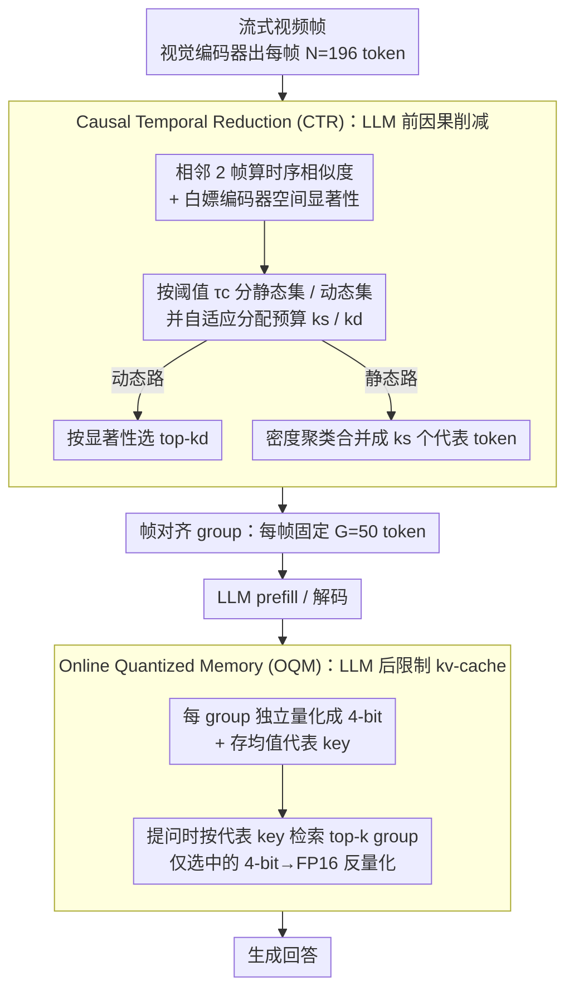

# StreamingTOM: Streaming Token Compression for Efficient Video Understanding

**会议**: CVPR2026  
**arXiv**: [2510.18269](https://arxiv.org/abs/2510.18269)  
**代码**: [yige24/StreamingTOM](https://yige24.github.io/StreamingTOM)  
**领域**: 视频理解 / 流式视频问答 / Token压缩  
**关键词**: streaming video understanding, token compression, kv-cache quantization, training-free, causal inference

## 一句话总结

提出 StreamingTOM，一个无需训练的两阶段流式视频理解框架：Causal Temporal Reduction (CTR) 在 LLM 前通过因果时序选择将每帧 token 从 196 压缩到 50，Online Quantized Memory (OQM) 在 LLM 后通过 4-bit 量化和按需检索限制 kv-cache 增长，实现 15.7× 压缩比、1.2× 更低峰值显存和 2× 更快 TTFT。

## 背景与动机

1. **流式视频的双重约束**：与离线处理不同，流式视频 VLM 面临因果性（无法访问未来帧）和累积性（token 随时间无界增长）两大约束，使得 token 压缩从可选优化变为必要前提。
2. **kv-cache 无界增长**：以 LLaVA-OV-7B 为例，1 小时视频在 0.5 fps 下 kv-cache 达 18.8 GB，远超典型 GPU 显存容量，无法维持实时推理。
3. **现有方法仅管理 post-LLM**：当前训练无关的流式方法（ReKV、LiveVLM、StreamMem）仅对 LLM 之后的 kv-cache 进行驱逐/压缩，无法降低 pre-LLM prefill 的 $O(tNLd^2)$ 计算开销。
4. **离线压缩违反因果性**：成熟的离线 token 合并/剪枝方法（ToMe、DyCoke、HoliTom）依赖全局/双向注意力和未来帧信息，无法直接用于流式场景。
5. **训练方法成本高**：训练式流式方法（Flash-VStream、Dispider）需要针对特定模型的昂贵重训练，难以跨骨干网络迁移。
6. **pre-LLM 因果压缩空白**：据作者所知，此前没有训练无关的流式方法在 LLM 之前执行严格因果的 token 削减，留下了重要的效率空间。

## 方法详解

### 整体框架

StreamingTOM 要解决的是流式视频 VLM 的两个硬约束——因果性（看不到未来帧）和 kv-cache 无界增长——在不训练的前提下同时压住 LLM 前的 prefill 计算和 LLM 后的解码显存。它把整条链路拆成两段，中间用一个固定大小的 **group 抽象**（每帧固定 G=50 个 token 的帧对齐组）当接口：视觉编码器出特征后先经 CTR 在 LLM *前*把每帧压到 G 个 token 写进在线记忆，用户提问时再由 OQM 从记忆里检索相关 group、4-bit 反量化送进 LLM 生成。形式化即 $\text{StreamingTOM} = \text{OQM}_{16\to4} \circ \text{CTR}_{N\to G}$。

### 关键设计

**1. Causal Temporal Reduction (CTR)：在 LLM 前做严格因果的逐帧 token 削减**

现有 training-free 流式方法只管 LLM 之后的 kv-cache，prefill 的 $O(tNLd^2)$ 计算没人降，而离线的 token 合并方法又要看未来帧、违反因果。CTR 用一个只看相邻两帧的因果窗口、单遍处理、每帧固定预算 G 的削减器来填这个空：对相邻帧 $t$ 和 $t{-}1$ 同位置 token 算余弦相似度 $s_t^{(i)}$ 衡量跨帧冗余，同时白嫖视觉编码器自带的注意力分数 $\alpha_t^{(i)}$ 当空间显著性（用 chunked attention 算，避免显存峰值），以阈值 $\tau_c=0.9$ 把 token 分成高相似的静态集 $\mathcal{S}_t$ 和低相似的动态集 $\mathcal{D}_t$。接着按两者比例把 G 个名额自适应分成 $k_s$ 和 $k_d$（内容变化大就多给动态），动态路径按显著性选 top-$k_d$ 保留新信息、静态路径密度聚类合并成 $k_s$ 个代表 token 去冗余。整帧复杂度只有 $O(N + G^2)$、状态只需前一帧特征 $O(Nd)$，都不随流长增长，于是把 prefill 从 $O(tNLd^2)$ 降到了 $O(tGLd^2)$。

**2. Online Quantized Memory (OQM)：在 LLM 后用 4-bit 量化 + 按需检索限制 kv-cache**

CTR 把每帧压到 G 个 token，但 kv-cache 仍随帧数线性涨。OQM 的做法是每来一个 group 就独立量化成 4-bit（per-head、per-channel 的 scale/offset），并存一个代表性 key $\bar{\mathbf{k}}_t$；查询时拿 decoder state 与所有 group 的代表 key 算余弦相似度，只挑 top-k 个最相关的 group 做 4-bit → FP16 反量化。这样完整历史以 $O(T \cdot G \cdot d / 4)$ 的压缩态存着、活跃 kv 只有 $O(k \cdot G \cdot d)$（$k \ll T$），解码延迟不随流长涨。两段合起来的综合压缩比是 $4N/G = 4 \times 196/50 \approx 15.7\times$。

## 实验关键数据

### 离线长视频评测（LLaVA-OV-7B backbone）

| 方法 | VideoMME Overall | MLVU | EgoSchema | Avg |
|---|---|---|---|---|
| LLaVA-OV-7B (offline baseline) | 58.4 | 64.7 | 60.1 | 61.0 |
| +LiveVLM (training-free SOTA) | 57.3 | 66.3 | 59.0 | 60.9 |
| +StreamMem | 59.4 | 66.9 | 63.0 | 63.1 |
| **+StreamingTOM (ours)** | **59.9** | **67.9** | **63.7** | **63.8** |

### 在线流式评测（RVS benchmark，28GB 显存限制）

| 方法 | RVS-Ego Acc/Score | RVS-Movie Acc/Score | Avg Acc/Score |
|---|---|---|---|
| Flash-VStream (训练式) | 57.0 / 4.0 | 53.1 / 3.3 | 55.0 / 3.6 |
| StreamMem | 57.6 / 3.8 | 52.7 / 3.4 | 55.2 / 3.6 |
| **StreamingTOM** | **58.3 / 3.9** | **53.2 / 3.5** | **55.8 / 3.7** |

### 效率指标

- **kv-cache 压缩比**：15.7×
- **峰值显存**：相比 LiveVLM 降低 1.2×
- **TTFT**：相比 LiveVLM 加速 2×
- **1 小时视频 kv-cache**：18.8 GB → 1.2 GB
- **显存增长**：16-512 帧仅从 16.0 GB → 16.7 GB（亚线性）
- **吞吐量**：长序列稳定在约 20 tokens/s

### 消融实验

| Token数 | 量化位数 | 压缩比 | VideoMME Overall |
|---|---|---|---|
| 40 | 4-bit | 5.1% | 58.9 |
| **50** | **4-bit** | **6.4%** | **59.9** |
| 60 | 4-bit | 7.7% | 59.3 |
| 50 | 2-bit | 3.2% | 58.5 |

- 50 token 是最优平衡点：过少（40）丢失关键细节，过多（60）在固定显存下减少时序覆盖
- 4-bit 量化优于 2-bit，精度-压缩比最优

## 亮点

1. **首创因果 pre-LLM token 压缩**：填补了训练无关流式方法中 pre-LLM 压缩空白，将 prefill 复杂度从 $O(tNLd^2)$ 降至 $O(tGLd^2)$。
2. **Group 抽象设计优雅**：固定大小的帧对齐 group 同时服务于 CTR 输出和 OQM 存储/检索，保证时序一致性和可预测延迟。
3. **完全即插即用**：无需训练，可直接应用于 LLaVA-OV 等不同骨干网络。
4. **实际部署友好**：单张 A6000 即可运行，batch-agnostic，显存增长亚线性。
5. **双阶段互补**：CTR 降计算、OQM 降显存，两者缺一不可，组合效果远超单阶段。

## 局限与展望

1. **固定 G 可能非最优**：所有帧使用相同的 50 token 预算，对信息密度差异大的帧（关键帧 vs 静态帧）不够灵活。
2. **仅验证单一骨干**：实验主要基于 LLaVA-OV-7B，未在更大模型（如 72B）或其他架构上验证。
3. **2 帧窗口限制**：CTR 的因果窗口仅看相邻两帧，对缓慢渐变场景可能累积误差。
4. **代表性 key 的检索质量**：OQM 用均值 key 做检索，可能对细粒度时序推理不够精确。
5. **未评估多模态音频流**：仅考虑视觉流，实际流式应用通常伴随音频流。

## 与相关工作的对比

| 维度 | StreamingTOM | LiveVLM/StreamMem | DyCoke/HoliTom | Flash-VStream |
|---|---|---|---|---|
| Pre-LLM 压缩 | ✅ CTR | ❌ | ✅ (非因果) | ✅ (需训练) |
| Post-LLM 管理 | ✅ OQM 4-bit | ✅ kv-cache 驱逐 | ❌ | ✅ (需训练) |
| 因果约束 | ✅ 严格 | ✅ | ❌ 需未来帧 | ✅ |
| 训练需求 | 无 | 无 | 无 | 需重训练 |
| 压缩比 | 15.7× | ~4× | ~4× | N/A |

## 评分

- 新颖性: ⭐⭐⭐⭐ — 首次在训练无关流式方法中引入因果 pre-LLM token 压缩，group 抽象统一两阶段
- 实验充分度: ⭐⭐⭐⭐ — 覆盖离线/在线两类 benchmark，效率分析详尽，消融完整
- 写作质量: ⭐⭐⭐⭐⭐ — 问题定义清晰，公式推导严谨，pipeline 图直观
- 价值: ⭐⭐⭐⭐ — 解决流式视频 VLM 实际部署的显存瓶颈，即插即用实用性强

<!-- RELATED:START -->

## 相关论文

- [\[CVPR 2026\] An Efficient Token Compression Framework for Visual Object Tracking](an_efficient_token_compression_framework_for_visual_object_tracking.md)
- [\[CVPR 2026\] Token Reduction via Local and Global Contexts Optimization for Efficient Video Large Language Models](token_reduction_via_local_and_global_contexts_optimization_for_efficient_video_l.md)
- [\[CVPR 2026\] EarlyTom: Early Token Compression Completes Fast Video Understanding](earlytom_early_token_compression_completes_fast_video_understanding.md)
- [\[ICLR 2026\] FLoC: Facility Location-Based Efficient Visual Token Compression for Long Video Understanding](../../ICLR2026/video_understanding/floc_facility_location-based_efficient_visual_token_compression_for_long_video_u.md)
- [\[CVPR 2026\] FluxMem: Adaptive Hierarchical Memory for Streaming Video Understanding](fluxmem_adaptive_hierarchical_memory_for_streaming_video_understanding.md)

<!-- RELATED:END -->
