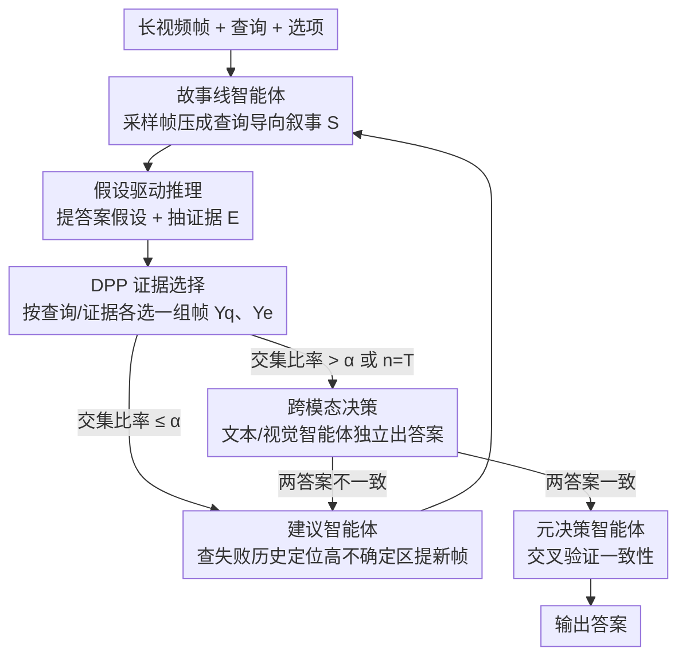

# SVAgent: Storyline-Guided Long Video Understanding via Cross-Modal Multi-Agent Collaboration

**会议**: CVPR 2026  
**arXiv**: [2604.05079](https://arxiv.org/abs/2604.05079)  
**代码**: 无  
**领域**: 视频理解  
**关键词**: long video QA, multi-agent, storyline, cross-modal reasoning, DPP

## 一句话总结

提出 SVAgent，一个故事线引导的跨模态多智能体框架用于长视频问答，通过渐进式构建叙事表示、DPP 证据选择、跨模态一致性验证和迭代精炼实现超越基线 5.5%-11.5% 的性能提升。

## 研究背景与动机

视频问答（VideoQA）需要整合空间、时序和语义信息。现有方法存在三个限制：(1) 缺乏保持全局时序结构的显式机制；(2) 证据获取缺乏可信保证；(3) 缺乏显式验证，容易因证据不足或不一致而出错。

人类自然通过连贯的故事线来理解视频，而非孤立地定位相关帧。SVAgent 模拟这种人类认知方式，构建全局时序脚手架，在此基础上进行假设驱动的推理和跨模态验证。

## 方法详解

### 整体框架

SVAgent 模仿人看长视频的方式——先搭一条贯穿全片的故事线，再在它上面做假设驱动的推理和跨模态验证，而不是孤立地去定位相关帧。六个智能体组成一个闭环：故事线智能体先把视频压成保留时序语义线索的叙事表示，假设智能体在此之上提出答案假设并用 DPP 选证据帧，文本和视觉决策智能体各自独立推理，元决策智能体检查两者是否一致；一旦不一致或证据不足，就由建议智能体提新帧、回到上一步再迭代一轮，直到达成一致或触及迭代上限 T。

### 关键设计

**1. 故事线智能体：搭一条全局时序脚手架而非孤立定位帧**

针对"现有方法缺乏保持全局时序结构的显式机制"，它基于查询渐进式构建视频叙事表示，把视频压成紧凑的时序抽象、只留推理相关的时序与语义线索；并支持增量更新，融入新帧后回头修正不完整的叙事段。

**2. 假设驱动推理 + DPP 证据选择：让证据获取既多样又可信**

针对"证据获取缺乏可信保证"，假设智能体提出答案假设并找支持/反驳证据，用 DPP（行列式点过程）分别基于查询 $\mathcal{Q}$ 和证据 $\mathcal{E}$ 选两组帧集 $\mathcal{Y}_q$ 和 $\mathcal{Y}_e$，DPP 核矩阵保证所选帧同时满足多样性和相关性。再用交集比率 $|\mathcal{Y}_q \cap \mathcal{Y}_e| / (|\mathcal{Y}_q| + |\mathcal{Y}_e|) > \alpha$ 做粗验证：超过阈值 $\alpha$ 才进精细跨模态验证，否则触发建议智能体提新帧进入下一轮迭代。

**3. 跨模态决策验证：用一致性当作答案可靠性的闸门**

针对"缺乏显式验证、易因证据不一致出错"，文本决策智能体只吃故事线 + 字幕、视觉决策智能体只吃故事线 + 帧，两者独立推理各出一个答案；故意不把假设阶段的答案 $o$ 显式传给它们，避免信息泄漏导致两路误差同向传播。元决策智能体再检查两者：答案不一致时按帧重要性推荐对证据加权、偏向更可靠的一方做调和；答案一致时还要做一次二次交叉验证，确认这种一致不是基于残缺信息的巧合。任一环不通过就触发建议智能体进入下一轮迭代。

**4. 建议智能体：基于失败历史的定向探索而非盲目重采样**

针对"证据不足时不知道该回看哪段"，建议智能体在每次失败后检查已用于故事线和决策的帧索引，反推出哪些时段尚未被充分利用，再作为一个推理驱动的定向检索策略，优先挑两类帧：(1) 还没探索过或信息量低的时段，(2) 可能含有与查询对齐证据的时段，挑出能最大化预期信息增益、压低残余不确定性的候选帧。它替代了首轮的均匀采样，把新帧喂回故事线智能体让叙事增量更新——正是这个闭环让小模型也能逐轮逼近大模型的单次推理。

### 损失函数 / 训练策略

无需额外训练，基于开源 Video MLLMs（如 Qwen2.5-VL）的 zero-shot 多智能体协作。迭代次数上限 T 控制计算开销。

## 实验关键数据

### 主实验

| 基线 → +SVAgent | LongVideoBench | MLVU | LVBench | VideoMME |
|----------------|---------------|------|---------|---------|
| Qwen2.5-VL 3B → +SVAgent | 53.0→**59.7** | 53.6→**61.2** | 31.6→**38.5** | 52.8→**60.7** |
| 提升 | +6.7 | +7.6 | +6.9 | +7.9 |

### 关键发现

- 跨四个长视频基准一致提升 5.5%-11.5%
- 小模型 (3B) 加 SVAgent 可接近甚至超过大模型 (72B) 的单次推理
- 跨模态一致性验证有效识别推理不确定性
- 故事线构建对保持时序连贯性至关重要
- 故事线智能体支持增量更新，融入新帧后修正不完整叙事段
- 建议智能体利用历史失败记录提出新帧进行定向探索，而非随机采样
- 文本和视觉决策智能体独立推理产生答案，元决策智能体检查一致性——一致则确认，不一致则触发精细化

## 亮点与洞察

- 模拟人类观看视频的认知过程：构建故事线→形成假设→寻找证据→交叉验证→必要时回看
- DPP 用于证据选择既保证多样性又保证相关性
- 闭环迭代精炼机制自适应决定何时停止

## 局限与展望

- 多智能体调用增加推理延迟和 API 成本
- 故事线质量依赖帧字幕生成的准确性
- 对于简单问题可能过度复杂
- 迭代次数上限 T 需要平衡计算开销和答案质量
- 基于开源 Video MLLMs（如 Qwen2.5-VL）的 zero-shot 多智能体协作，无需额外训练
- 未探索对非多选题格式（如开放式问答）的扩展
- Qwen2.5-VL 72B 单次推理表现 vs 3B+SVAgent 的对比证明了智能体协作的价值
- 帧字幕生成质量作为故事线的上游瓶颈，可探索更强的 captioning 模型来提升

## 评分

- 新颖性：⭐⭐⭐⭐ — 故事线驱动的多智能体视频推理
- 技术深度：⭐⭐⭐⭐ — 六智能体闭环设计系统性强
- 实验充分度：⭐⭐⭐⭐ — 四个基准一致验证，跨模型规模 3B-72B
- 实用价值：⭐⭐⭐ — 推理开销较大，适合高质量应用场景

<!-- RELATED:START -->

## 相关论文

- [\[CVPR 2026\] VideoSeek: Long-Horizon Video Agent with Tool-Guided Seeking](videoseek_long-horizon_video_agent_with_tool-guided_seeking.md)
- [\[CVPR 2026\] VideoChat-M1: Collaborative Policy Planning for Video Understanding via Multi-Agent Reinforcement Learning](videochatm1_collaborative_policy_planning_for_vide.md)
- [\[CVPR 2026\] Progressive Cross-Modal Causal Intervention for Long-Term Action Recognition](progressive_cross-modal_causal_intervention_for_long-term_action_recognition.md)
- [\[CVPR 2026\] Understanding Temporal Logic Consistency in Video-Language Models through Cross-Modal Attention Discriminability](understanding_temporal_logic_consistency_in_video-language_models_through_cross-.md)
- [\[CVPR 2026\] WorldMM: Dynamic Multimodal Memory Agent for Long Video Reasoning](worldmm_dynamic_multimodal_memory_agent_for_long_video_reasoning.md)

<!-- RELATED:END -->
