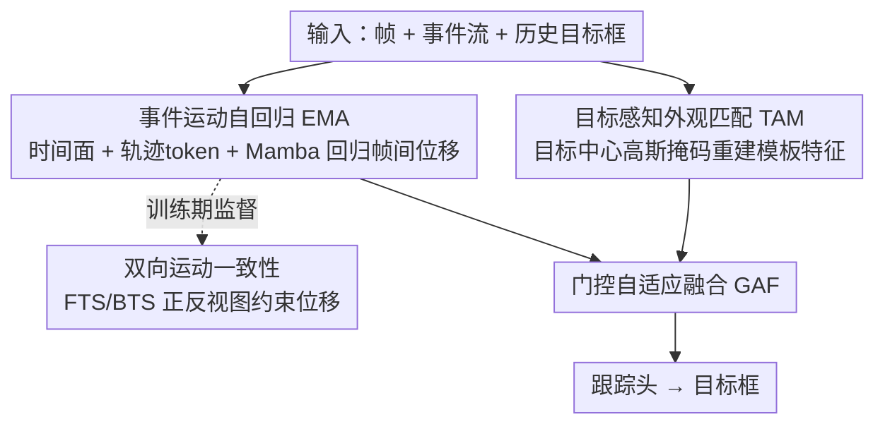

# Tracking through Severe Occlusion via Event-Derived Transient Cues

**会议**: CVPR 2026  
**论文**: [CVF Open Access](https://openaccess.thecvf.com/content/CVPR2026/html/Dong_Tracking_through_Severe_Occlusion_via_Event-Derived_Transient_Cues_CVPR_2026_paper.html)  
**代码**: 待确认  
**领域**: 视频理解 / 目标跟踪 / 事件相机  
**关键词**: 视觉目标跟踪、严重遮挡、事件相机、运动自回归、时间面

## 一句话总结
针对"目标被严重遮挡 + 非线性运动"导致的跟踪失败，作者提出 EvoTrack：用事件相机微秒级的瞬态运动线索做"运动自回归"在遮挡期间预测目标位置，同时用目标感知的高斯掩码强化外观匹配，二者由门控自适应融合，并配套发布带遮挡分级标注的高分辨率帧-事件跟踪数据集 FEOT，在 FE108/VisEvent/COESOT/FEOT 上整体取得 SOTA。

## 研究背景与动机
**领域现状**：视觉目标跟踪（VOT）给定首帧目标框后在后续帧中定位目标，主流分两派——一是**外观匹配**（appearance matching），把跟踪当成模板与搜索区域的相似度匹配问题（如 MixFormer），靠动态更新模板或维护模板库来保持相似性；二是**轨迹自回归**（trajectory autoregression），把跟踪当成序列预测问题，从历史轨迹推断当前位置（如 SeqTrack、ARTrack）。

**现有痛点**：在**严重遮挡**下两派都会塌掉。外观匹配派一旦目标被遮挡、外观被破坏，模板-搜索相似度直接崩溃；动态更新模板还容易把遮挡物/背景吸进模板，造成"模板污染"。轨迹自回归派虽然对遮挡更鲁棒一点，但对运动模式敏感、**应付不了非线性运动**——常规相机帧率有限，捕捉不到帧间动态，遮挡又进一步把稀疏轨迹打碎，预测误差累积漂移（drift），甚至把目标推出搜索区域，遮挡结束后再也找不回来。

**核心矛盾**：遮挡同时带来两个耦合的损伤——**空间外观剥夺**（appearance deprivation，破坏模板-搜索相似度）和**时间轨迹断裂**（trajectory fragmentation，让运动动力学难以建模）。空间匹配机制天然在遮挡下退化，这恰恰反衬出**时间线索**的重要性；可常规相机帧率不够，给不出建模非线性运动所需的帧间动态。

**切入角度**：事件相机（event camera）具有微秒级时间分辨率，能捕获常规相机丢掉的**瞬态运动细节**。事件流里精细的时间戳天然编码了目标的运动方向与速度，正好适合建模非线性运动。已有的事件跟踪器虽然在高速、高动态场景表现好，却普遍忽视了遮挡这一长期难题。

**核心 idea**：用**时间运动预测**去补偿**空间外观退化**——把"轨迹自回归"升级为"运动自回归"，借事件流捕获帧间瞬态动态，在遮挡期间精准预测、遮挡结束后快速校正（predict under occlusion, rectify afterward）。

## 方法详解

### 整体框架
EvoTrack 是一个"运动-外观"双分支的遮挡鲁棒跟踪框架。输入是同轴对齐的**帧 + 事件流 + 历史目标框**，输出是当前帧的目标框。两条分支并行工作：**事件运动自回归（EMA）** 负责从事件构造时间面、结合历史轨迹 token，用 Mamba 回归帧间位移，在外观线索严重退化时也能定位目标；**目标感知外观匹配（TAM）** 负责在无遮挡/轻遮挡时用高斯掩码重建模板特征、学习不变表示保证高精度。EMA 内部还引入**双向运动一致性**作为训练期的物理约束，让运动预测更准。最后一个**门控自适应融合（GAF）** 模块按遮挡严重程度动态加权两路特征，送入跟踪头出框。整体哲学是：遮挡轻时外观可靠、遮挡重时运动主导，两者强互补。

### 关键设计

**1. 事件运动自回归 EMA：把"轨迹自回归"升级为"运动自回归"，让遮挡期间也能回归出位置**

针对轨迹自回归在遮挡+非线性运动下漂移的痛点，EMA 引入事件流的瞬态线索来直接回归帧间位移。核心表示是**前向时间面（Forward Time-Surface, FTS）**：在区间 $[s_t, e_t]$ 内收集事件集 $\xi=\{e=(p_k,t_k,x_k,y_k)\}_{k=1}^N$（坐标、极性、时间戳），把时间戳归一化到 $[0,255]$ 得 $\xi^*$，每个像素取该位置最新事件的时间戳构成时间图：

$$I_f(i,j)=\max\{t_e \mid e\in\xi^*,\ x_e=i,\ y_e=j\}$$

无事件像素置 0；再做直方图均衡 $\mathrm{FTS}(i,j)=H(I_f(i,j))$ 抵消事件触发的不均匀分布，使时间面真实反映目标运动。FTS 里时间增量指示运动**方向**、事件拖尾指示运动**速度**；再算它的梯度图突出运动前沿，与 FTS 在通道维堆叠成"运动图（motion map）"。在自回归侧，原始轨迹自回归范式是 $P(Y^t \mid Y^{t-1-N:t-1},(C,Z,X^t))$（从最近 $N$ 个历史位置推当前位置，$Z$ 为模板、$X^t$ 为搜索图、$C$ 为命令 token）；EvoTrack 把它扩展为引入运动图 $M$ 的运动自回归：

$$P(Y^t \mid (Y^{t-1-N:t-1},\ M^{t-1:t},\ C),\ (Z,X^t))$$

具体地，把历史目标框投影到统一全局坐标系构成轨迹表示，转成轨迹 token 并与命令 token 拼接，运动图分块后与轨迹 token 拼接成 token 嵌入，送入 **Mamba** 模块提取运动特征做位置回归。这样即使外观线索被严重破坏，也能靠瞬态运动把位置回归出来。

**2. 双向运动一致性：用 FTS/BTS 正反两个时间视图，给非线性运动加物理约束**

只用前向时间面是"由旧到新"的单视角。作者顺势构造一个互补的"由新到旧"视图——**后向时间面（Backward Time-Surface, BTS）**：每像素取**最早**事件的时间戳 $I_b(i,j)=\min\{t_e\mid\cdot\}$（无事件像素置 255），再 $\mathrm{BTS}(i,j)=H(255-I_b(i,j))$。FTS 与 BTS 是同一段事件、同一段物理运动的正向与时间反演视图，**速度相同、方向相反**，因此天然提供一个内蕴的运动一致性信号。训练时，FTS/BTS 各自的运动图分别与轨迹 token 拼接送入 Mamba，再用一个**共享权重 MLP** 预测前向、后向位移 $\delta_{\text{forward}}$、$\delta_{\text{backward}}$，二者应当幅度一致、方向相反，由此施加**双向运动一致性监督**作为显式物理约束。消融显示该约束带来 +2.5% PR、+1.5% SR，说明它确实让非线性运动建得更准。

**3. 目标感知外观匹配 TAM：用目标中心的高斯掩码模拟遮挡，学不变表示而不学背景干扰**

运动分支并不意味着丢弃外观——无遮挡/轻遮挡时外观才是高精度定位的关键。已有工作（ORTrack 等）用**随机掩码**重建模板来学不变特征，但随机掩码盖在整张模板上、连背景一起盖，模型容易把背景干扰也学进去，遮挡时反而产生错误匹配响应。TAM 改用**目标感知的高斯掩码**：用模板里已知的目标框先验，构造以目标为中心的高斯分布引导掩码集中落在目标区域，概率密度为

$$f_g(x,y)=\frac{1}{2\pi\sigma_x\sigma_y}\exp\!\Big(-\big[\tfrac{(x-c_x)^2}{\sigma_x^2}+\tfrac{(y-c_y)^2}{\sigma_y^2}\big]\Big)$$

其中 $(c_x,c_y)$ 是模板中目标框中心，标准差 $[\sigma_x,\sigma_y]$ 取目标框宽高的 1/4。这种目标中心高斯掩码相当于"在目标身上模拟遮挡"，逼模型在训练中关注判别性的目标部件、增强特征不变性；同时背景区域掩码概率被压低，显著缓解背景干扰。实现上先用交叉注意力从模板与搜索区域抽外观特征，生成高斯掩码，再用共享自注意力模块重建模板特征。

**4. 门控自适应融合 GAF：按遮挡严重程度动态加权运动与外观**

现实遮挡严重程度多变——轻遮挡时外观可靠、重遮挡时运动主导，固定融合方式（直接相加/拼接）顶不住。GAF 用门控机制动态地组合两路线索。整体训练损失把分类、回归、重建、运动预测一起优化：

$$L=\lambda_1 L_{ce}+\lambda_2 L_{giou}+\lambda_3 L_{l1}+\lambda_4 L_{app.}+\lambda_5 L_{mot.}$$

其中分类用交叉熵 $L_{ce}$，框回归用 GIoU + L1（$L_{giou}, L_{l1}$），$L_{app.}$ 是外观重建的 MSE，$L_{mot.}$ 是帧间位移预测的 MSE，$\lambda_i$ 为平衡权重。消融中门控融合优于相加和拼接，印证动态加权能在不同遮挡下靠互补整合提升鲁棒性。

### 损失函数 / 训练策略
PyTorch 实现，8× NVIDIA RTX 3090，batch size 8。AdamW，weight decay $5\times10^{-4}$，学习率 $8\times10^{-5}$。运动分支用预训练 **Mamba** 模块，外观分支用 **ViT-B + DINOv2** 预训练权重。搜索区域 $224\times224$、模板 $112\times112$。在训练集上微调 200 个 epoch。注意：FEOT 数据集**只用于评测遮挡鲁棒性、不参与训练**。

## 实验关键数据

### 主实验
在三个公开基准 FE108、VisEvent、COESOT 加上自建 FEOT 上与帧/事件/帧-事件三类 SOTA 跟踪器对比（PR=精度率，SR=成功率，单位 %）：

| 方法 | 类型 | FE108 PR/SR | VisEvent PR/SR | COESOT PR/SR | FEOT PR/SR |
|------|------|-------------|----------------|--------------|------------|
| SeqTrack | Frame | 80.5 / 55.4 | 76.9 / 60.7 | 82.2 / 71.8 | 50.1 / 38.2 |
| ARTrack | Frame | 74.1 / 49.9 | 70.0 / 54.3 | 75.1 / 64.6 | 39.1 / 30.6 |
| HDETrack | Event | 92.2 / 59.8 | 54.6 / 37.3 | 64.1 / 53.1 | 53.1 / 40.1 |
| ViPT | Frame+Event | 93.8 / 65.8 | 75.8 / 59.2 | 84.9 / 75.4 | 55.4 / 43.4 |
| SDSTrack | Frame+Event | 92.0 / 64.6 | 76.7 / 59.7 | 84.5 / 74.9 | 58.0 / 45.1 |
| SeqTrack v2 | Frame+Event | 92.8 / 65.5 | **79.4 / 63.0** | 85.0 / 75.9 | 56.1 / 43.1 |
| **EvoTrack** | Frame+Event | **94.6 / 68.4** | **80.1** / 62.1 | **85.4 / 76.2** | **62.7 / 45.2** |

- 在强调高速/非线性运动的室内集 **FE108** 上取得 68.4% SR / 94.6% PR，验证复杂运动场景的竞争力。
- 在遮挡专用的高分辨率 **FEOT** 上以明显优势领先（62.7/45.2，相比次优 SDSTrack 58.0/45.1、SeqTrack v2 56.1/43.1 在 PR 上拉开较大差距），印证外观退化时运动线索的价值。
- **VisEvent** 上 PR 领先此前最佳 0.7%，但 SR（62.1）次优于 SeqTrack v2（63.0）；作者归因于部分视频缺失原始事件文件、影响了训练。⚠️ 以原文为准。

### 消融实验
组件消融（EMAbase=仅前向时间面，EMAbmc=前向+后向时间面+运动一致性监督）：

| TAM | EMAbase | EMAbmc | PR(%) | SR(%) | 说明 |
|-----|---------|--------|-------|-------|------|
| ✓ | | | 91.4 | 62.8 | 仅外观匹配 |
| | ✓ | | 84.1 | 50.2 | 仅基础运动分支 |
| | | ✓ | 87.3 | 56.4 | 仅含双向一致性的运动分支 |
| ✓ | ✓ | | 92.1 | 66.9 | 外观 + 基础运动 |
| ✓ | | ✓ | **94.6** | **68.4** | 完整模型 |

掩码策略消融（VisEvent）与融合策略消融（VisEvent）：

| 掩码策略 | PR/SR(%) | | 融合策略 | PR/SR(%) |
|----------|----------|---|----------|----------|
| 无掩码 | 75.7 / 59.6 | | 相加 Add | 77.5 / 61.8 |
| 随机掩码 | 79.7 / 60.2 | | 拼接 Concat | 78.9 / 62.0 |
| **高斯掩码** | **80.1 / 62.1** | | **门控自适应** | **80.1 / 62.1** |

### 关键发现
- **运动与外观强互补**：去掉 EMA 因搜索区域与模板的外观差异掉点，去掉 TAM 则只剩运动分支、缺外观引导掉精度；外观退化时运动给短期位置补偿，运动偏离时外观纠正定位误差。
- **双向时间面有效**：在 TAM+EMAbase（92.1/66.9）基础上换成 EMAbmc（94.6/68.4）带来 +2.5% PR / +1.5% SR，验证运动一致性监督帮助建模非线性运动。
- **遮挡退化分析**：随遮挡比例与时长增加性能逐步下降，遮挡比例超 60% 时 SR 显著退化，但 EvoTrack 在各档遮挡下始终保持更高 SR。
- **注意力可视化**：遮挡加重时外观响应急剧衰减、运动激活保持稳定，融合后偏向运动；IoU 曲线同趋势，证明运动预测能有效缓解遮挡失败。

## 亮点与洞察
- **把事件流的"时间戳"直接当运动信号用**：FTS/BTS 用最大/最小时间戳成图，时间增量编码方向、拖尾编码速度——这是把事件相机微秒分辨率转成可回归运动量的巧妙表示，比指数衰减核的时间面边界更清晰。
- **双向时间面 = 免费的物理约束**：同一段运动的正反视图"速度同、方向反"，无需额外标注就能构造一致性自监督信号，思路可迁移到任何基于事件/光流的运动预测任务。
- **目标感知高斯掩码**：把"随机盖整张模板"改成"按目标框造高斯只盖目标"，既模拟了遮挡又避开了背景污染，是对 MAE 式随机掩码在跟踪场景的有针对性改造。
- **范式层面的升级**：从"轨迹自回归"到"运动自回归"——核心是承认遮挡下空间匹配必然退化、转而依赖时间运动线索，这个 reframing 比单纯堆模块更有启发性。

## 局限与展望
- **依赖事件数据质量**：VisEvent 上 SR 次优，作者自承因部分视频缺失原始事件文件影响训练，说明方法对事件流完整性较敏感。
- **极端遮挡仍退化**：遮挡比例超 60% 时 SR 显著下降，长时全遮挡（数百帧）下运动外推误差仍会累积。
- **硬件门槛**：需要帧相机 + 事件相机经分束器同轴对齐的采集系统，部署成本和标定复杂度高于纯帧方案。
- **FEOT 仅评测不训练**：遮挡基准未用于训练，跨域泛化与"针对遮挡专门训练能涨多少"尚未充分探究。

## 相关工作与启发
- **vs 外观匹配派（MixFormer / ORTrack）**：它们靠模板-搜索相似度，严重遮挡下相似度崩塌即失效；EvoTrack 用运动自回归在外观失效时仍能定位，TAM 又用目标高斯掩码替代 ORTrack 的随机掩码避免背景污染。
- **vs 轨迹自回归派（SeqTrack / ARTrack）**：它们只用历史轨迹、无显式运动建模，非线性运动下漂移；EvoTrack 引入事件瞬态运动图把"轨迹自回归"扩成"运动自回归"，遮挡期间预测更准、之后校正更快。
- **vs 现有事件跟踪器（STNet / HDETrack）**：它们擅长高速/高动态但忽视遮挡；EvoTrack 专门面向遮挡，且以帧-事件融合而非纯事件，兼顾外观纹理与动态范围。
- **vs 遮挡跟踪方法（LTOP / DOCPF / MTOA）**：它们多靠 RNN 传播外观或维护模板库，仍依赖空间外观线索；EvoTrack 转向时间运动预测，从根上绕开"严重遮挡下外观不可用"的死结。

## 评分
- 新颖性: ⭐⭐⭐⭐⭐ 把事件时间面 + 双向一致性做成"运动自回归"来抗遮挡，范式与表示都有原创性
- 实验充分度: ⭐⭐⭐⭐ 四数据集对比 + 多组消融 + 遮挡退化分析齐全，但部分消融未跨数据集统一
- 写作质量: ⭐⭐⭐⭐ 动机—方法—实验逻辑清晰，图示丰富
- 价值: ⭐⭐⭐⭐⭐ 既有方法贡献又附带带遮挡分级标注的高分辨率 FEOT 基准，对遮挡跟踪社区有长期价值

<!-- RELATED:START -->

## 相关论文

- [\[CVPR 2026\] Seeing Motion Through Polarity for Event-based Action Recognition](seeing_motion_through_polarity_for_event-based_action_recognition.md)
- [\[CVPR 2026\] Occlusion-Aware SORT: Observing Occlusion for Robust Multi-Object Tracking](occlusion-aware_sort_observing_occlusion_for_robust_multi-object_tracking.md)
- [\[CVPR 2026\] Rethinking Occlusion Modeling for UAV Tracking](rethinking_occlusion_modeling_for_uav_tracking.md)
- [\[CVPR 2026\] TAPFormer: Robust Arbitrary Point Tracking via Transient Asynchronous Fusion of Frames and Events](ttapformer_robust_arbitrary_point_tracking_via_transient_asynchronous_fusion_of_.md)
- [\[CVPR 2026\] Event6D: Event-based Novel Object 6D Pose Tracking](event6d_event-based_novel_object_6d_pose_tracking.md)

<!-- RELATED:END -->
