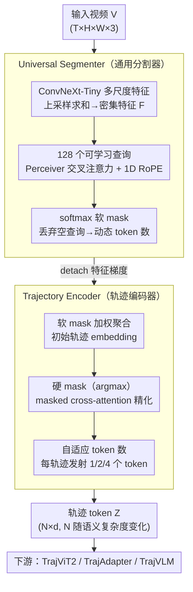

# TrajTok: Learning Trajectory Tokens Enhances Video Understanding

**会议**: CVPR2026  
**arXiv**: [2602.22779](https://arxiv.org/abs/2602.22779)  
**代码**: 待确认  
**领域**: 视频分割 / 视频理解  
**关键词**: 视频 tokenization, 轨迹 token, 端到端分割, 视频 CLIP, VLM 连接器, token 压缩, 目标轨迹

## 一句话总结

提出 TrajTok——一种端到端可微的轨迹 tokenizer，将视频像素隐式聚类为目标轨迹 token，取代外部分割+跟踪流水线；在从头训练 (TrajViT2)、特征适配 (TrajAdapter) 和视觉语言模型连接器 (TrajVLM) 三种场景下均取得显著提升，尤其在长视频 QA 上大幅超越 patch pooling。

## 背景与动机

1. **视频 token 数量爆炸**：当前视频 Transformer 通过时空 patch 进行 tokenization，token 数量随分辨率和帧数线性甚至二次增长，导致严重的内存瓶颈。
2. **现有 token 削减方法不足**：Token pruning/merging 方法（如 TokenLearner、RLT）要么需要预设 token 数而无法适应输入复杂度，要么对场景运动敏感、鲁棒性差。
3. **TrajViT 的局限**：先行工作 TrajViT 提出基于目标轨迹的 tokenization 范式，首次证明分组后 token 在所有任务上优于原始 patch token，但依赖外部 SAM+SAM2 分割跟踪流水线——速度慢、不可训练、语义粒度固定。
4. **任务不可知的语义粒度**：通用分割模型产生的轨迹粒度对下游任务未必最优（例如舞蹈分析需细粒度身体部位 vs. 编队识别需整体 token），无法根据任务自适应调整。
5. **像素级完美分割非必需**：传统分割模型大量计算用于像素级精确 mask，但高层理解任务更依赖语义分组正确性而非边界精度。
6. **扩展性瓶颈**：TrajViT 在数据规模从 1M 扩展到 8M 时性能增益急剧下降，说明固定分割管道限制了模型的可扩展性。

## 方法详解

### 整体框架

TrajTok 由两个可微分模块组成，联合训练：

- **Universal Segmenter**：对输入视频进行隐式聚类，在单次前向传播中产生目标轨迹 mask。
- **Trajectory Encoder**：根据 mask 聚合像素/特征，生成紧凑的轨迹 token。

输入 $\mathbf{V} \in \mathbb{R}^{T \times H \times W \times 3}$，输出 $\mathbf{Z} \in \mathbb{R}^{N \times d}$，其中 $N$ 随场景语义复杂度动态变化。

### 核心设计

**1. Universal Segmenter（通用分割器）：单次前向把视频隐式聚类成轨迹 mask**

- **逐帧特征提取**：使用轻量 ConvNeXt-Tiny 提取多尺度特征图，上采样到 1/4 分辨率后求和得到密集特征 $\mathbf{F} \in \mathbb{R}^{T \times h \times w \times d}$。
- **可学习查询聚类**：引入 $N_q=128$ 个可学习查询 $\mathbf{Q}$，通过 Perceiver 层的交叉注意力与特征交互，对特征施加 1D RoPE 编码时空位置。
- **软分割**：查询与特征点积后 softmax 得到软 mask $\mathbf{M}^{\text{soft}} \in [0,1]^{N_q \times T \times h \times w}$；空 mask 的查询被丢弃，实现动态 token 数。
- **梯度截断**：detach 特征 $\mathbf{F}$ 进入 Perceiver 前的梯度，防止 patch 特征与查询之间的不稳定共适应。

**2. Trajectory Encoder（轨迹编码器）：按 mask 聚合像素，输出自适应数量的轨迹 token**

- **软聚合初始化**：用软 mask 对特征加权求和得到初始轨迹 embedding $\mathbf{z}_k^{\text{init}}$，保证梯度回传。
- **硬 mask 精化**：对 $\mathbf{M}^{\text{soft}}$ 取 argmax 得到硬 mask $\mathbf{M}^{\text{hard}}$，用 masked cross-attention 精化 token 表示，确保解纠缠。
- **自适应 token 数**：受 Matryoshka 表示启发，每条轨迹可发射 $n \in \{1,2,4\}$ 个 token；多 token 用 Fourier 位置编码初始化以鼓励多样性；训练时随机采样 $n$，推理时根据计算预算调整。

### 损失函数

- **分割损失**：Dice loss + Focal loss（不使用交叉熵）；Dice loss 保证发现所有目标区域，Focal loss 处理类别不平衡。
- **下游损失**：CLIP 对比学习损失（TrajViT2），分类损失（TrajAdapter），或 VLM 自回归损失（TrajVLM）。
- 分割损失与下游损失联合优化（TrajViT2 设定），或预训练 segmenter 后冻结（TrajAdapter/TrajVLM 设定）。

## 实验关键数据

### 场景一：TrajViT2（从头训练视频编码器，CLIP 目标）

在 4M 视频 + 15M 图像上训练 ViT-Large 级别编码器：

| 模型 | K400 (Top-1) | SSv2 (Top-1) | ActivityNet txt2vid R@5 | VATEX vid2txt R@5 |
|------|-------------|-------------|------------------------|-------------------|
| ViT3D | 54.2 | 46.3 | 37.1 | 60.2 |
| TokenLearner | 52.9 | 42.4 | 36.4 | 58.8 |
| TrajViT | 55.3 | 45.7 | 38.4 | 61.1 |
| **TrajViT2** | **59.1** | **48.7** | **40.1** | **65.0** |

- K400 上比 ViT3D 高 **+4.9%**，比 TrajViT 高 **+3.8%**。
- 检索任务上 ActivityNet vid2txt R@5 比 TrajViT 高 **+4.1%**。
- 推理 FLOPs 与最高效的 ViViT 接近，远低于 TrajViT 的外部流水线开销。

### 场景二：TrajAdapter（特征适配器）

在 VideoMAE-v2-Huge 和 V-JEPA2-Huge 冻结特征上插入 TrajTok：

| 方法 | V-JEPA2 K400 | V-JEPA2 SSv2 |
|------|-------------|-------------|
| Linear probing | 84.5 | 73.7 |
| Attentive probing | 85.1 | 74.2 |
| **TrajAdapter (4 tok/traj)** | **88.0** | **75.1** |

TrajAdapter 在 V-JEPA2 上将 K400 准确率从 85.1% 提高到 **88.0%**（+2.9%）。

### 消融实验

**Segmenter 设计消融**（Table 4）：

| 变体 | VEQ (%) | STQ (%) | Retrieval R@5 |
|------|---------|---------|---------------|
| 默认 | 42.3 | 70.1 | 22.1 |
| 去 Dice loss | 39.0 (↓3.3) | 68.9 (↓1.2) | 16.7 (↓5.4) |
| 不 detach 梯度 | 34.1 (↓8.2) | 59.3 (↓10.8) | 18.3 (↓3.8) |
| 去层次特征 | 39.3 (↓3.0) | 66.2 (↓3.9) | 19.2 (↓2.9) |

**Encoder 设计消融**（Table 5）：去除硬 attention mask 导致 R@5 下降 4.7-5.1%，证明轨迹解纠缠至关重要。

## 亮点

- **端到端可微**：首个将轨迹分割和视频 tokenization 统一为端到端可训练模块的工作，下游任务可反向传播调整分割粒度。
- **三场景通用**：同一模块可作为 tokenizer（TrajViT2）、feature adapter（TrajAdapter）或 VLM connector（TrajVLM），展现极强通用性。
- **自适应语义粒度**：CLIP 目标训练后分割粒度自动调整——前景物体分割更细、背景合并更多（如 Figure 3 所示）。
- **长视频优势突出**：TrajVLM 在 LongVideoBench 上比 PatchVLM 高 **+8.8%**，在 LVBench 上高 **+5.4%**，轨迹 token 天然适合长程推理。
- **参数与效率优异**：整个 tokenizer 仅 46M 参数（ViT-Large 的 1/7），推理 FLOPs 与最优 token merging 方法相当。

## 局限与展望

1. **像素级分割精度欠佳**：轻量设计 + 低分辨率输出导致小物体遗漏、背景过度合并和边界不精确，不适用于需精确 mask 的任务（如实例分割评测）。
2. **ImageNet 性能略低**：单物体简单场景下分割器产生过少 token，限制细粒度判别能力。
3. **TrajVLM 短视频表现不一**：在部分短视频 QA 上性能反而低于 patch pooling，说明轨迹 token 对简单短视频可能不如 patch 直接。
4. **伪标签依赖**：Segmenter 预训练仍然依赖 TrajViT 外部管道生成的伪标签，未完全摆脱对 SAM/SAM2 模型的依赖。
5. **TrajVLM 规模受限**：仅在 Qwen3-4B 上验证，未扩展到 70B+ 级别模型，大规模效果待验证。

## 与相关工作的对比

| 维度 | TrajViT (前作) | TrajTok (本文) |
|------|--------------|---------------|
| 轨迹生成 | 外部 SAM+SAM2 管道 | 端到端轻量 segmenter |
| 分割精度 | 像素级精确 | 粗粒度语义分组 |
| 可训练性 | 不可微，冻结 | 完全可微，联合训练 |
| 任务适应 | 固定粒度 | 下游目标自适应调整 |
| 扩展性 | 数据增大时增益递减 | 持续扩展 |
| 参数开销 | SAM2 本身 304M+ | tokenizer 仅 46M |
| 效率 | 流水线延迟高 | 单次前向传播 |

与 TokenLearner 和 RLT 等 token merging 方法对比：TrajTok 在检索和分类上均大幅领先，且推理效率相当。

## 评分

- 新颖性: ⭐⭐⭐⭐ — 将轨迹 tokenization 从外部管道推进到端到端可微框架，思路清晰且影响面广
- 实验充分度: ⭐⭐⭐⭐⭐ — 三个场景（预训练/适配/VLM）全面验证，消融充分，扩展性分析完整
- 写作质量: ⭐⭐⭐⭐ — 结构清晰，motivation 层层递进，图表信息量大
- 价值: ⭐⭐⭐⭐⭐ — 轨迹 tokenizer 具有极强通用性，对视频理解效率和长视频推理有重要推动

<!-- RELATED:START -->

## 相关论文

- [\[CVPR 2026\] META: Meta Evolution of Tool Trajectory Adaptation for Long-Video Understanding](meta_meta_evolution_of_tool_trajectory_adaptation_for_long-video_understanding.md)
- [\[ICCV 2025\] Trokens: Semantic-Aware Relational Trajectory Tokens for Few-Shot Action Recognition](../../ICCV2025/video_understanding/trokens_semantic-aware_relational_trajectory_tokens_for_few-shot_action_recognit.md)
- [\[CVPR 2026\] DeRVOS: Decoupling Consistent Trajectory Generation and Multimodal Understanding for Referring Video Object Segmentation](dervos_decoupling_consistent_trajectory_generation_and_multimodal_understanding_.md)
- [\[CVPR 2026\] FlashMotion: Few-Step Controllable Video Generation with Trajectory Guidance](flashmotion_fewstep_controllable_video_generation.md)
- [\[CVPR 2026\] Affordance-First Decomposition for Continual Learning in Video–Language Understanding](affordance-first_decomposition_for_continual_learning_in_video-language_understa.md)

<!-- RELATED:END -->
