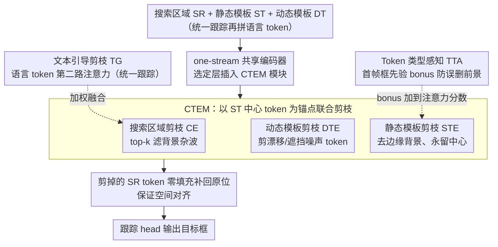

# UTPTrack: Towards Simple and Unified Token Pruning for Visual Tracking

**会议**: CVPR2026  
**arXiv**: [2602.23734](https://arxiv.org/abs/2602.23734)  
**代码**: [EIT-NLP/UTPTrack](https://github.com/EIT-NLP/UTPTrack)  
**领域**: 视频理解 / 视觉目标跟踪  
**关键词**: token pruning, visual object tracking, one-stream transformer, 多模态跟踪, 统一跟踪, 注意力引导剪枝

## 一句话总结

提出 UTPTrack，首个在 one-stream Transformer 跟踪器中**同时对搜索区域 (SR)、动态模板 (DT) 和静态模板 (ST) 三个组件进行联合 token 剪枝**的统一框架，在 RGB 和多模态/语言引导跟踪中实现 65–67% 的视觉 token 裁减，且保持 99.7%–100.5% 的基线性能。

## 研究背景与动机

**One-stream Transformer 跟踪器性能优异但计算量大**：以 OSTrack、SUTrack 为代表的 one-stream 架构将模板与搜索区域联合编码，获得更强的全局特征表示，但 Transformer 的二次复杂度加上大量视频 token 使实时部署困难。

**现有 token 剪枝方法只针对单一组件**：已有工作（如 OSTrack 的 CE、ProContEXT）仅剪枝搜索区域或动态模板，忽略了 SR、DT、ST 三者之间的相互依赖关系。

**孤立剪枝导致次优决策**：不同组件的冗余程度不均，分别处理无法捕捉跨组件关系，可能误删有用 token 或遗留大量冗余，降低空间一致性和语义完整性。

**多模态场景下问题更加严重**：统一跟踪需要对齐 RGB 与深度/热红外/事件/语言等模态信息，孤立剪枝会破坏跨模态对齐。

**外部启发式或辅助模块增加额外开销**：ToMe 依赖双向软匹配、DynamicViT 需要额外 MLP 预测显著性，引入结构修改和额外计算。

**缺少面向统一跟踪的通用高效化方案**：已有高效方法多针对 RGB 单模态，能否用一套剪枝策略同时服务 RGB、RGBD、RGBT、RGBE、RGB-Language 五类任务仍然空白。

## 方法详解

### 整体框架

UTPTrack 想在 one-stream Transformer 跟踪器上做一套通用的高效化方案：它把搜索区域 SR、静态模板 ST、动态模板 DT（以及语言 token）拼起来送进共享编码器，在选定的编码层插入轻量的 **CTEM（Candidate or Template Elimination Module）**，直接用注意力权重算 token 重要性分数并剪枝；剪掉的 SR token 再用零填充补回原空间位置，保证跟踪 head 的空间对齐。和以往只剪单一组件不同，它对三个组件联合建模冗余。CTEM 内部对 SR、DT、ST 三路分别做注意力引导剪枝（CE / DTE / STE），并由 Token 类型感知（TTA）的框先验和文本引导（TG）的语言信号两路先验调节保留决策。

### 关键设计

**1. 搜索区域剪枝 (CE)：用模板中心当锚点滤掉背景杂波**

以 ST 中心 token 的 query 与所有 SR token 的 key 算注意力相似度 $\omega_x = \text{softmax}(Q_{sz'}K_x^T / \sqrt{d_k})$，保留 top-k、去掉背景杂波 token。

**2. 动态模板剪枝 (DTE)：剪掉漂移/遮挡引入的噪声模板 token**

同样以 ST 中心 token 为锚点算 DT token 相似度 $\omega_{dz}$，把因漂移、遮挡、外观变化混进来的噪声 token 剪掉。

**3. 静态模板剪枝 (STE)：去掉模板边缘背景、永远留住中心**

计算 ST 内部 token 对中心 token 的相似度 $\omega_{sz}$，移除边缘背景 token，但始终保留中心 token。

**4. Token 类型感知策略 (TTA)：用首帧框先验防止误删前景**

针对"纯注意力分数可能误删前景"，用第一帧目标 bounding box 构二值 mask，把 patch 级前景分数作为 bonus 加到注意力分数上；提供 full bonus（框内全像素才加）、soft bonus（均值，默认）、all bonus（任一像素在框内即加）三种策略保护前景 token。

**5. 文本引导剪枝 (TG)：在语言任务里让文本也参与决定保留哪些 token**

RGB-Language 任务中语言 token（CLIP-L 编码）与视觉 token 双向注意力交互，token 重要性由 ST 中心 token 和语言 token 两路注意力加权求和共同决定：$\omega_x = \phi(\text{softmax}(Q_{sz'}K_x^T/\sqrt{d_k}) + \text{softmax}(Q_tK_x^T/\sqrt{d_k}))$。

### 损失函数

- **RGB 跟踪**：$\mathcal{L}_{\text{RGB}} = \lambda_{\text{cls}}\mathcal{L}_{\text{cls}} + \lambda_{\text{giou}}\mathcal{L}_{\text{giou}} + \lambda_{L_1}\mathcal{L}_{L_1}$，其中 $\lambda_{\text{cls}}=1, \lambda_{\text{giou}}=2, \lambda_{L_1}=5$。
- **统一跟踪**：增加任务识别交叉熵损失 $\mathcal{L}_{\text{Unified}} = \mathcal{L}_{\text{RGB}} + \lambda_{\text{task}}\mathcal{L}_{\text{task}}$，$\lambda_{\text{task}}=1$。

## 实验

### 主要结果

在 10 个基准上进行评估，覆盖 RGB (LaSOT, LaSOText, TrackingNet, GOT-10k) 和多模态 (VOT-RGBD22, LasHeR, RGBT234, VisEvent, TNL2K, OTB99) 任务：

| 模型 | 基线 | 视觉 token 裁减 | MACs 降低 | 基线性能保持 |
|------|------|:---:|:---:|:---:|
| UTPTrack-O384 | OSTrack-384 | 65.4% | 31.3% (78G→53G) | 99.7% |
| UTPTrack-S384 | SUTrack-B384 | 67.5% | 28.4% (67G→48G) | 100.5% |
| UTPTrack-O256 | OSTrack-256 | 64.8% | 30.7% | 99.7% |
| UTPTrack-S224 | SUTrack-B224 | 69.4% | 28.9% | 100.0% |

在受控预算实验（Controlled-Budget）中，固定 token 保留比例为 87.2%/75.5%/65.6% 三档，UTPTrack 在所有档位均优于 CE、ToMe、EViT、DynamicViT。

### 消融实验

| 配置 | 平均视觉 token | MACs (G) | 平均性能 | Δ |
|------|:---:|:---:|:---:|:---:|
| Baseline (OSTrack256) | 384 | 34.5 | 100.0% | - |
| + CE | 217 | 27.0 | 99.3% | -0.7% |
| + DTE | 176 | 25.4 | 99.6% | +0.3% |
| + STE | 135 | 23.8 | 98.9% | -0.7% |
| + TTA | 135 | 23.8 | 99.7% | +0.8% |

统一跟踪消融（SUTrack224）：依次加入 CE → DTE → STE → TTA → TG，最终 token 从 294 降至 90（69.4% 裁减），性能恢复至 100.0%。

### 关键发现

- **剪枝可起正则化作用**：在适度剪枝下 UTPTrack 甚至超过基线（UTPTrack-S384 达 100.5%），表明去除冗余/噪声 token 能集中注意力到显著区域。
- **TTA 带来显著恢复**：bounding box 先验通过 soft bonus 策略有效避免前景 token 被误删，在 RGB 上恢复 +0.8%，统一跟踪上 +0.4%。
- **TG 对语言引导任务有额外增益**：在包含语言模态时，文本引导剪枝额外带来 +0.3% 的性能提升。
- **压缩率越高优势越大**：在 64.6% 的极端裁减下，UTPTrack 仍保持 99.3%（统一跟踪），而 DynamicViT 崩溃至 14.7%、ToMe 降至 92.5%。

## 亮点

- **首个三组件联合剪枝**：突破已有方法只剪搜索区域或动态模板的局限，首次对 SR+DT+ST 统一建模冗余。
- **无需额外参数/模块**：直接复用 Transformer 自身注意力权重指导剪枝，不增加可训练参数，架构无关。
- **Token 类型感知 + 文本引导双重先验**：前者利用空间先验保护前景，后者利用语义先验增强多模态剪枝，两者正交互补。
- **跨模态通用性强**：一套框架同时服务 RGB、RGBD、RGBT、RGBE、RGB-Language 五类任务，在 10 个基准上验证。

## 局限性

- 实际 GPU 加速有限：token 数减少 65% 但 FPS 增益较小（OSTrack384 从 40→47 FPS），因 zero-padding 恢复空间布局会抵消部分收益。
- 仅在 OSTrack 和 SUTrack 上验证，未扩展到更多跟踪架构（如 SeqTrack、ARTrack）。
- ST 的 TTA 策略依赖第一帧 bounding box 的准确性，对初始标注不准的场景可能敏感。
- 语言引导剪枝仅使用单个 CLIP token 表示文本，语义粒度较粗，复杂文本描述的利用受限。

## 相关工作

- **One-stream 跟踪器**：OSTrack (ECCV'22)、SUTrack (ECCV'24)、MixFormerV2 等联合编码模板+搜索区域。
- **Token 剪枝/合并**：CE (OSTrack)、ProContEXT 仅剪 SR；ToMe 做双向软匹配合并；EViT 按 CLS attention 保留；DynamicViT 用 MLP 预测显著性。
- **统一多模态跟踪**：UnTrack 学习共享低秩潜在空间；SUTrack 统一五类任务；参数高效适配方法（prompt/adapter）注入模态信息。

## 评分

- 新颖性: ⭐⭐⭐⭐ — 首次三组件联合剪枝 + token 类型感知 + 文本引导，方向明确且有实际意义
- 实验充分度: ⭐⭐⭐⭐⭐ — 10 个基准、两种基线、三档受控预算、详细消融和渐进剪枝分析
- 写作质量: ⭐⭐⭐⭐ — 结构清晰，公式推导完整，图表丰富
- 价值: ⭐⭐⭐⭐ — 方法简洁通用，对 one-stream 跟踪器高效化有较强参考价值，但实际加速幅度需进一步提升

<!-- RELATED:START -->

## 相关论文

- [\[CVPR 2026\] An Efficient Token Compression Framework for Visual Object Tracking](an_efficient_token_compression_framework_for_visual_object_tracking.md)
- [\[CVPR 2025\] DivPrune: Diversity-Based Visual Token Pruning for Large Multimodal Models](../../CVPR2025/video_understanding/divprune_diversity-based_visual_token_pruning_for_large_multimodal_models.md)
- [\[ICML 2026\] Unified Multimodal Visual Tracking with Dual Mixture-of-Experts](../../ICML2026/video_understanding/unified_multimodal_visual_tracking_with_dual_mixture-of-experts.md)
- [\[CVPR 2026\] Drift-Resilient Temporal Priors for Visual Tracking](drift-resilient_temporal_priors_for_visual_tracking.md)
- [\[CVPR 2026\] Unified Spatiotemporal Token Compression for Video-LLMs at Ultra-Low Retention](unified_spatiotemporal_token_compression_for_video-llms_at_ultra-low_retention.md)

<!-- RELATED:END -->
