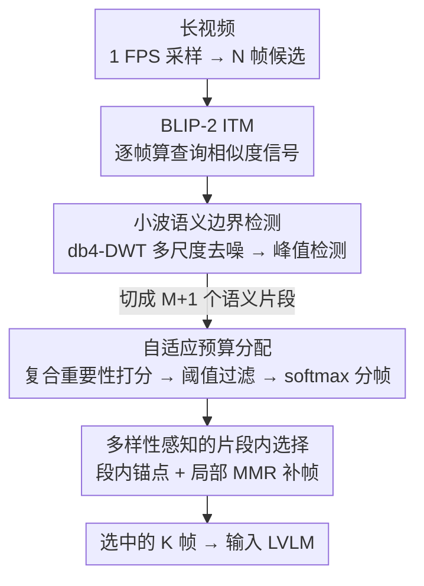

# Wavelet-based Frame Selection by Detecting Semantic Boundary for Long Video Understanding

**会议**: CVPR2026  
**arXiv**: [2603.00512](https://arxiv.org/abs/2603.00512)  
**代码**: [MAC-AutoML/WFS-SB](https://github.com/MAC-AutoML/WFS-SB)  
**领域**: 视频理解  
**关键词**: 帧选择, 长视频理解, 小波变换, 语义边界检测, 大视觉语言模型, 免训练

## 一句话总结

提出 WFS-SB，一种免训练的帧选择框架，利用小波变换从查询-帧相似度信号中检测语义边界，将视频分割为语义连贯的片段后自适应分配帧预算并做多样性采样，在 VideoMME/MLVU/LongVideoBench 上大幅超越 SOTA。

## 背景与动机

1. **长视频帧冗余严重**：长视频通常包含数千帧，而 LVLM 的上下文窗口和计算资源均有限，直接处理所有帧不可行，帧选择成为部署 LVLM 处理长视频的关键前置步骤。
2. **现有方法忽视叙事结构**：主流帧选择方法仅选取与查询相关性最高的帧，得到的帧集合是离散的、无序的，无法捕捉视频的因果关系和过程发展（如化妆教程中只选到含"眼睛"的散乱帧，丢失了先画眼线、再修眉的流程）。
3. **语义转变才是关键**：有效的视频理解不仅需要"哪些帧相关"，更需要捕捉"故事在何时发生转折"——即语义边界处的关键过渡时刻。
4. **相似度信号噪声大**：查询-帧 ITM 分数受模型不确定性、跨模态歧义和视觉伪影（光照变化、遮挡、相机运动）影响，高频噪声严重干扰语义边界的直接检测。
5. **信号非平稳且多尺度**：视频内容动态变化导致相似度信号统计特性随时间剧烈变化，同时语义片段跨度从几帧到数百帧不等，传统傅里叶变换等全局分析工具无法同时捕捉时间位置和频率信息。
6. **替代方案各有不足**：扩展上下文窗口计算开销大，视频转文本摘要会丢失关键视觉细节，训练式帧选择需大量数据且迁移性差。

## 方法详解

### 整体框架

WFS-SB 想解决的是「长视频帧太多、选帧却只盯着相关性、丢了故事的来龙去脉」这个矛盾。它的核心思路是：先把每帧与查询的匹配分数排成一条时间信号，从信号里找出「故事发生转折」的语义边界，再围绕这些边界把视频切成语义连贯的片段，逐段分配帧预算、逐段挑代表帧。整条流水线是：1 FPS 采样得到候选帧 → BLIP-2 算出查询-帧相似度信号 → 小波分解去噪后做峰值检测得到语义边界 → 按片段重要性分配帧预算 → 每段内用局部 MMR 选出兼顾相关性与多样性的帧。全程免训练，只是把现成的相似度分数做了一次「信号处理」。

### 关键设计

**1. 小波语义边界检测：从带噪相似度信号里找出故事的转折点**

主流帧选择只会挑「与查询最像」的帧，得到一堆离散无序的帧，化妆教程里可能只剩一堆「眼睛」帧，先画眼线再修眉的流程全丢了。WFS-SB 的出发点是：真正重要的是语义在哪一刻发生转变。但直接在相似度信号上找转折点行不通——ITM 分数被模型不确定性、跨模态歧义和光照/遮挡/相机运动等视觉伪影污染，高频噪声严重；而且信号既非平稳（统计特性随时间剧变）又是多尺度的（语义片段从几帧到数百帧不等），傅里叶这类全局工具没法同时定位时间和频率。小波变换恰好能在时间-频率两个维度上局部化分析，这是它被选中的根本原因。

具体做法：对 1 FPS 采样的 $N$ 帧用 BLIP-2 的 ITM 头算出每帧匹配分数 $s_t = \mathcal{M}(q, f_t)$，得到时间相似度信号；再用 Daubechies-4 (db4) 小波做离散小波变换 (DWT)，分解层数自适应于视频长度 $J = \max(1, \lfloor \log_2 N \rfloor - l)$（$l=3$），长视频分解更深、关注粗粒度趋势，短视频保留时间细节。关键一步是只保留最粗尺度的细节系数 $d_J$、其余置零再做逆变换 (IDWT) 重建出干净的语义变化信号 $\tilde{s}_t$——细尺度系数承载的正是高频噪声，丢掉它们等于天然去噪。最后在变化强度 $c_t = |\tilde{s}_t|$ 上做带自适应阈值的峰值检测，峰值索引 $\mathcal{B} = \{b_1, \ldots, b_M\}$ 就把视频切成了 $M+1$ 个语义连贯片段。消融里把这一步换成局部极小值检测，MLVU 直接掉 3.3%，说明多尺度去噪而非简单找极值才是关键。

**2. 自适应预算分配：把有限的帧预算压在真正重要的片段上**

切出片段后，若给每段平均分帧，冗长的过场片段会和关键片段抢预算。WFS-SB 给每个片段算一个复合重要性分数，把片段时长、平均相关性、峰值相关性和内部多样性四个维度融在一起：

$$\text{Imp}(\mathcal{G}_i) = w_d \cdot \frac{|\mathcal{G}_i|}{N} + w_a \cdot \bar{s}_i + w_m \cdot s_i^{\max} + w_v \cdot \frac{\sigma_i^2}{\sigma_{\text{global}}^2}$$

权重 $(w_d, w_a, w_m, w_v)=(0.4, 0.2, 0.3, 0.1)$，时长和峰值相关性占大头。接着用一个统计阈值 $\tau = \text{mean}(\text{Imp}) - 1.2 \cdot \text{std}(\text{Imp})$ 把明显不重要的片段直接剔除，让预算集中到显著内容；剩下的片段对其重要性做 softmax 按比例瓜分总预算 $K$，分配后的余数贪心给小数部分最大的片段。这样资源就自然向「故事密度高」的片段倾斜，而不是被均匀稀释。

**3. 多样性感知的片段内选择：每段独立挑出既相关又不重复的代表帧**

片段拿到自己的帧配额后，若只在段内取 top-K 相关帧，容易选到一堆几乎一样的画面。WFS-SB 先在每段挑出相关性最高的帧作锚点，再用局部化的 MMR（Maximal Marginal Relevance）迭代补齐其余帧：

$$t^* = \arg\max_{t \in \mathcal{G}_i \setminus \mathcal{T}_i} \big[\lambda \cdot s_t - (1-\lambda) \cdot \max_{t' \in \mathcal{T}_i} \text{sim}(f_t, f_{t'})\big]$$

$\lambda = 0.5$ 让查询相关性与视觉多样性各占一半。这里「局部化」是要点——MMR 只在片段内部比较，不跨段做去重，从而避免不同片段间视觉相似的帧互相压制，保证每个片段都能独立拿到能代表自己的帧。消融里去掉 MMR 改用 topK，VideoMME 掉到 60.9，改均匀采样更掉到 59.2，说明段内多样性这一步同样不可省。

### 一个完整示例

以一个采样出 $N=300$ 帧的长视频、总帧预算 $K=8$ 为例：先算出 300 个 ITM 分数排成信号，自适应分解层数 $J = \max(1, \lfloor\log_2 300\rfloor - 3) = 5$，去噪重建后峰值检测找到 4 个语义边界，把视频切成 5 个片段。给 5 段算重要性分数后，一个低于阈值 $\tau$ 的过场段被剔除，剩 4 段做 softmax 把 8 帧按比例分成比如 3/2/2/1。最后每段内部用局部 MMR 各自挑帧：3 帧的段先取相关性最高的锚点，再依次补两帧时都要扣掉与已选帧的视觉相似度，避免选到近乎重复的画面。最终 8 帧既覆盖了 4 个语义阶段、又在每段内部保持了多样性，而不是像均匀采样那样散落在无关帧上。

### 损失函数 / 训练策略

本方法完全免训练，不涉及任何损失函数。所有超参数在全部 LVLM backbone、benchmark 和帧预算下用统一默认值，无需任务级调参：db4 小波、drift factor $l=3$、重要性权重 $(w_d, w_a, w_m, w_v)=(0.4, 0.2, 0.3, 0.1)$、过滤因子 $\eta=1.2$、MMR 参数 $\lambda=0.5$。敏感性实验显示 $\lambda \in [0.3, 0.7]$ 时 VideoMME 仅波动 0.4%，鲁棒性极强。

## 实验关键数据

### 主实验：多 benchmark 多模型对比

| 模型 | 方法 | 帧数 | VideoMME (Δ) | MLVU (Δ) | LVB (Δ) |
|------|------|------|-------------|----------|---------|
| LLaVA-Video-7B | AKS | 8 | 60.1 (+3.9) | 64.2 (+6.8) | 59.6 (+4.7) |
| LLaVA-Video-7B | **WFS-SB** | 8 | **61.7 (+5.5)** | **66.9 (+9.5)** | **61.1 (+6.2)** |
| Qwen2.5-VL-7B | A.I.R. | ≤32 | 65.0 (+4.2) | 67.5 (+8.2) | 61.4 (+3.3) |
| Qwen2.5-VL-7B | **WFS-SB** | 32 | **64.4 (+3.2)** | **70.4 (+10.7)** | **64.4 (+5.5)** |
| InternVL3-8B | A.I.R. | ≤32 | 68.2 (+2.6) | 74.5 (+6.1) | 62.8 (+4.5) |
| InternVL3-8B | **WFS-SB** | 32 | 67.4 (+1.8) | **74.8 (+6.4)** | **62.9 (+4.4)** |

跨 4 个 LVLM 的平均提升：VideoMME +3.9%，MLVU +8.8%，LVB +5.4%。

### 消融实验

| 配置 | VideoMME | MLVU |
|------|----------|------|
| Uniform Sampling | 57.7 | 56.2 |
| **WFS-SB (完整)** | **61.9** | **67.9** |
| w/o DWT (局部极小值) | 60.8 | 64.6 (-3.3) |
| w/o DWT (梯度法) | 61.2 | 66.8 |
| w/o 自适应预算 (均匀分配) | 61.6 | 67.4 |
| w/o MMR (topK) | 60.9 | 66.7 |
| w/o MMR (均匀采样) | 59.2 | 62.7 |

- 小波变换对 MLVU 提升最为关键（替换为局部极小值降 3.3%），验证了多尺度分解抑制噪声的核心假设。
- 模型规模消融（Qwen2.5-VL 3B→72B）：各规模均获稳定提升（+2.2%~+4.3%），收益与模型规模正交。
- 小波族鲁棒性：Db4/Db8/Sym4/Bior3.3 在 VideoMME 上均达 61.9%，仅 Haar 略低（61.3%），说明多尺度分解本身而非特定基函数是关键。
- 计算开销：ITM 提取 19.4s，小波处理+MMR 仅 0.7s，总额外开销极小。

### 帧预算敏感性

在 VideoMME 上对 4 个 backbone 测试 K∈{8,16,32,64}，WFS-SB 在所有预算下均一致优于均匀采样（+1.2%~+5.5%），且小预算（K=8,16）时提升更大，说明语义边界感知在帧资源紧张时价值更突出。

## 亮点

- **新颖视角**：将帧选择从"选最相关帧"转变为"检测语义转折点"，从信号处理角度重新定义问题，小波变换在视频帧选择中的应用具有创新性。
- **三特性分析精准**：从非平稳性、多尺度结构、低信噪比三个维度分析 ITM 信号特性，自然推导出小波变换的必要性，论证链条完整。
- **免训练即插即用**：无需微调或修改模型架构，直接作为 LVLM 的前处理模块，兼容多种 backbone。
- **统一超参数**：所有实验使用相同默认参数，无需针对不同模型/数据集/帧预算调参，实用性极强。
- **效果显著**：在帧预算紧张（K=8）时提升尤为突出（MLVU +9.5%），证明语义边界感知在资源受限时价值最大。

## 局限与展望

- **ITM 计算瓶颈**：BLIP-2 ITM 信号提取占总时间 79%（19.4s），对实时应用仍有压力，可通过批处理、量化或蒸馏加速。
- **依赖外部 VLM**：语义信号质量受 ITM 模型能力限制，不同 VLM scorer 表现有差异（CLIP-VIT-B 比 BLIP 系列弱）。
- **固定 1 FPS 采样**：预采样率固定，可能在极长视频（数小时级别）中产生过多候选帧增加 ITM 计算量，或在快速动作视频中遗漏关键帧。
- **单查询驱动**：边界检测依赖单一查询，对多轮对话或无查询的通用视频摘要场景适用性有限，未来可探索无查询的自适应语义分割。
- **小波参数虽鲁棒但仍为手动设定**：drift factor $l=3$ 和权重组合虽实验表明不敏感，但缺乏自动选择机制。
- **未考虑音频模态**：仅基于视觉-文本匹配分数，未利用视频中的音频信息（如对话切换、背景音乐变化）辅助语义边界检测。
- **片段过滤可能丢信息**：基于统计阈值 $\tau$ 的片段过滤在某些 edge case 下可能误删包含关键低相关性但叙事必要的片段。

## 与相关工作的对比

- **vs. KFC/BOLT/AKS**：这些方法关注帧级相关性采样，忽视视频叙事结构，WFS-SB 在所有设置下一致超越（如 vs. AKS: VideoMME +1.6%, MLVU +2.7%, LVB +1.5%）。
- **vs. Frame-Voyager/FrameOracle（训练式）**：WFS-SB 无需训练数据和标注，效果更优且泛化性更强，部署成本低。
- **vs. A.I.R.（迭代推理式）**：A.I.R. 需多轮 LVLM 推理，计算开销更大；WFS-SB 单次前向即可完成，在 MLVU 和 LVB 上表现更优。
- **vs. MDP3（马尔可夫决策式）**：WFS-SB 在 Qwen2.5-VL 上 MLVU 超出 4.2%，LVB 超出 4.4%，证明语义结构分割优于序列决策建模。
- **vs. 均匀采样**：全面优于 uniform 基线（VideoMME +4.2%，MLVU +11.7%），帧预算越紧优势越大。

## 评分

- 新颖性: ⭐⭐⭐⭐ — 小波变换检测语义边界用于帧选择是全新视角，信号处理与视频理解的交叉思路很有启发性
- 实验充分度: ⭐⭐⭐⭐⭐ — 4 个 LVLM、3 个 benchmark、多帧预算、多模型规模、多小波族、多 VLM scorer、逐组件消融，非常全面
- 写作质量: ⭐⭐⭐⭐ — 问题动机清晰，从信号非平稳性/多尺度/低信噪比三个特性引出小波变换的必要性，论述有说服力
- 价值: ⭐⭐⭐⭐ — 免训练即插即用、统一超参数、效果显著，对长视频理解落地有直接推动作用
- 总评: ⭐⭐⭐⭐ — 方法简洁优雅，实验扎实，核心洞察（语义边界 > 逐帧相关性）在 3 个 benchmark 上得到充分验证

<!-- RELATED:START -->

## 相关论文

- [\[CVPR 2026\] Efficient Frame Selection for Long Video Understanding via Reinforcement Learning](efficient_frame_selection_for_long_video_understanding_via_reinforcement_learnin.md)
- [\[CVPR 2026\] DIvide, then Ground: Adapting Frame Selection to Query Types for Long-Form Video Understanding](divide_then_ground_adapting_frame_selection_to_query_types_for_long-form_video_u.md)
- [\[CVPR 2026\] META: Meta Evolution of Tool Trajectory Adaptation for Long-Video Understanding](meta_meta_evolution_of_tool_trajectory_adaptation_for_long-video_understanding.md)
- [\[CVPR 2026\] Question-guided Visual Compression with Memory Feedback for Long-Term Video Understanding](question-guided_visual_compression_with_memory_feedback_for_long-term_video_unde.md)
- [\[CVPR 2026\] LongVideo-R1: Smart Navigation for Low-cost Long Video Understanding](longvideo-r1_smart_navigation_for_low-cost_long_video_understanding.md)

<!-- RELATED:END -->
