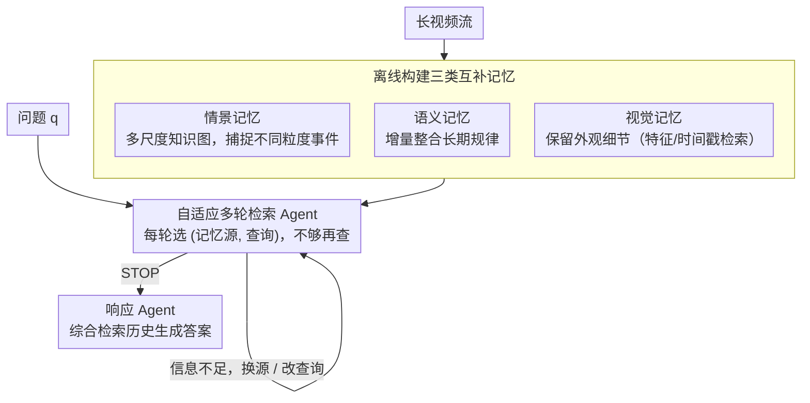

# WorldMM: Dynamic Multimodal Memory Agent for Long Video Reasoning

**会议**: CVPR 2026  
**arXiv**: [2512.02425](https://arxiv.org/abs/2512.02425)  
**代码**: [https://worldmm.github.io](https://worldmm.github.io)  
**领域**: 视频理解 / LLM Agent / 长视频推理  
**关键词**: 多模态记忆、长视频理解、自适应检索、知识图谱、多时间尺度

## 一句话总结
提出 WorldMM，一个基于多模态记忆的视频推理 agent，构建情景记忆（多时间尺度文本知识图）、语义记忆（持续更新的关系知识图）和视觉记忆（帧级检索库）三类互补记忆，通过自适应多轮检索 agent 动态选择最相关的记忆源和时间粒度，在五个长视频 QA 基准上平均超越前 SOTA 8.4%。

## 研究背景与动机

1. **领域现状**：视频 LLM 已在短视频理解上展现强大能力，但扩展到数小时甚至数天的长视频仍极具挑战。现有的记忆增强方法（如 EgoRAG、M3-Agent）通过构建视频段的文本摘要进行外部记忆检索来缓解上下文容量限制。
2. **现有痛点**：两个核心局限——(a) 过度依赖文本表示：几乎所有现有方法将事件转化为文本描述进行检索和推理，丢失了属性识别、空间推理等需要视觉细节的关键信息。即使 M3-Agent 在构建记忆时使用了视觉输入，推理时仍主要依赖文本。(b) 固定时间尺度检索："在哪放了眼镜"可能只需几秒视频，而"下半场发生了什么"需要更长的时间范围，但现有方法检索预定长度的片段（如 3 个 30 秒片段），无法灵活适应不同查询。
3. **核心矛盾**：长视频中信息的多模态性（文本无法完全表达视觉细节）和多尺度性（不同事件跨越不同时间范围）要求记忆和检索系统具备模态与尺度的自适应能力，但现有方法在这两方面都是固定的。
4. **本文目标** (1) 如何同时利用文本和视觉记忆支持推理？(2) 如何跨多个时间尺度检索信息？(3) 如何让模型自主决定何时该看文本、何时该看图像、何时该停？
5. **切入角度**：类比人类记忆系统——情景记忆存储具体事件，语义记忆存储抽象知识，视觉记忆保留感官细节——构建三类互补记忆并通过迭代检索 agent 动态组合。
6. **核心 idea**：三类互补多模态记忆（情景+语义+视觉）+ 自适应多轮检索 agent，实现长视频中按需选择信息模态和时间粒度的推理。

## 方法详解

### 整体框架
WorldMM 把长视频理解拆成"建记忆 → 查记忆 → 答问题"三段。**第一段**离线从视频流构建三种互补记忆：情景记忆（事实事件）、语义记忆（高层概念）、视觉记忆（外观细节）。**第二段**在线由一个检索 Agent 多轮自适应地决定"该问哪种记忆、问什么"，直到信息够用。**第三段**把检索历史连同原始问题交给响应 Agent 生成答案。核心思路是用三种异构记忆覆盖"具体发生了什么 / 长期规律是什么 / 长什么样"三类信息需求，再让 Agent 按需调度。

### 关键设计

**1. 情景记忆：多尺度知识图捕捉不同粒度的事件**

单一时间尺度无法同时容纳"秒级动作"和"小时级叙事"。情景记忆因此在**多个时间分辨率**上索引事件：先在最细尺度 $t_0$ 把视频分段、用 Video LLM 生成 caption，再定义一组尺度 $\mathcal{T} = \{t_0, t_1, ..., t_N\}$（如 30s/3min/10min/1h），在每个尺度上把 caption 转成事实三元组（entity-action-entity）构建知识图 $G_{t_i}$，最终得到一组多尺度图 $\mathcal{M}_e = \{G_{t_0}, ..., G_{t_N}\}$。检索走**粗到细**：先用 PPR（Personalized PageRank）从各尺度图取 top-k 候选，再用 LLM 做跨尺度重排，选出最相关的时间范围与内容。

**2. 语义记忆：增量整合出"长期规律"**

情景记忆是一堆独立事件，无法跨场景沉淀出"用户习惯用厨房湿巾"这类高层知识。语义记忆按较粗尺度 $t_s$ 分段，为每段生成关注**概念**而非具体事件的三元组，并通过 `Consolidate` 持续并入一张进化中的语义图：先用 embedding 相似度找出重叠或冲突的三元组，再用 LLM 判定要删除的过时信息 $T_{remove}$ 与要更新/新增的 $T_{update}$：

$$Consolidate(G_{t_s}^k, T_{t_s}^{k+1}) = (G_{t_s}^k \setminus T_{remove}) \cup T_{update}$$

这一步让记忆能"忘掉旧的、记住新的"，而不是无脑堆积。

**3. 视觉记忆：保留文本说不清的外观细节**

"那个烘焙物是什么/物体什么颜色"这类问题，文本描述常常不够精确。视觉记忆给两种取用方式：(a) **特征检索**——把视频切短片段、用多模态编码器（VLM2Vec-V2）编码为 $\mathcal{M}_v^f = \{f_v^1, ..., f_v^L\}$，按余弦相似度与文本查询匹配；(b) **时间戳检索**——每帧配时间戳存为 $\mathcal{M}_v^I = \{(t_i, I_i)\}$，当情景记忆已锁定时间段后直接取对应帧。前者管"按语义搜图"，后者管"按时间取帧"。

**4. 自适应多轮检索 Agent：决定问谁、何时停**

三种记忆并非一次性全查，而是由检索 Agent $\mathcal{R}$ 调度。它以问题 $q$ 和历史检索结果 $r_{<i}$ 为输入，每轮输出一个（记忆源 $m_i$, 查询 $q_i$）对，或发出 STOP，最多迭代 $N$ 轮。每轮结果并入历史再进入下一轮——第一轮不满意可以换记忆源、改查询，逐步逼近答案。这正是"动态"二字的来源：固定检索策略应付不了千差万别的问题。

### 一个完整 walkthrough（"我上次用的烤箱手套是什么颜色？"）
1. **Round 1**：Agent 判断这是"找具体事件 + 看外观"，先查**情景记忆**——PPR 在多尺度图里检索"使用烤箱手套"事件，跨尺度重排锁定大约第 38 分钟。
2. **Round 2**：时间段已知但颜色文本里没写，Agent 转向**视觉记忆**的时间戳检索，取第 38 分钟附近的帧。
3. **Round 3**：对取回的帧做视觉判别 → "红色"；信息已足，Agent 发出 STOP。
4. **响应**：响应 Agent 综合检索历史输出"红色"。

若问的是"我一般把手套放哪"，则第一轮就会改走**语义记忆**取沉淀好的习惯三元组——这体现了 Agent 按问题类型切换记忆源的能力。

### 训练策略
WorldMM 是 inference-time 框架，**无需额外训练**。记忆构建用 GPT-5-mini，检索与响应 Agent 分别用 GPT-5 或 Qwen3-VL-8B。

> ⚠️ 数据说明：原文涉及的 backbone 命名（如 GPT-5 / GPT-5-mini）笔者未独立核实，以论文原文为准。

## 实验关键数据

### 主实验

| 模型 | EgoLifeQA | Ego-R1 Bench | HippoVlog | LVBench | Video-MME(L) | Avg. |
|------|-----------|-------------|-----------|---------|-------------|------|
| GPT-5 (base) | 48.6 | 46.3 | 75.7 | 60.4 | 74.3 | 61.1 |
| HippoRAG | 59.6 | 56.0 | 63.2 | 54.0 | 52.1 | 57.0 |
| M3-Agent | 53.5 | 52.0 | 65.5 | 49.3 | 55.3 | 55.1 |
| HippoMM | 54.6 | 53.0 | 71.9 | 38.2 | 41.6 | 51.8 |
| WorldMM-8B | 56.4 | 52.0 | 69.7 | 55.4 | 66.0 | 59.9 |
| **WorldMM-GPT** | **65.6** | **65.3** | **78.3** | **61.9** | **76.6** | **69.5** |

### 消融实验
不同记忆组合的效果：

| 配置 | EgoLifeQA | Ego-R1 | HippoVlog | LVBench | Video-MME | Avg. |
|------|-----------|--------|-----------|---------|-----------|------|
| E only | 62.6 | 57.0 | 73.6 | 60.6 | 72.7 | 64.9 |
| V only | 37.2 | 34.2 | 51.3 | 47.4 | 64.2 | 44.9 |
| E+S | 63.4 | 61.0 | 73.8 | 58.8 | 74.1 | 66.8 |
| E+V | 63.3 | 63.0 | 75.2 | 59.8 | 76.0 | 66.9 |
| **E+S+V** | **65.6** | **65.3** | **78.3** | **61.9** | **76.6** | **69.5** |

### 关键发现
- **多模态记忆的互补性**：三种记忆各有贡献——情景记忆是基础（单独 64.9 vs 视觉单独 44.9），视觉记忆显著提升 EntityLog/EventRecall 类问题，语义记忆显著提升 HabitInsight（+23%）和 RelationMap 类问题。
- **自适应检索的必要性**：不同问题类别在记忆利用上存在显著差异——EntityLog 更多使用视觉记忆，HabitInsight 更多使用语义记忆，说明模型确实在动态选择最相关的记忆源。
- **多轮检索提升明显**：允许最多 5 轮检索比单轮检索在 EgoLifeQA 上提升 9.3%，模型可以在第一轮不理想时修正策略。
- **时间定位精度远超基线**：WorldMM 的 tIoU 约 10%，远超其他方法的 2-4%，说明多尺度检索显著改善了时间段定位。
- **效率优势**：通过自适应终止和选择性检索，WorldMM 在延迟-精度权衡上优于所有基线。

## 亮点与洞察
- **人类记忆系统的类比设计**：情景记忆、语义记忆、视觉记忆的划分直接对应心理学中的记忆分类，这种设计具有理论美感且实验证明了每种记忆的独特贡献。可迁移到任何需要长期记忆管理的 AI agent 系统。
- **多尺度情景记忆的精巧设计**：不同尺度的知识图提供了不同粒度的事件信息，粗到细的检索策略天然支持从宏观到微观的信息获取。这个思路可以迁移到文档理解（段落级/句子级/词级检索）。
- **语义记忆的增量整合机制**：通过 embedding 匹配 + LLM 裁决的方式实现知识的持续更新，简洁有效地解决了长期知识维护问题。

## 局限与展望
- 视觉记忆单独使用效果较差（Avg 44.9），说明当前视觉索引和检索技术仍是瓶颈
- 记忆构建阶段依赖 GPT-5-mini，成本和延迟较高
- 对于需要精细时间推理的问题，即使多尺度记忆的 tIoU 也仅约 10%，仍有很大提升空间
- 语义记忆的整合质量取决于 LLM 的判断准确性，可能存在错误传播
- 未探索在记忆构建阶段引入 RL 或反馈机制来提高记忆质量

## 相关工作与启发
- **vs EgoRAG**: EgoRAG 仅使用层次化文本记忆，WorldMM 增加了视觉记忆和语义记忆，并引入自适应检索，在 EgoLifeQA 上从 52.0 提升到 65.6。
- **vs M3-Agent**: M3-Agent 构建以实体为中心的长期记忆并支持迭代推理，但仅依赖文本表示。WorldMM 通过多模态记忆在同等条件下大幅提升（55.1→69.5）。
- **vs HippoMM**: HippoMM 提出双过程记忆（语义摘要+多模态线索），但视觉利用受限。WorldMM 的自适应检索策略更灵活，性能显著更强（51.8→69.5）。

## 评分
- 新颖性: ⭐⭐⭐⭐ 多模态记忆框架的设计有创新，但基于 RAG + LLM agent 的范式已较成熟
- 实验充分度: ⭐⭐⭐⭐⭐ 5 个基准（从小时到周级别）、丰富的消融实验、记忆利用分析、效率分析
- 写作质量: ⭐⭐⭐⭐ 结构清晰，概念图直观，但符号稍多
- 价值: ⭐⭐⭐⭐⭐ 为长视频理解和 AI agent 记忆管理提供了有效的框架范式

<!-- RELATED:START -->

## 相关论文

- [\[CVPR 2026\] VideoSeek: Long-Horizon Video Agent with Tool-Guided Seeking](videoseek_long-horizon_video_agent_with_tool-guided_seeking.md)
- [\[CVPR 2026\] SVAgent: Storyline-Guided Long Video Understanding via Cross-Modal Multi-Agent Collaboration](svagent_storyline_guided_long_video_understanding_via_cross_modal_multi_agent_collaboration.md)
- [\[CVPR 2026\] Question-guided Visual Compression with Memory Feedback for Long-Term Video Understanding](question-guided_visual_compression_with_memory_feedback_for_long-term_video_unde.md)
- [\[ICML 2026\] Video-MTR: Reinforced Multi-Turn Reasoning for Long Video Understanding](../../ICML2026/video_understanding/video-mtr_reinforced_multi-turn_reasoning_for_long_video_understanding.md)
- [\[CVPR 2026\] Video Panels for Long Video Understanding](video_panels_for_long_video_understanding.md)

<!-- RELATED:END -->
