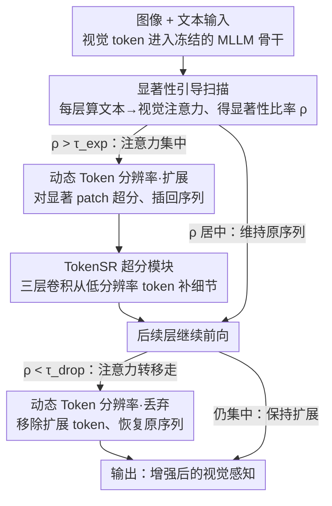

# Blink: Dynamic Visual Token Resolution for Enhanced Multimodal Understanding

**会议**: CVPR 2026  
**arXiv**: [2512.10548](https://arxiv.org/abs/2512.10548)  
**代码**: 无  
**领域**: 多模态大语言模型 / 图像修复（视觉感知增强）  
**关键词**: 视觉token分辨率, 动态注意力, 多模态大语言模型, 显著性引导, token超分辨率

## 一句话总结
提出 Blink 框架，通过在 MLLM 不同 Transformer 层动态扩展和丢弃视觉 token（模拟人类"快速眨眼"式扫描），在单次前向传播中自适应增强视觉感知能力，在多个多模态基准上提升 LLaVA-1.5 性能。

## 研究背景与动机
**领域现状**: 多模态大语言模型（MLLMs）在视觉-语言任务上取得显著进展（LLaVA、Qwen-VL 等），但视觉感知能力仍然不足，容易出现幻觉。

**现有痛点**: 现有 MLLMs 采用传统 LLM 架构处理视觉输入，缺乏对显著视觉区域的显式利用；后处理方法（如先识别显著区域再裁剪二次推理）效率低且只能聚焦单一区域。

**核心矛盾**: 人类通过"扫描-聚焦-转移"的动态过程感知视觉场景，但 MLLMs 对所有视觉 token 一视同仁，无法模拟跨层的注意力转移。

**本文要解决**: 如何在单次前向传播中动态增强 MLLM 的视觉感知能力？

**切入角度**: 先做 pilot study 发现两个关键洞察——(a) 不同层关注不同视觉区域，(b) 对高注意力 token 增加计算量可提升感知能力——然后据此设计动态框架。

**核心idea**: 利用注意力图的非均匀分布，在每层动态决定是否扩展（超分辨率增强）或丢弃视觉 token，模拟人类的"扫描-聚焦-转移"认知过程。

## 方法详解

### 整体框架

Blink 想在一次前向传播里动态增强 MLLM 的视觉感知。它的出发点来自一个 pilot study 的两个发现：不同 Transformer 层关注图像里不同的区域，且对高注意力 token 多投入计算确实能提升感知。于是 Blink 在正常前向传播中插入「扫描-聚焦-转移」的循环——在选定层先算显著性图，若注意力足够集中就用 TokenSR 把显著区域的 token 超分扩展，注意力转移到别处后再把这些扩展 token 丢弃，整个过程模拟人类「快速眨眼」式的视觉扫描，骨干模型保持冻结。

### 关键设计

**1. 显著性引导扫描：用注意力集中度判断该不该增强**

要模拟「聚焦」，先得知道模型此刻在看哪、看得有多确信。在每个参与层 $L$，Blink 计算最后一个文本 token 对所有视觉 token 的注意力 $S_v^{(L)} = q_{t_n}^{(L)} (k_v^{(L)})^\top$，把视觉 token 重塑成 $H \times W$ 网格、切成 $p \times p$ 的 patch 后聚合，再用显著性比率 $\rho^{(L)} = \frac{\mathcal{S}_{r_{\max}}^{(L)}}{\sum_i \mathcal{S}_{r_i}^{(L)}}$ 刻画注意力的集中程度。$\rho$ 越大说明模型越「确信」地盯着某个区域，正是适合加码增强的时机——这直接对应 pilot study 里「不同层注意力分布差异大」的观察。

**2. 动态 Token 分辨率：高集中度就扩展，转移走就丢弃**

光知道哪里显著还不够，得真把计算投到那里去、并在不需要时收回来。当 $\rho^{(L)} > \tau_{\text{exp}}$ 时，Blink 用 TokenSR 对显著 patch 做超分增强 $hs_{SR}^{(L)} = \text{TokenSR}^{(L)}(hs_{LR}^{(L)})$，并把增强 token 插回序列 $[hs_s; hs_v; hs_{SR}; hs_t]$；当后续层注意力转移、$\rho^{(L)} < \tau_{\text{drop}}$ 时，再移除之前扩展的 token、恢复原始序列。扩展让模型对显著区域多花算力，丢弃则防止低信息量的 token 干扰后面的推理，消融里把这个模块换成固定周期后性能掉得最多（-41.07），说明它是框架的核心。

**3. TokenSR 超分模块：用轻量卷积从低分辨率 token 补细节**

扩展显著 token 需要一个真正能「放大」特征的部件。TokenSR 是个由三层 2D 卷积 + ReLU 组成的轻量模块，训练时把完整图像里显著区域的 token 放大，并用对应裁剪图像的 token 作为参考、最小化两者的 KL 散度；MLLM 骨干全程冻结，只训练 TokenSR。这等于把图像超分的思路搬到 token 上——从低分辨率 token 恢复细节又不破坏语义一致性，因而只需训练这一个小模块就能即插即用。

### 损失函数 / 训练策略

TokenSR 的训练目标是最小化增强 token 与裁剪参考 token 之间的 KL 散度；训练数据用 LLaVA-1.5 训练集（COCO + GQA + OCR-VQA + TextVQA + VisualGenome）。所有扩展/剪裁操作都在层归一化之前执行，保证 Transformer 能正常处理变长后的序列。

## 实验关键数据

### 主实验（LLaVA-1.5-7B）

| 基准 | Vanilla | Blink-interp | Blink | 提升 |
|------|---------|-------------|-------|------|
| MME Perception | 1505.72 | 1514.08 | **1519.74** | +14.02 |
| MME Cognition | 357.86 | 353.21 | **361.79** | +3.93 |
| GQA | 61.93 | 61.93 | **61.98** | +0.05 |
| MMBench | 64.60 | **64.69** | **64.69** | +0.09 |
| MMBench-CN | 58.08 | 58.51 | **58.59** | +0.51 |
| POPE | 85.17 | 85.17 | **85.23** | +0.06 |
| ScienceQA | 69.46 | 69.51 | **69.66** | +0.20 |
| MM-Vet | 32.20 | 31.70 | **33.40** | +1.20 |

### 消融实验

| 配置 | MME Total | 变化 | 说明 |
|------|-----------|------|------|
| Blink 完整 | **1881.53** | — | 最优 |
| w/o SGS（随机选择） | 1879.38 | -2.15 | 显著性引导必要 |
| w/o DTR（固定周期） | 1840.46 | -41.07 | 动态分辨率调整至关重要 |
| w/o Drop | 1884.03 | +2.50 | 不丢弃在 Blink 下略有提升 |
| High $\tau_{\text{exp}}$ | 1865.54 | -15.99 | 过高阈值限制有效扩展 |

### 关键发现
- DTR 模块移除后性能下降最大（-41.07），是框架核心
- Blink-interp（无训练插值）也能提升 MME Perception 8.36 分，证明动态推理管线本身有价值
- 完整训练的 Blink 在所有基准上一致优于或持平于基线
- 层范围选择（12-18 层）对应 pilot study 发现的"正确注意力中间层"区间

## 亮点与洞察
- Pilot study 的两个发现（跨层注意力转移 + 增加显著 token 计算量有效）为方法设计提供了扎实的实证基础
- "动态扫描-聚焦"模拟人类视觉认知过程，思路优雅
- 即插即用设计——只需训练轻量 TokenSR 模块，骨干完全冻结
- Blink-interp 变体证明即使不训练，仅靠推理管线也有收益

## 局限与展望
- 绝对提升幅度不大（MME 总分 +17.95），但方向正确
- 仅在 LLaVA-1.5-7B 上验证，更大模型和更新架构待测试
- 阈值 $\tau_{\text{exp}}$ 和 $\tau_{\text{drop}}$ 需手动调节，可考虑自适应学习
- 当前每层只选择一个显著 patch，多显著区域的场景可能需要扩展

## 相关工作与启发
- 后处理放大方法（LLaVA-HR 等）需要多次前向传播，效率低
- 视觉 token 剪枝（FastV、LLaVA-PruMerge）是互补思路——Blink 是"增强重要的"而非"移除不重要的"
- 启示：MLLM 内部注意力分布包含丰富的视觉感知信号，值得进一步挖掘

## 评分
- 新颖性: ⭐⭐⭐⭐ 动态 token 分辨率调整的 idea 新颖，pilot study 提供了良好的动机
- 实验充分度: ⭐⭐⭐⭐ 7 个基准 + 详细消融 + 可视化分析
- 写作质量: ⭐⭐⭐⭐ 从发现到方法的逻辑链清晰
- 价值: ⭐⭐⭐⭐ 为增强 MLLM 视觉感知提供了新思路，即插即用

<!-- RELATED:START -->

## 相关论文

- [\[CVPR 2026\] When Token Pruning is Worse than Random: Understanding Visual Token Information in VLLMs](when_token_pruning_is_worse_than_random_understanding_visual_token_information_i.md)
- [\[CVPR 2026\] VQRAE: Representation Quantization Autoencoders for Multimodal Understanding, Generation and Reconstruction](vqrae_representation_quantization_autoencoders_for_multimodal_understanding_gene.md)
- [\[CVPR 2026\] Dynamic Token Reweighting for Robust Vision-Language Models](dynamic_token_reweighting_for_robust_vision-language_models.md)
- [\[CVPR 2026\] HAWK: Head Importance-Aware Visual Token Pruning in Multimodal Models](hawk_head_importance-aware_visual_token_pruning_in_multimodal_models.md)
- [\[CVPR 2026\] GroundVTS: Visual Token Sampling in Multimodal Large Language Models for Video Temporal Grounding](groundvts_visual_token_sampling_in_multimodal_large_language_models_for_video_te.md)

<!-- RELATED:END -->
