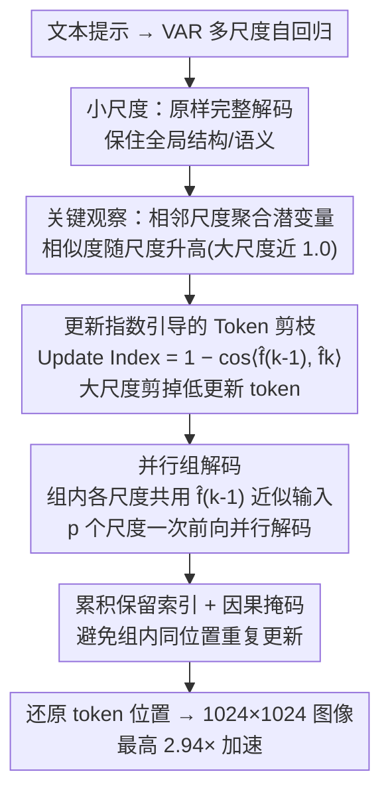

# LazyVAR: Accelerating Visual Autoregressive Models via Scale-wise Token Pruning and Parallel Group Decoding

**会议**: CVPR 2026  
**论文**: [CVF Open Access](https://openaccess.thecvf.com/content/CVPR2026/html/Mao_LazyVAR_Accelerating_Visual_Autoregressive_Models_via_Scale-wise_Token_Pruning_and_CVPR_2026_paper.html)  
**代码**: 无  
**领域**: 模型压缩 / 生成模型加速  
**关键词**: 视觉自回归(VAR)、训练免微调加速、Token 剪枝、并行解码、文本生图

## 一句话总结
LazyVAR 发现 VAR 在相邻尺度上的聚合潜变量特征越往大尺度越相似，于是用「尺度更新指数」做免训练 token 剪枝、再把更新极小的几个尺度打包并行解码，把 Infinity-2B 文生图模型加速最高 2.94×（1024×1024 单卡 RTX 4090 仅 0.5 秒），生成质量几乎不掉。

## 研究背景与动机
**领域现状**：扩散模型长期是图像生成主流，但自回归（AR）路线近年质量追平甚至在部分 benchmark 超过扩散，且天然兼容大语言模型的训练范式与扩展性。其中 VAR（Visual Autoregressive）把自回归从「预测下一个 token」改造成「预测下一个尺度」，从粗到细逐级生成多尺度 token 图，视觉保真度和语义一致性都很强。

**现有痛点**：VAR 有两个硬伤直接拖慢推理。一是**算力随尺度爆炸**——尺度越大 token 数随分辨率边长 $n$ 成 $O(n^2)$ 增长，而注意力计算甚至是 $O(n^4)$，高分辨率下处理整张 token 图极其昂贵；二是**无法跨尺度并行**——自回归的顺序依赖要求每一步都先更新完聚合潜变量、再下采样去初始化下一尺度，导致各尺度只能串行解码，延迟居高不下。

**核心矛盾**：先前的 VAR 加速工作 FastVAR 用频域偏离（token 范数与平均范数的偏差，即 PTS）来挑要剪的 token，但它没有利用 VAR 自身的「token 更新动力学」，剪枝准则不够贴合模型实际行为，而且完全没解决串行延迟问题。

**本文目标**：在**不重新训练、即插即用**的前提下，同时砍掉「大尺度冗余 token」和「跨尺度串行延迟」两笔开销。

**切入角度**：作者把 VAR 维护的聚合潜变量 $\hat{f}$（逐尺度残差预测的累积和）拎出来，研究**相邻尺度之间 $\hat{f}$ 的余弦相似度**。三条关键观察支撑了整套方法：(1) 相似度随尺度单调升高，到大尺度时分布尖锐地堆在 1.0 附近——第 11 尺度约 94% 的 token 余弦相似度 >0.95；(2) 相似度低（更新大）的 token 与图像中高频细节区域的方差强相关，说明模型主动更新细节、放着已生成好的背景不动；(3) 更新模式跨尺度一致——某 token 在第 $i$ 尺度更新大，第 $i{+}1$ 尺度也倾向更新大。

**核心 idea**：把「相邻尺度聚合潜变量的相似度」当成免费的剪枝信号——相似度高就说明这步更新极小、可以跳过前向；又因为大尺度上一大片 token 都几乎不动，把这几个尺度的输入用同一份 $\hat{f}$ 近似，就能把原本串行的几步**塞进一个组并行解码**。

## 方法详解

### 整体框架
LazyVAR 是一个加在已训练好的 VAR 文生图模型（如 Infinity、HART）之上的免训练加速插件，由两个互补模块组成：**更新指数引导的 token 剪枝（UIGTP）** 和 **并行组解码（PGD）**。整体策略是「小尺度原样保留、大尺度激进提速」：小尺度 token 少又决定全局结构与语义，剪了得不偿失，因此完整跑；从某个尺度 $i$ 开始，先按上一尺度算出的更新指数剪掉更新极小的 token，再把随后 $p{-}1$ 个尺度打包成一组，用同一份聚合潜变量近似各尺度输入、一次前向并行解出多个尺度的残差。

### 关键设计

**1. 尺度更新指数：把「相邻尺度相似度」变成免训练剪枝准则**

痛点是大尺度 token 太多、但其中大部分其实没怎么变。作者把 VAR 的聚合潜变量写成递归形式 $\hat{f}_k = \hat{f}_{k-1} + \mathrm{Interpolate}(r_k,(h_K,w_K))$（$r_k$ 是第 $k$ 尺度的残差预测），然后定义逐 token 的更新指数：

$$\text{Update Index}_k = 1 - \cos\langle \hat{f}_{k-1}, \hat{f}_k \rangle \in [0,2]^{h_K \times w_K}$$

更新指数小说明这个 token 在当前尺度上几乎没更新，可以直接从 transformer 输入里剔掉，对最终表示影响微乎其微。这个准则之所以可靠，靠的是前面三条发现：更新指数和图像 patch 的高频方差强相关（剪掉的恰好是已生成好的背景），且跨尺度一致（$\text{Update Index}_{k-1}$ 与 $\text{Update Index}_k$ 的 Spearman 相关显著），所以可以**用上一尺度 $\text{Update Index}_{k-1}$ 来决定当前尺度 $k$ 剪谁**，无需任何额外训练或分类器。这与 FastVAR 的 PTS（看 token 范数偏离）相比，直接读取了模型自身的更新动力学，准则更贴合实际行为。剪掉的 token 位置在 block 输出后再恢复，并把这些位置的残差预测直接置零。

**2. 并行组解码（PGD）：把串行的几个尺度塞进一次前向**

痛点是自回归要求每步更新完 $\hat{f}$ 才能初始化下一尺度，导致跨尺度无法并行。作者注意到大尺度上相邻 $\hat{f}$ 高度相似（$\hat{f}_{k-1} \approx \hat{f}_{k+m-1}$），于是把同组内各尺度的输入用同一份 $\hat{f}_{k-1}$ 下采样去近似：

$$\tilde{r}_{k+m} \approx \tilde{r}'_{k+m} = \mathrm{Interpolate}(\hat{f}_{k-1}, (h_{k+m}, w_{k+m})), \quad m \in [0, p-1]$$

下采样会进一步抹平本就微小的差异，所以近似成立。这样原本串行的 $r_k = \mathrm{Blocks}(\tilde{r}_1,\dots,\tilde{r}_k,c)$ 就能改写成组内 $p$ 个尺度一次前向并行解出：$r_k,\dots,r_{k+p} = \mathrm{Blocks}(\tilde{r}_1,\dots,\tilde{r}'_k,\dots,\tilde{r}'_{k+p},c)$。这是把「跨尺度串行」这一 VAR 固有瓶颈直接打掉的关键，也是 LazyVAR 相比纯剪枝方法（FastVAR 不能并行）能多拿一截加速的来源——消融里 PGD 单独贡献约 1.45× 提速。

**3. 累积保留索引：避免组内同位置 token 被重复更新**

并行解多个尺度时有个隐患——不同尺度若都更新同一空间位置的 token，会破坏因果依赖、引入伪影。作者的处理是把更新额度按位置错开分配：把更新指数最高的 token 分给最大尺度，较低的分给较小尺度。具体为尺度 $i$ 计算跨尺度累积保留数

$$\text{cum}_i = \sum_{k=i+1}^{i+p} n_k \cdot (h_K \times w_K)/(h_k \times w_k)$$

然后对尺度 $i{+}m$，先把 $\text{Update Index}_{i-1}$ 下采样到 $(h_{i+m},w_{i+m})$，排序后从第 $\text{cum}_{i+m}$ 大开始取 $n_{i+m}$ 个 token 作为该尺度的保留索引。再配合训练时同款的注意力掩码，保住组内尺度间的因果关系。这一步是把「并行」做得不掉质量的安全阀，消融显示去掉它（w/o Cum）会带来轻微掉点。

### 一个完整示例
以 Infinity（共 13 个尺度）为例：尺度 1–9 原样完整解码，保住全局结构；从尺度 10 起启动 LazyVAR，把尺度 10、11、12、13 打成一个组，保留比例分别设为 [20%, 10%, 5%, 1%]——越大尺度剪得越狠，因为越大尺度相似度越高、更新越少。组内用尺度 9 算出的 $\hat{f}_9$ 下采样去近似 10–13 的输入，一次前向并行解出这四个尺度的残差；按累积保留索引把高更新 token 分给尺度 13、低更新的分给尺度 10，置零被剪位置的残差并还原位置编码。最终 13 步压缩到约 10 个有效计算步，整图 1024×1024 生成从 1.38s 降到 0.47s。

## 实验关键数据

### 主实验
两个 VAR 文生图模型上验证（Infinity-2B、HART-0.7B），单卡 RTX 4090，GenEval 测语义一致、MJHQ-30K 测感知质量。

| 模型 | 步数 | 时间↓ | 加速↑ | FLOPs↓ | 显存↓ | GenEval↑ | MJHQ FID↓ | FID*↓ |
|------|------|-------|-------|--------|-------|----------|-----------|-------|
| Infinity | 13 | 1.38s | 1.00× | 101.58T | 16.1GB | 0.685 | 9.80 | 0.00 |
| +FastVAR | 11 | 0.65s | 2.12× | 44.15T | 11.9GB | 0.683 | 10.05 | 2.03 |
| **+LazyVAR** | 10 | **0.47s** | **2.94×** | **34.32T** | **11.2GB** | **0.686** | 9.83 | **1.46** |
| HART | 14 | 0.80s | 1.00× | 45.59T | 20.6GB | 0.476 | 10.98 | 0.00 |
| +FastVAR | 14 | 0.58s | 1.38× | 34.11T | 20.5GB | 0.458 | 10.54 | 8.06 |
| **+LazyVAR** | 13 | **0.48s** | **1.67×** | **32.09T** | 20.2GB | 0.468 | 11.04 | **3.77** |

Infinity+LazyVAR 在 2.94× 加速下 GenEval 反而微涨 0.3%；HART+LazyVAR 1.67× 加速、GenEval 仅掉 0.8%。两族上 LazyVAR 在速度、质量、FLOPs、显存上全面优于 FastVAR。

> 自定义指标 **FID\***：衡量「剪枝后模型 vs 原模型」两者生成图之间的 FID（越低说明越接近原模型输出）。LazyVAR 在 MJHQ-30K 全部 10 个类别上 FID\* 都显著低于 FastVAR（Infinity 平均 7.69 vs 12.52；HART 平均 12.55 vs 18.50），说明它对原模型行为的偏离更小。值得注意 HART+FastVAR 的绝对 FID 偶尔比原模型还低，但作者指出它在背景引入了可见伪影（图 5 红框），FID 低反而误导。

### 消融实验

| 配置 | 时间↓ | 加速↑ | GenEval↑ | MJHQ FID↓ | FID*↓ | 说明 |
|------|-------|-------|----------|-----------|-------|------|
| [20%,10%]† 默认 | 0.47s | 2.94× | 0.686 | 9.83 | 1.46 | 剪枝比例最优折中 |
| [0%,0%] | 0.41s | 3.37× | 0.658 | 10.81 | 2.67 | 全剪，质量崩 |
| [40%,20%] | 0.51s | 2.71× | 0.686 | 9.87 | 1.65 | 留更多反而不增益 |
| w/o PGD | 0.68s | 2.03× | 0.690 | 9.74 | 1.48 | 去并行解码，加速从 2.94× 掉到 2.03× |
| 组 [9,10,11,12,13] | 0.42s | 3.29× | 0.678 | 9.83 | 2.21 | 多并一组更快但质量降 |
| w/o Cum | 0.47s | 2.94× | 0.681 | 9.88 | 1.54 | 去累积索引，轻微掉点 |
| w PTS（换 FastVAR 准则） | 0.48s | 2.88× | 0.665 | 10.12 | 2.29 | 准则换成 PTS 质量明显变差 |

### 关键发现
- **剪枝准则是质量命门**：把更新指数换成 FastVAR 的 PTS（w PTS），GenEval 从 0.686 掉到 0.665、FID* 从 1.46 升到 2.29——证明「相邻尺度相似度」比「范数偏离」更贴合 VAR 的真实更新行为。
- **PGD 贡献约 1.45× 提速**：去掉并行组解码后加速从 2.94× 降到 2.03×，且质量几乎不变，说明并行化是「白拿」的提速。
- **保留比例存在甜区**：全剪（[0%,0%]）质量崩、留太多（[40%,20%]）只增延迟不增质量，因为大尺度大量 token 更新本就极小，剪掉不伤感知质量。
- **小尺度必须保留**：小尺度 token 少又决定结构语义，剪它得不偿失，所以剪枝只从大尺度起。

## 亮点与洞察
- **把「冗余」量化成一个免训练信号**：相邻尺度聚合潜变量的余弦相似度，既是剪枝准则又是并行依据，一个观察同时解决「token 太多」和「无法并行」两个问题，非常经济。
- **剪枝 + 并行的耦合很巧**：正因为大尺度 token 几乎不更新（相似度高），才既能放心剪，又能用同一份 $\hat{f}$ 近似多尺度输入做并行——两个模块共享同一个物理前提，不是硬拼。
- **提出 FID\* 这个对照指标**：直接量「剪枝后 vs 原模型」的输出偏离，比绝对 FID 更能反映加速方法是否「忠实」，避开了 FastVAR「FID 低但有伪影」的误导，这个评测视角可迁移到任何免训练加速工作。
- **即插即用**：无需重训、与 FlashAttention 兼容、只靠推理时的 token 索引重排，工程落地成本极低。

## 局限与展望
- **加速比依赖模型尺度结构**：Infinity 有 13 个尺度、大尺度冗余多，能拿 2.94×；HART 尺度更少、可并行/可剪的空间小，只有 1.67×。对尺度数少或 token 分布更均匀的 VAR 变体收益会缩水。
- **保留比例/分组是手调超参**：[20%,10%,5%,1%]、分哪几个尺度成一组都靠 Update Index 分布人工选，没有自动化策略，换新模型需重新调。
- **只验证了文生图 VAR**：方法围绕「聚合潜变量相似度」展开，对图像编辑、图到图、视频等 VAR 变体是否成立未验证。
- **作者承认全剪会崩**：相似度高不等于零更新，激进剪枝（[0%,0%]）质量明显下降，说明这条「相似即可弃」的假设有边界。

## 相关工作与启发
- **vs FastVAR**：FastVAR 用 PTS（token 范数偏离平均范数）剪枝 + CTR 恢复空间一致性，但只剪不并行；LazyVAR 改用相邻尺度相似度作准则（更贴合更新动力学），并额外引入并行组解码打掉串行延迟，速度和质量双赢。
- **vs ScaleKV / CoDE / SkipVAR 等 VAR 家族加速**：ScaleKV 优化 KV-cache 显存分配，CoDE 用不同尺寸 VAR 协同推理，SkipVAR 训分类器跳过某些尺度或 CFG 分支；LazyVAR 不动模型、不训分类器，纯靠聚合潜变量的内在相似性，定位互补。
- **vs 扩散加速（DDIM/DeepCache）**：DeepCache 复用相邻去噪步的高层语义、DDIM 改采样轨迹，思路上同样是「利用相邻步冗余」，但因架构与生成范式根本不同，扩散加速法不能直接搬到 VAR，本文相当于在 VAR 的尺度维度上给出了对应方案。

## 评分
- 新颖性: ⭐⭐⭐⭐ 「相邻尺度相似度」这一观察被同时用作剪枝准则和并行依据，视角清晰且未被前作利用。
- 实验充分度: ⭐⭐⭐⭐ 两族模型 + 三大 benchmark + 完整剪枝/分组/准则消融，并自提 FID* 做对照，扎实。
- 写作质量: ⭐⭐⭐⭐ 从发现到动机到方法推导顺滑，公式与图清楚。
- 价值: ⭐⭐⭐⭐ 免训练即插即用、2.94× 加速、单卡 0.5s 出 1024 图，对 VAR 落地实用价值高。

<!-- RELATED:START -->

## 相关论文

- [\[CVPR 2026\] VVS: Accelerating Speculative Decoding for Visual Autoregressive Generation via Partial Verification Skipping](vvs_accelerating_speculative_decoding_for_visual_autoregressive_generation_via_p.md)
- [\[CVPR 2026\] One Layer's Trash is Another Layer's Treasure: Adaptive Layer-wise Visual Token Selection in LVLMs](one_layers_trash_is_another_layers_treasure_adaptive_layer-wise_visual_token_sel.md)
- [\[CVPR 2026\] HAWK: Head Importance-Aware Visual Token Pruning in Multimodal Models](hawk_head_importance-aware_visual_token_pruning_in_multimodal_models.md)
- [\[CVPR 2026\] HTTM: Head-wise Temporal Token Merging for Faster VGGT](httm_head-wise_temporal_token_merging_for_faster_vggt.md)
- [\[CVPR 2026\] Accelerating Streaming Video Large Language Models via Hierarchical Token Compression](accelerating_streaming_video_large_language_models_via_hierarchical_token_compre.md)

<!-- RELATED:END -->
