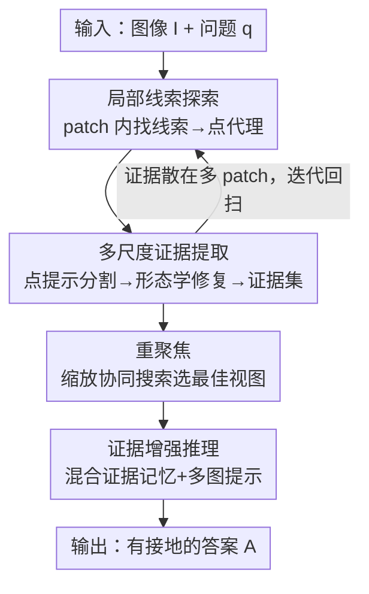

# DeepScan: A Training-Free Framework for Visually Grounded Reasoning in Large Vision-Language Models

**会议**: CVPR 2026  
**论文**: [CVF Open Access](https://openaccess.thecvf.com/content/CVPR2026/html/Li_DeepScan_A_Training-Free_Framework_for_Visually_Grounded_Reasoning_in_Large_CVPR_2026_paper.html)  
**代码**: https://github.com/YChenL/DeepScan  
**领域**: 多模态VLM / LLM推理  
**关键词**: 视觉接地推理、免训练、自底向上定位、视觉专家、证据记忆

## 一句话总结
DeepScan 是一个免训练框架，模仿人类"先抓局部线索、再自底向上还原证据"的视觉搜证方式，用层级扫描（Hierarchical Scanning）+ 重聚焦（Refocusing）+ 证据增强推理（Evidence-Enhanced Reasoning）三段流水线把 LVLM 包起来，在 V\* bench 上用 Qwen2.5-VL-7B 拿到 90.6% 准确率（比原模型 +16.3%），且无需任何微调即可迁移到不同架构和参数规模。

## 研究背景与动机
**领域现状**：让大视觉语言模型（LVLM）"看清细节再回答"是当前一个热点。主流做法分两条线：一是用强化学习（带 IoU 等视觉奖励）或上下文工程，训练模型在推理时主动定位证据；二是免训练地外挂视觉专家（如 GroundingDINO、LangSAM），靠专家和 LVLM 的共识去定位证据区域，显著提升细粒度理解。

**现有痛点**：无论训练派还是免训练派，几乎都遵循**自顶向下（top-down / coarse-to-fine）**的接地范式——先在整幅图上一次性搜出粗粒度代理（region proposal、检测框、文本描述），再细化得到精确证据。这种"一次性定位完整证据区域"的做法在高分辨率、目标极小、或存在语义相似干扰物的场景里非常脆弱。

**核心矛盾**：从整幅图一次性定位，会被噪声上下文带偏——论文点名两类失效：注意力沉没（attention sink）和注意力漂移（attention drift，注意力被语义相似的物体吸走）。一旦初次定位错了，LVLM 要么拒答，要么基于错误证据胡乱猜测。V\* 这类基准里目标平均面积 < 0.05%，自顶向下范式几乎无从下手。

**切入角度**：作者从人类认知出发——人玩"找不同"时不是一眼盯住目标，而是**扫描局部小块找细微差异，再把这些线索拿到整图层面去验证、还原目标，同时压制干扰**。这是一种自底向上的搜证流程。

**核心 idea**：用"自底向上接地"代替"自顶向下一次性定位"——先在 patch 级探索判别性线索（cue），把线索表示成**点代理（point-based proxy）**，再用点提示分割把点提升为图像级证据，逐步还原；最后把多粒度证据塞进记忆喂给 LVLM 推理。整个过程不训练 LVLM，靠外挂的搜索专家 + 视觉专家协同完成。

## 方法详解

### 整体框架
DeepScan 给 LVLM 外挂两个即插即用模型：**搜索专家**（search expert，BLIP-ITM）用 GradCAM 产生 patch 内的注意力图 $S=\mathrm{SEARCH}(p,q)\in\mathbb{R}^{h\times w}$ 来标出潜在线索；**视觉专家**（visual expert，LangSAM）暴露两个原语——点提示分割 $m=\mathrm{SEGMENT}(I,c)$ 和按问题检测 $B=\mathrm{DETECT}(I,q)$。给定图像 $I\in\mathbb{R}^{H\times W\times 3}$ 和问题 $q$，整条流水线分三段：

1. **层级扫描（Hierarchical Scanning）**：把图切成 patch，在每个 patch 内做**局部线索探索**找出线索并表示为点代理，再做**多尺度证据提取**把点代理还原成图像级证据掩码，逐步收集证据集 $\mathcal{E}$。这一段是自底向上的核心，负责抗噪定位。
2. **重聚焦（Refocusing）**：层级扫描给出的证据视图可能上下文过多或过少（尤其多物体相邻时），这一段让 LVLM 和视觉专家协同做一个小规模搜索，挑出"包含全部证据所需、但又最紧凑"的最佳视图 $V^\*$。
3. **证据增强推理（Evidence-Enhanced Reasoning）**：把层级扫描的细粒度证据和重聚焦的粗粒度视图存进**混合证据记忆 $\mathcal{H}$**，物化成一段有序多图提示 $[e_1,\dots,V^\*]$ 喂给 LVLM，生成最终答案 $A=\mathrm{REASON}(\mathcal{H},q)$。

### 关键设计

**1. 局部线索探索：用点代理把跨 patch 的残缺证据桥接起来**

自顶向下范式怕噪声，一个自然想法是切 patch 后逐块抽证据。但这立刻撞上一个根本难题：当证据跨越多个 patch 时，传统代理（region proposal、检测框、文本描述）根本表示不了这种"被切碎的残缺证据"。DeepScan 的解法是**点代理（point-based proxy）**——证据可以残缺，但一个落在证据内部的点足以作为后续点提示分割的种子，把整块证据还原回来。

具体地，对 patch $p$ 用搜索专家得到注意力图 $S_p$，再用 Otsu 自适应阈值 $T_p^\star=\mathrm{OTSU}(S_p)$ 二值化出高响应掩码 $S_p^+=\mathbb{I}(S_p\ge T_p^\star)$，把其中的连通分量当作线索 $\{G_p^k\}$。关键在于**怎么在每个线索里选代理点**：只用"到边界距离最大"（几何中心，类似 Chebyshev center）会在 U 形等复杂线索里产生多个歧义候选；只用注意力峰值又可能偏。论文把两者融合，对线索 $G_p^k$ 选

$$c_p^k=\arg\max_{c\in G_p^k}\ \tilde S_p(c)\,\tilde d(c,\partial G_p^k),\quad |G_p^k|\ge\tau$$

其中 $\tilde d(c,\partial G)=\inf_{\gamma\in\partial G}\|c-\gamma\|_2$ 是归一化的到边界距离（保证点落在内部、远离边缘），$\tilde S_p(c)$ 是归一化注意力分数（把点偏向语义显著区），$\tau$ 是过滤碎小伪线索的面积阈值。最后把 patch 内坐标的代理 $C_p$ 抬升到整图坐标 $C_p'$。消融（表 5 左）证明这个"语义×拓扑"融合代理（Att 93.0 / Spa 86.8）明显优于单独的 Centroid（84.3/80.3）、Chebyshev Center（91.3/82.9）和 Attention Peak（87.8/85.5）。

**2. 多尺度证据提取：点提示分割 + 形态学修复 + 启发式加速**

拿到代理点后，用视觉专家做点提示分割 $m=\mathrm{SEGMENT}(I,c_p')$ 把点还原成图像级掩码。但单点提示表达力有限，掩码常带内部空洞或周围上下文残缺。论文用**形态学后处理**得到增强掩码

$$m^+=(m\bullet K)\oplus S_r$$

$\bullet$ 是用平坦核 $K$ 做闭运算封住内部空洞，$\oplus$ 是用圆盘核 $S_r$ 做膨胀向外补一点上下文。这一步不仅提点（表 4：去掉后处理 90.6→87.4），还**加速推理**——因为它顺带做了去重：用全局已访问掩码 $I\leftarrow I\odot(1-m^+)$ 跳过已处理区域，并把落进同一证据掩码的代理过滤掉 $C_p'\leftarrow\{c\mid m^+(c)=0\}$，避免对同一证据反复抽取。证据候选 $e$ 从 $m^+$ 的最小外接框 $b$ 裁出，再让 LVLM 做一次二值判定（这块证据是否有效），通过就更新证据集 $\mathcal{E}\leftarrow\mathcal{E}\cup\{(b,e)\}$。

此外还有一个很实用的**启发式加速**：图 5 显示**越不显著（面积越小）的证据，带来的性能增益越大**——因为大块证据 LVLM 本来就能看见，不需要显式接地。于是按面积预筛、只评估最小的 top-$k$ 个候选，把 LVLM 评估次数限制在 $k$ 以内、同时省视觉 token。实测即使 $k=1$ 也能保住约 96% 的峰值性能并带来约 2× 加速；实践中取 $k=10$ 平衡性能与延迟。

**3. 重聚焦：LVLM 与视觉专家协同的深度-2 缩放搜索**

层级扫描虽能还原证据，但当多个视觉元素空间相邻时，代理点位置难以精确，导致最终视图上下文不足或冗余（图 6）。重聚焦把 LVLM 和视觉专家组成一个**协同搜索**：以证据集的最小外接框初始化 $V_1=\mathrm{CROP}(I,b_m)$，定义两个动作——**Zoom-In** $\mathrm{IN}(V,q)=\mathrm{CROP}(V,\mathrm{DETECT}(V,q))$ 收紧上下文，**Zoom-Out** $\mathrm{OUT}(V,s)=\mathrm{CROP}(I,\mathrm{SCALEBBOX}(V,s))$ 以中心各向同性放大上下文。选择策略用一个 LVLM 奖励

$$R(V)=\mathbb{I}_{V;q}\cdot HW/hw$$

$\mathbb{I}_{V;q}$ 是 LVLM 一次性二值判定"$V$ 是否含回答 $q$ 所需的全部证据"，$HW/hw$ 是尺寸正则项——**偏好仍含全部证据的最小视图**，既不漏证据又不过裁（图 11 显示过度 zoom-in 会删掉必要上下文反而掉点）。

最妙的是**搜索空间剪枝**：与在整图上搜的方法不同，$V_1$ 已经是良好初始化，作者据此论证 Zoom-In 在 $V_1$ 上幂等、Zoom-Out 不会越界裁剪，并证明 $\mathrm{OUT}(\mathrm{IN}(V_1,q),s)$ 这个状态可以从搜索空间剔除而不损全局最优。于是只需对 $V_1$ 做深度-2 展开，得到行为完备的视图集 $\mathcal{V}=\{V_1,V_2,V_3,V_4\}$，其中 $V_2=\mathrm{IN}(V_1,q)$、$V_3=\mathrm{OUT}(V_1,s)$、$V_4=\mathrm{IN}(V_3,q)$，$s=1.5$（网格搜索得到），深度优先贪心选最佳。表 6 右显示，同样展开预算下 Refocusing 的搜索长度（1.87）显著短于 MCTS（2.24）和 A\*（3.07），既完备又高效。

**4. 证据增强推理：混合证据记忆把多粒度视图喂给 LVLM**

前两段分别产出**细粒度证据**（层级扫描的 $e$）和**粗粒度视图**（重聚焦的 $V^\*$）。证据增强推理把它们存进混合证据记忆

$$\mathcal{H}=\{\,e,V^\*\mid (b,e)\in\mathcal{E},\ V^\*=\arg\max_{V\in\mathcal{V}}R(V)\,\}$$

再物化成一段有序多图提示 $[e_1,\dots,V^\*]$。这样 LVLM 能从细粒度证据里读出物体属性（颜色、文字等），又能从粗粒度视图里推断空间关系，从而给出既精确又完整的答案。消融（图 7）显示这一段在层级扫描和重聚焦之上还能再加分，且开销可忽略，体现了三段流水线的"完整性"。

> 自检：整体框架点名的四个贡献组件（局部线索探索、多尺度证据提取、重聚焦、证据增强推理）与 Mermaid 图节点、关键设计 1–4 一一对应；两个外挂专家（搜索专家 / 视觉专家）作为脚手架贯穿设计 1–3，未单列。

### 一个完整示例
以图 9(a) "What is the color of the cyclist's box?" 为例：GPT-4o 和 DyFo 的自顶向下定位被注意力漂移带到了语义相似的 "box sign"，答成 light green / 描述错位置。DeepScan 则先在 patch 内探索线索——搜索专家的注意力虽然也会漂，但局部 patch 抑制了大部分干扰；从线索取点代理 → 点提示分割 → 形态学修复得到 "cyclist's box" 的证据掩码，加入证据集；重聚焦再围绕该证据选出最紧凑视图；最后混合记忆喂给 LVLM，得到正确答案 "yellow"。图 10 量化对比表明：把"图像级一次性探索"换成"patch 级自底向上"后，注意力从被吸走的干扰物重新对齐到正确目标（表 7：bottom-up 90.6 vs one-shot 83.8）。

## 实验关键数据

### 主实验
所有 baseline 均基于 Qwen2.5-VL-7B；DeepScan 用 BLIP-ITM base 作搜索专家、LangSAM 作视觉专家，$k=10$，单/多物体场景动态设 patch 为 576/768，4×L20。

| 基准 | 指标 | Qwen2.5-VL-7B | DyFo（免训练 SOTA） | DeepEyes（RL SOTA） | DeepScan |
|------|------|----------------|----------------------|----------------------|----------|
| V\* | Overall | 74.3 | 84.3 | 90.0 | **90.6** |
| V\* | Attribute | 77.4 | 82.6 | 92.1 | **93.0** |
| V\* | Spatial | 69.7 | 86.8 | 86.8 | 86.8 |
| HR-Bench-4K | Overall | 72.1 | 71.3 | 75.1 | 75.0 |
| HR-Bench-8K | Overall | 68.8 | 69.8 | 72.6 | 72.4 |

DeepScan 在 V\* 上比原 Qwen2.5-VL-7B 提升 16.3%，超过所有免训练 baseline（对 DyFo 在 V\* / HR-4K / HR-8K 分别 +6.3% / +3.6% / +2.6%），并在感知任务上无需微调即可逼平甚至超过 RL 方法 DeepEyes，部分子集（V\* Attribute、HR 单实例）甚至超过若干 70B 通用大模型。

TreeBench（侧重"thinking-with-images"，含定位 mIoU）：

| 方法 | Overall | mIoU | Perception | Reasoning |
|------|---------|------|-----------|-----------|
| Qwen2.5-VL-7B | 37.0 | – | 44.8 | 43.2 |
| DeepEyes（RL） | 37.5 | 30.0 | 51.7 | 47.7 |
| TreeVGR（RL） | 41.0 | 31.8 | 44.8 | 40.9 |
| DyFo（免训练） | 39.3 | – | 44.8 | 40.9 |
| **DeepScan** | **42.5** | **37.3** | 48.3 | 43.2 |

DeepScan 在 TreeBench 上对原模型 +5.5%，mIoU 比 RL 的 DeepEyes / Pixel-Reasoner / TreeVGR 分别高 7.3 / 1.6 / 5.5，整体优于全部免训练与 RL baseline。作者据此推测：RL 并未真正强化 LVLM 的视觉推理，而是把模型偏向感知行为（在二阶推理任务上 RL 增益微弱）。

### 消融实验

| 配置 | V\* Overall | Attribute | Spatial | 说明 |
|------|-------------|-----------|---------|------|
| Detection（DyFo 式自顶向下） | 82.2 | 81.7 | 82.9 | 检测框接地 |
| Hierarchical Scanning（完整） | **90.6** | **93.0** | 86.8 | 自底向上层级扫描 |
| w/o 形态学后处理 | 87.4 | 89.6 | 85.5 | 去掉后掉 3.2 且更慢（重复抽取） |
| One-shot Localization（图像级一次性探索） | 83.8 | 83.5 | 84.2 | 验证自底向上的根本优势 |

代理类型消融（表 5 左）：Centroid 84.3/80.3、Chebyshev Center 91.3/82.9、Attention Peak 87.8/85.5、本文"语义×拓扑"融合 93.0/86.8。重聚焦动作消融（表 6 左）：只 Zoom-In 89.6/73.7、只 Zoom-Out 87.8/72.4、两者联合 93.0/86.8。搜索空间（表 6 右）：本文搜索长度 1.87 < MCTS 2.24 < A\* 3.07。

### 关键发现
- **形态学后处理"既提点又提速"反直觉但合理**：它封住掩码空洞使去重生效，避免对同一证据反复抽取，所以去掉它反而更慢（32.1s vs 24.5s）且掉点。
- **越不显著的证据越值钱**：大目标 LVLM 本就能看见，显式接地的收益主要来自小目标，因此按面积只评 top-$k$ 最小候选，$k=1$ 即保住约 96% 性能并 2× 加速。
- **更激进的接地不总更好**：IoU 从 1/10 拉到 1（过度 zoom-in）会删掉必要上下文反而掉点，所以奖励里用尺寸正则项配 LVLM 反馈抑制过裁。
- **缩放效应对二阶推理比感知更显著**：精确接地下感知性能随规模收敛，但空间推理差距仍在——提示可用轻量 LVLM 做证据判定、大模型只留给证据增强推理，省延迟。
- **对专家规模不敏感**（表 3）：BLIP-ITM base/large、LangSAM small/base+/large 性能、显存、延迟都相近。

## 亮点与洞察
- **把"接地"从一次性定位重构成自底向上的逐步还原**：核心创新是点代理——证据可以被 patch 切碎，但一个内部点足以作分割种子还原整块，绕开了"残缺证据无法用框/描述表示"的死结。这是全文最"啊哈"的地方。
- **用搜索空间证明换效率**：重聚焦没有盲目上 MCTS/A\*，而是先论证 $V_1$ 良好初始化下若干状态幂等/可剔除，把搜索压成深度-2 的 4 个视图，既完备又比通用搜索快——把"先验结构"转化为"剪枝定理"的思路可迁移到其他视觉搜索任务。
- **免训练 + 即插即用**：不碰 LVLM 权重，靠外挂专家协同，天然跨架构、跨规模（7B→72B 都涨），这对工程落地极友好——无需为每个新模型重训。
- **多粒度记忆喂推理**：细粒度证据读属性、粗粒度视图读关系，这种"分工式上下文"组织对需要同时看清细节和理解全局关系的任务很有借鉴价值。

## 局限与展望
- **依赖外挂专家的质量上限**：搜索专家（BLIP-ITM）的注意力本身也会漂移，patch 化只是抑制而非根除；案例里 DyFo 与 one-shot 变体都因专家注意力漂到同一干扰物失败，DeepScan 靠局部化缓解，但极端干扰下搜索专家仍可能"Search Failed"。
- **推理延迟偏高**：完整流水线约 24.5s/样本（表 3），相比纯检测的 13s 明显更慢，多次 LVLM 判定 + 分割 + 搜索的串行开销在实时场景受限。
- **二阶推理增益有限**：TreeBench 上 Reasoning 子项相对原模型 ±0.0，方法主要强在感知/定位；空间推理的瓶颈在 LVLM 本身而非接地精度，免训练框架难以补足。
- **超参偏经验**：patch 尺寸（576/768）、$k=10$、zoom-out 尺度 $s=1.5$、$\tau$ 等多为网格搜索/经验设定，跨数据集泛化时可能需重调。
- **可改进**：证据判定的二值 LVLM 调用次数随候选增长，可探索更省的批量判定或可学习的代理点选择以替代 Otsu+Eq.5 的手工规则。

## 相关工作与启发
- **vs RL 类（DeepEyes / Pixel-Reasoner / TreeVGR / Thyme-VL）**: 它们用视觉奖励微调 LVLM 学会"think-with-images"，成本高且难跨架构泛化；DeepScan 免训练即插即用，感知/定位（mIoU）反而更强，作者还指出 RL 主要把模型偏向感知、对二阶推理增益小。
- **vs 免训练自顶向下（DyFo / ZoomRefine）**: 它们走 coarse-to-fine、靠检测框或自精炼一次性定位，易被注意力沉没/漂移带偏；DeepScan 用自底向上 + 点代理从局部线索还原证据，表 7 显示同等速度下显著更准（90.6 vs 83.8）。
- **vs 树搜索/整图搜索类**: 它们在整幅图上搜状态、搜索长度长；DeepScan 借层级扫描提供的良好初始化把搜索剪成深度-2，搜索长度更短（1.87 vs MCTS 2.24 / A\* 3.07）。
- **vs SEAL（显式证据定位 + 视觉记忆）**: 思路相近但 SEAL 需训练；DeepScan 用混合证据记忆达成类似的"记证据再推理"，且无适配成本。

## 评分
- 新颖性: ⭐⭐⭐⭐⭐ 自底向上接地 + 点代理 + 搜索空间剪枝定理，是对主流自顶向下范式的系统性重构
- 实验充分度: ⭐⭐⭐⭐⭐ 三大基准 + 5 个 LVLM（7B–72B）+ 多维消融（代理/动作/搜索/专家规模），结论扎实
- 写作质量: ⭐⭐⭐⭐ 动机—方法—证据链清晰，公式记号偏密集需对照图理解
- 价值: ⭐⭐⭐⭐⭐ 免训练、跨架构、即插即用，对 LVLM 细粒度理解落地价值高

<!-- RELATED:START -->

## 相关论文

- [\[CVPR 2026\] Seeing What Matters: A Training-Free Self-Guided Framework for Multimodal Detail Perception and Reasoning](seeing_what_matters_a_training-free_self-guided_framework_for_multimodal_detail_.md)
- [\[CVPR 2026\] Grounded Chain-of-Thought for Multimodal Large Language Models](grounded_chain-of-thought_for_multimodal_large_language_models.md)
- [\[CVPR 2026\] Breaking the Regional Perception Bottleneck of Multimodal Large Language Models via External Reasoning Framework](breaking_the_regional_perception_bottleneck_of_multimodal_large_language_models_.md)
- [\[CVPR 2026\] Think Visually, Reason Textually: Vision-Language Synergy in Abstract Reasoning](think_visually_reason_textually_vision-language_synergy_in_abstract_reasoning.md)
- [\[CVPR 2026\] Scaling Test-Time Robustness of Vision-Language Models via Self-Critical Inference Framework](scaling_test-time_robustness_of_vision-language_models_via_self-critical_inferen.md)

<!-- RELATED:END -->
