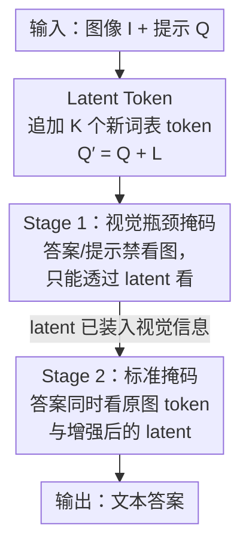

# Latent Implicit Visual Reasoning

**会议**: CVPR 2026  
**论文**: [CVF Open Access](https://openaccess.thecvf.com/content/CVPR2026/html/Li_Latent_Implicit_Visual_Reasoning_CVPR_2026_paper.html)  
**代码**: 无  
**领域**: 多模态VLM / 视觉推理  
**关键词**: 隐式视觉推理, latent token, 视觉瓶颈, LMM, 无监督中间表示

## 一句话总结
LIVR 给大型多模态模型（LMM）加上一组可学习的 latent token，并用一种「视觉瓶颈」注意力掩码强迫答案只能通过这些 token 看图，从而在**无需任何中间步骤监督**的情况下，让模型自己学出对任务有用的视觉抽象，在 9 个视觉密集任务上稳定超过直接微调（SFT），并在多任务与跨数据集泛化上达到 SOTA。

## 研究背景与动机
**领域现状**：现代 LMM 大多是 LLaVA 式架构——图像被视觉编码器编码、经投影器塞进语言模型，然后模型只输出文本。也就是说，视觉信息在输入开头被「一次性」投进语言空间，之后所有推理都发生在文本 token 上。

**现有痛点**：这条范式让模型带着严重的**语言偏置**。对于「数数、拼图、判断哪张图最相似、找视觉对应点」这类**以视觉为核心**的任务，纯文本表示根本无法承载所需的空间结构化抽象——人类靠心象（mental imagery）就能完成的事，强行用语言描述会变得既困难又含糊。

**核心矛盾**：为了让模型更「视觉化」，已有工作走的是**显式监督中间步骤**的路子（让模型预测 bounding box、image crop、深度图、helper image 等）。但这引入了三重困境：(1) 需要大量任务专属标注，成本高；(2) 它把「什么才算有用的视觉中间表示」这件事**预设死**了，而人类直觉的中间步骤未必是模型最该学的；(3) 很多任务（如艺术风格、相对反照率、视觉相似度）压根**说不清**该提供什么中间目标，导致这类方法泛化很差、难以规模化到多样任务。

**本文目标**：设计一个**任务无关、无需中间监督**的机制，让 LMM 自己「发现并使用」对当前任务最有用的视觉抽象。

**切入角度**：作者借鉴 latent reasoning（Coconut、pause token）的洞察——隐空间比离散文本提供了更灵活的内部表示，把内部计算和外部 token 解耦后，模型能纯粹为优化任务而精炼内部状态，而不被「能否用语言说出来」所束缚。区别在于：以往的隐式视觉推理（Mirage、LVR）仍然用显式中间目标去训练 latent，而本文要做的是**完全不给中间监督**。

**核心 idea**：给模型加一组 latent token 作为额外的「视觉计算空间」，再用注意力掩码做**视觉瓶颈**——让答案只能透过这些 latent 看图，逼着它们去承载视觉信息，端到端只用任务损失训练，从而隐式学出任务自适应的视觉抽象。

## 方法详解

### 整体框架
LIVR（Latent Implicit Visual Reasoning）建立在标准 LMM（视觉编码器 + 投影器 + 语言解码器）之上，输入是图像 $I$ 加文本提示 $Q$，输出是文本答案。它只改两件事：(1) 在提示后追加 $K$ 个新引入的 latent token，把提示从 $Q$ 变成 $Q' = Q + L$；(2) 用一个**两阶段训练**配上**视觉瓶颈注意力掩码**，强迫视觉信息流经这些 latent token。训练时视觉编码器与投影器全程冻结，语言主干用 LoRA 微调，额外只解冻 $K$ 个 latent token 对应的 embedding 行。整条 pipeline 不需要任何 helper image、bounding box 或中间步骤标注，只用「问题—答案」对。

### 关键设计

**1. Latent Token：给模型一块离散文本之外的「视觉计算草稿纸」**

痛点是 LMM 把视觉信息一次性投进语言空间后，只能在文本 token 上推理，表达力被离散词汇限死。LIVR 在原词表 $V$ 之外新增 $K$ 个特殊 token $L=\{l_1,\dots,l_K\}$，词表扩成 $V\cup L$，并在训练时把它们拼到输入后面。关键之处在于：**模型不需要学会「生成」这些 latent token**——它们是被直接追加到序列里的，模型只需学会**如何使用**它们来表示重要视觉信息。这些 token 随机初始化，但它们在 embedding 表里对应的行在训练中保持可更新（unfrozen），于是能自由地适配成承载视觉抽象的载体。相比复用预训练文本 token，新引入的 latent「没有历史包袱」，更容易被塑造成抽象视觉表示（这一点在消融里得到验证）。

**2. 视觉瓶颈注意力掩码：逼着视觉信息「只能从 latent 流过」**

光加 token 不够——如果答案 token 仍能直接看图，模型完全可以忽略这些 latent。LIVR 的核心机制是改注意力掩码做**瓶颈（bottleneck）**：让答案 token **只能** attend 到提示 token $Q$ 和 latent token $L$，**不能** attend 到视觉输入 $I$；为了杜绝视觉信息从提示侧泄漏，还进一步禁止提示 token $Q$ attend 到图像 $I$。这样一来，模型想答对题，唯一的「看图通道」就是这组 latent，它们被迫成为视觉信息的瓶颈。作者认为这带来两个好处：其一，latent 被强制装入视觉信息，提供了比预训练文本 token 更具表达力的「额外视觉计算」；其二，模型必须聚焦这些视觉 latent 才能作答，从而**削弱语言偏置**。注意力可视化显示，这些 latent 会自发聚焦到与正确答案相关的图像区域（如语义对应的目标点、要数的物体），说明它们确实在无监督下学到了有意义的视觉结构。

**3. 两阶段训练：先把视觉灌进 latent，再放开联合使用**

如果一上来就用标准掩码，latent 缺乏「必须装视觉信息」的压力，会被学成可以忽略的摆设。LIVR 用 2:3 比例的两阶段调度解决这点。**Stage 1（瓶颈期）**施加上面的瓶颈掩码，用标准 NLL 目标、且**只在答案 token 上**算损失：

$$\mathcal{L} = -\frac{1}{|x|}\sum_{i=1}^{|x|}\log P(x_i \mid x_{<i})$$

由于答案唯一的看图通道是 latent，这个目标会直接把 latent 优化成「装着对解题最有用的视觉信息」。**Stage 2（联合期）**恢复标准掩码——答案 token 可以同时看原始图像 token 和此刻已被「灌满视觉信息」的 latent，损失不变仍只在答案上算。这一阶段教模型学会**联合利用原图与增强后的 latent** 作答。消融显示，瓶颈和 latent 缺一不可：只加 latent 不做瓶颈（latents-only）等于没加，去掉就掉点；epoch 配比 (4,6) 最优，纯 Stage 2（0,10）退化成普通 SFT。

### 损失函数 / 训练策略
两阶段都用只在答案 token 上计算的 NLL 损失（公式同上）。单任务实验每任务 1k 样本，LIVR 跑 4 epoch Stage 1 + 6 epoch Stage 2、$K=16$；多任务（6 任务共 6k 样本）保持 2:3 比例跑 2+3 epoch。语言主干用 LoRA（作用于注意力与 MLP 块），视觉编码器和投影器冻结，额外只解冻 $K$ 个 latent token 的 embedding 行；单任务按验证集最高准确率选 checkpoint，多任务用最终 checkpoint。

## 实验关键数据

### 主实验
在 BLINK 改编的 9 个视觉密集任务（计数、拼图、定位、视觉对应、艺术风格、语义对应、功能对应、相对反照率、视觉相似度）上做单任务微调，主对比对象是 Direct SFT（同样的任务数据、无中间监督，干净对照）。

| 主干模型 | 设置 | 9 任务平均准确率 | Δ vs SFT |
|----------|------|------|------|
| Qwen2.5-VL-3B | Direct SFT | 61.61 | — |
| Qwen2.5-VL-3B | **LIVR (Ours)** | **67.85** | **+6.24** |
| Qwen3-VL-4B | Direct SFT | 74.12 | — |
| Qwen3-VL-4B | **LIVR (Ours)** | **77.55** | **+3.43** |
| LLaVA-OneVision-1.5-4B | Direct SFT | 63.70 | — |
| LLaVA-OneVision-1.5-4B | **LIVR (Ours)** | **69.30** | **+5.60** |

提升在「难以指定显式中间表示」的任务上尤其明显：Qwen2.5-VL 上拼图 +12.00、功能对应 +13.02；LLaVA-OneVision 上功能对应狂涨 +27.40。多任务（Qwen3-VL-4B，6 任务联合）平均也从 SFT 的 69.60 提到 72.37（+2.77），且因任务无关而能直接套用、无需为每个任务换监督。

跨方法对比同样有力：在 VSP 任务上丢掉 helper image、只设 $K=4$，Qwen2.5-VL-3B 上 LIVR 达 66.00，远超 Mirage 的 46.00（+20）；空间推理 benchmark 上 LIVR-3B 在 SAT Val 拿到 85.6（ViGoRL 仅 62.9）、BLINK-3 拿 59.5（最高），且不用 text-CoT、显式 grounding 或 RL。

### 消融实验
在 Qwen3-VL-4B-Instruct、Localization / Sem. Corr. / Func. Corr. 三任务上拆解（Table 5）：

| 配置 | Local. | Sem. Corr. | Func. Corr. | 说明 |
|------|--------|-----------|------------|------|
| Direct SFT | 79.51 | 61.15 | 58.90 | 基线 |
| **Ours (LIVR)** | **83.61** | **64.75** | **67.81** | 完整模型 |
| Latents only (no mask) | 79.51 | 61.15 | 58.22 | 加 latent 但不做瓶颈 → 等于没加 |
| Mask only (no latents) | 80.33 | 61.16 | 59.59 | 只瓶颈不加 latent → 文本 token 难重塑 |
| Input image twice (no mask) | 78.69 | 61.16 | 58.22 | 单纯加视觉算力无效 |
| Prompt tuning | 71.31 | 49.64 | 36.30 | 轻量适配基线，远不及 |

超参敏感性：Stage 配比 (S1,S2) 在 (4,6) 时最佳，(0,10) 退化为 SFT、(8,2) 也明显变差；latent 数 $K$ 在 16 时最优，4/8/32 都略逊；掩码策略上「答案+提示都禁看图」优于只禁答案看图。

### 关键发现
- **latent 是否真被用 + 是否真装视觉信息**：测量答案对 latent 的平均注意力，LIVR 为 0.076、latents-only 仅 0.028；评估时去掉 latent，LIVR 从 83.61 掉到 76.23（依赖它），latents-only 79.51→79.51（学会忽略）。在测试时强加瓶颈掩码，LIVR 仍达 70.49，而 latents-only 跌到接近随机的 43.44——证明 LIVR 的 latent 既被使用、又真携带了任务相关视觉信息。
- **瓶颈 > 单纯加算力**：把图像 token 复制两份当「额外视觉计算」对照，几乎无提升，说明 LIVR 的收益来自瓶颈逼出的视觉抽象，而非单纯多了算力。
- **为何不复用文本 token**：mask-only 变体逊于 LIVR，因为预训练文本 token 已带语义、难被重塑成抽象视觉表示，而全新 latent 可自由适配。

## 亮点与洞察
- **「瓶颈逼学」范式很巧**：不去设计「latent 该长什么样」，而是通过切断答案的直接看图通道，把「学出有用视觉抽象」变成模型为了答对题不得不做的事——监督信号完全来自最终任务损失，省掉了所有中间标注。
- **任务无关是真正的杀手锏**：因为不绑定任何任务专属视觉目标（深度图/框/helper image），同一套方法能无缝迁到多任务联合微调，而显式监督方法每个任务都要换监督、很难扩展。
- **注意力可视化提供了可解释证据**：latent-to-image 注意力自发落在正确答案区域（数对的物体、对应点、要定位的目标），把「隐式学到视觉结构」这件抽象事做实。
- **可迁移思路**：「新增可学 token + 用注意力掩码制造信息瓶颈、只用末端损失端到端训练」这套机制，可推广到任何想让模型学出某种内部中间表示、却又说不清该监督什么的场景（如音频、3D、跨模态对齐）。

## 局限与展望
- 超参（$K$、阶段 epoch 配比）虽固定跨任务但靠 3 个任务的消融调出，作者也坦言任务专属调参可能进一步涨点——意味着默认配置未必每任务最优。
- latent 的可解释性仍是事后归因：注意力图里依然存在 attention sink，「latent 到底编码了什么」更多是观察而非可控/可验证的机制。
- 评测集中在 BLINK 系感知任务与若干空间推理 benchmark，对更长链条、需多步组合推理的视觉任务（而非单步感知抽象）效果如何未充分检验。
- 仍是「先瓶颈再放开」的固定两阶段调度；是否能做成单阶段或自适应切换、瓶颈强度是否该动态退火，留有探索空间。

## 相关工作与启发
- **vs 文本式视觉推理（LLaVA-CoT / Visual-RFT / Vision-R1）**：它们让整个中间推理都用文本表达，难以形成超出可言说范围的空间结构化视觉抽象；LIVR 把中间推理放进隐空间 latent，绕开「能否用语言说清」的瓶颈。
- **vs 视觉 token 回收（Visual CoT / Pixel Reasoner / ViGoRL）**：它们预测 bounding box 再把裁剪区域塞回推理链，表达力被限制在原输入 token、且依赖人工设计的 crop 与显式监督；LIVR 不裁图、不需坐标监督，且在 SAT/BLINK 空间推理上大幅领先 ViGoRL。
- **vs 视觉中间表示（Mirage / LVR / Aurora）**：它们用显式中间目标（helper image、深度图、重建 embedding）去训练 latent，标注贵且很多任务没有良定义的中间目标；LIVR 完全去掉中间目标，在 VSP 上丢掉 helper image 仍超 Mirage +20，在 MMVP/V*/BLINK 上用更少数据与 LVR 持平或更优。
- **vs 纯隐空间推理（Coconut / pause token）**：那条线在纯文本 LLM 上用隐状态/暂停 token 加算力，LIVR 把这一思想落到 LMM 的联合视觉—文本状态上，并通过视觉瓶颈专门塑造**视觉**抽象。

## 评分
- 新颖性: ⭐⭐⭐⭐⭐ 用注意力瓶颈把「无监督学视觉抽象」做成端到端任务损失驱动，思路干净且少见
- 实验充分度: ⭐⭐⭐⭐⭐ 3 个主干 × 9 任务 + 多任务 + 4 套跨方法对比 + 详尽消融，latent「是否被用/是否装信息」的对照实验尤为扎实
- 写作质量: ⭐⭐⭐⭐ 动机与机制叙述清晰，注意力可视化有说服力；部分实现细节推到 Appendix
- 价值: ⭐⭐⭐⭐⭐ 任务无关、免中间标注、可直接插到现有 LMM 微调，实用性强

<!-- RELATED:START -->

## 相关论文

- [\[CVPR 2026\] StaR-KVQA: Structured Reasoning Traces for Implicit-Knowledge Visual Question Answering](star-kvqa_structured_reasoning_traces_for_implicit-knowledge_visual_question_ans.md)
- [\[CVPR 2026\] Monet: Reasoning in Latent Visual Space Beyond Image and Language](monet_reasoning_in_latent_visual_space_beyond_image_and_language.md)
- [\[CVPR 2026\] Machine Mental Imagery: Empower Multimodal Reasoning with Latent Visual Tokens](machine_mental_imagery_empower_multimodal_reasoning_with_latent_visual_tokens.md)
- [\[ACL 2026\] Forest Before Trees: Latent Superposition for Efficient Visual Reasoning](../../ACL2026/vlm_reasoning/forest_before_trees_latent_superposition_for_efficient_visual_reasoning.md)
- [\[ICML 2026\] Imagination Helps Visual Reasoning, But Not Yet in Latent Space](../../ICML2026/vlm_reasoning/imagination_helps_visual_reasoning_but_not_yet_in_latent_space.md)

<!-- RELATED:END -->
