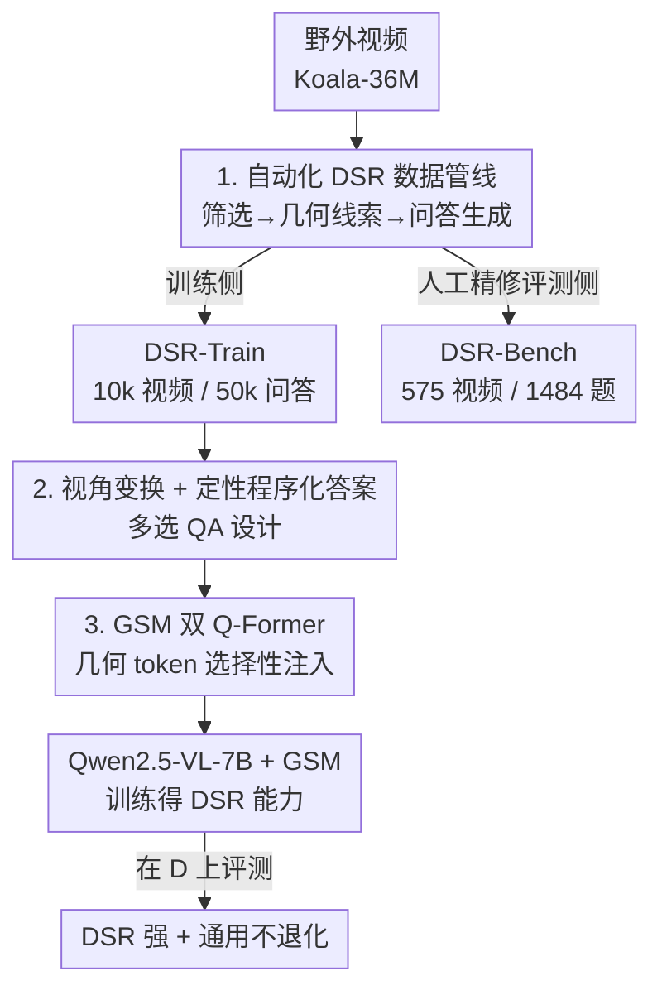

# Learning to Reason in 4D: Dynamic Spatial Understanding for Vision Language Models

**会议**: CVPR 2026  
**论文**: [CVF Open Access](https://openaccess.thecvf.com/content/CVPR2026/html/Zhou_Learning_to_Reason_in_4D_Dynamic_Spatial_Understanding_for_Vision_CVPR_2026_paper.html)  
**代码**: https://github.com/TencentARC/DSR_Suite  
**领域**: 多模态VLM / 空间推理  
**关键词**: 动态空间推理, 4D 理解, VLM, Q-Former, 视频问答数据集  

## 一句话总结
针对 VLM 普遍不会"动态空间推理"（理解物体在 3D 空间中随时间如何运动/相对关系如何变化）的问题，本文提出 DSR Suite：用视觉基础模型从野外视频自动生成带几何线索的多选问答，构建训练集 DSR-Train 和人工精修的评测基准 DSR-Bench，并设计一个轻量的几何选择模块 GSM（双 Q-Former）把"问题相关"的 3D 先验注入 Qwen2.5-VL-7B，使其在 DSR-Bench 上以 58.9% 大幅超越所有对手（次优 38.4%），同时不牺牲通用视频理解能力。

## 研究背景与动机
**领域现状**：VLM 在通用视频理解上已经很强，但要让它服务机器人、自动驾驶、AR/VR、具身智能这类交互系统，必须能在动态环境里做空间推理——也就是理解物体几何与相互关系在 3D 空间中**随时间演变**（dynamic spatial reasoning, DSR）。

**现有痛点**：现有 3D 空间推理工作几乎都被困在两个角落。一是**数据侧**：大多只处理静态场景（物体不动）或只给两帧图像的短时序，少数考虑动态场景的工作又场景单一（自动驾驶/人物交互）、问题类型窄、答案粗粒度，而且普遍**缺训练数据**，模型没有足够监督信号。二是**模型侧**：现有方法把 3D 基础模型（如 CUT3R、VGGT）的几何特征**直接 cross-attention 或粗暴拼接**到视觉 token 上，注入的是一大坨任务特定特征，结果在与空间无关的通用基准上明显掉点——为了 DSR 牺牲了通用能力。

**核心矛盾**：野外视频经 3D 基础模型重建会产生大量**带噪声、与当前问题无关**的几何线索；全部塞给 VLM 会淹没模型、导致任务过拟合和通用能力退化。即"几何先验越多越准" vs "通用能力不退化"之间存在 trade-off。

**本文目标**：把 DSR 这件事在数据集、基准、模型三个层面一次打通——(1) 能规模化生产 DSR 训练数据；(2) 有一个覆盖多物体、多视角、细粒度的评测基准；(3) 有一个注入几何先验但不伤通用能力的模型。

**切入角度**：野外单目视频无法可靠估计绝对尺度，但**相对（非度量）3D 结构**足以支撑"变大/变小、向左/向右、变快/变慢"这类**定性、趋势性**的问答——既忠实又可规模化标注。模型侧则赌"问题相关的几何只占一小部分"，用文本去**选择性检索**几何知识而非全盘注入。

**核心 idea**：用视觉基础模型从野外视频自动造定性 DSR 问答（DSR-Train/Bench），再用双 Q-Former 把"问题相关"的几何先验压成固定少量 token 注入 VLM。

## 方法详解

### 整体框架
DSR Suite 由两大块组成：**数据侧**是一条全自动管线，把野外视频变成带几何监督的多选问答，产出大规模训练集 DSR-Train（10000 视频）与人工精修的评测基准 DSR-Bench（575 视频、1484 题）；**模型侧**是几何选择模块 GSM，挂在 Qwen2.5-VL-7B 上，在训练时把 3D 基础模型 $\pi^3$ 提取的几何 token 经文本引导筛选后注入 LLM。数据管线分三阶段串行：视频筛选 → 几何线索提取 → 问答生成；模型在 DSR-Train 上微调后获得 DSR 能力，同时保持通用视频理解。

### 关键设计

**1. 自动化 4D 数据生成管线：用视觉基础模型把野外视频"翻译"成带几何监督的定性问答**

DSR 的根本瓶颈是没有可规模化、带 3D 监督的训练数据。本文构建三阶段全自动管线来造数据。**阶段一 视频筛选**：以 Koala-36M 野外视频库为源，但其中大量视频几乎无物体位移（只有关节微动），不适合 DSR——训练侧用 DeepSeek-R1 看 caption 过滤，评测侧用 Gemini-2.5-Pro 直接看视频内容更可靠地筛选，保留 20s–120s 的片段，得到 10000 训练视频和 575 评测视频。**阶段二 几何线索提取**：关键的工程取舍是承认单目视频拿不到可靠的**绝对尺度**，于是只用产出**相对尺度**重建的基础模型——场景级用 $\pi^3$ 估相机位姿和局部点云，物体级用 DeepSeek-R1（caption 引导）分出 agent/非 agent 类别、Grounded SAM2 做跟踪分割得到时序一致的 mask，把 mask 投影到点云上、取点云均值作为物体每帧 3D 中心，连成平滑 3D 轨迹；agent 类还用 Orient Anything 估方位角/俯仰/滚转，非 agent 类省略以免乱估。不连续可见的物体被剪掉以保可靠。**阶段三 问答生成**：基于上述相机位姿、3D 轨迹、3D 中心、agent 朝向这套紧凑几何基底合成问答（详见设计 2）。DSR-Bench 的问答额外经人工精修保证正确。这条管线让"4D 监督"第一次可以规模化、低成本地从野外视频里长出来。

**2. 视角变换 + 定性程序化答案：让问答真正考"动态、多物体、跨视角"而非单帧快照**

光有几何还不够，问答的"问法"决定了基准到底考不考 DSR。本文在两点上做文章。其一是**视角变换**：空间智能天然依赖观察者视角，本文把视角分两个维度变化——视角可来自相机或某个 agent；可随对应 agent 运动而在时间子区间内**演变（相对视角）**或固定在某一帧的**状态（绝对视角）**。所有物体的 3D 中心都用相机位姿和 agent 朝向变换到所选参考坐标系，从而能问出需要**自我中心↔他者中心坐标变换**的题，而不是被动观察。视角×6 种问题类型的笛卡尔积构成 12 类模板题，加 1 类非模板题。其二是**定性程序化答案**：由于单目重建只有相对尺度、人类也难一致判断度量值，选项一律设计成定性的（变大/变小、左/右、前/后等基本选项的组合）；正确答案通过**每 2 相邻帧比较被问属性**得到一个基本状态，再把连续相同状态合并成简洁的"程序化"答案，反映属性随时间的**演变过程**而非单帧结果。模板题之外还用 DeepSeek-R1 基于轨迹/物体身份/视角自动生成非模板自由问答，扩展语言与推理多样性。这套设计直接对应论文强调的五个差异点：野外视频源、物体+场景级 3D 需求、视角变换、多物体交互、细粒度程序化答案——量化检验显示 DSR-Bench 的"程序化答案占比"达 78%，远高于此前基准的 2%–22%。

**3. GSM 几何选择模块：双 Q-Former 用文本"挑"出问题相关的几何，避免噪声淹没 VLM**

把 3D 基础模型的几何特征整坨注入 VLM 会因为野外视频几何线索带噪、且大多与当前问题无关，导致通用视频理解退化（Video-MME 从 60.2 掉到 48.6）。GSM 的思路是**只检索一小撮任务相关的几何**。给定视频，先算出 VLM 视觉 token $T_{vis}$、问题 token $T_{text}$，以及用 $\pi^3$ 编码器作用于视频帧得到的 3D token $T_{3D}$。GSM 用两个堆叠的 Q-Former 产出固定 $N$ 个几何 token：第一个 **Semantic Condenser** 用 $N$ 个可学习 query 去 attend 文本 token $T_{text}$，把问题语义蒸馏成语言条件化的 query 嵌入 $Q_{lang}\in\mathbb{R}^{N\times d}$；第二个 **Relevant-Geometry Selector** 让 $Q_{lang}$ 去 attend 3D token $T_{3D}$，只抽取与问题相关的几何，得到紧凑几何 token $Q_{geo}\in\mathbb{R}^{N\times d}$。因为 $N$ 固定（实验取 32），LLM 拿到的是一个**有界、任务对齐**的几何摘要，避免直接面对长度可变、又长又噪的 $T_{3D}$。最后把几何 token 与视觉、文本 token 拼接：

$$\tilde{T}_{total} = [\,T_{vis}\,;\,Q_{geo}\,;\,T_{text}\,]$$

送入 LLM。这种"晚期、紧凑"的融合既注入了关键几何先验，又保住了 VLM 的通用推理能力。GSM 还有三个好处：架构无关（可换不同 VLM 骨干与几何编码器）、参数高效（固定 $N$ 个 query）、对问题长度鲁棒（语言压缩归一化了变长 $T_{text}$）。

## 实验关键数据

基座为 Qwen2.5-VL-7B + GSM，在 DSR-Train 的 50K 问答上训练 1 epoch（GSM query 数 $N=32$，学习率 $2\times10^{-7}$，batch 32，冻结视觉编码器）。

### 主实验
DSR-Bench 13 个子任务平均准确率对比（节选代表性模型）：

| 模型 | 类别 | DSR-Bench Avg |
|------|------|------|
| GPT-4o | 闭源 | 26.4 |
| Gemini-2.5-Pro | 闭源 | 31.7 |
| GPT-5 | 闭源 | 30.8 |
| Qwen2.5-VL-7B | 通用（基座） | 23.5 |
| Qwen3-VL-30B-A3B | 通用 | 31.1 |
| InternVL3.5-38B | 通用 | 26.7 |
| VLM-3R | 空间推理 | 31.4 |
| VG-LLM | 空间推理（次优） | 38.4 |
| **Ours (Qwen2.5-VL-7B+GSM)** | 本文 | **58.9** |

关键观察：非空间专用模型（含 GPT-5、Gemini-2.5-Pro）几乎只比随机猜略高，说明 DSR 本身极难；即便是空间推理模型，因只在静态场景训练也明显不足；本文以 7B 小模型反超所有闭源大模型 ~27 个点，凸显专用 DSR 训练数据的必要性。

### 消融实验
不同训练范式对比（为效率统一用 DSR-Train 中随机采的 20K 问答训练）：

| 训练方式 | DSR-Bench | VLM4D | STI-Bench | Video-MME | Avg. |
|----------|-----------|-------|-----------|-----------|------|
| Baseline（原始 Qwen2.5-VL-7B） | 23.5 | 43.1 | 33.2 | 60.2 | 40.0 |
| SFT（直接微调，无几何） | 54.4 | 46.7 | 34.6 | 60.1 | 48.9 |
| Addition（3D token 直接相加） | 57.7 | 48.5 | 35.3 | **48.6** | 47.5 |
| **GSM** | 57.4 | 48.3 | 35.2 | 59.9 | **50.2** |

可学习 query 数消融（同 20K 训练）：

| Query 数 | DSR-Bench | Video-MME | Avg. |
|----------|-----------|-----------|------|
| 8 | 55.7 | 59.9 | 49.3 |
| 16 | 56.9 | 60.0 | 49.8 |
| 32 | 57.4 | 59.9 | 50.2 |
| 64 | 57.6 | 59.2 | 50.0 |

### 关键发现
- **GSM 的价值在"鱼与熊掌兼得"**：Addition 把几何全塞进去，DSR-Bench 略高（57.7 vs 57.4）但通用 Video-MME 崩到 48.6；GSM 在 DSR 几乎持平的同时把 Video-MME 稳在 59.9，综合 Avg 最高（50.2）。这正是选择性注入 vs 全盘注入的核心差异。
- **数据本身就有效**：哪怕只做 SFT（不加几何），DSR-Bench 也从 23.5 跃到 54.4，且 VLM4D/STI-Bench 等其它动态空间基准同步提升——说明 DSR-Train 的监督信号可迁移。
- **query 数是 trade-off 旋钮**：query 越多 DSR 越强，但通用理解越受损，64 个时 Video-MME 掉到 59.2、综合反降，故取 32 为最佳平衡点。
- **数据规模可扩展**：训练量 5K→10K→20K→50K，DSR-Bench 从 47.3 一路升到 58.9，曲线未饱和。

> ⚠️ 注意主表 Table 4 的 Ours（58.9）用全量 50K 训练，消融 Table 5 的 GSM（57.4）用 20K 子集，两者不可直接比大小。

## 亮点与洞察
- **"承认拿不到绝对尺度"反而成就了规模化**：放弃度量 3D、转向定性/趋势性问答，既绕开了野外视频标尺度的不可行性，又让答案天然忠实可自动构造——这是数据能 scale 的关键工程判断，值得做空间/几何数据集时借鉴。
- **程序化答案是把"动态"考实的巧招**：用"每 2 帧比较 + 合并连续相同状态"生成状态演变序列，逼模型推理连续过程而非单帧快照，并用 DeepSeek-R1 量化出 78% 的"程序化答案占比"作为基准优于前作的硬证据。
- **双 Q-Former 的"先压语义再选几何"**可迁移到任何"想注入大模态先验又怕淹没主干"的场景（如注入深度/法向/光流先验、检索式知识注入），本质是用文本 query 做模态相关性过滤后再做固定长度融合。

## 局限与展望
- **重度依赖一串视觉基础模型**：$\pi^3$、Grounded SAM2、Orient Anything、DeepSeek-R1/Gemini 任一环节出错都会污染问答；非 agent 物体被省略朝向、不连续可见物体被剪掉，意味着复杂遮挡/快速进出场景的覆盖有限。
- **只支持定性答案**：对需要精确度量（"距离变化了几米""速度多少"）的下游任务（精细机器人操控）支撑不足，相对尺度是天花板。
- **Abs/Rel Dir Pred 子任务仍弱**：方向预测类（Abs Dir Pred 35.5、Rel Dir Pred 35.1）远低于其它子任务，说明"预测未来运动方向"这类真正的前瞻推理仍是硬骨头。
- **GSM 增益相对温和、且与通用能力存在张力**：query 数稍大就伤通用理解，注入容量受限；融合发生在晚期拼接，几何与视觉的深层交互还不够。

## 相关工作与启发
- **vs VG-LLM / VLM-3R（空间推理模型）**: 它们把 3D 基础模型特征直接 cross-attention 或相加到视觉 token，注入全量几何，本文用 GSM 做文本引导的选择性检索，区别在于"全盘 vs 挑相关"，优势是 DSR 大涨（58.9 vs 38.4）且不伤通用能力；劣势是仍依赖外部几何编码器质量。
- **vs DynSuperCLEVR / VLM4D / STI-Bench（动态空间基准）**: 它们多为合成/驾驶/单物体/相机视角/粗答案，本文 DSR-Bench 是野外+多物体+视角变换+强 3D 需求+细粒度程序化答案，量化检验上 3D 需求"强"、程序化答案 78%，是更综合的 DSR 评测。
- **vs 纯 SFT 注入数据**: 单纯用 DSR-Train 微调已能大幅涨点，本文进一步证明在数据之上加 GSM 才能兼顾"专用强 + 通用稳"，启发是数据与注入机制需协同设计。

## 评分
- 新颖性: ⭐⭐⭐⭐ 数据管线"定性+程序化+视角变换"和双 Q-Former 选择性注入都不算全新组件，但组合起来系统性地打通了 DSR 的数据-基准-模型三件套
- 实验充分度: ⭐⭐⭐⭐⭐ 对比 15+ 模型含 GPT-5/Gemini-2.5-Pro，训练范式/query 数/数据规模消融齐全，基准还做了 3D 需求与答案粒度的量化分析
- 写作质量: ⭐⭐⭐⭐ 逻辑清晰、动机与取舍交代到位，个别公式/拼写有小瑕疵（"GSW""cam"）
- 价值: ⭐⭐⭐⭐⭐ 直接补上 4D 动态空间推理的训练数据+基准空白，对具身/驾驶/AR 是基础设施级贡献，且代码开源

<!-- RELATED:START -->

## 相关论文

- [\[CVPR 2026\] Thinking in Dynamics: How Multimodal Large Language Models Perceive, Track, and Reason Dynamics in Physical 4D World](thinking_in_dynamics_how_multimodal_large_language_models_perceive_track_and_rea.md)
- [\[CVPR 2026\] R4: Retrieval-Augmented Reasoning for Vision-Language Models in 4D Spatio-Temporal Space](r4_retrieval-augmented_reasoning_for_vision-language_models_in_4d_spatio-tempora.md)
- [\[CVPR 2026\] MoE-GRPO: Optimizing Mixture-of-Experts via Reinforcement Learning in Vision-Language Models](moe-grpo_optimizing_mixture-of-experts_via_reinforcement_learning_in_vision-lang.md)
- [\[CVPR 2026\] SpatiaLQA: A Benchmark for Evaluating Spatial Logical Reasoning in Vision-Language Models](spatialqa_a_benchmark_for_evaluating_spatial_logical_reasoning_in_vision-languag.md)
- [\[CVPR 2026\] Think Visually, Reason Textually: Vision-Language Synergy in Abstract Reasoning](think_visually_reason_textually_vision-language_synergy_in_abstract_reasoning.md)

<!-- RELATED:END -->
