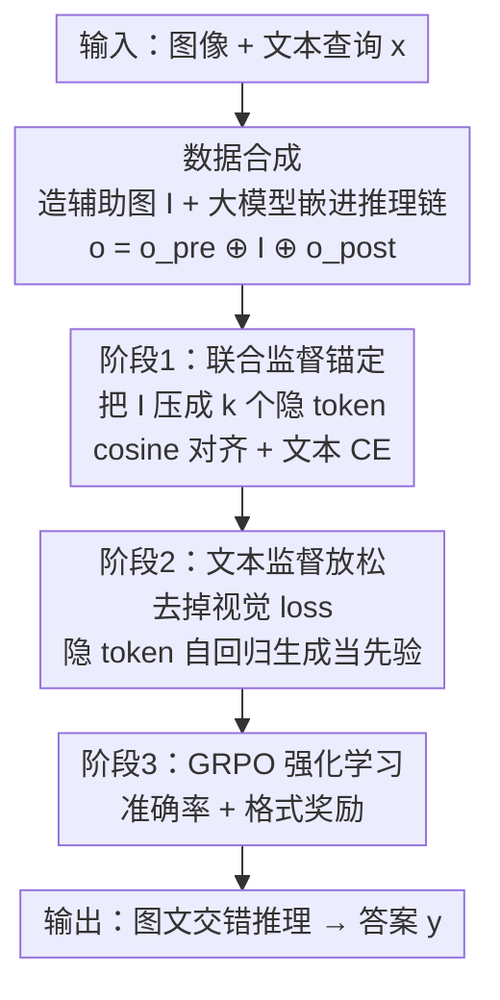

# Machine Mental Imagery: Empower Multimodal Reasoning with Latent Visual Tokens

**会议**: CVPR 2026  
**论文**: [CVF Open Access](https://openaccess.thecvf.com/content/CVPR2026/html/Yang_Machine_Mental_Imagery_Empower_Multimodal_Reasoning_with_Latent_Visual_Tokens_CVPR_2026_paper.html)  
**代码**: 无  
**领域**: 多模态VLM / 多模态推理  
**关键词**: 隐式视觉 token、交错推理、心理表象、空间推理、两阶段训练

## 一句话总结
本文提出 **Mirage** 框架，让 VLM 在解码时把自己的隐藏状态当作「隐式视觉 token」直接续写进文本序列，从而在不生成任何真实像素图像的前提下进行图文交错的多模态推理；配合「先视觉锚定、再文本放松」的两阶段微调加 RL，在空间规划、拼图、空间关系等多个基准上稳定超越纯文本解码与显式生图的基线。

## 研究背景与动机

**领域现状**：视觉-语言模型（VLM）虽然能同时编码图像和文本，但它的解码端是**纯文本**的——所有推理都必须先「翻译」成语言再输出。靠 chain-of-thought 提示和 RL 微调，可以把这种文本推理链拉得更长、拿到额外收益。

**现有痛点**：可是很多任务（空间规划、拼图、相对方位判断）本质上要求模型在脑子里**操纵视觉元素**，光靠文字描述每个候选块、每条路径既啰嗦又容易出错。一条直觉的补救路线是让 VLM 学会**显式生图**（如 Chameleon、Anole、MVoT 这类统一 token 模型），边推理边画图。但作者指出两个硬伤：① 大规模像素级生成预训练和逻辑推理的目标差异巨大，逼一个模型同时擅长两者，往往**反而拖垮推理质量**；② 图像解码器画出来的图和输入图像难以形成真正交错的轨迹。

**核心矛盾**：**「生成像素」与「保住推理能力」之间存在 trade-off**——你给模型加的生图负担越重，它留给推理的容量就越少。

**切入角度**：作者借鉴认知科学的**心理表象（mental imagery）**理论：人在思考时并不会在脑中渲染照片级的图像，而是构造和操纵**只保留任务相关信息的简化草图**（看拼图只看碎片轮廓、找钥匙只回忆架子边缘）。那么——VLM 能不能也直接在它的**隐式视觉嵌入空间**里推理，把紧凑的视觉嵌入织进文本流，彻底跳过显式生图？

**核心 idea**：用模型**自己的隐藏状态**充当「隐式视觉 token」续写进上下文，以此替代真实图像生成，让模型把全部容量投在推理上，同时仍享受视觉线索的引导。

## 方法详解

### 整体框架
Mirage 的核心机制非常简洁：当模型在解码过程中决定「视觉地思考」时（通过产生一个特殊 token 触发），它**不走语言投影层**，而是把当前最后一层的隐藏状态直接当作一个紧凑的视觉嵌入、追加回上下文，再继续往后生成文本。这样就在文本 token 之间插入了若干「隐式视觉 token」，形成一条图文交错的推理轨迹，全程**不需要任何外部图像解码器**。

但 VLM 天生只会生成文本 token，要学会这种交错模式必须靠监督微调。整条管线分三步走：先**合成训练数据**（给每道题配一张「辅助图」并让大模型把它嵌进推理链）；再做**第一阶段联合监督**，逼模型把隐式 token 锚定到视觉子空间；最后做**第二阶段文本监督**，松开视觉约束、让隐式 token 自由地作为先验引导后续文本；两阶段 SFT 之后再加一轮 **GRPO 强化学习**进一步提升。

### 关键设计

**1. 隐式视觉 token：把隐藏状态当作下一个 token 续写，绕开像素生成**

这是全文的根。痛点在于：显式生图模型必须经过语言投影或图像解码器把内部表示「物化」成像素，既慢又把推理容量分走。Mirage 的做法是——当模型选择视觉地思考时，把**当前最后一层隐藏状态原封不动地复用为一个紧凑的视觉嵌入**，跳过语言投影层，直接 append 到上下文里作为「下一个 token」。这些内部嵌入为后续推理步骤提供了聚焦的视觉线索。因为它从来不离开模型的连续嵌入空间，所以既没有量化损失、也没有外部解码器开销，且天然可微，能让梯度回传。这正对应人类心理表象的「简化草图」：只保留任务相关信息，不渲染照片级细节。

**2. 辅助图驱动的数据合成：把「该想象什么」具象成一张可监督的图**

模型一开始根本不知道在推理链的哪一步、该想象出什么样的视觉内容，缺少交错推理的监督信号。作者为每道题 $x$ 用**任务专用工具**造一张辅助图 $I$：导航任务里把真值动作序列用红箭头画在起始地图上；拼图任务把候选碎片和参考图拼成一张组合图；空间任务用微调过的 CogVideoX-5B 渲染符合文字描述的场景图。然后把原始输入 $x$、真值答案 $y$、辅助图 $I$ 一起喂给一个大推理 VLM $M$，提示它产出一条**把辅助图嵌进推理过程**的分步推理 $o = M(x, y, I)$。由于辅助图嵌在链中间，自然把链切成前后两段 $o = o_{pre} \oplus I \oplus o_{post}$。如此批量合成出训练集 $D = \{x^{(i)}, I^{(i)}, o^{(i)}, y^{(i)}\}_{i=1}^N$。这张辅助图就是「该想象什么」的精确监督答案。

**3. 阶段一·联合监督做视觉锚定：压缩图像特征 + 余弦对齐**

直接拿合成数据训练有个隐患：让 VLM 自己合成辅助图，效果会被它有限的生图能力拖累。作者的巧招是**先让 VLM 把辅助图编码成 patch 级特征**，再训模型直接输出这些特征当隐式 token，从而彻底免去生图。具体地，把 $I$ 过 $f_\theta(\cdot)$ 得到 patch 特征 $\{e_1,\dots,e_n\}=f_\theta(I)$，再用 **average pooling** 压成 $k$ 个最显著的向量 $\{\hat e_1,\dots,\hat e_k\}=\text{Compress}(\{e_1,\dots,e_n\})$——只留任务关键的视觉摘要（这一步呼应「心理草图」）。训练目标对隐式 token 用**余弦相似度**对齐到目标向量：

$$\mathcal{L}_{visual} = \ell_{cos}\!\left(\hat e_j,\ g_\theta(o_{pre}, \hat e_{1:j-1})\right)$$

同时对周围文本 token 用标准交叉熵（$o_{pre}$ 只看前文，$o_{post}$ 还要 attend 那 $k$ 个压缩视觉嵌入）：

$$\mathcal{L}_{text} = \sum_{i=1}^{|o_{pre}|}\ell_{CE}\big(o_{pre,i}, f_\theta(x, o_{pre,<i})\big) + \sum_{i=1}^{|o_{post}|}\ell_{CE}\big(o_{post,i}, f_\theta(x, o_{pre}, \{\hat e_j\}_1^k, o_{post,<i})\big)$$

总目标 $\mathcal{L}_1 = \mathcal{L}_{visual} + \gamma\,\mathcal{L}_{text}$，把隐式 token 钉进视觉空间的同时教模型自然地把它织进文本思路。

**4. 阶段二·文本监督放松：去掉视觉 loss，让隐式 token 自由演化当先验**

第一阶段虽然把隐式 token 锚住了，但「强迫重建压缩图像嵌入」**过度约束**了模型，把容量从「答对题」这个主目标上分走，反而拉低推理表现。所以第二阶段**彻底移除余弦 loss，只保留文本 CE**。此时隐式 token 由模型自回归地自己产生 $e_j = f_\theta(x, o_{pre}, e_{<j})$，替代第一阶段的压缩图像向量、作为后续文本 token 的先验。由于 $\{e_i\}_1^k$ 连续可微，而 $o_{post}$ 的预测是这些隐式 token 的函数，梯度能通过文本 loss 回传到隐式 token 上——于是模型在**已学到的视觉子空间内**优化隐式 token 的生成，让它们成为灵活、贴合任务的先验，给出比硬性匹配预设嵌入更自适应的推理轨迹。消融显示两阶段缺一不可（见下文）。

**5. GRPO 强化学习：在交错轨迹上做探索式提升**

两阶段 SFT 后模型已会用图文交错推理，作者借鉴 long-CoT 语言模型再加一轮 **GRPO**。对每个查询采样多条回答，显式优化文本 token 概率、同时让梯度流过隐式 token。沿用 LMM-R1 的设计，用两类奖励：**准确率奖励** $r_{acc}=1$（答案正确）否则 0；**格式奖励**——检查思考过程是否包在 `<think></think>` 内、答案是否为 `\boxed{}` 格式，对则 0.1 否则 0。因为隐式视觉线索织在文本里，模型能自然探索更多样的序列，GRPO 之后在 VSP 上再涨约 2%。

## 实验关键数据

### 主实验

基座默认 Qwen2.5-VL 7B（部分迁移实验用 3B），隐式 token 数 $k=4$、loss 系数 $\gamma=0.1$、种子固定 42。基准覆盖 VSP（迷宫空间规划+空间推理）、BLINK-Jigsaw（拼图）、SAT（静/动态空间关系）、COMT-Geometry（数学几何空间推理）。每个任务采 1k 做 SFT、1k 做 RL。

VSP 主结果（准确率，节选 Avg.）：

| 方法 | 空间推理 Avg. | 空间规划 Avg. |
|------|------|------|
| Zero-Shot | 0.32 | 0.06 |
| Direct SFT | 0.83 | 0.72 |
| CoT SFT + GRPO | 0.85 | 0.51 |
| Anole（显式生图） | 0.52 | 0.01 |
| MVoT | 0.61 | 0.11 |
| Aurora | 0.71 | 0.13 |
| **Ours (Direct)** | 0.86 | **0.76** |
| **Ours (CoT)** | 0.87 | 0.58 |
| **Ours + GRPO** | **0.89** | 0.60 |

相比直接拿合成数据微调，Mirage 在空间推理 +3%、空间规划 +11%；相比 CoT SFT + GRPO 分别 +2% / +7%；GRPO 再额外 +2%。值得注意：**显式生图基线（Anole/Aurora）表现很差**（规划仅 1%/13%），作者归因于显式生图的额外负担拖垮了推理。

Qwen2.5-VL 3B 在 Jigsaw / SAT 上的迁移结果（节选 Avg.）：

| 方法 | Jigsaw | SAT Synthetic | SAT Real Avg. |
|------|------|------|------|
| Direct SFT | 0.80 | 0.82 | 0.83 |
| ViGoRL | 0.56 | 0.75 | 0.67 |
| MindJourney | - | 0.84 | 0.73 |
| **Ours** | **0.85** | **0.85** | **0.89** |

COMT 数学几何上 Mirage（SFT 版）0.77，比最佳基线高约 5%；即便对手 MINT-CoT 是在大规模数学数据上专训、ViGoRL 在大规模空间数据上专训，Mirage 仍稳定胜出。

### 消融实验

两阶段设计消融（VSP 空间规划，准确率 Avg.）：

| 配置 | Avg. | 说明 |
|------|------|------|
| Full（两阶段） | 0.58 | 完整模型 |
| w/o Stage 1 | 0.52 | 去掉视觉锚定，隐式 token 漂移到无用区域，仅略好于纯文本 |
| w/o Stage 2 | 0.21 | 只锚定不放松，隐式 token 被过度约束，大幅掉点 |

超参鲁棒性（隐式 token 数 $k$、系数 $\gamma$，VSP 空间推理 Avg.）：

| $k$ | $\gamma$ | Avg. |
|------|------|------|
| 2 | 0.1 | 0.86 |
| 4 | 0.1 | 0.87 |
| 6 | 0.1 | 0.88 |
| 8 | 0.1 | 0.75 |
| 4 | 0.5 | 0.84 |
| 4 | 1.0 | 0.83 |

### 关键发现
- **两阶段缺一不可**：单留阶段二（0.21）远差于完整模型（0.58）——没有第一阶段的视觉锚定，隐式向量会漂进多模态嵌入空间里无助于推理的区域。这和 LLM 上「无监督隐式向量也能帮推理」的发现相反，说明 VLM 里视觉与文本子空间足够异质，必须有一个 grounding 阶段。
- **$k$ 不是越多越好**：$k$ 从 2 到 6 都很稳（$k=6$ 略好），但 $k=8$ 骤降约 13%，作者归因于自回归非解码生成下更长隐式序列的误差累积；这与 LLM 上「最优隐式推理通常少于 6 个 token」的结论一致。
- **辅助图确实有信息量**：把辅助图直接当输入喂给模型，两个 VSP 任务都能逼近 ~100% 准确率，说明合成的辅助图真的编码了任务关键的视觉线索，构成 Mirage 的性能上界。
- **诚实的反例**：VSP 空间规划上，用合成推理思路微调反而不如直接用答案标签训练——作者承认部分重感知任务未必受益于显式推理，且合成思路由 Qwen2.5-VL-32B 生成、并非完美，瑕疵会传进基座；SAT 的辅助图由视频生成模型产出、无真值标注，也会引入噪声。

## 亮点与洞察
- **「把隐藏状态当 token 续写」这一步极其轻量却抓住了要害**：不引入任何新解码器、不做像素监督，只是跳过语言投影层把 hidden state 回灌——却把「显式生图拖垮推理」这个 trade-off 直接绕了过去。这是最让人「啊哈」的设计。
- **用辅助图把抽象的「该想象什么」变成可监督目标**，再用 average pooling 压成几个向量，呼应认知科学的「心理草图只留任务相关信息」，理论动机和工程实现罕见地一致。
- **先锚定再放松的两阶段范式可迁移**：任何想让模型在连续隐空间里「思考」的任务，都可借鉴「第一阶段对齐到一个有意义的子空间、第二阶段松开约束让它自适应」的套路，避免无监督隐式向量乱漂。
- 隐式视觉 token 天然可微，使得 SFT、梯度回传、GRPO 能在同一连续轨迹上无缝衔接，工程上比离散图像 token 干净很多。

## 局限与展望
- **依赖合成数据质量**：辅助图和推理链由大模型/视频生成模型产出，瑕疵会传进基座；作者自己承认在 VSP 规划上合成思路甚至不如直接用答案标签训练。
- **隐式 token 数受限**：$k>6$ 即出现明显的自回归误差累积，限制了能注入的视觉信息量，复杂场景可能不够用。
- **任务依赖辅助图构造**：每个任务都要手工设计「怎么造辅助图」（画箭头、拼碎片、渲染场景），通用性受工具可得性约束，难以即插即用到任意新任务。
- **可解释性待挖**：隐式 token 究竟编码了什么仍只有初步分析；若能验证它是否真正「内化」了辅助图信息（论文提到的性能上界），将更有说服力。

## 相关工作与启发
- **vs MVoT / Anole / Chameleon（显式 token 生图）**：它们让统一模型直接吐出图像 token，需要大规模像素级监督、解码更重，且实验中在交错推理上表现差。Mirage 只吐紧凑隐式向量、不生像素，把容量留给推理，实测大幅领先。
- **vs Aurora**：Aurora 引入图像 de-tokenizer 显式生成感知 token；Mirage 完全不离开连续嵌入空间，更轻更省。
- **vs Coconut 等 LLM 隐式推理（[21]）**：那条线在纯语言隐空间里替换 CoT token 做高效/规划推理，且发现无监督隐式向量也有效；Mirage 的关键区别是把隐式 token 当作**探索视觉信息的桥梁**，并实证 VLM 必须先做视觉 grounding（无监督会失效），揭示了视觉-文本子空间的异质性。
- **vs ViGoRL / MindJourney / MINT-CoT（任务专精）**：这些在大规模空间/数学数据上专训；Mirage 用更少数据、靠通用的隐式视觉推理机制反而胜出，说明交错紧凑视觉线索是更本质的增益来源。

## 评分
- 新颖性: ⭐⭐⭐⭐⭐ 「隐藏状态当视觉 token 续写、彻底绕开生图」的思路简洁而本质，认知科学动机与实现高度自洽
- 实验充分度: ⭐⭐⭐⭐ 覆盖四类基准+多基座+两阶段/超参消融，且诚实报告反例；但每任务仅 1k 数据、规模偏小
- 写作质量: ⭐⭐⭐⭐ 动机—方法—实验逻辑清晰，图 3 pipeline 直观；个别公式排版略乱
- 价值: ⭐⭐⭐⭐⭐ 为「VLM 在隐空间做多模态推理」提供了一条低成本、可迁移的范式，对后续 latent 多模态推理有启发

<!-- RELATED:START -->

## 相关论文

- [\[CVPR 2026\] Latent Implicit Visual Reasoning](latent_implicit_visual_reasoning.md)
- [\[ICML 2026\] MentisOculi: Revealing the Limits of Reasoning with Mental Imagery](../../ICML2026/vlm_reasoning/mentisoculi_revealing_the_limits_of_reasoning_with_mental_imagery.md)
- [\[CVPR 2026\] Monet: Reasoning in Latent Visual Space Beyond Image and Language](monet_reasoning_in_latent_visual_space_beyond_image_and_language.md)
- [\[ICCV 2025\] Perspective-Aware Reasoning in Vision-Language Models via Mental Imagery Simulation](../../ICCV2025/vlm_reasoning/perspective-aware_reasoning_in_vision-language_models_via_mental_imagery_simulat.md)
- [\[CVPR 2026\] G$^2$VLM: Geometry Grounded Vision Language Model with Unified 3D Reconstruction and Spatial Reasoning](g2vlm_geometry_grounded_vision_language_model_with_unified_3d_reconstruction_and.md)

<!-- RELATED:END -->
