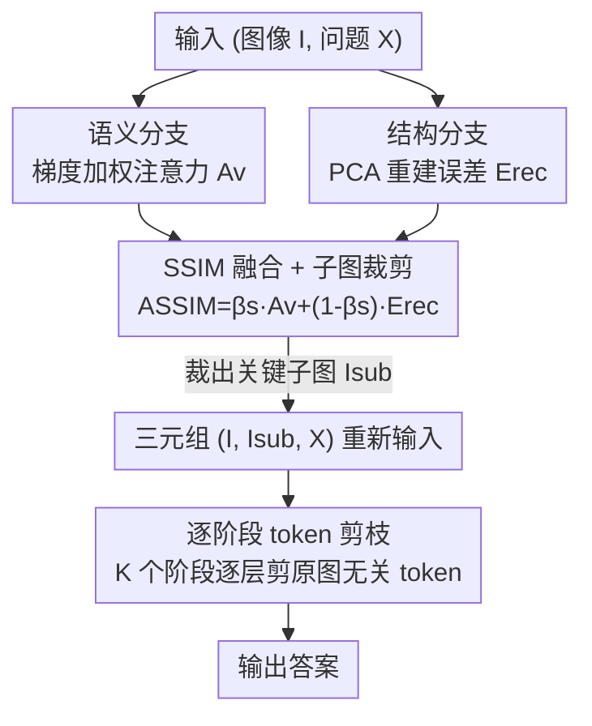

# Seeing What Matters: A Training-Free Self-Guided Framework for Multimodal Detail Perception and Reasoning

**会议**: CVPR 2026  
**论文**: [CVF Open Access](https://openaccess.thecvf.com/content/CVPR2026/html/Ma_Seeing_What_Matters_A_Training-Free_Self-Guided_Framework_for_Multimodal_Detail_CVPR_2026_paper.html)  
**代码**: 无  
**领域**: 多模态VLM  
**关键词**: 训练无关推理, 细粒度感知, 视觉 token 选择, 注意力 sink, token 剪枝  

## 一句话总结
SLoFo 模仿人类"扫视-定位-聚焦"的看图过程，**不训练、不加模块**，仅靠 MLLM 自身的梯度加权注意力（语义分支）和 PCA 重建误差（结构分支）融合出重要性图、裁出关键子图喂回模型，再用逐阶段 token 剪枝抑制无关视觉噪声，在 LLaVA-v1.5-7B 上把 TextVQA 提了 4.79%、DocVQA 提了 12.01%。

## 研究背景与动机

**领域现状**：多模态大模型（MLLM）在视觉问答、空间理解、文档分析等任务上已经很强，但主流开源模型（如 LLaVA-v1.5）是**固定分辨率**的——图像被统一缩放到 $336^2$ 像素再切成视觉 token 送进语言模型。

**现有痛点**：固定分辨率带来两个具体毛病。一是**注意力分散（distracted attention）**：模型确实能给相关区域分配一定注意力，但大量语义不相关的区域也会抢到很高的注意力，干扰细节判断；二是**视觉模糊（blurry vision）**：哪怕模型定位到了目标区域，受限于固定输入分辨率，它也没法"放大"去看清——高分辨率图里的小目标、小文字直接糊掉。论文用 V\* benchmark 里"穿黄色背包的女人是什么姿势"的例子说明：LLaVA-v1.5 因为这两个毛病选错了答案。

**核心矛盾**：要看清细节就得上高分辨率，但训练高分辨率模型计算代价高得离谱；而现成的固定分辨率 MLLM 其实已经涌现出了可用的注意力模式，只是没被显式利用起来。问题的根本在于——**模型有定位关键区域的潜力，但推理时既不会主动放大关键区域，也不会主动剔除无关噪声**。

**本文目标**：在不训练、不加外部网络的前提下，让模型推理前自动选出关键视觉区域（扫视-定位），推理时放大它们并逐步压制无关视觉噪声（聚焦），从而兼顾细粒度感知与计算效率。

**切入角度**：作者借了 LLM 里的一个观察——大模型在生成回答前已经"预规划"好了全局信息。把 MLLM **第一个待生成 token 当作 planning anchor（规划锚点）**，它编码了整个预期回答的全局属性，于是可以反过来用它去问"哪些视觉 token 对回答最关键"。

**核心 idea**：用模型自己的"规划锚点"，通过**梯度加权注意力 + 结构唯一性**两路互补证据定位关键区域、裁出子图，再用**逐阶段 token 剪枝**把背景噪声逐层清掉——全程零训练、零新增模块。

## 方法详解

### 整体框架

SLoFo（Scan-Locate-Focus）是一个套在现成 MLLM 外面的两阶段**推理时**框架，输入是图像 $I$ 和问题 $X$，输出是答案。

第一阶段 **Scan-Locate（扫视-定位）**：先让模型对 $(I, X)$ 做一次前向，从中并行抽两路证据。**语义分支**用 planning anchor 对视觉 token 的注意力、再乘上梯度敏感度，得到"哪些 token 真正影响回答规划"的语义图 $A_v$；**结构分支**对早层视觉隐藏特征做 PCA 重建，用重建误差衡量每个 token 的"视觉独特性" $E_{rec}$，专门用来对付语义图会被注意力 sink 污染的问题。两路融合成 **SSIM（Semantic-Structural Importance Map）**，再用滑窗搜出"内外对比度最大"的窗口裁出关键子图 $I_{sub}$。

第二阶段 **Focus（聚焦）**：把 $(I, I_{sub}, X)$ 三元组重新喂进 MLLM 做真正的推理。子图带来了更清晰的细节，但也多出了视觉 token；于是把语言模型的 transformer 层分成 $K$ 个阶段，每阶段末尾按 planning anchor 的注意力把**原图**里最不相关的 token 剪掉（子图 token 全保留），逐阶段抬高前景/背景的注意力对比，同时把多出来的算力开销摊掉。

### 关键设计

**1. 语义分支：用 planning anchor 的梯度加权注意力定位"真正影响回答"的区域**

裸用注意力来选区域有个大坑——注意力 sink：一些没信息量的 token 会像寄存器一样持续吸走高注意力，导致基于注意力的选择不稳定（论文里 "S1 pure att" 消融印证了这点）。SLoFo 的做法是不只看"注意力大不大"，还看"这个注意力对回答规划有没有因果贡献"。具体地，取模型最后一个输入 token（即第一个待生成 token）作为 planning anchor，抽它在第 $l$ 层对视觉 token 的注意力 $A^l_{a2v}\in\mathbb{R}^{N_v}$；再把这个 anchor 过一遍语言模型头采样出一个伪 token $\hat y_0$（不进最终答案，只当语义监督信号），对 $\hat y_0$ 关于 $A^l_{a2v}$ 求梯度得到敏感度图 $G_v=\sigma(\nabla_{A^l_{a2v}}\hat y_0)$（$\sigma$ 把负值截到 0）。最终语义影响为：

$$A_v = A^l_{a2v}\odot G_v$$

$\odot$ 是逐元素乘。直觉是：$G_v$ 衡量"每个 token 注意力的变化对规划锚点的贡献有多大"，所以 $A_v$ 抓的是**对决策真正有因果影响**的 token，而不是单纯被注意力 sink 吸住的高注意力区。论文用 $l=14$ 层（中层注意力更稳更细），消融显示这比纯注意力在 V\* 上高出近 9 个点。

**2. 结构分支：用 PCA 重建误差补一路"语义无关但更鲁棒"的唯一性证据**

光有语义分支还不够稳——注意力分布会随 prompt 的内容/格式/长度大幅变化，而且注意力 sink、高频噪声边界会让无关区域照样拿到很高的 $A_v$。SLoFo 引入一路**完全不依赖注意力、只看视觉特征**的结构分支来补强。核心直觉：能用很少几个主成分就重建好的 token 通常是冗余的背景（主色调、平坦区域），重建误差大的 token 才携带独特视觉信息。做法是取早层 $l'$ 的视觉隐藏状态 $H_v\in\mathbb{R}^{N_v\times D_t}$，用 PCA 投到低维子空间 $f_{PCA}:\mathbb{R}^{D_t}\to\mathbb{R}^{D_{PCA}}$（$D_{PCA}\ll D_t$，论文 $D_{PCA}=20$）再重建回 $\hat H_v$，逐 token 的重建误差为：

$$E_{rec}=\frac{1}{\sqrt{D_t}}\sum_{d=1}^{D_t}(H_v-\hat H_v)^2\in\mathbb{R}^{N_v}$$

误差大 = 结构上更独特、更可能是信息量大的前景。PCA 在这里被选中是因为它轻量、模型无关、零训练零监督。注意它**不能单独用**——结构分支只懂"独特不独特"、不懂"和问题相关不相关"，所以论文没做"纯结构"消融，它的定位就是给语义分支托底、抗注意力不稳定。

**3. SSIM 融合 + 滑窗裁剪：把两路证据合成重要性图，裁出对比度最大的关键子图**

两路证据用系数 $\beta_s$ 线性融合成 Semantic-Structural Importance Map：

$$A_{SSIM}=\beta_s A_v+(1-\beta_s)E_{rec}$$

论文取 $\beta_s=0.7$（语义为主、结构为辅）。有了 SSIM 还要从中裁出子图：SLoFo 在多个窗口尺寸上滑窗搜累计证据最高的子区域，但不是简单取证据和最大的窗——而是挑**内部-邻域对比度最大**的窗（窗内平均证据与四周差异最大）。这个细节是为了避免窗口贪心地越框越大、或一路贴到图像边缘（bounding box 常见的退化）。裁出的子图 $I_{sub}$ 和原图、问题组成新三元组 $(I, I_{sub}, X)$ 送回模型——相当于给模型一个"放大镜"，原图保上下文、子图保细节。

**4. 逐阶段 token 剪枝：聚焦阶段逐层清掉原图背景噪声，顺带摊掉子图开销**

加子图带来更清晰的细节，但 LLaVA 类模型一张子图就多 576 个 token，算力开销上来了。SLoFo 基于两个经验观察设计了逐阶段剪枝：(1) 视觉信息主要在 LLM 早层被消化、深层影响递减；(2) 模型本就能凭语义+结构信号区分有用/冗余 token。于是把 $\theta_t$ 的 transformer 层均分成 $K$ 个阶段（论文 $K=4$），在每个阶段 $j$ 的末层 $l_j$ 抽 planning anchor 对**原图剩余 token** 的注意力 $A^{l_j}_{a2v}$，把注意力最低的（排在底部百分位）那批 token 剪掉、下阶段不再参与计算；**子图 token 全程保留**以保证细节聚焦。论文里 focused token ratio 随阶段从 52.69% 抬到 84.31%、93.67%——前景/背景注意力对比被逐层拉大，相当于一边"聚焦"一边"瘦身"，既提了信噪比又把子图带来的额外开销抵消掉。

### 一个例子：看清球衣上的字

问题"白裤黄衣那个人球衣上写了什么"。基线 LLaVA-v1.5 看整张图、注意力被无关区域分散，答不准。SLoFo 先在 Scan-Locate 阶段算出 SSIM——语义分支沿问题把注意力导向那名球员、结构分支把球衣纹理这种高独特性区域顶上来，融合后 SSIM 在球衣区域亮起，滑窗裁出以球衣为中心、内外对比度最大的子图。子图喂回模型后细节清晰，再经 4 阶段 token 剪枝把背景看台、草地等 token 一层层剪掉、focused ratio 升到 93.67%，模型最终读出球衣上的 "HALL 17"。

## 实验关键数据

基线统一用最常用的固定分辨率开源模型 **LLaVA-v1.5-7B**；SLoFo 默认配置 $l=14, l'=7, D_{PCA}=20, \beta_s=0.7, K=4$、每阶段剪掉剩余原图 token 的 50%。"SLoFo high-res" 是把高分辨率图切块、各块跑 pipeline 收集全局 SSIM 再裁子图的可扩展版本。

### 主实验

细节敏感任务（准确率 %，节选）：

| 任务 | 基线 LLaVA-v1.5 | ViCrop | DyFo | SLoFo | SLoFo high-res |
|------|------|------|------|------|------|
| TextVQA | 58.23 | 61.56 | - | **63.02** | 64.67 |
| POPE | 85.31 | 87.12 | 87.71 | **88.19** | 88.55 |
| DocVQA | 15.68 | 19.84 | - | **27.69** | 29.16 |
| V\* | 42.41 | 56.02 | 59.16 | 57.59 | **61.78** |
| HR-Bench-4K | 35.125 | 42.25 | - | **44.25** | 46.125 |
| HR-Bench-8K | 31.25 | 33.875 | - | **36.875** | 38.625 |

默认 SLoFo 在 TextVQA 上比基线 +4.79%、比 ViCrop +1.46%；DocVQA 大涨 +12.01%；高分辨率 HR-Bench 上 +9.125%（4K）/ +5.625%（8K）。V\* 上默认版略低于 DyFo（57.59 vs 59.16），但 DyFo 要多轮视觉搜索 + 额外模块，SLoFo 是一次性 pipeline；high-res 版反超到 61.78%，超过所有训练无关基线。

通用视觉推理任务上 SLoFo 也普涨：GQA +1.46%（high-res +2.58%）、VQAv2 +4%+、SEED +0.72%，说明虽然是为细节设计的，附带的视觉信号对宽泛理解也有增益。VizWiz、SQA 这类低质量/缺高频结构的图上，high-res 不再带来额外提升。

### 消融实验

三大组件：S1（语义选择分支）、S2（结构补强分支）、TP（逐阶段 token 剪枝），LLaVA-v1.5-7B 默认分辨率：

| 配置 | TextVQA | POPE | DocVQA | V\* | VQAv2 |
|------|------|------|------|------|------|
| Baseline | 58.23 | 85.31 | 15.68 | 42.41 | 75.24 |
| S1 | 61.71 | 86.64 | 25.29 | 56.07 | 76.11 |
| S1+S2 | 62.67 | 87.23 | 26.45 | 57.23 | 78.23 |
| S1+TP | 62.73 | 88.01 | 26.71 | 57.16 | 77.90 |
| S1+S2+TP (Full) | **63.02** | **88.19** | **27.69** | **57.59** | **79.44** |
| S1 pure att | 60.98 | 86.28 | 16.29 | 51.31 | 76.09 |

### 关键发现

- **语义分支（S1）是主引擎**：单 S1 就把 V\* 拉了 +14.66%、TextVQA +3.48%，说明用模型自己的规划锚点选区域确实有效。
- **梯度加权 vs 纯注意力**："S1 pure att"（直接用同层裸注意力当证据图）在 DocVQA 上几乎没涨（+0.61% vs S1 的 +9.61%），证实注意力 sink 会污染裸注意力，梯度加权才提供了"因果可靠"的证据图——这是语义分支的核心 justification。
- **结构分支补的是鲁棒性**：S2 在纹理丰富/高分辨率图上对语义分支补强最明显；它无法单独定位任务相关区域，所以"纯结构"消融没意义。
- **三件套有协同**：VQAv2 从 75.24 一路涨到 79.44（+4.20%），三个模块叠加效果最好。
- **POPE 抗扰**：在对抗（adversarial）high-res 设置下 F1 提升最显著（MSCOCO +4.75、GQA +2.62），说明子图聚焦 + 剪枝对幻觉/扰动更鲁棒。
- **超参**：语义层 $l=14$ 最优（60.21%），早层注意力太糙、中层更稳；结构层 $l'=7$ 配 $\beta_s=0.7$ 由二维网格搜索定出。
- **开销**：RTX4090 上 SLoFo 单样本总开销 0.57s（Scan-Locate 0.34s + Focus 0.23s），低于 ViCrop 的 0.79s；CPU 上 47.92s vs ViCrop 77.58s——token 剪枝把子图带来的额外开销摊平甚至反超。

## 亮点与洞察
- **把"第一个待生成 token"当 planning anchor 是点睛之笔**：它一行 forward 就编码了预期回答的全局属性，借它反传出梯度敏感度图，等于让模型自己说"我要回答这个问题该看哪儿"，全程零训练零新增参数——这个 trick 可迁移到任何需要"问题感知区域定位"的 MLLM 推理增强场景。
- **梯度加权专治注意力 sink**：单纯用注意力选区域几乎是踩坑标配，本文用伪 token 监督 + 梯度截断把"高注意力但无因果贡献"的 sink 区域过滤掉，"S1 pure att"消融把这个动机钉得很实。
- **PCA 重建误差当结构唯一性证据**：用"少数主成分能否重建"区分背景冗余 vs 前景独特，轻量、模型无关，是一条和注意力完全正交的证据，可作为各类 token 重要性度量的便宜补充信号。
- **滑窗挑"内外对比度最大"而非"证据和最大"**：一个小但关键的工程细节，直接避免了裁框贪心膨胀/贴边的退化，值得借鉴到任何基于热图裁 ROI 的方法。
- **token 剪枝从"省算力"升级成"提信噪比 + 摊子图开销"**：把效率手段和性能目标统一起来，逐阶段抬 focused ratio 的设计很优雅。

## 局限与展望
- **依赖模型已有的注意力/特征质量**：整套方法是"自引导"的，如果底座 MLLM 本身注意力模式很糙（如论文提到的早层、或弱模型），语义分支定位会不稳，方法收益会打折。
- **对低质量/缺高频结构的图无效甚至无增益**：VizWiz、SQA 上 high-res 不涨，说明子图放大 + 结构分支的前提是"图里真有可放大的细节结构"，对模糊/低质图失灵。
- **只在 LLaVA-v1.5-7B 单一底座上验证**：虽然方法号称模型无关，但实验都绑在固定分辨率的 LLaVA 上，对原生高分辨率/动态分辨率 MLLM（如 Qwen2-VL 类）是否还有增量收益没验证。
- **一次性单子图裁剪的上限**：V\* 上默认版输给多轮搜索的 DyFo，暗示"只裁一个子图"对需要多区域协同推理的难样本可能不够，可探索轻量多轮/多子图扩展。
- **超参偏经验**：$l, l', \beta_s, K$、剪枝比例都靠网格搜索定，换任务/换模型可能要重调。

## 相关工作与启发
- **vs ViCrop / SEAL / DyFo（视觉搜索/裁剪类）**：它们多需要外部搜索模块或多轮搜索（DyFo），SLoFo 是一次性 pipeline、零额外模块、且开销更低（0.57s vs ViCrop 0.79s），在多数细节任务上反超；代价是 V\* 这类需要多区域搜索的样本上默认版略逊。
- **vs 训练高分辨率 MLLM**：直接训高分辨率模型性能好但算力代价高，SLoFo 走"推理时增强现成固定分辨率模型"的路线，零训练拿到接近的细节感知收益。
- **vs 纯注意力 token 选择/剪枝方法**：本文指出裸注意力受注意力 sink 污染，用梯度加权 + PCA 结构证据两路互补提升鲁棒性，"S1 pure att"消融是对这类方法的直接反例。

## 评分
- 新颖性: ⭐⭐⭐⭐ 把 LLM 的 planning-anchor 思想搬到 MLLM 视觉区域选择、再叠 PCA 结构证据 + 逐阶段剪枝，组合新颖且训练无关
- 实验充分度: ⭐⭐⭐⭐ 12 个 benchmark、组件消融、超参网格、开销分析、POPE 细分都齐，但只在 LLaVA-v1.5-7B 单底座上验证
- 写作质量: ⭐⭐⭐⭐ Scan-Locate-Focus 故事线清晰，图 2 把两阶段讲得很直观
- 价值: ⭐⭐⭐⭐ 即插即用、零训练、降开销，对部署固定分辨率 MLLM 做细粒度感知有直接实用价值

<!-- RELATED:START -->

## 相关论文

- [\[CVPR 2026\] DeepScan: A Training-Free Framework for Visually Grounded Reasoning in Large Vision-Language Models](deepscan_a_training-free_framework_for_visually_grounded_reasoning_in_large_visi.md)
- [\[CVPR 2026\] Breaking the Regional Perception Bottleneck of Multimodal Large Language Models via External Reasoning Framework](breaking_the_regional_perception_bottleneck_of_multimodal_large_language_models_.md)
- [\[CVPR 2026\] Generate, Analyze, and Refine: Training-Free Sound Source Localization via MLLM Meta-Reasoning](generate_analyze_and_refine_training-free_sound_source_localization_via_mllm_met.md)
- [\[CVPR 2026\] Graph-to-Frame RAG: Visual-Space Knowledge Fusion for Training-Free and Auditable Video Reasoning](graph-to-frame_rag_visual-space_knowledge_fusion_for_training-free_and_auditable.md)
- [\[CVPR 2026\] CARE What Fails: Contrastive Anchored-REflection for Verifiable Multimodal Reasoning](care_what_fails_contrastive_anchored-reflection_for_verifiable_multimodal_reason.md)

<!-- RELATED:END -->
