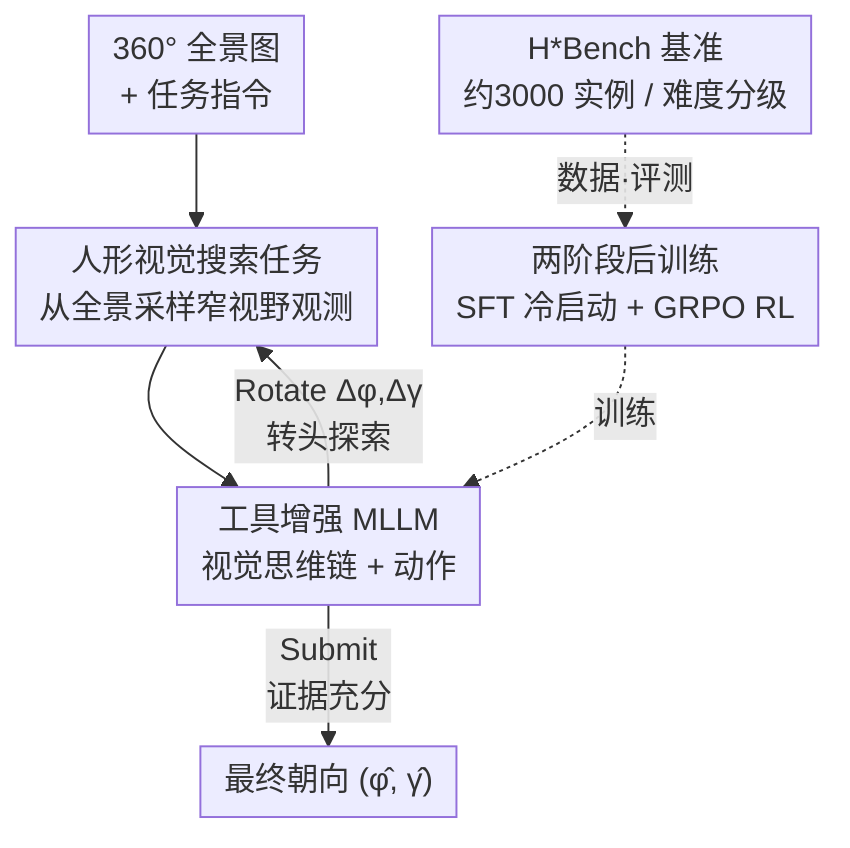

# Thinking in 360°: Humanoid Visual Search in the Wild

**会议**: CVPR 2026  
**论文**: [CVF Open Access](https://openaccess.thecvf.com/content/CVPR2026/html/Yu_Thinking_in_360deg_Humanoid_Visual_Search_in_the_Wild_CVPR_2026_paper.html)  
**代码**: https://humanoid-vstar.github.io  
**领域**: 多模态VLM / LLM推理 / 具身视觉搜索  
**关键词**: 人形视觉搜索, 360°全景, 视觉思维链, 具身推理, 后训练

## 一句话总结
论文把"视觉搜索"从静态 2D 图像里的裁剪缩放，升级成人形智能体在 360° 全景里**主动转头**找物体/找路的具身任务（HVS），用全景图当零硬件的轻量模拟器闭合"感知—动作"环路，配套提出 in-the-wild 基准 H\*Bench，并用 SFT+GRPO 两阶段后训练把 3B 开源模型的物体搜索成功率从 14.83% 拉到 47.38%、路径搜索从 6.44% 拉到 24.94%。

## 研究背景与动机

**领域现状**：当前最强的视觉搜索方法基本都建立在多模态大模型（MLLM）之上，借助它们丰富的世界知识（如物体共现关系）来定位画面里的目标。代表作 V\* 及其后续（Chain-of-Focus、Mini-o3 等）的范式是：给一张静态、低分辨率的图，模型通过**裁剪、放大、选 ROI** 这类纯计算操作在固定画布内"看清"细节。

**现有痛点**：这套范式有两个根本缺陷。一是**非交互**（non-interactive）——没有可交互的模拟器，模型无法改变视角去获取初始视野之外的信息，看不到的永远看不到；二是**无具身**（disembodied）——视觉推理和物理世界的动作完全脱钩，搜索往往不被真实的具身任务（操作、导航）驱动，退化成抽象的感知练习。

**核心矛盾**：人类做视觉搜索靠的是**头（cephalomotor）和眼（oculomotor）的协同**——头负责大幅转向去探索没看过的区域，眼负责在已看到的内容里做精细扫视。现有 MLLM 方法只有"眼"（在静态画布上缩放），完全没有"头"（改变物理视角）。而要补上"头"，传统做法需要 3D 模拟器或真实硬件，前者难造、感知真实感差，后者难规模化复现，且大多被限制在简单的家居场景。

**本文目标**：构造一个既具身又可交互、还能规模化的视觉搜索研究平台，并把它推到**真正考验视觉-空间推理的 in-the-wild 复杂场景**（地铁枢纽、大型商超、城市街道）里。

**切入角度**：作者的关键观察是——导航中的人类推理是**间歇性**的，只在关键决策点（停下来观察、判断、消歧）才被触发。把全身运动抽象成"转头"这个原子动作，正好抓住了这些关键认知点；而一张高分辨率 360° 全景图，就足以充当让智能体"转头改变输入"的轻量闭环环境，绕开了 3D 仿真和真实硬件。

**核心 idea**：用一张 360° 全景图当零硬件模拟器，让 MLLM 把"转头"当成一个动作工具反复调用，边转边推理（视觉思维链），从被动的"图像描述者"变成主动的"具身搜索者"。

## 方法详解

### 整体框架

任务叫**人形视觉搜索（Humanoid Visual Search, HVS）**：一个视野受限（narrow FoV）的人形智能体被放进由单张 360° 全景图表示的世界，给定一句语言指令，它要通过一连串"转头"动作把目标搜到，最后提交一个最优朝向。整个环境就是全景图 $S_o=\{o_{\phi,\gamma}\}$，每个观测 $o_{\phi,\gamma}$ 是从全景里按方位角 $\phi$、俯仰角 $\gamma$ 采样出来的一张窄视野透视图。HVS 的目标形式化为：在给定指令 $x$ 和观测 $o_{\phi,\gamma}$ 下，找到使任务成功概率最大的方向

$$(\phi^*, \gamma^*) = \arg\max_{\phi,\gamma} P(r_s \mid o_{\phi,\gamma}, x)$$

它落到两个具体子任务上：**物体搜索（HOS）**——把目标物体转进视野中央的中央凹区域，作为操作（manipulation）的前置；**路径搜索（HPS）**——找到通往目的地的可行路径并把身体朝向对齐，作为移动（locomotion）的前置（HPS 只需对齐 $\phi^*$，因为地面可近似为平面）。

推理时，模型是一个工具增强的 MLLM，策略 $\pi_\theta(y_t, a_t \mid o_t, x, H_t)$：每个时刻 $t$ 它基于当前观测 $o_t$、指令 $x$ 和历史 $H_t=\{(o_i,y_i,a_i)\}_{i=1}^{t-1}$，先吐一段文本思维链 $y_t$，再吐一个动作 $a_t$。动作空间只有两个原语——**转头** $a_t^{rot}=(\Delta\phi,\Delta\gamma)$ 更新视角（右/上为正，偏航是环形的），和**提交** $a_t^{sub}$ 把当前朝向定为最终估计 $(\hat\phi,\hat\gamma)$ 并结束 episode。这样"转头探索 → 看到新内容 → 继续推理"就构成了一个闭环的视觉思维链。

由于 MLLM 是在静态、无具身的互联网数据上训练的，天然缺空间常识和主动 3D 规划能力（连 GPT-4o 在这上面也只有约 20% 成功率），作者用**两阶段后训练**把它改造成合格的搜索智能体：Stage 1 用 SFT 灌入基本的任务推理和工具调用能力，Stage 2 用 GRPO 强化学习把它打磨成会探索的策略。所有数据和评测都由作者新建的 **H\*Bench** 基准提供。

### 关键设计

**1. 人形视觉搜索任务：用 360° 全景当零硬件模拟器闭合感知—动作环路**

这一招直接针对前面两个痛点——"非交互"和"无具身"。传统 2D 视觉搜索的动作只能在固定画布上裁剪缩放，看不到初始视野外的世界；而真要让模型转头看世界，又得搬出难造、难规模化的 3D 模拟器或真实硬件。作者的关键洞察是：把全身运动抽象成"转头"这一个原子动作，再用**一张 360° 全景图就足以表示整个可观测世界**。智能体起步时只有一个窄视野透视图 $o_{\phi_t,\gamma_t}$，每次执行 $a^{rot}=(\Delta\phi,\Delta\gamma)$ 就在全景上重新采样出新视角（$\phi_{t+1}=\phi_t+\Delta\phi$，$\gamma_{t+1}=\gamma_t+\Delta\gamma$），于是"转头改变视觉输入"这个闭环被廉价地复现了——没有任何物理硬件，却同时拿到了交互性和具身性。这也精确对应了人类"头探索未见、眼利用已见"的嵌套搜索机制：头的大角度转向负责探索，提交前的精细对齐对应眼的扫视。

**2. 工具增强的 MLLM 与视觉思维链：把"转头"当成可反复调用的动作工具**

光有环境还不够，得让 MLLM 学会把视觉推理和物理动作耦合起来。作者借用"MLLM + 工具"的范式，但关键区别在于：以往工具调用是 OCR、裁剪、缩放这类**对静态图像文件的计算操作**，动作始终发生在无具身的 2D 画布上；这里作者把工具换成了**真实世界的动作——主动转头**。每一步模型先生成观测对齐的文本推理 $y_t$（比如"什么都没看到，应该转身"或"看到了闸机标志，证据充分"），再决定是继续 $a^{rot}$ 探索还是 $a^{sub}$ 提交。多步推理 $\{(o_i,y_i,a_i)\}$ 被串成一条**视觉思维链**，把被动的视觉推理真正升级成主动的具身推理——这是论文反复强调的"从描述者到搜索者"的那座桥。

**3. 两阶段后训练：SFT 冷启动建行为先验，GRPO 强化学习炼策略**

互联网数据训出来的 MLLM 缺的是空间常识和主动规划，直接零样本上场连 GPT-4o 也只有约 20%。作者用两阶段后训练补这一课。**Stage 1（SFT）** 在一批精心构造的多轮轨迹上做全参数微调，教会模型从多模态输入生成结构化的动作计划、建立基础的任务推理与工具调用先验——这批冷启动数据是用人工标注的最优动作 + GPT-4o 生成的、再经人审校去幻觉的思维链 rationale 拼出来的（2000 条多轮轨迹）。**Stage 2（RL）** 用 GRPO（Group Relative Policy Optimization）继续打磨策略，鼓励长程推理，把模仿学习的行为先验拔高成更鲁棒、可泛化的探索策略。作者实测发现两者分工明确：SFT 贡献了绝大部分增益（3B 模型 HOS 14.83→40.83、HPS 6.44→23.00），RL 只做温和的精修（HOS 再 +6.55、HPS 再 +1.94）；而且**不先 SFT 直接上 RL 会破坏指令跟随能力**，顺序不能颠倒。

**4. H\*Bench 基准：把视觉搜索从家居场景搬到 in-the-wild 复杂世界**

要研究真正考验视觉-空间推理的搜索，就得有够难的场景——既有的具身平台要么感知真实感差，要么困在家居场景里。H\*Bench 用高分辨率全景视频（最高 $7680\times3840$）构建了约 3000 个标注任务实例，每个实例给 4 个不同起始朝向，合计 12000 个搜索 episode；覆盖 12 个国家、6 大场景类别、18 个细粒度场景类型（交通枢纽、大型零售、公共机构、城市街道等）。标注上，标注者在透视视图界面里自由转相机、写自然语言指令、画紧致 bbox，bbox 反投影回全景后其中心即给出最优方向 $(\phi^*,\gamma^*)$。配套一套**难度分类法**让评测可解释：HOS 按目标初始可见度 $d$（可见面积占完整面积的比例）分 Easy（$d\ge0.5$）/ Medium（$0\le d<0.5$）/ Hard（$d=0$，初始完全不可见）；HPS 按"有无文字线索 × 线索与真实路径是否对齐"两因素分 Easy/Medium/Hard/Extreme。评测用容差区域判成功——HOS 用 $\tau_\phi=30°,\tau_\gamma=20°$（模拟人眼中央凹），HPS 用更严的 $\tau_\phi=10°$（要求精确运动方向）。

### 损失函数 / 训练策略
- **SFT**：在混合的物体+路径搜索数据上做全参数微调，训 3 个 epoch；训练框架用 LLaMA-Factory。
- **RL（GRPO）**：在 SFT 后的 Qwen2.5-VL-3B 上训 70 步得到 HVS-3B，框架基于 VAGEN。奖励做了消融（format / correctness / distance-to-goal 的组合，见下表）。
- **效率发现**：短 GRPO rollout 配测试时扩展即可媲美长 rollout（10 轮），收敛更快；测试时上下文只需 2 轮历史就够。

## 实验关键数据

### 主实验（H\*Bench 成功率 %，Overall）

| 模型 | HOS 物体搜索 | HPS 路径搜索 | 说明 |
|------|------|------|------|
| Qwen2.5-VL-3B（base） | 14.83 | 6.44 | 开源小模型零样本 |
| + SFT | 40.83 | 23.00 | SFT 贡献主要增益 |
| + RL = **HVS-3B** | **47.38** | **24.94** | 物体搜索翻三倍多 |
| Qwen3-VL-8B + SFT = HVS-8B | 60.29 | 32.87 | 微调后 HOS 最强 |
| Qwen3-VL-4B + SFT = HVS-4B | 54.71 | 31.00 | 4B 微调 |
| MiMo-Embodied-7B + SFT | 23.71 | 31.56 | 具身数据训练，HPS 进步最大 |
| GPT-4o（proprietary） | 19.75 | 23.69 | 闭源零样本 |
| Gemini2.5-Pro（proprietary） | 31.96 | 33.00 | 最强零样本 baseline |

关键读数：① 顶级闭源模型零样本也只有约 30%，HVS 是个开放难题；② 后训练后最小的 3B 模型在物体搜索（47.38）上反超 Gemini2.5-Pro（31.96），但所有微调模型在路径搜索上仍不及 Gemini 的 33.00；③ 模型更大不一定更好——Gemma-3 和 Qwen2.5-VL 系列里 4B/3B 在 HOS 上反超 12B/7B。

### 消融：HPS 上的奖励塑形（GRPO）

| 奖励配置 | Overall | Easy | Medium | Hard | Extreme |
|------|------|------|------|------|------|
| SFT（baseline） | 23.44 | 26.00 | 24.56 | 24.77 | 12.50 |
| format + correctness | 22.38 | 33.80 | 17.32 | 21.73 | 7.87 |
| format + corr + distance | 21.37 | 34.40 | 15.13 | 20.09 | 6.94 |
| format + distance | 21.31 | 29.80 | 17.54 | 20.56 | 11.11 |

所有奖励变体**只在 Easy split 上涨**（最高到 34.40），却普遍**拖垮更难的级别**（Overall 全部低于 SFT baseline 的 23.44）——这暴露了路径搜索的本质困难：很难设计出在所有难度上都与真实目标一致的奖励函数。

### 具身 vs. 无具身（跨基准对比）

| 方法 | V\*Bench（2D 静态） | H\*Bench（具身） |
|------|------|------|
| Mini-o3 | 88.2 | 2.5 |
| Chain-of-Focus | 88.0 | 11.6 |
| **HVS-3B（本文）** | 65.5 | 38.4 |

2D 视觉搜索方法在静态 V\*Bench 上已近饱和（88%+），但搬到具身 H\*Bench 上**断崖式暴跌到 2.5%/11.6%**——证明从被动互联网数据学到的能力无法迁移到 3D 主动交互。而本文 HVS-3B 在 H\*Bench 上拿到 38.4% 的同时，V\*Bench 仍保持 65.5%，说明它学会 3D 具身搜索却没怎么牺牲 2D 能力。

### 关键发现
- **SFT 立骨架、RL 做精修**：SFT 贡献绝大多数增益（HOS +26.00、HPS +16.56），RL 只温和加成（+6.55/+1.94）；先 RL 后 SFT 行不通，会破坏指令跟随。
- **路径搜索是硬骨头**：天花板明显更低，作者归因于它需要物理/空间/社会常识（如"墙不能穿""楼梯/警戒线/斑马线的功能"），而这些常识隐式、情境化、程序化，后训练难灌入；RL 甚至在 HPS 的 Medium（23.03→20.18）和 Extreme（14.81→12.04）上**反而掉点**。
- **双向跨任务协同**：只训物体搜索能把路径搜索从 6.4% 提到 20.7%，只训路径搜索能把物体搜索从 14.8% 提到 29.5%——主动探索和视觉定位两种技能互相增益。
- **效率**：短 rollout + 测试时扩展即可媲美长 rollout；测试时 2 轮上下文就够。

## 亮点与洞察
- **"全景图 = 零硬件具身模拟器"是个极聪明的简化**：它抓住了"导航推理只在关键决策点发生"这个观察，把全身运动抽象成转头，从而绕开 3D 仿真/真机的全部工程负担，却同时拿到交互性和具身性——这是整篇论文最值得迁移的 trick：当你需要"主动改变视角"但又付不起真实环境成本时，一张全景图可能就够了。
- **把"转头"当工具调用**，让视觉思维链从"在静态图上缩放"升级成"在 3D 世界里改变物理朝向"，干净地架起了被动感知推理和主动具身推理之间的桥。
- **诚实地量化了差距**：论文没有自夸 SOTA，而是反复强调即便后训练后路径搜索仍远未解决、RL 在难样本上会掉点，把"哪里还没解决"讲得比"我们多强"更清楚——这种态度让基准更有长期价值。
- **难度分类法可解释**：HOS 用初始可见度 $d$、HPS 用"线索-路径是否对齐"来分级，让"模型在什么场景下失败"变得可读，而不只是一个总成功率数字。

## 局限与展望
- **作者承认的局限**：后训练只能提升低层感知-运动能力（视觉定位、探索），对需要物理/空间/社会常识的高层推理（尤其 HPS）帮助有限，甚至 RL 在复杂任务上会反向退化；奖励函数难以在所有难度上对齐真实目标。
- **任务仍是抽象简化**：把全身运动压成"转头"这一个原子动作、用单张全景近似世界，回避了真实的连续移动、动态环境和多步导航执行——它评测的是"决定看哪"，不是"真的走到那"，离真机部署还有距离。
- **路径搜索的平面假设**：HPS 只对齐方位角 $\phi^*$、把地面近似为平面，对多层立体路径（楼梯/扶梯）的建模被简化掉了，而这恰恰是社会-空间常识最难的部分。
- **改进思路**：作者建议设计更鲁棒的奖励函数、更高效的视觉 tokenizer、能灌入"动作导向空间世界知识"的预训练方法，以及在不同难度间平衡性能；并强调规模化采集具身搜索数据是解锁 in-the-wild 视觉-空间推理的关键。

## 相关工作与启发
- **vs V\* / Chain-of-Focus / Mini-o3（2D 视觉搜索）**: 它们在静态 2D 图像内裁剪缩放，动作是对图像文件的计算操作；本文把动作换成物理转头、把环境换成 360° 全景闭环。结果是它们在 V\*Bench 上 88%+ 却在 H\*Bench 上跌到 2.5%/11.6%，本文 HVS-3B 在两边都站得住（65.5% / 38.4%）。
- **vs 视觉导航 / 视觉-语言导航**: 传统导航追求尽快走完整条轨迹，依赖难造的 3D 模拟器或真机，多被困在家居场景；本文只聚焦"关键决策点"的搜索推理，用全景图直接搭闭环，绕开了 3D 仿真与硬件，更易规模化。
- **vs Cosmos-Reason1 / Gemini Robotics-ER（具身推理 MLLM）**: 它们让 MLLM 通过视频感知物理世界并给出具身决策，但主动的、交织多模态推理的视觉搜索仍未被探索；本文正是补上"主动转头 + 视觉思维链"这块。

## 评分
- 新颖性: ⭐⭐⭐⭐⭐ 把视觉搜索从 2D 静态画布升级为 360° 全景具身闭环，"零硬件模拟器"的设定简洁而本质。
- 实验充分度: ⭐⭐⭐⭐ 覆盖多家开源/闭源/具身模型、HOS/HPS 双任务、难度分级、奖励消融与跨任务/跨基准分析，扎实；真机部署缺位。
- 写作质量: ⭐⭐⭐⭐⭐ 动机推导清晰、对失败与局限诚实，难度分类法让结论可解释。
- 价值: ⭐⭐⭐⭐⭐ 提出新任务 + 首个 in-the-wild 具身视觉搜索基准，为人形机器人/辅助技术/AR 的具身推理打开了一条可规模化的研究路径。

<!-- RELATED:START -->

## 相关论文

- [\[CVPR 2026\] Thinking with Programming Vision: Towards a Unified View for Thinking with Images](thinking_with_programming_vision_towards_a_unified_view_for_thinking_with_images.md)
- [\[ICLR 2026\] SpatiaLab: Can Vision-Language Models Perform Spatial Reasoning in the Wild?](../../ICLR2026/vlm_reasoning/spatialab_can_vision-language_models_perform_spatial_reasoning_in_the_wild.md)
- [\[CVPR 2026\] Thinking Diffusion: Penalize and Guide Visual-Grounded Reasoning in Diffusion Multimodal Language Models](thinking_diffusion_penalize_and_guide_visual-grounded_reasoning_in_diffusion_mul.md)
- [\[CVPR 2026\] VideoAuto-R1: Video Auto Reasoning via Thinking Once, Answering Twice](videoauto-r1_video_auto_reasoning_via_thinking_once_answering_twice.md)
- [\[CVPR 2026\] Thinking with Drafts: Speculative Temporal Reasoning for Efficient Long Video Understanding](thinking_with_drafts_speculative_temporal_reasoning_for_efficient_long_video_und.md)

<!-- RELATED:END -->
