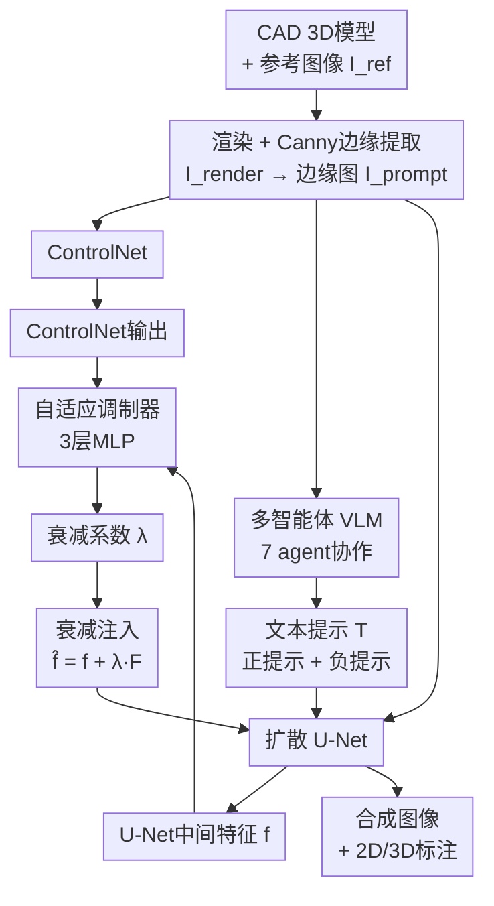

# AC3S: Adaptive Conditioning for 3D-Aware Synthetic Data Generation

**会议**: ECCV 2026  
**arXiv**: [2606.31204](https://arxiv.org/abs/2606.31204)  
**领域**: 3D视觉  
**关键词**: 合成数据, 扩散模型, 自适应条件控制, 多智能体VLM, 几何对齐

## 一句话总结

本文提出AC3S，通过自适应视觉提示调制器动态衰减ControlNet的条件注入强度，并辅以多智能体VLM系统生成与几何结构一致的文本提示，在保持3D姿态精确对齐的前提下大幅提升合成图像的逼真度和多样性，FID相较基线3D-DST降低15.95点，下游分类和姿态估计任务均取得显著提升。

## 研究背景与动机

合成数据生成已成为缓解计算机视觉中数据规模瓶颈的关键手段。传统方法依赖物理渲染引擎（如Blender）手动搭建场景，虽然能精确控制光照、相机和物体布局，但要大规模生成逼真图像仍极其耗时且需要大量美术资源。扩散模型的兴起提供了新思路——预训练的文本到图像模型能以极低成本生成高保真照片，但它们本质上是2D生成器，缺乏对3D几何结构的精细控制，无法直接用于需要精确2D/3D标注的下游任务。

最近，3D-DST提出了一条兼顾3D控制与扩散模型生成能力的管线：用CAD模型渲染出图，取其Canny边缘图作为ControlNet的视觉提示，从而在保证生成图像姿态与渲染模型精确对齐的同时自动获取3D标注。这套方案在姿态准确性上效果显著，但产生了严重的副作用——生成图像背景模糊、物体纹理简化、场景失真。问题的根源在于ControlNet的过条件化：从无材质、无背景的CAD渲染中提取的边缘图极其稀疏，经过ControlNet产生的输出特征过于强势，注入后严重压制了预训练扩散模型原本丰富的生成先验，使图像失去逼真感。作者通过一个有趣的观察量化了这一矛盾：添加文本提示能降低去噪损失，但注入ControlNet输出反而会升高损失——说明ControlNet的输出对生成质量而言是有害噪声，需要被衰减而非全盘接收。

本文的核心洞见是：最优的衰减量因样本而异——不同物体类别、不同随机种子所需的ControlNet条件强度都不同，但这种最优值与U-Net和ControlNet特征范数的大小存在相关性，因此可以被预测。**核心 idea：通过一个轻量MLP，在扩散过程的第一个时间步根据U-Net和ControlNet的特征范数动态预测每张图像的衰减系数，将ControlNet注入从原始的f+F(prompt)变为f+λ·F(prompt)；同时设计了7智能体VLM系统，让各专业智能体协作生成与边缘图几何结构一致的文本提示，从视觉条件和文本条件两个维度同时解除对生成先验的束缚，在保持精确姿态对齐的前提下使图像质量和多样性最大化。**

## 方法详解

### 整体框架

AC3S的完整生成管线由四个互联模块构成。输入是一个CAD 3D模型和一张从ImageNet任意选取的参考图像，输出是一张与模型姿态精确对齐的高质量合成图像及其配套的2D/3D标注。核心创新在于两个自适应组件：视觉提示调制器（自适应衰减ControlNet注入强度）和多智能体VLM系统（自动生成与视觉提示语义一致且富含细节的文本提示）。

### 关键设计

**1. 自适应视觉提示调制器：根据特征强度动态衰减ControlNet注入**

标准ControlNet的注入方式是将侧网络输出与U-Net特征逐元素相加（f̂ = f + F）。对于从CAD渲染提取的稀疏边缘图，这种直接相加过于强势——预训练扩散模型原本丰富的纹理和背景生成能力被完全压制。作者的核心思路是引入一个随样本自适应的衰减系数λ，将注入改为f̂ = f + λ·F。λ的取值范围为[0.3, 1.0]（实验中低于0.3会导致姿态完全不对齐，等于没有效果）。

调制器的具体实现是一个三层MLP。在扩散过程的第一个时间步，MLP以U-Net中间特征f和ControlNet输出F各自的L2范数（‖f‖和‖F‖）作为输入，预测λ值，后续所有时间步共享该值。这样设计的合理性在于：最优λ与这两个特征范数的大小存在强相关性——ControlNet输出特征范数相对U-Net特征范数越大，衰减需求越高，反之亦然。

调制器的训练方式是本文最巧妙的一环。由于λ控制着「姿态对齐」和「图像质量」这对矛盾目标，直接用去噪损失监督会导致退化解——模型学到永远输出λ=0（去噪损失最小化但姿态完全不对齐）。作者设计了一套自监督伪标签生成算法：对每张渲染图，用λ从0.3到1.0（步长0.1，共8个候选值）分别生成一张图像，得到一组自然聚为两类的序列——低λ端姿态未对齐、高λ端姿态对齐。然后在像素级特征上做k-means聚类（k=2），将包含λ=1.0图像的簇标为"对齐簇"，选取该簇内最小的λ作为最优λ。这本质上是在检测"恰好可察觉差异"（Just Noticeable Difference, JND）阈值：λ超过这个阈值后姿态才刚能被观察到对齐，再增大只会不必要地损害图像质量。用这些伪标签训练MLP做8类分类预测，无需任何人工标注。

**2. 多智能体VLM文本提示生成器：消除文本与视觉条件的语义冲突**

文本提示的质量和一致性是合成数据规模化的另一个瓶颈。固定模板（如"一张高质量[类别]照片"）过于粗糙；用VLM从真实图像自动生成的描述虽然细节丰富，但可能描述的场景与边缘图展示的几何结构不一致——例如真实图是特写而边缘图是整体视图，这种冲突会导致生成过程中的幻觉和退化。本文的方案是将提示生成分解为7个专业智能体的协作流水线。

七个智能体各司其职。Subject Identifier同时接收渲染图和参考图像，交叉验证后输出1-3个词的主体标签——纯靠ImageNet类名会丢失关键语义上下文。Genre Selector从预定义的摄影类型（野生动物、微距、风景等）中选择与主体最匹配的风格。Pose Extractor从渲染图中提取主体姿态和相机视角信息，这些信息直接写入提示以保证与边缘图的透视一致。Scene Composer从参考图像中提取主体的颜色、纹理等视觉属性和背景场景描述。前三者的输出汇集到Positive Prompt Synthesizer组装为连贯的正面提示。Protected Terms Identifier识别正面提示中的关键词并纳入保护名单，防止负面提示将其错误地排除。最后，Negative Prompt Synthesizer在保护词约束下，针对当前主体和场景组合有意义的负面提示。

系统基于Qwen3-VL-23B-Instruct（4-bit量化），通过LangGraph的StateGraph编排为有向无环图，采用MetaGPT的共享消息池模式进行Agent间通信。每个Agent的提示模板包含7个结构化字段（角色、目标、上下文、约束、对比示例、输出格式、验收标准），将任务收束到具有明确成功标准的范围内，使输出可靠且可自动解析。Subject Identifier和Scene Composer等上游Agent可并行执行，下游Agent则依赖上游输出顺序串行。

### 损失函数 / 训练策略

调制器采用自监督分类策略进行训练：将连续的λ离散化为8个候选值，用JND检测算法为每张渲染图生成伪标签后，训练MLP对这8个类别做交叉熵分类。本文明确避免使用去噪损失——因为去噪损失在λ=0时被平凡地最小化，模型会学到永远输出0的退化解。伪标签方案通过对姿态对齐阈值直接建模绕过了这一陷阱。此外，对于生成的数据集，AC3S使用DreamSim替代需要为每类单独训练姿态估计器的过滤方案，大幅降低了计算成本。

## 实验关键数据

### 主实验

消融实验在50个ImageNet类别上进行，每类生成1,000张合成图像（共50,000张）。扩散模型统一使用Stable Diffusion v1.5、20步采样。图像质量用FID评估，对照真实ImageNet图像的分布。

| 方法 | 动物类FID↓ | 物体类FID↓ | 总体FID↓ |
|------|-----------|-----------|---------|
| 3D-DST（基线） | 72.67 | 90.38 | 87.19 |
| + 视觉提示调制器 | 60.93 | 81.18 | 77.53 |
| + VLM文本提示生成器 | 54.68 | 84.23 | 78.93 |
| AC3S（两者都加） | **48.87** | **76.15** | **71.24** |

下游分类任务（预训练到ImageNet微调）的Top-1准确率：

| 方法 | ResNet-18 | ConvNeXt-S | Swin-S |
|------|-----------|------------|--------|
| 仅真实数据（无预训练） | 76.34 | 80.12 | 81.59 |
| w/ Text2Img预训练 | 77.08 | 79.21 | 81.36 |
| w/ 3D-DST预训练 | 76.96 | 81.89 | 83.17 |
| w/ AC3S预训练 | **77.33** | **82.75** | **84.19** |

### 消融实验

| 配置 | 总体FID↓ | 关键说明 |
|------|---------|---------|
| 3D-DST（基线） | 87.19 | 无任何自适应控制，纹理和背景均退化 |
| + 视觉提示调制器 | 77.53 | -9.66 FID，纹理和背景细节显著丰富 |
| + VLM文本提示生成器 | 78.93 | -8.26 FID，颜色和场景合理性提升 |
| AC3S完整 | 71.24 | -15.95 FID，动物类提升最大（-23.8） |

姿态估计实验（预训练到PASCAL3D+微调，π/6阈值）：

| 方法 | Sofa | Dining Table | Car |
|------|------|-------------|-----|
| ResNet基线（无预训练） | 80.79 | 79.86 | 87.60 |
| w/ 3D-DST预训练 | 86.70 | 80.20 | 88.51 |
| w/ AC3S预训练 | **88.18** | **81.91** | **89.03** |

### 关键发现

- 视觉提示调制器和VLM文本提示各自贡献8-10点FID提升，两者协同叠加达到15.95点，说明从视觉和文本双路自适应控制缺一不可。动物类比物体类提升更大（-23.8 vs -14.2 FID），因为动物类对纹理细节和背景复杂性的要求更高，受过条件化影响更严重。
- 姿态估计中Sofa类的π/18细粒度阈值提升最大（+7.39%），说明精确衰减在保持姿态对齐的同时释放了生成质量的瓶颈。
- 纯合成数据实验最令人印象深刻：在完全不使用真实数据微调时，AC3S预训练的模型在PASCAL3D+上（Sofa π/6）准确率达34.48%，而3D-DST仅有10.84%。这表明自适应条件控制显著缩小了合成数据与真实分布之间的差距，使纯合成数据首次具备初步可用性。

## 亮点与洞察

- **自监督JND伪标签是点睛之笔**：用k-means聚类λ扫描序列来检测姿态对齐的阈值，无需任何人工标注就能获得高质量训练信号。这个思路对任何需要自动感知阈值标定的条件控制问题都有启发价值。
- **从"一个条件控制所有样本"到"每个样本一个条件"**：传统ControlNet对所有图像施加相同强度的条件注入，AC3S首次证明最优强度随样本变化且可通过特征范数预测，打开了条件调优更精细的方向。
- **多智能体分解解决文本-几何冲突**：将一个易出错的"端到端描述生成"拆解为7个可验证的专业角色，各自有明确的输入输出和验收标准。Pose Extractor直接针对姿态对齐设计，Protected Terms Identifier防止正负提示的内部矛盾。这种系统工程化的思路可迁移到其他需要精细条件控制的图像生成场景。
- **DreamSim替代按类训练姿态估计器**：3D-DST的过滤需要为每类单独训练一个姿态估计器，计算成本极高。AC3S用DreamSim的感知相似度做一次前向排序即可完成过滤，效率大幅提升且泛化更广。

## 局限与展望

- 本文固定使用Stable Diffusion v1.5，在更强的基础模型（SDXL、SD3、FLUX）上调制器是否需要重新训练尚待验证——不同模型对ControlNet条件强度的敏感度可能不同。
- 调制器仅在第一个时间步预测λ，后续所有时间步共享。作者提到最优λ与随机种子相关，暗示它可能具有时间步依赖性。时变的多步预测方案理论上可能进一步提升质量，但会增加计算开销。
- 多智能体VLM依赖Qwen3-VL-23B推理，成本较高。轻量模型或蒸馏替换部分智能体（如Subject Identifier、Genre Selector这类相对简单的角色）是规模化使用的重要方向。
- CAD模型覆盖率有限（约30个模型/类），物体多样性受限于模型库本身的质量和丰富度。与更大规模的3D数据集（如Objaverse-XL）结合是自然的扩展方向。

## 相关工作与启发

- **vs 3D-DST**: 3D-DST奠定了"CAD渲染→边缘图→ControlNet"的3D感知合成范式，但完全不进行条件衰减，导致过条件化严重。AC3S是其直接改进，用两个自适应模块——视觉提示调制器和多智能体VLM——解决了生成质量问题。
- **vs ControlNet原版**: ControlNet的标准注入（λ=1）对真实深度图、真实边缘图效果良好，但对CAD渲染这种稀疏、无材质的视觉提示过于强势。AC3S本质上是为合成数据这个特定领域定制了条件强度的自适应校准器。
- **vs 其他提示调制方法**: TASR和Navigating等同期工作也使用类似的调制器但依赖去噪损失监督。AC3S的关键差异在于揭示了λ=0的退化解问题，并设计了自监督伪标签方案来规避。

## 评分

- **新颖性**: ⭐⭐⭐⭐ — 自适应衰减ControlNet的想法简洁有效，自监督JND伪标签是亮点。整体建立在3D-DST之上，增量改进属性较强，但在关键问题上给出了扎实的解决方案。
- **实验充分度**: ⭐⭐⭐⭐ — FID消融、三类架构的分类实验、含纯合成数据对比的姿态估计实验，设计完整。缺少在更多数据集（如COCO、LVIS）上的泛化验证是一个小缺口。
- **写作质量**: ⭐⭐⭐⭐ — 逻辑链清晰，从前两个Section能看到"发现问题→量化矛盾→提出方案"的完整叙述。对调制器退化解问题的剖析和规避交代透彻。
- **价值**: ⭐⭐⭐⭐ — 合成数据生成是CV社区的刚需，AC3S提供了一套可直接实用的规模化方案。纯合成训练的显著优势（Sofa 34.48% vs 10.84%）尤其有现实意义。

<!-- RELATED:START -->

## 相关论文

- [\[ICCV 2025\] DAViD: Data-efficient and Accurate Vision Models from Synthetic Data](../../ICCV2025/3d_vision/david_data-efficient_and_accurate_vision_models_from_synthetic_data.md)
- [\[ICLR 2026\] COOPERTRIM: Adaptive Data Selection for Uncertainty-Aware Cooperative Perception](../../ICLR2026/3d_vision/coopertrim_adaptive_data_selection_for_uncertainty-aware_cooperative_perception.md)
- [\[CVPR 2026\] What Makes Good Synthetic Training Data for Zero-Shot Stereo Matching?](../../CVPR2026/3d_vision/what_makes_good_synthetic_training_data_for_zero-shot_stereo_matching.md)
- [\[ICCV 2025\] Bootstrap3D: Improving Multi-view Diffusion Model with Synthetic Data](../../ICCV2025/3d_vision/bootstrap3d_improving_multi-view_diffusion_model_with_synthetic_data.md)
- [\[ICCV 2025\] Seeing and Seeing Through the Glass: Real and Synthetic Data for Multi-Layer Depth Estimation](../../ICCV2025/3d_vision/seeing_and_seeing_through_the_glass_real_and_synthetic_data_for_multi-layer_dept.md)

<!-- RELATED:END -->
