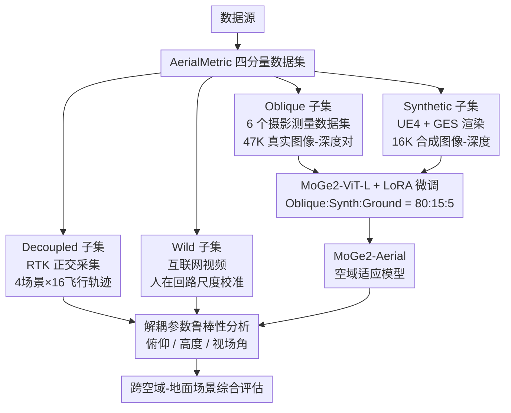

# AerialMetric: Benchmarking and Adapting UAV Monocular Metric Depth Estimation in the Real World

**会议**: ECCV 2026  
**arXiv**: [2606.29716](https://arxiv.org/abs/2606.29716)  
**代码**: [https://kuieless.github.io/AerialMetric-ECCV2026-page/](https://kuieless.github.io/AerialMetric-ECCV2026-page/) (有)  
**领域**: 3D视觉  
**关键词**: 单目度量深度估计, 无人机航拍, 空域基准数据集, LoRA域适应

## 一句话总结
本文构建了包含四个互补子集的大规模无人机航拍单目度量深度基准 AerialMetric（52K 真实 + 16K 合成图像-深度对），系统性揭示了现有 SOTA 模型在空域视角下 δ1 接近 0 的严重域差距，并通过 LoRA 参数高效微调 MoGe2 在几乎不损失地面泛化能力的前提下将空域 δ1 提升至 84% 以上。

## 研究背景与动机

单目度量深度估计（monocular metric depth estimation）在无人机物流配送、基础设施巡检、环境监测等场景中承担着恢复场景绝对尺度几何深度的核心角色。近年来，以 Depth Anything、Metric3Dv2、MoGe2、UniDepthV2 为代表的深度网络在地面场景上取得了令人瞩目的进展，部分模型甚至展现出相当程度的零样本泛化能力。然而，当这些模型直接部署到无人机航拍视角时，表现出现断崖式下降——ZoeDepth、DepthPro、Metric3Dv2 等在多个空域子集上的 δ1 几乎全部为 0，意味着它们的绝对尺度深度与真实值之间基本不存在有效对应关系。问题根源在于训练数据分布存在严重偏移：地面视角（水平或略俯视、有限深度范围、以道路和室内场景为主导）与空域视角（大范围俯仰角变化、鸟瞰几何模式、极宽深度范围）之间的域差距远比预想的大。单目深度估计的本质不适定性在空域场景中被进一步放大——地面场景有丰富的透视灭点和水平线供模型校准尺度，而航拍俯视图中这些几何线索被系统性削弱甚至消失。

这种系统性失效的背后是真实空域场景中大规模、多样化的带可靠度量深度标注数据集的缺失。已有的空域数据要么纯合成且 sim-to-real 差距大，要么仅提供稀疏 LiDAR 投影而非密集深度图，要么规模不足千张，远不足以支撑可靠的空域深度模型训练与评测。同时，现有的深度评测方案只是打一个数据集级别的聚合指标，完全无法揭示模型究竟在航拍高度、俯仰角还是视场角哪个维度退化——而这种诊断能力恰恰是空域部署场景最需要的。简而言之，空域度量深度估计在数据基础设施和评测方法论两个层面都处于空白状态。

本文的目标是系统性地填补这一基础设施空白。**核心 idea：构建一个包含四个互补子集的大规模空域度量深度基准 AerialMetric——覆盖真实摄影测量航拍数据、RTK 正交解耦控制采集、高保真合成渲染和互联网航拍视频四类数据源——系统性量化空域域差距，并通过 LoRA 参数高效微调在 MoGe2 上验证了该数据集的有效性，建立了空域度量深度估计的评测基准与适应范式。**

## 方法详解

### 整体框架

AerialMetric 的核心贡献不在提出新的网络结构，而是从数据基础设施、评测协议和适应策略三方面系统推进空域深度估计。数据集本身由四个功能互补的子集构成：Oblique 子集提供大规模真实世界摄影测量数据（6 个公开数据集整合 + 47K 高质量图像-深度对），是训练的主力数据源；Decoupled 子集通过 RTK 厘米级定位系统以正交采样方式独立变化俯仰角、飞行高度和视场角，专为解耦分析飞行参数对深度的影响而设计；Synthetic 子集利用 Unreal Engine + AirSim + Cesium 以及 Google Earth Studio 生成 16K 高保真合成图像-深度对，覆盖极端视角和复杂光照等长尾场景；Wild 子集从 600+ 社交媒体无人机视频中筛选 100 段高质量序列，通过人在回路尺度校准管线获取伪度量深度标签。基于该数据集，论文使用 LoRA 对 MoGe2-ViT-L 进行参数高效微调得到 MoGe2-Aerial，训练时混合 Oblique、Synthetic 和地面域数据（Hypersim、MVS-Synth、TartanAir）按 80:15:5 比例加权采样，在适应空域分布的同时避免对地面场景的灾难性遗忘。

### 关键设计

**1. 四分量互补数据集架构：多维度覆盖空域深度场景**

空域深度估计缺乏大规模真实数据，但单一数据源无论如何都无法覆盖空域任务的多样性需求。Oblique 子集整合了 UrbanBIS、GauU-SceneV2、UAVScenes、UrbanScene3D、OpenDroneMap 和 ESRI 共 6 个城市级摄影测量数据集，覆盖 City、Rural、Natural 三类场景、25 个子区域，提供约 47K 对稠密度量深度标注。Decoupled 子集弥补了 Oblique 无法控制的变量混杂问题——通过 RTK 厘米级定位模组在 4 个典型场景（建筑、草坪、农田、工厂）下按正交采样独立变化俯仰角（−90°/ −75°/ −60°/ −45°）、飞行高度（80m/120m）和视场角（63°/83°），每个视点形成 16 种严格控制配置组合，使后续可以精准诊断模型在哪个参数下退化。Synthetic 子集覆盖真实采集困难的场景，同时附带 Z-buffer 级别的无噪声精确深度。Wild 子集则解决了实验室数据无法代表真实部署的问题——100 段真实无人机视频涵盖 30 国 50+ 城市，场景多样性和域外程度远超任何现有基准。四个子集分别解决真实规模性、参数可控性、分布扩展性和域外泛化性四个维度。

**2. 高保真深度真值构建：融合 LiDAR 消噪与摄影测量光栅化**

不同数据源的深度真值获取方式不同且各有工程陷阱。对于配备 LiDAR 的 UAVScenes 和 GauU-SceneV2，核心问题是激光穿透伪影——背景点的激光束穿过稀疏前景产生错误的大值深度。论文的方案是先通过 DJI Terra 从 RGB 图像重建连续三角网格，再将 LiDAR 投影深度与网格面片逐点比对，偏差超过 1.0m 的像素判为遮挡噪声丢弃。对于仅提供 RGB 的 UrbanBIS、UrbanScene3D、ODM 和 ESRI，则以最高原生分辨率重建稠密网格，经位姿引导光栅化生成像素级对齐的度量深度图。一个关键的质量保障是严格的地理隔离划分：Oblique 子集做训练-测试拆分时划出 50m 缓冲带，剔除测试区域周边 4.4K 帧，避免同一大场景相邻航拍帧之间的数据泄露。PolyTech 场景的定量验证显示该管线达到了 1.63cm 的地面采样距离和 0.993 像素的均方重投影误差。

**3. 正交解耦采样协议：独立分离视角参数对深度估计的影响**

常规深度评测报告聚合指标掩盖了模型具体在哪一参数下退化的重要信息。Decoupled 子集的设计本质上是一个二因素嵌套正交实验：俯仰角 4 个水平，高度 2 个水平，视场角 2 个水平，共计 16 种配置组合覆盖 4 类场景。实际操作中通过 DJI Pilot 2 规划自动航线实现——变化一个参数时其余参数通过 RTK 定点严格固定。实验结果揭示了此前未被系统量化的现象：基线模型在正射视角（−90°）和极端倾斜（−45°）下性能严重不对称退化，且高度从 80m 增至 120m 导致 δ1 断崖式下降；视场角从 63° 换到 83° 虽能缓解但不足以弥补差距。MoGe2-Aerial 则在全部 16 种配置下保持 δ1 > 80%，雷达图呈现近乎各向同性的轮廓，说明已具备对空域视角参数的鲁棒性。

**4. LoRA 参数高效微调策略：在空域适应与地面泛化间寻找折中**

直觉上全参数微调在空域数据上最优（Full FT 在 Oblique 上 δ1=95.6%），但代价是地面灾难性遗忘（地面 δ1 从 76.8% 降至 56.7%，ETH3D 从 88.8% 跌至 61.5%）。冻结 ViT 骨干仅微调 scale head 的策略更差——冻结骨干携带的地面 FOV 和透视先验对空域图像产生严重扭曲的相对点云，孤立 scale head 被迫预测极端震荡的尺度偏移，导致训练无法收敛。LoRA 在两者间找到了最佳平衡：秩 r=96 时空域 δ1≈84% 且地面 δ1 仅损失不到 3 个百分点。值得注意的工程细节是 LoRA 训练策略性地禁用了稠密局部损失（法向损失、掩码损失、patch 损失），因为预训练模型已具备良好高频结构先验，保留局部损失反而让有限容量的 LoRA 模块去拟合 MVS 真值中的局部噪声导致预测模糊。将 LoRA 容量完全集中在修正空域特有的全局几何扭曲和度量尺度偏移上，参数量用在了刀刃上。

### 损失函数 / 训练策略

MoGe2-ViT-L 注入 LoRA 模块到所有注意力层（qkv、proj）和前馈层（fc1、fc2），秩 r=96、alpha=192、dropout 0.1。采用 AdamW 优化器训练 1,800 步，batch size 32。动态 token 范围策略将图像长边缩放到 1200-3600 tokens 范围适配不同分辨率航拍图像。编码器学习率 1e-6、解码器 5e-5，500 步线性预热后多项式衰减。损失函数仅保留全局仿射不变损失（权重 1.0）和度量尺度损失（权重 1.5），禁用稠密局部损失。训练数据按 80% Oblique、15% Synthetic、5% 地面域数据（Hypersim、MVS-Synth、TartanAir）加权采样。

## 实验关键数据

### 主实验

下方整理了无 GT 内参（更贴近实际部署场景）下的关键对比：

| 数据集 | 场景 | 指标 | MoGe2 Zero-shot | MoGe2-Aerial | 提升 |
|--------|------|------|----------------|-------------|------|
| Oblique | City | AbsRel ↓ | 48.4 | 10.3 | -79% |
| Oblique | City | δ1 ↑ | 5.1% | 89.3% | +84.2 pp |
| Oblique | Rural | δ1 ↑ | 0.3% | 81.2% | +80.9 pp |
| Decoupled | Building | δ1 ↑ | 26.6% | 87.6% | +61.0 pp |
| Decoupled | Lawn | δ1 ↑ | 19.5% | 94.0% | +74.5 pp |
| Decoupled | Farm | δ1 ↑ | 0.0% | 54.2% | +54.2 pp |
| Wild | 0-400m | AbsRel ↓ | 55.26 | 21.34 | -61% |
| Wild | 0-400m | δ1 ↑ | 9.5% | 53.7% | +44.2 pp |

MoGe2-Aerial 在地面 7 个基准（NYUv2、KITTI、ETH3D、iBims、DDAD、DIODE、HAMMER）上相比零样本 MoGe2 保持竞争力，在 KITTI（δ1 +4pp）和 DDAD（δ1 +5pp）上甚至略有提升，验证了 LoRA 策略有效避免了灾难性遗忘。

### 消融实验

| 配置 | Oblique δ1 | Decoupled δ1 | Ground δ1 | 说明 |
|------|-----------|-------------|----------|------|
| Zero-shot MoGe2 | 7.9% | 20.0% | 76.8% | 基线，空域基本失效 |
| Full FT | 95.6% | 86.0% | 56.7% | 空域最优但地面遗忘严重 |
| Freeze ViT | 87.7% | 82.5% | 35.8% | 骨干冻结导致地面大幅退化 |
| LoRA r=64 | 82.9% | 84.3% | 80.7% | 平衡但空域略弱 |
| **LoRA r=96** | **84.4%** | **83.9%** | **79.6%** | **最佳折中** |
| LoRA r=128 | 82.4% | 84.2% | 69.4% | 过参数化导致地面回退 |
| Only Oblique | 87.4% | 77.5% | 77.6% | 空域好但 Decoupled 弱 |
| + Synthetic | 82.3% | 84.2% | 79.7% | Decoupled 显著改善 |
| + Ground data | 84.4% | 83.9% | 79.6% | 地面遗忘被控制到最小 |

### 关键发现

- **最大的性能差距来自数据而非模型结构**：零样本 MoGe2 在空域 δ1 仅 7.9%，一次 LoRA 微调后跃升至 84%+，说明数据缺口是当前空域深度估计的首要瓶颈，新架构的设计无法替代领域内训练数据的缺失
- **LoRA r=96 是实现空域-地面双域泛化的甜点**：全量微调空域最优但地面遗忘不可接受；r=128 过参数化同样导致地面回退；r=64 则空域偏弱——r=96 恰好让 LoRA 秩足够表达空域几何偏移又不至于过拟合
- **Farm 场景是公认硬骨头**：由于重复植被纹理和缺乏强几何锚点，MoGe2-Aerial 在此场景 δ1 仅 54.2%。有趣的是 UniDepthV2 在 Farm 上反倒最高（57.9%），推测其预训练语料包含更多农业场景分布
- **高度和俯仰角是空域深度退化的两个独立轴**：基线模型在 −90° 到 −45° 和 80m→120m 两个维度均呈现非单调退化，视场角（63°→83°）影响相对轻微——两个因素互不抵消，必须独立处理
- **LoRA 禁用稠密局部损失的决策有定量支撑**：保留局部损失后 LoRA 会拟合 MVS 真值中的几何噪声导致边缘模糊，与预期一致——预训练模型已学会高频结构，LoRA 有限容量应聚焦全局几何修正

## 亮点与洞察

- **四分量互补设计是 benchmark 类论文的范本**：每个子集都有清晰的"为什么存在"，不像很多数据集在规模和多样性之间简单叠加。特别是 Decoupled 的正交实验设计可以精确定位模型在哪个视角参数下退化
- **LiDAR 穿透伪影的网格比对处理务实可复现**：重建网格后以 1.0m 阈值逐点比对，逻辑清晰、效果可量化，值得使用 LiDAR 深度真值的同行借鉴
- **地理隔离切割是许多基准论文易忽视但至关重要的质量保障**：50m 缓冲带剔除 4.4K 帧的设计防止了"同源不同帧"的数据泄露
- **Wild 子集的人机协同尺度校准管线思路新颖且务实**：VLM 初筛地标到人工验证再到多标注人共识取尺度因子，为从海量互联网视频中低成本获取伪度量真值提供了可行方案
- **MoGe2-Aerial 对部分地面基准的边缘改进值得关注**：在 KITTI 上 δ1 +4pp、DDAD 上 δ1 +5pp，说明 AerialMetric 上的训练数据多样性和深度尺度多样性反向增强了模型在部分地面场景上的表现

## 局限与展望

- **极端天气覆盖为零**：Oblique 和 Decoupled 子集主要在晴天采集，雨雪、大雾、夜间场景基本缺失，作者在 Future Work 中已承认
- **Wild 子集是伪度量而非严格真值**：COLMAP 稀疏位姿 + DA3 多视深度 + 人工尺度校准的管线虽验证 AbsRel 仅 1.19%，但远处和低纹理区域误差可能被放大，用作严格评估基准仍需谨慎
- **Farm 场景的根本性难题未解决**：植被区域缺乏几何纹理和可靠深度锚点，纯单目方法可能已近上限，未来可能需要多视图或时序信息引入
- **适应策略仅在两种架构上验证**：MoGe2 和 UniDepthV2 虽代表不同设计，但 DepthPro、Metric3Dv2 等的适应效果还需验证
- **未来方向**：扩展到多视角度量深度估计以获取更强几何一致性；补充极端天气和夜间采集；探索 Adapter 等更高效的适应方法

## 相关工作与启发

- **vs Depth Anything / Metric3Dv2 / MoGe2 / UniDepthV2**：这些是地面级 SOTA 单目深度模型，零样本泛化能力强但在空域视角下系统性失效（δ1 趋近 0），AerialMetric 证明数据填补而非架构设计是缩小该域差距的有效途径
- **vs UseGeo / WildUAV / OccuFly / UAVid-3D**：已有空域深度数据集规模有限（数百到千级别）或仅提供稀疏 LiDAR 投影深度，AerialMetric 在规模（68K 对）、维度（4 子集）、几何精度（密集度量深度 + 严格地理隔离）上都有明显超越
- **vs ClaraVid / Mid-Air / SynDrone**：纯合成空域数据受 sim-to-real 差距限制，AerialMetric 以 Oblique 真实数据为训练主力、合成仅做补充，实现了更好的真实域泛化
- **vs TanDepth**：TanDepth 提出基于航空视角的适应方法但限于有限场景，AerialMetric 的大规模基准为更全面的跨场景对比提供了支撑平台

## 评分

- 新颖性: ⭐⭐⭐⭐ [四分量互补设计 + 正交解耦分析框架 + 人在回路尺度校准的组合是扎实系统贡献，但本质上属于数据基础设施而非新模型新理论]
- 实验充分度: ⭐⭐⭐⭐⭐ [覆盖 3 个空域子集 + 7 个地面基准 + 细粒度消融（微调策略/数据配比/跨架构可迁移）+ 解耦参数鲁棒性全空间探索，实验设计系统且说服力强]
- 写作质量: ⭐⭐⭐⭐ [结构清晰，图（雷达图/热力图/3D 点云对比）表丰富，解码了足够多的实验细节]
- 价值: ⭐⭐⭐⭐⭐ [填补了空域度量深度估计领域长期缺少大规模真实基准的关键空白，有望成为该方向的标准评测平台，LoRA 适应策略也提供了可直接复用的基线]

<!-- RELATED:START -->

## 相关论文

- [\[CVPR 2026\] Iris: Bringing Real-World Priors into Diffusion Model for Monocular Depth Estimation](../../CVPR2026/3d_vision/iris_bringing_realworld_priors_into_diffusion_model_for_monocular_depth_estimation.md)
- [\[CVPR 2026\] MD2E: Modeling Depth-to-Edge Cues for Monocular Metric Depth Estimation](../../CVPR2026/3d_vision/md2e_modeling_depth-to-edge_cues_for_monocular_metric_depth_estimation.md)
- [\[ECCV 2026\] OrthoTrack: Continuous 6-DoF UAV Trajectory Estimation Anchored in Public Orthophotos](orthotrack_continuous_6-dof_uav_trajectory_estimation_anchored_in_public_orthoph.md)
- [\[ICLR 2026\] PatchRefiner V2: Fast and Lightweight Real-Domain High-Resolution Metric Depth Estimation](../../ICLR2026/3d_vision/patchrefiner_v2_fast_and_lightweight_real-domain_high-resolution_metric_depth_es.md)
- [\[CVPR 2026\] Learning 3D Shape Fidelity Metric from Real-world Distortions](../../CVPR2026/3d_vision/learning_3d_shape_fidelity_metric_from_real-world_distortions.md)

<!-- RELATED:END -->
