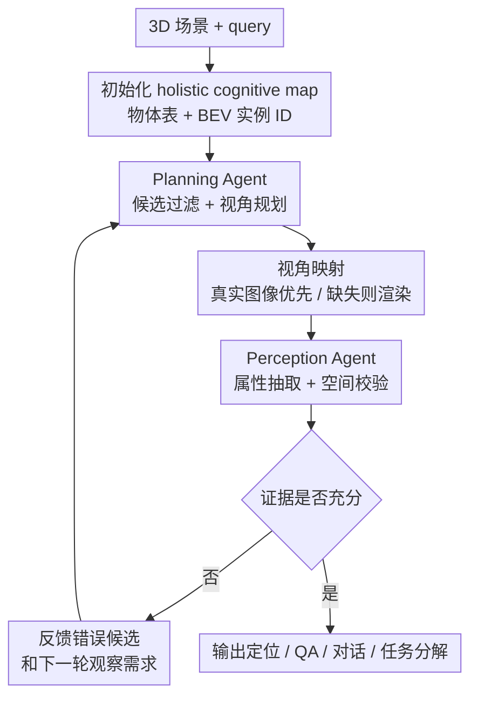

# Agentic Collaborative Cognition for Zero-Shot 3D Understanding

**会议**: ECCV 2026  
**arXiv**: [2606.24649](https://arxiv.org/abs/2606.24649)  
**代码**: 未公开；项目页: [https://zhangbo135.github.io/agentic-collaborative-cognition/](https://zhangbo135.github.io/agentic-collaborative-cognition/)  
**领域**: 3D视觉  
**关键词**: 零样本3D理解, 多智能体协作, 视角规划, 3D视觉定位, 场景认知图

## 一句话总结
这篇论文把零样本 3D 场景理解改造成 Planning Agent 与 Perception Agent 围绕显式 holistic cognitive map 反复协作的过程，通过主动补关键视角、跨视角记录物体属性和反馈式候选过滤，在 ScanRefer / Nr3D / SQA3D / ScanQA 等 6 个基准上明显优于已有零样本方法。

## 研究背景与动机

**领域现状**：3D scene understanding 要同时处理物体定位、空间关系、问答、对话和任务分解。传统 3D grounding / QA 方法大多依赖 3D-text 标注数据训练，泛化到新场景和新任务时成本高；近期零样本路线则把 3D 扫描过程中的视频关键帧交给 MLLM，让通用视觉语言模型从 2D 视角间接理解 3D 场景。

**现有痛点**：视频关键帧路线有两个硬瓶颈。第一，扫描视频的相机轨迹是固定的，常常缺少回答当前 query 所需的决定性视角。第二，MLLM 只能从若干 2D 图像隐式拼出空间关系，遇到大视角变化、同类物体干扰或细粒度属性约束时，很难保持统一的 3D 场景记忆。

**核心矛盾**：零样本 3D 理解真正缺的不是再多抽几张 keyframe，而是一个能被 agent 共享、更新和验证的外显 3D 认知状态。没有这个状态，模型每轮都像第一次看场景，既容易重复观察无关物体，也难以把「这把蓝色椅子」「靠近桌子右侧」「上一轮看到的候选 7」稳定地绑定起来。

**本文目标**：构建一个无需任务标注训练的通用框架，让 MLLM 在零样本设置下完成 3D visual grounding、3D QA、situation estimation、3D-assisted dialog 和 task decomposition，并且能主动获取缺失视角，而不是被动依赖已有视频帧。

**切入角度**：作者把问题拆成两个互补角色：Planning Agent 负责「该看哪里」，Perception Agent 负责「看到了什么、是否足够」。两者不通过长对话自由发挥，而是围绕一个结构化 holistic cognitive map 读写状态，形成闭环。

**核心 idea**：用显式 cognitive map 作为多智能体共享工作台：先用 3D detector 给出物体表和 BEV，再让 Planning Agent 基于 query 与反馈规划关键视角，Perception Agent 从真实/渲染图像中补属性、删候选、判断是否能回答，直到证据充分为止。

## 方法详解

### 整体框架
输入是一段 3D 扫描场景、相机轨迹和一条自然语言 query；输出可以是目标物体定位、问答答案、对话回复或任务分解结果。框架先构造 holistic cognitive map $M={T,I_B}$：其中 $T={σ_i}_{i=1}^N$ 是物体信息表，每个物体 $σ_i={b_i,l_i,a_i}$ 存储 3D box、类别和逐步补全的属性；$I_B$ 是带实例 ID 的 BEV 图。随后 Planning Agent 和 Perception Agent 以轮次交替运行：Planning Agent 从 map 中筛候选并规划视角，系统把视角匹配到真实图像或渲染新图像，Perception Agent 再给候选物体打 ID、抽属性、校验空间关系，并把反馈写回下一轮。

### 关键设计

**1. Holistic cognitive map：把隐式多视角理解变成可读写的共享状态**

以往零样本 3D 方法把 MLLM 直接喂多张帧图，空间记忆主要藏在上下文里，缺少稳定的对象级身份。本文先用 3D detection 框架产生物体集合，把 box $b_i$、类别 $l_i$ 和属性槽 $a_i$ 写成表，再把 BEV 图中的每个物体标上唯一实例 ID。这样做的关键不是「多一个场景图」而是给两个 agent 一个共同参照系：Planning Agent 可以说「继续看候选 4/7 的相对位置」，Perception Agent 也能把新观察到的颜色、材质、朝向写回同一个物体条目。

属性槽初始为空，随着轮次逐步更新；如果新视角给出的属性置信度更高，就覆盖旧属性。这使 map 不只是静态先验，而是一个可修正的认知记录。对 3D 问答和定位尤其重要：目标往往不是「椅子」这种类别，而是「靠近窗户、带轮子、在桌子右侧的那把椅子」，这些约束必须跨视角聚合才可靠。

**2. Planning Agent：用候选过滤和主动视角补全替代被动 keyframe selection**

Planning Agent 首先从 query 里解析关键对象 $o_j=(l_j^q,a_j^q)$，再用 cognitive map 中的类别和已知属性筛候选。匹配规则可以概括为：若场景物体或 query 属性缺失，就先按类别匹配；若属性已知，则类别与属性都要符合。由此得到的初始候选集 $C^0$ 会在后续轮次中被 Perception Agent 的反馈继续收缩。

视角规划不是随机补图，而是围绕两类信息需求：看清候选物体自身属性的近距离视角，以及同时看到多个物体以判断空间关系的共视角。每个计划视角 $V_k^t$ 被转成 3D 相机位姿 $(R_k^t,T_k^t)$，再和真实视频帧做位姿距离匹配。若最近真实帧距离低于阈值 $τ_D$，就用真实帧保留纹理与语义细节；否则从点云/重建结果渲染该视角，补足视频中不存在的关键观察。这个 real-rendered 组合解释了消融中两个图像源都不能删的现象。

**3. Perception Agent：用一致实例 ID 把碎片观察沉淀为对象属性和反馈**

Perception Agent 接收的是带候选实例 ID 的图像集合 $I^t$，它不需要重新猜「这是哪一个物体」，而是围绕候选 ID 抽取 appearance attributes 和 physical attributes，并判断三件事：属性是否符合 query、空间关系是否成立、当前观察是否足够回答。真实图像主要提供颜色、纹理、材质等细粒度语义，渲染图像主要提供相对位置和空间布局；作者特意在 prompt 中让模型区分两种来源的可信方向。

当某个候选在属性或空间关系上冲突时，Perception Agent 会把它作为错误候选反馈给 Planning Agent；当证据不足时，它会指出下一轮应补什么视角。这是闭环里最关键的控制信号：Planning Agent 不再盲目扩大覆盖率，而是根据「还没看清什么」去补决定性视角；Perception Agent 也不只是输出答案，而是持续更新 map、过滤候选、决定停止时机。

### 一个完整示例
假设 query 是「找到靠近桌子右侧、带轮子的椅子」。初始化 map 里可能有 8 把椅子，BEV 只能给出大致位置，属性槽还为空。第一轮 Planning Agent 先按类别和桌子邻近关系把候选缩到 3 个，并规划一个能同时看到桌子和三把椅子的视角；如果真实扫描视频没有覆盖桌子右侧，就补一张渲染图。Perception Agent 看到候选 2/5/7 后发现候选 2 在桌子左侧，候选 5 没轮子，候选 7 颜色和位置都符合但轮子被遮挡，于是反馈「排除 2/5，补候选 7 底部视角」。第二轮 Planning Agent 规划低视角或近距离真实帧，Perception Agent 确认轮子属性后停止并返回候选 7 的 3D box。这个过程展示了 map、主动视角和反馈过滤三者如何相互咬合。

### 损失函数 / 训练策略
本文不是端到端训练一个 3D foundation model，而是零样本系统框架。实现上使用 Qwen2.5-VL-72B 作为 Planning Agent、GPT-4o 作为 Perception Agent；渲染图像分辨率为 $512×512$，视角匹配阈值 $τ_D=0.8$，每轮规划 $K=8$ 个视角，最多迭代 6 轮。消融中也测试了 Qwen2.5-VL-7B、Qwen2-VL-72B、Qwen2.5-VL-72B 和 GPT-4o 作为 MLLM 的影响，说明框架收益不完全来自更强模型本身。

## 实验关键数据

### 主实验
论文覆盖 6 个任务/基准：ScanRefer、Nr3D、SQA3D situation estimation、SQA3D / ScanQA 3D QA、3D-LLM Held-In dialog / task decomposition。几个最有代表性的结果如下：

| 任务 / 数据集 | 指标 | 本文 | 对比方法 | 提升 |
|--------|------|------|----------|------|
| ScanRefer 3DVG | Acc@0.25 / Acc@0.5 | 相比 CSVG 更高 | CSVG | +8.5 / +11.1 |
| Nr3D 3DVG | Acc@0.25 | 相比 CSVG 更高 | CSVG | +2.0 |
| SQA3D 3D QA | EM | 相比 SpatialPrompting 更高 | SpatialPrompting | +2.1 |
| ScanQA | CIDEr | 相比 SpatialPrompting 更高 | SpatialPrompting | +3.4 |
| 3D-LLM Held-In dialog/task | BLEU-1 / BLEU-4 / ROUGE | 相比 Agent3D-Zero 更高 | Agent3D-Zero | +1.8 / +9.4 / +3.7 |

### 消融实验
作者在 Nr3D、SQA3D、ScanQA 上做了组件消融，能清楚看出 map 与闭环反馈是主力贡献。

| 配置 | Nr3D | SQA3D | ScanQA | 说明 |
|------|------|-------|--------|------|
| Full | 56.7 | 53.2 | 26.1 | 完整 cognitive map + filtering/feedback + real/rendered views |
| w/o Holistic Cognitive Map | 47.8 | 49.3 | 18.6 | 失去对象级共享状态，Nr3D 掉 8.9 |
| w/o Filtering and Feedback | 49.3 | 50.4 | 20.9 | 候选无法持续收缩，容易被干扰物拖住 |
| w/o Rendered Image | 52.7 | 50.6 | 21.0 | 固定视频视角不够，空间定位受损 |
| w/o Real Image | 53.9 | 51.7 | 21.4 | 缺纹理/材质细节，属性识别受损 |

### 关键发现
- 效率上也有收益：相对 SeqVLM，token cost 从 7.5k 降到 4.3k，单轮时间从 42.3s 降到 30.2s，Nr3D accuracy 从 53.2 提到 65.6。
- 视角策略比覆盖率更重要：随机视角在 Nr3D/SQA3D/ScanQA 只有 13.8/12.6/6.4，固定 Co-Visible Template 为 43.1/42.0/13.6，而本文达到 56.7/53.2/26.1。
- MLLM 越强越好，但框架本身有效：同样设置下 Qwen2.5-VL-7B 为 49.3，Qwen2-VL-72B 为 54.2，Qwen2.5-VL-72B 为 56.7，GPT-4o 为 61.2。

## 亮点与洞察
- **把 scene graph / map 变成 agent 的共享状态**：这比简单把场景描述塞进 prompt 更可控，因为每轮都有明确的对象 ID、属性槽和候选集合。
- **真实视角与渲染视角分工明确**：真实图像管细节，渲染图像管缺失空间关系；消融证明这不是装饰性模块，而是零样本 3D 的关键互补。
- **反馈闭环让多 agent 有了任务约束**：Planning Agent 不是自由探索，而是被 Perception Agent 的错误候选和证据缺口牵引，避免了多智能体系统常见的冗长但无效协作。
- **对具身 AI 有迁移价值**：机器人导航、室内操作和 AR 场景理解同样需要「主动观察 + 共享地图 + 属性更新」，这套框架很容易迁移成 embodied perception loop。

## 局限与展望
- 依赖预训练 3D detector 提供初始 box 和类别，若 detector 漏检或错分，后续 agent 很难完全修复。
- 当前 Planning Agent 仍由 MLLM 文本推理驱动，复杂空间关系、绝对方向和细粒度属性仍会出错，论文附录也把 planning/perception error 列为主要失败来源。
- 渲染图像补视角有几何优势但纹理不可靠，真实/渲染的可信边界目前靠 prompt 约束，未来可以用不确定性建模显式加权。
- 迭代式 agent 系统的延迟仍偏高，单轮 30.2s 适合离线分析，不适合实时机器人控制；需要轻量 MLLM、缓存和局部增量更新。
- 候选过滤函数对属性匹配写得较硬，面对开放词汇属性、同义表达或模糊 reference 时，可能过早删掉正确候选。

## 相关工作与启发
- **vs SeqVLM / SPAZER**：这些方法主要在已有视频帧里选择 keyframe 或做 coarse-to-fine 推理；本文主动规划缺失视角，并把观察结果写回对象级 map。
- **vs LLM-Grounder / CSVG**：文本化 3D scene graph 能表达结构，但容易丢视觉细节；本文保留 BEV、真实图像和渲染视角，让 MLLM 在视觉证据上迭代验证。
- **vs embodied memory / scene documenting**：ConceptGraphs、Clio 等更像长期语义地图；本文的 cognitive map 更偏 query-driven working memory，重点是为当前任务快速筛候选和补证据。
- **启发**：后续可以把 cognitive map 的属性槽改成概率分布，并让 Planning Agent 直接优化「最大化信息增益 / 最小化候选熵」，从 prompt 规划推进到可学习或可证明的主动感知策略。

## 评分
- 新颖性: ★★★★☆ 显式 cognitive map + planning/perception 闭环不是单点算法突破，但组合得很适合零样本 3D 理解。
- 实验充分度: ★★★★★ 覆盖 6 个基准，主结果、效率、组件、视角策略和 MLLM 选择都有消融。
- 写作质量: ★★★★☆ 主线清楚，系统图和算法完整；部分表格很长，读者需要自己抓重点。
- 价值: ★★★★☆ 对 3D VLM 和具身感知都很有参考价值，实际落地还受 detector 与 MLLM 延迟限制。

<!-- RELATED:START -->

## 相关论文

- [\[ECCV 2026\] Zero-Shot Depth from Defocus: 从对焦堆栈零样本估计度量深度](zero-shot_depth_from_defocus.md)
- [\[ECCV 2026\] JanusMesh: Fast and Zero-Shot 3D Visual Illusion Generation via Cross-Space Denoising](janusmesh_fast_and_zero-shot_3d_visual_illusion_generation_via_cross-space_denoi.md)
- [\[CVPR 2026\] Zoo3D: Zero-Shot 3D Object Detection at Scene Level](../../CVPR2026/3d_vision/zoo3d_zero-shot_3d_object_detection_at_scene_level.md)
- [\[CVPR 2026\] Zero-Shot Depth Completion with Vision-Language Model](../../CVPR2026/3d_vision/zero-shot_depth_completion_with_vision-language_model.md)
- [\[ICLR 2026\] pySpatial: Generating 3D Visual Programs for Zero-Shot Spatial Reasoning](../../ICLR2026/3d_vision/pyspatial_generating_3d_visual_programs_for_zero-shot_spatial_reasoning.md)

<!-- RELATED:END -->
