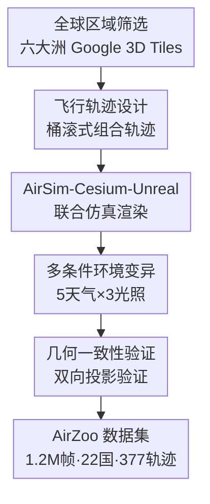

# AirZoo: A Unified Large-Scale Dataset for Grounding Aerial Geometric 3D Vision

**会议**: ECCV 2026  
**arXiv**: [2604.26567](https://arxiv.org/abs/2604.26567)  
**代码**: 无  
**领域**: 3D视觉  
**关键词**: 航空3D视觉, 合成数据集, 跨视角匹配, 多视图重建, 无人机定位

## 一句话总结
AirZoo 构建了一个百万级航空合成数据集，通过 AirSim-Cesium-Unreal 三位一体仿真管线从 Google 3D Tiles 自动渲染出带像素级深度和 6-DoF 地理参考位姿的无人机航拍序列，覆盖 22 个国家 377 条多天气轨迹，在航空图像检索、跨视角匹配和多视图三维重建三个任务上微调现有 SOTA 模型均取得显著提升，尤其是真实场景零样本泛化能力大幅增强。

## 研究背景与动机
数据驱动的 3D 视觉近年依赖大规模训练数据取得长足进步，但航空几何 3D 视觉（aerial geometric 3D vision）长期受困于高质量训练数据的严重匮乏。现有基准数据集几乎全部偏向地面视角（如 MegaDepth、ScanNet）或物体中心视角（如 ShapeNet、Objaverse），当这些数据训练的基础模型部署到无人机平台时，面临俯仰角从倾斜到天底（nadir）的极端视角变换、建筑物立面被屋顶取代、飞行高度变化导致尺度剧烈波动等独特几何挑战，领域鸿沟（domain gap）巨大。

为什么之前没人做出大规模航空几何数据集？核心原因在于构建此类数据面临三重技术壁垒：其一，真实无人机采集成本极高，难以覆盖全球多样化的地理环境和天气条件；其二，即便有真实采集，获得像素级稠密深度真值和精确 6-DoF 位姿需要昂贵的传感器（如激光雷达、RTK）和复杂的后处理管线；其三，利用合成数据又需同时解决三维场景资产的全球覆盖、渲染真实感和几何标注精度三个互相制约的难题。现有 UAV 数据集要么规模大但缺几何真值（如 University-1652、SUES-200 只有 RGB 截图），要么有几何标注但局限于一两个城市场景（如 MatrixCity 仅覆盖 2 个城市区域、UAVD4L 仅 1 个区域），从未有数据集能同时满足"全球尺度覆盖 + 稠密几何标注 + 连续序列采集"三者。

这件事为什么现在才可能？两个关键使能因素：一是 Google Photorealistic 3D Tiles 通过 Cesium for Unreal 插件可直接流式传输到 Unreal Engine 5，提供了覆盖全球六大洲的高精度摄影测量网格作为数据源；二是 AirSim 无人机仿真器与 UE5 的深度集成允许在可复现的位姿控制下同步采集 RGB、深度和内参，而且 Cesium Georeference 组件能建立仿真局部坐标到 WGS84 全球坐标的严格空间转换链，解决了合成数据最棘手的"几何真值是否可信"问题。

核心 idea：利用全球可自由获取的摄影测量 3D 网格作为场景资产，通过 AirSim-Cesium-Unreal 联合仿真管线自动化生成具有像素级几何真值的百万级航空序列数据集，使现有视觉基础模型通过微调即可获得领域不变的几何知识，弥合地面到航空的领域鸿沟。

## 方法详解

### 整体框架
AirZoo 的核心是一个全自动化的数据生成流水线，输入是全球任意区域的 WGS84 航点轨迹文件（JSON/CSV），输出是同步的 RGB 图像、像素对齐的绝对深度图（米制）、相机内参和 6-DoF 地理参考位姿。整个管线分五个阶段：全球区域筛选（从六大洲选取城市、乡村和自然地形的 Google 3D Tiles 区域）→ 飞行轨迹设计（为每个区域生成"桶滚式"组合轨迹，融合水平绕圈、直线巡航和曲线扫描）→ AirSim-Cesium-Unreal 联合仿真渲染（Python 控制器通过 RPC 接口驱动物理仿真和传感器同步采集）→ 多条件环境变异（对同一条轨迹叠加晴天/多云/雨天/雾天/雪天五种天气和白天/黄昏/夜晚三种光照）→ 几何一致性验证（双向投影验证确保深度和位姿的中位相对误差仅 0.066%）。最终产出包含 1.2M 帧、覆盖 22 个国家、377 条天气条件轨迹的大规模数据集。

### 关键设计

**1. AirSim-Cesium-Unreal 三位一体仿真管线：打通世界级 3D 地图到像素级几何标注的自动化流水线**

现有合成数据集最致命的软肋是场景资产要么手工搭建（覆盖范围极小），要么几何精度不可信（纯截图无深度/位姿真值）。AirZoo 的核心创新是把三个现成工具串成一条全自动管线，三者各司其职又相互制约：Unreal Engine 负责基于物理的渲染和动态天气/光照系统，Cesium for Unreal 负责把 Google Photorealistic 3D Tiles 实时流式传输到 UE 场景并建立地理坐标锚点（CesiumGeoreference），AirSim 负责模拟多旋翼无人机和虚拟相机，按预设 WGS84 航点执行可复现的位姿控制。最关键的工程细节是同步机制：Python 控制器驱动 AirSim 的 Steppable Clock，确保在流式瓦片加载稳定后再触发传感器同步采集——每帧同时记录 $\mathcal{M} = \{RGB, depth, intrinsics, pose\}$，避免了异步采集导致的深度-图像错位。这一管线不要求任何手工建模，给定任意 WGS84 航点文件即可全自动产出带稠密几何真值的航空序列。完整的像素到 WGS84 坐标转换链为 $\text{pixel}\xrightarrow{K^{-1}}\text{ray}\xrightarrow{T}\text{ENU}\xrightarrow{T}\text{ECEF}\xrightarrow{}\text{WGS84}$，通过 CesiumGeoreference 的双向地理配准保证每个像素的深度值都能严格反投影到地理坐标，因为 Unreal 的局部坐标与地球固定参考系之间是通过 Cesium 锚定的确定性变换，不存在累积漂移。

**2. "桶滚"式飞行轨迹与序列化数据组织：兼顾连续帧稠密邻接与大基线跨视角挑战**

无人机视觉任务天然存在一对矛盾需求：三维重建需要连续帧之间的高重叠率（通常 70% 以上）以保证稳定的多视图几何；而检索和匹配任务又需要大基线、大视角变化来测试算法的鲁棒性。AirZoo 设计了"桶滚"（barrel-roll）式轨迹来解决这一矛盾：每条轨迹由水平绕圈（围绕局部场景中心盘旋）、直线巡航和曲线扫描三段组成，飞行过程中同时调整高度、偏航角和云台俯仰角。这就产生了两类互补的图像对——同一轨迹的相邻帧间重叠率高达 70%，为重建提供稠密的时间邻域；而轨迹的转弯段和高度变化段产生重叠率低至 10% 的极端宽基线对，为检索和匹配提供严苛的测试场景。此外，所有采集都保持 30fps 的连续帧率，生成的是视频序列而非孤立关键帧，这种序列化组织使得每帧都嵌入了丰富的时间上下文，有利于学习对瞬态纹理鲁棒而对稳定三维几何敏感的特征表示。

**3. 多条件环境渲染与几何一致性验证：保证视觉多样性同时不牺牲空间精度**

光照和天气变化是无人机真实部署中无法回避的挑战，但也是现有数据集最薄弱的环节之一。AirZoo 利用 UE5 的动态体积系统，对同一条飞行轨迹叠加五种天气预设（晴天、多云、雨天、雾天、雪天）和三种时段（白天、黄昏、夜晚）共 15 种视觉条件组合（实际使用了有意义的子集，最终产生 377 条条件轨迹）。关键洞察是：固定几何、变化外观——同一条轨迹在所有条件下的相机位姿和深度图完全相同，只改变渲染的光照和大气参数。这意味着同一场景点在不同天气下拥有完全一致的几何真值，却呈现截然不同的视觉特征，天然构成了"学习几何不变表示"的理想训练信号。几何一致性方面，作者做了严谨的闭环验证：将源帧像素通过渲染深度反投影到 3D，再通过源-目标帧的相对位姿重投影到目标帧，双向投影的中位相对深度误差仅 0.066%，P90 为 0.174%，P95 为 0.380%，证实了从 Cesium 地理配准到传感器同步的整个链条没有引入不可忽视的几何偏差。

**4. 全球尺度场景覆盖与零空间重叠训练/测试划分：确保泛化评估无数据泄漏**

数据集的训练价值不仅在于规模，更在于地理多样性。AirZoo 的 95 条基础轨迹跨越六大洲 22 个国家，覆盖城市核心区、郊区、乡村农田和自然荒野等截然不同的地貌类型，飞行高度包络为 0-800m，云台俯仰角从 10 度（倾斜）连续扫描到 90 度（天底）。这种多样性保证了模型在训练中见过足够丰富的几何结构（摩天大楼、低矮民居、森林、山脉、水域），而不是对某些固定建筑纹理过拟合。更关键的是训练/测试的空间隔离设计：合成训练集覆盖 19 个国家，巴西、美国和新西兰三国区域被完整保留作为 AirZoo-Test；真实测试集（AirZoo-Real）则完全独立采集自长沙四个场景，与合成训练集零地理重叠。这样的划分杜绝了"模型只是记住了某个城市的特定建筑外观而非学到了通用几何推理能力"的隐性数据泄漏风险，评估出的零样本泛化能力更可信。

### 损失函数 / 训练策略
AirZoo 本身是数据集，不涉及独立的训练策略。论文在三个下游任务上的微调协议各有不同，但核心理念一致——保持主干架构不变，仅替换/扩充训练数据为 AirZoo，让性能增益归因于数据而非模型改动：

- **航空图像检索**：以 MegaLoc 为基础检索器，冻结除最后一个 backbone block 外的所有层，仅训练特征聚合网络。采用加权 InfoNCE 损失 $\mathcal{L}_{\text{weighted-InfoNCE}} = \alpha_q \mathcal{L}_{\text{InfoNCE}} + (1 - \alpha_q)\mathcal{L}_{\text{uniform-InfoNCE}}$，其中权重 $\alpha_q = \sigma(k, \text{IOU}_{qr^+})$ 由查询-卫星瓦片的重叠比通过 sigmoid 函数（$k=5$）调制，使高重叠的正样本贡献更大的对比信号。训练使用序列感知的 mini-batch 采样策略（同序列不超过 1 对）防止序列特异性捷径。

- **跨视角匹配**：以 RoMa 为基础匹配器，在 MegaDepth 与 AirZoo 的混合数据上微调（采样比 80%:20%），差分学习率 $\eta_{\text{enc}} = 2\times 10^{-7}, \eta_{\text{dec}} = 4\times 10^{-6}$ 保护预训练特征表示。

- **多视图三维重建**：在 VGGT 和 DA3 上分别微调，采样随机重叠率 50%-75% 且变长序列（VGGT: 2-24 帧，DA3: 2-10 帧）的片段以增加基线和运动模式的多样性。

## 实验关键数据

### 主实验：航空图像检索

| 方法 | UAV-VisLoc R@1 | UAV-VisLoc R@5 | UAV-VisLoc AP@5 | AirZoo-Real R@1 | AirZoo-Real R@5 | AirZoo-Real AP@5 |
|------|:---:|:---:|:---:|:---:|:---:|:---:|
| AnyLoc | 17.01 | 36.57 | 12.60 | 4.52 | 10.45 | 2.94 |
| SALAD | 25.72 | 46.77 | 17.95 | 7.36 | 29.48 | 7.73 |
| Game4Loc | 18.68 | 41.79 | 13.20 | 12.67 | 34.18 | 10.66 |
| MegaLoc (原始) | 26.91 | 52.68 | 19.09 | 6.46 | 22.16 | 6.33 |
| **MegaLoc (AirZoo 微调)** | **28.64** | **53.74** | **19.78** | **18.66** | **50.53** | **17.22** |

上表同时给出两个真实测试集的对比。在 UAV-VisLoc 上增益适中（R@1 仅 +1.73），原因是该数据集查询-参考对以天底视角为主，跨视角域差本身不大；而在 AirZoo-Real 上增益极为显著（R@1 从 6.46 跃升至 18.66，提升近 3 倍，R@5 从 22.16 跃升至 50.53），说明 AirZoo 在真正具有挑战性的任意视角、强环境变化的真实部署场景下才能释放最大价值，而不仅仅是改善了近天底场景下的尺度适配。特别值得注意的是 MegaLoc 原始模型在 AirZoo-Real 上反而弱于 Game4Loc，说明仅凭地面数据预训练的模型在真实航空检索中并不具备天然的领域优势。

### 主实验：多视图三维重建

| 方法 | UAVScenes F1 | UrbanScene3D F1 | AirZoo-Test F1 | AirZoo-Real F1 |
|------|:---:|:---:|:---:|:---:|
| CUT3R | 83.51 | 39.64 | 64.99 | 48.88 |
| MapAnything | 90.30 | 49.73 | 83.35 | 45.00 |
| VGGT (原始) | 86.20 | 43.38 | 67.67 | 42.48 |
| **VGGT (AirZoo 微调)** | 86.98 | **52.61** | 77.32 | 43.67 |
| DA3-Large (原始) | 87.38 | 47.83 | 54.10 | 49.97 |
| **DA3-Large (AirZoo 微调)** | **91.42** | **55.91** | **86.09** | **53.07** |

AirZoo 微调对 VGGT 和 DA3 在所有测试集上均有提升，最惊人的是 DA3 在 AirZoo-Test（合成、无域差）上的 F1 从 54.10 飙升至 86.09（+31.99），说明即便是在同源的合成域内，AirZoo 的大规模和多样性也比单一场景训练提供了更丰富的几何学习信号。在真实场景（AirZoo-Real）上增益相对温和（DA3 F1 +3.10），作者指出真实域差仍是核心瓶颈——真实影像的纹理、反射和噪声模式与 UE5 渲染存在本质差异，纯合成数据训练尚不能完全弥合这一差距。

### 关键发现
- **跨域泛化是 AirZoo 的核心价值而非绝对精度**：在域差大的场景（AirZoo-Real 的非天底检索、UrbanScene3D 的复杂城市重建），微调增益显著；在域差小的场景（UAV-VisLoc 的天底检索、UAVScenes 的规则航拍），增益收敛。这说明 AirZoo 的作用机制是注入"领域不变的几何先验"而非"更多的训练数据"，因此对分布外场景特别有效。
- **序列化设计对重建任务尤其关键**：与孤立关键帧数据集相比，AirZoo 的连续视频序列允许采样不同长度和重叠率的片段进行训练，正是这种变基线、变序列长度的采样策略（而非单纯的数据量）贡献了重建性能的大幅提升，因为它迫使模型学会处理从稠密邻接到宽基线的各种运动模式。
- **跨视角匹配任务中数据混合比例至关重要**：RoMa 在 MegaDepth（地面）+ AirZoo（航空）的 80%:20% 混合训练下表现最佳。单独增加 AirZoo 比例反而会损害地面场景的匹配性能，因为航空视角的几何先验（如屋顶主导、天底线消失）与地面视角存在冲突，需要地面数据保底维持通用匹配能力。这一反直觉发现揭示了领域特化训练中普遍存在的灾难性遗忘风险。

## 亮点与洞察
- **"固定几何、变化外观"的多条件渲染策略**是数据集设计中的巧思。同一条轨迹在五种天气和三种光照下渲染出完全相同位姿和深度但不同视觉特征的帧对，这天然构成了一个"解耦几何与外观"的自监督学习信号源——模型被迫忽略天气和光照变化，只关注不变的 3D 结构。这种设计哲学可以迁移到任何需要"学习不变表示"的合成数据构建中，例如自动驾驶的跨天气感知或机器人的跨季节定位。
- **零空间重叠的训练/测试划分**看似理所当然，但在 UAV 数据集领域是稀缺实践。现有大多数数据集（如 University-1652）的训练和测试共享相同地标，模型可能只是记住了特定建筑的卫星-航拍纹理对应而非学会了跨视角匹配。AirZoo 将巴西、美国和新西兰三个国家完整保留为测试集，迫使模型真正泛化到从未见过的地理区域，这一评估协议值得所有地理空间数据集借鉴。
- **桶滚轨迹的"一条轨迹服务多任务"设计**体现了对下游任务需求的深入理解：无人机三维重建需要连续稠密帧（70% 重叠），检索匹配需要大基线挑战（10% 重叠），二者在同一轨迹的不同段落中自然产生，无需分别采集。这种"构建时想清楚下游怎么用"的数据集设计思维比"堆量"更有价值。
- 在跨视角匹配实验中，纯合成数据微调的 RoMa 在真实场景上的中位平移误差从 5.87m 降至 3.03m——近一半的误差削减——说明好的合成数据不仅能"补充"真实数据的不足，在特定条件下甚至可以"替代"大量真实标注。这对标注成本极高的几何视觉任务尤其有启发意义。

## 局限与展望
- **作者承认的局限**：故障案例分析显示，AirZoo 数据集中缺乏围绕单体建筑物环绕飞行的轨迹，导致微调后的模型在处理"围绕目标做环绕拍摄"的真实序列时，无法正确推断建筑物的三维结构关系，出现明显的位姿漂移和几何扭曲。这是一个数据分布覆盖不足的问题，可通过扩展轨迹模板库来解决。
- **真实-合成域差仍是核心瓶颈**：尽管 UE5 的物理渲染在场景布局和结构模式上与真实航拍可比，但光照、阴影、纹理细节和传感器噪声方面的差异仍然显著。这解释了为什么同一模型在 AirZoo-Test（合成→合成）上提升 31.99 F1，而在 AirZoo-Real（合成→真实）上仅提升 3.10 F1。弥合这一差距需要引入域自适应或域随机化技术，例如在渲染管线中加入更激进的纹理增强、噪声注入和大气散射随机化。
- **深度真值精度评测的完备性存疑**：0.066% 的中位相对深度误差来自合成域内的双向投影自检，但此指标只验证了深度-位姿几何一致性（即"管线内部不自相矛盾"），并未对照外部独立真值（如激光雷达点云）验证绝对精度。在真实场景中，Google 3D Tiles 自身的摄影测量误差会传播到所有渲染输出，而这部分误差无法通过自检发现。
- **缺少大规模预训练范式的探索**：论文将 AirZoo 定位为"微调引擎"而非"预训练语料"，所有实验都是在小规模微调设置下进行的（如 MegaLoc 只解冻最后一层、RoMa 采样比为 20%）。AirZoo 的 1.2M 帧规模是否足以支持从头训练航空专用基础模型？这比微调现有地面模型有更大的潜力空间，目前尚未探索。
- **单帧深度和位姿标注的潜力未充分挖掘**：AirZoo 的每一帧都有像素级深度和精确位姿，这是极其丰富的监督信号，但论文只将其用于标准的检索/匹配/重建评估。这些数据可以直接训练单目深度估计、位姿回归、新视角合成等多个任务，数据集的利用方式远未穷尽。

## 相关工作与启发
- **vs University-1652 / SUES-200**: 这些都是航空检索的经典基准，提供了大量卫星-航拍图像对，但仅包含 RGB 截图（通过 Google Earth 手动截取），完全缺失深度和位姿真值。AirZoo 的核心超越在于为每一帧提供同步的像素级深度和地理参考 6-DoF 位姿，使得其不仅能做检索，还能支撑匹配和重建等需要几何监督的任务。University-1652 的 1652 个地标看似很多，但每个地标仅是圆周飞行的一个视角，缺乏连续轨迹的空间上下文。
- **vs MatrixCity / UAVScenes**: 这类数据集提供了稠密几何标注，但场景多样性严重受限（MatrixCity 仅 2 个合成城市、UAVScenes 仅 4 个真实场景）。AirZoo 的 95 个区域 × 15 种条件组合在规模和多样性上是数量级的提升，且通过全球自由可用的 3D Tiles 作为数据源，理论上可无限扩展而无需手工建模。
- **vs Game4Loc / OrthoLoC**: 两者都提供几何真值，但 Game4Loc 局限于单一合成环境，OrthoLoC 虽有 47 个区域但缺乏连续序列采集。AirZoo 的序列化设计（30fps 连续轨迹）是关键的差异化特征，因为它同时服务于需要时间稠密邻域的重建任务和需要大基线的检索任务。
- **与基础模型协作的范式启发**：AirZoo 的定位不是"替代现有数据集"而是"补充现有基础模型的航空能力"。它在三个任务上对 MegaLoc、RoMa、VGGT、DA3 的微调提升，说明一个好的领域数据集即使规模远小于基础模型的预训练语料（MegaDepth 百万级、RealEstate10K 数万级），也能显著改善特定领域的性能——关键在于数据与目标域的对齐度而非绝对规模。

## 评分
- 新颖性: ⭐⭐⭐⭐ 三位一体仿真管线（AirSim-Cesium-Unreal）的组合方式有工程新意，但核心组件均为现成工具；真正的新颖性在于首次在单一数据集中同时实现"全球覆盖 + 序列化采集 + 像素级几何真值"三者的统一，填补了一个明确且重要的空白。
- 实验充分度: ⭐⭐⭐⭐⭐ 在三个代表性任务（检索/匹配/重建）上、四个真实基准（UAV-VisLoc/AerialExtreMatch/UAVScenes/UrbanScene3D）加上自采 AirZoo-Real 上对多个 SOTA 模型做了系统对比，实验覆盖面广、结论有说服力。每项任务都汇报了场景级细粒度结果和失败分析。
- 写作质量: ⭐⭐⭐⭐ 结构清晰，图表丰富（框架图、统计图、定性对比图），附录详尽记录了实现细节和各个评估基准的构造过程。英文表述通顺，但部分段落的论述节奏略拖沓。
- 价值: ⭐⭐⭐⭐⭐ 航空 3D 视觉社区长期受数据匮乏之苦，AirZoo 作为首个大规模、多任务、带稠密几何真值的公开航空基准，有潜力成为该领域的"ImageNet 时刻"。其流水线的可扩展性（任何有 Google 3D Tiles 覆盖的区域均可生成新数据）也使其具备超越静态数据集的长期价值。

<!-- RELATED:START -->

## 相关论文

- [\[CVPR 2026\] Ego-1K: A Large-Scale Multiview Video Dataset for Egocentric Vision](../../CVPR2026/3d_vision/ego-1k_--_a_large-scale_multiview_video_dataset_for_egocentric_vision.md)
- [\[CVPR 2026\] SceneScribe-1M: A Large-Scale Video Dataset with Comprehensive Geometric and Semantic Annotations](../../CVPR2026/3d_vision/scenescribe-1m_a_large-scale_video_dataset_with_comprehensive_geometric_and_sema.md)
- [\[ECCV 2026\] SemCityLoc: Aerial 6DoF Localization Using Semantic 3D City Models](semcityloc_aerial_6dof_localization_using_semantic_3d_city_models.md)
- [\[CVPR 2025\] Horizon-GS: Unified 3D Gaussian Splatting for Large-Scale Aerial-to-Ground Scenes](../../CVPR2025/3d_vision/horizon-gs_unified_3d_gaussian_splatting_for_large-scale_aerial-to-ground_scenes.md)
- [\[CVPR 2026\] SpatialVID: A Large-Scale Video Dataset with Spatial Annotations](../../CVPR2026/3d_vision/spatialvid_a_large-scale_video_dataset_with_spatial_annotations.md)

<!-- RELATED:END -->
