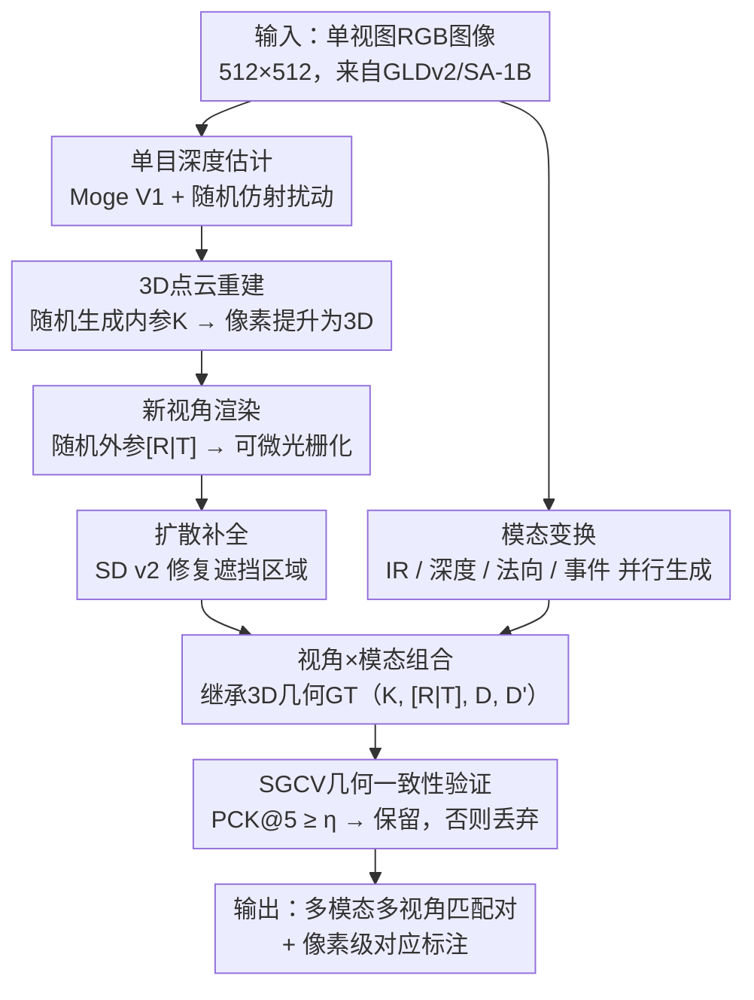

# AnyMatch: Supercharging Universal Multi-Modal Image Matching with Large-Scale Single-View Images

**会议**: ECCV 2026  
**arXiv**: [2606.31077](https://arxiv.org/abs/2606.31077)  
**代码**: 无  
**领域**: 3D视觉  
**关键词**: 多模态图像匹配, 合成数据生成, 3D几何一致性, 视角变换, 模态变换

## 一句话总结
AnyMatch 提出一种从海量单视图图像零成本合成多模态多视角匹配数据的框架，通过单目深度估计+3D重投影+扩散补全实现几何一致的视角变换，结合跨模态图像翻译实现红外/深度/法向/事件四种模态生成，并用样本级几何一致性验证（SGCV）过滤生成瑕疵；在 Any-syn 合成数据集上微调 LoFTR/EDM/RoMa 后，跨模态匹配性能大幅超越 MINIMA 等现有合成方法，且在未见医学/遥感模态上展现出强零样本泛化能力。

## 研究背景与动机
多模态图像匹配（如 RGB-红外、RGB-深度、RGB-事件相机）是视觉定位和多传感器融合的基石，但其核心瓶颈在于缺乏带有精确几何标注的大规模训练数据。真实数据采集需要昂贵的同步多传感器硬件和精密标定，成本极高；且现有真实数据集（如 MegaDepth）依赖 SfM-MVS 管线生成几何真值，该方法仅适用于静态、高光度一致性的场景，存在场景多样性受限、重建误差累积、无法处理多模态图像等固有问题。

现有合成数据方法各有短板：图像翻译法（如 MINIMA）在现有多视角 RGB 数据集上做模态翻译，直接继承 SfM-MVS 的几何标注，误差不可避免且受限于源数据集的场景覆盖范围；2D 单应变换法仅在图像平面内模拟几何形变，丢弃了跨视角 3D 几何一致性，无法生成符合物理规律的遮挡模式；游戏引擎法难以达到照片级真实感，特别是在材质反射和全局光照建模方面存在显著的 domain gap。

矛盾在于：互联网上存在海量单视图图像（GLDv2、SA-1B、COCO 等数据集数以百万计），天然覆盖丰富的场景内容和长尾分布，理论上能为匹配模型提供前所未有的泛化潜力——但缺少一种有效机制将其转化为带有精确 3D 几何监督的多模态多视角训练数据。核心 idea：将单目深度估计、3D 重投影、扩散补全和跨模态翻译组合成一条完整管线，从任意单张图片出发，自动生成几何严格一致的多模态多视角匹配对及其像素级标注。

## 方法详解

### 整体框架
AnyMatch 要解决的核心问题是：给定任意一张单视图 RGB 图像，如何生成一组多模态、多视角的图像对，同时提供严格符合 3D 几何一致性的像素级对应关系标注。整个框架解耦为两个独立可组合的核心变换——视角变换和模态变换——两分支并行执行后组合，再经过几何一致性验证筛选高质量样本。

输入是一张从公开数据集中采样的 512x512 单视图 RGB 图像 $I_{\text{sin}} \in T_{\text{sin}}$。视角变换分支先通过预训练单目相对深度模型 $M_{\text{rd}}$（Moge V1）预测稠密相对深度图 $D_r$，经随机仿射扰动模拟深度尺度不确定性后，结合随机生成的内参 $K$ 将 2D 像素提升为 3D 点云 $P$；再通过随机采样的外参 $[R|T]$ 将点云变换到新视角坐标系 $P' = R \cdot P + T$，经可微网格渲染（点云→三角网格→透视投影→重心坐标插值）得到初始新视图 $I_{\text{novel}}$ 和遮挡掩码 $M_{\text{occ}}$；最后用 Stable Diffusion v2 对遮挡区域做上下文感知补全得到 $I_{\text{inp}} = M_{\text{inpaint}}(I_{\text{novel}}, M_{\text{occ}})$。

模态变换分支并行地对原始图像 $I_{\text{sin}}$ 做跨模态翻译，生成四种目标模态图像 $I_{\text{modal}} = F(I_{\text{sin}})$：红外（DiffV2IR，两阶段 LoRA 微调 LDM）、深度（Moge V1）、法向（Moge V2）和事件（运动模拟合成事件流）。由于模态变换保持几何结构不变，两分支输出组合后，视角变换阶段产生的相机参数 $\{K, [R|T]\}$ 和深度图 $\{D, D'\}$ 可直接继承为几何真值，无需为每种模态单独标注。最后通过 SGCV 模块——利用已知几何真值反检匹配质量——过滤因补全幻觉导致几何不一致的低质量样本，只保留 $\text{PCK}@\tau \geq \eta$ 的样本进入最终训练集 Any-syn。

### 关键设计

**1. 视角变换：从单视图到多视图的 3D 几何一致生成**

核心痛点是现有合成数据方法无法为多视图图像对提供准确的 3D 几何真值——SfM-MVS 有误差累积，单应变换没有真实 3D 几何。AnyMatch 的方案是"先升维再降维"：用单目深度模型预测相对深度 $D_r$，再通过随机仿射扰动

$$D = 1/(\alpha \cdot (1/D_r) + \beta + \epsilon)$$

模拟深度尺度不确定性，其中 $\alpha \in (0.5, 2.0)$ 对应焦距变化引起的尺度漂移，$\beta \in (0, 0.3)$ 对应传感器系统误差和非零均值噪声，$\epsilon$ 为数值稳定项。这一扰动的设计意图是让下游匹配模型在训练中就学会容忍深度估计的不精确性。随后结合随机生成的内参 $K$（焦距 $f \in (0.58, 0.88)$，主点固定于归一化图像中心 $(0.5, 0.5)$），将每个像素 $(u_i, v_i)$ 提升为 3D 坐标：

$$P = \begin{bmatrix}X \\ Y \\ Z\end{bmatrix} = D(u_i, v_i) \cdot K^{-1}\begin{bmatrix}u_i \\ v_i \\ 1\end{bmatrix}$$

新视角生成通过随机外参 $[R|T]$ 控制：旋转角在 $[-7.5^\circ, +7.5^\circ]$ 内采样，平移分量 $t_x, t_y$ 在 $[-0.3, +0.3]$、$t_z$ 在 $[-0.5, +0.5]$ 内采样，可通过调节外参变化范围控制数据难度级别，支持课程学习策略。点云变换到新坐标系后，采用可微网格渲染（附录详述：点云→三角网格→透视投影矩阵 $\mathbf{\Pi}$→NDC 空间→重心坐标插值）生成初始新视图 $I_{\text{novel}}$ 和遮挡掩码 $M_{\text{occ}}$，$P'$ 的 Z 坐标直接构成对应深度图 $D'$。最后用扩散补全修复遮挡区域 $I_{\text{inp}} = M_{\text{inpaint}}(I_{\text{novel}}, M_{\text{occ}})$。视角变换模块的核心优势：所有几何标注（相机参数、深度图、像素对应关系）均通过显式 3D 重投影计算，严格满足对极几何约束，完全绕开了 SfM-MVS 的误差累积。

**2. 模态变换：从单模态到多模态的并行跨模态翻译**

模态变换解决的是"如何让匹配模型见过不同传感器之间的外观差异"。AnyMatch 采用四条并行管线将原始 RGB 图像翻译为四种目标模态，核心原则是保持几何结构不变（不引入形变），确保与视角变换组合时几何真值可直接复用。

- **红外（IR）**：采用两阶段扩散模型 DiffV2IR。第一阶段在大型红外图像集上用 LoRA 微调 LDM，以统一文本提示 "an infrared image" 建立红外概念的语义关联；第二阶段在 RGB-IR 配对数据上以 RGB 为条件微调，使模型学会从可见光输入合成符合红外物理特性（热辐射模式）的输出。
- **深度与法向**：直接使用预训练的单目模型 Moge V1（相对深度估计）和 Moge V2（表面法向估计），无需额外训练，输出即作为伪深度图和伪法向图。
- **事件**：通过运动模拟合成事件流。事件相机每个像素独立监测对数亮度 $L = \log(I_{\text{sin}})$ 的变化，当亮度变化量 $\Delta L(\mathbf{x}_k, t_k)$ 超过对比度阈值 $C$ 时触发事件 $e_k = (\mathbf{x}_k, t_k, p_k)$，$p_k = \pm 1$ 表示明/暗极性。阈值 $C \in [0.05, 0.5]$ 和极性随机设置以模拟不同传感器特性，同时对输入帧施加微小随机运动模拟真实相机运动。

最终 $I_{\text{modal}} = F(I_{\text{sin}})$，$F$ 为模态变换模块。四条管线完全并行、互不依赖，新增目标模态只需增加对应翻译管线，无需改动视角变换或几何标注。

**3. 样本级几何一致性验证（SGCV）：用 GT 反检数据质量**

扩散补全虽然能产生视觉连贯的内容，但可能"幻觉"出违反原始场景几何和语义结构的虚假纹理，这些伪影会误导匹配模型学习错误的特征对应。SGCV 在模态变换之前对单模态图像对（$I_{\text{sin}}$ 与 $I_{\text{inp}}$）做质量筛查，思路是利用已知几何真值来反检补全是否偏离了真实几何。

具体流程：先用高性能稠密匹配模型 RoMa 在原始图像与补全新视图之间提取稠密对应集 $\mathcal{M}_{\text{init}} = \{(x_{\text{sin}}^i, x_{\text{inp}}^i)\}_{i=1}^N$，再利用已知的相机参数和深度图，通过 3D 重投影计算每个匹配点的 GT 对应位置 $\hat{x}_{\text{inp}}^i$，计算端点误差：

$$\text{EPE}(x_{\text{sin}}^i) = \|x_{\text{inp}}^i - \hat{x}_{\text{inp}}^i\|^2$$

最后统计正确对应的比例 $\text{PCK}@\tau$（$\tau = 5$ 像素）：

$$\text{PCK}@\tau = \frac{|\{(x_{\text{sin}}^i, x_{\text{inp}}^i)\}_{i=1}^N \mid \text{EPE}(x_{\text{sin}}^i) < \tau|}{N} \times 100\%$$

当 $\text{PCK}@\tau \geq \eta$（$\eta = 0.6$）时保留样本，否则丢弃。这个方法巧妙在于"用管线自己的强项弥补自己的弱项"——3D 重投影能给出精确像素对应 GT，用这个 GT 来检测扩散补全是否产生了几何偏移。消融实验证明这是最关键的质量控制机制，去掉 SGCV 后 @10° 从 35.80 掉到 31.24。

### 一个完整示例

以 GLDv2 中的一张建筑立面图像为例走通 AnyMatch 全流程。输入为 512x512 的 RGB 图像 $I_{\text{sin}}$，Moge V1 首先预测相对深度图 $D_r$，经仿射扰动（采样 $\alpha=1.3$、$\beta=0.12$）得到变换后深度 $D$。随后随机生成内参（$f=0.72$）和外参（旋转 4.2 度、平移 $[0.15, -0.12, 0.25]$），将 2D 像素提升为约 26 万个 3D 点 → 变换到新视角坐标系 → 可微光栅化渲染生成 $I_{\text{novel}}$，此时约 15% 像素因遮挡被标记为空洞（$M_{\text{occ}}$ 中对应位置为 0）。Stable Diffusion v2 对这些空洞做上下文补全得到 $I_{\text{inp}}$。

同时，模态变换分支并行处理 $I_{\text{sin}}$：DiffV2IR 合成红外图像（建筑窗户区域因温度差异呈现不同热辐射特征）、Moge V1/V2 直接输出深度图和法向图、运动模拟以随机阈值 $C=0.2$ 生成事件流。将每张模态图 $I_{\text{modal}}$ 与 $I_{\text{inp}}$ 配对，直接继承视角变换阶段产生的相机参数 $\{K, [R|T]\}$ 和深度图 $\{D, D'\}$ 作为像素级 GT 标注。

最后 SGCV 验证：RoMa 在 $I_{\text{sin}}$ 与 $I_{\text{inp}}$ 间提取约 2000 组稠密对应，利用已知几何参数计算每对 EPE，统计得 $\text{PCK}@5 = 72\%$，超过阈值 $\eta=0.6$，该组图像质量合格，所有模态对全部保留。最终产出 4 组跨模态匹配对（RGB-IR、RGB-Depth、RGB-Normal、RGB-Event），每组均配有精确的像素级几何真值，可直接用于匹配模型训练。

### 损失函数 / 训练策略

AnyMatch 本身是一个数据生成框架，无可训练参数。下游使用时，在 Any-syn 数据集上对预训练匹配模型做微调。训练集从 GLDv2 通过 AnyMatch 构建 50 万对（覆盖 RGB-RGB/IR/Depth/Normal/Event 五种模态组合），测试集从 SA-1B 构建 1 万对。遵循 MINIMA 的设置，仅使用 RGB-IR、RGB-Depth、RGB-Normal 三种模态对进行训练，RGB-Event 和 RGB-RGB 仅用于测试。训练时统一对所有像素（包括补全区域）施加稠密匹配监督。

三个 backbone 的微调配置：(1) EDM 保持原始学习率 $1 \times 10^{-4}$，微调 10 epoch，batch size 4；(2) LoFTR 使用 $8 \times 10^{-4}$ 学习率，微调 10 epoch，batch size 4；(3) RoMa 编码器/解码器学习率分别为 $6.25 \times 10^{-8}$ 和 $1.25 \times 10^{-6}$，仅 4 epoch 即收敛，batch size 2。所有模型在 4 张 NVIDIA RTX 4090 上训练。位姿估计使用 RANSAC 统一超参保证公平比较。

## 实验关键数据

### 主实验

合成数据集 Any-syn 测试子集上的位姿估计评估（AUC of pose error，摘录 EDM/LoFTR/RoMa 三个 backbone 的原始、MINIMA 微调、AnyMatch 微调三组对比）。

| 方法 | RGB-IR @5° | RGB-IR @10° | RGB-IR @20° | RGB-Depth @10° | RGB-Normal @10° | RGB-Event @10° |
|------|-----------|------------|------------|---------------|----------------|---------------|
| EDM (原始) | 9.20 | 19.63 | 32.78 | 0.41 | 14.81 | 0.83 |
| EDM_MINIMA | 14.70 | 31.56 | 51.20 | 11.25 | 25.99 | 3.30 |
| EDM_AnyMatch | 28.80 | 50.00 | 68.53 | 20.36 | 36.65 | 9.32 |
| LoFTR (原始) | 8.35 | 17.92 | 30.13 | 0.17 | 8.70 | 1.08 |
| LoFTR_MINIMA | 13.09 | 28.75 | 48.20 | 9.27 | 22.59 | 3.43 |
| LoFTR_AnyMatch | 22.30 | 41.45 | 60.91 | 9.78 | 26.61 | 3.94 |
| RoMa (原始) | 30.08 | 48.65 | 65.94 | 7.00 | 36.24 | 3.10 |
| RoMa_MINIMA | 40.00 | 60.62 | 76.27 | 22.16 | 49.33 | 7.29 |
| RoMa_AnyMatch | 50.91 | 69.88 | 82.75 | 29.39 | 56.50 | 11.87 |

RoMa_AnyMatch 在 RGB-IR @10° 上达 69.88%，比 RoMa_MINIMA（60.62%）绝对提升 9.26 个百分点，比原始 RoMa（48.65%）相对提升 43.6%。RGB-Event 因事件相机的异步亮度变化感知原理导致模态差异极大，所有方法表现均大幅低于其他模态，但 EDM_AnyMatch @10° 仍以 9.32% 远超 EDM_MINIMA 的 3.30%（+6.02 个百分点）。

真实数据集上的评估（METU-VisTIR RGB-IR 位姿估计 + DIODE RGB-Depth/Normal + DSEC RGB-Event 单应估计，摘录核心指标）。

| 方法 | RGB-IR @10° | RGB-Depth @5px | RGB-Normal @5px | RGB-Event @10px |
|------|------------|---------------|----------------|-----------------|
| EDM (原始) | 15.82 | 5.75 | 18.25 | 8.89 |
| EDM_MINIMA | 32.80 | 24.89 | 33.72 | 13.63 |
| EDM_AnyMatch | 35.80 | 28.75 | 40.04 | 13.57 |
| RoMa (原始) | 48.12 | 29.47 | 46.01 | 8.72 |
| RoMa_MINIMA | 60.70 | 51.09 | 59.24 | 13.16 |
| RoMa_AnyMatch | 62.61 | 49.83 | 60.02 | 14.25 |

在未见模态的零样本评估中（MMIM 数据集，覆盖 13 种医学/遥感跨模态组合），AnyMatch 在遥感场景优势尤为突出——EDM_AnyMatch 在遥感 @5px 达 38.69，远超 EDM_MINIMA 的 30.52 和原始 EDM 的 26.50；LoFTR_AnyMatch 在遥感 @5px 达 39.76，远超 LoFTR_MINIMA 的 33.96。这说明 AnyMatch 训练出的模型学到了模态无关的几何感知特征表示，而非仅仅拟合已知模态的外观分布。

### 消融实验

以 EDM 为基线在 METU-VisTIR RGB-IR 上做消融（AUC of pose error）。

| 配置 | @5° | @10° | @20° | 说明 |
|------|-----|------|------|------|
| 1 modality w/o SGCV | 13.55 | 27.71 | 44.50 | 仅 RGB-IR 单模态，无几何验证 |
| 3 modalities w/o SGCV | 15.63 | 31.24 | 48.29 | RGB-IR/Depth/Normal 三模态联合 |
| 3 modalities w/ SGCV (η=0.6) | 17.13 | 35.80 | 55.24 | 完整 AnyMatch 配置 |
| 3 modalities + from scratch | 5.69 | 14.16 | 27.45 | 不加载预训练，从头训练 |
| 3 modalities + homography | 15.45 | 30.78 | 46.16 | 用 2D 单应变换替代 3D 视角变换 |

SGCV 阈值消融（η 从 0.7 到 0 即不过滤）：

| η | 0.7 | 0.6 | 0.5 | 0.4 | 0.3 | 0 (无过滤) |
|---|-----|-----|-----|-----|-----|-----------|
| AUC@10° | 32.52 | 35.80 | 31.47 | 32.04 | 31.32 | 31.24 |

### 关键发现
- **多模态联合训练收益显著**：三模态训练相比单模态在 @20° 上从 44.50 提升到 48.29（+3.79），说明跨模态协同学习有助于提取模态无关的鲁棒特征。
- **SGCV 是最关键的质量控制机制**：加入 SGCV 后 @10° 从 31.24 提升到 35.80（+4.56），且在 η=0.6 达到峰值。过滤过严（η=0.7）会丢弃有用样本，过滤过松则无法消除幻觉伪影——存在一个最优平衡点。
- **3D 视角变换远优于 2D 单应变换**：单应变换方案 @10° 仅为 30.78 vs. AnyMatch 的 35.80，验证了通过 3D 重投影生成的视差和遮挡关系更符合真实物理约束。
- **预训练先验不可或缺**：从零训练在 @20° 上仅达微调模型的约 50%（27.45 vs 55.24），说明预训练匹配模型中蕴含的通用匹配先验对跨模态适应至关重要。
- **LoFTR 对合成数据质量更敏感**：附录分析表明，在低质量（PCK@5 ∈ [0.2, 0.4]）合成对上，LoFTR_AnyMatch 的 @20° 相对高质量组下降 30.94%，而 EDM_AnyMatch 仅下降 10.84%，说明基于 Transformer 的 LoFTR 对几何不一致伪影更脆弱。

## 亮点与洞察
- **"单视图→多模态多视角"的解耦设计**：AnyMatch 最巧妙的地方在于视角变换和模态变换的完全解耦——两分支独立运行后组合，几何标注只由视角变换产生、被模态变换零成本复用。任何新模态的加入只需增加一条翻译管线，管线其余部分不变。这种"几何生成 × 外观翻译"的因子化思路可推广到其他需要跨模态配对数据的任务。
- **SGCV 是一种"用强项补弱项"的自检机制**：既然 3D 重投影能给出精确的像素对应 GT，就用这个 GT 来反向检测扩散补全是否产生了偏离真实几何的幻觉。这是一种利用管线自身优势监控自身弱点的设计模式，可迁移到任何"生成+筛选"的数据合成流水线。
- **深度仿射扰动作为隐式数据增强**：通过对单目深度施加 $D = 1/(\alpha \cdot (1/D_r) + \beta + \epsilon)$ 的随机扰动，AnyMatch 让下游匹配模型在训练过程中就接触到带深度噪声的监督信号，从而学会对深度估计不准确性具有天然鲁棒性——这是一个低成本且有效的"教会模型容忍输入噪声"的技巧。
- **可控难度支持课程学习**：通过调节外参变化范围（旋转角幅度、平移量），可以系统性地控制生成数据中视角变化的剧烈程度，从而从易到难地组织训练数据，为课程学习策略提供天然支持。

## 局限与展望
- **补全幻觉是核心瓶颈**：扩散补全可能生成违反几何和语义一致性的虚假内容，SGCV 只能过滤（丢弃坏样本）而不能修复。附录中 LoFTR 在低质量合成对上大幅降级印证了这一问题：合成数据的质量下限决定了某些对伪影敏感的 backbone 的性能上限。
- **对单目深度估计的依赖**：整个 3D 几何一致性建立在单目深度预测的基础上，其尺度模糊性和系统性偏差虽通过随机扰动缓解，但在深度不连续区域（物体边界）、透明/镜面反射表面等困难场景，深度误差会直接传播到几何标注。
- **真实数据集上部分指标不及 MINIMA**：RoMa_AnyMatch 在 RGB-Depth @5px 上为 49.83，略低于 RoMa_MINIMA 的 51.09；LoFTR_AnyMatch 在 RGB-IR @10° 上为 25.83，低于 LoFTR_MINIMA 的 30.84。作者在附录中分析了 LoFTR 的退化原因：LoFTR 对低质量合成对中的幻觉/深度误差更敏感。这也反映出 AnyMatch 的合成数据与真实图像之间仍存在 domain gap，补全区域的纹理和光照分布可能与真实场景存在偏差。
- **改进方向**：(1) 用更强的深度估计模型替代 Moge V1，减少深度误差的源头传播；(2) 在补全阶段加入几何约束（如对极几何一致性 loss），让补全网络不仅追求视觉连贯也追求几何正确；(3) 利用 SGCV 的 PCK 分数做软加权训练（高质量样本高权重），而非简单的硬阈值二值决策；(4) 将 AnyMatch 与 MINIMA 的数据混合训练，利用两种合成路线的互补性覆盖更广的数据分布。

## 相关工作与启发
- **vs MINIMA**：MINIMA 在现有多视角 RGB 数据集上做模态翻译，直接继承 SfM-MVS 的几何标注；AnyMatch 从单视图出发自行生成 3D 几何，不受限于现有多视角数据集的场景覆盖，且标注避免了 SfM 误差累积。在未见模态的零样本泛化上 AnyMatch 优势明显，但在部分已知模态上 MINIMA 仍有竞争力，说明两条数据路线的分布存在互补性。
- **vs 2D 单应变换法（CrossHomo 等）**：单应变换仅在图像平面内模拟几何形变，不产生与深度相关的真实遮挡和视差；AnyMatch 的 3D 重投影显式建模了深度→视差的物理关系，消融实验（@10° 上 35.80 vs 30.78）直接验证了 3D 几何一致性对匹配模型训练的增益。
- **vs 游戏引擎法（Kubric 等）**：游戏引擎可精确控制场景参数和传感器模型，但渲染真实感受限；AnyMatch 从真实照片出发天然具备照片级纹理和光照，代价是牺牲了对场景的精确控制。两者在"真实感"和"可控性"之间存在天然 trade-off。
- **启发**：AnyMatch 的"几何生成 × 外观翻译"因子化范式可推广到其他需要跨域配对数据的领域——如将 RGB 目标检测/分割标注自动转换为红外或深度模态的标注、或为 NeRF/3DGS 训练生成多视角多光照的监督信号。

## 评分
- 新颖性: ⭐⭐⭐⭐⭐ 首次提出从任意单视图图像零成本生成多模态多视角匹配数据的完整框架，视角-模态解耦设计简洁而强大，SGCV 自检机制实用巧妙。
- 实验充分度: ⭐⭐⭐⭐⭐ 在 3 个匹配 backbone、4 种模态组合、5 个数据集（合成+真实、域内+零样本）上详尽评估，消融覆盖模态数量、SGCV 阈值、训练策略、2D vs 3D、相机参数敏感性，附录补了 RoMa 消融和 LoFTR 退化分析。
- 写作质量: ⭐⭐⭐⭐ 方法描述清晰，公式与图示配合得当，附录内容充实。部分消融分析可更深入（如 η=0.6 最优的理论解释欠缺），LoFTR 退化分析放在附录而非正文略显回避。
- 价值: ⭐⭐⭐⭐⭐ 解决了多模态匹配领域最根本的数据瓶颈问题，管线简单可扩展，任何新模态只需加一条翻译管线即可接入，对推动通用多模态匹配模型的发展有重要实用价值。

<!-- RELATED:START -->

## 相关论文

- [\[ECCV 2026\] Large-Scale High-Quality 3D Gaussian Head Reconstruction from Multi-View Captures](large-scale_high-quality_3d_gaussian_head_reconstruction_from_multi-view_capture.md)
- [\[ICCV 2025\] ZeroStereo: Zero-shot Stereo Matching from Single Images](../../ICCV2025/3d_vision/zerostereo_zero-shot_stereo_matching_from_single_images.md)
- [\[ECCV 2026\] AirZoo: A Unified Large-Scale Dataset for Grounding Aerial Geometric 3D Vision](airzoo_a_unified_large-scale_dataset_for_grounding_aerial_geometric_3d_vision.md)
- [\[CVPR 2026\] HumanNOVA: Photorealistic, Universal and Rapid 3D Human Avatar Modeling from a Single Image](../../CVPR2026/3d_vision/humannova_photorealistic_universal_and_rapid_3d_human_avatar_modeling_from_a_sin.md)
- [\[CVPR 2026\] FISHuman: Fine-grained Single-image 3D Human Reconstruction via Multi-view 4D Remeshing](../../CVPR2026/3d_vision/fishuman_fine-grained_single-image_3d_human_reconstruction_via_multi-view_4d_rem.md)

<!-- RELATED:END -->
