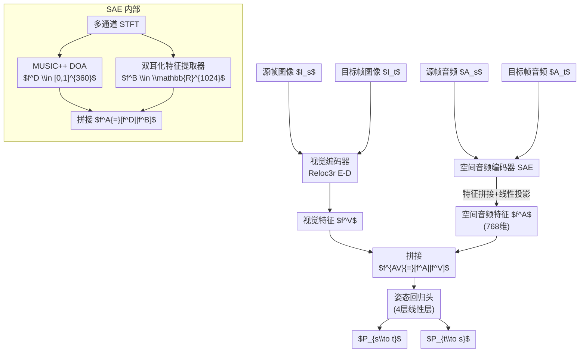

# Audio-Visual Camera Pose Estimation with Passive Scene Sounds and In-the-Wild Video

**会议**: ECCV 2026  
**arXiv**: [2512.12165](https://arxiv.org/abs/2512.12165)  
**代码**: 无  
**领域**: 3D视觉  
**关键词**: 被动场景声音, 相机位姿估计, 空间音频, 多模态融合, 到达方向(DOA)  

## 一句话总结

本文提出首个利用被动场景音频辅助视觉进行相对相机位姿估计的方法，通过到达方向谱与双耳化嵌入组成的空间音频编码器（SAE）与SOTA视觉位姿估计模型Reloc3r进行晚期融合，在真实场景与仿真数据集上均取得显著提升。

## 研究背景与动机

相对相机位姿估计是具身感知与三维场景理解的核心问题。基于视觉的方法（如SuperGlue、LoFTR、DUSt3R、Reloc3r）在过去几年取得了长足进步，但这些方法在视觉退化场景——运动模糊、低光照、遮挡、纹理缺失——中仍会大幅失效。现实世界中，穿戴式相机记录的视频（如昏暗的音乐会现场、快速运动的球赛）恰恰频繁出现这类退化，单纯依赖视觉信号难以稳定恢复相机运动。另一方面，此前尝试用音频辅助空间定位的工作要么依赖主动声呐（如BatVision的仿生回声定位），要么完全在仿真环境中做声源定位和导航，从未有人在真实非受控视频中利用"场景中原本就有的声音"来帮助恢复相机的六自由度相对位姿。

声音天然具有不受光照和遮挡影响的几何属性。当相机在场景中移动时，多通道麦克风捕获的音频信号在空间属性上会发生可预测的变化——声源的方向分布随相机朝向转动，左右声道差异随相机平移改变，甚至混响模式也随位置变化。这些空间音频线索是"免费的"：消费级设备（GoPro、Insta360 GO、RayBan Meta眼镜、Aria研究眼镜）已广泛配备双声道乃至七声道麦克风，每段视频天然附带多通道音频流。问题在于如何从原始音频中提取与相机运动相关的可学习空间特征，并将它们与视觉特征有效融合——不能让无信息的音频拖累视觉强项，又要在视觉退化时让音频补上位。

本文的切入角度是构建一个双通路的空间音频编码器：一条通路用解析式的MUSIC++算法直接计算声源到达方向（DOA）谱，显式捕捉主导声源的方位分布；另一条通路通过新颖视角声学合成（NVAS）预训练任务让模型"学会"双耳化嵌入，隐式编码完整声场的空间结构。两条通路的特征拼接后与Reloc3r的视觉特征做晚期融合。**核心 idea：利用解析式DOA谱与学得双耳化嵌入互补的空间音频编码器，通过晚期融合接入SOTA视觉位姿估计骨干，在不干扰强视觉信号的前提下让被动场景声音为相机位姿估计提供稳健的几何线索，尤其弥补视觉退化时的性能损失。**

## 方法详解

### 整体框架

本文方法由两个核心模块构成：空间音频编码器（Spatial Audio Encoder, SAE）和音视频相对位姿预测器。给定一对源帧和目标帧的RGB图像 $(I_s,I_t)$ 及其同步多通道音频片段 $(A_s,A_t)$，SAE从音频中提取空间特征，与Reloc3r解码器输出的视觉特征在特征层拼接后送入姿态回归头，预测双向的相对6-DoF位姿 $P_{s\to t}$ 和 $P_{t\to s}$。

### 关键设计

**1. 双通路空间音频编码：解析式DOA谱显式编码声源方位，双耳化嵌入隐式建模完整声场**

音频信号本身不会直接告诉模型相机在往哪个方向移动，因此特征提取的方式至关重要。本文的SAE从多通道音频的STFT频谱图 $S_j \in \mathbb{R}^{C\times F\times W}$ 出发，并行计算两种互补的表示。

第一条通路是方向到达（DOA）谱。使用MUSIC++算法（带频率归一化的MUSIC）从多通道频谱中解析地计算出一个360维向量 $f^D \in [0,1]^{360}$，每个元素对应方位角上 $1^\circ$ 扇区内的平均音频能量。DOA谱直观地展示了场景中主要声源相对于麦克风的方位分布——当相机旋转时，峰值位置会相应平移，为旋转估计提供了直接的几何约束。这条通路完全解析、无需学习参数，且对多声源场景同样有效。第二条通路是学得的双耳化嵌入 $f^B \in \mathbb{R}^{1024}$，来自一个在Ego-Exo4D大规模数据上预训练的NVAS模型编码器。不同于DOA谱只捕捉主导声源的方位，双耳化嵌入隐式编码了整个声场的空间结构——混响模式、多个重叠声源的空间排布、环境噪声的分布——这些信息在均匀环境或大量重叠声源时尤为珍贵。两条通路互补的直觉是：DOA谱擅长对离散主导声源定向，但遇到均匀扩散噪声或大量声音重叠时就变得平坦无信息；双耳化嵌入能感知整体声场的细腻纹理，却不擅长指向单个声源。将两者拼接为 $f^A = [f^D || f^B]$ 再通过线性层投影到768维，获得兼具"准确定向"和"整体建模"能力的空间音频表示。

**2. 新颖视角声学合成（NVAS）预训练：以"声音视角变换"任务迫使编码器学习空间几何**

双耳化嵌入的质量取决于预训练任务的设计。本文提出新颖视角声学合成（Novel View Acoustic Synthesis, NVAS）任务：给定源视角的双耳音频和目标视角的单声道音频，模型需要合出目标视角的双耳音频。这个任务的关键在于——要准确预测"声音从源麦克风位置移到目标麦克风位置后听起来会怎样"，编码器必须从输入音频中提取与麦克风空间位置密切相关的隐含几何线索。

训练时，模型预测目标音频左右声道的频谱差而非完整的左右声道频谱：

$$
\mathcal{L}^{B} = \|\tilde{S}^{\Delta}_{\mathcal{T}} - S^{\Delta}_{\mathcal{T}}\|_1, \quad S^{\Delta}_{\mathcal{T}} = \text{STFT}(A^{l}_{\mathcal{T}} - A^{r}_{\mathcal{T}})
$$

仅预测差值的策略大幅降低了输出空间的维度，加速训练，同时迫使模型专注于编码左右声道差异所携带的空间信息。预训练完成后，编码器权重被冻结用作特征提取器，不再参与位姿估计的联合训练。这种"先学空间音频表征、再学位姿回归"的两阶段策略既保证了嵌入的通用性，也降低了端到端训练的计算开销。

**3. 晚期融合：保护视觉，让音频只在需要时发挥作用**

多模态融合的关键矛盾在于：音频有时极有价值（视觉退化时），有时毫无作用（静音场景）。本文采用极简的晚期融合策略——直接将SAE的空间音频特征与Reloc3r解码器输出的视觉特征在特征层拼接后送入姿态回归头。具体而言，视觉特征和音频特征各自通过独立的线性层投影到768维，然后拼接为 $f^{AV} = [f^A || f^V]$。

这一设计背后的核心动机是"保护视觉"：在融合发生之前，视觉特征提取已经完成，不受到音频信号的影响。当音频信息量低（如环境完全静音）或与相机运动无关时，回归头可以自适应地降低音频维度的权重，不会干扰已经很强的视觉特征。实验验证了这一设计的有效性——在视觉质量良好的场景下，加入音频后性能不仅没有下降，事实上仍有微小提升（95%的情况下优于纯视觉基线）；而在视觉退化时，音频的几何线索能有效补位，总位姿AUC@5的相对提升从正常条件下的42%跃升至退化条件下的67%。相比交叉注意力等特征级交互的融合方案，晚期融合更简洁、训练更稳定、在实际部署中也对模态缺失（如一段视频没有声音）更鲁棒。

### 损失函数 / 训练策略

位姿预测损失采用Reloc3r的设计，包含旋转和翻译两个分量，对源→目标和目标→源两个方向取平均：

$$
\mathcal{L}^{P} = L^{P}_{s \to t} + L^{P}_{t \to s}
$$

训练超参：100轮（含5轮线性warmup），初始学习率 $10^{-5}$，余弦退火至 $10^{-7}$，batch size 64。视觉分支使用Reloc3r-512版本：输入图像256×256，24层编码器+12层解码器。音频参数：采样率48kHz，片段长1000ms，STFT FFT bin数1024，频谱图大小512×96。训练使用8块NVIDIA A40 GPU（48GB VRAM）。

## 实验关键数据

### 主实验（Ego-Exo4D验证集）

| 指标 | 方法 | AUC@5 | AUC@10 | AUC@20 |
|------|------|-------|--------|--------|
| 旋转 | Vision Only (Reloc3r) | 37.35 | 53.62 | 68.98 |
| 旋转 | **本文 Ours** | **38.54** | **54.49** | **69.61** |
| 平移 | Vision Only (Reloc3r) | 0.73 | 2.63 | 7.77 |
| 平移 | **本文 Ours** | **1.03** | **3.36** | **9.34** |
| 总位姿 | Vision Only (Reloc3r) | 0.57 | 2.33 | 7.33 |
| 总位姿 | Reloc3r-AV Cross-Att | 0.76 | 2.83 | 8.34 |
| 总位姿 | **本文 Ours** | **0.81** | **2.99** | **8.82** |
| 总位姿 | 相对提升 vs Vision Only | **+42.1%** | **+28.3%** | **+20.3%** |

### 视觉退化场景下的鲁棒性（Ego-Exo4D）

| 方法 | AUC@5 | AUC@10 | AUC@20 |
|------|-------|--------|--------|
| Vision Only (退化) | 0.21 | 1.00 | 3.66 |
| Reloc3r-AV (退化) | 0.29 | 1.27 | 4.36 |
| **本文 Ours (退化)** | **0.35** | **1.44** | **4.80** |
| 相对提升 vs Vision Only | **+66.7%** | **+44.0%** | **+31.2%** |

### HM3D-SS 仿真数据集

| 方法 | 旋转MAE (°) 原始 | 旋转MAE (°) 退化 |
|------|------------------|-------------------|
| SLfM [slfm] | 0.77 | — |
| Vision Only (Reloc3r) | 0.09 | 3.83 |
| **本文 Ours** | **0.06** | **2.46** |
| 相对提升 vs Vision Only | **+33.3%** | **+35.8%** |

### 消融实验（Ego-Exo4D 总位姿 AUC）

| 配置 | AUC@5 | AUC@10 | AUC@20 | 说明 |
|------|-------|--------|--------|------|
| Ours (Full) | **0.81** | **2.99** | **8.82** | 完整模型 |
| w/o DOA | 0.75 | 2.86 | 8.41 | 去掉DOA谱 |
| w/o Binaural | 0.74 | 2.80 | 8.34 | 去掉双耳化嵌入 |
| Monaural替代 | 0.74 | 2.82 | 8.37 | 单声道替代双耳化 |
| Vision Only | 0.57 | 2.33 | 7.33 | 基线 |

### 关键发现
- **平移估计的提升远大于旋转**：总位姿AUC@5的相对提升达+42.1%（平移+41.1% vs 旋转+3.2%），说明音频的空间线索对"相机位移了多少"提供了远比旋转更直接的几何约束——DOA谱的平移敏感性和双耳化嵌入的声场间距线索都直接与位移量正相关。
- **双周特征互补而非冗余**：单独去掉DOA或双耳化嵌入均导致AUC@5下降0.06-0.07，说明两者各自贡献了不可替代的信息。DOA在旋转估计上更强（去掉DOA后旋转AUC下降明显），双耳化在平移和复杂声场中更有用。
- **视觉退化时音频补位效应放大**：AUC@5相对提升从42%跃升至67%，验证了"音频在视觉不行时主动补位"的晚期融合设计初衷。即使在最严重的退化条件下（高斯模糊$\sigma=8$），本文方法总位姿AUC@20=3.47仍高于纯视觉的2.63。
- **音频的几何信号非语义相关性**：负控制实验（同步音→1-5s偏移→同场景混洗→跨场景替换直线下降）中性能逐步劣化至低于视觉基线（AUC@5从0.81降至0.50 < Vision Only的0.57），说明模型依赖的是音频与运动的几何一致性而非数据集相关的语义模式。
- **音频特性分析**：多声源、远场+近场混合的场景（足球84.6%、音乐81.4%）中音频帮助最大；单一主导声源或静音场景中帮助有限但不下拖。

## 亮点与洞察

- **"被动音频"为位姿估计开辟了新范式**：此前相关工作要么用主动声呐，要么在仿真中做声源定位——本文是第一个在真实非受控视频中证明被动场景声音能帮助恢复相机6-DoF位姿的工作。这种"利用附带信号辅助空间感知"的思路可推广到其他多模态感知任务。
- **解析+学习的双通路设计是极致高效的实用方案**：DOA使用解析MUSIC++算法、几乎无参；双耳化嵌入一次预训练后可冻结复用。两条通路的输出维度仅1384（360+1024），经过一次线性投影后就与视觉特征拼接，参数量极小。相比纯端到端的多模态Transformer，这种混合架构在效率和数据效率上都有优势。
- **晚期融合的"保护视觉"哲学值得推广**：在多模态系统中，最怕"强模态被弱模态带偏"。本文的策略是让各模态独立完成提取、最后才拼接，回归头自然学会各模态的贡献权重。设计简单、训练稳定、对模态缺失鲁棒，是实际部署中比交叉注意力等复杂交互方案更务实的选择。
- **负控制实验是论证几何信号的金标准**：通过四档破坏条件（同步/时间偏移/场景内混洗/跨场景替换）刻画出性能的平滑下降曲线，有力地反驳了"模型只是在学场景语义关联"的潜在质疑——这种论证方式值得所有多模态方法引用。

## 局限与展望

- **平移估计绝对值仍较低**：AUC@5=0.81，说明在大多数测试样本中预测位姿误差超过5度阈值。作者指出长距离位移或复杂声学场景中平移恢复仍然是瓶颈。
- **对突发性主导声源敏感**：当两帧之间突然出现或消失一个强声源（如音乐家在第二帧才开始演奏），模型可能被音频信号误导。这是当前被动音频方案的固有弱点——音频"说了谎"而模型无法判断。
- **需要多通道麦克风硬件支持**：方法要求至少双声道音频才能提取空间特征。单声道设备上的Monaural消融实验显示性能退化到接近视觉基线。不过实时双耳上混（mono-to-binaural）技术的发展可能缓解这一限制。
- **未验证跨设备/跨数据集泛化**：训练和测试均使用Aria眼镜（7麦）的音频配置，模型能否泛化到其他麦克风阵列（如GoPro 2麦）未经实验验证。
- 改进方向：引入音频质量估计门控模块，根据DOA谱的尖锐程度或双耳化嵌入的置信度动态调整融合权重；结合IMU信号（补充实验已证明音频和IMU互补）；考虑更长的音频上下文窗口来捕捉持续的声场演变。

## 相关工作与启发

- **vs SLfM [slfm]**: SLfM联合学习声源定位与相机运动估计，但完全在仿真环境中训练和测试，且需要DOA真值监督。本文在真实视频（Ego-Exo4D）上验证，无需DOA标注，并使用NVAS预训练替代了SLfM的联合训练范式。
- **vs Reloc3r [reloc3r]**: Reloc3r是纯视觉SOTA位姿估计模型，本文以其为骨干加入音频分支。正常视觉下稍优，退化条件下大幅领先（AUC@5从0.21提升到0.35，+67%）。
- **vs DUSt3R / MonST3R**: 这些端到端Transformer密集对应方法不涉及音频模态，与本文正交。有意思的是，本文的晚期融合设计完全兼容替换视觉骨干——将Reloc3r换成DUSt3R做视觉特征提取应该同样有效。
- **vs Audio-Visual 自监督学习（L3-Net, AV-MAE等）**: 以往的自监督音视频方法关注语义层面的跨模态对齐或事件分类，本文将音频用于几何空间推理，任务性质和特征需求完全不同。

## 评分

- **新颖性**: ⭐⭐⭐⭐⭐ 首次将被动场景声音引入真实视频相对位姿估计，开辟"附带多模态信号辅助空间感知"的新问题定义和解决方案。
- **实验充分度**: ⭐⭐⭐⭐⭐ 横跨真实和仿真两个数据集（含视觉退化版本），消融设计完整（DOA/双耳化/Monaural/交叉注意力对比），负控制实验非常有说服力，音频特性分析深入（8类场景定性+定量）。
- **写作质量**: ⭐⭐⭐⭐⭐ 动机从具体场景（昏暗音乐会）切入极具感染力，方法叙述清晰且层级分明，大量分析实验（Tab.4不同声学条件下的性能分解）让读者深入理解"什么条件下音频有用、为什么有用"。
- **价值**: ⭐⭐⭐⭐⭐ 将"廉价附带信号→空间几何推理"的实用方向拉入真实场景，对AR/VR眼镜、具身智能硬件等天然配备多通道麦克风的设备具有直接的应用启发。虽平移估计精度未达到实用门槛，但问题定义和解决方案的启发性极强。

<!-- RELATED:START -->

## 相关论文

- [\[ECCV 2026\] Towards in-the-wild Egocentric 3D Hand-Object Pose Estimation](towards_in-the-wild_egocentric_3d_hand-object_pose_estimation.md)
- [\[CVPR 2026\] SonoWorld: From One Image to a 3D Audio-Visual Scene](../../CVPR2026/3d_vision/sonoworld_from_one_image_to_a_3d_audio-visual_scene.md)
- [\[CVPR 2026\] WildPose: A Unified Framework for Robust Pose Estimation in the Wild](../../CVPR2026/3d_vision/wildpose_a_unified_framework_for_robust_pose_estimation_in_the_wild.md)
- [\[CVPR 2026\] ORBIT: Benchmarking SfM in the Wild with 360° Video](../../CVPR2026/3d_vision/orbit_benchmarking_sfm_in_the_wild_with_360deg_video.md)
- [\[CVPR 2025\] Extreme Rotation Estimation in the Wild](../../CVPR2025/3d_vision/extreme_rotation_estimation_in_the_wild.md)

<!-- RELATED:END -->
