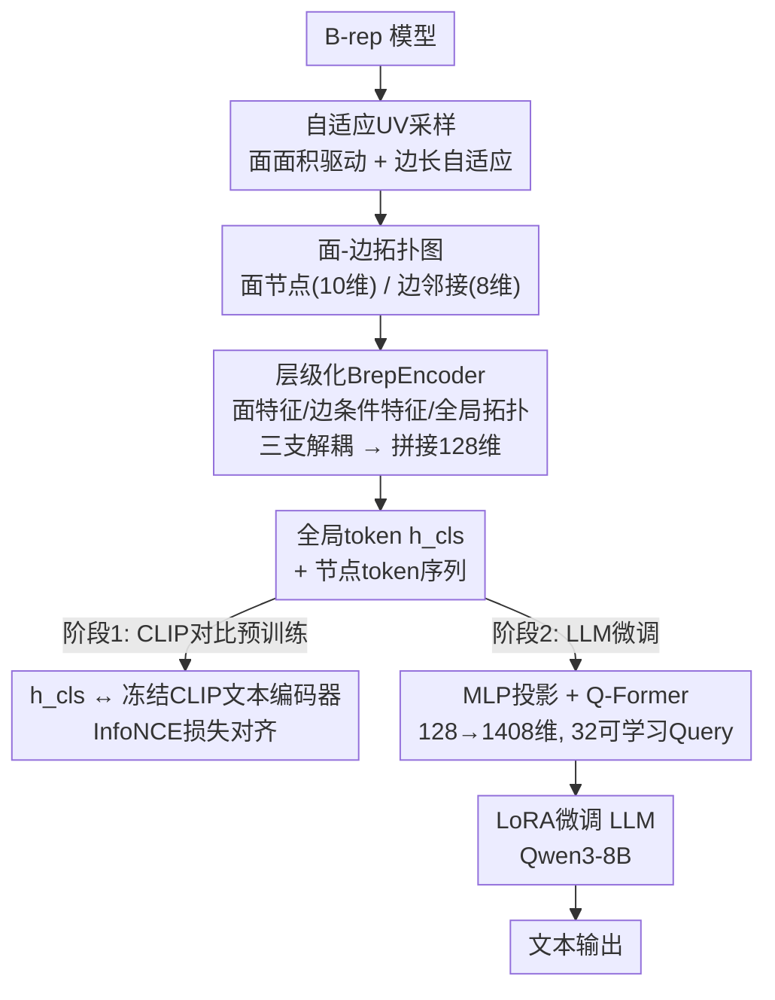

# BrepLLM: Enabling Large Language Models to Understand Boundary Representations

**会议**: ECCV 2026  
**arXiv**: [2512.16413](https://arxiv.org/abs/2512.16413)  
**项目页**: [https://user-deng.github.io/BrepLLM/](https://user-deng.github.io/BrepLLM/)  
**代码**: 无  
**领域**: 3D视觉 / 多模态VLM  
**关键词**: B-rep, CAD理解, 大语言模型, 跨模态对齐, 3D视觉

## 一句话总结
BrepLLM 是首个让大语言模型直接解析和推理原生 B-rep（边界表示）CAD 模型的框架：通过自适应 UV 采样将 B-rep 转为面-边拓扑图，用层级化 BrepEncoder 提取面/边/拓扑三支解耦特征，再经 CLIP 对比预训练和两阶段渐进式 LLM 微调，最终在 3D 物体描述和分类任务上全面超越基于点云和图像的基线模型。

## 研究背景与动机
CAD 是制造业、航空航天和建筑等领域不可或缺的工具，而 B-rep（Boundary Representation）是工业 CAD 的主流数据格式——它精确编码参数化曲面、水密拓扑和显式拓扑邻接关系，信息密度远高于点云或三角网格。让 LLM 直接理解原生 B-rep 模型，对工业设计和智能制造有重大价值。

然而，现有 LLM 与 CAD 的结合走的是「过程式代理」路线：将 CAD 模型转化为命令序列、草图操作序列或程序代码，再由 CAD 内核执行。例如 CAD-MLLM 生成 CAD 命令序列，CadVLM 和 CAD-LLM 生成草图序列，cadrille 和 CAD-Coder 用 LLM 生成 CAD 程序。这些方法操作的是建模过程而非 B-rep 实体（面/边/拓扑），因此无法进行真正的几何或拓扑推理。更深层的问题是：建序数据极其稀缺（DeepCAD 数据集规模仅为 ABC 数据集的五分之一），而原生 B-rep 模型作为工业标准格式，数量充足且易于大规模获取。

**核心 idea**：将 B-rep 模型的面/边/拓扑信息解耦为层级化图 token 序列，通过「跨模态对比预训练 + 两阶段渐进微调」让 LLM 直接「看懂」原生 CAD 几何——无需中间格式转换，也无需依赖稀缺的建模历史数据。

## 方法详解

### 整体框架
BrepLLM 要解决的核心问题是：B-rep 包含复杂几何（参数化曲面上的坐标/法向量/曲率）和拓扑（面-边-面的邻接关系）信息，而 LLM 的输入是 token 序列——两者之间存在巨大的模态鸿沟。BrepLLM 的做法是分两大阶段架桥：先不碰 LLM，用对比学习把 B-rep 的整体表征和文本嵌入对齐到一个共享语义空间；再将预训练好的几何编码器接入 LLM，分两步渐进式地把 B-rep 的细粒度节点 token 映射进 LLM 的语义空间。

第一阶段「跨模态对齐预训练」：对原始 B-rep 做自适应 UV 采样，把连续曲面离散化为面-边拓扑图（面的采样点组成节点特征，面的邻接关系为边）；层级化 BrepEncoder 从图中提取全局 token $h_{\text{cls}}$ 和各面节点 token 序列 $[h_1, \dots, h_n]$；用 CLIP 式的对称对比损失（InfoNCE），将 $h_{\text{cls}}$ 经投影层后与冻结的 CLIP 文本编码器（ViT-L/14）产生的文本嵌入对齐。

第二阶段「两阶段 LLM 微调」：冻结 BrepEncoder，将节点 token 序列经两层 MLP 投影（128 维到 1408 维）送入预训练的 Q-Former（32 个可学习 query），Q-Former 输出的固定长度 token 再线性映射进 LLM 隐空间。Stage I 只训练 MLP 投影头，利用 2D-VLM 的对齐先验建立几何到视觉语义空间的初始桥接；Stage II 用 LoRA 联合微调 Q-Former 关键子层和 LLM 的部分参数，让模型最终掌握「从 B-rep 结构到自然语言」的生成能力。

### 关键设计

**1. 自适应 UV 采样与图表示构建：让连续 B-rep 变成神经网络能吃的离散图**

B-rep 的几何信息定义在连续参数域上——每个面是一个 NURBS/解析曲面，每条边是一条参数曲线，无法直接输入神经网络。直观做法是均匀采样，但会浪费计算：小面过采样，大面欠采样。本文提出面积驱动的自适应 UV 采样来解决这个矛盾。

对面 $\mathcal{S}$，参数域 $\Omega_{\mathcal{S}} = [u_{\min}, u_{\max}] \times [v_{\min}, v_{\max}]$ 内的采样点数 $N_{\mathcal{S}}$ 由面积线性插值决定：

$$N_{\mathcal{S}} = N_{\min}^{\text{face}} + \frac{A_{\mathcal{S}} - A_{\min}}{A_{\max} - A_{\min}} \cdot (N_{\max}^{\text{face}} - N_{\min}^{\text{face}})$$

其中 $A_{\min}/A_{\max}$ 为模型中面面积的最小/最大值。每个采样点 $(u_k, v_l)$ 提取 10 维特征：3D 坐标 $\mathbf{P} \in \mathbb{R}^3$、单位法向量 $\mathbf{n} \in \mathbb{S}^2$、平均曲率 $H$、可见性掩码 $\mathbf{V} \in \{0,1\}$、面类型 $\mathbf{t}$ 和归一化面积 $a = A_{\mathcal{S}}/A_{\max}$。

对边 $\mathcal{C}$，采样点数 $M_{\mathcal{C}}$ 由边长线性插值，每个采样点提取 8 维特征：3D 坐标 $\mathbf{Q}$、单位切向量 $\boldsymbol{\tau}$、边类型 $\mathbf{c}$ 和归一化长度 $b$。面采样数和边采样数均限制在 $[32, 64]$ 范围内，在几何精度和计算开销之间取得平衡。

以面为节点、面的邻接关系为边，构建成一个拓扑图。这样 B-rep 被转化为一张每个节点携带 10 维几何特征、每条边携带 8 维边界特征的异质图，为后续层级化编码提供了结构化输入。

**2. 层级化 BrepEncoder：面/边/拓扑三支解耦的图编码器**

B-rep 的信息天然具有层级结构：面内部有精细的局部几何（坐标、法向量、曲率），面与面之间有边界邻接关系，模型整体有全局拓扑。单一扁平的编码器无法同时捕捉这三个粒度的信息。本文设计的 BrepEncoder 用三个并行的特征提取分支对应这三个层级，最后拼接成统一的节点表示。

**面特征 $F_f$**（最细粒度）：将每个面内部的所有 UV 采样点属性（10 维）送入 PointTransformerV3，通过自注意力在采样点之间传播信息，输出 32 维特征向量 $F_f \in \mathbb{R}^{32}$，捕捉面内局部几何细节。

**边条件特征 $F_e$**（边粒度）：设计 Edge Encoder 将每条边的 5 个属性（坐标、切向量、边类型、归一化长度）编码为边级几何特征。该特征作为 NNConv 层的卷积核，在面-面消息传递中以边的几何信息为条件，让邻接面对中心面的影响取决于共享边界的形状。输出 32 维 $F_e \in \mathbb{R}^{32}$。

**全局拓扑特征 $F_t$**（最粗粒度）：先对面和边的 3D 坐标分别用 2D CNN 和 1D CNN 编码，再送入两层 EGATConv（边条件图注意力卷积）。通过多头注意力在整张图上多跳传播，全局拓扑信息逐步汇聚到每个面节点，输出 64 维 $F_t \in \mathbb{R}^{64}$。

三个分支的输出按维度拼接为每个面节点 $i$ 的最终表示：

$$h_i = [F_t^{(i)} \| F_e^{(i)} \| F_f^{(i)}] \in \mathbb{R}^{128}$$

BrepEncoder 最终输出两个东西——全局图特征 $h_{\text{cls}}$（通过对所有节点做全局注意力池化得到，用于 CLIP 对比预训练）和节点 token 序列 $[h_1, \dots, h_n]$（用于 LLM 微调）。这种「一个编码器，两种输出粒度」的设计避免了单独训练全局和局部编码器的开销。

对于跨模态对比预训练，$h_{\text{cls}}$ 经投影层映射到文本嵌入维度 $D$，得到 $\mathbf{z}_{\text{brep}}$；文本描述经冻结的 CLIP 文本编码器得到 $\mathbf{z}_{\text{text}}$。在 batch 内使用对称 InfoNCE 损失：

$$\mathcal{L}_{\text{CLIP}} = -\frac{1}{2N}\sum_{i=1}^{N}\left(\log P_{ii} + \log Q_{ii}\right)$$

其中 $P_{ij} = \frac{\exp(S_{ij}/\tau)}{\sum_{k} \exp(S_{ik}/\tau)}$，$Q_{ij} = \frac{\exp(S_{ij}/\tau)}{\sum_{k} \exp(S_{kj}/\tau)}$，$S_{ij} = \hat{\mathbf{z}}_{\text{brep},i} \cdot \hat{\mathbf{z}}_{\text{text},j}$ 为 L2 归一化后的余弦相似度，$\tau$ 为可学习温度。该阶段只训练 BrepEncoder 和投影层，CLIP 文本编码器全部冻结——避免了昂贵的大规模文本模型训练，同时将几何表征拉入语言模型「能读懂」的语义邻域。

**3. 两阶段渐进式 LLM 微调：先借 2D-VLM 的先验搭桥，再精调 3D-语言对齐**

直接把 BrepEncoder 的 128 维几何 token 塞进 LLM 训练，会因为模态差异过大导致训练不稳定甚至不收敛。本文的两阶段策略用了一个巧妙的中间人——预训练好的 Q-Former（来自 BLIP-2 / TinyGPT-V）和其背后的 2D-VLM 对齐先验。

Stage I（几何到视觉桥接）：冻结 BrepEncoder、Q-Former 和 LLM，只训练一个两层 MLP 投影头（128 维 → 1408 维）。投影后的几何 token 序列作为 Q-Former 的 value 输入，Q-Former 用 32 个可学习 query 向量通过交叉注意力将变长序列压缩为 32 个固定长度的 token。这些 token 线性映射进 LLM 隐空间，用自回归交叉熵损失训练。这一阶段的精妙之处在于：Q-Former 预训练时已经在 2D 图像-文本数据上学会了「视觉 token 到语言空间」的映射，现在只是把输入从「图像 patch 特征」换成「B-rep 几何特征」——本质上是在利用 2D-VLM 的对齐先验给 3D 几何特征找一个「最接近的已知语义锚点」，大幅降低了从头对齐的难度。

Stage II（3D-语言对齐精调）：在 Stage I 的基础上，用 LoRA 联合微调 Q-Former 的关键子层和 LLM 的小部分参数（BrepEncoder 保持冻结）。学习率更小（$5 \times 10^{-6}$），让模型在已有语义桥接的基础上渐进式地吸收 B-rep 特有的几何和拓扑模式，最终学会用自然语言精确描述 CAD 模型的结构和建模步骤。

### 损失函数 / 训练策略
第一阶段（跨模态对齐预训练）：使用对称 InfoNCE 对比损失（公式见关键设计 2），AdamW 优化器，初始学习率 $1 \times 10^{-4}$，weight decay 0.01，前 5 个 epoch 线性 warmup 后余弦退火，batch size 256，训练 200 个 epoch，混合精度训练 + 梯度裁剪。

第二阶段（LLM 微调）：weight decay 0.05。Stage I 学习率 $3 \times 10^{-5}$，训练 1 个 epoch（70000 iterations，前 7000 warmup）；Stage II 学习率 $5 \times 10^{-6}$，训练 3 个 epoch（每 epoch 50000 iterations，5000 warmup）。LLM 骨干使用 Qwen3-8B，Q-Former 和投影头初始化自 TinyGPT-V 预训练权重。所有实验在 4 张 80GB A800 GPU 上完成。

此外，本文构建了 Brep2Text 数据集——基于 Text2CAD 语料的 134,722 个 B-rep 模型，用 Qwen-Max 为每个模型的「抽象级」（是什么）和「入门级」（怎么做）描述自动生成对应问题，共产生 269,444 个高质量 QA 对。200 个模型被严格保留为测试集。

## 实验关键数据

### 主实验
**3D 物体描述**（Table 1）：BrepLLM 在所有评估维度上全面超越基线。Qwen3-30B 评分为 61.36（比最强基线 MiniGPT-3D 高 4.78 分），Sentence-BERT 和 SimCSE 相似度分别达 75.42 和 77.23（分别提升 3.78 和 4.10）。人类评估中精确率达 83.62，幻觉率最低（0.83）。值得注意的是，8.4B 参数的 BrepLLM 在全部指标上超过了 13B 的 PointLLM 和 ShapeLLM。

| 模型 | LLM参数量 | Qwen3-30B | Sentence-BERT | SimCSE | 正确属性数 | 幻觉数↓ | 精确率 |
|------|----------|-----------|---------------|--------|-----------|--------|-------|
| LLaVA-13B | 13B | 36.73 | 45.67 | 47.16 | 2.16 | 1.58 | 63.15 |
| Qwen3-VL-8B | 8B | 55.48 | 67.65 | 68.85 | 3.97 | 0.86 | 78.76 |
| PointLLM-7B | 7B | 46.81 | 65.72 | 66.05 | 3.32 | 1.13 | 74.60 |
| PointLLM-13B | 13B | 49.65 | 66.78 | 67.32 | 3.46 | 1.28 | 72.99 |
| ShapeLLM-7B | 7B | 48.32 | 67.14 | 68.77 | 3.79 | 0.96 | 79.78 |
| ShapeLLM-13B | 13B | 51.36 | 68.36 | 70.12 | 3.74 | 1.35 | 73.47 |
| MiniGPT-3D | 2.7B | 56.58 | 71.64 | 73.13 | 4.01 | 1.04 | 79.40 |
| **BrepLLM** | **8.4B** | **61.36** | **75.42** | **77.23** | **4.63** | **0.83** | **83.62** |

**3D 物体分类**（Table 2）：使用两种 prompt（指令型 "What is this?" 和填空型 "This is an object of..."）评估开放式生成分类能力。BrepLLM 平均准确率 60.0%，比最强基线 MiniGPT-3D 高 3.75 个百分点，且在两种 prompt 格式下表现高度一致（仅差 1.0 个百分点），说明模型对 prompt 变化鲁棒。

| 模型 | LLM参数量 | 输入模态 | I (%) | C (%) | 平均 |
|------|----------|---------|-------|-------|------|
| LLaVA-13B | 13B | 单视图图像 | 46.5 | 44.5 | 45.5 |
| Qwen3-VL-8B | 8B | 三视图图像 | 54.0 | 55.0 | 54.5 |
| PointLLM-7B | 7B | 3D点云 | 52.5 | 51.0 | 51.75 |
| PointLLM-13B | 13B | 3D点云 | 53.0 | 51.5 | 52.25 |
| ShapeLLM-7B | 7B | 3D点云 | 53.5 | 52.5 | 53.0 |
| ShapeLLM-13B | 13B | 3D点云 | 54.5 | 53.0 | 53.75 |
| MiniGPT-3D | 2.7B | 3D点云 | 56.0 | 56.5 | 56.25 |
| **BrepLLM** | **8.4B** | **B-rep** | **60.5** | **59.5** | **60.0** |

### 消融实验

| 消融项 | 配置 | Stage I (%) | Stage I+II (%) | Δ (I+II) |
|--------|------|-------------|----------------|----------|
| Full model | 完整配置 | 43.83 | 61.36 | — |
| 自适应UV采样 | 去掉自适应，换均匀采样 | 40.59 | 59.21 | -2.15 |
| 层级化BrepEncoder | 去掉层级化，换扁平编码 | 39.64 | 57.39 | -3.97 |
| 训练策略 | 仅Stage I（不上LLM微调） | 43.83 | — | — |
| 训练策略 | 仅Stage II（跳过Stage I） | — | 59.12 | -2.24 |

### 关键发现
- **层级化 BrepEncoder 贡献最大**：去掉后 Stage I+II 掉点 3.97%，说明面/边/拓扑三层解耦表示是捕获 B-rep 多粒度几何信息的关键，单一扁平编码器丢失了大量拓扑结构。
- **自适应 UV 采样主要在早期起作用**：Stage I 提升 3.24%，Stage I+II 仍有 2.15% 的稳定贡献——它在模型早期对精细几何结构的感知至关重要，即使语义理解能力随训练增强后仍不可替代。
- **两阶段渐进训练缺一不可**：跳过 Stage I 直接做 Stage II 会掉 2.24%，说明 2D-VLM 的对齐先验为后续 3D-语言对齐提供了必要的语义锚点。仅做 Stage I（43.83%）远不够，3D-语言对齐是性能的主要驱动力。
- **B-rep 原生理解 > 点云/图像代理**：同参数量级下，BrepLLM 显著优于所有基于点云和图像的基线，验证了直接操作 B-rep 实体（面/边/拓扑）比将 CAD 降维为点云或渲染图做代理推理更有效。
- **定性结果**：面对复杂几何体，BrepLLM 能准确识别斜切侧边、内部三角镂空、圆角矩形底座及两端大小圆柱的空间组成等细粒度细节，而基线模型的描述相对模糊或遗漏关键几何特征。

## 亮点与洞察
- **「先对齐整体，再微调解码」的两段式跨模态桥接**：第一阶段用 CLIP 对比损失对齐整体 B-rep 表征和文本，第二阶段用 Q-Former 渐进式地对齐细粒度节点 token。这种「全局锚定 + 局部注入」的策略避免了直接端到端训练几何编码器和 LLM 时模态鸿沟过大导致的训练崩溃，可复用至其他非自然语言模态（如分子图、电路图）与 LLM 的对齐任务。
- **借 2D-VLM 的「船」渡 3D 几何的「海」**：Stage I 冻结 Q-Former 只训练 MLP 投影，本质上是在复用 Q-Former 在大规模图文数据上学会的「视觉 token → 语言」映射能力，把 B-rep 特征当做一种「陌生的视觉 token」塞进去。这种「借预训练接口的先验」的思路比从头训练跨模态桥接层更稳定且收敛更快，在引入全新模态到 LLM 时是一种低成本高效策略。
- **面积/长度驱动的自适应采样是在「表达力 vs 计算量」之间的一种实用折中**：不像均匀采样那样浪费、也不像按曲率自适应那样复杂（需要计算二阶导），面积/长度插值计算代价几乎为零，却能让大面和小面都获得与其几何信息量匹配的采样密度。这个思路可直接迁移到其他需要将连续几何离散化的 3D 深度学习任务。

## 局限与展望
- **当前仅支持物体级 B-rep**，无法处理装配体（多零件 + 配合约束），而工业场景中装配体才是有实际推理价值的对象。作者未讨论如何将面-边图扩展到多零件图。
- **Brep2Text 数据集的描述由 Qwen-Max 自动生成**，质量受限于生成模型本身，可能存在语义漂移或与真实工程语义的偏差。缺乏人工标注的工程级 ground truth（如 GD&T 公差信息、材料属性、制造工艺约束等）。
- **下游任务覆盖较窄**：目前仅评估了描述和分类两个任务，未涉及 B-rep 编辑、特征识别（如识别倒角/圆角/筋板等制造特征）、B-rep 生成和设计意图推理等更具工程价值的任务。
- **计算资源门槛较高**：两阶段训练（200 epoch 预训练 + 4 epoch 微调）在 4 张 A800 上完成，对学术复现有一定门槛。

## 相关工作与启发
- **vs CAD-MLLM / CadVLM / CAD-LLM**：这些工作将 CAD 建模转化为命令序列或草图序列的生成问题，操作空间是过程式的而非 B-rep 实体本身。BrepLLM 的核心差异在于直接对 B-rep 的面/边/拓扑建模，不依赖稀缺的建模历史数据，且能进行真正的几何推理而非序列模式匹配。
- **vs PointLLM / ShapeLLM / MiniGPT-3D**：这些 3D MLLM 以点云为输入，不可避免地丢失了参数化曲面的连续性和拓扑约束。BrepLLM 证明直接操作 B-rep 能带来持续且显著的性能提升，说明点云作为 CAD 模型的代理表示存在信息瓶颈——对于需要精确几何理解的下游任务，原生 B-rep 是更好的选择。
- **vs BrepGen / SolidGen / AutoBrep**：这些工作聚焦于 B-rep 生成和重建，使用扩散模型或自回归模型。BrepLLM 的层级化编码器和跨模态对齐思路可以反向用于生成任务——例如将 BrepEncoder 作为 VAE 编码器，LLM 作为条件生成器的 backbone。
- **启发**：本文的核心方法论——「将结构化数据（B-rep）解耦为层级化 token 序列 + 借 2D 先验做渐进式对齐」——可以推广到其他结构化模态（程序依赖图、知识图谱、分子结构）与 LLM 的对接，降低全模态训练的标注和计算成本。

## 评分
- 新颖性: ⭐⭐⭐⭐ 首次让 LLM 直接理解 B-rep 而非通过代理格式，问题定义清晰且有实际工业价值；具体技术组件（自适应 UV 采样、层级化编码器、两阶段渐进对齐）并非颠覆性创新，但组合设计合理
- 实验充分度: ⭐⭐⭐⭐ 覆盖描述和分类两个任务，多个基线和评估协议（LLM 评判 + 传统指标 + 人类评估），消融实验覆盖三个核心组件和一个训练策略，定性对比详实；缺少更大规模 LLM（8B+ 变体）的 scaling 实验
- 写作质量: ⭐⭐⭐⭐ 整体清晰，方法部分图文对应好，附录数据生成流程和评估 prompt 透明可复现；部分公式排版有微小问题（LaTeX 转纯文本时丢失了一些下标/上标格式）
- 价值: ⭐⭐⭐⭐ 为工业 CAD 场景下 LLM 的应用开辟了新路径，Brep2Text 数据集可作为该方向的标准化 benchmark；层级化编码和渐进式对齐的策略对 3D MLLM 社区有方法论参考价值

<!-- RELATED:START -->

## 相关论文

- [\[ICLR 2026\] Do 3D Large Language Models Really Understand 3D Spatial Relationships?](../../ICLR2026/3d_vision/do_3d_large_language_models_really_understand_3d_spatial_relationships.md)
- [\[ECCV 2024\] PointLLM: Empowering Large Language Models to Understand Point Clouds](../../ECCV2024/3d_vision/pointllm_empowering_large_language_models_to_understand_point_clouds.md)
- [\[CVPR 2026\] Scalable Object Relation Encoding for Better 3D Spatial Reasoning in Large Language Models](../../CVPR2026/3d_vision/scalable_object_relation_encoding_for_better_3d_spatial_reasoning_in_large_langu.md)
- [\[ECCV 2026\] G2P: Gaussian-to-Point Attribute Alignment for Boundary-Aware 3D Segmentation](g2p_gaussian-to-point_attribute_alignment_for_boundary-aware_3d_segmentation.md)
- [\[ICCV 2025\] 3DGraphLLM: Combining Semantic Graphs and Large Language Models for 3D Scene Understanding](../../ICCV2025/3d_vision/3dgraphllm_combining_semantic_graphs_and_large_language_models_for_3d_scene_unde.md)

<!-- RELATED:END -->
