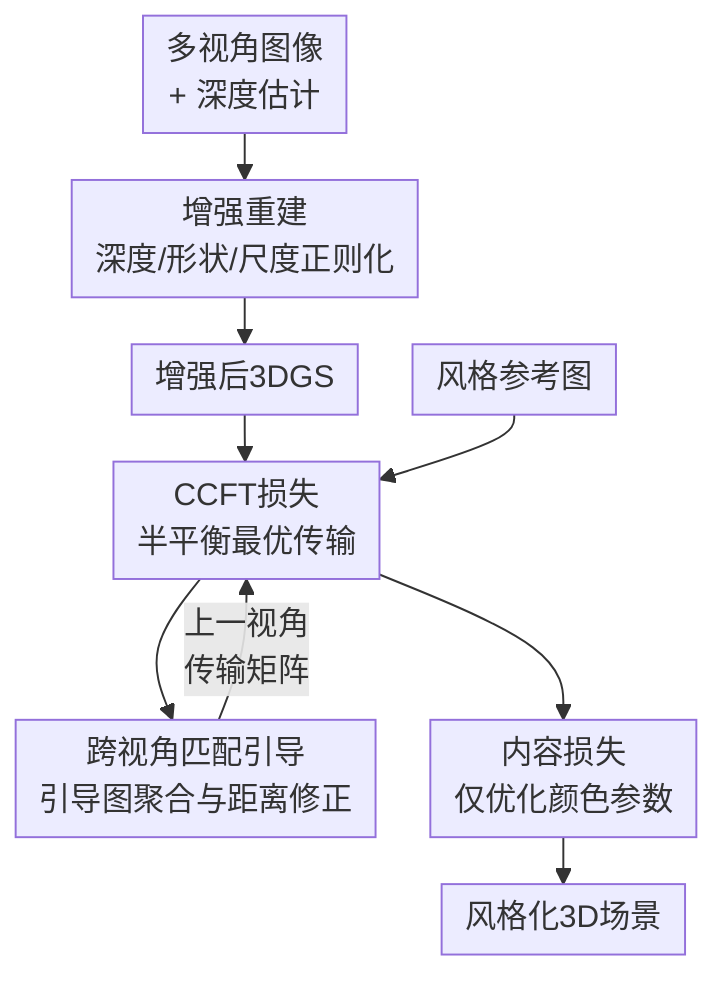

# Capacity-Controlled Multi-View Stylization of 3D Gaussian Splatting

**会议**: ECCV 2026  
**arXiv**: [2606.26754](https://arxiv.org/abs/2606.26754)  
**项目页**: [https://vcc2310.github.io/SceneStyler/](https://vcc2310.github.io/SceneStyler/)  
**代码**: 无  
**领域**: 3D视觉  
**关键词**: 3D高斯泼溅, 风格迁移, 最优传输, 多视角一致性, 神经风格迁移

## 一句话总结
本文提出基于容量控制最优传输的3D高斯泼溅多视角风格化框架：用半平衡最优传输替代贪心最近邻匹配，通过列容量约束抑制many-to-one问题，同时引入跨视角匹配引导保证相邻视角的风格一致性，辅以几何正则化增强重建质量，在风格质量、内容保真和多视角一致性上全面超越现有方法。

## 研究背景与动机
3D高斯泼溅（3DGS）凭借显式、高效的场景表示能力，已成为新视角合成的核心范式，并自然延伸到3D风格化任务——将2D艺术参考图的风格迁移到3D场景，同时保留场景的内容结构。然而，**确保多视角风格一致**始终是这一任务的根本性挑战。

现有3DGS风格化方法（StylizedGS、SGSST、ABC-GS、StyleGaussian等）普遍采用「逐视角独立施加2D风格损失」的范式。这种范式在两个层面存在严重缺陷：**（1）视角内**，标准的最近邻特征匹配（NNFM）存在many-to-one问题——大量内容特征被匹配到少数主导风格特征上，导致纹理重复、风格多样性差；**（2）视角间**，同一3D场景内容投影到不同视角时，由于视角依赖的特征变化，可能被匹配到不同的风格模式，导致从新角度观察时风格模糊或不一致。

近期工作（MultiStyleGS、StylizedGS）尝试用DINO特征增强或深度保持损失来改善一致性，但都只是在匹配过程「旁边」施加约束，**没有触及匹配机制本身**——既不能阻止视角内的many-to-one匹配，也不显式约束同一3D内容跨视角匹配一致风格模式。

本文的切入点是直击问题根源：将风格匹配重新建模为一个带容量约束的最优传输问题，用数学上可解释的运输计划取代贪心匹配。**核心idea**：用半平衡最优传输的列容量约束主动抑制many-to-one匹配（通过可调参数τ控制风格多样性），同时用跨视角引导图将相邻视角的匹配偏好传播到当前视角，实现匹配一致性的显式约束。

## 方法详解

### 整体框架
本文方法分两阶段：第一阶段**增强重建**，在3DGS训练中引入深度、形状、尺度三项几何正则化，使高斯原语更小、更均匀，为风格化打好几何底子；第二阶段**容量控制风格化**，逐视角渲染后，用基于半平衡最优传输的CCFT损失替换NNFM损失，并在K近邻搜索中融入跨视角引导图来稳定稀疏匹配支撑集，最后用内容损失约束结构保真度，仅优化颜色参数得到最终风格化场景。

### 关键设计

**1. 增强重建：用几何正则化为风格化打底**

Vanilla 3DGS为高效拟合真实视图中的高频纹理，会优化出极不规则、高度各向异性的高斯原语——拉长的椭球体在风格化时会产生几何伪影，而大尺度原语占据大空间但密度低，无法承载细腻的风格纹理。此前工作（StylizedGS、ABC-GS）只在重建后被动过滤掉不合格的高斯，没有从源头纠正几何。

本文在重建阶段引入三项正则化：**深度损失** $\mathcal{L}_{\mathit{depth}} = \|D_{\mathit{render}} - D_{\mathit{pred}}\|_1$，用预训练深度估计器（DAv2）提供监督，压制漂浮物，让高斯集中在有效物体表面；**形状正则化** $\mathcal{L}_{\mathit{shape}} = \frac{1}{N_{gs}}\sum [S_{\mathit{max}}^i - \lambda_s S_{\mathit{min}}^i]_+$，约束最长轴与最短轴之比不超过 $\lambda_s=3.5$，抑制针状畸变高斯；**尺度正则化** $\mathcal{L}_{\mathit{size}} = \frac{1}{N_{gs}}\sum ([S_{\mathit{max}}^i - \beta_1]_+ + [\beta_2 - S_{\mathit{max}}^i]_+)$，将最长轴限定在 $[\beta_2, \beta_1]=[0.001, 0.1]$ 范围内。总重建损失 $\mathcal{L}_{\mathit{rec}} = \mathcal{L}_{\mathit{photo}} + \lambda_{\mathit{depth}}\mathcal{L}_{\mathit{depth}} + \lambda_{\mathit{shape}}\mathcal{L}_{\mathit{shape}} + \lambda_{\mathit{size}}\mathcal{L}_{\mathit{size}}$，其中 $\lambda_{\mathit{depth}}$ 从1指数衰减到0.01。

效果：深度损失稳定全局空间结构，形状正则化让高斯均匀覆盖表面，尺度正则化细化局部细节——三者叠加为风格化阶段提供了「干净画布」，使细粒度风格纹理能被忠实地附着在几何准确的表面上。

**2. CCFT损失：半平衡最优传输替代贪心最近邻匹配**

NNFM损失的核心缺陷在于匹配是「赢者通吃」的：每个内容特征贪心地选择余弦相似度最高的那个风格特征，导致少数主导风格特征被反复使用（many-to-one），产生大面积重复纹理。

本文将其重新建模为半平衡最优传输问题。设渲染特征 $X=\{x_i\}_{i=1}^N$、风格特征 $Y=\{y_j\}_{j=1}^M$，对每个 $x_i$ 找余弦相似度最高的 $K=16$ 个风格特征，构成稀疏支撑集 $E=\{(i,j) \mid j \in \mathrm{KNN}(i)\}$。在此二分图上求解带熵正则化的半平衡最优传输：

$$T = \arg\min_{T \ge 0} \left[\langle T,C\rangle_E - \varepsilon H(T)_E + \tau\,\mathrm{KL}(T^\top \mathbf{1} \| b)\right], \quad \text{s.t. } T\mathbf{1}=a,\ a_i=\frac{1}{N}$$

其中 $C$ 是余弦距离成本矩阵，$H(T)$ 是熵正则化（控制平滑度，$\varepsilon=0.05$），$\mathrm{KL}(T^\top\mathbf{1}\|b)$ 是软列容量约束——$b$ 为可达风格特征上的均匀分布（$b_j = 1/|J|$ 若 $j$ 被至少一个内容特征选为近邻，否则为 $10^{-12}$），$\tau=0.5$ 控制容量约束强度。

通过Sinkhorn-Knopp算法迭代求解（更新规则与标准Sinkhorn的区别在于列更新变为 $v^{(t+1)} = (b / (K^\top u^{(t+1)}))^{\frac{\tau}{\tau+\varepsilon}}$，即软投影），最终CCFT损失为最优运输计划下的总成本 $\mathcal{L}_{\mathit{CCFT}} = \langle T,C\rangle_E$。核心机制：$\tau\to 0$ 时退化为NNFM（贪心），$\tau\to\infty$ 时强制严格均匀分配——$\tau$ 就是风格多样性的「旋钮」。论文实验显示 $\tau=0.01$ 产生大片重复条纹纹理，$\tau=0.1$ 出现旋涡纹理，$\tau=1$ 出现更丰富的圆形细节，验证了容量约束对风格多样性的可控性。

**3. 跨视角匹配引导：用引导图传播匹配偏好跨视角**

CCFT解决了视角内的many-to-one问题，但跨视角一致性的挑战在于：每次迭代在新视角下重新搜索K近邻时，由于视角变化导致特征空间偏移，同一3D内容的特征可能被关联到不同的风格特征，KNN图不稳定，导致匹配漂移。

本文引入跨视角引导图机制。核心操作：在视角 $v$ 的KNN搜索中，将纯内容-风格距离替换为引导距离：

$$\mathrm{Distance}(x_i^{(v)}, y_j) = \mathrm{Sim}(x_i^{(v)}, y_j) + \lambda_{\mathit{guide}}\,\mathrm{Sim}(x_i^{(v)}, g_j^{(v)})$$

其中引导图 $g_j^{(v)} = \sum_i T_{ij}^{(v-1)} x_i^{(v-1)}$ 是上一视角内容特征按传输矩阵加权聚合后的L2归一化向量——它编码了「哪些内容特征在上一帧被匹配给了风格特征 $j$」。引导图的作用是：当前视角的某个内容特征如果在引导图空间中与 $g_j^{(v)}$ 相似，说明它在上一帧中也「像」那些被匹配给 $j$ 的内容特征，因此应当也被匹配给 $j$。这就实现了跨视角匹配偏好的软传播。

注意：引导图只影响KNN图的构建（决定 $E$），不影响传输成本 $C$——$C$ 始终用纯内容-风格余弦距离计算，确保风格匹配质量不受引导强度影响。$\lambda_{\mathit{guide}}=1$ 时在一致性与内容保真之间取得最佳平衡。

### 一个完整示例

假设场景有3个相邻训练视角 $v_1, v_2, v_3$。在 $v_1$，从VGG relu3_1层提取渲染特征 $X^{(1)}$（$N=1024$ 个空间位置）和风格特征 $Y$（$M=512$），对每个 $x_i^{(1)}$ 做 $K=16$ 近邻搜索得到稀疏边集 $E$，运行5轮Sinkhorn迭代得到传输矩阵 $T^{(1)}$。此时 $\mathcal{L}_{\mathit{CCFT}} = \sum T_{ij} C_{ij}$。随后计算引导图 $G^{(2)}$：对每个风格特征 $j$，$g_j^{(2)}\in\mathbb{R}^C$ 是所有在 $v_1$ 中被匹配到 $j$ 的内容特征的加权和（L2归一化后）。进入 $v_2$ 时，KNN搜索不再是单纯看 $x_i^{(2)}$ 与 $y_j$ 的相似度，而是用引导距离——如果 $x_i^{(2)}$ 恰好对应 $v_1$ 中那块被匹配到风格特征「海浪纹理」的区域，那么它在引导图空间中也会接近 $g_{\text{海浪}}^{(2)}$，从而被自动引向同一个风格特征。$v_3$ 同理。经过每视角50次迭代（前向场景）的优化，所有视角最终收敛到一致且多样化的风格分配。

### 损失函数 / 训练策略

风格化阶段的总损失为 $\mathcal{L}_{\mathit{style}} = \lambda_{\mathit{CCFT}}\mathcal{L}_{\mathit{CCFT}} + \lambda_{\mathit{content}}\mathcal{L}_{\mathit{content}}$，其中 $\mathcal{L}_{\mathit{content}} = \frac{1}{N}\sum (x_i - \hat{x}_i)^2$ 计算渲染特征与原始场景特征的MSE距离，$\lambda_{\mathit{CCFT}}=30$，$\lambda_{\mathit{content}}=0.005$。训练策略的关键选择：**在风格化阶段冻结所有几何参数（位置、协方差、不透明度），仅优化球谐函数系数（颜色参数）**——这与优化全部参数的消融对比显示，全参数优化会导致结构损失从0.0318飙升至0.0607（场景几何被风格损失强行扭曲），而仅优化颜色能在转移风格的同时完美保留原始3D几何结构。此外，风格化前后各应用一次颜色迁移（post-color transfer，沿用ARF的做法）以保持与参考图的色调一致。对于前向场景每视角50次迭代（总迭代数≥2000），360度场景每视角15-20次迭代。使用单张RTX 4090 GPU，风格化平均耗时8.35分钟。

## 实验关键数据

### 主实验

在LLFF（前向）、T&T和Mip-NeRF 360（360度）数据集上，5个场景×6种风格参考图=60个测试用例。对比方法：StylizedGS、ABC-GS、SGSST、CLIPGaussian、StyleGaussian。

| 方法 | ArtFID↓ | Structure Loss↓ | Short MEt3R↓ | Long MEt3R↓ |
|------|---------|-----------------|--------------|-------------|
| StylizedGS | 23.068 | 0.0462 | 0.1201 | 0.2858 |
| ABC-GS | 25.026 | 0.0357 | 0.1198 | 0.2822 |
| SGSST | 25.143 | 0.0568 | 0.1384 | 0.3064 |
| CLIPGaussian | 27.293 | 0.0431 | 0.1353 | 0.2903 |
| StyleGaussian | 31.855 | 0.0425 | 0.1284 | 0.2982 |
| Ours (3DGS) | 24.133 | 0.0320 | 0.1198 | 0.2795 |
| **Ours** | **22.801** | **0.0318** | **0.1196** | **0.2795** |

用户调研（25人，每人评6个场景，共450次排名）：在风格质量上本文获32.22%首选率（SGSST次之25.04%），内容保真37.61%（ABC-GS次之19.04%），多视角一致性37.61%（ABC-GS次之19.83%），三项均大幅领先。

### 消融实验

| 配置 | ArtFID↓ | Structure Loss↓ | Short MEt3R↓ | Long MEt3R↓ | 说明 |
|------|---------|-----------------|--------------|-------------|------|
| Full model ($\lambda_{\mathit{guide}}=1$) | 22.801 | 0.0318 | 0.1196 | 0.2795 | 完整模型 |
| w/o 跨视角引导 ($\lambda_{\mathit{guide}}=0$) | 22.809 | 0.0312 | 0.1204 | 0.2807 | 去掉引导后短/长程一致性双双退化 |
| w/o 增强重建 (用原始3DGS) | 24.133 | 0.0320 | 0.1198 | 0.2795 | ArtFID明显恶化(24.133 vs 22.801) |
| 优化全部参数 (非仅颜色) | 23.215 | 0.0607 | 0.1358 | 0.2905 | 结构损失爆炸，多视角一致性崩溃 |
| 无序视角训练 | 22.806 | 0.0315 | 0.1202 | 0.2804 | 引导效果显著减弱，接近无引导版本 |
| 增大引导强度 ($\lambda_{\mathit{guide}}=10$) | 22.805 | 0.0323 | 0.1191 | 0.2786 | 一致性继续改善但内容结构略有损失 |

几何正则化的渐进消融（可视化）：仅 $\mathcal{L}_{\mathit{photo}}$ 时场景几何混乱，加入 $\mathcal{L}_{\mathit{depth}}$ 稳定全局结构，加入 $\mathcal{L}_{\mathit{shape}}$ 抑制针状畸变高斯，加入 $\mathcal{L}_{\mathit{size}}$ 细化局部细节——四项叠加使高斯原语从混乱无序变为均匀细密，为风格化提供了更稳定的几何基底。

损失函数消融：将CCFT分别替换为NNFM Loss（仅匹配背景中的单调海浪纹理，大面积重复）、FAST Loss（能捕获部分风格模式但细节不足且有伪影）、GRAM Loss（无法转移局部风格模式，伪影严重），CCFT是唯一同时兼顾风格细节和分布均匀性的选择。

### 关键发现
- **CCFT损失是核心贡献**：列容量约束从数学上保证many-to-one的抑制，$\tau$ 参数提供从「贪心匹配」到「均匀分配」的连续可控谱系，这是NNFM/FAST/GRAM都无法做到的。
- **跨视角引导存在2D-3D张力**：$\lambda_{\mathit{guide}}$ 增大时一致性改善（Long MEt3R从0.2807降至0.2786），但内容结构略有损失（Structure Loss从0.0312升至0.0323）——本质是2D风格模式覆盖了部分3D内容边界。这是一个需要在实际应用中权衡的参数。
- **增强重建是重要的辅助贡献**：只用原始3DGS时Ours（3DGS）的ArtFID=24.133，加上增强重建后提升至22.801，差距显著——说明几何质量直接决定风格化的上限。
- **仅优化颜色是最被低估的设计选择**：全参数优化导致结构损失0.0607，颜色优化仅为0.0318——两者相差近一倍，证明在风格化阶段冻结几何是必需的。

## 亮点与洞察
- **用最优传输替代最近邻匹配**：将风格匹配从一个「不可微、无全局观」的贪心搜索提升为「可微、带全局约束」的运输优化问题，是一个概念上的升维。列容量约束直接对many-to-one问题建模，不绕弯子，理论干净。
- **引导图传播是可复用的设计模式**：跨视角引导的核心是「将上一帧的最优传输计划编码为引导图，注入下一帧的KNN检索」——这种「用历史最优解软引导当前搜索空间」的模式，不仅适用于视角间，也可迁移到视频帧间一致性、多模态特征对齐等场景。
- **Sinkhorn的稀疏化策略降低内存**：在二分图上只保留Top-K近邻边（而非全连接），使OT计算从 $O(NM)$ 降至 $O(NK)$，在保持传输质量的同时将峰值显存控制在8.37GB（比ABC-GS的9.63GB更低），是一个实用的工程优化。
- **几何正则化+风格化的两阶段解耦**：先以几何为目标优化重建，再冻结几何只优化颜色做风格化——这种解耦避免了风格损失「污染」几何，思路简单但效果显著，可推广到其他3D编辑任务。

## 局限与展望
- **跨视角引导的2D-3D张力是内在矛盾**：引导本质上是在2D渲染域施加一致性约束，但场景是3D的——当2D风格模式过度对齐时，会抹掉3D内容边界。作者承认这一trade-off并在实践中取 $\lambda_{\mathit{guide}}=1$ 作为折中，但没有提供自适应调节机制。一个可能的改进方向是用深度信息加权引导强度——在几何边界附近降低 $\lambda_{\mathit{guide}}$，在平坦区域提高。
- **逐场景优化，无法实时**：风格化需8.35分钟/场景，远未达到实时或交互式应用。作者提到未来可探索前馈方法，但如何在保持容量约束和跨视角引导的前提下实现前馈是一个开放问题。
- **视角顺序依赖**：引导机制假设训练视角按空间连续顺序排列（前向和360度数据集天然满足），随机视角顺序会显著削弱引导效果（Long MEt3R退回0.2804）。对于稀疏或非均匀相机轨迹的自定义数据，需要相机插值或插入虚拟视角来恢复连续性。
- **仅测试了VGG特征**：所有实验基于VGG-16的relu3_1层，未探索DINO、CLIP等更现代的特征提取器。不同backbone特征空间对OT匹配行为和引导图质量的影响是一个待研究的维度。
- **风格参考为单张图像**：未测试多风格参考或文本引导风格化场景。

## 相关工作与启发
- **vs ARF (NNFM)**：ARF引入NNFM损失开启了高质量3D风格化，但其many-to-one本质导致纹理单调重复。本文用CCFT直接替换NNFM，通过列容量约束从根本上解决了该问题——ARF是CCFT在 $\tau\to 0$ 时的特例。
- **vs ABC-GS (FAST Loss)**：ABC-GS用特征对齐替代NNFM以缓解many-to-one，但全局线性变换在局部语义不足区域产生错误匹配（如向日葵籽图案被误匹配到三角龙嘴部），且过度平滑高频特征。本文的OT方法既保持局部语义精度又提供显式容量控制。
- **vs StyLizedGS / MultiStyleGS**：前者用深度保持损失增强几何一致性，后者用DINO特征增强特征唯一性——都是间接手段。本文的跨视角引导直接在匹配机制层面约束，是首次显式地让同一3D内容跨视角匹配到一致风格模式的工作。
- **vs SGSST (Gram Loss)**：基于全局统计量的Gram矩阵在内容与风格局部结构差异大时会导致结构崩溃（如花瓣和叶子难以区分）。本文的局部OT匹配天然保持空间对应关系。

## 评分
- 新颖性: ⭐⭐⭐⭐⭐ 将最优传输引入3DGS风格化，半平衡OT列容量约束+跨视角引导图的组合在问题建模层面有真正的原创性，不是简单的模块堆砌
- 实验充分度: ⭐⭐⭐⭐☆ 主实验覆盖5种baseline、3个数据集、60个测试用例，消融涵盖损失函数/容量控制/引导强度/几何正则化/参数优化策略/视角顺序6个维度，用户调研25人450次排名——唯独缺少对不同VGG层和backbone的分析
- 写作质量: ⭐⭐⭐⭐☆ 问题陈述清晰、动机链完整（many-to-one + 跨视角不一致 → 两个根因 → 两个机制对应解决），方法推导扎实，附录有完整算法伪代码；唯一不足是OT理论基础部分篇幅较长，与核心贡献的衔接可以更紧密
- 价值: ⭐⭐⭐⭐⭐ 3DGS风格化的多视角一致性是该领域公认的核心痛点，本文首次在匹配机制层面给出系统解法，CCFT损失+跨视角引导+增强重建的三件套组合对后续工作有明确的参考价值和迁移潜力

<!-- RELATED:START -->

## 相关论文

- [\[ICLR 2026\] Stylos: Multi-View 3D Stylization with Single-Forward Gaussian Splatting](../../ICLR2026/3d_vision/stylos_multi-view_3d_stylization_with_single-forward_gaussian_splatting.md)
- [\[ECCV 2026\] Large-Scale High-Quality 3D Gaussian Head Reconstruction from Multi-View Captures](large-scale_high-quality_3d_gaussian_head_reconstruction_from_multi-view_capture.md)
- [\[ECCV 2026\] ViewSplat: View-Adaptive 3D Gaussian Splatting for Feed-Forward Synthesis](viewsplat_view-adaptive_3d_gaussian_splatting_for_feed-forward_synthesis.md)
- [\[ECCV 2026\] Geometry-Aware Style Transfer in 3D Gaussian Splatting](geometry-aware_style_transfer_in_3d_gaussian_splatting.md)
- [\[ECCV 2026\] Monte Carlo Energy Aggregation for Mobile 3D Gaussian Splatting](monte_carlo_energy_aggregation_for_mobile_3d_gaussian_splatting.md)

<!-- RELATED:END -->
