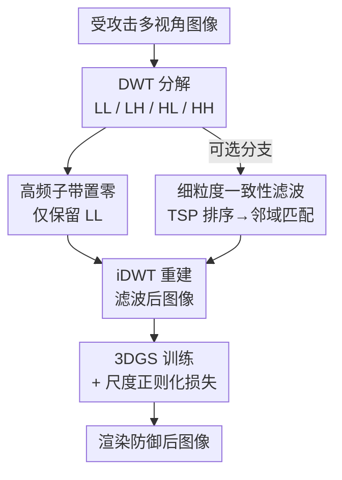

# DefenseSplat: Enhancing the Robustness of 3D Gaussian Splatting via Frequency-Aware Filtering

**会议**: ECCV 2026  
**arXiv**: [2602.19323](https://arxiv.org/abs/2602.19323)  
**代码**: [https://github.com/yrqiao/DefenseSplat](https://github.com/yrqiao/DefenseSplat)  
**领域**: 3D 视觉  
**关键词**: 3D 高斯泼溅, 对抗防御, 小波变换, 频域分析, 对抗鲁棒性  

## 一句话总结
DefenseSplat 通过小波变换分解输入图像、滤除高频子带来抑制对抗扰动，并引入 ReLU 形式的尺度正则化损失限制拉长高斯体的生成，在没有干净真值监督的条件下显著提升 3DGS 对对抗攻击的鲁棒性。

## 研究背景与动机

3D Gaussian Splatting（3DGS）凭借显式的高斯椭球体表示和可微光栅化，在渲染速度、视觉质量和可解释性上全面超越了 NeRF，迅速成为 3D 重建领域的主流范式。3DGS 被广泛应用于机器人、自动驾驶和医疗影像，尤其适合部署在云端服务器上，由用户上传多视角图像后自动构建高质量场景表示。然而，正因其显式地拟合物体纹理和边缘、并通过自适应密度控制动态调整高斯原语数量，3DGS 对输入图像的质量极为敏感——微小的、人眼不可察觉的对抗扰动就能让重建结果出现大量伪影，同时大幅增加训练时间、渲染显存占用和高斯原语数量，甚至导致服务器拒绝服务。

针对 3DGS 的对抗攻击刚刚起步。Poison-Splat 通过双层优化在输入图像上注入对抗噪声，使之在 3DGS 训练过程中诱导出大量拉长高斯体来消耗计算资源，同时降低渲染质量。面对这类攻击，现有的防御手段几乎完全失效：标准对抗训练假设模型有固定网络结构且为有监督分类，与 3DGS 的自监督、无固定架构特性格格不入；传统 2D 图像去噪（高斯模糊、双边滤波）虽然能压制扰动，但也会抹掉对 3D 重建至关重要的边缘细节；频域滤波（如傅里叶变换）忽略了空间结构信息，防御效果有限。更关键的是，3DGS 训练不存在「干净真值输入」的概念，无法像图像分类那样用干净标签做对抗训练。

这篇论文的核心洞察来自于一个简单但被忽视的事实：对抗扰动在频域上并非均匀分布。**核心 idea：通过小波变换将受损输入图像分解为高低频子带，发现对抗噪声集中分布在容易被多视角一致性破坏的高频分量中，因此直接滤除高频分量即可在保持场景低频主体结构不受影响的前提下消除对抗伪影，并辅以尺度正则化进一步抑制拉长高斯体的生成。**

## 方法详解

### 整体框架

DefenseSplat 是一条无需干净真值、直接对输入图像做预处理的三阶段流水线。首先对每张受攻击的多视角图像做一级离散小波变换（DWT），得到 LL（低频）、LH、HL、HH 四个子带；然后将所有高频子带（LH、HL、HH）系数置零，仅保留 LL 子带并执行逆小波变换（iDWT）重建出滤波图像；最后将这些滤波图像作为输入喂入标准 3DGS 训练流程，同时叠加一个 ReLU 形式的尺度正则化损失，限制高方差高斯（即拉长高斯体）的生成。训练完成后，渲染出最终防御后的多视角图像。其中还包含一个可选的细粒度滤波分支，利用多视角一致性对高频子带做选择性保留，从而恢复被粗暴滤波误删的真实纹理。

### 关键设计

**1. 频域脆弱性分析：对抗攻击为何主要破坏高频**

作者首先通过深度图像匹配（SuperPoint + LightGlue）量化评估攻击前后不同频带的跨视角一致性变化。为了高效准确地完成多视角匹配，他们将相机位姿排序建模为旅行商问题（TSP），用 Lin-Kernighan 算法求解一条平滑的相机轨迹，让每张图像只与路径上的相邻图像做匹配，既避免了暴力匹配的 O(n^2) 复杂度，又解决了随机顺序带来的匹配失败。匹配率定义为匹配的关键点数与提取的关键点总数之比。实验在 Mip-NeRF 360、Tanks-and-Temples 和 LLFF 三个数据集上一致显示：攻击后高频率带（LH + HL）的匹配率下降幅度（15%–20%）远大于低频率带（LL，仅下降 3%–5%），而 HH 子带的能量占比极小（<0.08%）且对角线纹理在自然图像中稀有，可以忽略。这个观察构成了整个防御策略的经验基础——对抗扰动本质上是一种高频噪声，攻击者为了最大化 3DGS 训练损失，倾向于在输入中注入大量高频伪影。

**2. 粗粒度滤波：直接丢弃高频子带**

基于上述分析，最直接的防御手段就是将高频子带全部置零。给定受攻击图像 $I'$，对其进行一级小波分解后取出 LL 子带，与其他三个归零的高频子带一起通过 iDWT 重建出滤波图像 $I_f = \texttt{iDWT}(\texttt{DWT}(I')_{LL}, 0, 0, 0)$。这一步看似粗暴，但有两个支撑理由。其一，LL 子带携带了图像超过 95% 的总能量，场景的主体结构和低频内容（光照、大块颜色区域）基本不受影响；即使攻击强度增大到 64/255，LL 子带仍保留大部分有效信息。其二，3DGS 在优化过程中有一个天然的自抑制机制：当多视角间的一致性较低时（即滤波后残留的人为纹理），高斯体会自动对这些区域做颜色平均以最小化 L1 损失，从而产生模糊效应，进一步消解残余的伪影。这意味着滤波 + 3DGS 的内在平滑形成了一个双层的防御链条，不需要显式的去噪网络。

**3. ReLU 尺度正则化：抑制拉长高斯体对残余纹理的过拟合**

粗粒度滤波虽然去除了绝大多数高频扰动，但一小部分具有较强多视角一致性的残留纹理仍然存在。3DGS 在拟合这些纹理时会产生大量的拉长高斯体（elongated Gaussians）来精确匹配图案，从而导致高斯原语数量膨胀、显存占用飙升，削弱防御效果。针对这一问题，作者设计了一个极其简洁的尺度正则化损失 $\mathcal{L}_{scale} = \text{ReLU}(\nu - \tau)$，其中 $\nu$ 是单个高斯体沿三个主轴方向的归一化方差，$\tau$ 是预设的阈值。这个损失只在 $\nu > \tau$ 时激活梯度传播，因此它只惩罚拉长高斯体（三个轴的尺度相差悬殊），而不会影响两类关键的高斯体：一是用于重建精细细节的小球型高斯体，二是用于覆盖大块平滑区域的大扁平型高斯体——两者的归一化方差都低于拉长高斯体。实验表明加上这一损失后，高斯数量进一步减少 15%–30%，GPU 显存和渲染时间也同步下降，在几乎所有指标上都取得了最佳平衡。

**4. 细粒度一致性滤波（可选）：选择性保留高频中的真实纹理**

粗粒度滤波的「一刀切」策略在去除噪声的同时也会丢弃场景中真实的高频细节（如纹理边缘、细小结构），导致平滑区域过度平滑。为此可选地引入一个更精细的滤波策略：先用 TSP 排序得到各视角的邻域关系，然后在相邻视角的高频子带之间做特征匹配，只保留那些在邻域中一致出现的高频系数，丢弃随机的、不跨视角一致的系数。这样既能去除对抗噪声（噪声在视角间不重复），又能保留建筑边缘、纹理花纹等真实高频信息。实验显示细粒度滤波在 PSNR 和 SSIM 上有微幅提升（~0.02 dB），但预处理复杂度更高，作者将其设定为可选组件，在实际部署中可以权衡效率与质量决定是否开启。

### 一个完整示例

以 Mip-NeRF 360 中的 bonsai 场景为例，攻击强度 $\epsilon=16/255$。原始 3DGS 训练受攻击图像需要 47 分钟、4.88M 个高斯体、18.5GB 显存，PSNR 仅 27.38。经 DefenseSplat 粗粒度滤波后，输入图像的 LH/HL 子带系数全部归零，LL 子带保留。3DGS 训练时间降至 24 分钟（缩短约 50%），高斯体降至 0.89M（减少 82%），显存降至 11.5GB，而 PSNR 反而提升至 30.78。加上尺度正则化后，高斯体进一步降至 0.86M，显存降至 10.5GB。这是因为防御不仅去除了噪声，还大幅简化了场景的高频复杂度——3DGS 不再需要大量高斯体去拟合虚假纹理，可以把优化资源集中到低频主体结构上。

## 实验关键数据

### 主实验

| 数据集 | 指标 | 3DGS (受攻击) | CompactGS | Difix3D+ | Ours | Ours+ReLU |
|--------|------|--------------|-----------|----------|------|-----------|
| Mip-NeRF 360 | PSNR ↑ | 25.18 | 24.95 | 24.52 | 27.32 | **27.47** |
| Mip-NeRF 360 | 训练时间 ↓ | 1:01:01 | 1:22:26 | 0:45:44 | 0:34:26 | **0:33:49** |
| Mip-NeRF 360 | 高斯数 ↓ | 5.91M | 3.00M | 3.65M | 2.24M | **2.16M** |
| Mip-NeRF 360 | GPU显存 ↓ | 20965 | 21072 | 15894 | 12567 | **11400** |
| Tanks-and-Temples | PSNR ↑ | 24.88 | 24.37 | 24.75 | 26.29 | **26.42** |
| Tanks-and-Temples | 训练时间 ↓ | 0:31:22 | 0:43:29 | 0:24:12 | 0:18:56 | **0:19:19** |
| Tanks-and-Temples | 高斯数 ↓ | 2.76M | 1.73M | 1.71M | 1.06M | **1.01M** |
| Tanks-and-Temples | GPU显存 ↓ | 10089 | 10930 | 7749 | 6296 | **5858** |

### 消融实验

| 配置 | PSNR (Mip-NeRF 360) | 高斯数 | 说明 |
|------|---------------------|--------|------|
| Full (粗粒度滤波 + 尺度正则) | **27.47** | **2.16M** | 完整模型 |
| w/o 尺度正则 (粗粒滤波 only) | 27.32 | 2.24M | 去掉正则后高斯数增加 3.7%，PSNR 下降 0.15 |
| 细粒度滤波替代粗粒滤波 | 27.49 | 2.19M | 质量微升但复杂，可选 |
| 无滤波 (原 3DGS) | 25.18 | 5.91M | 无法防御，高斯数暴涨 |
| 干净图像 + 防御 (Clean+Ours+ReLU) | 28.79 | 1.79M | 干净数据上仅掉点 0.3dB，可接受 |

### 关键发现

- 尺度正则化损失是性价比最高的设计：仅增加一行 $\text{ReLU}(\nu - \tau)$ 计算，就能在高斯数、显存和 FPS 上持续改善，且不影响小球型和大扁平型高斯体的正常功能，是非常优雅的正则化手段。
- 干净数据上防御的掉点微乎其微（PSNR < 2%，SSIM < 3%），因为 LL 子带保留了超过 95% 的原始能量，高频细节的损失对整体重建质量影响有限。这在云端部署场景中至关重要——不能因为加了防御就让正常用户的请求质量大幅下降。
- 当攻击强度从 16/255 增加到 64/255 时，对抗噪声开始向低频分量渗透（低频匹配率下降从 2.4% 升至 19.3%），但即使在这种极端设置下，DefenseSplat 的效果仍然优于所有基线，因为高频滤波仍能去除部分扰动。不过作者也指出，过强的攻击（>64/255）已超出人眼不可察觉的范围，在实际威胁模型中不太可能出现。

## 亮点与洞察

- **用小波变换做防御分析的视角很巧妙**：DWT 天然提供「空间 + 频率」的联合表示，既能做频带分解来分析扰动分布，又能通过 iDWT 精确重建空间域图像，一个数学工具完成分析和防御两个角色，没有引入任何额外网络开销。
- **利用 3DGS 自身的一致性和制作为第二道防线**：粗粒度滤波后残留的少量伪影会被 3DGS 的多视角 L1 损失自动平滑掉——作者没有去训练一个额外去噪网络，而是「借用」了 3DGS 优化的物理特性，这是一个非常轻量且聪明的系统级设计。
- **ReLU 形式的尺度正则化是典型的「加一行代码解决问题」**：归一化方差这个量只用了几行 PyTorch 就在反向传播中完成，不依赖任何外部库。它精准地定位了「拉长高斯体」这个影响防御效果的关键病根，而没有伤及正常高斯体，设计干净利落。
- **把多视角匹配效率问题的解法与 TSP 结合有意思**：将相机位姿排序转化为旅行商问题，既利用了成熟的数学工具，又让整个匹配流程在 O(n log n) 级别完成，而不是暴力 O(n^2)。这种交叉学科的思考值得迁移到其他需要按序处理多视角数据的场景。

## 局限与展望

- 论文只在 Poison-Splat 及其变体 Adaptive Attack 上验证了防御效果。虽然作者认为高频扰动是 3DGS 攻击的通用脆弱面，但如果未来出现专门绕过高频滤波的攻击（例如只在低频注入扰动或使用对抗性纹理的物理攻击），当前方法可能会失效。
- 粗粒度滤波在干净数据上仍有 1.75% 的 PSNR 掉点，说明高频细节的丢失是不可避免的代价。对于需要精细纹理重建的任务（如数字文物、高保真面部重建），这种掉点可能不可接受。细粒度滤波虽有改善，但提升幅度有限且增加复杂度。
- 缺少与基于扩散模型的通用去噪方法的系统对比。Difix3D+ 不是纯粹为对抗防御设计的，未来可以比较更先进的扩散后处理（如 DDRM、DiffPure）在 3DGS 防御上的表现。
- 该方法本质上是一种预处理防御，与 3DGS 训练解耦，理论上可以作为一个即插即用模块集成到任何 3DGS 变体中，但这篇论文没有做这方面的实验验证。

## 相关工作与启发

- **vs Poison-Splat**：Poison-Splat 是目前最强的 3DGS 对抗攻击方法，通过双层优化生成攻击图像。DefenseSplat 是首个专门针对 3DGS 的防御方法，直接在频域做术前预处理，不需要对抗训练也不需要干净真值。
- **vs FreGS / 3D-GSW**：FreGS 和 3D-GSW 也利用了频域分析来改善 3DGS 重建质量（分别解决过重建和引导分裂），但它们是用于提升性能而非防御对抗攻击。DefenseSplat 借鉴了 DWT 这一共同的数学工具，但分析对象从「重建误差」转向了「对抗扰动的频域分布」。
- **vs 传统 2D 防御（高斯模糊 / 双边滤波）**：传统空域滤波虽然也能去噪，但会无差别地模糊所有边缘。DefenseSplat 通过 DWT 保留了 LL 子带中的低频结构，对重建质量的影响更可控，且利用了 3DGS 的多视角一致性做二次压制。

## 评分

- 新颖性: ⭐⭐⭐⭐ 首个针对 3DGS 的防御方法，将 DWT 用于对抗扰动分析的设计视角新颖，尺度正则化的形式巧妙但原理并不复杂。
- 实验充分度: ⭐⭐⭐⭐⭐ 在 3 个标准数据集、多种攻击强度、干净数据、自适应攻击变体上做了全面对比，每场景的详细结果也都放在了附录，消融实验覆盖了每个设计点。
- 写作质量: ⭐⭐⭐⭐⭐ 动机阐述清晰，从挑战到观察到解决方案的推演逻辑完整，3 个层次（频域分析 → 粗粒滤波 → 尺度正则）的递进关系一目了然。
- 价值: ⭐⭐⭐⭐ 填补了 3DGS 防御这一空白区域，方法简单实用，适合直接集成到现有 3DGS 管线中。但通用性可能受限于攻击类型，需要后续更多攻击者的检验。

<!-- RELATED:START -->

## 相关论文

- [\[ICLR 2026\] Frequency-Aware Dynamic Gaussian Splatting](../../ICLR2026/3d_vision/frequency-aware_dynamic_gaussian_splatting.md)
- [\[ECCV 2026\] Geometry-Aware Style Transfer in 3D Gaussian Splatting](geometry-aware_style_transfer_in_3d_gaussian_splatting.md)
- [\[ECCV 2026\] VolSplat: Rethinking Feed-Forward 3D Gaussian Splatting with Voxel-Aligned Prediction](volsplat_rethinking_feed-forward_3d_gaussian_splatting_with_voxel-aligned_predic.md)
- [\[ECCV 2026\] G2P: Gaussian-to-Point Attribute Alignment for Boundary-Aware 3D Segmentation](g2p_gaussian-to-point_attribute_alignment_for_boundary-aware_3d_segmentation.md)
- [\[CVPR 2026\] FilterGS: Traversal-Free Parallel Filtering and Adaptive Shrinking for Large-Scale LoD 3D Gaussian Splatting](../../CVPR2026/3d_vision/filtergs_traversal-free_parallel_filtering_and_adaptive_shrinking_for_large-scal.md)

<!-- RELATED:END -->
