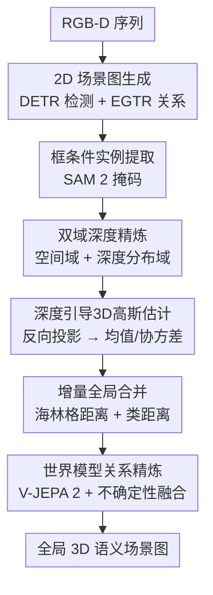

# DeWorldSG: Depth-Aware 3D Semantic Scene Graph Generation via World-Model Priors

**会议**: ECCV 2026  
**arXiv**: [2607.00889](https://arxiv.org/abs/2607.00889)  
**论文**: [https://deworldsg2026.github.io](https://deworldsg2026.github.io)  
**代码**: 有（项目页含开源链接）  
**领域**: 3D视觉  
**关键词**: 3D语义场景图, 世界模型, 深度感知, 概率高斯表示, 时空关系推理

## 一句话总结
DeWorldSG 提出一种从 RGB-D 序列生成时空鲁棒 3D 语义场景图（SSG）的框架：用 SAM 掩码引导的双域深度过滤为每个物体估计实例级概率 3D 高斯分布，再通过 V-JEPA 2 世界模型积累跨帧关系证据并以不确定性感知融合精炼谓词边，在 3DSSG 上关系召回率提升 77.4%、谓词召回率提升 23.2%。

## 研究背景与动机
3D 语义场景图（SSG）是具身 AI 和 AR 系统的核心空间推理基础——它把复杂 3D 环境抽象为物体节点 + 关系边的图结构，支撑智能体规划、3D 内容合成和上下文感知的 AR 锚定等高层任务。

当前主流路线是 2D-to-3D lifting：先从每帧 RGB-D 图像提取 2D 场景图（物体检测 + 关系推理），再逐帧提升到 3D 并合并成全局图。这条路线减少了对完整 3D 重建的依赖，对几何噪声和位姿误差更鲁棒，但存在两个根深蒂固的问题。其一，物体边界附近的深度估计不稳定（多表面观测、飞点像素），导致提升后的物体 3D 表示漂移，不同物体被错误合并或同一物体被分裂为多个节点。其二，现有方法对每帧独立推理关系——由于遮挡、低分辨率输入或视角受限，单帧观察天然不完整，导致大量关系边缺失，最终场景图只反映局部几何邻近性而非场景级语义上下文。

这两个问题的共同根源是：把场景图生成当作一系列独立的帧级预测，而不是一个需要积累时空证据的增量过程。本文的核心洞察是：物体几何在 2D 到 3D 提升时应该带不确定性建模，语义关系应该通过跨时间积累证据而非单帧快照来推断。

核心 idea：用深度感知的掩码过滤 + 双域深度精炼为每个物体估计概率 3D 高斯分布作为稳定节点表示，并用视频世界模型（V-JEPA 2）提供跨帧上下文先验来补全帧级推理遗漏的关系边，两者通过不确定性感知的概率融合统一。

## 方法详解

### 整体框架
DeWorldSG 接收一段 RGB-D 序列，输出一个全局一致的 3D 语义场景图。整个 pipeline 分三阶段串行推进，每帧进入后依次流经三个阶段，用增量方式维护全局图。

第一阶段：对每帧 RGB 图像，用 DETR 检测物体、用 EGTR 推理 2D 关系，得到帧级 2D 场景图。然后对每个检测到的物体，用 SAM 2 在检测框内生成实例掩码，再对该掩码覆盖的深度像素执行双域深度精炼（空间域 + 深度分布域），剔除飞点和边界噪声后，用保留下来的内点反向投影到 3D 世界坐标，估计实例级概率 3D 高斯（均值 + 协方差）。这些高斯节点连同帧级关系预测构成局部 3D 场景图。

第二阶段：将每帧的局部 3D 图增量合并入全局图。合并依据海林格距离（衡量 3D 高斯几何相似度）+ 类别概率内积距离（衡量语义一致性），两者都满足阈值时用加权平均融合高斯参数并聚合关系分布。

第三阶段：对全局图中每对几何邻近的物体，从 16 帧滑动缓冲区中截取联合裁剪区域构成短视频片段，送入冻结的 V-JEPA 2 骨干 + 可训练 MLP 探针得到谓词概率。该概率按 (主体类, 客体类) 对在时间上累积为稳定先验，仅在视觉预测熵高（不确定性大）时以加权加性融合方式注入，归一化后得到最终关系分布。

### 关键设计

**1. 双域深度精炼（Dual-Domain Depth Refinement）：去除边界噪声和飞点，为高斯估计提供干净深度样本**

框条件实例掩码只能大致圈定物体区域，掩码内仍有大量来自物体边界、多表面交叉或飞点像素的异常深度值，直接用于估计 3D 高斯会把协方差拉偏，导致后续合并时误匹配。DR 设计了两道串行过滤。

空间域过滤：对掩码内每个像素 $p$，取其 $3\times 3$ 邻域的中值深度 $\tilde{D}_t(p)$，若 $p$ 自身深度与中值的偏差超过 $\tau \tilde{D}_t(p)+\epsilon$ 则剔除。这一步消除了孤立的边界离群点（如物体轮廓处的飞点），保留了连续表面上的像素。

深度分布域过滤：将空间域幸存像素的深度值排序后做 1D 聚类。聚类阈值 $\Delta_{\text{thr}}=\max(\gamma_{\text{base}},\alpha\cdot\operatorname{median}(\Delta z),\beta\cdot d_{\text{ref}})$ 自适应缩放——$\gamma_{\text{base}}$ 保底最小间隔，$\alpha$ 捕捉局部深度变化，$\beta$ 按全局深度尺度调节。以 $d_{\text{ref}}=\operatorname{median}(Z_{\text{spatial}})$ 为参考深度，保留均值最接近 $d_{\text{ref}}$ 的那个聚类作为最终内点集 $P_{\text{final}}$。这一步实质上是按深度层分离物体，防止不同表面（如桌面前缘和后方墙壁）被混入同一物体的点集。

**2. 实例级概率 3D 高斯估计：用深度点云直接建模物体的空间位置和几何不确定性**

传统 lifting 方法用单一代表深度值（如检测框中心深度）或 2D 框投影来近似物体 3D 位置，这完全忽略了物体表面几何的分布信息。DeWorldSG 把问题重新表述为：从精炼后的深度内点集合直接估计一个 3D 高斯分布。

具体地，将 $P_{\text{final}}$ 中的每个像素 $(u,v)$ 通过相机内参 $K$ 反投影到相机坐标系 $\tilde{\mathbf{x}}=z\mathbf{K}^{-1}[u,v,1]^\top$，再用帧位姿 $T_t=[R_t\mid t_t]$ 变换到世界坐标 $\mathbf{x}_n=R_t\tilde{\mathbf{x}}+t_t$，得到实例点集 $P_{i,t}$。然后直接用样本均值和样本协方差估计 3D 高斯：$\mu_{i,t}^{3D}=\frac{1}{|P_{i,t}|}\sum\mathbf{x}_n$，$\Sigma_{i,t}^{3D}=\frac{1}{|P_{i,t}|-1}\sum(\mathbf{x}_n-\mu)(\mathbf{x}_n-\mu)^\top+\epsilon\mathbf{I}$，其中 $\epsilon\mathbf{I}$ 是数值稳定性正则项。

这个概率表示的关键优势有三：(1) 协方差矩阵天然编码了物体表面点云的空间散布方向和程度，比刚性 3D 框更忠实于物体几何；(2) 低维统计量（均值 3 维 + 协方差 6 维）比完整点云高效得多；(3) 增量合并时可直接用高斯融合公式（加权平均均值 + 考虑组间差异的协方差更新），无需重复访问原始点云。

**3. 世界模型驱动的时空关系精炼：用 V-JEPA 2 的跨帧结构先验补全单帧推理遗漏的关系边**

帧级关系推理受限于瞬时观测，遮挡、低分辨率或不利视角都会造成关系边缺失或错误。DeWorldSG 的核心思路是：把关系预测从"单帧分类"变成"跨帧证据积累"，并在视觉证据不足时引入世界模型的上下文先验。

对每对满足几何邻近约束（2D 中心距离 + 深度差，联合代价 < 0.45）的物体，从 16 帧滑动缓冲区中提取两物体联合边界框的裁剪区域，构成短视频片段。用冻结的 V-JEPA 2 骨干提取时空 token 并经均值池化，再接一个两层 MLP 探针输出谓词分布 $p_{\text{WM}}(r_{i\to j})$。这个探针是 DeWorldSG 中唯一需要训练的组件，用交叉熵在训练集上优化。

推理时，不直接用单次探针输出，而是按 (主体类 $c_s$, 客体类 $c_o$) 在时间上累积得到稳定先验 $P_{\text{WM}}(r\mid c_s,c_o)$；同时并行维护视觉支路的多帧 logit 累加 $P_{\text{vis}}(r\mid i,j)=\operatorname{Softmax}(\sum_{t}\ell_t(r\mid i,j))$。计算 $P_{\text{vis}}$ 的熵作为不确定性度量——只有熵超过阈值（即视觉支路对各谓词犹豫不决）时，才以加性融合方式注入世界模型先验：$P_{\text{new}}\propto P_{\text{vis}}+\alpha_{ij}P_{\text{WM}}$，随后重新归一化。$\alpha_{ij}$ 只在不确定性高时激活，确保强视觉证据不被世界模型先验覆盖，避免幻觉化的关系注入。

### 一个完整示例

假设一帧画面中有一张桌子和一把椅子，椅子部分被桌子遮挡。传统方法可能因遮挡导致椅子的深度值混入桌面点，两物体在 3D 中被拉近，帧级关系推理因为看不到椅子全貌而不知道该输出"在...前面"还是"在...旁边"。

DeWorldSG 的处理流程：SAM 2 为桌子和椅子分别生成掩码（模糊像素被丢弃不做分配）。对桌子掩码内的深度像素，DR 空间域剔除边缘的飞点（桌子轮廓处的深度跳变像素被滤掉），深度分布域保留主导聚类（桌面连续表面），剔除背景墙面的深度层。精炼后的内点反投影得到桌子点集，约 200 个 3D 点，估计出的高斯协方差在桌面法线方向方差小、切向方向大——准确描述了桌面的空间延展。椅子同理。

两物体高斯合并入全局图后，几何邻近约束（两物体中心 2D 距离归一化后 0.12，深度差 0.35 米，联合代价 0.35 < 0.45）判定它们应建立关系边。但当前帧视觉支路因椅子部分遮挡，认为"在...旁边"概率 0.4、"在...前面"概率 0.35——熵偏高，触发世界模型介入。V-JEPA 2 从过去 16 帧中观察到椅子确实一直在桌子前方（前几帧视角更清楚），探针输出的先验坚定地给"在...前面"高概率。融合后最终分布中"在...前面"概率显著提高，输出的关系边正确且一致。

### 损失函数 / 训练策略
DeWorldSG 的大部分组件（DETR、SAM 2、EGTR、V-JEPA 2）均使用预训练权重且冻结，唯一需要训练的是 V-JEPA 2 之上的两层 MLP 关系探针。探针以 16 帧联合裁剪片段为输入，输出各谓词类别的 logits，用交叉熵损失在各自数据集的训练划分上优化。训练时不依赖真实关系标注来构建先验——探针从零开始学习从 V-JEPA 2 时空特征到谓词分布的映射。训练超参：单卡 RTX A6000 (48 GB)，场景图构建与探针训练均在单卡上完成。DR 阶段超参：$\tau=0.05$，$\epsilon=1e^{-3}$，$\gamma_{\text{base}}=0.03$，$\alpha=10$，$\beta=0.02$；合并阶段海林格距离阈值 $\delta_g=0.7$，类距离阈值 $\delta_c=0.8$；关系融合系数 $\alpha_{ij}=0.5$，熵阈值 1.0。

## 实验关键数据

### 主实验
DeWorldSG 在 3DSSG 和 ReplicaSSG 两个数据集上与 7 个基线方法对比。3DSSG 包含 478 个室内环境的 1,482 个真实 RGB-D 扫描，ReplicaSSG 含 7 个验证场景和 11 个测试场景。

**3DSSG 主结果对比（Table 1 精简）**

| 方法 | 输入 | Rel Recall | Obj Recall | Pred Recall | mRecall Obj | mRecall Pred |
|------|------|-----------|-----------|------------|------------|------------|
| IMP | RGB-D | 19.7 | 49.5 | 20.9 | 34.7 | 13.8 |
| VGFM | RGB | 19.6 | 50.0 | 20.4 | 34.8 | 11.0 |
| 3DSSG | Point Cloud | 12.9 | 37.4 | 22.0 | 26.2 | 14.4 |
| SGFN | RGB-D | 22.0 | 51.6 | 27.5 | 37.7 | 24.0 |
| MonoSSG | RGB-D | 23.3 | 53.8 | 28.4 | 43.8 | 26.6 |
| FROSS (原SOTA) | RGB-D | 27.9 | 62.4 | 33.0 | 63.8 | 18.0 |
| **DeWorldSG** | RGB-D | **50.2** | **75.0** | **57.3** | **70.6** | **36.0** |

相对于原 SOTA FROSS，关系召回率提升 77.4%（27.9→50.2），物体召回率提升 20.2%（62.4→75.0），谓词召回率提升 23.2%（33.0→57.3）。在类平衡的 mRecall 上同样全面领先，说明即使在严重类别不平衡的情况下方法依然鲁棒。

**ReplicaSSG 结果（Table 2 精简）**

| 方法 | Rel Recall | Obj Recall | Pred Recall | mRecall Obj | mRecall Pred |
|------|-----------|-----------|------------|------------|------------|
| FROSS (GT Pose) | 22.3 | 26.1 | 27.8 | 28.8 | 20.4 |
| DeWorldSG (GT Pose) | **38.2** | **35.4** | **45.3** | **38.1** | **27.3** |
| FROSS (ORB-SLAM3) | 22.7 | 25.8 | 27.2 | 27.7 | 20.1 |
| DeWorldSG (ORB-SLAM3) | **37.4** | **33.8** | **42.8** | **37.6** | **26.9** |

在预测位姿下 DeWorldSG 保持了 GT 位姿下 87.6% 的关系召回率和 89.2% 的物体召回率，证明方法对相机位姿噪声鲁棒。

### 消融实验

| 配置 | 实例掩码 | DR | 世界模型 | DINOv2 | Rel Recall | Obj Recall | Pred Recall |
|------|---------|-----|---------|--------|-----------|-----------|------------|
| (a) 基线（纯 lifting） | | | | | 28.5 | 63.4 | 33.4 |
| (b) + 掩码深度采样 | Y | | | | 40.3 | 71.7 | 46.7 |
| (c) + 双域精炼 DR | Y | Y | | | 47.8 | 74.6 | 52.9 |
| (d) + DINOv2 替代 | Y | Y | | Y | 49.5 | 74.6 | 56.6 |
| (e) DeWorldSG 完整版 | Y | Y | Y | | **50.2** | **75.0** | **57.3** |

关键发现：(1) 实例掩码-guided 深度采样是从纯 lifting 的最大单次跳跃——关系召回从 28.5 跳到 40.3（+41%），说明直接用检测框投影做 3D 提升是此前方法的最大瓶颈；(2) DR 再贡献 +7.5 个点关系召回（40.3→47.8），验证了深度噪声过滤对稳定高斯估计和全局合并的关键作用；(3) DINOv2 替代（静态图像级特征）能带来一定谓词提升但幅度有限，完整版 V-JEPA 2 多帧时空积累取得了更强的关系性能（50.2 vs 49.5 Rel Recall，且 Pred Recall 从 56.6 提升到 57.3），证明了时序证据比静态视觉表征对关系推理更具信息量。

### 关键发现
- 贡献最大的模块是**实例掩码深度采样**：去掉它回退到纯框投影 lifting 时，关系召回从 50.2 骤降至 28.5（降幅 43%），说明为每个物体建立高质量深度点集是后续所有步骤的基础。
- DR 对关系推理的贡献（47.8→50.2，+5%）虽小于掩码，但对全局合并的稳定性至关重要——没有 DR 时物体高斯协方差被噪声拉偏，不同物体更容易被错误合并或同一物体被分裂。
- 在 ReplicaSSG 上用 ORB-SLAM3 估计位姿替代真值位姿，性能仅小幅下降（Rel 38.2→37.4），表明方法不依赖精密重建，适合在线 AR/机器人场景。
- 世界模型融合系数的熵阈值设为 1.0 是保守策略——只在视觉支路确实犹豫（高熵）时才引入先验，避免了在视觉证据清晰的简单场景中引入不必要的外部干预。

## 亮点与洞察
- **把 2D-to-3D lifting 从"提升 + 合并"升级为"概率建模 + 时空积累"**：不再把每个物体当做一个确定性的 3D 点，而是用 3D 高斯分布表达位置和几何不确定性，这让后续合并有了数学基础（海林格距离 vs 简单的欧氏阈值），也让图结构本身对深度噪声更鲁棒。
- **世界模型用于关系推理而非几何重建**：V-JEPA 2 在这里的角色不是生成像素或补全遮挡表面，而是为"这两个物体之间最可能存在什么关系"提供上下文先验——这是世界模型在符号化推理层面的一种新用法，区别于常见的像素重建范式。
- **DR 的自适应阈值设计**：$\Delta_{\text{thr}}$ 结合了全局深度尺度 $\beta\cdot d_{\text{ref}}$ 和局部深度变化 $\alpha\cdot\operatorname{median}(\Delta z)$，使得同一套超参在近景桌面场景和远景房间场景下都能合理分离主导深度层，避免了硬阈值对不同场景深度范围的不适应。
- **不确定性感知融合作为保守先验注入机制**：$P_{\text{new}}\propto P_{\text{vis}}+\alpha_{ij}P_{\text{WM}}$ 这种加性融合 + 熵门控的设计很实用——它不是无条件信任世界模型，而是"视觉没把握时才求助"，这是把 LLM/VLM 领域"retrieval-augmented 只在需要时触发"的思路迁移到了 3D 感知中。

## 局限与展望
- **2D 检测器的类别一致性是薄弱环节**：作者承认当同一个物理物体在跨帧被 2D 检测器赋予不同类别标签时（如桌子被标为椅子），系统会将其视为不同实例创建重复节点。这在部分遮挡或大视角变化时更常见。可探索的方向包括跨帧语义一致性约束或更鲁棒的 2D 检测器。
- **未讨论对动态场景的处理**：该方法假设场景是静态的，所有观测来自同一组不变的物体。如果场景中有移动物体（如被人推动的椅子），增量合并的高斯融合公式会将新旧位置平均化，导致节点位置滞后于真实物体运动。需要引入运动模型或物体级 SLAM 来处理动态场景。
- **世界模型的粒度限制在类级别**：$P_{\text{WM}}(r\mid c_s,c_o)$ 是按类别对积累的，这意味着所有"桌子-椅子"对共享同一个世界模型先验，无论它们在场景中的具体空间布局如何。这限制了细粒度推理（比如区分"椅子在桌子左边"和"椅子在桌子前面"），未来可以探索将 3D 空间信息注入世界模型的编码过程。
- **实时性方面的权衡**：全流程每帧约 108 ms（~9 FPS），其中 SAM 掩码分割（25 ms）和关系精炼（69 ms）是主要瓶颈。对于需要实时交互的 AR 应用，可考虑用更轻量的分割模型替代 SAM 2，或用关键帧策略减少关系精炼的调用频率。

## 相关工作与启发
- **vs FROSS**：FROSS 是 DeWorldSG 最直接的前身和方法基线，同样用 3D 高斯表示物体进行增量合并。FROSS 的 3D 高斯是从 2D 检测框投影近似得到的，没有显式建模物体几何或深度分布，导致高斯位置不准、协方差不可靠——这是 DeWorldSG 切入改进的第一个点（深度引导的概率高斯估计）。此外 FROSS 没有关系精炼机制，只做帧级推理后简单聚合，这是 DeWorldSG 的世界模型精炼所替代的。两者共享了高斯表示 + 增量合并的骨架，但 DeWorldSG 在前端（深度建模）和后端（关系推理）都做了实质性升级。
- **vs 点云类方法（3DSSG, SGFN, MonoSSG）**：这类方法从重建的点云中提取特征并用 GNN 联合预测物体和关系，优势是关系扎根于显式 3D 几何，但图质量严重依赖重建质量——位姿漂移、不完整几何直接传导到图。DeWorldSG 不依赖完整场景级重建，从 RGB-D 直接估计实例级高斯，避免了"重建失败则图失败"的耦合。实验结果也验证了这一点：不依赖点云的方法（DeWorldSG）反而在关系推理上超过了点云方法。
- **vs 世界模型用于 3D 的工作（Hu et al., MindJourney, Concerto）**：这些工作主要用世界模型做几何重建、新视角合成或跨模态表征学习。DeWorldSG 将世界模型用于符号化的场景图关系推理，这是从连续像素空间到离散符号空间的一次跨越——利用预训练视频模型的物理常识和结构规律性来约束关系图，而不是生成更多像素。

## 评分
- 新颖性: ⭐⭐⭐⭐ 将世界模型先验引入场景图生成是一个新鲜的交叉点；深度引导的概率高斯估计比 FROSS 的框投影有明显提升，但高斯表示本身并非全新概念（FROSS 已用），DR 是精巧的工程优化而非理论突破。
- 实验充分度: ⭐⭐⭐⭐⭐ 两个数据集（3DSSG + ReplicaSSG）、7 个基线、完整消融（5 配置含 DINOv2 替代实验）、位姿鲁棒性测试、定性对比、单模块延迟分析，实验设计全面且每个设计选择都有消融支撑。
- 写作质量: ⭐⭐⭐⭐ 方法部分公式清晰、Fig. 2 框架图干净；但 Introduction 略显冗长且多处重复类似表述，消融表中 DINOv2 和世界模型的对比逻辑需要读者额外推敲才能理解（为什么 DINOv2 的 Pred Recall 反而略低于完整版，表中需要备注）。
- 价值: ⭐⭐⭐⭐ 3D SSG 是具身 AI 从感知走向推理的关键中间表示，本文在提升图质量和实用性方面有实质贡献；开源代码 + 不依赖真值位姿的特性降低了实践门槛，适合机器人操作和 AR 锚定等下游应用直接接入。

<!-- RELATED:START -->

## 相关论文

- [\[ECCV 2026\] OP3DSG: Open-Vocabulary Part-Aware 3D Scene Graph Generation for Real-World Environments](op3dsg_open-vocabulary_part-aware_3d_scene_graph_generation_for_real-world_envir.md)
- [\[ECCV 2026\] Hierarchical 3D Scene Graph Construction and Belief-based Planning for Semantic Navigation](hierarchical_3d_scene_graph_construction_and_belief-based_planning_for_semantic_.md)
- [\[AAAI 2026\] Open-World 3D Scene Graph Generation for Retrieval-Augmented Reasoning](../../AAAI2026/3d_vision/open-world_3d_scene_graph_generation_for_retrieval-augmented_reasoning.md)
- [\[CVPR 2026\] Iris: Bringing Real-World Priors into Diffusion Model for Monocular Depth Estimation](../../CVPR2026/3d_vision/iris_bringing_realworld_priors_into_diffusion_model_for_monocular_depth_estimation.md)
- [\[ECCV 2026\] Walking in the Implicit: Interactive World Exploration via Neural Scene Representation](walking_in_the_implicit_interactive_world_exploration_via_neural_scene_represent.md)

<!-- RELATED:END -->
