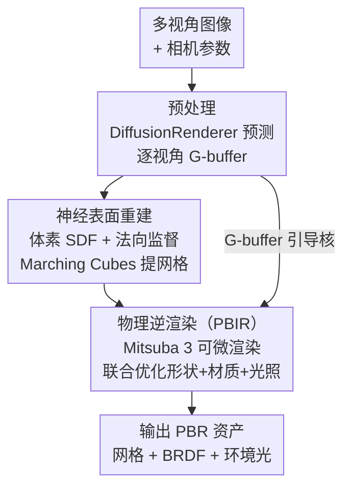

# Diffusion-Based Material Regularization for Physics-Based Inverse Rendering

**会议**: ECCV 2026  
**arXiv**: [2606.31065](https://arxiv.org/abs/2606.31065)  
**代码**: 无  
**领域**: 3D视觉  
**关键词**: 逆渲染, 材质正则化, 扩散模型, 物理渲染, 联合双边滤波

## 一句话总结
本文提出一种将扩散模型预测的 G-buffer（反照率、粗糙度、金属度、法向）作为相似性核来正则化物理解耦逆渲染的方法——不是把扩散预测当目标值去拟合，而是用它定义表面区域间的材质相似度，通过联合双边滤波约束同一材质区域的优化参数趋于一致，从而抑制"光照烘焙进材质"的伪影，在 Stanford-ORB 上显著超越 Neural-PBIR 和 MaterialFusion 等 SOTA 方法。

## 研究背景与动机
从多视角图像重建物体的几何、材质和光照（逆渲染）是图形学与视觉的核心问题，重建出的 PBR 资产直接用于标准渲染管线做重光照和编辑。物理逆渲染（physics-based inverse rendering, PBIR）通过可微渲染提供精确的图像形成模型，但问题本身高度欠约束：同一张输入图可以由多种（材质, 光照）组合解释，优化器很容易把光照效果"烘焙"进材质贴图里——比如阴影被当成反照率的暗色纹理——导致在新视角/新光照下泛化极差。

另一方面，以 DiffusionRenderer 和 RGB-X 为代表的数据驱动扩散模型可以从单图或视频预测出视觉上合理的 G-buffer，但这些预测不满足渲染方程约束，直接用于物理渲染会出现色偏、材质不准确等问题。

现有工作的典型做法是把扩散预测当作监督目标（如 MaterialFusion 用 score distillation、VideoMat 用全局尺度不变 loss），但这造成光度拟合与先验约束之间的张力：一股脑往预测值靠拢会牺牲对输入图像的拟合精度，且无法处理场景中不同材质区域需要分别纠偏的情况。本文的核心洞察是：扩散预测本身不必是目标值，它最有价值的信息是材质区域的隐式分组——同一材质区域内部预测值变化平缓、不同区域之间有跳变——这个分组信息可以用来约束逆渲染优化在同一材质区域内保持材质一致，但不强制优化结果等于预测值。核心 idea：把扩散预测作为联合双边滤波的引导核，构造一个"隐式材质聚类"正则项，既借用数据驱动的先验又不丢掉物理渲染的精确性。

## 方法详解

### 整体框架
输入为静态物体在未知光照下的 N 张多视角图像，目标是重建该物体的标准 PBR 资产（三角网格 + 空间变化 Disney BRDF 参数 + 环境光贴图），使其在新光照下重光照结果与真值一致。方法分三个阶段串行执行：

1. **预处理**：标定相机参数后，用 DiffusionRenderer（image mode）为每张视角图预测 G-buffer $`\mathbf{G}_i = [\mathbf{A}_i, \mathbf{R}_i, \mathbf{M}_i, \mathbf{N}_i]`$（反照率、粗糙度、金属度、法向）。
2. **神经表面重建**：用体素网格 SDF + 神经体渲染重建物体形状，额外引入法向监督 loss（预测法向与扩散预测法向的 Huber 距离），改善光滑表面的凹面伪影，然后用 Marching Cubes 提取初始网格。
3. **物理逆渲染（PBIR）**：以初始网格为起点，联合优化形状、空间变化材质（Disney BRDF 的 base color / roughness / metallic）和环境光贴图。优化目标为 $`\mathcal{L} = \mathcal{L}_{\text{img}} + \lambda_{\text{mat}}\mathcal{L}_{\text{mat}}`$，其中 $`\mathcal{L}_{\text{img}}`$ 为相对 MSE 渲染 loss（适配 HDR 输入），$`\mathcal{L}_{\text{mat}}`$ 为本文核心的隐式材质聚类正则项。

PBIR 阶段用 Dictionary Fields（共享基函数的神经场）参数化空间变化 BRDF 和环境光贴图，渲染器为 Mitsuba 3 的 path replay backpropagation 积分器（最大路径深度 3，支持一次反弹间接光照）。

### 关键设计

**1. 隐式材质聚类正则化：用扩散预测做相似性核而非目标值**

物理逆渲染在稀疏视角和未知光照下优化空间变化材质是严重欠约束的——每个表面点只被有限视角观察到，优化器容易把光照效果烘焙进材质。DiffusionRenderer 可以预测视觉合理的 G-buffer，且同一材质区域内预测值变化平缓。本文不把预测值当目标，而是利用这个"同类材质区域内预测值相近"的性质，构造一个隐式的材质聚类约束。

具体做法：对每个视角，设扩散预测的材质 G-buffer 为 $`\mathbf{g} = [\mathbf{A}, \mathbf{R}, \mathbf{M}]`$，定义像素 p、q 之间的相似性核：

$$k_{p,q}(\mathbf{g}) = \exp\left(-\frac{\lVert \mathbf{g}_p - \mathbf{g}_q \rVert_2^2}{2\sigma_g^2}\right)$$

设 $`\hat{\mathbf{g}}`$ 为当前优化参数的可微渲染 G-buffer。用联合双边滤波（JBF）以扩散预测核引导平滑 $`\hat{\mathbf{g}}`$：

$$\mathrm{JBF}(\hat{\mathbf{g}}; \mathbf{g})_p = \frac{\sum_q k_{p,q}(\mathbf{g}) \hat{\mathbf{g}}_q}{\sum_q k_{p,q}(\mathbf{g})}$$

JBF 的直觉：在以扩散预测定义的"材质相似"区域内，把所有像素的优化材质加权平均——如果优化器在区域内某处烤入了阴影，该处材质会偏离区域均值，正则化会把它拉回来。但 JBF 只在核定义的相似区域内平滑，不跨材质边界，因此不同材质的区域可以各自有独立的偏差。

最终正则损失为渲染 G-buffer 与其 JBF 滤波版本之间的 L1 距离：

$$\mathcal{L}_{\text{mat}} = \left\lVert \hat{\mathbf{g}} - \mathrm{JBF}(\hat{\mathbf{g}}; \mathbf{g}) \right\rVert_1$$

注意这里用一个拼接了所有通道的 $`\mathbf{g} = [\mathbf{A}, \mathbf{R}, \mathbf{M}]`$ 的核来正则化全部通道（而非每个通道各建一个核），这样做的好处是：当某个预测通道过于平滑时，其他通道的信息可以防止过度正则化。消融实验也证明了拼接核优于分通道核。JBF 通过 permutohedral lattice 实现可微高效计算。这个设计的本质类似反射率共享（reflectance sharing），用扩散预测隐式地划分"同材质区域"，在区域内共享观测信号、降低自由度，但不强制区域间的材质一致。

**2. 尺度无关的反照率变换：解除反照率-光照的尺度耦合**

直接对反照率施加材质正则化会引入一个隐蔽的 bias：优化器可以通过压低反照率来降低 $`\mathcal{L}_{\text{mat}}`$，同时让光照变亮来补偿渲染结果，导致重建出异常强烈的光源。为解决这个问题，本文引入尺度无关反照率变换：

$$\psi(\hat{\mathbf{A}}) = \operatorname{sg}(\hat{\mathbf{A}}) \odot \log([\hat{\mathbf{A}}]_\epsilon)$$

其中 $`\operatorname{sg}(\cdot)`$ 是 stop-gradient，$`[\hat{\mathbf{A}}]_\epsilon = \max(\hat{\mathbf{A}}, \epsilon)`$ 保证数值稳定。在 log 空间中，一个区域内的乘性缩放变成加性偏移，在 JBF 的差 $`\hat{\mathbf{g}} - \mathrm{JBF}(\hat{\mathbf{g}}; \mathbf{g})`$ 中相互抵消，因此正则项对反照率的整体缩放不敏感。同时 log 函数会按 $`1/\hat{\mathbf{A}}`$ 缩放梯度——乘以 stop-gradient 的 $`\operatorname{sg}(\hat{\mathbf{A}})`$ 恰好抵消这一缩放，并适当压低暗区的梯度。在计算 $`\mathcal{L}_{\text{mat}}`$ 时用 $`\psi(\hat{\mathbf{A}})`$ 替换 $`\hat{\mathbf{g}}`$ 中的 $`\hat{\mathbf{A}}`$。

**3. 法向监督的神经表面重建**

在第二阶段用体素 SDF + 神经体渲染重建形状时，直接引入扩散预测的法向图作为监督信号：

$$\mathcal{L}_{\text{shape}} = \sum_{i=1}^{N} \sum_{p} H_\delta\left(1 - \hat{\mathbf{N}}_{i,p}^\top \mathbf{N}_{i,p}\right)$$

其中 $`H_\delta`$ 是 Huber 惩罚（$`\delta = 0.03`$，约 $`15^\circ`$ 角差以上线性衰减），提高对扩散法向预测中噪声的鲁棒性。该 loss 增强了几何表面细节，尤其改善了光滑表面上的凹面形状伪影——这些伪影在后续重光照中会被高光严重放大。

### 损失函数 / 训练策略

总损失 $`\mathcal{L} = \mathcal{L}_{\text{img}} + \lambda_{\text{mat}}\mathcal{L}_{\text{mat}}`$，其中 $`\lambda_{\text{mat}} = 0.1`$。$`\mathcal{L}_{\text{img}}`$ 为相对 MSE：

$$\mathcal{L}_{\text{img}} = \sum_{i=1}^{N} \left\lVert \frac{\hat{I}_i - I_i}{\operatorname{sg}(\hat{I}_i) + \epsilon} \right\rVert_2^2, \quad \epsilon = 10^{-2}$$

相对 loss 防止 HDR 输入中少量过亮像素主导梯度。PBIR 阶段初始学习率 $`3 \times 10^{-2}`$，cosine annealing 至 $`10^{-3}`$，共 900 轮迭代，每轮随机采样 6 个视角。渲染采样数：primal 256 spp，反向自动微分 64 spp。BRDF 参数和环境光贴图用 Dictionary Fields（2D 配置）参数化；环境光贴图用指数激活，BRDF 输出无激活但 clamp 到 [0,1] 并对越界值施加 $`L_1`$ 惩罚（权重 $`10^{-2}`$）。单张 RTX 5090 上，SDF 阶段约 10 分钟，DiffusionRenderer 预处理约 15 分钟，PBIR 阶段每场景约 7 分钟。

## 实验关键数据

### 主实验
在三个数据集上评估：Stanford-ORB（42 场景，真实拍摄 + 重光照真值）、Synthetic4Relight（4 场景）、DTC-Synthetic（7 场景，含强光滑和投射阴影）。对比方法：Neural-PBIR（纯分析-合成逆渲染）和 MaterialFusion（score distillation 扩散先验）。度量：PSNR-H/L（高/低动态范围）、SSIM、LPIPS。

| 数据集 | 方法 | 重光照 PSNR-H | 重光照 PSNR-L | 重光照 SSIM | 重光照 LPIPS | 新视角 PSNR-H |
|--------|------|-------------|-------------|-----------|-----------|-------------|
| Stanford-ORB | Neural-PBIR | 26.07 | 33.39 | 0.980 | 0.023 | 28.90 |
| Stanford-ORB | MaterialFusion | 23.52 | 31.18 | 0.968 | 0.037 | 26.17 |
| Stanford-ORB | Ours | **27.22** | **34.98** | **0.981** | **0.021** | **29.58** |

| 数据集 | 方法 | 重光照 PSNR | 重光照 SSIM | 对齐反照率 PSNR | 反照率 PSNR | 粗糙度 MSE |
|--------|------|-----------|-----------|--------------|----------|----------|
| Synthetic4Relight | Neural-PBIR | 27.83 | 0.974 | 25.72 | 22.67 | 0.016 |
| Synthetic4Relight | MaterialFusion | 20.20 | 0.944 | 24.28 | 15.65 | 0.015 |
| Synthetic4Relight | Ours | **32.02** | **0.975** | **27.83** | **27.04** | **0.013** |
| DTC-Synthetic | Neural-PBIR | 39.18 | 0.9928 | - | - | - |
| DTC-Synthetic | MaterialFusion | 28.63 | 0.9746 | - | - | - |
| DTC-Synthetic | Ours | **43.21** | **0.9961** | - | - | - |

本文在 Stanford-ORB 上将重光照 PSNR-H 从 Neural-PBIR 的 26.07 提升到 27.22（+1.15 dB），形状误差（Shape metric）从 0.42 降至 0.30。MaterialFusion 虽能消除烘焙阴影但严重欠拟合，导致反照率 PSNR 仅 15.65（vs Ours 27.04）。定性上，本文方法在强方向光产生的投射阴影场景（Block_RedBlue 的红色方块侧面、cup_scene006 的杯柄周围）彻底消除了烘焙伪影，在高光金属表面（pitcher_scene001、TeaPot_EmeraldGoldTop）恢复了更准确的反射。

### 消融实验

| 配置 | Stanford-ORB PSNR-H | PSNR-L | SSIM | 说明 |
|------|--------------------|--------|------|------|
| Full model (Ours) | **27.22** | **34.98** | **0.981** | 完整模型 |
| w/o reg.（无材质正则化） | 26.11 | 33.78 | 0.978 | 去除正则化后掉 1.11/1.20 dB |
| d-s corr.（漫反射-镜面自相关正则） | 26.37 | 34.10 | 0.979 | 非数据驱动的自相关正则，受烘焙反照率误导 |
| scale inv.（全局尺度不变 loss） | 26.38 | 34.21 | 0.980 | 全局调整无法处理逐区域的材质偏差 |
| Diffusion-BP（直接反投影扩散预测） | 26.06 | 33.09 | 0.976 | 扩散预测本身不满足渲染方程，最差 |

消融显示移除材质正则化后 Synthetic4Relight 重光照 PSNR 从 32.02 降至 28.94（-3.08 dB），DTC-Synthetic 从 43.21 降至 40.23（-2.98 dB）。尺度无关反照率变换的消融显示：去掉该变换后，优化器压低反照率并由异常明亮的环境光贴图补偿，偏离真实光照。法向监督消融：去掉 $`\mathcal{L}_{\text{shape}}`$ 后光滑表面出现凹面形状伪影，导致高光区域严重失真。补充实验中还验证了拼接核 vs 分通道核：拼接核在反照率估计（27.15 vs 26.46 PSNR）和粗糙度（0.013 vs 0.024 MSE）上均优于分通道。

### 关键发现
- 材质聚类正则化是最大的性能贡献者，去除后在 Synthetic4Relight 重光照上掉 3.08 dB。它的核心价值不在于"扩散预测有多准"，而在于"扩散预测在同类材质区域内足够平滑"这一性质。
- 直接用扩散预测作为初始化而不加正则化（w/o reg.）会迅速重新引入烘焙伪影，说明初始化离收敛点很远、优化容易陷入局部极小值——正则化通过约束解空间帮助跳出这些局部极小值。
- 将 DiffusionRenderer 换为 RGB-X 作为上游模型，本文的正则化设计仍然优于直接反投影和全局尺度不变 loss（PSNR-H: 26.58 vs 25.78/26.02），证明核心收益来自正则化器设计而非特定上游扩散模型。
- 将本文正则化迁移到 IRGS（基于 2D Gaussian Splatting 的逆渲染管线）上，替换其原始平滑项后在 Synthetic4Relight 四个场景上平均提升 +0.80 dB PSNR，说明该正则化不绑定特定 PBIR 管线。

## 亮点与洞察
- **把扩散预测从"目标值"降级为"相似性核"是范式的巧妙转换**：不做回归、不做蒸馏，只利用预测在同类材质区域内的局部平滑性。这个思路让数据驱动先验和物理渲染约束各司其职——扩散模型负责"哪里应该一样"，PBIR 负责"具体该是多少"——从根本上避开了"往预测值靠拢会牺牲物理精度"的两难。
- **JBF 用于逆渲染正则化是一个优雅的工程选择**：联合双边滤波在图像处理中历史悠久，但把它用在可微渲染管线里做跨像素材质平滑、并用扩散预测定义核函数，这在逆渲染领域是新的。permutohedral lattice 的高效可微实现让 JBF 可以嵌入每次 SGD 迭代而不显著增加计算开销。
- **log 变换 + stop-gradient 的尺度无关技巧可以直接迁移**：任何有缩放歧义的回归+正则化场景（如分解问题中的亮度假定）都可以借鉴 $`\psi(x) = \operatorname{sg}(x) \odot \log(x)`$ 的设计——在 log 空间做平滑让乘性缩放变成加性偏移被抵消，stop-gradient 乘子修正梯度缩放。这个技巧在逆渲染之外的分解任务中同样适用。
- **正则化设计的可迁移性验证了其通用性**：在 IRGS（不同表示、不同渲染器）上的成功迁移表明，这个正则化本质上不依赖 Mitsuba、mesh 表示或 Dictionary Fields，只依赖"有一个可微渲染的 G-buffer $`\hat{\mathbf{g}}`$ 和一个外部预测的引导 G-buffer $`\mathbf{g}`$"。

## 局限与展望
- 作者承认：当 DiffusionRenderer 对训练分布外的稀有外观预测失败、在同类材质区域内预测不够平滑时，正则化会过度约束导致材质模糊。此外扩散模型的分辨率有限，高频细节缺乏约束——高分辨率扩散模型可直接缓解此问题。
- 相似性核当前用简单的拼接通道 + 高斯核构建。随着扩散模型演化，更复杂的非线性核组合（如学出来的 metric、attention-based 核）可能更好。消融虽证明拼接核优于分通道核，但没有探索更丰富的核设计空间。
- 阴影边界附近仍有残留伪影，作者归因于几何重建不够精确——未来可在正则化信号中提取阴影边界信息来反馈优化几何。
- 当前方法假设场景为单个静态物体，扩展到多物体场景或动态场景需额外的实例分割和时间一致性机制。另外，PBIR 阶段每场景 7 分钟（RTX 5090）虽然很快，但 SDF 阶段的 10 分钟和 DiffusionRenderer 预处理的 15 分钟使得端到端仍需约 32 分钟——实时交互式重建仍有距离。
- 实验未在真实手机拍摄的 in-the-wild 数据上评测（如 Alzayer et al. 的场景），缺少对相机噪声、运动模糊、强光照变化鲁棒性的系统评估。

## 相关工作与启发
- **vs Neural-PBIR**: 同为 mesh-based 逆渲染管线，但 Neural-PBIR 完全依赖分析-合成优化而无学习先验，在稀疏视角下材质-光照歧义严重致烘焙伪影。本文在其框架上增加了扩散引导的隐式材质聚类正则化，将 Stanford-ORB 重光照 PSNR-H 提升 1.15 dB。
- **vs MaterialFusion**: 同属扩散先验辅助逆渲染，但 MaterialFusion 用 score distillation（SDS）把扩散预测当目标分布采样，缺乏逐区域纠偏机制，导致过度平滑和色偏。本文的 JBF 正则化允许每个材质区域独立偏离扩散预测，大幅改善了反照率和粗糙度的重建精度。
- **vs VideoMat / IntrinsicAnything**: 这些方法使用全局尺度不变 loss 来引导材质，无法消除局部烘焙阴影（如投射阴影边界），且容易欠拟合局部材质细节（如金属箔字）。本文的逐像素 JBF 正则化基于邻域相似性而非全局统计量，天然支持逐区域的差异化处理。
- **vs 反射率共享 / 基 BRDF 方法**: 经典方法通过硬聚类或显式分割来约束材质复杂度，但分割本身很难精确获取。本文用扩散预测隐式定义"软"材质相似性，避免了显式分割的模型选择问题（如基的数量）和边界敏感性。

## 评分
- 新颖性: 四颗星 将扩散预测从目标值降级为相似性核是范式的巧妙转换，JBF 在逆渲染中的应用虽非全新但其具体设计（拼接核 + 尺度无关变换）有实质创新。
- 实验充分度: 四星半 三个数据集 + 多种 baseline + 跨上游模型（RGB-X）+ 跨管线（IRGS）的迁移验证非常扎实，消融覆盖了正则化、核设计、尺度变换、法向监督等各个维度。
- 写作质量: 四颗星 动机链路清晰，方法部分公式和直觉并重，图例丰富且定位准确；附录提供了大量 intrinsic G-buffer 可视化和补充消融。
- 价值: 四颗星 在逆渲染领域提出了可迁移的通用正则化设计范式，不绑定特定管线或上游模型，有望成为后续工作的标准组件；实际应用中能显著减少烘焙伪影，对需要可重光照 PBR 资产的下游场景（AR/VR、电商、影视）有直接价值。

<!-- RELATED:START -->

## 相关论文

- [\[CVPR 2025\] PBR-NeRF: Inverse Rendering with Physics-Based Neural Fields](../../CVPR2025/3d_vision/pbr-nerf_inverse_rendering_with_physics-based_neural_fields.md)
- [\[ICLR 2026\] RadioGS: Radiometrically Consistent Gaussian Surfels for Inverse Rendering](../../ICLR2026/3d_vision/radiogs_radiometric_gaussian_surfels.md)
- [\[ECCV 2026\] FiCA: Feed-forward Instant Gaussian Codec Avatars from a Single Portrait Image](fica_feed-forward_instant_gaussian_codec_avatars_from_a_single_portrait_image.md)
- [\[ECCV 2026\] AC3S: Adaptive Conditioning for 3D-Aware Synthetic Data Generation](ac3s_adaptive_conditioning_for_3d-aware_synthetic_data_generation.md)
- [\[ECCV 2026\] Geo-ID: Test-Time Geometric Consensus for Cross-View Consistent Intrinsics](geo-id_test-time_geometric_consensus_for_cross-view_consistent_intrinsics.md)

<!-- RELATED:END -->
