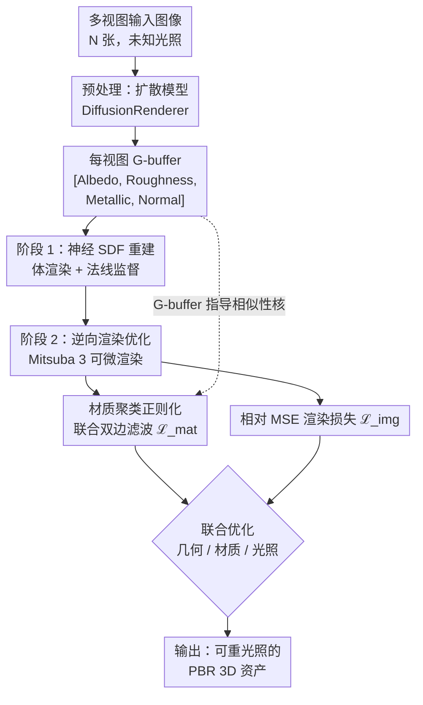

# Diffusion-Based Material Regularization for Physics-Based Inverse Rendering

**会议**: ECCV 2026  
**arXiv**: [2606.31065](https://arxiv.org/abs/2606.31065)  
**代码**: [https://github.com/gerwang/diffusion-regularized-inverse-rendering](https://github.com/gerwang/diffusion-regularized-inverse-rendering) (有)  
**领域**: 3D视觉  
**关键词**: 逆向渲染、材质分解、扩散模型、联合双边滤波、物理渲染

## 一句话总结
将扩散模型预测的 G-buffer 不作为目标值而是作为相似性核（similarity kernel），通过联合双边滤波正则化在优化中隐式地对同材质区域聚类，在保持输入图像拟合精度的同时消除烘焙伪影，实现高质量 PBR 资产重建。

## 研究背景与动机

从多视角图像重建物理基础 3D 资产（几何、材质、光照）是计算机视觉与图形学的核心问题。物理逆向渲染（physics-based inverse rendering）通过可微渲染器优化材质参数以拟合输入图像，提供了准确的光照物理模型。然而这一优化过程严重欠约束：在未知光照和稀疏视角下，照明信息极易被「烘焙」进材质（illumination baked into materials），导致在新视角或新光照下重渲染时出现阴影持久、色彩偏移等明显伪影。纯数据驱动的扩散模型则从另一个方向切入——这类方法能直接从图像预测视觉合理的材质 G-buffer（基础色、粗糙度、金属度法线），且天然不含烘焙伪影，然而其预测并不满足渲染方程，无法精确复现输入图像。

两条路线的核心矛盾在于：物理逆向渲染的渲染方程精确但缺少先验约束，扩散模型提供强先验却缺乏像素级的物理保真度。现有工作主要把扩散预测当作初始值或通过分数蒸馏（score distillation）拉近优化结果，但这些方法要么在优化中快速重新引入烘焙，要么因全局调整而丢失局部细节。本文的核心 idea 是**将扩散模型预测的 G-buffer 不是当作「要逼近的目标值」，而是当作「材质相似性核」——在优化中通过联合双边滤波正则化惩罚扩散预测认为属于同一材质的像素之间的物理解偏差，让优化在保持输入图像匹配度的同时自动在同类材质区域共享观测信息。**

## 方法详解

### 整体框架

方法分为三个串行阶段。首先用条件扩散模型（DiffusionRenderer）为每张输入视图预测 4 通道 G-buffer（基础色、粗糙度、金属度、法线）。然后以这些 G-buffer 中的法线为监督信号，通过神经体渲染从多视图重建体素网格 SDF，再用 Marching Cubes 提取初始网格。最后在 Mitsuba 3 可微渲染器中，联合优化网格几何、空间变化的 Disney BRDF 材质参数（基础色、粗糙度、金属度）和球面环境光照，优化的核心是两个损失：相对 MSE 的渲染光度损失，以及本文提出的基于扩散 G-buffer 的材质聚类正则化损失。

### 关键设计

**1. 隐式材质聚类正则化：把扩散预测当作相似性核**

物理逆向渲染中每个表面对偶点仅被有限视角观测，易将阴影烘焙为纹理。扩散模型预测的 G-buffer 虽不含烘焙伪影，但直接拉近到预测值会与渲染光度损失冲突。本文的关键设计是把扩散预测的 G-buffer 当作一个隐式的材质相似性核：对于同一视图中的像素 p 和 q，定义它们在预测 G-buffer 空间中的相似度为高斯核 $k_{p,q}(\mathbf{g}) = \exp(-\| \mathbf{g}_p - \mathbf{g}_q \|_2^2 / 2\sigma_g^2)$，其中 $\mathbf{g}$ 是扩散预测的 [Albedo, Roughness, Metallic] 拼接向量。然后对优化中的渲染 G-buffer $\hat{\mathbf{g}}$ 施加联合双边滤波（JBF），让每个像素的值被其 G-buffer 邻居的加权平均"拉拢"——这个权重由扩散预测的相似度决定，而非由当前优化状态决定。正则化损失正是 $\hat{\mathbf{g}}$ 与 JBF 滤波结果之间的 L1 距离。这样设计巧妙之处在于：扩散模型认为自己属于同一材质的区域（G-buffer 值接近）在优化中被迫收敛到接近值、共享观测信息从而减少自由度抑制烘焙；但扩散模型预测不准确导致的系统性偏差（如整个区域偏亮）不被惩罚，因为正则化只关心区域内的一致性而不指定绝对目标值。

**2. 尺度无关的 Albedo 变换：解耦光照-材质模糊**

在未知光照下直接正则化 Albedo 会引起一个微妙的耦合问题：优化器可能把 Albedo 整体调暗以降低正则化损失，同时光照变亮补偿外观，导致光照估计失真。本文的解决方案是把渲染的 Albedo $\hat{\mathbf{A}}$ 变换到对数空间再做正则化：$\psi(\hat{\mathbf{A}}) = \text{sg}(\hat{\mathbf{A}}) \odot \log([\hat{\mathbf{A}}]_\epsilon)$。对数映射将区域内的乘法缩放变成加法偏移——在 L1 损失中偏移被正则化项中的差值抵消（$\mathbf{\hat{g}} - \text{JBF}(\mathbf{\hat{g}})$），因此全局 Albedo 缩放不受惩罚。$\text{sg}(\hat{\mathbf{A}})$ 作为梯度缩放补偿则消除了对数函数对暗区域的不均衡梯度放大。这一变换让正则化只关心同材质区域的相对一致性而不强加绝对亮度，有效解耦了光照与 Albedo 的歧义性。

**3. 基于 G-buffer 法线的神经表面重建监督**

在 SDF 重建阶段，本文增加了一个法线监督损失：鼓励体渲染得到的法线缓冲区 $\hat{\mathbf{N}}_i$ 与扩散模型预测的法线 $\mathbf{N}_i$ 保持一致，使用 Huber 损失 $\mathcal{L}_{\text{shape}} = \sum_i \sum_p H_\delta(1 - \hat{\mathbf{N}}_{i,p}^\top \mathbf{N}_{i,p})$。Huber 函数在角度差超过 $15^\circ$ 时降低权值（$\delta=0.03$），增强对扩散预测中法线噪声的鲁棒性。消融实验表明这一损失对高光表面尤为重要——没有它重建表面会出现凹陷伪影，进而引入严重的镜面高光异常。这一设计并未直接将扩散法线当作 ground truth，而是提供一个可靠的先验引导，在扩散模型的统计先验和物理渲染的几何约束之间取得平衡。

### 损失函数 / 训练策略

总损失 $\mathcal{L} = \mathcal{L}_{\text{img}} + \lambda_{\text{mat}} \mathcal{L}_{\text{mat}}$。$\mathcal{L}_{\text{img}}$ 为相对 MSE（防止 HDR 图像中少数亮像素主导）、$\mathcal{L}_{\text{mat}}$ 为上述材质聚类正则化（$\lambda_{\text{mat}}=0.1$）。模型使用 Dictionary Fields 参数化空间变化 BRDF 和环境光照，初始学习率 $3\times10^{-2}$ 余弦退火至 $10^{-3}$，共 900 次迭代。单 RTX 5090 GPU 上 SDF 阶段约 10 分钟、扩散预处理约 15 分钟、逆向渲染约 7 分钟。

## 实验关键数据

### 主实验

| 数据集 | 重光照 PSNR | 本文 | Neural-PBIR | MaterialFusion | 提升 |
|--------|-------------|------|-------------|----------------|------|
| Stanford-ORB | PSNR-H↑ | **27.22** | 26.07 | 23.52 | +1.15dB vs SOTA |
| Synthetic4Relight | PSNR↑ | **32.02** | 27.83 | 20.20 | +4.19dB |
| DTC-Synthetic | PSNR↑ | **43.21** | 39.18 | 28.63 | +4.03dB |

### 消融实验

| 配置 | Stanford-ORB PSNR-H | Stanford-ORB LPIPS | 说明 |
|------|---------------------|-------------------|------|
| 完整模型 | **27.22** | 0.0213 | 最佳重光照 |
| w/o 正则化 ℒ_mat | 26.11 (-1.11dB) | 0.0223 | 优化重回烘焙伪影 |
| Diffusion-BP（直接反投预测） | 26.06 | 0.0333 | 预测不满足渲染方程 |
| 全局尺度不变损失 | 26.38 | 0.0225 | 无法做逐区域校正 |
| d-s 相关正则化 | 26.37 | 0.0215 | 烘焙传递至材质 | 

### 关键发现
- **正则化设计是最关键组件**：去掉 ℒ_mat 后重光照 PSNR 下降 1.11dB，且烘焙阴影重新出现（如 Block_RedBlue 的投射阴影图案、grogu_scene003 的点状镜面高光）
- **扩散模型无关性**：将上游预测模型从 DiffusionRenderer 切换为 RGB↔X 后，本文正则化依然优于尺度不变损失（+0.51dB），增益主要来自正则化设计而非特定扩散模型
- **跨管线迁移有效**：将本文正则化替换 IRGS 的平滑项后，4 个场景平均 PSNR 提升 +0.80dB
- **鲁棒性强光场景**：在强方向光照和硬投射阴影下，纯物理优化会吸收阴影至材质，本文正则化因隐式共享同材质区域观测而有效抑制了阴影烘焙

## 亮点与洞察
- **最巧妙的 insight**：不把扩散预测当「答案」当「核」——这个范式切换让正则化只惩罚区域内不一致、不惩罚区域整体偏差，天然容错
- **解析性贡献**：Albedo 对数变换用停止梯度加乘法补偿的数学技巧，简洁地解耦了 Albedo-光照歧义性
- **通用性**：正则化不依赖特定扩散模型，也不依赖特定逆向渲染管线，在两个不同 pipeline（本文的 Mitsuba + IRGS 的 2DGS）上均有效
- **实用价值**：全流程在单卡 RTX 5090 上仅需约 32 分钟，直接产出标准 PBR 资产，可直接在游戏引擎中渲染

## 局限与展望
- 假设扩散预测在同材质区域内局部一致；当外观超出发布范围时（罕见外观），先验不可靠且可能过度正则化导致材质模糊
- DiffusionRenderer 分辨率有限，高保真细节缺乏约束；期待更高分辨率的扩散模型
- G-buffer 拼接核设计在当前 DiffusionRenderer 下最优，随模型演进可能需要调整
- 阴影边界附近仍有残余伪影，归因于几何不完美；未来可探索用正则化信号反馈改进形状

## 相关工作与启发
- **vs Neural-PBIR**：纯分析合成法，无学习先验，严重欠约束时烘焙阴影明显；本文用扩散预测核提供稀疏观测的有效约束
- **vs MaterialFusion**：用分数蒸馏拉近扩散预测，缺乏逐区域校正机制，出现过平滑和颜色漂移；本文用 JBF 正则化允许区域自适应偏移
- **vs VideoMat / IntrinsicAnything**：使用全局尺度不变损失压制烘焙，但无法处理材质的局部不准确性（如金属箔字标细节丢失）；本文核适用于不同材质的逐区域校正

## 评分
- 新颖性: ⭐⭐⭐⭐☆ [范式创新：把扩散预测从「目标值」变为「相似性核」的视角转换干净利落；对数 Albedo 变换是优雅的小技巧]
- 实验充分度: ⭐⭐⭐⭐⭐ [3 个数据集 + 7+ 个基线 + 3 组消融（正则化类型/设计/上游模型）+ 跨管线迁移实验 + 补充材料大量可视化，说服力强]
- 写作质量: ⭐⭐⭐⭐⭐ [方法叙述清晰，动机链完整，定位精准，每个章节读者知道为什么看]
- 价值: ⭐⭐⭐⭐⭐ [直接提升 SOTA PBR 资产重建质量；正则化设计通用可迁移，实用性强]

<!-- RELATED:START -->

## 相关论文

- [\[CVPR 2026\] MatMart: Material Reconstruction of 3D Objects via Diffusion](../../CVPR2026/3d_vision/matmart_material_reconstruction_of_3d_objects_via_diffusion.md)
- [\[ECCV 2026\] Geo-ID: Test-Time Geometric Consensus for Cross-View Consistent Intrinsics](geo-id_test-time_geometric_consensus_for_cross-view_consistent_intrinsics.md)
- [\[ECCV 2026\] FiCA: Feed-forward Instant Gaussian Codec Avatars from a Single Portrait Image](fica_feed-forward_instant_gaussian_codec_avatars_from_a_single_portrait_image.md)
- [\[ECCV 2026\] AC3S: Adaptive Conditioning for 3D-Aware Synthetic Data Generation](ac3s_adaptive_conditioning_for_3d-aware_synthetic_data_generation.md)
- [\[CVPR 2026\] SGS-Intrinsic: Semantic-Invariant Gaussian Splatting for Sparse-View Indoor Inverse Rendering](../../CVPR2026/3d_vision/sgs-intrinsic_semantic-invariant_gaussian_splatting_for_sparse-view_indoor_invers.md)

<!-- RELATED:END -->
