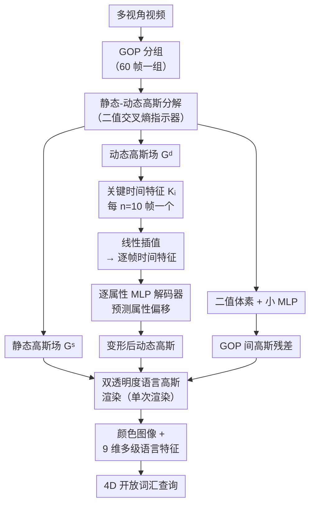

# DLGStream: Dynamic Language-embedded Gaussian Splatting for Open-vocabulary Enabled Free-viewpoint Video Streaming

**会议**: ECCV2026  
**arXiv**: [2606.28840](https://arxiv.org/abs/2606.28840)  
**代码**: [https://github.com/kkkzh/DLGStream](https://github.com/kkkzh/DLGStream)  
**领域**: 3D视觉  
**关键词**: 三维高斯泼溅, 自由视角视频, 开放词汇查询, 语言特征嵌入, 插值变形场

## 一句话总结
DLGStream 提出双透明度语言高斯表示和基于时间特征插值的变形场，在对多视角动态场景进行高质量自由视角视频重建的同时嵌入可流式传输的时空语言特征，以平均 43 KB 的帧大小实现实时 4D 开放词汇查询和帧插值。

## 研究背景与动机

基于三维高斯泼溅（3DGS）的自由视角视频（FVV）重建方法近年来发展迅猛，通过将 3DGS 扩展到动态场景并支持逐帧流式传输，在重建质量和帧率上已全面超越基于 NeRF 的方案。然而，这些 FVV 表示从根本上只包含几何和颜色参数，用户无法对场景进行语义交互——例如用自然语言查询某个物体、对场景进行编辑、或实现具身智能中的环境理解。这正是当前 3DGS 类 FVV 方法相比于传统视频流最大的体验短板：你有高保真的 4D 场景，却无法问一句"杯子在哪里"。

最近，LangSplat 等工作通过将 CLIP 语言特征蒸馏到 3DGS 中，使静态场景具备了开放词汇查询能力。其后续工作 4DLangSplat 将这一思路扩展到动态场景，支持时间感知的 4D 查询。但 4DLangSplat 的设计完全不适合 FVV 场景：它延续了 LangSplat 的三级语言特征（分别对应 SAM 的大/中/小物体分割掩膜）分离建模策略，为每一级独立训练一个语言高斯场，这意味着要传输三个独立的动态高斯模型，帧大小暴增三倍；推理时需三次渲染才能获取全部级别的语言特征，FPS 骤降到 15。更严重的是，当尝试将语言特征与颜色联合优化时，颜色重建质量显著下降——因为颜色和语言特征有不同的物理属性，共享的不透明度参数在优化方向上产生了根本冲突。这些矛盾使得现有语言高斯表示完全无法用于自由视角视频流。

本文的核心切入角度是双重的：既然颜色和语言特征需要不同的不透明度来表征自己的渲染过程，那就把不透明度解耦，让两者各自独立做 alpha blending；同时利用真实视频中物体运动的连续性，只在关键帧维护时间特征，非关键帧通过插值得出，从而大幅压缩帧大小、并自然地支持帧插值。**核心 idea：提出双透明度语言高斯表示（为颜色和语言特征分别维护独立不透明度）和基于时间特征线性插值的变形场（仅存储 $T/n$ 个关键时间特征、插值得非关键帧特征），在保持高质量 FVV 重建的同时将语言特征嵌入为可流式传输的 4D 表示，以平均 43 KB 的帧大小实现实时 4D 开放词汇查询和 4D 帧插值。**

## 方法详解

### 整体框架

DLGStream 的整体架构分为四个阶段。首先，将多视角视频按 GOP（Group of Pictures，默认 60 帧）分组，并借鉴 Swift4D 的方案做静态-动态高斯分解——引入一个辅助二值交叉熵损失来学习每个高斯的动态指示器，将高斯分为静态场 $\mathcal{G}^s$ 和动态场 $\mathcal{G}^d$，只有动态高斯需要学习形变。随后，动态高斯场的属性偏移由一个基于插值的变形场预测：在每个 GOP 内每隔 $n=10$ 帧维护一个关键时间特征 $k_i$，非关键帧的时间特征通过相邻关键帧线性插值得到 $k_t = \text{Lerp}(k_i, k_{i+1}, t)$，再送入逐属性的小型 MLP 解码器 $\mathcal{D}_a$，分别预测位置、协方差、不透明度、颜色和语言特征的偏移量。之后，静态高斯与变形后的动态高斯一同送入**双透明度语言高斯渲染器**，在单次渲染中同时输出颜色图像和 9 维多级语言特征图（每 3 维对应 SAM 的一个级别）。对于后续 GOP，以二值体素编码相对于前一 GOP 的高斯属性残差，通过小 MLP 解码后继续走变形场和渲染流程。

### 关键设计

**1. 双透明度语言高斯表示：用独立不透明度解耦颜色与语言特征的渲染冲突**

将 9 维语言特征直接作为额外属性加入高斯并联合优化颜色和语言时，颜色重建质量显著下降。关键洞察在于：位置、旋转和缩放只定义场景的几何分布，与具体渲染内容无关；但不透明度直接参与 alpha blending 渲染过程，而颜色和语言特征有截然不同的物理倾向——颜色需要较低的不透明度来表现微妙的纹理细节和高光变化（如透明区域或反光边缘），语言特征则是语义层面的，一个物体内部的语义响应应当一致、不应半透明。因此共享的不透明度参数被拉扯在两个方向，无法同时满足两者的优化目标。

DLGStream 的解决方案是为颜色和语言特征分别维护独立的不透明度 $o^c \in \mathcal{O}^c$ 和 $o^l \in \mathcal{O}^l$，各自的渲染通过独立的 alpha blending 公式完成（都使用原有顺序，只是各自的不透明度值不同）：

$$R_c(x) = \sum_{m \in N} c_m o_m^c \prod_{j=1}^{m-1} (1-o_j^c), \quad R_l(x) = \sum_{m \in N} f_m o_m^l \prod_{j=1}^{m-1} (1-o_j^l)$$

为了防止颜色和语言的渲染表面出现空间错位，语言特征渲染时复用了颜色渲染的深度排序和透明度累积截断。反向传播时两个不透明度的梯度也相互独立。实验中的统计分布证实了这一设计的必要性：颜色不透明度集中在 0.3（需要低值表现纹理细节），语言特征不透明度集中在 0.5（语义一致性要求更高），且同一高斯的两个不透明度随时间独立演化、差异明显。

**2. 基于时间特征插值的变形场：降冗余 + 支持帧插值**

现有 FVV 方法每一帧都要学习独立的时间特征，引入语言特征后更显著增加了帧大小。但真实视频中物体运动连续，相邻帧的时间特征高度冗余。DLGStream 借鉴视频插值的思想，在一个 GOP 内仅维护 $T/n$ 个可学习的关键时间特征（默认 60 帧、间隔 10，即 6 个关键特征）。对非关键时间戳 $t$，用相邻关键特征线性插值得到 $k_t = \text{Lerp}(k_i, k_{i+1}, t)$。插值后的时间特征送入逐属性 MLP 解码器，预测每个动态高斯属性的偏移量 $\Delta a_t^d = \mathcal{D}_a(k_t)$，最终变形后的属性为 $a_t^d = a^d + \Delta a_t^d$。

这个设计有两个关键优势。第一，存储的时间特征从 $T$ 压缩到 $T/n$（原始帧数的 1/10），且时间特征被组织为 2D 图像序列后用标准视频编码器（H.264 / HEVC）进一步压缩——时间特征部分的帧大小仅 20-30 KB。第二，由于插值连续建模了时间变化，该方法天然支持 4D 帧插值：可以用低 FPS（如 10 FPS）训练、高 FPS（如 30 FPS）渲染，实验中即使训练时跳过 9 帧（3 FPS 训练），渲染质量仍具竞争力。为促进相邻时间特征的连续性，还引入了时序正则化损失 $\mathcal{L}_{tsr} = L1(k_i, k_{i+1})$。

**3. GOP-by-GOP 残差训练与二值体素压缩：消除跨 GOP 闪烁且支持并行**

现有基于 GOP 的 FVV 方法在不同 GOP 间存在明显的亮度闪烁伪影。这是因为每个 GOP 独立训练的高斯颜色参数代表了该 GOP 内的平均颜色，相邻 GOP 的平均值不同且没有时间约束，拼接时亮度不一致。DLGStream 的解决思路是以已训练好的前一 GOP $g-1$ 的高斯属性作为初始化，当前 GOP 只学习相对于前一 GOP 的残差 $\mathcal{G}_g^s = \mathcal{G}_{g-1}^s + \mathcal{R}_g^s$（静态）和 $\mathcal{G}_g^d = \mathcal{G}_{g-1}^d + \mathcal{R}_g^d$（动态），从而只有残差值需要存储和传输。

残差的压缩借鉴 BiRF 的二值化思路，用多层级二值体素（每个体素值约束为 +1 或 -1）配合一个小 MLP 来编码残差的空间分布：对位置 $\mathcal{X}$ 处的高斯，三线性插值二值体素后过 Sigmoid 得到空间特征 $f_g$，再通过 MLP 预测残差。训练时引入熵损失 $\mathcal{L}_e$ 最小化二值体素的比特数。跨 GOP 的首尾时间正则化 $\mathcal{L}_{tsr} = L1(k_{T/n}^g, k_0^{g-1})$ 强制前后 GOP 的首尾时间特征一致，不同 GOP 的时间特征可编码到统一视频中进一步压缩。这种训练方式还支持并行化——后续 GOP 都基于第一 GOP 的初始化训练，训练时间可减少 2.7-3.8 倍。

### 损失函数 / 训练策略

第一 GOP 的总损失为 $\mathcal{L} = \alpha \mathcal{L}_{rgb} + (1-\alpha) \mathcal{L}_{ssim} + \beta \mathcal{L}_{tsr} + \psi \mathcal{L}_l$，其中 $\mathcal{L}_l = L1(R_l, \text{concat}(I_l^{small}, I_l^{mid}, I_l^{large}))$ 是渲染语言特征与三级 CLIP 标签拼接后的 L1 损失。后续 GOP 需加入二值体素熵项 $\mathcal{L}_e$。默认配置为 GOP = 60、关键帧间隔 $n=10$，时间特征用 libx265（crf=6）编码。DLGStream 兼容 3DGS 和 Scaffold-GS 两种基础表示：前者直接在高斯属性上加偏移，后者对 anchor 属性加偏移再经 MLP 解码。

## 实验关键数据

### 主实验

DLGStream 在 N3DV、MeetRoom 和 WideRange4D 三个多视角动态场景数据集上与已有方法进行全面对比。

| 任务 | 指标 | 4DLangSplat | Ours(3DGS) | Ours(ScaffoldGS) |
|------|------|-------------|------------|------------------|
| 4D 开放词汇查询 (N3DV) | mIoU ↑ | 75.5% | **85.8%** | 84.7% |
| 4D 开放词汇查询 (N3DV) | mAcc ↑ | 90.4% | **96.2%** | 96.0% |
| 颜色+语言联合优化 (N3DV) | PSNR ↑ | 30.99 | **32.15** | 32.04 |
| 颜色+语言联合优化 (N3DV) | 帧大小 (KB) ↓ | 431 | 97.11 | **46.33** |
| 颜色+语言联合优化 (N3DV) | FPS ↑ | 15 | **83** | 48 |

在纯 FVV 重建任务上（不含语言特征），DLGStream 进一步达到 SOTA 水平：

| 方法 | PSNR ↑ (N3DV) | 帧大小 (KB) ↓ | FPS ↑ | PSNR ↑ (MeetRoom) |
|------|---------------|---------------|-------|-------------------|
| StreamSTGS | 32.30 | 174 | 100 | 27.41 |
| Ours(3DGS) | 32.26 | **92.04** | **107** | **27.48** |
| GIFStream | 30.76 | **38.04** | 97 | 24.37 |
| Ours(ScaffoldGS) | **31.93** | 42.42 | 88.27 | **27.28** |

### 消融实验

| 配置 | mIoU ↑ | PSNR ↑ | 说明 |
|------|--------|--------|------|
| Ours(3DGS)-单不透明度 | 78.99% | 31.73 | 颜色与语言特征共用不透明度 |
| Ours(3DGS)-双不透明度 | **85.78%** | **32.15** | 完整模型 |
| Ours(ScaffoldGS)-单不透明度 | 79.62% | 31.88 | 同上，ScaffoldGS 基础 |
| Ours(ScaffoldGS)-双不透明度 | **84.69%** | **32.04** | 完整模型 |
| 最近邻插值变形场 | — | 31.35 | 存储 66.48 KB |
| 双线性插值（默认） | — | 31.93 | 存储 **42.42 KB** |
| 双三次插值变形场 | — | 32.20 | 存储 80.24 KB |

### 关键发现

- **双透明度是性能提升的核心**：去掉双不透明度后 mIoU 从 85.8% 骤降到 79.0%，PSNR 也从 32.15 降到 31.73——这个简单的改动带来了约 7 个点的语义分割精度提升，同时不牺牲颜色质量。
- **不透明度分布差异清晰可辨**：可视化分析显示，颜色不透明度集中在 0.3（低不透明度才能表现纹理细节），语言特征不透明度集中在 0.5（语义一致性），且随时间独立演化，说明双透明度学到了不同的物理含义。
- **时间特征的帧大小仅 20-30 KB**：由于插值压缩和视频编码器的高效性，时间特征只占整体帧大小的约 1/3，其余主要是静态高斯属性本身——意味着静态高斯压缩的进展可以无缝整合到框架中进一步降帧大小。
- **4D 帧插值效果出人意料地好**：即使训练时跳过 9 帧（只用了 3 FPS 的数据训练），重建 SSIM 仅从 0.944 降到 0.936，说明插值变形场确实学到了运动的时间相关性。

## 亮点与洞察

- **双透明度解耦极具洞察力和通用性**：表面只是加了一个额外的可学习不透明度参数，但其背后是对颜色和语言特征物理性质差异的深刻理解。不透明度分布的统计分析（颜色倾向透明、语义倾向不透明）为这种差异提供了直接证据，使这个改动不是拍脑袋而是有物理依据的。
- **时间特征插值一举两得**：既通过减少存储帧数降低了帧大小，又天然支持了 4D 帧插值——这意味着可以低 FPS 录制或传输、解码时高 FPS 渲染，非常适合带宽受限的应用场景。
- **二值体素压缩残差非常轻量**：跨 GOP 的高斯残差仅约 2 KB，归功于 ±1 二值体素的空间编码和 tiny MLP 解码，设计简洁、存储高效。
- **双框架兼容性**在 3DGS 和 Scaffold-GS 两种基础表示上都得到了验证，说明三个核心设计（双透明度、插值变形场、GOP-by-GOP 残差训练）是通用的语言嵌入 FVV 组件，可以迁移到未来的新 3D 表示上。

## 局限与展望

- **帧插值完全依赖自身变形场，未用外部先验**：目前帧插值仅依靠插值变形场的线性假设，在长步长插值（跳过 9 帧）时质量仍有明显下降。未来可引入光流或视频扩散模型作为外部先验来改善大跨度插值。
- **静态高斯属性压缩仍是瓶颈**：从存储分解来看（表 7），高斯属性本身占帧大小的主要部分（3DGS 基础下 64 KB / 92 KB），语言特征和时间特征加起来才 ~30 KB。这意味着直接集成 HAC 等先进的静态高斯熵编码方法可以进一步降低整体帧大小。
- **依赖多视角输入**：方法假设多视角视频作为输入，对单目视频或稀疏视角的场景尚不适用。
- **并行训练略逊于顺序训练**：虽然并行模式显著加速训练（2.7-3.8 倍），但在 mIoU 和 mAcc 上有微小下降，并行策略的精度还有提升空间。

## 相关工作与启发

- **vs 4DLangSplat**: 4DLangSplat 为三个语言级别各建一个模型，导致帧大小 3 倍、渲染 3 倍慢、且联合优化退化。DLGStream 用一个统一 9 维特征向量编码三级语言特征、单次渲染完成，配合双透明度消除退化，帧大小降低 10 倍、FPS 提升 5 倍。
- **vs StreamSTGS**: 同为天津大学工作的 FVV 方案，StreamSTGS 在纯重建上达到相近的 PSNR（32.30 vs 32.26），但不支持语言交互。DLGStream 在此基础上额外支持了开放词汇查询和帧插值，帧大小还低了一半。
- **vs GIFStream**: GIFStream 帧大小更小（~38 KB），但其 RD 曲线在同等码率下质量不如 DLGStream，且存在跨 GOP 闪烁问题——DLGStream 的残差式 GOP-by-GOP 训练从根本上解决了此问题。
- **双透明度思路有更广的应用前景**：任何涉及多模态属性（颜色、语义、法线、深度等）联合渲染的高斯表示都可以参考这个思路，为不同属性分别维护不透明度来避免优化冲突。

## 评分

- 新颖性: ⭐⭐⭐⭐ 双透明度解耦思路简洁有力、有物理洞察，时间特征插值将视频插值思想巧妙迁移到 4DGS 压缩，整体创新组合得当。
- 实验充分度: ⭐⭐⭐⭐⭐ 在三个数据集（含 360° 大场景 WideRange4D）上对比了 10+ 个基线，消融实验覆盖了每个关键设计，包含罕见的不透明度分布统计分析。
- 写作质量: ⭐⭐⭐⭐⭐ 动机层层递进，问题定义清晰，方法段公式和图配合得当，附录丰富详实。
- 价值: ⭐⭐⭐⭐ 填补了语言嵌入 FVV 这一空白，实际部署价值高（帧大小可控、FPS 可达实时），双透明度设计对类似联合优化问题有通用启发意义。

<!-- RELATED:START -->

## 相关论文

- [\[AAAI 2026\] StreamSTGS: Streaming Spatial and Temporal Gaussian Grids for Real-Time Free-Viewpoint Video](../../AAAI2026/3d_vision/streamstgs_streaming_spatial_and_temporal_gaussian_grids_for_real-time_free-view.md)
- [\[NeurIPS 2025\] Motion Matters: Compact Gaussian Streaming for Free-Viewpoint Video Reconstruction](../../NeurIPS2025/3d_vision/motion_matters_compact_gaussian_streaming_for_free-viewpoint_video_reconstructio.md)
- [\[ECCV 2026\] OP3DSG: Open-Vocabulary Part-Aware 3D Scene Graph Generation for Real-World Environments](op3dsg_open-vocabulary_part-aware_3d_scene_graph_generation_for_real-world_envir.md)
- [\[CVPR 2026\] Stabilizing Streaming Video Geometry via Dynamic Feature Normalization](../../CVPR2026/3d_vision/stabilizing_streaming_video_geometry_via_dynamic_feature_normalization.md)
- [\[ECCV 2026\] MeGAS: Thermomechanical Dynamic Gaussian Splatting for Thermophysical Scene Editing](megas_thermomechanical_dynamic_gaussian_splatting_for_thermophysical_scene_editi.md)

<!-- RELATED:END -->
