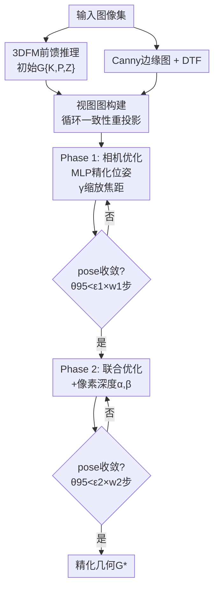

# EPO: Boosting 3D Foundation Models with Edge-based Pose Optimization

**会议**: ECCV 2026  
**arXiv**: [2607.00579](https://arxiv.org/abs/2607.00579)  
**代码**: [https://github.com/mattiadurso/EPO](https://github.com/mattiadurso/EPO)  
**领域**: 3D视觉  
**关键词**: 3D重建, 运动恢复结构, 位姿优化, 边缘对齐, 3D基础模型

## 一句话总结

提出EPO，一种无需显式特征track的几何优化框架，利用Canny边缘图和距离变换场构造可微的边缘重投影损失，通过两阶段自适应优化精化3D基础模型输出的相机参数和深度，在消费级GPU上以秒级运行时间达到甚至超越传统BA方法的几何精度。

## 研究背景与动机

从无序图像集合中恢复场景的三维结构和相机运动（Structure-from-Motion, SfM）是计算机视觉最基础的问题之一。传统SfM管线通过特征提取与匹配建立图像间的2D对应，再通过光束法平差（Bundle Adjustment, BA）联合优化相机位姿和3D点坐标。这套框架几十年来不断进化，但在纹理贫乏场景（如室内白墙、大面积地面）和多视角稀疏场景中经常力不从心——点特征如SIFT在这种环境下不可靠，导致匹配失败或精度大幅下降。

近年3D基础模型（3DFM）的兴起开辟了全新路线。VGGT、MapAnything、Pi3等模型通过在大量3D数据上训练，能以纯前馈方式一次性预测所有图像的相机参数和深度图，数秒内完成重建。然而这些模型有一个根本短板：前馈推理虽然快，但几何精度远不及传统SfM。如果跑后处理BA来提升精度，就必须重新提取特征点并建立跨视角的3D-2D track——这个步骤不仅耗时数分钟，而且显存需求极高（通常40GB以上），在消费级显卡上根本无法运行。传统方法加BA等于丢掉了3DFM的"秒级"速度优势，不加BA精度又不够，两者似乎不可兼得。

本文的切入角度从根本上跳出了"点特征→track→BA"的思维定式。作者观察到：图像中蕴含的边缘结构在视角变化下相对稳定，且每一幅图像的边缘在被投影到另一幅图像后，其在距离变换场上的采样值天然构成了一个可微分的几何对齐度量——这完全不需要显式建立任何3D-2D点对应。**核心idea：用边缘图对齐替代特征track作为几何约束信号，通过Canny边缘检测和距离变换场构造可微的重投影损失，用一阶优化器精化3DFM输出的相机参数和深度，在不提取任何特征的情况下达到超越BA的精度。**

## 方法详解

### 整体框架

EPO的输入是一组无序RGB图像和3D基础模型（如VGGT）输出的初始几何估计 G = {(K_i, P_i, Z_i)}。预处理阶段对每幅图像用Canny提取边缘图并计算距离变换场（DTF），然后通过循环一致性重投影构建视图图（viewgraph）确定哪些图像对参与优化。优化分为两阶段串联：先只优化相机内参和位姿，待位姿稳定后加入深度精化，全部由一阶梯度驱动。

### 关键设计

**1. 基于边缘的可微几何对齐——用DTF替代特征track**

这是EPO最核心的设计。对每幅图像 I_i 用Canny检测子提取边缘图 E_i，再对其做精确L2距离变换得到DTF_i——每个像素的值等于它到最近边缘的欧氏距离。对于视图图中的一对图像(i, j)，将I_i的每个边缘像素按当前相机参数投影到I_j上，在DTF_j中采样该投影位置的距离值，所有边缘点的平均距离就是i→j方向的重投影误差。双向求和得到该图像对的边缘对齐损失，其中Huber损失抑制离群值的影响，λ截断阈值从10退火到6进一步提升鲁棒性。整个投影函数π从3D到2D全程可微，梯度可以一路回传到相机参数和深度。

这样做的意义在于：边缘点的密度远高于稀疏特征点（实验中EPO产生1.7倍的2D观测），在纹理贫乏区域提供了更丰富的几何约束；同时DTF在投影位置上的采样操作可以写成高效的Triton kernel，无需为建立track而展开稠密特征相关和自注意力计算，显存开销大幅降低。

**2. MLP加残差的双轨位姿精化**

直接对位姿矩阵做梯度优化容易使旋转部分偏离SO(3)流形。EPO采用一个6层MLP（隐层128维，第3层后跳接）接收当前位姿并输出偏移量，偏移量用6D连续旋转表示，通过Gram-Schmidt正交化恢复有效旋转矩阵。MLP的全部参数零初始化，保证优化从初始估计平滑起步。

作者发现MLP单独很难准确预测平移偏移——平移的尺度变化范围大，网络容易欠拟合细粒度调整。为此引入一个额外的可学习参数δ_i作为平移残差偏移。最终位姿更新为 $P_i^s = \phi(P_i^0 + \mathrm{MLP}(P_i^0)) + [0 | \delta_i]$。消融实验显示MLP贡献+2.0 AUC，δ_i进一步贡献+1.8 AUC——两者的互补效果非常明显，MLP负责旋转的结构性调整，δ_i专门吸收平移的残余误差。

**3. 两阶段自适应调度与pose-based早停**

优化器需要同时处理相机参数、位姿和深度，不同参数的收敛节奏不同。EPO采用两阶段调度：Phase 1只优化相机内参和位姿（焦距通过缩放因子γ_i更新：$f_i^s = f_i^0 \cdot (1 + \gamma_i)$），深度保持冻结。当位姿变化趋于稳定——即95分位的旋转变化ΔR_95和翻译变化Δt_95均低于ε_1=0.5°且维持w_1=25步——才进入Phase 2，加入深度优化。深度以像素级仿射变换参数化：$Z_{i,(x,y)}^s = Z_{i,(x,y)}^0 \cdot \alpha_{i,(x,y)} + \beta_{i,(x,y)}$，比单偏移或全局缩放效果更好。Phase 2在更严格条件下终止（ε_2=0.1°，w_2=50步）。

一个值得注意的细节是停止准则的选择。loss-based早停经常因为loss先于位姿收敛而提前终止，显著损害精度（平均仅有80.8 AUC vs 最优的83.6）。而pose-based停止准则直接监控位姿本身，在达到82.2 AUC的同时将运行时间从25秒缩减到约7秒——这是精度与效率的最佳平衡点。

### 损失函数 / 训练策略

全局损失为视图图ε上所有有效图像对的平均双向边缘重投影Huber损失：
$$ \mathcal{L} = \frac{1}{|\mathcal{E}|} \sum_{(i,j) \in \mathcal{E}} \mathcal{L}_{ij} $$

优化器使用AdamW（β1=0.9, β2=0.999, weight decay=0.01，δ项的weight decay提高至0.1以加强正则）。学习率从0开始warm-up 25步到3e-3，随后余弦退火衰减至最多2000步。MLP和边缘提取使用BF16混合精度，其余组件使用FP32。每步从视图图中随机采样M=1024个图像对（子集SGD），保证计算开销不随场景规模增长。

## 实验关键数据

### 主实验

| 数据集 | 指标 | VGGT | +BA | +Ref+BA† | +EPO |
|--------|------|------|-----|---------|------|
| ScanNet++ | AUC@5°↑ | 55.6 | 70.0 | 70.9 | **77.1** |
| | 时间(s)↓ | 37.1 | 171.6 | 303.5 | **52.1** |
| TerraSky3D | AUC@5°↑ | 56.8 | 71.1 | 75.5 | **79.2** |
| | 时间(s)↓ | 31.0 | 226.1 | 337.7 | **44.6** |
| Mip-NeRF 360 | AUC@5°↑ | 72.2 | 85.5 | 87.8 | **90.5** |
| | 时间(s)↓ | 41.9 | 103.9 | 210.2 | **49.6** |

EPO在所有三个数据集上的AUC均为最优，同时运行时间仅比原始VGGT多十几秒（BA方法需数分钟）。注意BA和Ref+BA需要H200才能运行（†标记），而EPO在RTX 4090上即达到更高精度。

### 消融实验

| 配置 | AUC@5°↑ | LPIPS↓ | 时间(s)↓ |
|------|---------|--------|---------|
| VGGT baseline | 72.2 | 0.422 | 0 |
| + Free Variables (100步) | 77.0 | 0.343 | 4 |
| + Pose MLP | 79.0 | 0.339 | 4 |
| + Parametric K & Z | 80.2 | 0.323 | 4 |
| + Translation Offset δ | 82.0 | 0.308 | 4 |
| + 10×迭代 (1000步) | 91.0 | 0.269 | 14 |
| + 20×迭代 (2000步) | 92.1 | 0.266 | 25 |
| + 自适应早停 (平均387步) | 90.5 | 0.284 | **7** |

### 关键发现
- 在纹理贫乏的室内场景（ScanNet++）中边缘约束优势最突出——BA因特征点不可靠而受限，EPO将AUC从70.9提升到77.1，提升幅度是BA系方法的两倍以上
- 跨模型泛化优异：EPO不仅提升VGGT（+22 pts），对MapAnything（+25 pts）和Pi3（+14 pts）同样带来巨大提升
- 下游NVS任务中EPO的3DGS渲染全面超越BA方法（PSNR 23.93 vs 22.70, LPIPS 0.284 vs 0.339），更准确的位姿直接转化为更清晰的渲染细节
- Triton kernel融合将每步优化从28-39ms降至~7.3ms，4.6倍加速

## 亮点与洞察
- **零track的全局几何优化是可行的**：这项工作的反直觉之处——用边缘替代特征点做全局BA式优化——在三个主流数据集上被充分验证，为3DFM后处理开辟了全新的技术路线
- **pose-based早停的设计智慧**：loss常早于位姿收敛而停止下降，直接监控位姿变化既能避免过早终止又能节省迭代，这种物理驱动的停止准则在类似优化问题中很有参考价值
- **消费级显卡可运行的实用价值**：EPO全程在RTX 4090上运行而BA方法必须H200，大幅降低了3DFM精度提升的门槛，有直接的工程落地意义

## 局限与展望
- **边缘依赖的固有脆弱性**：在高频非结构纹理场景（密集树叶、反光表面）中，Canny提取的"边缘"是噪声而非稳定几何基元，梯度信号被污染导致优化失败。作者已明确指出这是主要局限
- **视图图拓扑限制**：低连通度的视图图（宽基线/小重叠的图像对）无法提供充分的几何约束，使优化难以收敛
- **扩展方向**：可与基于学习的边缘检测结合以提升对复杂纹理的鲁棒性；在视频流场景中利用时序连续性进一步压缩搜索空间也很有潜力

## 相关工作与启发
- **vs VGGT+BA / VGGT+Ref+BA**: 它们依赖特征提取→匹配→track→BA的完整链条，每步都引入开销；EPO在完全不建立track的情况下通过边缘对齐+一阶优化同时提升了精度和速度
- **vs 基于线的SfM**: 线特征在人工环境中比点特征更强，但线匹配本身也是困难问题；边缘图本质上提供了更密集的线状约束，同时回避了显式线匹配
- **vs 边缘SLAM**: SLAM可以利用时序连续性、空间先验和度量深度辅助边缘对齐，而EPO面对无序图像集合、无时序先验、仅从3DFM的噪声深度起步，设置更具挑战性

## 评分
- 新颖性: ⭐⭐⭐⭐⭐ 用边缘替代特征track做全局几何优化，思路新颖且反直觉
- 实验充分度: ⭐⭐⭐⭐⭐ 跨3个数据集、多种3DFM、消融/早停/NVS下游的全面实验
- 写作质量: ⭐⭐⭐⭐ 方法叙述清楚，算法伪代码和Triton实现细节充分
- 价值: ⭐⭐⭐⭐⭐ 解决了3DFM精度-速度两难的痛点，消费级显卡可运行，实用价值极高

<!-- RELATED:START -->

## 相关论文

- [\[CVPR 2026\] Foundry: Distilling 3D Foundation Models for the Edge](../../CVPR2026/3d_vision/foundry_distilling_3d_foundation_models_for_the_edge.md)
- [\[CVPR 2026\] Emergent Extreme-View Geometry in 3D Foundation Models](../../CVPR2026/3d_vision/emergent_extreme-view_geometry_in_3d_foundation_models.md)
- [\[CVPR 2026\] Global-Aware Edge Prioritization for Pose Graph Initialization](../../CVPR2026/3d_vision/global-aware_edge_prioritization_for_pose_graph_initialization.md)
- [\[CVPR 2026\] E2EGS: Event-to-Edge Gaussian Splatting for Pose-Free 3D Reconstruction](../../CVPR2026/3d_vision/e2egs_event-to-edge_gaussian_splatting_for_pose-free_3d_reconstruction.md)
- [\[CVPR 2026\] Towards Foundation Models for 3D Scene Understanding: Instance-Aware Self-Supervised Learning for Point Clouds](../../CVPR2026/3d_vision/towards_foundation_models_for_3d_scene_understanding_instance-aware_self-supervi.md)

<!-- RELATED:END -->
