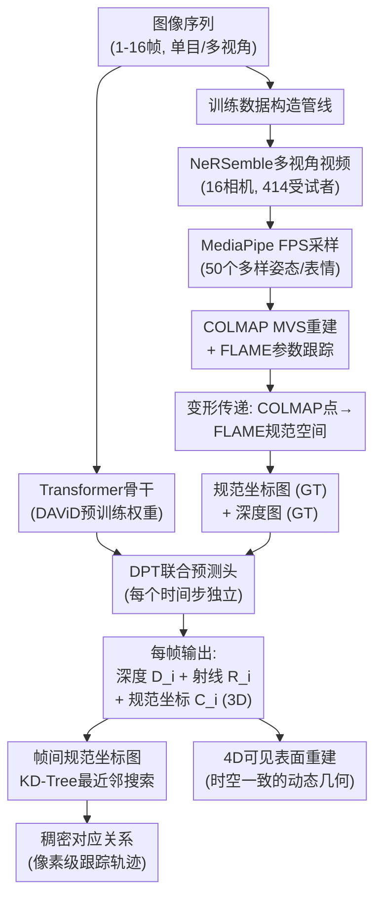

# Face Anything: 4D Face Reconstruction from Any Image Sequence

**会议**: ECCV2026  
**arXiv**: [2604.19702](https://arxiv.org/abs/2604.19702)  
**代码**: 无  
**领域**: 3D视觉  
**关键词**: 4D人脸重建, 规范坐标预测, 稠密跟踪, 前馈式网络, 对应关系估计

## 一句话总结

本文提出Face Anything，将4D人脸重建与跟踪统一为规范坐标预测问题——网络从任意图像序列中同时估计深度和规范人脸坐标，稠密对应关系直接通过在规范空间做最近邻搜索获得，无需显式建模帧间运动，在深度估计（RMSE降低16%）、对应关系精度（3倍提升）和推理效率（32倍加速）上全面超越现有方法。

## 研究背景与动机

从任意图像序列中重建动态人脸几何并建立帧间稠密对应，是虚拟数字人、远程临场和面部动画等领域的基础问题。这一任务本质上由两个耦合的子问题构成：一是恢复每帧的高精度面部几何（含皱纹、发丝、口腔内部等细节），二是在不同帧之间建立像素级对应关系以支持跟踪。近年来，前馈式3D重建模型（如DA3、VGGT、Pi3）已经能够从单张或多张图像准确预测深度和射线图，但它们不输出显式对应关系，无法直接用于跟踪。另一方面，基于参数化人脸模型的方法（如P3DMM）虽然能提供对应关系，但受限于FLAME等固定拓扑，无法表示拓扑之外的结构（头发、眼镜、口腔内部）。而以V-DPM为代表的运动场预测方法则通过预测点云在帧间的形变来建模运动，每次推理需要多次前向传播，计算开销大且在大幅度运动下容易丢失稳定跟踪。

现有方法的核心矛盾在于：几何重建与对应关系估计被视为两个独立的问题，各自使用不同的表示和网络结构，很难兼顾准确性与效率。更重要的是，以运动场（deformation field）为学习目标的范式本身存在根本性困难——形变目标随视点、表情幅度和运动复杂度剧烈变化，数据越长学习信号越稀疏。然而，人脸域有一个独特性质：不同身份、姿态和表情下人脸共享一个高度结构化的规范空间。如果能把每个像素映射到这个共享规范空间，帧间对应关系就能通过规范坐标的几何邻近性自然确定，而无需显式估计运动轨迹。

本文的切入角度是：既然人脸的规范几何在姿态和表情变化下保持稳定，就可以把跟踪问题转化为规范空间的重建问题。**核心 idea：提出规范坐标图预测（canonical map prediction）替代帧间运动预测——网络同时输出每帧的深度图和3D规范人脸坐标图，稠密对应关系直接通过对两帧的规范坐标做最近邻搜索获取。这一范式将动态跟踪简化为规范空间重建问题，一次前向传播即可同时获得时空一致的几何与稠密跟踪，在精度和效率上均显著超越运动场方法。**

## 方法详解

### 整体框架

Face Anything 的核心思路是用一个统一的前馈式Transformer网络，从任意数量（1-16帧）的图像序列中同时预测三张逐像素输出图：深度图 $D_i$、射线图 $R_i$ 和规范坐标图 $C_i$（每像素一个3D规范空间坐标）。网络主体继承DA3的Transformer架构，但增加了一个DPT风格的预测头用于联合输出。推理时，任意两帧之间的稠密对应关系通过对它们的规范坐标图做KD-Tree最近邻搜索即可获得，无需额外的运动建模或逐帧优化。训练数据方面，由于现有数据集缺乏规范的稠密对应关系标注，作者基于NeRSemble多视角视频构建了一套数据集，通过COLMAP多视角重建获得高精度几何、再用FLAME参数化跟踪将重建结果对齐到共享规范空间，为规范坐标提供逐像素监督。整体采用两阶段训练：先在DAViD单目人脸数据上预训练骨干网络以学习人脸几何先验，再在NeRSemble数据集上联合微调深度头与规范坐标头。

### 关键设计

**1. 规范坐标图：将稠密跟踪转化为规范空间重建**

这是本文最核心的范式转变。传统方法将稠密跟踪建模为运动场预测——学习一个函数 $T: p_i \to p_j$, 将帧 $i$ 中的像素映射到帧 $j$ 中的对应像素，这种映射随人脸姿态和表情变化剧烈，难以学习且泛化性差。本文的做法完全不同：为每个像素预测一个与姿态、表情无关的规范空间坐标 $C_i(p) \in \mathbb{R}^3$（定义在FLAME的中性姿态、中立表情、公制尺度坐标系下）。帧间对应关系退化为：

$$
\mathbf{q} = \arg\min_{\mathbf{q}' \in \Omega_j} \|C_i(\mathbf{p}) - C_j(\mathbf{q}')\|_2
$$

即用两帧规范坐标图做KD-Tree最近邻搜索即可。这个设计的巧妙之处在于三点：其一，规范空间的学习目标是静态的——任何人脸在任何姿态下的规范坐标都相似，不像运动场那样随帧间距变化；其二，对应关系是隐式定义的，无需显式建模运动动态，即使用来匹配相隔数十帧的长程对应也只需一次查询；其三，规范坐标同时编码了语义对应关系（鼻尖始终对应鼻尖）和几何位置信息（3D坐标可直接反投为3D点云），天然为下游任务（动画、变形迁移）提供了对齐基础。实验表明，该设计下EPE指标仅为运动场预测的约一半。

**2. 联合深度-规范坐标预测架构**

网络以一个1.2B参数的Transformer为骨干，由DA3扩展而来。核心改动是预测头：在原有的深度预测头基础上新增规范坐标预测头，两者共享同一个DPT-style网络结构，从相同的特征图中独立解码出深度图 $D_i$、射线图 $R_i$ 和规范坐标图 $C_i$。联合预测的关键动机是深度与规范坐标之间存在互补关系——两个像素在2D图像上接近但深度不同，它们的规范坐标也必然不同，因此深度信号为规范坐标的学习提供了重要的几何约束。反之，规范坐标在帧间的一致性又为深度估计提供了时间上的平滑先验。

训练采用两阶段策略。阶段一：在DAViD数据集（约10万张单目人脸图像）上预训练骨干与深度头，学习通用的人脸几何先验（深度感知能力）。阶段二：冻结部分骨干参数，新增规范坐标预测头，在NeRSemble数据集上联合微调全部输出头。训练过程中采用交替采样策略——同一时间戳的多视角图像（学习多视角几何一致性）与同一相机的多时间戳图像（学习时间对应关系）交替送入网络，这一设计有效缩小了多视角采集数据与实际单目视频之间的域差异，使模型能同时做好重建与跟踪。

**3. 基于COLMAP+FLAME的数据集构建与规范标注**

学习规范坐标面临的首要困难是缺少标注数据——没有现成数据集同时提供逐像素深度和规范空间对应关系。本文构建了一套从多视角视频生成规范坐标监督的完整管线。数据源采用NeRSemble（16台相机同步录制，414个受试者，覆盖不同身份和表情）。对每个受试者的所有序列，先用MediaPipe估计面部blendshape参数和头部姿态，再用最远点采样（FPS）选出50个最具多样性的时间戳（40个按blendshape差异、10个按姿态差异），保证表情变化和姿态变化的平衡覆盖。

选定时间戳后，对该时间戳的全部16个视角做COLMAP多视角立体重建，生成高精度深度图和稠密点云（调整了PatchMatchStereo参数使面覆盖率达到80.3%）。然后对每个受试者做FLAME参数化跟踪，得到每帧的FLAME拟合网格。关键步骤是将COLMAP点云的细粒度几何保留下来，同时对齐到FLAME规范空间：对COLMAP重建的每个3D点，取其最近FLAME顶点的形变向量，将该点由当前姿态变形到FLAME中性姿态、中立表情的规范坐标下。如此生成的规范点云既保留了COLMAP的高频几何细节（发丝、眼镜、口腔内部），又具备跨身份一致的语义对应关系。最终将规范点云反投回图像平面，即为逐像素的规范坐标监督信号。值得注意的是，尽管FLAME跟踪本身存在微小误差，网络在训练中会自行补偿这些对齐噪音，学习到比参数化模型更丰富的非FLAME拓扑结构。

### 损失函数 / 训练策略

对深度 $D$、射线 $R$、规范坐标 $C$ 各自的预测 $X$ 与真值 $X^*$，使用三类损失的组合：

- **回归损失** $\mathcal{L}_{\text{reg}}^X = \frac{1}{|\Omega|}\sum_{\mathbf{p}\in\Omega} |X(\mathbf{p})-X^*(\mathbf{p})|$：L1驱动学习
- **置信度加权损失** $\mathcal{L}_{\text{conf}}^X = \frac{1}{|\Omega|}\sum_{\mathbf{p}\in\Omega} (\gamma|X(\mathbf{p})-X^*(\mathbf{p})|W_X(\mathbf{p}) - \alpha\log W_X(\mathbf{p}))$：网络同时预测每像素置信度 $W_X$，自适应的不确定区域降权
- **梯度损失** $\mathcal{L}_{\text{grad}}^X = \frac{1}{|\Omega|}\sum_{\mathbf{p}\in\Omega} (|\nabla_x E_X(\mathbf{p})|+|\nabla_y E_X(\mathbf{p})|), E_X = X-X^*$：强制预测的空间平滑性

总损失 $\mathcal{L} = \lambda_C(\mathcal{L}_{\text{reg}}^C + \mathcal{L}_{\text{conf}}^C + \mathcal{L}_{\text{grad}}^C) + \sum_{X\in\{D,R\}}(\mathcal{L}_{\text{reg}}^X + \mathcal{L}_{\text{conf}}^X + \mathcal{L}_{\text{grad}}^X)$，其中 $\lambda_C=5$ 给规范坐标头更高权重（从头训练需更多梯度信号）。训练使用AdamW优化器，学习率从 $2\times10^{-5}$ 余弦退火至 $1\times10^{-8}$，bfloat16精度与梯度检查点节省显存，共90个epoch，每epoch 800个batch（最多48张图/batch）。

## 实验关键数据

### 主实验

| 任务 | 数据集 | 指标 | 本文 | 之前SOTA | 提升 |
|------|--------|------|------|----------|------|
| 单目深度估计(AbsRel×10) | NeRSemble | 图像/视频 | **0.040/0.038** | Sapiens-2B 0.048/0.048 | 17-21% |
| 单目深度估计(AbsRel×10) | Ava-256 | 图像/视频 | **0.048/0.048** | Pi3 0.066/0.071 | 27-32% |
| 2D稠密对应(EPE↓,无头发) | NeRSemble | Margin=2 | **1.719** | P3DMM 3.089 | 44% |
| 2D稠密对应(EPE↓,含头发) | NeRSemble | Margin=2 | **1.838** | P3DMM 5.550 | 67% |
| 循环一致性(CCE_mean↓) | VFHQ | Margin=5 | **0.398** | V-DPM 0.797 | 50% |
| 循环一致性(CCE_mean↓) | VFHQ | Margin=20 | **0.774** | V-DPM 1.348 | 43% |
| 3D跟踪EPE↓ | NeRSemble | Margin=1-10 | **0.005** | V-DPM 0.015 | 67% |
| 推理效率 | 40张图 | Runtime(s)↓ | **5** | V-DPM 160 | 32× |
| 推理峰值显存 | 单GPU | Memory(GB)↓ | **19** | V-DPM 40 | 53% |

### 消融实验

| 配置 | NeRSemble AbsRel(单目)↓ | EPE(2D)↓ | NeRSemble AbsRel(16视角)↓ | Camera Rot↓ |
|------|:---:|:---:|:---:|:---:|
| DA3基线（无规范头） | 0.085 | - | 0.076 | - |
| +DAViD预训练骨干 | 0.061 | - | 0.033 | - |
| 单目训练（固定视角变时间） | **0.054** | 3.031 | 0.064 | 0.038 |
| 静态训练（固定时间变视角） | 0.050 | 3.864 | **0.015** | 2.102 |
| 运动场预测替代规范坐标 | - | 6.210 | - | - |
| **本文完整设计** | 0.053 | **3.271** | **0.015** | **0.054** |

### 关键发现

- **规范坐标 vs 运动场的本质差距**：在消融中，显式预测帧间运动场的变体（Ours Motion Pred）EPE高达6.21，是规范坐标预测（3.27）的近两倍，直接验证了"规范空间重建比运动场预测更容易学习"的核心论点。
- **单目vs多视角深度联合优化**：单目训练（变时间戳+固定视角）在单目深度上表现好（AbsRel 0.054），但在多视角深度上差（0.064）；静态训练（变视角+固定时间戳）反之多视角好（0.015）但单目差（0.050）。最终设计同时交替两种采样，以微小牺牲单目深度换取了在所有指标上均衡最优。
- **规范坐标加权的重要性**：当 $\lambda_C=1$（与深度头同等权重）时EPE达4.03；提升至 $\lambda_C=5$ 时EPE降为3.27；进一步增至10时EPE略降但深度精度受损，说明 $\lambda_C=5$ 是最优折中。
- **推理效率的巨大优势**：40张图上V-DPM需160秒+40GB显存，本文仅需5秒+19GB显存（推理速度32倍，显存节省53%），且单GPU最大批处理量达470张（V-DPM仅74张）。这一效率优势源于规范坐标法不需要像运动场方法那样多次前向传播逐帧追踪。
- **流畅跟踪的时空一致性**：在长程对应（Margin=20）上本文CCE_median仅0.069（V-DPM为1.054、P3DMM为1.146），说明规范坐标在长时间尺度上保持了高度一致的语义对应，几乎不出现循环不一致。

## 亮点与洞察

- **"跟踪即重建"的范式简洁性**：将跟踪问题还原为重建问题是最优雅的部分——不需要任何运动建模、多步传播或测试时优化，一次前馈拿到规范坐标后最近邻搜索就完成了跟踪。这种"以不变应万变"的思路在动态场景中极为难得。
- **COLMAP细节保留+FLAME跨身份对齐的结合**：单独用COLMAP能得到高频几何但无法跨帧/跨身份对应；单独用FLAME能对齐但丢失拓扑外细节。本文通过变形传递将两者结合起来，既保留了COLMAP的发丝、眼镜、口腔细节，又得到了语义对齐的规范空间——这种数据构造策略本身就有很强的迁移价值。
- **规范坐标的隐式长程一致性**：实验显示，即使相隔20帧，规范坐标的最近邻匹配仍然高度准确（CCE_median=0.069），说明网络学到的规范空间对大幅度表情变化和长时间漂移具有内在鲁棒性，这是运动场方法难以做到的。
- **轻量高效的工程实践**：1.2B参数模型配合DPT头，在推理时5秒处理40帧（KD-Tree匹配不到0.2秒/对），显存仅19GB，模型设计本身兼顾了学术指标和实用部署需求。

## 局限与展望

- **领域限制**：方法专门为面部设计并依赖人脸几何先验，无法泛化到非面部场景；靠近脸部的非面部物体（麦克风、手、眼镜等）的规范坐标不可靠，会导致错误匹配。
- **极端条件下的退化**：在严重遮挡、极端视角（如侧面几乎看不见脸）以及大幅度头发运动下重建质量下降，规范坐标预测不稳定。
- **精细口腔跟踪不足**：虽然能覆盖口腔内部，但尚不能逐牙齿和舌头跟踪——这需要更高分辨率的内部结构监督。
- **未来方向**：论文提出两条有价值的扩展路线——一是将规范坐标预测推广到人体、动物等更通用的非刚体范畴，二将规范坐标与生成模型（如条件扩散、神经渲染）结合，从单目视频直接驱动可控面部动画和数字人生成。

## 相关工作与启发

- **vs DA3 (Depth Anything 3)**：DA3是本文的骨干基础，预测深度+射线图但不输出规范坐标，不支持跟踪。本文在DA3的基础上增加了规范坐标预测头并设计了联合训练策略，使同一个网络同时输出几何与对应关系。
- **vs V-DPM (Dynamic Point Maps)**：V-DPM通过预测帧间点云形变场来实现动态重建和跟踪，需要多次前向传播（一次/帧对），计算量大且长程跟踪不稳定。本文的规范坐标法只需一次前向传播，跟踪退化为最近邻搜索，在EPE（降67%）、推理速度（32倍）和显存（降53%）上全面超越。
- **vs P3DMM (Pixel3DMM)**：P3DMM预测FLAME表面的2D UV坐标，受限于FLAME的固定拓扑，无法表示头发、眼镜、口腔内部等非FLAME区域。本文预测3D规范坐标（非参数化），不受拓扑限制，含头发区域的EPE从5.55降至1.84（降67%）。
- **vs DAViD / Sapiens**：这些方法提供高质量单帧人脸几何预估但逐帧独立，没有帧间一致性机制。本文通过规范坐标的共享空间天然保证了时间一致性，不需要额外的时域后处理。
- **vs 3DGS头部分身方法**：与GaussianAvatars等需要每序列数小时优化的方法相比，本文无需测试时优化即可完成跟踪（27秒 vs ∼5-12小时），且EPE更低（5.20 vs 7.01-7.21）。

## 评分
- 新颖性: ⭐⭐⭐⭐⭐ [将跟踪明确转化为规范空间重建问题，范式转变清晰，在4D人脸领域首次实现前馈式统一重建+跟踪]
- 实验充分度: ⭐⭐⭐⭐⭐ [在NeRSemble、Ava-256、VFHQ、CelebV-HQ四个数据集上做了深度、2D跟踪、3D跟踪、效率、消融共9张实验表，消融设计覆盖规范坐标 vs 运动场、骨干冻结、损失权重等关键维度]
- 写作质量: ⭐⭐⭐⭐ [结构清晰，对比方法列出明确，Motivation层层递进；但范式命名和消融部分的基准对比可更直接]
- 价值: ⭐⭐⭐⭐⭐ [两阶段训练管线+数据集构造+SOTA效果，工程和学术价值都很高；论文提出的规范坐标范式有扩展到通用4D的潜力，且推理效率极高利于实际部署]

<!-- RELATED:START -->

## 相关论文

- [\[CVPR 2026\] FACE: A Face-based Autoregressive Representation for High-Fidelity and Efficient Mesh Generation](../../CVPR2026/3d_vision/face_a_face-based_autoregressive_representation_for_high-fidelity_and_efficient_.md)
- [\[ICLR 2026\] Pixel3DMM: Versatile Screen-Space Priors for Single-Image 3D Face Reconstruction](../../ICLR2026/3d_vision/pixel3dmm_versatile_screen-space_priors_for_single-image_3d_face_reconstruction.md)
- [\[ICLR 2026\] Trace Anything: Representing Any Video in 4D via Trajectory Fields](../../ICLR2026/3d_vision/trace_anything_representing_any_video_in_4d_via_trajectory_fields.md)
- [\[ICCV 2025\] FaceLift: Learning Generalizable Single Image 3D Face Reconstruction from Synthetic Heads](../../ICCV2025/3d_vision/facelift_learning_generalizable_single_image_3d_face_reconstruction_from_synthet.md)
- [\[ICLR 2026\] Depth Anything with Any Prior](../../ICLR2026/3d_vision/depth_anything_with_any_prior.md)

<!-- RELATED:END -->
